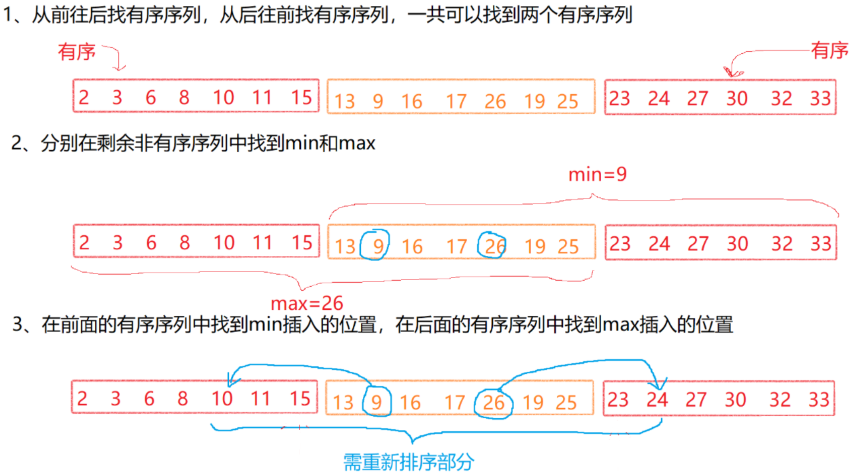

# 一、数组 ⭐

## 1、多数元素

>#169：https://leetcode-cn.com/problems/majority-element/  剑指offer39  HOT100  牛客TOP101
>
>算法思想：摩尔投票法 / 同归于尽法：数组中只要两个元素不相等，则两者同归于尽，最后剩下的一定是众数。

```
exmaple:   [1, 2, 3, 2, 2, 2, 5, 4, 2]
candidate:  1  1
cnt:		1  0 (1 和 2 同归于尽，1 的 cnt--)

exmaple:   [1, 2, 3, 2, 2, 2, 5, 4, 2]
candidate:  1  1  3  3  2  2  2  2  2 (最终答案)
cnt:		1  0  1  0  1  2  1  0  1
```

>- 时间复杂度：O(n)
>- 空间复杂度：O(1)

```java
public int majorityElement(int[] nums) {
    if (nums.length == 1) return nums[0];
    int candidate = nums[0];
    int cnt = 1;
    for (int i = 1; i < nums.length; i++) {
        int num = nums[i];
        if (cnt == 0) {
            candidate = num;
            cnt = 1;
            continue;
        }
        if (num == candidate)
            cnt++;
        else
            cnt--;
    }
    return candidate;
}
```

## 2、下一个排列

> \#31：https://leetcode-cn.com/problems/next-permutation/  HOT100

**2.1、暴力法**

> 求出全排列，再升序排序，找到当前排列的下一个排列。
>
> - 时间复杂度：O(n!)
> - 空间复杂度：O(n)

**2.2、一遍扫描**

> 如：nums = [6, 9, 1, 4, 8, 7, 5, 3]，下一个排列应该是 [6, 9, 1, 5, 3, 4, 7, 8]
>
> 算法思想：
>
> 1. 从后往前遍历数组 nums[]，找到第一个**升序对** <nums[i], nums[i+1]> (即 <4, 8>)，则 nums[i+1 ... end] 一定是**降序**的！
> 2. 在末尾的降序子序列中 (即 8, 7, 5, 3) 查找只比 nums[i] (即 4) **大**一丢丢的数 num[j] (即 5)，swap(nums[i], nums[j])；(此时 nums=[6, 9, 1, 5, 8, 7, 4, 3])
> 3. 将末尾降序子序列按升序排序。(此时 nums=[6, 9, 1, 5, 3, 4, 7, 8])
>
> - 时间复杂度：O(n)
> - 空间复杂度：O(1)

```java
public void nextPermutation(int[] nums) {
    int len = nums.length;
    int i = len - 2;
    // 1.从后向前找到第一个升序对的头元素 nums[i]
    while (i >= 0 && nums[i] >= nums[i + 1]) i--;
    // 2.若没找到，即特殊情况：nums[] 整体降序，只需将其排为升序返回即可
    if (i < 0) {
        // Arrays.sort(nums);
        reverse(nums, 0, len);    // O(n)
        return;
    }
    // 3.找到后，在末尾的降序子序列中查找比 nums[i] 大一丢丢的数 nums[j]，swap(nums[i], nums[j])
    int j = len - 1;
    while (j > i && nums[i] >= nums[j]) j--;      // 此处从后向前找，也可从前向后找
    swap(nums, i, j);
    // 4.末尾降序子序列升序排序
    // Arrays.sort(nums, i+1, len);
    reverse(nums, i + 1, len);     // O(n)
}

private void reverse(int[] nums, int start, int end) {
    for (int i = start, j = end - 1; i < j; i++, j--) {
        swap(nums, i, j);
    }
}

private void swap(int[] nums, int i, int j) {
    int temp = nums[i];
    nums[i] = nums[j];
    nums[j] = temp;
}
```

> 进阶：求上一个排列
>
> 如：nums = [6, 9, 1, 5, 3, 4, 7, 8]，上一个排列应该是 [6, 9, 1, 4, 8, 7, 5, 3]。
>
> 算法思想：
>
> 1. 从后往前遍历数组 nums[]，找到第一个**逆序对** <nums[i], nums[i+1]> (即 <5, 3>)，则 nums[i+1 ... end] 一定是**升序**的！
> 2. 在末尾的升序子序列中 (即 3, 4, 7, 8) 查找只比 nums[i] (即 5) **小**一丢丢的数 num[j] (即 4)，swap(nums[i], nums[j])；(此时 nums=[6, 9, 1, 4, 3, 5, 7, 8])
> 3. 将末尾升序子序列按降序排序。(此时 nums=[6, 9, 1, 4, 8, 7, 5, 3])

## 3、螺旋矩阵

> #54：https://leetcode-cn.com/problems/spiral-matrix/  剑指offer29  牛客HOT101  面试常考！
>
> - 时间复杂度：O(n<sup>2</sup>)
> - 空间复杂度：O(1)

```java
public List<Integer> spiralOrder(int[][] matrix) {
    List<Integer> list = new ArrayList<>();
    int top = 0, bottom = matrix.length - 1, left = 0, right = matrix[0].length - 1;
    while (top <= bottom && left <= right) {
        for (int i = left; i <= right; i++) list.add(matrix[top][i]);
        top++;
        for (int i = top; i <= bottom; i++) list.add(matrix[i][right]);
        right--;
        // top <= bottom 防止最后一次遍历后再走回头路，见输入示例2
        for (int i = right; i >= left && top <= bottom; i--) list.add(matrix[bottom][i]);
        bottom--;
        for (int i = bottom; i >= top && left <= right; i--) list.add(matrix[i][left]);
        left++;
    }
    return list;
}
```

## 4、把数组排成最小的数

> #剑指offer45：https://leetcode.cn/problems/ba-shu-zu-pai-cheng-zui-xiao-de-shu-lcof/description/  #179 排成最大的数
>
> 算法思想：本题就是比较字符串 a+b 和 b+a 的大小问题

```java
public String minNumber(int[] nums) {
    List<String> list = new ArrayList<>();
    for (int num : nums) {
        list.add(String.valueOf(num));
    }
    list.sort(((o1, o2) -> (o1 + o2).compareTo(o2 + o1)));
    return String.join("", list);
}
```

> 自定义排序：

```java
public String minNumber(int[] nums) {
    String[] strs = new String[nums.length];
    for (int i = 0; i < strs.length; i++) {
        strs[i] = String.valueOf(nums[i]);
    }
    quickSort(strs, 0, strs.length - 1);
    StringBuilder sb = new StringBuilder();
    for (String str : strs) {
        sb.append(str);
    }
    return sb.toString();
}

private void quickSort(String[] strs, int left, int right) {
    if (left >= right) return;
    // 元素 p 被放到其最终位置，p 左边的都是比 p 小的，p 右边的都是比 p 大的，所以对其左右分别递归
    int p = randomPartition(strs, left, right);
    quickSort(strs, left, p - 1);
    quickSort(strs, p + 1, right);
}

private int randomPartition(String[] strs, int left, int right) {
    int randomIndex = left + new Random().nextInt(right - left + 1);    // 生成随机数 ∈[left, right]
    swap(strs, left, randomIndex);
    return partition(strs, left, right);
}

private int partition(String[] strs, int left, int right) {
    String temp = strs[left];
    while (left < right) {
        // 从右到左找第一个比自己小的
        while (left < right && (strs[right] + temp).compareTo(temp + strs[right]) >= 0) right--;
        strs[left] = strs[right];
        // 从左到右找第一个比自己大的
        while (left < right && (strs[left] + temp).compareTo(temp + strs[left]) <= 0) left++;
        strs[right] = strs[left];
    }
    strs[left] = temp;    // left == right 时循环结束，将元素 p 放到其最终位置
    return left;
}

private void swap(String[] strs, int i, int j) {
    String temp = strs[i];
    strs[i] = strs[j];
    strs[j] = temp;
}
```

## 5、构建乘积数组

> #238：https://leetcode-cn.com/problems/gou-jian-cheng-ji-shu-zu-lcof/  HOT100  剑指offer66
>
> - 时间复杂度：O(n)
> - 空间复杂度：O(1)

```java
// 错误解答：一旦有元素为 0，则 product == 0
public int[] statisticalResult(int[] arr) {
    int product = 1;
    for (int i : arr) {
        product *= i;
    }
    for (int i = 0; i < arr.length; i++) {
        arr[i] = product / arr[i];
    }
    return arr;
}

public int[] statisticalResult(int[] arr) {
    int len = arr.length;
    int product = 1;
    int[] leftArr = new int[len];   // leftArr 保存 a[i] 左边的数的积 (不包括 i 自己)
    for (int i = 0; i < leftArr.length; i++) {
        leftArr[i] = product;
        product *= arr[i];
    }
    product = 1;
    int[] rightArr = new int[len];  // rightArr 保存 a[i] 右边的数的积 (不包括 i 自己)
    for (int i = rightArr.length - 1; i >= 0; i--) {
        rightArr[i] = product;
        product *= arr[i];
    }
    int[] resultArr = new int[len];
    for (int i = 0; i < resultArr.length; i++) {
        resultArr[i] = leftArr[i] * rightArr[i];
    }
    return resultArr;
}
```

## 6、原地哈希

### 6.1、数组中重复的数字

>#287：https://leetcode-cn.com/problems/shu-zu-zhong-zhong-fu-de-shu-zi-lcof/  HOT100  剑指offer3
>
>解法：可用哈希表、插入排序等；
>
>原地修改数组，算法思想：数组的元素 ∈ [0, n-1]，哈希函数 nums[i] = i；
>
>如：nums = [2, 3, 1, 0, 2, 5, 3]，原地哈希后，nums = [0, 1, 2, 3, 2, 5, 3]
>
>- 时间复杂度：O(n)
>- 空间复杂度：O(1)

```java
public int findRepeatNumber(int[] nums) {
    for (int i = 0; i < nums.length; i++) {
        while (nums[i] != i) {
            if (nums[i] == nums[nums[i]]) {
                return nums[i];
            }
            swap(nums, nums[i], i);
        }
    }
    return -1;
}

private void swap(int[] nums, int i, int j) {
    int temp = nums[i];
    nums[i] = nums[j];
    nums[j] = temp;
}
```

> 更优解：不修改数组；
>
> 双指针法：和 "环形链表" 一样，如：
>
> - 时间复杂度：O(n)
> - 空间复杂度：O(1)

```
   i    0 1 2 3 4
nums[i] 3 2 3 4 1

根据 i -> nums[i] 构建链表：
0 -> 3
1 -> 2
2 -> 3
3 -> 4
4 -> 1
          ______________
	  	 ↓              ↑
即：0 -> 3 -> 4 -> 1 -> 2	则环入口就是重复元素！
```

```java
public int findDuplicate(int[] nums) {
    int slow = 0;
    int fast = 0;
    while (true) {
        slow = nums[slow];
        fast = nums[nums[fast]];
        if (nums[slow] == nums[fast]) {  // 慢指针每次走一步，快指针每次走两步，快慢指针相遇，说明有环
            slow = 0;    // 相遇后，慢指针从头每次走一步，快指针也每次走一步，则快慢指针一定在环入口相遇
            while (nums[slow] != nums[fast]) {
                slow = nums[slow];
                fast = nums[fast];
            }
            return nums[slow];
        }
    }
}
```

### 6.2、缺失的第一个正数

> #41：https://leetcode.cn/problems/first-missing-positive/
>
> 算法思想：哈希函数：nums[i] = i + 1
>
> 如：nums = [3, -1, 4, 1]，原地哈希后，nums = [1, -1, 3, 4]，从左到右遍历 nums，发现 nums[1] != 2，即：缺失的是 2！
>
> 特殊情况：nums = [1, 2, 3]，原地哈希后，nums 不变，则返回 nums.length + 1；
> 
> 哈希过程：
> 
> - 先看 nums[0] = 3, 3 应该放到 nums[2], 所以 swap(nums, 0, 2)，变为 [4, -1, 3, 1]
> - 继续看当前位置 nums[0] 变成了 4，应该放到 nums[3], 所以 swap(nums, 0, 3)，变为 [1, -1, 3, 4]（换完之后，还要检查当前位置的数是否在它该在的位置）
>
> - 时间复杂度：O(n)
> - 空间复杂度：O(1)

```java
public int firstMissingPositive(int[] nums) {
    for (int i = 0; i < nums.length; i++) {
        // 条件控制 to 不越界
        // 用 while 而不是 if：因为换过来一个新数到当前位置 i，这个新数的目标位置并不是 i，还要继续换
        while (0 <= nums[i] - 1 && nums[i] - 1 <= nums.length - 1) {
            int to = nums[i] - 1;           // 目标位置（它的家）
            if (nums[to] == nums[i]) break; // 已在家 / 出现重复，会一直死循环 swap
            swap(nums, i, to);              // 交换，把当前数送回家，当前位置为新的数，要继续把这个新的数送回家，所以要 while
        }
    }
    for (int i = 0; i < nums.length; i++) {
        if (nums[i] != i + 1) return i + 1;
    }
    return nums.length + 1;
}

private void swap(int[] nums, int i, int j) {
    int temp = nums[i];
    nums[i] = nums[j];
    nums[j] = temp;
}
```

### 6.3、找到所有数组中消失的数字

> #448：https://leetcode-cn.com/problems/find-all-numbers-disappeared-in-an-array/  HOT100
>
> 难点在于空间复杂度要求 O(1)，不然直接一个哈希表怼上去！
>
> 算法思想：如 nums = [4, 3, 2, 7, 8, 2, 3, 1]

```java
nums[0] = 4，第 4 个数置为负，nums = [4,   3,  2, -7, 8, 2,  3,  1]，负号表示 4 存在，
nums[1] = 3，第 3 个数置为负，nums = [4,   3, -2, -7, 8, 2,  3,  1]
nums[2] = 2，第 2 个数置为负，nums = [4,  -3, -2, -7, 8, 2,  3,  1]
nums[3] = 7，第 7 个数置为负，nums = [4,  -3, -2, -7, 8, 2, -3,  1]
nums[4] = 8，第 8 个数置为负，nums = [4,  -3, -2, -7, 8, 2, -3, -1]
nums[5] = 2，第 2 个数置为负，nums = [4,  -3, -2, -7, 8, 2, -3, -1]
nums[6] = 3，第 3 个数置为负，nums = [4,  -3, -2, -7, 8, 2, -3, -1]
nums[7] = 1，第 1 个数置为负，nums = [-4, -3, -2, -7, 8, 2, -3, -1]
第 5、6 个数为正，答案为 5、6
```

> - 时间复杂度：O(n)
> - 空间复杂度：O(1)

```java
public List<Integer> findDisappearedNumbers(int[] nums) {
    List<Integer> list = new ArrayList<>();
    for (int i = 0; i < nums.length; i++) {
        int num = Math.abs(nums[i]);
        nums[num - 1] = -Math.abs(nums[num - 1]);
    }
    for (int i = 0; i < nums.length; i++) {
        if (nums[i] > 0)
            list.add(i + 1);
    }
    return list;
}
```

> 也可用上一题代码：

```java
    public List<Integer> findDisappearedNumbers(int[] nums) {
    List<Integer> list = new ArrayList<>();
    for (int i = 0; i < nums.length; i++) {
        // 条件控制 to 不越界
        // 用 while 而不是 if：因为换过来一个新数到当前位置 i，这个新数的目标位置并不是 i，还要继续换
        while (0 <= nums[i] - 1 && nums[i] - 1 <= nums.length - 1) {
            int to = nums[i] - 1;           // 目标位置（它的家）
            if (nums[to] == nums[i]) break; // 已在家 / 出现重复，会一直死循环 swap
            swap(nums, i, to);              // 交换，把当前数送回家，当前位置为新的数，要继续把这个新的数送回家，所以要 while
        }
    }
    for (int i = 0; i < nums.length; i++) {
        if (nums[i] != i + 1) list.add(i + 1);
    }
    return list;
}
```

## 7、最短无序连续子数组

> #581：https://leetcode-cn.com/problems/shortest-unsorted-continuous-subarray/  HOT100
>
> - 时间复杂度：O(n)
> - 空间复杂度：O(1)



```java
public int findUnsortedSubarray(int[] nums) {
    int len = nums.length;

    int left = 0;
    int right = len - 1;
    while (left + 1 < len && nums[left] <= nums[left + 1]) left++;
    if (left == len - 1) return 0;	// 数组本来就有序，直接返回 0
    while (right - 1 > 0 && nums[right] >= nums[right - 1]) right--;

    int min = Integer.MAX_VALUE;
    int max = Integer.MIN_VALUE;
    for (int i = 0; i <= right; i++) max = Math.max(max, nums[i]);
    for (int i = left; i < len; i++) min = Math.min(min, nums[i]);

    int index1 = 0;
    for (; index1 < len; index1++) {
        if (nums[index1] <= min) continue;
        else break;
    }
    int index2 = len - 1;
    for (; index2 >= 0; index2--) {
        if (nums[index2] >= max) continue;
        else break;
    }
    return index2 - index1 + 1;
}
```

## 8、根据身高重建队列

> #406：https://leetcode-cn.com/problems/queue-reconstruction-by-height/  HOT100
>
> 算法思想：像这种输入是数对的，要么是图，要么排序。
>
> 按**第一项降序，第二项升序**对 people 排序，如排序后：[[7,0], [7,1], [6,1], [5,0], [5,2], [4,4]]
>
> 排序后，就可以按第二项进行插入：
>
> - 插入[7,0]：[[7,0]]
> - 插入[7,1]：[[7,0], [7,1]]
> - 插入[6,1]：[[7,0], [6,1], [7,1]]
> - 插入[5,0]：[[5,0], [7,0], [6,1], [7,1]]
> - 插入[5,2]：[[5,0], [7,0], [5,2], [6,1], [7,1]]
> - 插入[4,4]：[[5,0], [7,0], [5,2], [6,1], [4,4], [7,1]]

---

> - 时间复杂度：O(n<sup>2</sup>)
> - 空间复杂度：O(n)

```java
public int[][] reconstructQueue(int[][] people) {
    // 第一项降序，第二项升序
    Arrays.sort(people, (o1, o2) -> o1[0] == o2[0] ? o1[1] - o2[1] : o2[0] - o1[0]);
    List<int[]> list = new ArrayList<>();
    for (int[] person : people) {
        list.add(person[1], person);	// O(n^2)
    }
    return list.toArray(new int[0][]);
}
```

> 手撕二维快排：

```java
private void quickSort(int[][] matrix, int left, int right) {
    if (left >= right) return;
    // 元素 p 被放到其最终位置，p 左边的都是比 p 小的，p 右边的都是比 p 大的，所以对其左右分别递归
    int p = randomPartition(matrix, left, right);
    quickSort(matrix, left, p - 1);
    quickSort(matrix, p + 1, right);
}

private int randomPartition(int[][] matrix, int left, int right) {
    int randomIndex = left + new Random().nextInt(right - left + 1);    // 生成随机数 ∈[left, right]
    swap(matrix, left, randomIndex);
    return partition(matrix, left, right);
}

private int partition(int[][] matrix, int left, int right) {
    int[] temp = new int[2];
    temp[0] = matrix[left][0];
    temp[1] = matrix[left][1];

    while (left < right) {
        while (left < right && compare(temp, matrix[right])) right--;    // 从右到左找第一个比自己小的
        matrix[left][0] = matrix[right][0];
        matrix[left][1] = matrix[right][1];
        while (left < right && compare(matrix[left], temp)) left++;      // 从左到右找第一个比自己大的
        matrix[right][0] = matrix[left][0];
        matrix[right][1] = matrix[left][1];
    }
    matrix[left][0] = temp[0];    // left == right 时循环结束，将元素 p 放到其最终位置
    matrix[left][1] = temp[1];
    return left;
}

private void swap(int[][] matrix, int i, int j) {
    int[] temp = matrix[i];
    matrix[i] = matrix[j];
    matrix[j] = temp;
}

// 第一项降序，第二项升序
private boolean compare(int[] nums1, int[] nums2) {
    if (nums1[0] == nums2[0]) {
        return nums1[1] < nums2[1];
    } else {
        return nums2[0] < nums1[0];
    }
}
```

## 9、除法求值

>#399：https://leetcode-cn.com/problems/evaluate-division/  HOT100
> 算法思想：构建邻接矩阵，equations 的字符串作为点，商 values 作为矩阵元素的值，用 Floyd 算法求最短路径
>- 时间复杂度：O(n<sup>3</sup>)
>- 空间复杂度：O(n<sup>2</sup>)

```java
public double[] calcEquation(List<List<String>> equations, double[] values, List<List<String>> queries) {
    // 将所有字母映射成整数下标
    Map<String, Integer> map = new HashMap<>();
    int index = 0;
    for (List<String> equation : equations) {
        for (String s : equation) {
            if (!map.containsKey(s))
                map.put(s, index++);
        }
    }
    // 用邻接矩阵表示图
    double[][] graph = new double[index][index];
    for (int i = 0; i < index; i++) {
        Arrays.fill(graph[i], -1.0);
        graph[i][i] = 1.0;
    }

    index = 0;
    for (List<String> equation : equations) {
        String a = equation.get(0);
        String b = equation.get(1);
        Integer index1 = map.get(a);
        Integer index2 = map.get(b);
        double value = values[index++];
        graph[index1][index2] = value;
        graph[index2][index1] = 1 / value;
    }

    // Floyd 算法
    for (int k = 0; k < graph.length; k++) {
        for (int i = 0; i < graph.length; i++) {
            for (int j = 0; j < graph.length; j++) {
                // ij 没有联通 && ik 联通了 &&  kj 联通了 -> ij 可以联通
                if (graph[i][j] == -1.0 && graph[i][k] != -1.0 && graph[k][j] != -1.0)
                    graph[i][j] = graph[i][k] * graph[k][j];
            }
        }
    }

    index = 0;
    double[] arr = new double[queries.size()];
    for (List<String> query : queries) {
        String a = query.get(0);
        String b = query.get(1);
        if (map.containsKey(a) && map.containsKey(b)) {
            Integer index1 = map.get(a);
            Integer index2 = map.get(b);
            arr[index++] = graph[index1][index2];
        } else
            arr[index++] = -1.0;
    }
    return arr;
}
```

## 10、对角线遍历

> #498：https://leetcode.cn/problems/diagonal-traverse/
>
> 算法思想：把所有对角线都看成 ↗，不要 ↙，最后再将一部分 ↗ 逆转为 ↙；可以发现，所有↗的起点都位于第一列、最后一行！
>
> - 时间复杂度：O(row * col)
> - 空间复杂度：O(row * col)

```java
public int[] findDiagonalOrder(int[][] mat) {
    int row = mat.length;
    int col = mat[0].length;
    List<List<Integer>> lists = new ArrayList<>();
    // 起点位于第一列
    for (int i = 0; i < row - 1; i++) {
        int x = i;
        int y = 0;
        List<Integer> list = new ArrayList<>();
        while (x >= 0 && y < col) list.add(mat[x--][y++]);
        lists.add(list);
    }
    // 起点位于最后一行
    for (int i = 0; i < col; i++) {
        int x = row - 1;
        int y = i;
        List<Integer> list = new ArrayList<>();
        while (x >= 0 && y < col) list.add(mat[x--][y++]);
        lists.add(list);
    }
    int[] arr = new int[row * col];
    int k = 0;
    for (int i = 0; i < lists.size(); i++) {
        List<Integer> list = lists.get(i);
        if (i % 2 == 0) {    // ↗
            for (Integer num : list) arr[k++] = num;
        } else {             // ↙
            Collections.reverse(list);
            for (Integer num : list) arr[k++] = num;
        }
    }
    return arr;
}
```

> 优化：对角线一共有 row + col - 1 条，将其编号为 [0, row + col - 1]；
>
> 对于第 i 条 ↗，if (i < row)，说明起点在第一列，起点为 (i, 0)；否则起点在最后一行，起点为 (row - 1, i - row + 1)；
>
> 对于第 i 条 ↙，if (i < col)，说明起点在第一行，起点为 (0, i)；否则起点在最后一列，起点为 (i - col + 1, col - 1)；
>
> - 时间复杂度：O(row * col)
> - 空间复杂度：O(1)

```java
public int[] findDiagonalOrder(int[][] mat) {
    int row = mat.length;
    int col = mat[0].length;
    int[] arr = new int[row * col];
    int k = 0;
    for (int i = 0; i < row + col - 1; i++) {
        if (i % 2 == 0) {  // ↗
            if (i < row) {
                int x = i;
                int y = 0;
                while (x >= 0 && y < col) arr[k++] = mat[x--][y++];
            } else {
                int x = row - 1;
                int y = i - row + 1;
                while (x >= 0 && y < col) arr[k++] = mat[x--][y++];
            }
        } else {           // ↙
            if (i < col) {
                int x = 0;
                int y = i;
                while (x < row && y >= 0) arr[k++] = mat[x++][y--];
            } else {
                int x = i - col + 1;
                int y = col - 1;
                while (x < row && y >= 0) arr[k++] = mat[x++][y--];
            }
        }
    }
    return arr;
}

// 用三目运算符优化：
public int[] findDiagonalOrder(int[][] mat) {
    int row = mat.length;
    int col = mat[0].length;
    int[] arr = new int[row * col];
    int k = 0;
    for (int i = 0; i < row + col - 1; i++) {
        if (i % 2 == 0) {  // ↗
            int x = i < row ? i : row - 1;
            int y = i < row ? 0 : i - row + 1;
            while (x >= 0 && y < col) arr[k++] = mat[x--][y++];
        } else {           // ↙
            int x = i < col ? 0 : i - col + 1;
            int y = i < col ? i : col - 1;
            while (x < row && y >= 0) arr[k++] = mat[x++][y--];
        }
    }
    return arr;
}
```

## 11、小于 n 的最大数

> 给定一个个位数数组 nums = {2，4，9}，n = 23322，使用数组里面的元素组成最大的，且小于 n 的整数是多少？字节高频

```java
@Test
public void test() {
    System.out.println(getMaxLessN(new int[]{2, 3, 9}, 24378));      // 23999
    System.out.println(getMaxLessN(new int[]{2, 4, 9}, 24223));      // 24222
    System.out.println(getMaxLessN(new int[]{2, 4, 9}, 23121));      // 22999
    System.out.println(getMaxLessN(new int[]{2, 3, 6, 8}, 2413));    // 2388
    System.out.println(getMaxLessN(new int[]{6, 8}, 300));           // 88
    System.out.println(getMaxLessN(new int[]{5, 4, 8, 2}, 5416));    // 5288
}

public String getMaxLessN(int[] nums, int N) {
    N--;    // 若结果可以和 N 相等，则删除这一行！
    Deque<Integer> stack = new ArrayDeque<>();
    Arrays.sort(nums);
    int max = nums[nums.length - 1];
    String s = String.valueOf(N);
    for (int i = 0; i < s.length(); i++) {
        int curDigit = s.charAt(i) - '0';
        int curIdx = getMaxLessIdx(nums, curDigit);
        // 当前数字比 nums[] 中的所有数都小，如 {5, 4, 8, 2}, 5416，第三位 1 比 nums[] 都小，则结果的第 2 位不能是 4！
        if (curIdx == -1) {
            while (!stack.isEmpty()) {
                // 结果的第 2 位不能是 4，把 4 pop 掉，选一个比 4 小的
                Integer top = stack.pop();
                int beforeIdx = getMaxLessIdx(nums, top - 1);
                // 如果没有比 4 小的，则结果的第 1 位不能是 5！继续回溯（出栈表示回溯）
                if (beforeIdx == -1) continue;
                stack.push(nums[beforeIdx]);
                break;
            }
            // 栈为空，说明 N 的每一位都 < min(nums[])，如 {3, 4, 5}, 212，则结果不能是 3 位，必须是 2 位，即结果为 55
            if (stack.isEmpty()) {
                for (int j = 0; j < s.length() - 1; j++) {
                    stack.push(max);
                }
            } else {
                // {5, 4, 8, 2}, 5416，结果的前两位不能为 54，因为第三位是 1，比 nums[] 都小！所以前两位改为 52，则后面的都用最大值填充，即 5288
                int count = s.length() - stack.size();
                for (int j = 0; j < count; j++) {
                    stack.push(max);
                }
            }
            break;
        } else if (nums[curIdx] == curDigit) {
            // 相等，比较下一位
            stack.push(curDigit);
        } else if (nums[curIdx] < curDigit) {
            // {2, 3, 9}, 24378，第二位 3 < 4，所以后面直接补最大值，结果为 23999，
            stack.push(nums[curIdx]);
            for (; i < s.length() - 1; i++) {
                stack.push(max);
            }
            break;
        }
    }

    int res = 0, count = 1;
    while (!stack.isEmpty()) {
        res += stack.peek() * count;
        count *= 10;
        stack.pop();
    }
    return String.valueOf(res);
}

// 从 nums[] 中找到最大的 <= target 的元素，返回其下标
private int getMaxLessIdx(int[] nums, int target) {
    int left = 0, right = nums.length - 1;
    while (left < right) {
        int mid = left + (right - left + 1) / 2;
        if (nums[mid] == target) return mid;
        if (nums[mid] < target) left = mid;
        else right = mid - 1;
    }
    return nums[left] <= target ? left : -1;
}
```

# 二、二分查找

> 算法思想：分治；
>
> 循环实现：
>
> - 时间复杂度：O(log n)
> - 空间复杂度：O(1)
>
> 递归实现：
>
> - 时间复杂度：O(log n)
> - 空间复杂度：O(log n)

```java
// 1.闭区间
public int binarySearch(int[] nums, int target) {
    int left = 0;
    int right = nums.length - 1;
    while (left <= right) {
        int mid = left + (right - left) / 2;
        if (nums[mid] == target)
            return mid;
        else if (nums[mid] < target)
            left = mid + 1;
        else
            right = mid - 1;
    }
    return -1;    // return left：返回插入位置
}

// 2.左闭右开，求插入位置还是用闭区间吧
// 2.1 版本1
public int binarySearch(int[] nums, int target) {
    int left = 0;
    int right = nums.length - 1;
    while (left < right) {
        int mid = left + (right - left) / 2;
        if (nums[mid] >= target)
            right = mid;    // 若 nums[] 中包含多个 target，此模板查找的是最左 target (继续逼近于左边界)
        else
            left = mid + 1;
    }
    return nums[left] == target ? left : -1;	// 循环结束后 left == right，若 target 不存在，返回 -1
}
// 2.2 版本2
public int binarySearch(int[] nums, int target) {
    int left = 0;
    int right = nums.length - 1;
    while (left < right) {
        // left = mid, right = mid - 1 时，计算 mid 要 + 1，不然死循环
        int mid = left + (right - left + 1) / 2;
        if (nums[mid] <= target)
            left = mid;    // 若 nums[] 中包含多个 target，此模板查找的是最右 target (继续逼近于右边界)
        else
            right = mid - 1;
    }
    return nums[left] == target ? left : -1;
}
```

## 1、爱吃香蕉的珂珂

> #875：https://leetcode-cn.com/problems/koko-eating-bananas/
>
> 算法思想：暴力法时间复杂度 O(n × max)，暴力法是顺序遍历 [1, max] 中的所有数，所以可以用二分法改进！

```java
int minEatingSpeed(int[] piles, int h) {
    int max = getMax(piles);
    for (int speed = 1; speed < max; speed++) {
        if (canFinish(piles, speed, h))	   // 以 speed 能否在 h 小时内吃完香蕉
            return speed;
    }
    return max;
}
```

> 二分法：
>
> - 时间复杂度：O(n log max)
> - 空间复杂度：O(1)

```java
public int minEatingSpeed(int[] piles, int h) {
    int max = Integer.MIN_VALUE;
    for (int pile : piles) {
        max = Math.max(max, pile);
    }
    int left = 1;
    int right = max;
    while (left < right) {
        int mid = left + (right - left) / 2;
        if (getTime(mid, piles) <= h) {
            right = mid;
        } else {
            left = mid + 1;
        }
    }
    return left;
}

private long getTime(int speed, int[] piles) {
    long time = 0;
    for (int pile : piles) {
        if (pile % speed == 0) {
            time += pile / speed;
        } else {
            time += pile / speed + 1;
        }
    }
    return time;
}
```

## 2、寻找旋转排序数组中的最小值 ⭐

> #153：https://leetcode-cn.com/problems/find-minimum-in-rotated-sorted-array/	剑指offer11
>
> 算法思想：

```java
if (nums[mid] > nums[right])	// 如左图，说明最小值在 mid 右边
else							// 如右图，说明最小值在 mid 左边
// 注意：if (nums[mid] > nums[left]) ，如左图，也能说明最小值在 mid 右边，为什么不用这个条件？
// 1.若输入数组本来就升序，此时应该将右边界向左收缩，因此比较 nums[mid] 和 nums[right]
// 2.比较 nums[mid] 和 nums[left] 需要考虑的边界条件比较多
```

> - 时间复杂度：O(log n)
> - 空间复杂度：O(1)


```java
public int findMin(int[] nums) {
    int left = 0;
    int right = nums.length - 1;
    while (left < right) {
        int mid = left + (right - left) / 2;
        if (nums[mid] > nums[right])
            left = mid + 1;
        else
            right = mid;
    }
    return nums[left];
}
// 若让求最大值，如果最小值是 nums[i]，则最大值是 nums[i-1]；如果最小值在 nusm[0]，则最大值在 nums[end]
```

## 3、寻找旋转排序数组中的最小值 II ⭐

> #154：https://leetcode-cn.com/problems/find-minimum-in-rotated-sorted-array-ii/	剑指offer11    牛客TOP101
>
> 上一题元素不重复，这一题有重复！
>
> - 时间复杂度：O(log n)
> - 空间复杂度：O(1)

```java
public int findMin(int[] nums) {
    int left = 0;
    int right = nums.length - 1;
    while (left < right) {
        int mid = left + (right - left) / 2;
        if (nums[mid] == nums[right])
            right--;    // 注意这里，去重，该代码也可以直接用于上一题，最坏 O(n)
        else if (nums[mid] > nums[right])
            left = mid + 1;
        else
            right = mid;
    }
    return nums[left];
}
```

## 4、搜索旋转排序数组 ⭐

> #33：https://leetcode-cn.com/problems/search-in-rotated-sorted-array	HOT100
>
> - 时间复杂度：O(log n)
> - 空间复杂度：O(1)
>
> 法一：由上一题可求出数组的最小值点 minIndex，也就是旋转点，在 [0, minIndex - 1] 和 [minIndex, n - 1] 上分别二分查找即可。

```java
public int search(int[] nums, int target) {
    int minIndex = findMin(nums);
    int res1 = binarySearch(nums, 0, minIndex - 1, target);
    int res2 = binarySearch(nums, minIndex, nums.length - 1, target);
    return res1 != -1 ? res1 : res2;
}

public int binarySearch(int[] nums, int start, int end, int target) {
    int left = start;
    int right = end;
    while (left < right) {
        int mid = left + (right - left) / 2;
        if (nums[mid] >= target)
            right = mid;
        else
            left = mid + 1;
    }
    return nums[left] == target ? left : -1;
}
```

> 法二：
>
> 算法思想：将数组一分为二，其中一段一定有序，另一段可能有序，也可能部分有序！在有序的一段二分查找，无序的一段再一分为二，其中一段一定有序，另一段可能有序，也可能部分有序！如此循环！


```java
// 以下代码会死循环，因为同时使用了二分查找版本 1 和版本 2，
// 但求 mid 时，没法兼顾 left + (right - left) / 2 和 left + (right - left + 1) / 2
public int search(int[] nums, int target) {
    int left = 0;
    int right = nums.length - 1;
    while (left < right) {
        int mid = left + (right - left) / 2;
        if (nums[mid] > nums[right]) {
            if (nums[left] < target && target < nums[mid])	 	// mid 左边有序
                right = mid - 1;
            else
                left = mid;
        } else {												// mid 右边有序
            if (nums[mid] < target && target < nums[right])	
                left = mid + 1;
            else
                right = mid;
        }
    }
    return nums[left] == target ? left : -1;
}
```

```java
// 解决办法：找到 target 时立即返回，避免两个版本同时出现！
public int search(int[] nums, int target) {
    int left = 0;
    int right = nums.length - 1;
    while (left < right) {
        int mid = left + (right - left) / 2;
        if (nums[mid] == target) return mid;                    // 找到 target 时立即返回
        if (nums[mid] > nums[right]) {                          // mid 左边有序
            if (nums[left] <= target && target < nums[mid])     // target 在 mid 左边
                right = mid - 1;
            else                                                // target 在 mid 右边
                left = mid + 1;
        } else {                                                // mid 右边有序
            if (nums[mid] < target && target <= nums[right])    // target 在 mid 右边
                left = mid + 1;
            else                                                // target 在 mid 左边
                right = mid - 1;
        }
    }
    return nums[left] == target ? left : -1;
}
```

## 5、搜索旋转排序数组 II

> #81：https://leetcode.cn/problems/search-in-rotated-sorted-array-ii/
>
> 上一题元素不重复，这一题有重复！
>
> 特殊情况 search([1,1,1,1,1,1,1,1,1,1,1,1,1,2,1,1,1,1,1], 2)：nums[mid] == nums[right]，无法判断哪个区间是有序的，则 right--；
>
> - 时间复杂度：O(log n)，最差 O(n)
> - 空间复杂度：O(1)

```java
public boolean search(int[] nums, int target) {
    int left = 0;
    int right = nums.length - 1;
    while (left < right) {
        int mid = left + (right - left) / 2;
        if (nums[mid] == target) return true;
        // 比上一题多了这个 if，最差 O(n)！
        // 相等，说明不知道 nums[] 哪一半有序
        if (nums[mid] == nums[right]) {    
            right--;
        } else if (nums[mid] > nums[right]) {                   // mid 左边有序
            if (nums[left] <= target && target < nums[mid])     // target 在 mid 左边
                right = mid - 1;
            else                                                // target 在 mid 右边
                left = mid + 1;
        } else {                                                // mid 右边有序
            if (nums[mid] < target && target <= nums[right])    // target 在 mid 右边
                left = mid + 1;
            else                                                // target 在 mid 左边
                right = mid - 1;
        }
    }
    return nums[left] == target;
}
```

## 6、山脉数组的峰顶索引

> #852：https://leetcode.cn/problems/peak-index-in-a-mountain-array/
>
> - 时间复杂度：O(log n)
> - 空间复杂度：O(1)

```java
// 找最大值的下标
public int peakIndexInMountainArray(int[] nums) {
    int left = 0;
    int right = nums.length - 1;
    while (left < right) {
        int mid = left + (right - left) / 2;
        if (nums[mid] > nums[mid + 1])	// 不用担心溢出，因为 nums[0] 和 nums[end] 不可能是山峰！
            right = mid;
        else
            left = mid + 1;
    }
    return left;
}
```

## 7、寻找峰值 ⭐

> #162：https://leetcode-cn.com/problems/find-peak-element/    牛客TOP101
>
> 算法思想：画个连续的、有多个极大值点的曲线，其中 f(-1) = f(n) = -∞，会发现：
>
> - 若 f(x) > f(x + 1)，则在 [0, x] 必定存在极大值；
> - 若 f(x) ≤ f(x + 1)，则在 [x + 1, n] 必定存在极大值。
>
> ---
>
> - 时间复杂度：O(log n)
> - 空间复杂度：O(1)

```java
public int findPeakElement(int[] nums) {
    if (nums.length == 1 || nums[0] > nums[1]) return 0;
    int left = 0;
    int right = nums.length - 1;
    while (left < right) {
        int mid = left + (right - left) / 2;
        if (nums[mid] > nums[mid + 1])
            right = mid;
        else
            left = mid + 1;
    }
    return left;
}
```

## 8、0～n-1 中缺失的数字 ⭐

> #剑指offer53 - II. https://leetcode-cn.com/problems/que-shi-de-shu-zi-lcof/
>
> - 时间复杂度：O(log n)
> - 空间复杂度：O(1)

```java
public int missingNumber(int[] nums) {
    if (nums[nums.length - 1] == nums.length - 1) return nums.length;
    int left = 0;
    int right = nums.length - 1;
    while (left < right) {
        int mid = left + (right - left) / 2;
        if (nums[mid] == mid)   // mid 左边不缺数字
            left = mid + 1;
        else                    // mid 左边缺数字
            right = mid;
    }
    return left;
}
```

## 9、寻找两个正序数组的中位数 ⭐

> #4：https://leetcode-cn.com/problems/median-of-two-sorted-arrays/	HOT100	字节、微软、美团、百度

**1、双指针**

>边界条件处理起来太恶心了，其实可以将两个数组合并到一个数组，中位数直接取新数组的下标，代码更简单，但空间复杂度 O(len1 + len2)
>
>- 时间复杂度：O(len1 + len2)
>- 空间复杂度：O(1)

```java
public double findMedianSortedArrays(int[] nums1, int[] nums2) {
    int len1 = nums1.length;
    int len2 = nums2.length;

    int idx1 = (len1 + len2 - 1) / 2;	// 第一个中位数下标
    int idx2 = (len1 + len2) / 2;	    // 第二个中位数下标
    int mid1 = 0;						// 第一个中位数
    int mid2 = 0;						// 第二个中位数

    int i = 0;
    int j = 0;
    int step = 0;

    while (i < nums1.length && j < nums2.length) {
        if (nums1[i] < nums2[j]) {
            if (step == idx1) mid1 = nums1[i];
            if (step == idx2) mid2 = nums1[i];
            i++;
        } else {
            if (step == idx1) mid1 = nums2[j];
            if (step == idx2) mid2 = nums2[j];
            j++;
        }
        step++;
    }
    while (i < nums1.length) {
        if (step == idx1) mid1 = nums1[i];
        if (step == idx2) mid2 = nums1[i];
        i++;
        step++;
    }
    while (j < nums2.length) {
        if (step == idx1) mid1 = nums2[j];
        if (step == idx2) mid2 = nums2[j];
        j++;
        step++;
    }
    return (mid1 + mid2) / 2.0;
}
```

**2、二分法**

>- 时间复杂度：O(log n)
>- 空间复杂度：O(1)，尾递归！
>
>算法思想：找中位数，就是找第 k 小的数！
>
>找中位数的小技巧：k = [(len+1) / 2 + (len+2) / 2] / 2，在数组中第 k 小的数即为中位数 (k 从 1 计数)，不管 len 为奇数还是偶数都成立，避免了分情况讨论！
>
>对于以下两个数组，其中位数为 (第 7 小数 + 第 8 小数) / 2，下面演示求第 7 小数的过程：

---

> 数组起始位置：start1 = 0，start2 = 0；
>
> 记 midVal1 = nums1[start1 + k/2 - 1]，midVal2 = nums2[start2 + k/2 - 1]，
>
> midVal1 > midVal2，所以 midVal2 及其左边的数一定都不是第 7 小的数，直接排除！


>排除了 3 个数，start1 = 0，start2 = 3，接下来要在剩余数字中找第 7 - 3 = 4 小的数：


>排除了 2 个数，start1 = 2，start2 = 3，接下来要找第 k = 2 小的数：


>上图 midVal1 = midVal2，排除哪个都行，假设排除 midVal2，start1 = 2，start2 = 4；
>
>排除了 1 个数，所以要找第 k = 1 小的数：
>
>nums1[start1] < nums2[start2]，所以选 nums1[start1 = 4 就是第 7 小的数！


> 特殊情况：nums1.length < k/2，
>
> 或者经历很多步后，nums1 除去被排除的元素，剩下的元素少于 k/2，即：nums1[start1 ...].length < k/2；
>
> 此时 nums1 中所有剩下元素要排除吗？要看这些元素的和 midVal2 的大小，太麻烦，直接这样做更简单：
>
> 不排除 nums1 的元素，排除 nums2，再次递归进入，递归次数越多，k 越小，
>
> 到 nums1 剩下的元素少于 k/2 时，自动会决定 nums1 的元素是排除还是保留！


```java
public double findMedianSortedArrays(int[] nums1, int[] nums2) {
    int len1 = nums1.length;
    int len2 = nums2.length;
    int k1 = (len1 + len2 + 1) / 2;
    int k2 = (len1 + len2 + 2) / 2;
    // 分别找第 k1 小的数、第 k2 小的数
    return (getKth(nums1, 0, nums2, 0, k1) + getKth(nums1, 0, nums2, 0, k2)) / 2;
}

private double getKth(int[] nums1, int start1, int[] nums2, int start2, int k) {
    if (start1 >= nums1.length) {    // nums1 的元素都排除完了，为空数组，直接到 nums2 中找
        return nums2[start2 + k - 1];
    }
    if (start2 >= nums2.length) {    // nums2 的元素都排除完了，为空数组，直接到 nums1 中找
        return nums1[start1 + k - 1];
    }
    if (k == 1) {
        return Math.min(nums1[start1], nums2[start2]);
    }
    // 可能发生数组越界！见算法思想的 "特殊情况"，取 Integer.MAX_VALUE 是为了当前数组不排除元素，直接进入下一次递归
    int midVal1 = (start1 + k / 2 - 1) < nums1.length ? nums1[start1 + k / 2 - 1] : Integer.MAX_VALUE;
    int midVal2 = (start2 + k / 2 - 1) < nums2.length ? nums2[start2 + k / 2 - 1] : Integer.MAX_VALUE;
    if (midVal1 > midVal2) {
        return getKth(nums1, start1, nums2, start2 + k / 2, k - k / 2);
    } else {
        return getKth(nums1, start1 + k / 2, nums2, start2, k - k / 2);
    }
}
```


# 三、字符串
