# 一、数组 ⭐

## 1、多数元素

>#169：https://leetcode-cn.com/problems/majority-element/  剑指offer39  HOT100  牛客TOP101
>
>算法思想：摩尔投票法 / 同归于尽法：数组中只要两个元素不相等，则两者同归于尽，最后剩下的一定是众数。

```
exmaple:   [1, 2, 3, 2, 2, 2, 5, 4, 2]
candidate:  1  1
cnt:		1  0 (1 和 2 同归于尽，1 的 cnt--)

exmaple:   [1, 2, 3, 2, 2, 2, 5, 4, 2]
candidate:  1  1  3  3  2  2  2  2  2 (最终答案)
cnt:		1  0  1  0  1  2  1  0  1
```

>- 时间复杂度：O(n)
>- 空间复杂度：O(1)

```java
public int majorityElement(int[] nums) {
    if (nums.length == 1) return nums[0];
    int candidate = nums[0];
    int cnt = 1;
    for (int i = 1; i < nums.length; i++) {
        int num = nums[i];
        if (cnt == 0) {
            candidate = num;
            cnt = 1;
            continue;
        }
        if (num == candidate)
            cnt++;
        else
            cnt--;
    }
    return candidate;
}
```

## 2、下一个排列

> \#31：https://leetcode-cn.com/problems/next-permutation/  HOT100

**2.1、暴力法**

> 求出全排列，再升序排序，找到当前排列的下一个排列。
>
> - 时间复杂度：O(n!)
> - 空间复杂度：O(n)

**2.2、一遍扫描**

> 如：nums = [6, 9, 1, 4, 8, 7, 5, 3]，下一个排列应该是 [6, 9, 1, 5, 3, 4, 7, 8]
>
> 算法思想：
>
> 1. 从后往前遍历数组 nums[]，找到第一个**升序对** <nums[i], nums[i+1]> (即 <4, 8>)，则 nums[i+1 ... end] 一定是**降序**的！
> 2. 在末尾的降序子序列中 (即 8, 7, 5, 3) 查找只比 nums[i] (即 4) **大**一丢丢的数 num[j] (即 5)，swap(nums[i], nums[j])；(此时 nums=[6, 9, 1, 5, 8, 7, 4, 3])
> 3. 将末尾降序子序列按升序排序。(此时 nums=[6, 9, 1, 5, 3, 4, 7, 8])
>
> - 时间复杂度：O(n)
> - 空间复杂度：O(1)

```java
public void nextPermutation(int[] nums) {
    int len = nums.length;
    int i = len - 2;
    // 1.从后向前找到第一个升序对的头元素 nums[i]
    while (i >= 0 && nums[i] >= nums[i + 1]) i--;
    // 2.若没找到，即特殊情况：nums[] 整体降序，只需将其排为升序返回即可
    if (i < 0) {
        // Arrays.sort(nums);
        reverse(nums, 0, len);    // O(n)
        return;
    }
    // 3.找到后，在末尾的降序子序列中查找比 nums[i] 大一丢丢的数 nums[j]，swap(nums[i], nums[j])
    int j = len - 1;
    while (j > i && nums[i] >= nums[j]) j--;      // 此处从后向前找，也可从前向后找
    swap(nums, i, j);
    // 4.末尾降序子序列升序排序
    // Arrays.sort(nums, i+1, len);
    reverse(nums, i + 1, len);     // O(n)
}

private void reverse(int[] nums, int start, int end) {
    for (int i = start, j = end - 1; i < j; i++, j--) {
        swap(nums, i, j);
    }
}

private void swap(int[] nums, int i, int j) {
    int temp = nums[i];
    nums[i] = nums[j];
    nums[j] = temp;
}
```

> 进阶：求上一个排列
>
> 如：nums = [6, 9, 1, 5, 3, 4, 7, 8]，上一个排列应该是 [6, 9, 1, 4, 8, 7, 5, 3]。
>
> 算法思想：
>
> 1. 从后往前遍历数组 nums[]，找到第一个**逆序对** <nums[i], nums[i+1]> (即 <5, 3>)，则 nums[i+1 ... end] 一定是**升序**的！
> 2. 在末尾的升序子序列中 (即 3, 4, 7, 8) 查找只比 nums[i] (即 5) **小**一丢丢的数 num[j] (即 4)，swap(nums[i], nums[j])；(此时 nums=[6, 9, 1, 4, 3, 5, 7, 8])
> 3. 将末尾升序子序列按降序排序。(此时 nums=[6, 9, 1, 4, 8, 7, 5, 3])

## 3、螺旋矩阵

> #54：https://leetcode-cn.com/problems/spiral-matrix/  剑指offer29  牛客HOT101  面试常考！
>
> - 时间复杂度：O(n<sup>2</sup>)
> - 空间复杂度：O(1)

```java
public List<Integer> spiralOrder(int[][] matrix) {
    List<Integer> list = new ArrayList<>();
    int top = 0, bottom = matrix.length - 1, left = 0, right = matrix[0].length - 1;
    while (top <= bottom && left <= right) {
        for (int i = left; i <= right; i++) list.add(matrix[top][i]);
        top++;
        for (int i = top; i <= bottom; i++) list.add(matrix[i][right]);
        right--;
        // top <= bottom 防止最后一次遍历后再走回头路，见输入示例2
        for (int i = right; i >= left && top <= bottom; i--) list.add(matrix[bottom][i]);
        bottom--;
        for (int i = bottom; i >= top && left <= right; i--) list.add(matrix[i][left]);
        left++;
    }
    return list;
}
```

## 4、把数组排成最小的数

> #剑指offer45：https://leetcode.cn/problems/ba-shu-zu-pai-cheng-zui-xiao-de-shu-lcof/description/  #179 排成最大的数
>
> 算法思想：本题就是比较字符串 a+b 和 b+a 的大小问题

```java
public String minNumber(int[] nums) {
    List<String> list = new ArrayList<>();
    for (int num : nums) {
        list.add(String.valueOf(num));
    }
    list.sort(((o1, o2) -> (o1 + o2).compareTo(o2 + o1)));
    return String.join("", list);
}
```

> 自定义排序：

```java
public String minNumber(int[] nums) {
    String[] strs = new String[nums.length];
    for (int i = 0; i < strs.length; i++) {
        strs[i] = String.valueOf(nums[i]);
    }
    quickSort(strs, 0, strs.length - 1);
    StringBuilder sb = new StringBuilder();
    for (String str : strs) {
        sb.append(str);
    }
    return sb.toString();
}

private void quickSort(String[] strs, int left, int right) {
    if (left >= right) return;
    // 元素 p 被放到其最终位置，p 左边的都是比 p 小的，p 右边的都是比 p 大的，所以对其左右分别递归
    int p = randomPartition(strs, left, right);
    quickSort(strs, left, p - 1);
    quickSort(strs, p + 1, right);
}

private int randomPartition(String[] strs, int left, int right) {
    int randomIndex = left + new Random().nextInt(right - left + 1);    // 生成随机数 ∈[left, right]
    swap(strs, left, randomIndex);
    return partition(strs, left, right);
}

private int partition(String[] strs, int left, int right) {
    String temp = strs[left];
    while (left < right) {
        // 从右到左找第一个比自己小的
        while (left < right && (strs[right] + temp).compareTo(temp + strs[right]) >= 0) right--;
        strs[left] = strs[right];
        // 从左到右找第一个比自己大的
        while (left < right && (strs[left] + temp).compareTo(temp + strs[left]) <= 0) left++;
        strs[right] = strs[left];
    }
    strs[left] = temp;    // left == right 时循环结束，将元素 p 放到其最终位置
    return left;
}

private void swap(String[] strs, int i, int j) {
    String temp = strs[i];
    strs[i] = strs[j];
    strs[j] = temp;
}
```

## 5、构建乘积数组

> #238：https://leetcode-cn.com/problems/gou-jian-cheng-ji-shu-zu-lcof/  HOT100  剑指offer66
>
> - 时间复杂度：O(n)
> - 空间复杂度：O(1)

```java
// 错误解答：一旦有元素为 0，则 product == 0
public int[] statisticalResult(int[] arr) {
    int product = 1;
    for (int i : arr) {
        product *= i;
    }
    for (int i = 0; i < arr.length; i++) {
        arr[i] = product / arr[i];
    }
    return arr;
}

public int[] statisticalResult(int[] arr) {
    int len = arr.length;
    int product = 1;
    int[] leftArr = new int[len];   // leftArr 保存 a[i] 左边的数的积 (不包括 i 自己)
    for (int i = 0; i < leftArr.length; i++) {
        leftArr[i] = product;
        product *= arr[i];
    }
    product = 1;
    int[] rightArr = new int[len];  // rightArr 保存 a[i] 右边的数的积 (不包括 i 自己)
    for (int i = rightArr.length - 1; i >= 0; i--) {
        rightArr[i] = product;
        product *= arr[i];
    }
    int[] resultArr = new int[len];
    for (int i = 0; i < resultArr.length; i++) {
        resultArr[i] = leftArr[i] * rightArr[i];
    }
    return resultArr;
}
```

## 6、原地哈希

### 6.1、数组中重复的数字

>#287：https://leetcode-cn.com/problems/shu-zu-zhong-zhong-fu-de-shu-zi-lcof/  HOT100  剑指offer3
>
>解法：可用哈希表、插入排序等；
>
>原地修改数组，算法思想：数组的元素 ∈ [0, n-1]，哈希函数 nums[i] = i；
>
>如：nums = [2, 3, 1, 0, 2, 5, 3]，原地哈希后，nums = [0, 1, 2, 3, 2, 5, 3]
>
>- 时间复杂度：O(n)
>- 空间复杂度：O(1)

```java
public int findRepeatNumber(int[] nums) {
    for (int i = 0; i < nums.length; i++) {
        while (nums[i] != i) {
            if (nums[i] == nums[nums[i]]) {
                return nums[i];
            }
            swap(nums, nums[i], i);
        }
    }
    return -1;
}

private void swap(int[] nums, int i, int j) {
    int temp = nums[i];
    nums[i] = nums[j];
    nums[j] = temp;
}
```

> 更优解：不修改数组；
>
> 双指针法：和 "环形链表" 一样，如：
>
> - 时间复杂度：O(n)
> - 空间复杂度：O(1)

```
   i    0 1 2 3 4
nums[i] 3 2 3 4 1

根据 i -> nums[i] 构建链表：
0 -> 3
1 -> 2
2 -> 3
3 -> 4
4 -> 1
          ______________
	  	 ↓              ↑
即：0 -> 3 -> 4 -> 1 -> 2	则环入口就是重复元素！
```

```java
public int findDuplicate(int[] nums) {
    int slow = 0;
    int fast = 0;
    while (true) {
        slow = nums[slow];
        fast = nums[nums[fast]];
        if (nums[slow] == nums[fast]) {  // 慢指针每次走一步，快指针每次走两步，快慢指针相遇，说明有环
            slow = 0;    // 相遇后，慢指针从头每次走一步，快指针也每次走一步，则快慢指针一定在环入口相遇
            while (nums[slow] != nums[fast]) {
                slow = nums[slow];
                fast = nums[fast];
            }
            return nums[slow];
        }
    }
}
```

### 6.2、缺失的第一个正数

> #41：https://leetcode.cn/problems/first-missing-positive/
>
> 算法思想：哈希函数：nums[i] = i + 1
>
> 如：nums = [3, -1, 4, 1]，原地哈希后，nums = [1, -1, 3, 4]，从左到右遍历 nums，发现 nums[1] != 2，即：缺失的是 2！
>
> 特殊情况：nums = [1, 2, 3]，原地哈希后，nums 不变，则返回 nums.length + 1；
> 
> 哈希过程：
> 
> - 先看 nums[0] = 3, 3 应该放到 nums[2], 所以 swap(nums, 0, 2)，变为 [4, -1, 3, 1]
> - 继续看当前位置 nums[0] 变成了 4，应该放到 nums[3], 所以 swap(nums, 0, 3)，变为 [1, -1, 3, 4]（换完之后，还要检查当前位置的数是否在它该在的位置）
>
> - 时间复杂度：O(n)
> - 空间复杂度：O(1)

```java
public int firstMissingPositive(int[] nums) {
    for (int i = 0; i < nums.length; i++) {
        // 条件控制 to 不越界
        // 用 while 而不是 if：因为换过来一个新数到当前位置 i，这个新数的目标位置并不是 i，还要继续换
        while (0 <= nums[i] - 1 && nums[i] - 1 <= nums.length - 1) {
            int to = nums[i] - 1;           // 目标位置（它的家）
            if (nums[to] == nums[i]) break; // 已在家 / 出现重复，会一直死循环 swap
            swap(nums, i, to);              // 交换，把当前数送回家，当前位置为新的数，要继续把这个新的数送回家，所以要 while
        }
    }
    for (int i = 0; i < nums.length; i++) {
        if (nums[i] != i + 1) return i + 1;
    }
    return nums.length + 1;
}

private void swap(int[] nums, int i, int j) {
    int temp = nums[i];
    nums[i] = nums[j];
    nums[j] = temp;
}
```

### 6.3、找到所有数组中消失的数字

> #448：https://leetcode-cn.com/problems/find-all-numbers-disappeared-in-an-array/  HOT100
>
> 难点在于空间复杂度要求 O(1)，不然直接一个哈希表怼上去！
>
> 算法思想：如 nums = [4, 3, 2, 7, 8, 2, 3, 1]

```java
nums[0] = 4，第 4 个数置为负，nums = [4,   3,  2, -7, 8, 2,  3,  1]，负号表示 4 存在，
nums[1] = 3，第 3 个数置为负，nums = [4,   3, -2, -7, 8, 2,  3,  1]
nums[2] = 2，第 2 个数置为负，nums = [4,  -3, -2, -7, 8, 2,  3,  1]
nums[3] = 7，第 7 个数置为负，nums = [4,  -3, -2, -7, 8, 2, -3,  1]
nums[4] = 8，第 8 个数置为负，nums = [4,  -3, -2, -7, 8, 2, -3, -1]
nums[5] = 2，第 2 个数置为负，nums = [4,  -3, -2, -7, 8, 2, -3, -1]
nums[6] = 3，第 3 个数置为负，nums = [4,  -3, -2, -7, 8, 2, -3, -1]
nums[7] = 1，第 1 个数置为负，nums = [-4, -3, -2, -7, 8, 2, -3, -1]
第 5、6 个数为正，答案为 5、6
```

> - 时间复杂度：O(n)
> - 空间复杂度：O(1)

```java
public List<Integer> findDisappearedNumbers(int[] nums) {
    List<Integer> list = new ArrayList<>();
    for (int i = 0; i < nums.length; i++) {
        int num = Math.abs(nums[i]);
        nums[num - 1] = -Math.abs(nums[num - 1]);
    }
    for (int i = 0; i < nums.length; i++) {
        if (nums[i] > 0)
            list.add(i + 1);
    }
    return list;
}
```

> 也可用上一题代码：

```java
    public List<Integer> findDisappearedNumbers(int[] nums) {
    List<Integer> list = new ArrayList<>();
    for (int i = 0; i < nums.length; i++) {
        // 条件控制 to 不越界
        // 用 while 而不是 if：因为换过来一个新数到当前位置 i，这个新数的目标位置并不是 i，还要继续换
        while (0 <= nums[i] - 1 && nums[i] - 1 <= nums.length - 1) {
            int to = nums[i] - 1;           // 目标位置（它的家）
            if (nums[to] == nums[i]) break; // 已在家 / 出现重复，会一直死循环 swap
            swap(nums, i, to);              // 交换，把当前数送回家，当前位置为新的数，要继续把这个新的数送回家，所以要 while
        }
    }
    for (int i = 0; i < nums.length; i++) {
        if (nums[i] != i + 1) list.add(i + 1);
    }
    return list;
}
```

## 7、最短无序连续子数组

> #581：https://leetcode-cn.com/problems/shortest-unsorted-continuous-subarray/  HOT100
>
> - 时间复杂度：O(n)
> - 空间复杂度：O(1)

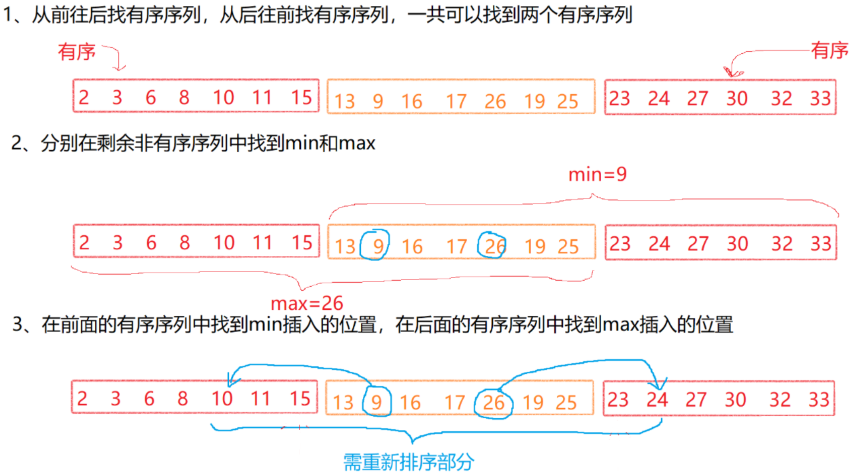

```java
public int findUnsortedSubarray(int[] nums) {
    int len = nums.length;

    int left = 0;
    int right = len - 1;
    while (left + 1 < len && nums[left] <= nums[left + 1]) left++;
    if (left == len - 1) return 0;	// 数组本来就有序，直接返回 0
    while (right - 1 > 0 && nums[right] >= nums[right - 1]) right--;

    int min = Integer.MAX_VALUE;
    int max = Integer.MIN_VALUE;
    for (int i = 0; i <= right; i++) max = Math.max(max, nums[i]);
    for (int i = left; i < len; i++) min = Math.min(min, nums[i]);

    int index1 = 0;
    for (; index1 < len; index1++) {
        if (nums[index1] <= min) continue;
        else break;
    }
    int index2 = len - 1;
    for (; index2 >= 0; index2--) {
        if (nums[index2] >= max) continue;
        else break;
    }
    return index2 - index1 + 1;
}
```

## 8、根据身高重建队列

> #406：https://leetcode-cn.com/problems/queue-reconstruction-by-height/  HOT100
>
> 算法思想：像这种输入是数对的，要么是图，要么排序。
>
> 按**第一项降序，第二项升序**对 people 排序，如排序后：[[7,0], [7,1], [6,1], [5,0], [5,2], [4,4]]
>
> 排序后，就可以按第二项进行插入：
>
> - 插入[7,0]：[[7,0]]
> - 插入[7,1]：[[7,0], [7,1]]
> - 插入[6,1]：[[7,0], [6,1], [7,1]]
> - 插入[5,0]：[[5,0], [7,0], [6,1], [7,1]]
> - 插入[5,2]：[[5,0], [7,0], [5,2], [6,1], [7,1]]
> - 插入[4,4]：[[5,0], [7,0], [5,2], [6,1], [4,4], [7,1]]

---

> - 时间复杂度：O(n<sup>2</sup>)
> - 空间复杂度：O(n)

```java
public int[][] reconstructQueue(int[][] people) {
    // 第一项降序，第二项升序
    Arrays.sort(people, (o1, o2) -> o1[0] == o2[0] ? o1[1] - o2[1] : o2[0] - o1[0]);
    List<int[]> list = new ArrayList<>();
    for (int[] person : people) {
        list.add(person[1], person);	// O(n^2)
    }
    return list.toArray(new int[0][]);
}
```

> 手撕二维快排：

```java
private void quickSort(int[][] matrix, int left, int right) {
    if (left >= right) return;
    // 元素 p 被放到其最终位置，p 左边的都是比 p 小的，p 右边的都是比 p 大的，所以对其左右分别递归
    int p = randomPartition(matrix, left, right);
    quickSort(matrix, left, p - 1);
    quickSort(matrix, p + 1, right);
}

private int randomPartition(int[][] matrix, int left, int right) {
    int randomIndex = left + new Random().nextInt(right - left + 1);    // 生成随机数 ∈[left, right]
    swap(matrix, left, randomIndex);
    return partition(matrix, left, right);
}

private int partition(int[][] matrix, int left, int right) {
    int[] temp = new int[2];
    temp[0] = matrix[left][0];
    temp[1] = matrix[left][1];

    while (left < right) {
        while (left < right && compare(temp, matrix[right])) right--;    // 从右到左找第一个比自己小的
        matrix[left][0] = matrix[right][0];
        matrix[left][1] = matrix[right][1];
        while (left < right && compare(matrix[left], temp)) left++;      // 从左到右找第一个比自己大的
        matrix[right][0] = matrix[left][0];
        matrix[right][1] = matrix[left][1];
    }
    matrix[left][0] = temp[0];    // left == right 时循环结束，将元素 p 放到其最终位置
    matrix[left][1] = temp[1];
    return left;
}

private void swap(int[][] matrix, int i, int j) {
    int[] temp = matrix[i];
    matrix[i] = matrix[j];
    matrix[j] = temp;
}

// 第一项降序，第二项升序
private boolean compare(int[] nums1, int[] nums2) {
    if (nums1[0] == nums2[0]) {
        return nums1[1] < nums2[1];
    } else {
        return nums2[0] < nums1[0];
    }
}
```

## 9、除法求值

>#399：https://leetcode-cn.com/problems/evaluate-division/  HOT100
> 算法思想：构建邻接矩阵，equations 的字符串作为点，商 values 作为矩阵元素的值，用 Floyd 算法求最短路径
>- 时间复杂度：O(n<sup>3</sup>)
>- 空间复杂度：O(n<sup>2</sup>)

```java
public double[] calcEquation(List<List<String>> equations, double[] values, List<List<String>> queries) {
    // 将所有字母映射成整数下标
    Map<String, Integer> map = new HashMap<>();
    int index = 0;
    for (List<String> equation : equations) {
        for (String s : equation) {
            if (!map.containsKey(s))
                map.put(s, index++);
        }
    }
    // 用邻接矩阵表示图
    double[][] graph = new double[index][index];
    for (int i = 0; i < index; i++) {
        Arrays.fill(graph[i], -1.0);
        graph[i][i] = 1.0;
    }

    index = 0;
    for (List<String> equation : equations) {
        String a = equation.get(0);
        String b = equation.get(1);
        Integer index1 = map.get(a);
        Integer index2 = map.get(b);
        double value = values[index++];
        graph[index1][index2] = value;
        graph[index2][index1] = 1 / value;
    }

    // Floyd 算法
    for (int k = 0; k < graph.length; k++) {
        for (int i = 0; i < graph.length; i++) {
            for (int j = 0; j < graph.length; j++) {
                // ij 没有联通 && ik 联通了 &&  kj 联通了 -> ij 可以联通
                if (graph[i][j] == -1.0 && graph[i][k] != -1.0 && graph[k][j] != -1.0)
                    graph[i][j] = graph[i][k] * graph[k][j];
            }
        }
    }

    index = 0;
    double[] arr = new double[queries.size()];
    for (List<String> query : queries) {
        String a = query.get(0);
        String b = query.get(1);
        if (map.containsKey(a) && map.containsKey(b)) {
            Integer index1 = map.get(a);
            Integer index2 = map.get(b);
            arr[index++] = graph[index1][index2];
        } else
            arr[index++] = -1.0;
    }
    return arr;
}
```

## 10、对角线遍历

> #498：https://leetcode.cn/problems/diagonal-traverse/
>
> 算法思想：把所有对角线都看成 ↗，不要 ↙，最后再将一部分 ↗ 逆转为 ↙；可以发现，所有↗的起点都位于第一列、最后一行！
>
> - 时间复杂度：O(row * col)
> - 空间复杂度：O(row * col)

```java
public int[] findDiagonalOrder(int[][] mat) {
    int row = mat.length;
    int col = mat[0].length;
    List<List<Integer>> lists = new ArrayList<>();
    // 起点位于第一列
    for (int i = 0; i < row - 1; i++) {
        int x = i;
        int y = 0;
        List<Integer> list = new ArrayList<>();
        while (x >= 0 && y < col) list.add(mat[x--][y++]);
        lists.add(list);
    }
    // 起点位于最后一行
    for (int i = 0; i < col; i++) {
        int x = row - 1;
        int y = i;
        List<Integer> list = new ArrayList<>();
        while (x >= 0 && y < col) list.add(mat[x--][y++]);
        lists.add(list);
    }
    int[] arr = new int[row * col];
    int k = 0;
    for (int i = 0; i < lists.size(); i++) {
        List<Integer> list = lists.get(i);
        if (i % 2 == 0) {    // ↗
            for (Integer num : list) arr[k++] = num;
        } else {             // ↙
            Collections.reverse(list);
            for (Integer num : list) arr[k++] = num;
        }
    }
    return arr;
}
```

> 优化：对角线一共有 row + col - 1 条，将其编号为 [0, row + col - 1]；
>
> 对于第 i 条 ↗，if (i < row)，说明起点在第一列，起点为 (i, 0)；否则起点在最后一行，起点为 (row - 1, i - row + 1)；
>
> 对于第 i 条 ↙，if (i < col)，说明起点在第一行，起点为 (0, i)；否则起点在最后一列，起点为 (i - col + 1, col - 1)；
>
> - 时间复杂度：O(row * col)
> - 空间复杂度：O(1)

```java
public int[] findDiagonalOrder(int[][] mat) {
    int row = mat.length;
    int col = mat[0].length;
    int[] arr = new int[row * col];
    int k = 0;
    for (int i = 0; i < row + col - 1; i++) {
        if (i % 2 == 0) {  // ↗
            if (i < row) {
                int x = i;
                int y = 0;
                while (x >= 0 && y < col) arr[k++] = mat[x--][y++];
            } else {
                int x = row - 1;
                int y = i - row + 1;
                while (x >= 0 && y < col) arr[k++] = mat[x--][y++];
            }
        } else {           // ↙
            if (i < col) {
                int x = 0;
                int y = i;
                while (x < row && y >= 0) arr[k++] = mat[x++][y--];
            } else {
                int x = i - col + 1;
                int y = col - 1;
                while (x < row && y >= 0) arr[k++] = mat[x++][y--];
            }
        }
    }
    return arr;
}

// 用三目运算符优化：
public int[] findDiagonalOrder(int[][] mat) {
    int row = mat.length;
    int col = mat[0].length;
    int[] arr = new int[row * col];
    int k = 0;
    for (int i = 0; i < row + col - 1; i++) {
        if (i % 2 == 0) {  // ↗
            int x = i < row ? i : row - 1;
            int y = i < row ? 0 : i - row + 1;
            while (x >= 0 && y < col) arr[k++] = mat[x--][y++];
        } else {           // ↙
            int x = i < col ? 0 : i - col + 1;
            int y = i < col ? i : col - 1;
            while (x < row && y >= 0) arr[k++] = mat[x++][y--];
        }
    }
    return arr;
}
```

## 11、小于 n 的最大数

> 给定一个个位数数组 nums = {2，4，9}，n = 23322，使用数组里面的元素组成最大的，且小于 n 的整数是多少？字节高频

```java
@Test
public void test() {
    System.out.println(getMaxLessN(new int[]{2, 3, 9}, 24378));      // 23999
    System.out.println(getMaxLessN(new int[]{2, 4, 9}, 24223));      // 24222
    System.out.println(getMaxLessN(new int[]{2, 4, 9}, 23121));      // 22999
    System.out.println(getMaxLessN(new int[]{2, 3, 6, 8}, 2413));    // 2388
    System.out.println(getMaxLessN(new int[]{6, 8}, 300));           // 88
    System.out.println(getMaxLessN(new int[]{5, 4, 8, 2}, 5416));    // 5288
}

public String getMaxLessN(int[] nums, int N) {
    N--;    // 若结果可以和 N 相等，则删除这一行！
    Deque<Integer> stack = new ArrayDeque<>();
    Arrays.sort(nums);
    int max = nums[nums.length - 1];
    String s = String.valueOf(N);
    for (int i = 0; i < s.length(); i++) {
        int curDigit = s.charAt(i) - '0';
        int curIdx = getMaxLessIdx(nums, curDigit);
        // 当前数字比 nums[] 中的所有数都小，如 {5, 4, 8, 2}, 5416，第三位 1 比 nums[] 都小，则结果的第 2 位不能是 4！
        if (curIdx == -1) {
            while (!stack.isEmpty()) {
                // 结果的第 2 位不能是 4，把 4 pop 掉，选一个比 4 小的
                Integer top = stack.pop();
                int beforeIdx = getMaxLessIdx(nums, top - 1);
                // 如果没有比 4 小的，则结果的第 1 位不能是 5！继续回溯（出栈表示回溯）
                if (beforeIdx == -1) continue;
                stack.push(nums[beforeIdx]);
                break;
            }
            // 栈为空，说明 N 的每一位都 < min(nums[])，如 {3, 4, 5}, 212，则结果不能是 3 位，必须是 2 位，即结果为 55
            if (stack.isEmpty()) {
                for (int j = 0; j < s.length() - 1; j++) {
                    stack.push(max);
                }
            } else {
                // {5, 4, 8, 2}, 5416，结果的前两位不能为 54，因为第三位是 1，比 nums[] 都小！所以前两位改为 52，则后面的都用最大值填充，即 5288
                int count = s.length() - stack.size();
                for (int j = 0; j < count; j++) {
                    stack.push(max);
                }
            }
            break;
        } else if (nums[curIdx] == curDigit) {
            // 相等，比较下一位
            stack.push(curDigit);
        } else if (nums[curIdx] < curDigit) {
            // {2, 3, 9}, 24378，第二位 3 < 4，所以后面直接补最大值，结果为 23999，
            stack.push(nums[curIdx]);
            for (; i < s.length() - 1; i++) {
                stack.push(max);
            }
            break;
        }
    }

    int res = 0, count = 1;
    while (!stack.isEmpty()) {
        res += stack.peek() * count;
        count *= 10;
        stack.pop();
    }
    return String.valueOf(res);
}

// 从 nums[] 中找到最大的 <= target 的元素，返回其下标
private int getMaxLessIdx(int[] nums, int target) {
    int left = 0, right = nums.length - 1;
    while (left < right) {
        int mid = left + (right - left + 1) / 2;
        if (nums[mid] == target) return mid;
        if (nums[mid] < target) left = mid;
        else right = mid - 1;
    }
    return nums[left] <= target ? left : -1;
}
```

# 二、二分查找

> 算法思想：分治；
>
> 循环实现：
>
> - 时间复杂度：O(log n)
> - 空间复杂度：O(1)
>
> 递归实现：
>
> - 时间复杂度：O(log n)
> - 空间复杂度：O(log n)

```java
// 1.闭区间
public int binarySearch(int[] nums, int target) {
    int left = 0;
    int right = nums.length - 1;
    while (left <= right) {
        int mid = left + (right - left) / 2;
        if (nums[mid] == target)
            return mid;
        else if (nums[mid] < target)
            left = mid + 1;
        else
            right = mid - 1;
    }
    return -1;    // return left：返回插入位置
}

// 2.左闭右开，求插入位置还是用闭区间吧
// 2.1 版本1
public int binarySearch(int[] nums, int target) {
    int left = 0;
    int right = nums.length - 1;
    while (left < right) {
        int mid = left + (right - left) / 2;
        if (nums[mid] >= target)
            right = mid;    // 若 nums[] 中包含多个 target，此模板查找的是最左 target (继续逼近于左边界)
        else
            left = mid + 1;
    }
    return nums[left] == target ? left : -1;	// 循环结束后 left == right，若 target 不存在，返回 -1
}
// 2.2 版本2
public int binarySearch(int[] nums, int target) {
    int left = 0;
    int right = nums.length - 1;
    while (left < right) {
        // left = mid, right = mid - 1 时，计算 mid 要 + 1，不然死循环
        int mid = left + (right - left + 1) / 2;
        if (nums[mid] <= target)
            left = mid;    // 若 nums[] 中包含多个 target，此模板查找的是最右 target (继续逼近于右边界)
        else
            right = mid - 1;
    }
    return nums[left] == target ? left : -1;
}
```

## 1、爱吃香蕉的珂珂

> #875：https://leetcode-cn.com/problems/koko-eating-bananas/
>
> 算法思想：暴力法时间复杂度 O(n × max)，暴力法是顺序遍历 [1, max] 中的所有数，所以可以用二分法改进！

```java
int minEatingSpeed(int[] piles, int h) {
    int max = getMax(piles);
    for (int speed = 1; speed < max; speed++) {
        if (canFinish(piles, speed, h))	   // 以 speed 能否在 h 小时内吃完香蕉
            return speed;
    }
    return max;
}
```

> 二分法：
>
> - 时间复杂度：O(n log max)
> - 空间复杂度：O(1)

```java
public int minEatingSpeed(int[] piles, int h) {
    int max = Integer.MIN_VALUE;
    for (int pile : piles) {
        max = Math.max(max, pile);
    }
    int left = 1;
    int right = max;
    while (left < right) {
        int mid = left + (right - left) / 2;
        if (getTime(mid, piles) <= h) {
            right = mid;
        } else {
            left = mid + 1;
        }
    }
    return left;
}

private long getTime(int speed, int[] piles) {
    long time = 0;
    for (int pile : piles) {
        if (pile % speed == 0) {
            time += pile / speed;
        } else {
            time += pile / speed + 1;
        }
    }
    return time;
}
```

## 2、寻找旋转排序数组中的最小值 ⭐

> #153：https://leetcode-cn.com/problems/find-minimum-in-rotated-sorted-array/  剑指offer11
>
> 算法思想：

```java
if (nums[mid] > nums[right])    // 如左图，说明最小值在 mid 右边
else                            // 如右图，说明最小值在 mid 左边
// 注意：if (nums[mid] > nums[left]) ，如左图，也能说明最小值在 mid 右边，为什么不用这个条件？
// 1.若输入数组本来就升序，此时应该将右边界向左收缩，因此比较 nums[mid] 和 nums[right]
// 2.比较 nums[mid] 和 nums[left] 需要考虑的边界条件比较多
```

> - 时间复杂度：O(log n)
> - 空间复杂度：O(1)

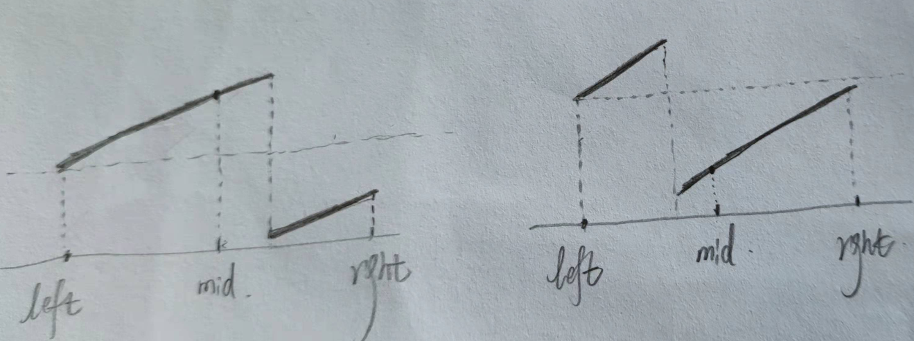

```java
public int findMin(int[] nums) {
    int left = 0;
    int right = nums.length - 1;
    while (left < right) {
        int mid = left + (right - left) / 2;
        if (nums[mid] > nums[right])
            left = mid + 1;
        else
            right = mid;
    }
    return nums[left];
}
// 若让求最大值，如果最小值是 nums[i]，则最大值是 nums[i-1]；如果最小值在 nusm[0]，则最大值在 nums[end]
```

## 3、寻找旋转排序数组中的最小值 II ⭐

> #154：https://leetcode-cn.com/problems/find-minimum-in-rotated-sorted-array-ii/  剑指offer11  牛客TOP101
>
> 上一题元素不重复，这一题有重复！
>
> - 时间复杂度：O(log n)，最坏 O(n)
> - 空间复杂度：O(1)

```java
public int findMin(int[] nums) {
    int left = 0;
    int right = nums.length - 1;
    while (left < right) {
        int mid = left + (right - left) / 2;
        if (nums[mid] == nums[right])
            right--;    // 注意这里，去重，该代码也可以直接用于上一题，最坏 O(n)
        else if (nums[mid] > nums[right])
            left = mid + 1;
        else
            right = mid;
    }
    return nums[left];
}
```

## 4、搜索旋转排序数组 ⭐

> #33：https://leetcode-cn.com/problems/search-in-rotated-sorted-array  HOT100
>
> - 时间复杂度：O(log n)
> - 空间复杂度：O(1)
>
> 法一：由上一题可求出数组的最小值点 minIndex，也就是旋转点，在 [0, minIndex-1] 和 [minIndex, n-1] 上分别二分查找即可。

```java
public int search(int[] nums, int target) {
    int minIndex = findMin(nums);
    int res1 = binarySearch(nums, 0, minIndex - 1, target);
    int res2 = binarySearch(nums, minIndex, nums.length - 1, target);
    return res1 != -1 ? res1 : res2;
}

public int binarySearch(int[] nums, int start, int end, int target) {
    int left = start;
    int right = end;
    while (left < right) {
        int mid = left + (right - left) / 2;
        if (nums[mid] >= target)
            right = mid;
        else
            left = mid + 1;
    }
    return nums[left] == target ? left : -1;
}
```

> 法二：
>
> 算法思想：将数组一分为二，其中一段一定有序，另一段可能有序，也可能部分有序！在有序的一段二分查找，无序的一段再一分为二，其中一段一定有序，另一段可能有序，也可能部分有序！如此循环！

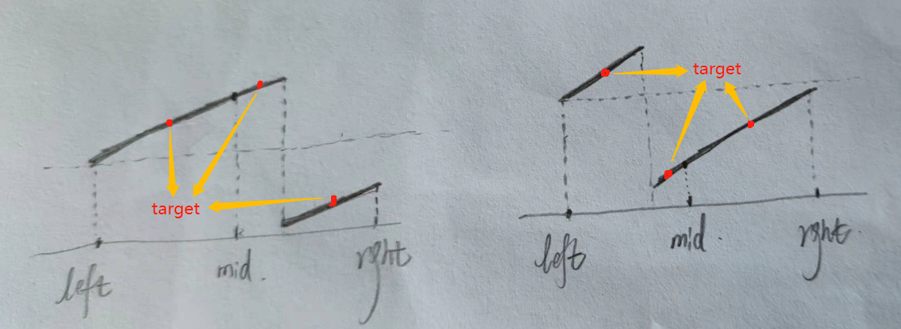

```java
// 以下代码会死循环，因为同时使用了二分查找版本 1 和版本 2，
// 但求 mid 时，没法兼顾 left + (right - left) / 2 和 left + (right - left + 1) / 2
public int search(int[] nums, int target) {
    int left = 0;
    int right = nums.length - 1;
    while (left < right) {
        int mid = left + (right - left) / 2;
        if (nums[mid] > nums[right]) {
            if (nums[left] < target && target < nums[mid])	 	// mid 左边有序
                right = mid - 1;
            else
                left = mid;
        } else {												// mid 右边有序
            if (nums[mid] < target && target < nums[right])	
                left = mid + 1;
            else
                right = mid;
        }
    }
    return nums[left] == target ? left : -1;
}
```

```java
// 解决办法：找到 target 时立即返回，避免两个版本同时出现！
public int search(int[] nums, int target) {
    int left = 0;
    int right = nums.length - 1;
    while (left < right) {
        int mid = left + (right - left) / 2;
        if (nums[mid] == target) return mid;                    // 找到 target 时立即返回
        if (nums[mid] > nums[right]) {                          // mid 左边有序
            if (nums[left] <= target && target < nums[mid])     // target 在 mid 左边
                right = mid - 1;
            else                                                // target 在 mid 右边
                left = mid + 1;
        } else {                                                // mid 右边有序
            if (nums[mid] < target && target <= nums[right])    // target 在 mid 右边
                left = mid + 1;
            else                                                // target 在 mid 左边
                right = mid - 1;
        }
    }
    return nums[left] == target ? left : -1;
}
```

## 5、搜索旋转排序数组 II

> #81：https://leetcode.cn/problems/search-in-rotated-sorted-array-ii/
>
> 上一题元素不重复，这一题有重复！
>
> 特殊情况 search([1,1,1,1,1,1,1,1,1,1,1,1,1,2,1,1,1,1,1], 2)：nums[mid] == nums[right]，无法判断哪个区间是有序的，则 right--；
>
> - 时间复杂度：O(log n)，最坏 O(n)
> - 空间复杂度：O(1)

```java
public boolean search(int[] nums, int target) {
    int left = 0;
    int right = nums.length - 1;
    while (left < right) {
        int mid = left + (right - left) / 2;
        if (nums[mid] == target) return true;
        // 比上一题多了这个 if，最差 O(n)！
        // 相等，说明不知道 nums[] 哪一半有序
        if (nums[mid] == nums[right]) {    
            right--;
        } else if (nums[mid] > nums[right]) {                   // mid 左边有序
            if (nums[left] <= target && target < nums[mid])     // target 在 mid 左边
                right = mid - 1;
            else                                                // target 在 mid 右边
                left = mid + 1;
        } else {                                                // mid 右边有序
            if (nums[mid] < target && target <= nums[right])    // target 在 mid 右边
                left = mid + 1;
            else                                                // target 在 mid 左边
                right = mid - 1;
        }
    }
    return nums[left] == target;
}
```

## 6、山脉数组的峰顶索引

> #852：https://leetcode.cn/problems/peak-index-in-a-mountain-array/
>
> - 时间复杂度：O(log n)
> - 空间复杂度：O(1)

```java
// 找最大值的下标
public int peakIndexInMountainArray(int[] nums) {
    int left = 0;
    int right = nums.length - 1;
    while (left < right) {
        int mid = left + (right - left) / 2;
        if (nums[mid] > nums[mid + 1])	// 不用担心溢出，因为 nums[0] 和 nums[end] 不可能是山峰！
            right = mid;
        else
            left = mid + 1;
    }
    return left;
}
```

## 7、寻找峰值 ⭐

> #162：https://leetcode-cn.com/problems/find-peak-element/  牛客TOP101
>
> 算法思想：画个连续的、有多个极大值点的曲线，其中 f(-1) = f(n) = -∞，会发现：
>
> - 若 f(x) > f(x + 1)，则在 [0, x] 必定存在极大值；
> - 若 f(x) ≤ f(x + 1)，则在 [x + 1, n] 必定存在极大值。
>
> ---
>
> - 时间复杂度：O(log n)
> - 空间复杂度：O(1)

```java
public int findPeakElement(int[] nums) {
    if (nums.length == 1 || nums[0] > nums[1]) return 0;
    int left = 0;
    int right = nums.length - 1;
    while (left < right) {
        int mid = left + (right - left) / 2;
        if (nums[mid] > nums[mid + 1])
            right = mid;
        else
            left = mid + 1;
    }
    return left;
}
```

## 8、0～n-1 中缺失的数字 ⭐

> #剑指offer53-II. https://leetcode-cn.com/problems/que-shi-de-shu-zi-lcof/
>
> - 时间复杂度：O(log n)
> - 空间复杂度：O(1)

```java
public int missingNumber(int[] nums) {
    if (nums[nums.length - 1] == nums.length - 1) return nums.length;
    int left = 0;
    int right = nums.length - 1;
    while (left < right) {
        int mid = left + (right - left) / 2;
        if (nums[mid] == mid)   // mid 左边不缺数字
            left = mid + 1;
        else                    // mid 左边缺数字
            right = mid;
    }
    return left;
}
```

## 9、寻找两个正序数组的中位数 ⭐

> #4：https://leetcode-cn.com/problems/median-of-two-sorted-arrays/  HOT100、字节、微软、美团、百度

**1、双指针**

>边界条件处理起来太恶心了，其实可以将两个数组合并到一个数组，中位数直接取新数组的下标，代码更简单，但空间复杂度 O(len1 + len2)
>
>- 时间复杂度：O(len1 + len2)
>- 空间复杂度：O(1)

```java
public double findMedianSortedArrays(int[] nums1, int[] nums2) {
    int len1 = nums1.length;
    int len2 = nums2.length;

    int idx1 = (len1 + len2 - 1) / 2;	// 第一个中位数下标
    int idx2 = (len1 + len2) / 2;	    // 第二个中位数下标
    int mid1 = 0;						// 第一个中位数
    int mid2 = 0;						// 第二个中位数

    int i = 0;
    int j = 0;
    int step = 0;

    while (i < nums1.length && j < nums2.length) {
        if (nums1[i] < nums2[j]) {
            if (step == idx1) mid1 = nums1[i];
            if (step == idx2) mid2 = nums1[i];
            i++;
        } else {
            if (step == idx1) mid1 = nums2[j];
            if (step == idx2) mid2 = nums2[j];
            j++;
        }
        step++;
    }
    while (i < nums1.length) {
        if (step == idx1) mid1 = nums1[i];
        if (step == idx2) mid2 = nums1[i];
        i++;
        step++;
    }
    while (j < nums2.length) {
        if (step == idx1) mid1 = nums2[j];
        if (step == idx2) mid2 = nums2[j];
        j++;
        step++;
    }
    return (mid1 + mid2) / 2.0;
}
```

**2、二分法**

> - 时间复杂度：O(log n)
> - 空间复杂度：O(1)，尾递归！
>
> 算法思想：找中位数，就是找第 k 小的数！
> 
> 在 nums1、nums2 中分别找出前 k/2 个数，如果 nums1[k/2 - 1] > nums2[k/2 - 1]，则 nums2[0...k/2 - 1] 都可以扔了（nums2[0...k/2 - 1] 不可能是第 k 小）
> 
> 因为就算 nums2[k/2 - 1] 比 nums1[0...k/2 - 2] 和 nums2[0...k/2 - 2] 都大，nums2[k/2 - 1] 最多也就是第 k-1 小，不可能是第 k 小！
>
> 找中位数的小技巧：k = [(len+1) / 2 + (len+2) / 2] / 2，在数组中第 k 小的数即为中位数 (k 从 1 计数)，不管 len 为奇数还是偶数都成立，避免了分情况讨论！
>
> 对于以下两个数组，其中位数为 (第 7 小数 + 第 8 小数) / 2，下面演示求第 7 小数的过程：

---

> 数组起始位置：start1 = 0，start2 = 0；
>
> 记 midVal1 = nums1[start1 + k/2 - 1]，midVal2 = nums2[start2 + k/2 - 1]，
>
> midVal1 > midVal2，所以 midVal2 及其左边的数一定都不是第 7 小的数，直接排除！
> 原因：即使 midVal2 是左边这六个数里的第二大（仅 < midVal1），midVal2 最多也就是第 5 小，不可能是第 7 小！

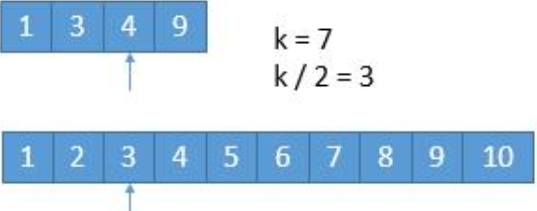

>
> 排除了 3 个数，start1 = 0，start2 = 3，接下来要在剩余数字中找第 7 - 3 = 4 小的数：

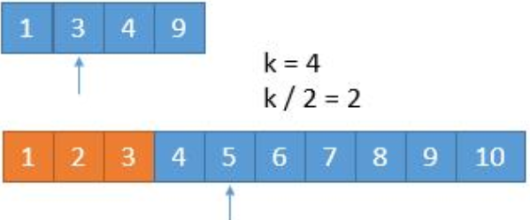

>排除了 2 个数，start1 = 2，start2 = 3，接下来要找第 k = 2 小的数：

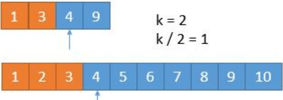

>上图 midVal1 = midVal2，排除哪个都行，假设排除 midVal2，start1 = 2，start2 = 4；
>
>排除了 1 个数，所以要找第 k = 1 小的数：
>
>nums1[start1] < nums2[start2]，所以选 nums1[start1] = 4 就是第 7 小的数！

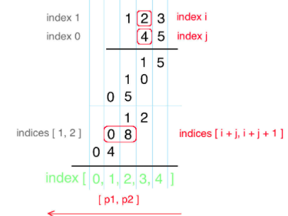

> 特殊情况：nums1.length < k/2，
>
> 或者经历很多步后，nums1 除去被排除的元素，剩下的元素少于 k/2，即：nums1[start1 ...].length < k/2；
>
> 此时 nums1 中所有剩下元素要排除吗？要看这些元素的和 midVal2 的大小，太麻烦，直接这样做更简单：
>
> 不排除 nums1 的元素，排除 nums2，再次递归进入，递归次数越多，k 越小，
>
> 到 nums1 剩下的元素少于 k/2 时，自动会决定 nums1 的元素是排除还是保留！
> 
> 如下图，nums2[2] = 3 不可能是第 7 小，所以可以放心排除 nums2[0...2]，nums2[2] 最多是第 5 小，因为 nums1 剩下元素不足 k/2

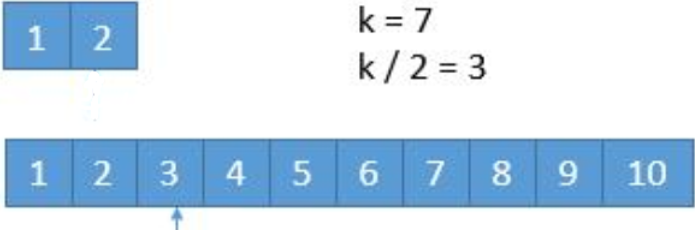

```java
public double findMedianSortedArrays(int[] nums1, int[] nums2) {
    int len1 = nums1.length;
    int len2 = nums2.length;
    int k1 = (len1 + len2 + 1) / 2;
    int k2 = (len1 + len2 + 2) / 2;
    // 分别找第 k1 小的数、第 k2 小的数
    return (getKth(nums1, 0, nums2, 0, k1) + getKth(nums1, 0, nums2, 0, k2)) / 2;
}

private double getKth(int[] nums1, int start1, int[] nums2, int start2, int k) {
    if (start1 >= nums1.length) {    // nums1 的元素都排除完了，为空数组，直接到 nums2 中找
        return nums2[start2 + k - 1];
    }
    if (start2 >= nums2.length) {    // nums2 的元素都排除完了，为空数组，直接到 nums1 中找
        return nums1[start1 + k - 1];
    }
    if (k == 1) {
        return Math.min(nums1[start1], nums2[start2]);
    }
    // 可能发生数组越界！见算法思想的 "特殊情况"，取 Integer.MAX_VALUE 是为了当前数组不排除元素，直接进入下一次递归
    int midVal1 = (start1 + k / 2 - 1) < nums1.length ? nums1[start1 + k / 2 - 1] : Integer.MAX_VALUE;
    int midVal2 = (start2 + k / 2 - 1) < nums2.length ? nums2[start2 + k / 2 - 1] : Integer.MAX_VALUE;
    if (midVal1 > midVal2) {
        return getKth(nums1, start1, nums2, start2 + k / 2, k - k / 2);
    } else {
        return getKth(nums1, start1 + k / 2, nums2, start2, k - k / 2);
    }
}
```

# 三、字符串

## 1、实现 strStr()

> #28：https://leetcode.cn/problems/find-the-index-of-the-first-occurrence-in-a-string/

**1、暴力匹配**

>- 时间复杂度：O(m * n)
>- 空间复杂度：O(1)

**2、KMP 算法**

>参考：https://www.bilibili.com/video/BV1AY4y157yL/?spm_id_from=333.337.search-card.all.click&vd_source=04eaf9981148eb876b6cadd9b021971d
>
>- 时间复杂度：O(m + n)
>- 空间复杂度：O(n)

---

>1、求 next 数组：
>
>对于字符串 ABAB，其前缀 = {A, AB, ABA}；其后缀 = {BAB, AB, B}，故最长公共前后缀为 "AB"，长度为 2！
>
>对于字符串 ABABC，其 next[] 为：

| index  |  0   |  1   |  2   |  3   |  4   |
| :----: | :--: | :--: | :--: | :--: | :--: |
|   p    |  A   |  B   |  A   |  B   |  C   |
| next[] |  0   |  0   |  1   |  2   |  0   |

```java
private int[] getNext(String p) {
    int[] next = new int[p.length()];
    next[0] = 0;
    int i = 1;
    int prefixLen = 0;
    while (i < p.length()) {
        if (p.charAt(i) == p.charAt(prefixLen)) {
            prefixLen++;
            next[i] = prefixLen;
            i++;
        } else {
            if (prefixLen != 0) {
                prefixLen = next[prefixLen - 1];
            } else {
                next[i] = 0;
                i++;
            }
        }
    }
    return next;
}
```

> 2、kmp 算法

| index |  0   |  1   |  2   |  3   |            4             |  5   |  6   |  7   |  8   |
| :---: | :--: | :--: | :--: | :--: | :----------------------: | :--: | :--: | :--: | :--: |
|   s   |  A   |  B   |  A   |  B   | <font color=red>A</font> |  B   |  C   |  A   |  A   |
|   p   |  A   |  B   |  A   |  B   | <font color=red>C</font> |      |      |      |      |

> 如上表，当 i = j = 4 时，s[i] != p[j]，若用暴力法，则 **i 回退到 1**，j 回退到 0 开始下一轮匹配：

| index |  0   |  1   |  2   |  3   |  4   |  5   |  6   |  7   |  8   |
| :---: | :--: | :--: | :--: | :--: | :--: | :--: | :--: | :--: | :--: |
|   s   |  A   |  B   |  A   |  B   |  A   |  B   |  C   |  A   |  A   |
|   p   |      |  A   |  B   |  A   |  B   |  C   |      |      |      |

>这样非常耗时，既然 i 已经遍历过 0~3 的字符了，能不能从利用这些字符的信息，避免 i 回退？
>
>**KMP 算法的核心思想：利用已经遍历过的字符信息，避免主串指针回退！**
>
>当 i = j = 4 时，s[i] != p[j]，next[i-1] = 2，i 不变 (不要回退)！j = next[i-1] = 2，直接跳过 p 的前两个字符，开始匹配：

| index |  0   |  1   |  2   |  3   |  4   |  5   |  6   |  7   |  8   |
| :---: | :--: | :--: | :--: | :--: | :--: | :--: | :--: | :--: | :--: |
|   s   |  A   |  B   |  A   |  B   |  A   |  B   |  C   |  A   |  A   |
|   p   |      |      |  A   |  B   |  A   |  B   |  C   |      |      |

```java
public int strStr(String s, String p) {
    return kmp(s, p);
}

private int kmp(String s, String p) {
    int[] next = getNext(s);
    int i = 0;
    int j = 0;
    while (i < s.length()) {
        if (s.charAt(i) == p.charAt(j)) {    // 当前字符匹配成功
            i++;
            j++;
        } else if (j == 0) {    // 当前字符匹配失败 1：第一个字符就匹配失败，i 直接后移
            i++;
        } else {    			// 当前字符匹配失败 2：j 回退到 next[j - 1]
            j = next[j - 1];
        }
        if (j == p.length()) {
            return i - j;
        }
    }
    return -1;
}
```

## 2、至少有 K 个重复字符的最长子串
> #395：https://leetcode.cn/problems/longest-substring-with-at-least-k-repeating-characters/  华为、字节
>
> 注意：滑动窗口非常难，不要用！
>
> 算法思想：分治，对于字符串 s，如果某个字符 c 出现的次数 < k，则任何包含 c 的子串都不可能满足要求；
> 所以可以 s.split(c) 切分成多段，每一段再继续递归下去； 如果某一段所有字符的长度都 >= k，则符合要求！
>
> - 时间复杂度：O(n * 26)：最多递归 26 次，因为每次递归都会完全去除掉一个字符！
> - 空间复杂度：O(26 * 26)：每次递归占用 26 个空间；

```java
public int longestSubstring(String s, int k) {
    Map<Character, Integer> map = new HashMap<>();
    for (int i = 0; i < s.length(); i++) {
        char c = s.charAt(i);
        map.put(c, map.getOrDefault(c, 0) + 1);
    }

    for (Character c : map.keySet()) {
        if (map.get(c) < k) {
            int max = 0;
            String[] strs = s.split(String.valueOf(c));
            for (String str : strs) {
                max = Math.max(max, longestSubstring(str, k));
            }
            return max;
        }
    }
    return s.length();
}
```

# 四、滑动窗口 (双指针)
> 但凡遇到 "双重 for 循环"，都应考虑是否可用双指针优化。
>
> 滑动窗口算法框架（双指针无固定的算法框架）：2 层的嵌套 while，时间复杂度 O(n)
>
> **注意：若输入数组中有负值，不能用滑动窗口**，如：[#560](#560)

```java
void slidingWindow(String s, String t) {
    Map<Character, Integer> need = new HashMap<>();		// 目标值
    Map<Character, Integer> window = new HashMap<>();	// 当前值
    for (char c : t.toCharArray()) {
        need.put(c, 1);
    }

    int left = 0;
    int right = 0;
    int match = 0;	// 用于判断 need 和 window 的匹配程度

    while (right < s.length()) {
        char c = s.charAt(right);       // c 是即将要移入窗口的字符
        window.put(c, window.getOrDefault(c, 0) + 1);
        /*
            if (need.containsKey(c) && (need.get(c).equals(window.get(c))) {
                match++;
            }
        */
        while (window needs shrink) {   // 判断左侧窗口是否要收缩
            char d = s.charAt(left);    // d 是即将要移出窗口的字符
            /*
                if (need.containsKey(d) && need.get(d).equals(window.get(d))) {
                    match--;
                }
            */
            window.put(d, window.get(d) - 1);
            left++;                     // 缩小窗口
        }
        right++;                        // 扩大窗口
    }
}
```

## 1、长度最小的子数组

> #209：https://leetcode-cn.com/problems/minimum-size-subarray-sum/
> - 时间复杂度：O(n)
> - 空间复杂度：O(1)

```java
public int minSubArrayLen(int target, int[] nums) {
    int left = 0, right = 0, sum = 0, minLen = Integer.MAX_VALUE;
    while (right < nums.length) {
        sum += nums[right];
        while (sum >= target) {
            minLen = Math.min(minLen, right - left + 1);
            sum -= nums[left++];     // 缩小窗口
        }
        right++;        // 扩大窗口
    }
    // minLen == Integer.MAX_VALUE 说明所有元素加起来都没 target 大
    return minLen == Integer.MAX_VALUE ? 0 : minLen;    
}
```

> #1658：将 x 减到 0 的最小操作数	https://leetcode.cn/problems/minimum-operations-to-reduce-x-to-zero/
>
> 算法思想：用滑动窗口求出最长的子数组，使得子数组和 = sum(nums) - x，则最小操作数 = nums.length - 最长子数组长度！

## 2、无重复字符的最长子串 ⭐

> #3：https://leetcode-cn.com/problems/longest-substring-without-repeating-characters/  剑指offer48、HOT100、牛客TOP101
>
> - 时间复杂度：O(n)
> - 空间复杂度：O(x)：x 为【无重复字符的最长子串】的长度

```java
public int lengthOfLongestSubstring(String s) {
    Map<Character, Integer> window = new HashMap<>();
    int left = 0, right = 0, maxLen = 0;
    while (right < s.length()) {
        char c = s.charAt(right);
        window.put(c, window.getOrDefault(c, 0) + 1);
        while (window.get(c) > 1) {
            char d = s.charAt(left++);
            window.put(d, window.get(d) - 1);
        }
        maxLen = Math.max(maxLen, right - left + 1);
        right++;
    }
    return maxLen;
}
```

## 3、字符串的排列

> #567：https://leetcode-cn.com/problems/permutation-in-string/  没写出来
>
> - 时间复杂度：O(|s2|)
> - 空间复杂度：O(|s1|)

```java
public boolean checkInclusion(String s1, String s2) {
    int left = 0, right = 0, match = 0;
    Map<Character, Integer> need = new HashMap<>();
    for (int i = 0; i < s1.length(); i++) {
        char c = s1.charAt(i);
        need.put(c, need.getOrDefault(c, 0) + 1);
    }

    Map<Character, Integer> window = new HashMap<>();
    while (right < s2.length()) {
        char c = s2.charAt(right);
        window.put(c, window.getOrDefault(c, 0) + 1);
        if (window.get(c).equals(need.getOrDefault(c, 0))) match++;
        while (right - left + 1 >= s1.length()) {
            if (match == need.size()) return true;
            char d = s2.charAt(left++);
            if (window.get(d).equals(need.getOrDefault(d, 0))) match--;
            window.put(d, window.get(d) - 1);
        }
        right++;
    }
    return false;
}
```

## 4、找到字符串中所有字母异位词 ⭐

> 438：https://leetcode-cn.com/problems/find-all-anagrams-in-a-string/  HOT100
>
> 算法思想：和上题一样
>
> 小知识：Arrays.equals(arr1, arr2) 时间复杂度为常数级。
> - 时间复杂度：O(|s|)
> - 空间复杂度：O(1)

```java
public List<Integer> findAnagrams(String s, String p) {
    List<Integer> list = new ArrayList<>();
    int left = 0, right = 0, match = 0;
    Map<Character, Integer> need = new HashMap<>();
    for (int i = 0; i < p.length(); i++) {
        char c = p.charAt(i);
        need.put(c, need.getOrDefault(c, 0) + 1);
    }

    Map<Character, Integer> window = new HashMap<>();
    while (right < s.length()) {
        char c = s.charAt(right);
        window.put(c, window.getOrDefault(c, 0) + 1);
        if (window.get(c).equals(need.getOrDefault(c, 0))) match++;
        while (right - left + 1 >= p.length()) {
            if (match == need.size()) list.add(left);
            char d = s.charAt(left++);
            if (window.get(d).equals(need.getOrDefault(d, 0))) match--;
            window.put(d, window.get(d) - 1);
        }
        right++;
    }
    return list;
}
```

## 5、最小覆盖子串 ⭐

> #76：https://leetcode-cn.com/problems/minimum-window-substring/  HOT100、牛客TOP101
> - 时间复杂度：O(|s|)
> - 空间复杂度：O(|s|)

```java
public String minWindow(String s, String t) {
    int left = 0, right = 0, match = 0, start = 0, end = Integer.MAX_VALUE;
    Map<Character, Integer> need = new HashMap<>();
    for (int i = 0; i < t.length(); i++) {
        char c = t.charAt(i);
        need.put(c, need.getOrDefault(c, 0) + 1);
    }
    Map<Character, Integer> window = new HashMap<>();
    while (right < s.length()) {
        char c = s.charAt(right);
        window.put(c, window.getOrDefault(c, 0) + 1);
        if (window.get(c).equals(need.getOrDefault(c, 0))) match++;
        while (match == need.size()) {           // 找到一组解时，就该收缩窗口了
            if (right - left < end - start) {    // 更新解
                end = right;
                start = left;
            }
            char d = s.charAt(left++);
            if (window.get(d).equals(need.getOrDefault(d, 0))) match--;
            window.put(d, window.get(d) - 1);
        }
        right++;
    }
    return end == Integer.MAX_VALUE ? "" : s.substring(start, end + 1);
}
```

## 6、区间列表的交集

> #986：https://leetcode-cn.com/problems/interval-list-intersections/

**6.1、暴力法**
>- 时间复杂度：O(len1 × len2)
>- 空间复杂度：O(len1 + len2)
```java
public int[][] intervalIntersection(int[][] firstList, int[][] secondList) {
    List<int[]> list = new ArrayList<>();
    for (int[] arr1 : firstList) {
        int start1 = arr1[0], end1 = arr1[1];
        for (int[] arr2 : secondList) {
            int start2 = arr2[0], end2 = arr2[1];
            if (end1 < start2)    // secondList 后面的数组都 > firstList 当前数组，不可能相交了
                break;
            if (start1 > end2)    // secondList 的数组 < firstList 当前数组，不可能相交，secondList 后移
                continue;
            list.add(new int[]{Math.max(start1, start2), Math.min(end1, end2)});
        }
    }
    return list.toArray(new int[0][]);
}
```

**6.2、双指针**
>- 时间复杂度：O(len1 + len2)
>- 空间复杂度：O(len1 + len2)
```java
public int[][] intervalIntersection(int[][] firstList, int[][] secondList) {
    List<int[]> list = new ArrayList<>();
    int i = 0, j = 0;
    while (i < firstList.length && j < secondList.length) {
        int start1 = firstList[i][0], end1 = firstList[i][1];
        int start2 = secondList[j][0],end2 = secondList[j][1];
        if (start2 <= end1 && end1 <= end2 || start1 <= end2 && end2 <= end1)    // 若相交
            list.add(new int[]{Math.max(start1, start2), Math.min(end1, end2)});
        if (end1 < end2)
            i++;
        else
            j++;
    }
    return list.toArray(new int[0][]);
}

// 或者分情况讨论：
public int[][] intervalIntersection(int[][] firstList, int[][] secondList) {
    List<int[]> list = new ArrayList<>();
    int i = 0, j = 0;
    while (i < firstList.length && j < secondList.length) {
        int start1 = firstList[i][0], end1 = firstList[i][1];
        int start2 = secondList[j][0],end2 = secondList[j][1];
        if (start1 <= start2 && start2 <= end1) {
            if (end2 <= end1) {    // firstList[i] 包含 secondList[j]
                list.add(new int[]{start2, end2});
                j++;
            } else {    		   // firstList[i] 和 secondList[j] 交错 
                list.add(new int[]{start2, end1});
                i++;
            }
        } else if (start2 <= start1 && start1 <= end2) {
            if (end1 <= end2) {    // secondList[j] 包含 firstList[i]
                list.add(new int[]{start1, end1});
                i++;
            } else {    		   // secondList[j] 和 firstList[i] 交错 
                list.add(new int[]{start1, end2});
                j++;
            }
        } else if (start2 > end1) {
            i++;
        } else {
            j++;
        }
    }
    return list.toArray(new int[0][]);
}
```

## 7、和为 s 的两个数字 ⭐

**1、和为 s 的两个数字**

> #剑指offer57-Ⅰ：https://leetcode-cn.com/problems/he-wei-sde-liang-ge-shu-zi-lcof/
>
> 算法思想：双指针
>
> - 时间复杂度：O(n)
> - 空间复杂度：O(1)

```java
public int[] twoSum(int[] nums, int target) {
    int left = 0, right = nums.length - 1;
    while (left < right) {
        int sum = nums[left] + nums[right];
        if (sum == target) return new int[]{nums[left], nums[right]};
        else if (sum > target) right--;
        else left++;
    }
    return new int[0];
}
```

**2、和为 s 的连续正数序列**

> #剑指offer57 - Ⅱ：https://leetcode-cn.com/problems/he-wei-sde-lian-xu-zheng-shu-xu-lie-lcof/
>
> 算法思想：滑动窗口
>
> - 时间复杂度：O(n)
> - 空间复杂度：O(n)：若代码直接返回 list，空间复杂度就是 O(1)

```java
public int[][] findContinuousSequence(int target) {
    List<int[]> list = new ArrayList<>();
    int left = 1, right = 1, sum = 0;
    while (right < target) {
        sum += right;
        while (sum >= target) {
            if (sum == target) {
                int[] arr = new int[right - left + 1];
                for (int i = left; i <= right; i++) {
                    arr[i - left] = i;
                }
                list.add(arr);
            }
            sum -= left;
            left++;
        }
        right++;
    }
    return list.toArray(new int[0][]);
}
```

## 8、三数之和 ⭐

> #15：https://leetcode-cn.com/problems/3sum/  HOT100、牛客TOP101
>
> 算法思想：nums[i] + nums[j] + nums[k] = 0，先对数组升序排序，遍历数组 nums，设当前元素是 nums[i]，为三数中最小的数，则只需要找次大数 nums[j]、更大数 nums[k] 即可。采用双指针法，从左向右找次大数 nums[j]，从右向左找更大数 nums[k]：
>
> 1. 若三数之和 sum = 0，则找到一组解，塞进结果集；
> 2. 若三数之和 sum < 0，则说明次大数 nums[j] 太小，j++；
> 3. 若三数之和 sum > 0，则说明更大数 nums[k] 太大，k--。
>
> - 时间复杂度：O(n<sup>2</sup>)
> - 空间复杂度：O(log n)，排序

```java
public List<List<Integer>> threeSum(int[] nums) {
    List<List<Integer>> list = new ArrayList<>();
    if (nums.length < 3) return list;
    Arrays.sort(nums);
    for (int i = 0; i < nums.length - 2; i++) {
        if (nums[i] > 0) break;    // 最小数 > 0，则 sum 必定 > 0，不用查了
        if (i > 0 && nums[i] == nums[i - 1]) continue;// 若当前元素 nums[i] == nums[i-1]，则上一轮已经查过了
        int j = i + 1;             // 次大数指针
        int k = nums.length - 1;   // 更大数指针
        while (j < k) {
            int sum = nums[i] + nums[j] + nums[k];
            if (sum == 0) {        // 找到一组解
                list.add(Arrays.asList(nums[i], nums[j++], nums[k--]));
                // j++ 后发现 nums[j] == nums[j-1]，没必要再查找了，上一轮已经查找过了
                while (j < k && nums[j] == nums[j - 1]) j++;
                while (j < k && nums[k] == nums[k + 1]) k--;
            } else if (sum < 0) {
                j++;
                while (j < k && nums[j] == nums[j - 1]) j++;
            } else {
                k--;
                while (j < k && nums[k] == nums[k + 1]) k--;
            }
        }
    }
    return list;
}
```

> #16：最接近的三数之和 https://leetcode.cn/problems/3sum-closest/

```java
public int threeSumClosest(int[] nums, int target) {
    int sum = Integer.MAX_VALUE;
    Arrays.sort(nums);
    for (int i = 0; i < nums.length - 2; i++) {
        if (i > 0 && nums[i] == nums[i - 1]) continue;
        int j = i + 1;
        int k = nums.length - 1;
        while (j < k) {
            int curSum = nums[i] + nums[j] + nums[k];
            if (Math.abs(curSum - target) < Math.abs(sum - target)) {
                sum = curSum;
            } else if (curSum < target) {
                j++;
                while (j < k && nums[j] == nums[j - 1]) j++;
            } else {
                k--;
                while (j < k && nums[k] == nums[k + 1]) k--;
            }
        }
    }
    return sum;
}
```

## 9、四数之和

> #18：https://leetcode.cn/problems/4sum/description/
> 
> 算法思想：双指针，在 "三数之和" 上套一层 for 循环。
> - 时间复杂度：O(n<sup>3</sup>)
> - 空间复杂度：O(log n)

```java
// 测试用例 fourSum(new int[]{1000000000, 1000000000, 1000000000, 1000000000}, -294967296) 过不了
// 因为 1000000000 * 4 = -294967296，溢出了，这个用例就是恶心人的！
public List<List<Integer>> fourSum(int[] nums, int target) {
    int len = nums.length;
    List<List<Integer>> list = new ArrayList<>();
    if (len < 4) return list;
    Arrays.sort(nums);
    for (int z = 0; z < len - 3; z++) {
        if (z > 0 && nums[z] == nums[z - 1]) continue;
        for (int i = z + 1; i < len - 2; i++) {
            if (i > z + 1 && nums[i] == nums[i - 1]) continue;
            int j = i + 1;
            int k = len - 1;
            while (j < k) {
                int sum = nums[z] + nums[i] + nums[j] + nums[k];
                if (sum == target) {
                    list.add(Arrays.asList(nums[z], nums[i], nums[j++], nums[k--]));
                    while (j < k && nums[j] == nums[j - 1]) j++;
                    while (j < k && nums[k] == nums[k + 1]) k--;
                } else if (sum < target) {
                    j++;
                    while (j < k && nums[j] == nums[j - 1]) j++;
                } else {
                    k--;
                    while (j < k && nums[k] == nums[k + 1]) k--;
                }
            }
        }
    }
    return list;
}
```

# 五、链表 ⭐

> <font color=red>**做链表题，迭代法一般先给链表添加空的头节点 dummy (hear 嘿嘿)，**</font>
>
> <font color=red>**再 dummy.next = head、pre = dummy、cur = head，最后 return dummy.next；**</font>
>
> 迭代效率比递归高，但迭代的细节太多，递归更不容易出错！
>
> 写递归的技巧：不要跳进递归！你的小脑瓜能压几个栈？利用递归函数的定义从整体出发！要注意递归三部曲：
>
> - 终止条件？
> - 返回什么？（递归函数的定义）
> - 本层递归需要做什么?

## 1、反转链表

> #206：https://leetcode-cn.com/problems/reverse-linked-list/  剑指offer24、HOT100、牛客TOP101，迭代递归都要会！！！

**1.1、迭代**
>- 时间复杂度：O(n)
>- 空间复杂度：O(1)
```java
public ListNode reverseList(ListNode head) {
    ListNode pre = null;
    ListNode cur = head;
    while (cur != null){
        ListNode nxt = cur.next;   // cur 要指向 pre，则必须先保存 cur.next，不然链表就断了
        cur.next = pre;            // cur 指向 pre
        pre = cur;                 // pre 后移
        cur = nxt;                 // cur 后移
    }
    return pre;
}
```
**1.2、递归**
>- 时间复杂度：O(n)
>- 空间复杂度：O(n)
```java
public ListNode reverseList(ListNode head) {
    if (head == null || head.next == null) return head;
    ListNode newTail = head.next;
    ListNode newHead = reverseList(head.next);
    newTail.next = head;
    head.next = null;
    return newHead;
}
```

## 2、反转链表 II

>#92：https://leetcode-cn.com/problems/reverse-linked-list-ii/  牛客TOP101、字节
>
>算法思想：记 leftNode 的前一个结点为前驱节点 leftPreNode，记 rightNode 的后一个结点为后继节点 rightPostNode，将 [left, right] 中的节点切出来单独 reverse，再用 leftNode、rightNode、leftPreNode、rightPostNode 连接起来！
>
>- 时间复杂度：O(n)
>- 空间复杂度：O(1)

```java
public ListNode reverseBetween(ListNode head, int left, int right) {
    if (left == right) {
        return head;
    }
    ListNode dummy = new ListNode();
    dummy.next = head;
    ListNode pre = dummy;
    // 找出 leftNode、rightNode、leftPreNode、rightPostNode
    int step = 0;
    for (; step < left - 1; step++) {
        pre = pre.next;
    }
    ListNode leftPreNode = pre;
    ListNode leftNode = pre.next;

    for (; step < right; step++) {
        pre = pre.next;
    }
    ListNode rightNode = pre;
    ListNode rightPostNode = pre.next;
    // 将 [left, right] 中的节点切出来单独 reverse
    leftPreNode.next = null;
    rightNode.next = null;
    reverseList(leftNode);
    // 连接起来
    leftPreNode.next = rightNode;
    leftNode.next = rightPostNode;
    return dummy.next;
}
```

## 3、K 个一组翻转链表

> #25：https://leetcode-cn.com/problems/reverse-nodes-in-k-group/  牛客TOP101、字节巨喜欢出这道题

**1、迭代 (输入示例 2 画图写代码)**

>- 时间复杂度：O(n)
>- 空间复杂度：O(1)

```java
public ListNode reverseKGroup(ListNode head, int k) {
    ListNode dummy = new ListNode();
    dummy.next = head;
    ListNode pre = dummy;
    while (true) {
        ListNode start = pre.next;
        ListNode end = pre;
        for (int i = 0; i < k; i++) {  // i 从 0 开始计数，所以 end 从 pre 开始 
            end = end.next;
            if (end == null) {         // 节点不足 k 个，直接返回
                return dummy.next;
            }
        }
        ListNode nxt = end.next;       // 保存 nxt 节点，下面要用

        reverseList(start, end);       // 反转 k 个节点
        pre.next = end;				   // 连接起来
        start.next = nxt;			   // 连接起来

        pre = start;                   // 更新 pre，下轮循环要用
    }
}

// 反转 [head, tail] 之间的节点，反转后，tail 变成新的 head，head 变成新的 tail
private void reverseList(ListNode head, ListNode tail) {
    ListNode pre = null;
    ListNode cur = head;
    while (pre != tail) {    // cur != tail，反转 [head, tail) 之间的节点
        ListNode nxt = cur.next;
        cur.next = pre;
        pre = cur;
        cur = nxt;
    }
}
```

**2、递归**

>- 时间复杂度：O(n)
>- 空间复杂度：O(n)

```java
public ListNode reverseKGroup(ListNode head, int k) {
    if (head == null) return null;
    ListNode start = head;				// 反转 [start, end) 之间的节点
    ListNode end = head;
    for (int i = 0; i < k; i++) {       // 不足 k 个，不需要反转
        if (end == null) return head;
        end = end.next;
    }
    ListNode newHead = reverse(start, end);   // 反转前 k 个元素
    start.next = reverseKGroup(end, k);       // 递归反转后续链表并连接起来
    return newHead;
}

// 反转 [head, tail) 之间的节点，返回反转后的头节点，即 tail 的前一个节点
public ListNode reverse(ListNode head, ListNode tail) {
    ListNode pre = null;
    ListNode cur = head;
    while (cur != tail) {
        ListNode nxt = cur.next;
        cur.next = pre;
        pre = cur;
        cur = nxt;
    }
    return pre;
}
```

## 4、回文链表

> #234：https://leetcode-cn.com/problems/palindrome-linked-list/  HOT100
>
> 法一：将链表所有元素存进 Array 或 Stack，再判断
>
> - 时间复杂度：O(n)
> - 空间复杂度：O(n)
>
> 法二：先用快慢指针找到中间节点，将后半段链表逆置，再判断
>
> - 时间复杂度：O(n)
> - 空间复杂度：O(1)
```java
public boolean isPalindrome(ListNode head) {
    if (head == null || head.next == null) {
        return true;
    }
    ListNode slow = head, fast = head;
    ListNode pre = new ListNode(-1, head);
    while (fast != null && fast.next != null) {
        pre = pre.next;
        slow = slow.next;
        fast = fast.next.next;
    }

    pre.next = null;  // 断开

    ListNode q = reverseList(slow);
    ListNode p = head;
    while (p != null) {
        if (p.val != q.val) {
            return false;
        }
        p = p.next;
        q = q.next;
    }
    return true;
}
```

## 5、合并有序链表

> #21：https://leetcode-cn.com/problems/merge-two-sorted-lists/  剑指offer25、HOT100

### 5.1、合并两个有序链表

**1、迭代**

>- 时间复杂度：O(len1 + len2)
>- 空间复杂度：O(1)

```java
public ListNode mergeTwoLists(ListNode head1, ListNode head2) {
    ListNode dummy = new ListNode();
    ListNode pre = dummy;
    while (head1 != null && head2 != null) {
        if (head1.val < head2.val) {
            pre.next = head1;
            head1 = head1.next;
        } else {
            pre.next = head2;
            head2 = head2.next;
        }
        pre = pre.next;
    }
    pre.next = head1 == null ? head2 : head1;
    return dummy.next;
}
```

**2、递归**

>- 时间复杂度：O(len1 + len2)
>- 空间复杂度：O(len1 + len2)

```java
public ListNode mergeTwoLists(ListNode head1, ListNode head2) {
    if (head1 == null) return head2;
    if (head2 == null) return head1;
    if (head1.val < head2.val) {
        head1.next = mergeTwoLists(head1.next, head2);
        return head1;
    } else {
        head2.next = mergeTwoLists(head1, head2.next);
        return head2;
    }
}
```

### 5.2、合并 K 个升序链表

> #23：https://leetcode-cn.com/problems/merge-k-sorted-lists/

**1、反复合并两个有序链表**

>- 时间复杂度：O(n × k × k)
>- 空间复杂度：迭代 O(1)，递归 O(log k)

**2、优先队列建立败者树，然后 K 路合并**

>自己做出来的，🐂🍺吗？
>
>- 时间复杂度：O(n × k × log k)，设有 k 个 list，每个 list 有 n 个节点，则 lists 最多有 kn 个节点，调整堆需要 log k
>- 空间复杂度：O(k)，堆大小为 k

```java
public ListNode mergeKLists(ArrayList<ListNode> lists) {
    Queue<ListNode> minHeap = new PriorityQueue<>((o1, o2) -> o1.val - o2.val);
    for (ListNode list : lists) {
        if (list != null) minHeap.offer(list);
    }
    ListNode dummy = new ListNode(-1);
    ListNode p = dummy;
    while (!minHeap.isEmpty()) {
        ListNode node = minHeap.poll();
        if (node.next != null) minHeap.offer(node.next);
        p.next = node;
        p = p.next;
    }
    return dummy.next;
}
```

**3、归并排序**

>- 时间复杂度：O(n × k × log k)
>- 空间复杂度：O(log k)：递归深度

```java
public ListNode mergeKLists(ListNode[] lists) {
    return mergeSort(lists, 0, lists.length - 1);
}

private ListNode mergeSort(ListNode[] lists, int left, int right) {
    if (left == right) return lists[left];
    if (left > right) return null;
    int mid = left + (right - left) / 2;
    ListNode list1 = mergeSort(lists, left, mid);	// 数组的归并排序为 O(n)，但链表只需要保存头节点
    ListNode list2 = mergeSort(lists, mid + 1, right);
    return mergeTwoLists(list1, list2);
}
```

## 6、删除链表的倒数第 N 个节点

> #19：https://leetcode-cn.com/problems/remove-nth-node-from-end-of-list/  剑指offer22、HOT100
>
> 双指针法，画图写代码。
>
> - 时间复杂度：O(n)
> - 空间复杂度：O(1)

```java
public ListNode removeNthFromEnd(ListNode head, int n) {
    ListNode dummy = new ListNode();
    dummy.next = head;
    ListNode p = dummy;
    ListNode q = dummy;

    while (n-- > 0) {					// 快指针先走 n 步
        q = q.next;
    }
    while (q.next != null) {			// 双指针一起走
        p = p.next;
        q = q.next;
    }
    p.next = p.next.next;
    return dummy.next;
}
```

## 7、环形链表

**7.1、环形链表**

> #141：https://leetcode-cn.com/problems/linked-list-cycle/  HOT100、牛客TOP101
>
> - 时间复杂度：O(n)
> - 空间复杂度：O(1)

```java
public boolean hasCycle(ListNode head) {
    if (head == null || head.next == null) return false;
    ListNode slow = head;
    ListNode fast = head;
    while (fast != null && fast.next != null) {
        slow = slow.next;	
        fast = fast.next.next;
        // slow 和 fast 一定会在环内相遇，原因：
        // 1.若没有环，则 fast 一定比 slow 快；
        // 2.若有环，则 fast 比 slow 先进入环，最终两者都在环中移动，slow 走一步 fast 走两步，则一定在环内相遇
        if (slow == fast) return true;
    }
    return false;
}
```

**7.2、环形链表 II**

> #142：https://leetcode-cn.com/problems/linked-list-cycle-ii/  HOT100
>
> - 时间复杂度：O(n)
> - 空间复杂度：O(1)

```java
public ListNode detectCycle(ListNode head) {
    if (head == null || head.next == null) return null;
    ListNode slow = head;
    ListNode fast = head;
    while (fast != null && fast.next != null) {
        slow = slow.next;
        fast = fast.next.next;
        // slow 和 fast 相遇后，slow 从头开始，和 fast 同步走，则二者一定会在环入口处相遇，证明见官解
        if (slow == fast) {
            slow = head;
            while (slow != fast) {
                slow = slow.next;
                fast = fast.next;
            }
            return slow;
        }
    }
    return null;
}
```

## 8、复制带随机指针的链表

> #138：https://leetcode-cn.com/problems/copy-list-with-random-pointer/  剑指offer35

**8.1、哈希表**

>- 时间复杂度：O(n)
>- 空间复杂度：O(n)

```java
public Node copyRandomList(Node head) {
    Map<Node, Node> map = new HashMap<>();    // <原节点, 拷贝节点>
    for (Node p = head; p != null; p = p.next) {
        Node q = new Node(p.val);  			  // p：原节点  q：拷贝节点
        map.put(p, q);
    }
    map.forEach((k, v) -> {                   // 将拷贝的节点连成链表
        v.next = map.get(k.next);
        v.random = map.get(k.random);
    });
    return map.get(head);
}
```

**8.2、原地修改，链表拆分**

>- 时间复杂度：O(n)
>- 空间复杂度：O(1)

```java
public Node copyRandomList(Node head) {
    if (head == null) return head;

    // 将拷贝节点放到原节点后面，如 1->2->3 变成了：1->1'->2->2'->3->3'
    for (Node p = head; p != null; p = p.next.next) {
        Node q = new Node(p.val);  // p：原节点  q：拷贝节点
        q.next = p.next;
        p.next = q;
    }
    // 把拷贝节点的 random 指针安排上
    for (Node p = head; p != null; p = p.next.next) {
        if (p.random != null) {
            p.next.random = p.random.next;
        }
    }
    // 分离拷贝节点和原节点，把 1->1'->2->2'->3->3' 变成 1->2->3 和 1'->2'->3' 两个链表，后者就是答案
    Node copyHead = head.next;
    for (Node p = head; p.next != null; ) {
        Node q = p.next;
        p.next = q.next;
        p = q;
    }
    return copyHead;
}
```

## 9、排序链表

> #148：https://leetcode-cn.com/problems/sort-list/  HOT100
>
> 算法思想：对链表排序，归并排序是最好的算法！

**9.1、归并排序 - 自顶向下 - 递归**

> - 时间复杂度：O(n log n)
> - 空间复杂度：O(log n)

```java
public ListNode sortList(ListNode head) {
    return mergeSort(head);
}

private ListNode mergeSort(ListNode head) {
    if (head == null || head.next == null) return head;
    ListNode mid = getMid(head);
    ListNode left = mergeSort(head);
    ListNode right = mergeSort(mid);
    return mergeTwoLists(left, right);
}

// 用快慢指针定位链表中间节点，并将链表从中间节点断开，变成两个链表
private ListNode getMid(ListNode head) {
    ListNode slow = head;
    ListNode fast = head;
    ListNode pre = new ListNode();
    pre.next = slow;
    while (fast != null && fast.next != null) {
        slow = slow.next;
        fast = fast.next.next;
        pre = pre.next;
    }
    pre.next = null;	// 将链表从中间节点断开，变成两个链表
    return slow;
}
```

**9.2、归并排序 - 自低向上 - 迭代**

> 算法思想：

```angelscript
step=1: (3->4) -> (1->7) -> (8->9) -> (2->11) -> (5->6)
step=2: (1->3->4->7) -> (2->8->9->11) -> (5->6)
step=4: (1->2->3->4->7->8->9->11) -> (5->6)
step=8: (1->2->3->4->5->6->7->8->9->11)
```

> - 时间复杂度：O(n log n)
> - 空间复杂度：O(1)

```java
public ListNode sortList(ListNode head) {
    return mergeSort(head);
}

private ListNode mergeSort(ListNode head) {
    ListNode dummy = new ListNode();
    dummy.next = head;
    // 计算链表长度
    int len = 0;
    for (ListNode p = head; p != null; p = p.next) len++;

    for (int i = 1; i < len; i *= 2) {    // 归并，i = 1、2、4、8 ...
        ListNode p = dummy;
        ListNode cur = dummy.next;
        while (cur != null) {
            // 每切下来两段 (两段的 head 分别是 left、right)，merge 一次，用 p 连接
            ListNode left = cur;
            ListNode right = cut(cur, i);
            cur = cut(right, i);
            p.next = mergeTwoLists(left, right);
            while (p.next != null) p = p.next;
        }
    }
    return dummy.next;
}

// 将链表 head 切成两段，前 len 个节点是第一段，返回后一段的头节点
// 若链表 head 节点不足 len，则返回 null
private ListNode cut(ListNode head, int len) {
    ListNode p = head;
    while (--len > 0 && p != null) p = p.next;
    if (p == null) return null;
    ListNode nxt = p.next;
    p.next = null;
    return nxt;
}
```

**9.3、快排**

>头条面试经常问快排法怎么写，提交超时了
>
>算法思想：以 head 为枢纽元素，遍历链表，把 < head.val 的所有元素存到链表 smallDummy 中，把 >= head.val 的所有元素存到链表 largeDummy 中，则将 smallDummy.next、head、largeDummy.next 连接起来，就是一趟排序的结果！
>
>- 时间复杂度：O(n log n)
>- 空间复杂度：O(log n)

```java
public ListNode sortList(ListNode head) {
    if (head == null || head.next == null) return head;
    return quickSort(head);
}

private ListNode quickSort(ListNode head) {
    if (head == null || head.next == null) return head;
    // 把 < head.val 的所有元素存到链表 smallDummy 中，把 >= head.val 的所有元素存到链表 largeDummy 中
    ListNode smallDummy = new ListNode(), p1 = smallDummy;
    ListNode largeDummy = new ListNode(), p2 = largeDummy;
    ListNode p = head.next;
    while (p != null) {
        if (p.val < head.val) {
            p1.next = p;
            p1 = p1.next;
        } else {
            p2.next = p;
            p2 = p2.next;
        }
        p = p.next;
    }

    p1.next = head;    // 把 head 接到 smallDummy 的后面
    head.next = null;  // 必须加，不然会导致链表成环，死循环
    p2.next = null;    // 必须加，不然会导致链表成环，死循环

    ListNode smallHead = quickSort(smallDummy.next);
    ListNode largeHead = quickSort(largeDummy.next);

    head.next = largeHead;

    return smallHead;
}
```

# 六、哈希表

## 1、最长连续序列 ⭐

> #128：https://leetcode-cn.com/problems/longest-consecutive-sequence/  HOT100、牛客TOP101

**1.1、哈希表**

> - 时间复杂度：O(n<sup>2</sup>)
> - 空间复杂度：O(n)

```java
public int longestConsecutive(int[] nums) {
    Set<Integer> set = new HashSet<>();
    for (int num : nums) set.add(num);
    int maxLen = 0;
    for (int num : set) {    // 遍历 set，不要遍历 nums[]，因为 set 去重，效率更高
        int len = 1;
        while (set.contains(++num)) len++;
        maxLen = Math.max(maxLen, len);
    }
    return maxLen;
}
```

**1.2、哈希表改进**

> 算法思想：对于 1.1，若 nums = [1, 2, 3, 4]，第一次外层循环 num = 1，内层循环结束 len = 4；第二次外层循环 num = 2，内层循环结束 len = 3；以此类推。。。可以发现后面的外层循环全部都是重复计算，根本没必要。
>
> - 时间复杂度：O(n)：因为内层循环 while 最多迭代 n 次
> - 空间复杂度：O(n)

```java
public int longestConsecutive(int[] nums) {
    Set<Integer> set = new HashSet<>();
    for (int num : nums) {
        set.add(num);
    }
    int maxLen = 0;
    for (int num : set) {
        if (set.contains(num - 1)) continue;
        int len = 1;
        while (set.contains(++num)) len++;
        maxLen = Math.max(maxLen, len);
    }
    return maxLen;
}
```

## 2、两数之和 ⭐

> #1：https://leetcode-cn.com/problems/two-sum/  牛客TOP101
>
> 面试可能会考 nums[] 中有重复数字，求所有可能的答案，参考：#40 组合总和 II

**2.1、两次遍历**

> 思想：nums[i] + nums[j] = target
>
> 1. 先遍历一遍数组nums，将所有 <nums[i], i> 存入 map；
> 2. 再遍历一遍数组，遍历时设当前元素是 nums[i]，只需在 map 中查找目标元素 target-nums[i] 即可。
>
> - 时间复杂度：O(n)
> - 空间复杂度：O(n)
>
> 注意：其实 map.get(thatNum) != i 完全不用写。若输入 nums = [3, 3]，target = 6，则应输出 [0, 1]，但代码有问题：map.put(nums[i], i) 时，第二个 3 把第一个 3 覆盖掉了。自己手动运行一下，发现很巧合，程序并没有 bug。

```java
public int[] twoSum(int[] nums, int target) {
    Map<Integer, Integer> map = new HashMap<>();
    for (int i = 0; i < nums.length; i++) {
        map.put(nums[i], i);
    }
    for (int i = 0; i < nums.length; i++) {
        int thatNum = target - nums[i];
        Integer j = map.get(thatNum);
        // !=：数组里的同一个元素 nums[x] 不能用两次，即 nums[x] + nums[x] = target 不允许
        if (j != null && j != i) return new int[]{i, j};
    }
    throw new IllegalArgumentException("No solution");
}
```

**2.2、一次遍历**

> 上述解法的两个 for 循环可优化成一个
>
> 算法思想：nums[i] + nums[j] = target，即：元素A + 目标元素B = 结果，查找分两种情况：
>
> - 情况1：遍历数组 nums 时，若当前元素是元素A，则只需要在 nums[] 中找到目标元素B即可；
> - 情况2：同理，若当前元素是目标元素B，则只需要在 nums[] 中找到元素A即可；
>
> 两个集合容器：
>
> 1. int[] nums
> 2. Map<nums[i], i> map
>
> 步骤：遍历数组 nums，设当前元素为 nums[i]，在 map 中查找目标元素 target - nums[i]，
>
> 1. 若找到，返回两者下标，即情况1；
> 2. 若没找到，将当前元素及其下标塞进 map。没找到也完全不用担心，因为当当前元素轮到目标元素 num[j] 时，一定能在nums[0] ~  nums[j-1] 中找到元素 nums[i]，因为 nums[i] 已经被塞进 map 了，返回两者下标，即情况2。
>
> - 时间复杂度：O(n)
> - 空间复杂度：O(n)

```java
public int[] twoSum(int[] nums, int target) {
    Map<Integer, Integer> map = new HashMap<>();
    for (int i = 0; i < nums.length; i++) {
        int thatNum = target - nums[i];   // 目标元素
        Integer j = map.get(thatNum);
        if (j != null && j != i) return new int[]{j, i};  // 细节：下标顺序
        map.put(nums[i], i);
    }
    throw new IllegalArgumentException("No solution");
}
```

## 3、四数相加 II

> #454：https://leetcode-cn.com/problems/4sum-ii/
>
> 算法思想：将 nums1[]、nums2[] 中的元素两两相加存入 map，再判断 nums3[]、nums4[] 两两相加的值的相反数是否存在于 map 中。
>
> - 时间复杂度：O(n<sup>2</sup>)
> - 空间复杂度：O(n<sup>2</sup>)

```java
public int fourSumCount(int[] nums1, int[] nums2, int[] nums3, int[] nums4) {
    Map<Integer, Integer> map = new HashMap<>();
    for (int num1 : nums1) {
        for (int num2 : nums2) {
            map.put(num1 + num2, map.getOrDefault(num1 + num2, 0) + 1);
        }
    }
    int cnt = 0;
    for (int num3 : nums3) {
        for (int num4 : nums4) {
            cnt += map.getOrDefault(-num3 - num4, 0);
        }
    }
    return cnt;
}
```

## 4、LRU 缓存机制 ⭐

> #146：https://leetcode-cn.com/problems/lru-cache/  HOT100、牛客TOP101
>
> 算法思想：首尾空节点的双向链表 + HashMap
>
> 1. 对元素操作后，将该元素移动到空头节点的后一个，所以越靠近链头，元素越新；
>
> 2. 同理，越靠近链尾，元素越旧，淘汰时删除空尾节点的前一个节点。
>
> - 时间复杂度：O(1)
> - 空间复杂度：O(n)

```java
class LRUCache {

    int capacity;
    Node head;
    Node tail;
    Map<Integer, Node> map;

    public LRUCache(int capacity) {
        this.capacity = capacity;
        this.head = new Node();
        this.tail = new Node();
        head.next = tail;
        tail.prev = head;
        this.map = new HashMap<>(capacity);
    }

    public int get(int key) {
        Node node = map.get(key);
        if (node == null) return -1;
        moveToHead(node);
        return node.value;
    }

    public void put(int key, int value) {
        Node node = map.get(key);
        if (node != null) {  // 更新
            node.value = value;
            moveToHead(node);
        } else {  // 新增
            Node newNode = new Node(key, value);
            addToHead(newNode);
            map.put(key, newNode);
            if (map.size() > this.capacity) {
                map.remove(tail.prev.key);    // 和下一句顺序不能反！
                delete(tail.prev);
            }
        }
    }

    private void moveToHead(Node node) {
        delete(node);
        addToHead(node);
    }

    private void addToHead(Node node) {
        head.next.prev = node;
        node.next = head.next;
        node.prev = head;
        head.next = node;
    }

    private void delete(Node node) {
        node.prev.next = node.next;
        node.next.prev = node.prev;
    }
}

class Node {
    int key;
    int value;
    Node prev;
    Node next;

    public Node() { }

    public Node(int key, int value) {
        this.key = key;
        this.value = value;
    }
}
```

## 5、字母异位词分组 ⭐

> #49：https://leetcode-cn.com/problems/group-anagrams/  HOT100
>
> 算法思想：若两个字符串互为字母异位词，则它们的 char[] 排序后的结果一样！结合哈希表，妙啊！
>
> - 时间复杂度：O(n × k × log k)，其中 n 为 strs[] 的长度，k 为 str[i] 的最大长度
> - 空间复杂度：O(n × k)

```java
public List<List<String>> groupAnagrams(String[] strs) {
    Map<String, List<String>> map = new HashMap<>();
    for (String str : strs) {
        char[] chars = str.toCharArray();
        Arrays.sort(chars);
        String s = new String(chars);
        List<String> list = map.getOrDefault(s, new ArrayList<>());
        list.add(str);
        map.put(s, list);
    }
    return new ArrayList<>(map.values());
}
```

> 上述算法的排序的时间复杂度为 O(k × log k)，可以用计数法优化！
>
> - 时间复杂度：O(n × k)
> - 空间复杂度：O(n × k)

```java
public List<List<String>> groupAnagrams(String[] strs) {
    Map<String, List<String>> map = new HashMap<>();
    for (String str : strs) {
        String key = sort(str);
        List<String> list = map.getOrDefault(key, new ArrayList<>());
        list.add(str);
        map.put(key, list);
    }
    return new ArrayList<>(map.values());
}

private String sort(String str) {
    int[] counts = new int[26];
    for (int i = 0; i < str.length(); i++) {
        counts[str.charAt(i) - 'a']++;
    }
    StringBuilder sb = new StringBuilder();
    for (int i = 0; i < counts.length; i++) {
        if (counts[i] != 0) {
            for (int j = 0; j < counts[i]; j++) {
                sb.append((char) ('a' + i));
            }
        }
    }
    return sb.toString();
}
```

## <p id="560"> 6、和为 K 的子数组 ⭐ </p>
> #560：https://leetcode-cn.com/problems/subarray-sum-equals-k/  HOT100
>
> nums[i] 可能为负，不能用滑动窗口！

**6.1、暴力法**

>- 时间复杂度：O(n<sup>2</sup>)
>- 空间复杂度：O(1)

```java
public int subarraySum(int[] nums, int k) {
    int cnt = 0;
    for (int i = 0; i < nums.length; i++) {
        int sum = 0;
        for (int j = i; j < nums.length; j++) {
            sum += nums[j];
            if (sum == k) cnt++;
        }
    }
    return cnt;
}
```

**6.2、前缀数组**

>- 时间复杂度：O(n<sup>2</sup>)
>- 空间复杂度：O(n)

```
             index =  0   1   2   3   4   5   6   7   8	
            nums[] = {3,  4,  7,  2, -3,  1,  4,  2}
前缀数组 prefixArr[] = {0,  3,  7, 14, 16, 13, 14, 18, 20}
子数组和 nums[2] + nums[3] + nums[4] = 6 = prefixArr[5] - prefixArr[2]
故：子数组和 nums[i...j] = prefixArr[j + 1] - prefixArr[i]
```

```java
public int subarraySum(int[] nums, int k) {
    int[] prefixArr = new int[nums.length + 1];
    for (int i = 0; i < nums.length; i++) {
        prefixArr[i + 1] = prefixArr[i] + nums[i];
    }
    int cnt = 0;
    for (int i = 0; i < prefixArr.length - 1; i++) {
        for (int j = i; j < prefixArr.length - 1; j++) {
            if (prefixArr[j + 1] - prefixArr[i] == k) cnt++;
        }
    }
    return cnt;
}
```

**6.3、前缀数组 + 哈希表**

>算法思想：用哈希表优化时间复杂度！太恶心了，看官解吧

```
prefixArr[j + 1] - prefixArr[i] == k
移项：
prefixArr[j + 1] - k == prefixArr[i]
转换为了两数之和问题
```

>- 时间复杂度：O(n)
>- 空间复杂度：O(n)

```java
public int subarraySum(int[] nums, int k) {
    int cnt = 0;
    int prefixSum = 0;
    Map<Integer, Integer> map = new HashMap<>();
    for (int num : nums) {
        prefixSum += num;
        // 特殊情况，nums[0...i] 的和为 k，必须 cnt++，
        // 否则下面的 map.containsKey(0) == 0，则 nums[0...1] 这个解就被略过了。。。
        // 也可以刚开始给 map.put(0, 1)，这样就可以不处理这个特殊情况了！ 
        if (prefixSum == k) {
            cnt++;
        }
        if (map.containsKey(prefixSum - k)) cnt += map.get(prefixSum - k);
        map.put(prefixSum, map.getOrDefault(prefixSum, 0) + 1);    // <前缀和，前缀和出现的次数>
    }
    return cnt;
}
```

# 七、堆 & 栈 & 队列

## 1、使用队列实现栈

> #225：https://leetcode-cn.com/problems/implement-stack-using-queues/
>
> - 时间复杂度：O(n)
> - 空间复杂度：O(n)

**1.1、两个队列实现栈**

> 算法思想：queue1 用来存储元素，queue2 用来辅助：

```java
class MyStack {
    private Queue<Integer> queue1;
    private Queue<Integer> queue2;

    public MyStack() {
        queue1 = new ArrayDeque<>();
        queue2 = new ArrayDeque<>();
    }

    public void push(int x) {
        queue2.offer(x);
        while (!queue1.isEmpty()) {
            queue2.offer(queue1.poll());    // queue2.add(queue1.poll());
        }
        while (!queue2.isEmpty()) {
            queue1.offer(queue2.poll());
        }
    }

    /* 优化：
         public void push(int x) {
            queue2.offer(x);
            queue2.addAll(queue1);
            queue1.clear();
            Queue<Integer> temp = queue1;
            queue1 = queue2;
            queue2 = temp;
         }
	*/

    public int pop() {
        return queue1.poll();    // return queue1.remove();
    }

    public int top() {
        return queue1.peek();
    }

    public boolean empty() {
        return queue1.isEmpty();
    }
}
```

**1.2、一个队列实现栈**

> 算法思想：
> 1. 出栈时，queue 队头元素出队即可
> 2. x 入栈时，应该入队头，但队列的特性是入队尾，因此 x 先入队尾，再把队列中 x 之前的元素全都出队，再依次入队，这样 x 就是队头了

```java
class MyStack {
    Queue<Integer> queue;

    public MyStack() {
        queue = new ArrayDeque<>();
    }

    public void push(int x) {
        queue.offer(x);
        for (int i = 0; i < queue.size() - 1; i++) {
            queue.offer(queue.poll());
        }
    }

    public int pop() {
        return queue.poll();
    }

    public int top() {
        return queue.peek();
    }

    public boolean empty() {
        return queue.isEmpty();
    }
}
```

## 2、使用栈实现队列 ⭐

> #232：https://leetcode-cn.com/problems/implement-queue-using-stacks/  剑指offer9、牛客TOP101
>
> 算法思想：stack1 用来存储元素，stack2 用来辅助；

```java
class MyQueue {
    private Stack<Integer> stack1;
    private Stack<Integer> stack2;

    public MyQueue() {
        stack1 = new Stack<>();
        stack2 = new Stack<>();
    }

    public void push(int x) {	// O(n)
        while (!stack1.isEmpty()) stack2.push(stack1.pop());
        stack1.push(x);
        while (!stack2.isEmpty()) stack1.push(stack2.pop());
    }

    public int pop() {
        return stack1.pop();
    }

    public int peek() {
        return stack1.peek();
    }

    public boolean empty() {
        return stack1.isEmpty();
    }
}
```

## 3、最小栈 ⭐

> #155：https://leetcode-cn.com/problems/min-stack/  剑指offer30、HOT100
>
> 算法思想：栈不仅保存当前元素，还保存当前的最小值！

```java
class MinStack {
    private Deque<int[]> stack;
    private Integer min = Integer.MAX_VALUE;

    public MinStack() {
        stack = new ArrayDeque<>();
    }

    public void push(int x) {
        min = Math.min(min, x);
        stack.push(new int[]{x, min});
    }

    public void pop() {
        stack.pop();
        if (stack.isEmpty())    // 恢复最小值
            min = Integer.MAX_VALUE;
        else
            min = stack.peek()[1];
    }

    public int top() {
        return stack.peek()[0];
    }

    public int getMin() {
        return stack.peek()[1];
    }
}
```

## 4、最大频率栈

> #895：https://leetcode.cn/problems/maximum-frequency-stack/  阿里、字节、快手、华为
>
> 算法思想：用最大堆保存 [元素值，频率，index]，如入栈顺序 5<sub>1</sub> -> 7<sub>1</sub> -> 5<sub>2</sub> -> 7<sub>2</sub>，则出栈顺序 7<sub>2</sub> -> 5<sub>2</sub> -> 7<sub>1</sub> -> 5<sub>1</sub>
>
> 错误做法：
> - x 入堆时，把堆里的 x 移出来，频率 + 1 再重新入堆；这样会破坏元素顺序！
> - 堆顶元素出堆时，将其频率 -1 再重新入堆；这样会破坏元素顺序！
>
> 正确做法：不移除已存在的元素，直接入堆，如 5<sub>2</sub> 入堆，则堆里就有两个 5：[5<sub>1</sub>, 1, 0]、[7<sub>1</sub>, 1, 1]、[5<sub>2</sub>, 2, 2]、[7<sub>2</sub>, 2, 3]
>
> - 时间复杂度：O(1)
> - 空间复杂度：O(n)

```java
class FreqStack {
    private Queue<int[]> maxHeap;          // [元素值，频率，index]
    private Map<Integer, Integer> map;     // <元素值，频率>
    private Integer index;                 // 记录元素入栈顺序

    public FreqStack() {
        // 按频率降序排序，若频率相同，则按元素入栈顺序降序排序
        maxHeap = new PriorityQueue<>((o1, o2) -> o1[1] != o2[1] ? o2[1] - o1[1] : o2[2] - o1[2]);
        map = new HashMap<>();
        index = 0;
    }

    public void push(int val) {
        int cnt = map.getOrDefault(val, 0) + 1;
        map.put(val, cnt);
        maxHeap.offer(new int[]{val, cnt, index++});
    }

    public int pop() {
        int[] poll = maxHeap.poll();
        map.put(poll[0], poll[1] - 1);
        return poll[0];
    }
}
```

## 5、验证栈序列 ⭐

> #946：https://leetcode-cn.com/problems/validate-stack-sequences/  剑指offer31
>
> - 时间复杂度：O(n)
> - 空间复杂度：O(n)

```java
public boolean validateStackSequences(int[] pushed, int[] popped) {
    Deque<Integer> stack = new ArrayDeque<>();
    int j = 0;
    for (int num : pushed) {
        stack.push(num);
        while (!stack.isEmpty() && stack.peek() == popped[j]) {
            stack.pop();
            j++;
        }
    }
    return stack.isEmpty();
}
```

## 6、有效的括号 ⭐

> #20：https://leetcode-cn.com/problems/valid-parentheses/  HOT100、牛客TOP101
>
> - 时间复杂度：O(n)
> - 空间复杂度：O(n)

```java
public boolean isValid(String s) {
    Deque<Character> stack = new LinkedList<>();
    for (int i = 0; i < s.length(); i++) {
        char c = s.charAt(i);
        // 当前字符是左括号时，直接入栈
        if (c == '(' || c == '[' || c == '{') {
            stack.push(c);
            continue;
        }
        // 当前字符是右括号时，如果栈为空，直接 return false，不然就看栈顶是否为对应的左括号
        if (stack.isEmpty()) {
            return false;
        }
        if (c == ')' && stack.peek() == '(' ||
            c == ']' && stack.peek() == '[' ||
            c == '}' && stack.peek() == '{') {
            stack.pop();
        } else {
            return false;
        }
    }
    return stack.isEmpty();
}

// 【只有一种括号的情况下】，已生成的序列中，只要数量 左括号 >= 右括号，则括号组合一定有效
public boolean isValid(String s) {
    int balance = 0;
    for (int i = 0; i < s.length(); i++) {
        if (s.charAt(i) == '(') balance++;
        else balance--;
        if (balance < 0) return false;
    }
    return balance == 0;
}
```

> #678：有效的括号字符串 https://leetcode.cn/problems/valid-parenthesis-string/
>
> 算法思想：贪心，正向遍历，保证每个 "(" 有对应的 ")"；反向遍历，保证每个 ")" 有对应的 "("；
>
> - 时间复杂度：O(n)
> - 空间复杂度：O(1)

```java
public boolean checkValidString(String s) {
    int balance1 = 0;
    for (int i = 0; i < s.length(); i++) {
        if (s.charAt(i) == '(' || s.charAt(i) == '*')
            balance1++;
        else
            balance1--;
        if (balance1 < 0) return false;
    }
    int balance2 = 0;
    for (int i = s.length() - 1; i >= 0; i--) {
        if (s.charAt(i) == ')' || s.charAt(i) == '*')
            balance2++;
        else
            balance2--;
        if (balance2 < 0) return false;
    }
    return true;
}
```

## 7、前 K 个高频元素 ⭐

> #347：https://leetcode-cn.com/problems/top-k-frequent-elements/  HOT100

```java
/*
    1.堆排：先用哈希表统计频数，再用最大堆按频数排序，最后取前 k 个。
      时间复杂度：O(n log k)：log k 为调整堆的时间
      空间复杂度：O(n)
      手撕堆排也简单，照着堆排模板改就行了！
*/
public int[] topKFrequent(int[] nums, int k) {
    Map<Integer, Integer> map = new HashMap<>();
    for (int num : nums) {
        map.put(num, map.getOrDefault(num, 0) + 1);
    }
    Queue<Map.Entry<Integer, Integer>> maxHeap = new PriorityQueue<>((entry1, entry2) -> entry2.getValue() - entry1.getValue());
    maxHeap.addAll(map.entrySet());
    return maxHeap.stream().mapToInt(Map.Entry::getKey).limit(k).toArray();
}

/*
    2.快排：先用哈希表统计频数，再用最大堆按频数排序，最后取前 k 个。
      时间复杂度：O(n log n)
      空间复杂度：O(log n)
*/
public int[] topKFrequent(int[] nums, int k) {
    Map<Integer, Integer> map = new HashMap<>();
    for (int num : nums) {
        map.put(num, map.getOrDefault(num, 0) + 1);
    }
    return map.entrySet().stream()
        .sorted((entry1, entry2) -> entry2.getValue() - entry1.getValue())
        .mapToInt(Map.Entry::getKey).limit(k).toArray();
}
```

## 8、数据流的中位数 ⭐

> #295：https://leetcode-cn.com/problems/find-median-from-data-stream/  剑指offer41、牛客TOP101

**8.1、插入排序**

> 算法思想：维护一个 list，addNum 时，类似插入排序，使 list 整体升序；findMedian 时，找 list 中间位置的元素即可！
>
> - 时间复杂度：addNum()：O(n)	findMedian：O(1)
> - 空间复杂度：O(n)

**8.2、堆**

> 算法思想：维护两个堆，maxHeap 保存小元素，minHeap 保存大元素，
>
> 且满足 maxHeap.size() == minHeap.size() 或 maxHeap.size() == minHeap.size() - 1，
>
> 若 size 满足前者，则中位数为 [maxHeap.peek() + minHeap.peek()] / 2；若 size 满足后者，则中位数为 minHeap.peek()。
>
> - 时间复杂度：addNum()：O(log n)	findMedian：O(1)
> - 空间复杂度：O(n)

```java
class MedianFinder {

    Queue<Integer> minHeap;
    Queue<Integer> maxHeap;

    public MedianFinder() {
        minHeap = new PriorityQueue<>();
        maxHeap = new PriorityQueue<>((o1, o2) -> o2 - o1);
    }

    public void addNum(int num) {
        if (minHeap.size() == maxHeap.size()) {
            maxHeap.offer(num);
            minHeap.offer(maxHeap.poll());
        } else {
            minHeap.offer(num);
            maxHeap.offer(minHeap.poll());
        }
    }

    public double findMedian() {
        if (minHeap.size() == maxHeap.size())
            return (minHeap.peek() + maxHeap.peek()) / 2.0;
        else
            return minHeap.peek();
    }
}
```

## 9、单调队列的应用 ⭐

### 9.1、滑动窗口最大值

> #239：https://leetcode-cn.com/problems/sliding-window-maximum/  剑指offer59Ⅰ、HOT100

**1、堆**

> - 时间复杂度：O(n log k)，超时
> - 空间复杂度：O(k)

```java
public int[] maxSlidingWindow(int[] nums, int k) {
    Queue<Integer> maxHeap = new PriorityQueue<>(k, (o1, o2) -> o2 - o1);
    int[] res = new int[nums.length - k + 1];
    for (int i = 0; i < k; i++) {   		// 第一个窗口
        maxHeap.offer(nums[i]);
    }
    int index = 0;
    res[index++] = maxHeap.peek();
    for (int i = k; i < nums.length; i++) {	// 滑动窗口移动一个位置
        maxHeap.remove(nums[i-k]);
        maxHeap.offer(nums[i]);
        res[index++] = maxHeap.peek();
    }
    return res;
}
```

**2、单调队列**

> 单调队列就像一个互联网公司：
>
> 当你刚毕业进入公司，可恶的资本家就会裁掉那些不仅年纪比你大，能力还不如你的程序员 (删掉队尾)； 当你努力工作终于在 40 岁变为全公司最强的程序员时，公司招进一个 20 岁但能力远不如你的毕业生，并因为你年龄太大而把你裁掉 (删掉队头)。
>
> 算法思想：维护一个长度为 k 的单调递减队列，滑动窗口每移动一次，队列就更新一次，队头是最大的元素。如：

```java
nums = [1, 3, -1, -3, 7, 3, 6, 5], k = 3;

// 头 --- 尾
// 第一轮：先把 k 个元素全部入队
[1];
[3];			// 3入队前，把1出队，因为1<3
[3, -1];		// 第一轮结束，最大值为3

// 第二轮：滑动窗口右移一次
[3, -1, -3];	// -3比-1和3都小，直接入队。第二轮结束，最大值为3

// 第三轮：滑动窗口右移一次
[7];			// 7比所有元素都大，全部出队，7入队。第三轮结束，最大值为7

// 第四轮：滑动窗口右移一次
[7, 3];			// 3<7，直接入队。第四轮结束，最大值为7

// 第五轮：滑动窗口右移一次
[7, 6];			// 3<6，3出队，6入队。第五轮结束，最大值为7

// 第六轮：滑动窗口右移一次
[7, 6, 5];		// 5比所有元素都小，直接入队，但此时最大元素“应该”是6，而不是7，因为7“应该”已经不在滑动窗口了
				// 设置条件：当队列中的最大元素是上一个滑动窗口的第一个元素时，将其从队列中移除
```

> - 时间复杂度：O(n)
> - 空间复杂度：O(k)

```java
public int[] maxSlidingWindow(int[] nums, int k) {
    Deque<Integer> deque = new LinkedList<>();   // 双端队列：保存索引，而非值
    int[] res = new int[nums.length - k + 1];
    for (int i = 0; i < k; i++) {                // 第一轮
        while (!deque.isEmpty() && nums[deque.getLast()] < nums[i])
            deque.removeLast();
        deque.addLast(i);
    }
    int index = 0;
    res[index++] = nums[deque.getFirst()];       // 第一轮最大值
    for (int i = k; i < nums.length; i++) {
        if (!deque.isEmpty() && deque.getFirst() == i - k) {   // 上面例子中的第六轮的特殊情况，把最大值踢出去
            deque.removeFirst();
        }
        while (!deque.isEmpty() && nums[deque.getLast()] < nums[i])
            deque.removeLast();
        deque.addLast(i);
        res[index++] = nums[deque.getFirst()];
    }
    return res;
}
```

### 9.2、最大队列

> #剑指offer59-II：https://leetcode-cn.com/problems/dui-lie-de-zui-da-zhi-lcof/
>
> 算法思想：不能用【#155 最小栈】的方法，即用一个变量 max 维护最大值；因为如果队头就是最大值，当队头出队时，后面的所有元素保存的最大值还是 max！
>
> 用单调递减队列记录当前队列中的最大值：

```java
class MaxQueue {
    Queue<Integer> queue;
    Deque<Integer> monotonicQueue;    // 单调队列

    public MaxQueue() {
        queue = new ArrayDeque<>();
        monotonicQueue = new ArrayDeque<>();
    }

    public int max_value() {
        return queue.isEmpty() ? -1 : monotonicQueue.peekFirst();
    }

    public void push_back(int value) {
        queue.offer(value);
        while (!monotonicQueue.isEmpty() && monotonicQueue.peekLast() < value) monotonicQueue.pollLast();
        monotonicQueue.offerLast(value);
    }

    public int pop_front() {
        if (queue.isEmpty()) return -1;
        // 如果出队元素就是当前最大值，则 monotonicQueue 也把当前最大值删掉
        if (Objects.equals(queue.peek(), monotonicQueue.peekFirst())) monotonicQueue.pollFirst();
        return queue.poll();
    }
}
```

### 9.3、和至少为 K 的最短子数组

> #862：https://leetcode.cn/problems/shortest-subarray-with-sum-at-least-k/
>
> 算法思想：参照 "#560"；
>
> 暴力法、前缀数组：
>
> - 时间复杂度：O(n<sup>2</sup>)
> - 空间复杂度：O(n)

```java
public int shortestSubarray(int[] nums, int k) {
    int[] prefixArr = new int[nums.length + 1];
    prefixArr[0] = 0;
    int sum = 0;
    for (int i = 0; i < nums.length; i++) {
        prefixArr[i + 1] = prefixArr[i] + nums[i];
    }
    int minLen = Integer.MAX_VALUE;
    for (int i = 0; i < prefixArr.length - 1; i++) {
        for (int j = i; j < prefixArr.length - 1; j++) {
            if (prefixArr[j + 1] - prefixArr[i] >= k) {
                minLen = Math.min(minLen, j + 1 - i);
            }
        }
    }
    return minLen == Integer.MAX_VALUE ? -1 : minLen;
}
```

> 单调队列，将时间复杂度优化到 O(n)
>
> 算法思想：
>
> - 对于前缀数组 prefixArr，假设从起点 i 开始向后遍历，找到第一个 j，满足 j > i 且 prefixArr[j] - prefixArr[i] >= k，则 nums[i...j] 是一个解，且此时 i 就没用了，不可能是其他解的起点，否则的话，这个解的长度一定大于 nums[i...j]；
> - 对于 prefixArr[i] > prefixArr[i+1]，即 nums[i] < 0，若 nums[i...j] 是一个解，则 nums[i+1...j] 是一个更短的解！

```java
public int shortestSubarray(int[] nums, int k) {
    long[] prefixArr = new long[nums.length + 1];
    for (int i = 0; i < nums.length; i++) {
        prefixArr[i + 1] = prefixArr[i] + nums[i];
    }
    int minLen = Integer.MAX_VALUE;
    Deque<Integer> deque = new ArrayDeque<>();
    for (int i = 0; i < prefixArr.length; i++) {
        while (!deque.isEmpty() && prefixArr[i] - prefixArr[deque.peekFirst()] >= k) {  // 第一点
            minLen = Math.min(minLen, i - deque.removeFirst());
        }
        while (!deque.isEmpty() && prefixArr[i] <= prefixArr[deque.peekLast()]) {	  	// 第二点，单调递增
            deque.removeLast();
        }
        deque.addLast(i);
    }
    return minLen == Integer.MAX_VALUE ? -1 : minLen;
}
```

## 10、单调栈的应用

### 10.1、去除重复字母

> #316：https://leetcode-cn.com/problems/remove-duplicate-letters/
>
> 官方解答算法思想 (贪心 + 单调递增栈)：
>
> ```
> 输入：s = "cbacdcbc"
> 输出："acdb"
> ```
> - s[0] = 'c'，不能断定是否去除，先入栈保留，此时栈：[ c
> - s[1] = 'b'，不能断定是否去除，先入栈保留，由于 c > b 且 c 在 b 之后还会出现，因此不是字典序最小，c 出栈，此时栈：[ b
> - s[2] = 'a'，不能断定是否去除，先入栈保留，由于 b > a 且 b 在 a 之后还会出现，因此不是字典序最小，b 出栈，此时栈：[ a
> - s[3] = 'c'，由于栈顶 a < c，是字典序最小，因此 c 入栈保留，此时栈：[ a, c
> - s[4] = 'd'，由于栈顶 c < d，是字典序最小，因此 d 入栈保留，此时栈：[ a, c, d
> - s[5] = 'c'，由于 c 已经在栈中，为了字典序最小，丢弃当前 c，此时栈：[ a, c, d
> - s[6] = 'b'，不能断定是否去除，先入栈保留，由于栈顶 d > b，但 d 在 b 之后不再出现，因此不能舍弃 d，此时栈：[ a, c, d, b
> - s[7] = 'c'，由于 c 已经在栈中，为了字典序最小，丢弃当前 c，此时栈：[ a, c, d, b
>
> - 所以最终结果就是 "acdb"
> - 由于要判断栈顶字母是否在当前字母之后出现，因此要保存每个字母最后出现的位置，需要一个 Map；由于要判断当前字母是否在栈中出现，因此需要一个 Set。

```java
public String removeDuplicateLetters(String s) {
    // 保存每个字母最后出现的位置
    Map<Character, Integer> map = new HashMap<>();
    for (int i = 0; i < s.length(); i++) {
        map.put(s.charAt(i), i);
    }
    Set<Character> set = new HashSet<>();
    Deque<Character> stack = new ArrayDeque<>();
    for (int i = 0; i < s.length(); i++) {
        char c = s.charAt(i);
        if (set.contains(c)) continue;
        while (!stack.isEmpty() && stack.peek() > c && map.get(stack.peek()) > i) 
            set.remove(stack.pop());
        stack.push(c);
        set.add(c);
    }
    StringBuilder sb = new StringBuilder();
    stack.forEach(sb::append);
    return sb.reverse().toString();
}
```

### 10.2、柱状图中最大的矩形 ⭐

> #84：https://leetcode-cn.com/problems/largest-rectangle-in-histogram/  HOT100、字节、微软、蔚来

**1、暴力法**

>- 时间复杂度：O(n<sup>2</sup>)，超时
>- 空间复杂度：O(1)

```java
// 法1：枚举宽：遍历柱状图中的矩形所有可能的宽度，找出该宽度下符合要求的最大高度，算出当前矩形的面积，最后取最大面积
public int largestRectangleArea(int[] heights) {
    int maxArea = 0;
    for (int i = 0; i < heights.length; i++) {
        for (int j = i; j < heights.length; j++) {
            int width = j - i + 1;
            int height = min(heights, i, j);
            maxArea = Math.max(maxArea, width * height);
        }
    }
    return maxArea;
}

private int min(int[] nums, int start, int end) {
    int min = nums[start];
    for (int i = start; i <= end; i++)
        min = Math.min(min, nums[i]);
    return min;
}

// 上述算法时间复杂度 O(n^3)，最内层的 min() 可被优化掉，变为 O(n^2)：
public int largestRectangleArea(int[] heights) {
    int maxArea = 0;
    for (int i = 0; i < heights.length; i++) {
        int minHeight = heights[i];
        for (int j = i; j < heights.length; j++) {
            int curWidth = j - i + 1;
            minHeight = Math.min(minHeight, heights[j]);
            maxArea = Math.max(maxArea, curWidth * minHeight);
        }
    }
    return maxArea;
}

// 法2：枚举高：遍历柱状图中的矩形所有可能的高度，找出该高度下符合要求的最大宽度，算出当前矩形的面积，最后取最大面积
public int largestRectangleArea(int[] heights) {
    int maxArea = 0;
    for (int i = 0; i < heights.length; i++) {
        int height = heights[i];
        int left = i, right = i;
        while (left > 0 && heights[left - 1] >= height) left--;    // 寻找矩形左边界
        while (right < heights.length - 1 && heights[right + 1] >= height) right++;	   // 寻找矩形右边界
        maxArea = Math.max(maxArea, height * (right - left));
    }
    return maxArea;
}
```

**2、单调栈**

> 算法思想：在枚举高的暴力法中，存在大量重复计算：
> 
> - 如：heights = [9, 8, 7, 6, 4, 2]，可计算得 heights[i] = 6 的矩形的左边界是 0，但当 heights[i] = 4 时，矩形的左边界也是 0，但却要重复计算。其实可以直接把 6 的左边界赋给 4 的左边界即可；
> - 再如：heights = [5, 8, 7, 6, 4, 2]，可计算得 heights[i] = 6 的矩形的左边界是 1，但当 heights[i] = 4 时，矩形的左边界是 0，同样存在一部分的重复计算，此时直接把 6 的左边界赋给 4 的左边界还不够；
> - **综上：对于元素 i，目标就是分别向左右分别找到第一个比自己小的元素，用单调递增栈！**
> 
> 案例：heights[] = [6, 7, 5, 2, 4, 5, 9, 3]
> 
> 1. heights[0] = 6，由于栈初始为空，所以 6 左侧的柱子**位置为 -1**，push(6)。栈：[6(0)]
> 2. heights[1] = 7，7 > 栈顶 6，不会移除栈顶元素，所以 7 左侧的柱子是 6，**位置为 0**，push(7)。栈：[6(0), 7(1)]
> 3. heights[2] = 5，5 ≤ 栈顶 7，pop(7)。同理，5 ≤ 6，pop(6)。此时栈为空，所以 5 左侧的柱子**位置为 −1**，push(5)。栈：[5(2)]
> 4. heights[3] = 2，2 ≤ 栈顶 5，pop(5)，2 左侧的柱子**位置为 -1**，push(2)。栈：[2(3)]
> 5. heights[4] = 4，4 > 栈顶 2，4 左侧的柱子**位置为 3**，push(4)。栈：[2(3), 4(4)]
> 6. heights[5] = 5，5 > 栈顶 4，5 左侧的柱子**位置为 4**，push(5)。栈：[2(3), 4(4), 5(5)]
> 7. heights[6] = 9，9 > 栈顶 5，9 左侧的柱子**位置为 5**，push(9)。栈：[2(3), 4(4), 5(5), 9(6)]
> 8. heights[7] = 3，3 ≤ 栈顶，pop(9)，pop(5)，pop(4)，3 左侧的柱子**位置为 3**，push(3)。栈：[2(3), 3(7)]
> 9. 因此 heights[] 中的每个柱子，向左找第一个比自己矮的柱子 leftArr[] = [−1, 0, −1, −1, 3, 4, 5, 3]，同理，向右找第一个比自己矮的柱子 rightArr[] = [2, 2, 3, 8, 7, 7, 7, 8]。
> 
> - 时间复杂度：O(n)
> - 空间复杂度：O(n)

```java
public int largestRectangleArea(int[] heights) {
    int maxArea = 0;
    int n = heights.length;
    int[] leftArr = new int[n];
    int[] rightArr = new int[n];
    Deque<Integer> stack = new LinkedList<>();
    for (int i = 0; i < n; i++) {
        while (!stack.isEmpty() && heights[stack.peek()] >= heights[i]) stack.pop();
        leftArr[i] = stack.isEmpty() ? -1 : stack.peek();
        stack.push(i);
    }
    stack.clear();
    for (int i = n - 1; i >= 0; i--) {
        while (!stack.isEmpty() && heights[stack.peek()] >= heights[i]) stack.pop();
        rightArr[i] = stack.isEmpty() ? n : stack.peek();
        stack.push(i);
    }
    for (int i = 0; i < n; i++) {
        int curHeight = heights[i];
        int curWidth = rightArr[i] - leftArr[i] - 1;
        maxArea = Math.max(maxArea, curWidth * curHeight);
    }
    return maxArea;
}

// 上述代码中，当一个柱子高度比栈顶元素小时，会弹出栈顶元素，这就说明当前柱子就是栈顶柱子的右边界！所以我们可以只遍历一次，就求出答案。
// 但是，由上面的案例可知，到最后可能栈中还有元素，这些元素的右边界就是数组的末尾，即 n。可以依次给这些元素设置右边界，也可直接将 rightArr 初始化为 n。
public int largestRectangleArea(int[] heights) {
    int maxArea = 0;
    int n = heights.length;
    int[] leftArr = new int[n];
    int[] rightArr = new int[n];
    Arrays.fill(rightArr, n);
    Deque<Integer> stack = new LinkedList<>();
    for (int i = 0; i < n; i++) {
        while (!stack.isEmpty() && heights[stack.peek()] >= heights[i]) rightArr[stack.pop()] = i;
        leftArr[i] = stack.isEmpty() ? -1 : stack.peek();
        stack.push(i);
    }
    for (int i = 0; i < n; i++) {
        int curHeight = heights[i];
        int curWidth = rightArr[i] - leftArr[i] - 1;
        maxArea = Math.max(maxArea, curWidth * curHeight);
    }
    return maxArea;
}
```

### 10.3、最大矩形 ⭐

> #85：https://leetcode-cn.com/problems/maximal-rectangle/  HOT100
>
> 算法思想：依次遍历每一行，和上一题一摸一样，只需求出当前行的 heights[] 然后传给上一题的函数就可以了！
>
> - 时间复杂度：O(m × n)
> - 空间复杂度：O(m × n)

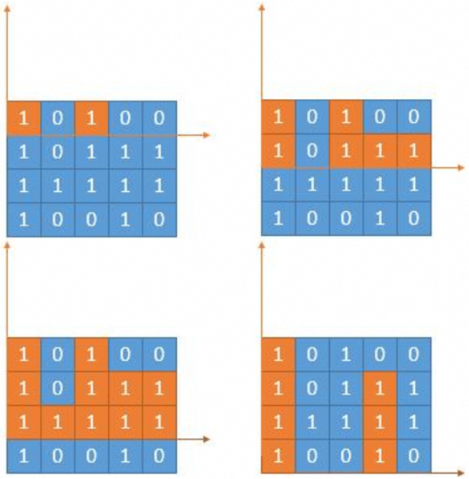

```java
public int maximalRectangle(char[][] matrix) {
    int row = matrix.length;
    int col = matrix[0].length;
    int maxArea = 0;
    int[] heights = new int[col];
    for (int i = 0; i < row; i++) {
        for (int j = 0; j < col; j++) {
            if (matrix[i][j] == '1')
                heights[j] += 1;
            else
                heights[j] = 0;
        }
        maxArea = Math.max(maxArea, largestRectangleArea(heights));
    }
    return maxArea;
}
```

### 10.4、接雨水 ⭐

> #42：https://leetcode-cn.com/problems/trapping-rain-water/  HOT100、牛客TOP101

**1、暴力法**

> 算法思想：对于当前柱子 height[i]，它的上方能接多少雨水？
>
> 向左找比它高的最高的柱子 height[left]，向右找比它高的最高的柱子 height[right]，
>
> 则**当前柱子上方**能接到的雨水 = min(height[left], height[right]) - height[i]
>
> - 时间复杂度：O(n<sup>2</sup>)
> - 空间复杂度：O(1)

```java
public int trap(int[] height) {
    if (height.length < 3) return 0;
    int sum = 0;
    for (int i = 1; i < height.length - 1; i++) {
        int leftMax = 0, rightMax = 0;
        for (int j = 0; j < i; j++) {	// i 左边找最大值
            leftMax = Math.max(leftMax, height[j]);
        }
        for (int j = i + 1; j < height.length; j++) {	// i 右边找最大值
            rightMax = Math.max(rightMax, height[j]);
        }
        // 只有当左右两边的最大值都比当前柱子高时，当前柱子才能接住雨水
        if (leftMax > height[i] && rightMax > height[i]) {
            sum += Math.min(leftMax, rightMax) - height[i];
        }
    }
    return sum;
}
```

**2、动态规划**

> 算法思想：暴力法的缺点在于，对于每一个柱子，都要遍历找它左、右两边的最高柱子，时间复杂度太高，能否将这些高度提前保存起来？定义 leftArr[i]、rightArr[i] 分别保存 i 左、右两边最高的柱子！
> - 时间复杂度：O(n)
> - 空间复杂度：O(n)

```java
public int trap(int[] height) {
    int sum = 0;
    int len = height.length;
    if (len < 3) {
        return 0;
    }
    int[] leftArr = new int[len];	  // 第一个元素和最后一个元素都为 0
    int[] rightArr = new int[len];    // 第一个元素和最后一个元素都为 0

    for (int i = 1; i < len; i++) {
        leftArr[i] = Math.max(leftArr[i - 1], height[i]);
    }
    for (int i = len - 2; i >= 0; i--) {
        rightArr[i] = Math.max(rightArr[i + 1], height[i]);
    }

    for (int i = 0; i < len; i++) {
        // 只有当左右两边的最大值都比当前柱子高时，当前柱子才能接住雨水
        if (leftArr[i] > height[i] && rightArr[i] > height[i]) {
            sum += Math.min(leftArr[i], rightArr[i]) - height[i];
        }
    }
    return sum;
}
```

**3、双指针**

> 算法思想：
> - 要点 1：柱子 i 上方能否接雨水，取决于 i 左右两侧的最大值 leftMax、rightMax，若 min(leftMax, rightMax) > height[i]，则柱子 i 上方可以接到 min(leftMax, rightMax) - height[i]；
> - 要点 2：双指针 i、j 分别从前向后、从后向前遍历；对于指针 i，leftMax 是准确的，因为 leftMax 的值是 i 遍历过来的，但 rightMax 并不准确，因为 i 不知道从 height[i...j] 之间是否有其他数 > rightMax；同理，对于指针 j，rightMax 是准确的，leftMax 并不准确；结论：对于指针 i，它右侧的真实的最大值 >= rightMax；对于指针 j，它左侧的真实的最大值 >= leftMax！
> - 要点 3：综上，当 leftMax < rightMax 时，左指针 i 能接到的雨水就可以确定了，是 leftMax - height[i]；同理：当 leftMax >= rightMax 时，右指针 j 能接到的雨水就可以确定了，是 rightMax - height[j]！
> ---
> - 时间复杂度：O(n)
> - 空间复杂度：O(1)

```java
public int trap(int[] height) {
    int sum = 0;
    int i = 0, j = height.length - 1;
    int leftMax = 0, rightMax = 0;
    while (i < j) {
        leftMax = Math.max(leftMax, height[i]);
        rightMax = Math.max(rightMax, height[j]);
        if (leftMax < rightMax) {
            sum += leftMax - height[i];
            i++;
        } else {
            sum += rightMax - height[j];
            j--;
        }
    }
    return sum;
}
```

**4、单调栈**

> 算法思想：https://leetcode-cn.com/problems/trapping-rain-water/solution/trapping-rain-water-by-ikaruga/
> - 情况1：若当前柱子比前面所有柱子都低时，是无法接住雨水的，如栈 [4, 3, 2]，当前柱子高度为 1；
> - 情况2：只要当前柱子比前一个柱子高，才有可能接住雨水，如 [4, 3, 2]，当前柱子高度为 5；
> - 所以使用单调递减栈！
> - 对于情况1，入栈即可；
> - 对于情况2，结算栈顶柱子能接多少雨水，并出栈，如：栈顶 2 只能接 1 个雨水，根据次栈顶和当前柱子计算；
> ---
> - 时间复杂度：O(n)
> - 空间复杂度：O(n)

```java
public int trap(int[] height) {
    if (height.length < 3) return 0;
    int sum = 0;
    Deque<Integer> stack = new ArrayDeque<>();
    for (int i = 0; i < height.length; i++) {
        while (!stack.isEmpty() && height[stack.peek()] < height[i]) {
            int top = stack.pop();
            // 栈顶柱子左边没有柱子了，那么栈顶柱子是无法接住雨水
            if (stack.isEmpty()) break;
            int left = stack.peek();
            int right = i;
            sum += (Math.min(height[left], height[right]) - height[top]) * (i - left - 1);
        }
        stack.push(i);
    }
    return sum;
}
```

### 10.5、每日温度 ⭐

> #739：https://leetcode-cn.com/problems/daily-temperatures/  HOT100、拼多多、华为、大疆
>
> 算法思想：找下一个最大元素，单调栈！
> - 时间复杂度：O(n)
> - 空间复杂度：O(n)

```java
public int[] dailyTemperatures(int[] temperatures) {
    int[] arr = new int[temperatures.length];
    Deque<Integer> stack = new ArrayDeque<>();
    for (int i = 0; i < temperatures.length; i++) {
        while (!stack.isEmpty() && temperatures[stack.peek()] < temperatures[i]) {
            Integer idx = stack.pop();
            arr[idx] = i - idx;
        }
        stack.push(i);
    }
    return arr;
}
```

### 10.6、下一个更大元素 II ⭐

> #503：https://leetcode.cn/problems/next-greater-element-ii/
>
> 算法思想：和 "#739 每日温度" 一样，只不过这里的数组是循环数组，自己做出来了！
>
> - 时间复杂度：O(n)
> - 空间复杂度：O(n)

```java
public int[] nextGreaterElements(int[] nums) {
    int[] arr = new int[nums.length];
    Arrays.fill(arr, -1);    // 防止特殊情况：所有元素都相等

    Deque<Integer> stack = new ArrayDeque<>();
    // 循环数组，最多遍历两轮，就能把所有元素的下一个更大元素都找出来
    for (int i = 0; i < nums.length * 2; i++) {
        while (!stack.isEmpty() && nums[i % nums.length] > nums[stack.peek()]) {
            Integer idx = stack.pop();
            arr[idx] = nums[i % nums.length];
        }
        stack.push(i % nums.length);
    }
    return arr;
}
```

### 10.7、移掉 K 位数字

> #402：https://leetcode.cn/problems/remove-k-digits/
>
> 算法思想：如 num = "1432219", k = 3
>
> 暴力法：找到第一个比右边数字大的，如 4，删掉；再找第二个比右边数字大的... 找 k 次，删 k 次！若 num 整体升序，找不到比右边数字大的，则直接删除最后一个数字；如果 num 整体升序，时间复杂度可达 O(kn)；
>
> 单调栈：
> - 时间复杂度：O(n)
> - 空间复杂度：O(n)

```java
public String removeKdigits(String s, int k) {
    Deque<Character> stack = new ArrayDeque<>();
    for (int i = 0; i < s.length(); i++) {
        while (!stack.isEmpty() && stack.peek() > s.charAt(i) && k-- > 0) stack.pop();
        stack.push(s.charAt(i));
    }
    while (k-- > 0) stack.pop();
    if (stack.isEmpty()) return "0";

    StringBuilder sb = new StringBuilder();
    stack.forEach(sb::append);
    sb.reverse();
    // 去除前导 0
    int i = 0;
    while (i < sb.length() && sb.charAt(i) == '0') i++;
    if (i == sb.length()) return "0";   // 全是 "0"
    return sb.substring(i);
}
```

## 11、计算器

> #224：https://leetcode.cn/problems/basic-calculator/
>
> #227：https://leetcode.cn/problems/basic-calculator-ii/

```java
Map<Character, Integer> map = new HashMap<Character, Integer>() {{
    put('+', 1);
    put('-', 1);
    put('*', 2);
    put('/', 2);
    put('%', 2);
    put('^', 3);
}};

public int calculate(String s) {
    s = s.replace(" ", "");
    Deque<Integer> numStack = new ArrayDeque<>();
    Deque<Character> opStack = new ArrayDeque<>();
    numStack.push(0);    // 防止第一个数为负
    int i = 0;
    while (i < s.length()) {
        char c = s.charAt(i);
        if (c == '(') {
            opStack.push(c);
            if (i + 1 < s.length() && s.charAt(i + 1) == '-')  // 防止括号内第一个数为负
                numStack.push(0);
        } else if (c == ')') {    // 遇到 )，计算 () 内的表达式
            while (!opStack.isEmpty()) {
                if (opStack.peek() != '(') {
                    calculate(numStack, opStack);
                } else {
                    opStack.pop();    // 删掉 (
                    break;
                }
            }
        } else if (Character.isDigit(c)) {
            int j = i + 1;
            while (j < s.length() && Character.isDigit(s.charAt(j))) j++;
            int num = Integer.parseInt(s.substring(i, j));
            numStack.push(num);
            i = j - 1;    // s[i...j] 都是数字，但后面有 i++，所以这里就取到 s[i...j-1]
        } else {
            // 当前字符是操作符，则将栈中能计算的都计算了
            // 只有满足「栈内运算符」比「当前运算符」优先级高/同等，才进行运算
            while (!opStack.isEmpty() && opStack.peek() != '(') {
                if (map.get(opStack.peek()) >= map.get(c))
                    calculate(numStack, opStack);
                else
                    break;
            }
            opStack.push(c);
        }
        i++;
    }
    while (!opStack.isEmpty()) calculate(numStack, opStack);    // 将剩余的计算完
    return numStack.peek();
}

private void calculate(Deque<Integer> numStack, Deque<Character> opStack) {
    if (numStack.size() < 2 || opStack.isEmpty()) return;
    int b = numStack.pop();
    int a = numStack.pop();
    char op = opStack.pop();
    if (op == '+') numStack.push(a + b);
    else if (op == '-') numStack.push(a - b);
    else if (op == '*') numStack.push(a * b);
    else if (op == '/') numStack.push(a / b);
    else if (op == '%') numStack.push(a % b);
    else if (op == '^') numStack.push((int) Math.pow(a, b));
}
```

# 八、排序 ⭐

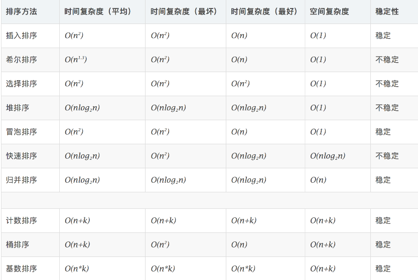

## 1、第 k 大元素

> #215：https://leetcode-cn.com/problems/kth-largest-element-in-an-array/  HOT100、牛客TOP101
>
> 面试：快排、堆排为什么不稳定？
>
> - 快排：[1, 2(a), 2(b), 3]，当 pivot = 2(b) 时，将所有 >= 2 的数放在右边，即：[1, 2(b), 2(a), 3]，不稳定！若把 >= 改成 >，当 pivot = 2(a) 时，将所有 > 2 的数放在右边，即：即：[1, 2(b), 2(a), 3]，同样不稳定！
>
> - 堆排：[3(a), 3(b), 2, 1]，删除堆顶时把堆顶放到**堆的末尾**，heapSize--，即：[3(b), 2, 1, 3(a)]；
>
>   再次删除堆顶时，[2, 1, 3(b), 3(a)]，3(a) 和 3(b) 交换了位置，不稳定！

**1.1、快排**

> - 时间复杂度：O(n log n)
> - 空间复杂度：O(log n)
> - 二维快排见：#406

```java
public int findKthLargest(int[] nums, int k) {
    quickSort(nums, 0, nums.length - 1);
    return nums[nums.length - k];
}

private void quickSort(int[] nums, int left, int right) {
    if (left >= right) return;
    // 元素 p 被放到其最终位置，p 左边的都是比 p 小的，p 右边的都是比 p 大的，所以对其左右分别递归
    int p = randomPartition(nums, left, right);
    quickSort(nums, left, p - 1);
    quickSort(nums, p + 1, right);
}

private int randomPartition(int[] nums, int left, int right) {
    int randomIndex = left + new Random().nextInt(right - left + 1);    // 生成随机数 ∈[left, right]
    swap(nums, left, randomIndex);
    return partition(nums, left, right);
}

private int partition(int[] nums, int left, int right) {
    int temp = nums[left];
    while (left < right) {
        while (left < right && nums[right] >= temp) right--;    // 从右到左找第一个比自己小的
        nums[left] = nums[right];
        while (left < right && nums[left] <= temp) left++;      // 从左到右找第一个比自己大的
        nums[right] = nums[left];
    }
    nums[left] = temp;    // left == right 时循环结束，将元素 p 放到其最终位置
    return left;
}

private void swap(int[] nums, int i, int j) {
    int temp = nums[i];
    nums[i] = nums[j];
    nums[j] = temp;
}
```

**1.2、快速选择**

> 算法思想：题目要求查找倒数第 k 大的数，没有必要全排序，只需要找到第 k 大的数的索引即可。
> 
> 快速选择：适合求数组第 k 大 / 小，或求数组 Top K，时间复杂度都是 O(n)！
> 
> 如：[4, 7, 8, 5, 2, 1, 9]，以 5 为枢轴元素排序后：[4, 2, 1, 5, 7, 8, 9]，
> 
> 若求第 k = 2 大元素，则只需在 [7, 8, 9] 递归，[4, 2, 1, 5] 不用管！
> 
> - 时间复杂度：O(n)：证明过程复杂，详见算法导论
> - 空间复杂度：O(log n)

```java
public int findKthLargest(int[] nums, int k) {
    // 若对 nums[] 排序，则第 k 大的数的下标为 nums.length - k
    quickSelect(nums, 0, nums.length - 1, nums.length - k);
    return nums[nums.length - k];
}

private void quickSelect(int[] nums, int left, int right, int targetIndex) {
    int p = randomPartition(nums, left, right);
    if (p == targetIndex) return;
    if (p > targetIndex) {	  // 第 k 大的数在 [left, p-1] 之间
        quickSelect(nums, left, p - 1, targetIndex);
    } else {
        quickSelect(nums, p + 1, right, targetIndex);
    }
}
```

**1.3、堆排**

> 算法思想：直接将原数组看作堆，删除堆顶 nums[0] 时，直接 swap(nums[0], nums[n-1])，heapSize--，再向下调整。
> 
> - 时间复杂度：O(n log k)
> - 空间复杂度：O(k)

```java
public int findKthLargest(int[] nums, int k) {
    int n = nums.length, heapSize = n;
    // 构建大顶堆
    buildMaxHeap(nums, n);
    // 循环 k-1 次，则堆顶就是 topK；若循环 n 次，则整个数组有序！
    for (int i = n - 1; i > n - k; i--) {
        swap(nums, 0, i);
        maxHeapify(nums, 0, --heapSize);  // 删除一个元素，heapSize--
    }
    return nums[0];
}

// 构建大顶堆：自底向上依次向下调整非叶节点
private void buildMaxHeap(int[] nums, int n) {
    for (int i = n / 2 - 1; i >= 0; i--) {    // 最后一个非叶节点：n/2 - 1
        maxHeapify(nums, i, n);
    }
}

// 向下调整
private void maxHeapify(int[] nums, int root, int heapSize) {    // root：当前子树的根节点
    int left = root * 2 + 1;     // 左孩子 nums[2n+1]
    int right = root * 2 + 2;    // 右孩子 nums[2n+2]
    int max = root;
    if (right < heapSize && nums[right] > nums[max]) {
        max = right;
    }
    if (left < heapSize && nums[left] > nums[max]) {
        max = left;
    }
    // 不符合最大堆，向下调整
    if (max != root) {
        swap(nums, root, max);
        maxHeapify(nums, max, heapSize);
    }
}

private void swap(int[] nums, int i, int j) {
    int temp = nums[i];
    nums[i] = nums[j];
    nums[j] = temp;
}
```

## 2、最小的 k 个数

> #剑指offer40：https://leetcode-cn.com/problems/zui-xiao-de-kge-shu-lcof/  牛客TOP101
>
> Top K 问题的两种解决方案：

|          | 时间复杂度   | 空间复杂度 |
| :------- | :----------- | :--------- |
| 堆排     | O(n × log k) | O(k)       |
| 快速选择 | O(n)         | O(log n)   |

> 面试常问两种方法的优劣：
>
> - 注重时间就用快速选择，注重空间就用堆排；
> - 堆排更适合求解大数据的 Top K；
> - 快速选择会修改原数组，如果原数组不能修改，还必须把数组 copy 一份才能用快速选择，空间复杂度退化到 O(n)！

**1、堆排**

```java
public int[] getLeastNumbers(int[] arr, int k) {
    if (k == 0) return new int[0];
    Queue<Integer> maxHeap = new PriorityQueue<>((o1, o2) -> o2 - o1);
    for (int i = 0; i < k; i++) {
        maxHeap.offer(arr[i]);
    }
    for (int i = k; i < arr.length; i++) {
        if (arr[i] < maxHeap.peek()) {
            maxHeap.poll();
            maxHeap.offer(arr[i]);
        }
    }
    return maxHeap.stream().mapToInt(Integer::intValue).toArray();
}
```

**2、快速选择**

```java
public int[] getLeastNumbers(int[] nums, int k) {
    if (k == 0) return new int[0];
    quickSelect(nums, 0, nums.length - 1, k - 1);
    return Arrays.copyOf(nums, k);
}

private void quickSelect(int[] nums, int left, int right, int maxTargetIndex) {
    if (left >= right) return;
    int p = randomPartition(nums, left, right);
    if (p == maxTargetIndex) return;    // 部分排序完成，返回
    if (p > maxTargetIndex) {           // 最小的 k 个数一定在前 p 个数中，递归划分
        quickSelect(nums, left, p - 1, maxTargetIndex);
    } else {                            // 在右侧数组中寻找最小的 k-p 个数
        quickSelect(nums, p + 1, right, maxTargetIndex);
    }
}
```

## 3、颜色分类

> #75：https://leetcode-cn.com/problems/sort-colors/  HOT100

**3.1、计数排序**

>- 扫描两遍
>- 时间复杂度：O(n)
>- 空间复杂度：O(1)

```java
public void sortColors(int[] nums) {
    int cnt0 = 0;
    int cnt1 = 0;
    int cnt2 = 0;
    for (int num : nums) {
        if (num == 0)         cnt0++;
        else if (num == 1)    cnt1++;
        else 			      cnt2++;
    }
    int i = 0;
    while (cnt0-- > 0) nums[i++] = 0;
    while (cnt1-- > 0) nums[i++] = 1;
    while (cnt2-- > 0) nums[i++] = 2;
}
```

**3.2、三指针**

>- 扫描一遍，把前面的 2 移到末尾，把后面的 0 移到头部
>- 时间复杂度：O(n)
>- 空间复杂度：O(1)

```java
void sortColors(int[] nums) {
    int left = 0;
    int right = nums.length - 1;
    int i = 0;
    while (i <= right) {
        if (nums[i] == 0)
            swap(nums, i++, left++);	// 把 0 移到头部
        else if (nums[i] == 2)
            /*
            	把 2 移到末尾，注意：i 不能 ++，因为 2 换过来的可能是 0，
            	如：nums[] = [1, 2, 0] -> [1, 0, 2]
            	若 i++，则循环结束，答案就是 [1, 0, 2]，是错的！
            	若 i 不变，则下一轮循环中，0 会和 1 交换，是对的！
            */
            swap(nums, i, right--);
        else
            i++;
    }
}
```

## 4、数组中的逆序对

> #剑指offer51：https://leetcode-cn.com/problems/shu-zu-zhong-de-ni-xu-dui-lcof/  牛客TOP101
>
> 算法思想：只需在归并排序加一行代码即可，如下图：
>
> - 将原始数组 arr[] 切分成左右子数组 (均有序)，并拷贝到辅助数组 temp[]；
>
> - temp[i] > temp[j]，所以 arr[k++] = temp[j++]，此时在辅助数组 temp[] 中，左子数组的 4 个元素均与 1 构成逆序对，因此 cnt += 4；
>
> 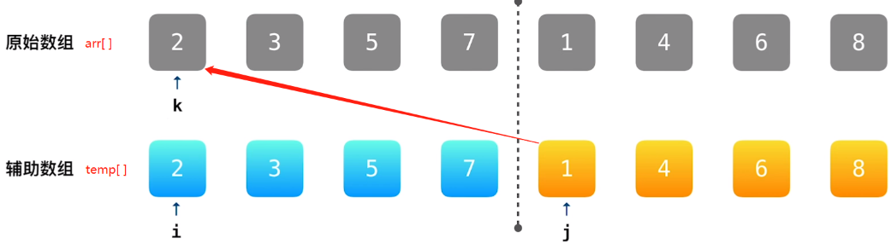
>
> 如下图：
>
> - temp[i] <= temp[j]，则 arr[k++] = temp[i++]，此时在辅助数组 temp[] 中，2 不与任何元素构成逆序对，(2, 1) 在上一步已经算进去了；
>
> 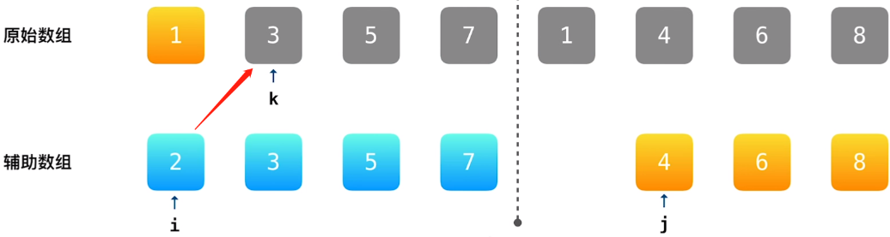
>
> - 时间复杂度：O(n log n)
> - 空间复杂度：O(n)

```java
int cnt = 0;
int[] temp;

public int reversePairs(int[] nums) {
    temp = Arrays.copyOf(nums, nums.length);  // 辅助数组，提前创建好，不要在 merge 中创建，频繁创建销毁很耗时！
    mergeSort(nums, 0, nums.length - 1);
    return cnt;
}

public void mergeSort(int[] nums, int left, int right) {
    if (left >= right) return;
    int mid = left + (right - left) / 2;
    mergeSort(nums, left, mid);
    mergeSort(nums, mid + 1, right);
    merge(nums, left, mid, right);
}

public void merge(int[] nums, int left, int mid, int right) {
    for (int i = left; i <= right; i++) {
        temp[i] = nums[i];	            // 辅助数组，temp[left...mid] 和 temp[mid+1...right] 均有序，合并！
    }
    int i = left;						// i 指向第一个数组第一个元素
    int j = mid + 1;					// j 指向第二个数组第一个元素
    int k = left;
    while (i <= mid && j <= right) {	// 开始合并两个数组
        if (temp[i] <= temp[j]) {
            nums[k++] = temp[i++];
        } else {
            nums[k++] = temp[j++];
            cnt += mid - i + 1;         // 只需在归并排序加一行代码即可，temp[j] 与 temp[i...mid] 都构成逆序对
        }
    }
    // 若其中一个数组没合并完，还有剩余
    while (i <= mid) nums[k++] = temp[i++];
    while (j <= right) nums[k++] = temp[j++];
}
```

# 九、树

## 1、树的遍历 ⭐