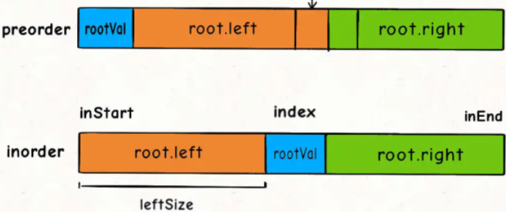
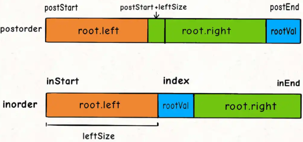
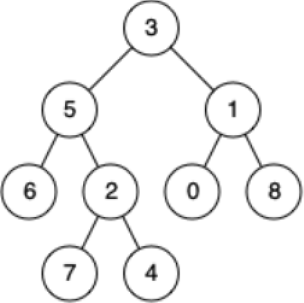
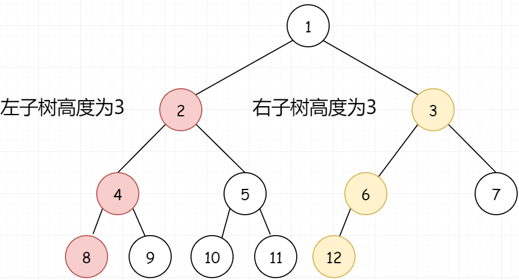
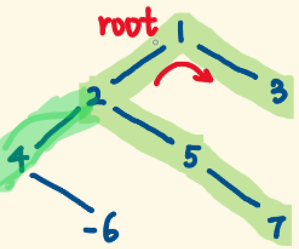

# 九、树

## 1、树的遍历 ⭐

> HOT100、牛客TOP101
>
> - 时间复杂度：O(n)
> - 空间复杂度：O(n)
>
> 迭代法实现：双色标记法！
>
> - 未访问的节点为白色，已访问的节点为灰色。
> - 如果遇到灰色节点，则直接输出节点，表示已访问；
> - 如果遇到白色节点，则将其标记为灰色，并将其自身、左孩子、右孩子按一定顺序入栈。

### 1.1、先序遍历

> #144：https://leetcode-cn.com/problems/binary-tree-preorder-traversal/submissions/

```java
// 递归
List<Integer> list = new ArrayList<>();

public List<Integer> preorderTraversal(TreeNode root) {
    preorder(root);
    return list;
}

public void preorder(TreeNode root){
    if (root == null) return;
    list.add(root.val);
    preorder(root.left);
    preorder(root.right);
}
```

```java
// 迭代，先序遍历顺序为 "root → left → right"，所以入栈顺序为："right → left → root" 
public List<Integer> preorderTraversal(TreeNode root) {
    List<Integer> list = new ArrayList<>();
    if (root == null) return list;
    Deque<Object> stack = new ArrayDeque<>();
    stack.push(root);
    while (!stack.isEmpty()) {
        Object node = stack.pop();
        if (node instanceof TreeNode) {    // 白色，表示未访问
            TreeNode treeNode = (TreeNode) node;
            if (treeNode.right != null) stack.push(treeNode.right);
            if (treeNode.left  != null) stack.push(treeNode.left);
            stack.push(treeNode.val);
        } else {    					   // 灰色，表示已访问
            list.add((Integer) node);
        }
    }
    return list;
}
```

### 1.2、中序遍历

> #94：https://leetcode-cn.com/problems/binary-tree-inorder-traversal/

```java
// 递归
List<Integer> list = new ArrayList<>();

public List<Integer> inorderTraversal(TreeNode root) {
    inorder(root);
    return list;
}

public void inorder(TreeNode root){
    if (root == null) return;
    inorder(root.left);
    list.add(root.val);
    inorder(root.right);
}
```

```java
// 迭代，中序遍历顺序为 "left → root → right"，所以入栈顺序为："right → root → left" 
public List<Integer> inorderTraversal(TreeNode root) {
    List<Integer> list = new ArrayList<>();
    if (root == null) return list;
    Deque<Object> stack = new ArrayDeque<>();
    stack.push(root);
    while (!stack.isEmpty()) {
        Object node = stack.pop();
        if (node instanceof TreeNode) {    // 白色，表示未访问
            TreeNode treeNode = (TreeNode) node;
            if (treeNode.right != null) stack.push(treeNode.right);
            stack.push(treeNode.val);
            if (treeNode.left  != null) stack.push(treeNode.left);
        } else {    					   // 灰色，表示已访问
            list.add((Integer) node);
        }
    }
    return list;
}
```

### 1.3、后序遍历

> #145：https://leetcode-cn.com/problems/binary-tree-postorder-traversal/

```java
// 递归
List<Integer> list = new ArrayList<>();

public List<Integer> postorderTraversal(TreeNode root) {
    postorder(root);
    return list;
}

public void postorder(TreeNode root) {
    if (root == null) return;
    postorder(root.left);
    postorder(root.right);
    list.add(root.val);
}
```

```java
// 迭代，后序遍历顺序为 "left → right → root"，所以入栈顺序为："root → right → left" 
public List<Integer> postorderTraversal(TreeNode root) {
    List<Integer> list = new ArrayList<>();
    if (root == null) return list;
    Deque<Object> stack = new ArrayDeque<>();
    stack.push(root);
    while (!stack.isEmpty()) {
        Object node = stack.pop();
        if (node instanceof TreeNode) {    // 白色，表示未访问
            TreeNode treeNode = (TreeNode) node;
            stack.push(treeNode.val);
            if (treeNode.right != null) stack.push(treeNode.right);
            if (treeNode.left  != null) stack.push(treeNode.left);
        } else {    					   // 灰色，表示已访问
            list.add((Integer) node);
        }
    }
    return list;
}
```

### 1.4、层序遍历

> #102：https://leetcode-cn.com/problems/binary-tree-level-order-traversal/

```java
// 递归1：dfs
List<List<Integer>> lists = new ArrayList<>();

public List<List<Integer>> levelOrder(TreeNode root) {
    if (root == null) return lists;
    dfs(root, 0);
    return lists;
}

private void dfs(TreeNode root, int height) {
    if (root == null) return;
    if (lists.size() <= height) {
        lists.add(new ArrayList<>());
    }
    lists.get(height).add(root.val);
    dfs(root.left, height + 1);
    dfs(root.right, height + 1);
}
```

```java
// 递归2：bfs
List<List<Integer>> lists = new ArrayList<>();

public List<List<Integer>> levelOrder(TreeNode root) {
    if (root == null) return lists;
    List<TreeNode> level = new ArrayList<>();        // 当前层所有节点
    level.add(root);
    bfs(level);
    return lists;
}

private void bfs(List<TreeNode> level) {
    if (level.isEmpty()) return;
    // 当前层所有节点的值
    List<Integer> levelVal = level.stream().map(o -> o.val).collect(Collectors.toList());
    lists.add(levelVal);
    List<TreeNode> nextLevel = new ArrayList<>();    // 下一层所有节点
    for (TreeNode node : level) {
        if (node.left != null) nextLevel.add(node.left);
        if (node.right != null) nextLevel.add(node.right);
    }
    bfs(nextLevel);
}
```

```java
// 迭代
public List<List<Integer>> levelOrder(TreeNode root) {
   List<List<Integer>> lists = new ArrayList<>();
   if (root == null) return lists;
   Queue<TreeNode> queue = new ArrayDeque<>();
   queue.add(root);
   while (!queue.isEmpty()) {
      List<Integer> level = new ArrayList<>();     // 当前层的所有节点！！！
      int size = queue.size();
      for (int i = 0; i < size; i++) {
         TreeNode node = queue.poll();
         level.add(node.val);
         if (node.left != null) queue.add(node.left);
         if (node.right != null) queue.add(node.right);
      }
      lists.add(level);
   }
   return lists;
}

// 若题目要计算空节点，即：当前节点 node 的子节点为空，可以 queue.offer(new TreeNode(Integer.MIN_VALUE))
// 详见 #101 对称二叉树：https://leetcode-cn.com/problems/symmetric-tree/ 自己提交的代码 (HOT100)
```

### 1.5、n 叉树遍历

```java
class TreeNode {
    int val;
    TreeNode[] children;
}

// 框架
void traverse(TreeNode root) {
    for (TreeNode child : root.children)
        traverse(child);
}
```

## 2、翻转二叉树 (二叉树的镜像) ⭐

> #226：https://leetcode-cn.com/problems/invert-binary-tree/  HOT100、剑指 Offer 27
> - 时间复杂度：O(n)
> - 空间复杂度：O(log n)

```java
// 1.自顶向下（先序遍历）
public TreeNode invertTree(TreeNode root) {
    if (root == null) return null;
    swapLeftAndRight(root);    // 1.根
    invertTree(root.left);     // 2.左
    invertTree(root.right);    // 3.右
    return root;
}

private void swapLeftAndRight(TreeNode root) {
    TreeNode temp = root.left;
    root.left = root.right;
    root.right = temp;
}
```

```java
// 2.自底向上（后序遍历）
public TreeNode invertTree(TreeNode root) {
    if (root == null) return null;
    TreeNode left = invertTree(root.left);     // 1.左
    TreeNode right = invertTree(root.right);   // 2.右
    // 3.根
    root.left = right;
    root.right = left;
    return root;
}
```

```java
// 迭代：层序
public TreeNode invertTree(TreeNode root) {
    if (root == null) return null;
    Queue<TreeNode> queue = new LinkedList<>();
    queue.offer(root);
    while (!queue.isEmpty()) {
        int size = queue.size();
        for (int i = 0; i < size; i++) {
            TreeNode node = queue.poll();
            swapLeftAndRight(node);
            if (node.left != null) queue.offer(node.left);
            if (node.right != null) queue.offer(node.right);
        }
    }
    return root;
}
```

## 3、平衡二叉树 ⭐

> #110：https://leetcode-cn.com/problems/balanced-binary-tree/  剑指offer55、牛客HOT101

**3.1、自顶向下 (先序)**

> - 时间复杂度：O(n<sup>2</sup>)：isBalanced() 要调用 n 次，每次 isBalanced() 都要调用 getHeight()
>   - getHeight() 平均时间复杂度为 O(log n)，因此总的时间复杂度是 O(n log n)；
>   - 若二叉树退化成单链表，则 getHeight() 的时间复杂度退化到 O(n)，因此总的时间复杂度退化到 O(n<sup>2</sup>)。
> - 空间复杂度：O(n)，平均 O(log n)，若二叉树退化成单链表，则变成 O(n)。
> - getHeight() 重复计算，效率低。

```java
public boolean isBalanced(TreeNode root) {
    if (root == null) return true;
    int left = getHeight(root.left);
    int right = getHeight(root.right);
    return Math.abs(left - right) < 2 && isBalanced(root.left) && isBalanced(root.right);
}

// 迭代求树高：层序遍历
private int getHeight(TreeNode root) {
    if (root == null) return 0;
    return Math.max(getHeight(root.left), getHeight(root.right)) + 1;
}
```

**3.2、自底向上 (后序)**

> getHeight() 没有重复计算，效率高。
> 
> - 时间复杂度：O(n)
> - 空间复杂度：O(n)

```java
public boolean isBalanced(TreeNode root) {
    return getHeight(root) != -1;
}

public int getHeight(TreeNode root) {
    if (root == null) return 0;
    int left = getHeight(root.left);
    int right = getHeight(root.right);
    if (left == -1 || right == -1 || Math.abs(left - right) > 1)    // 如果子树不平衡，直接返回-1
        return -1;
    return Math.max(left, right) + 1;     // 如果子树平衡，高度就是左右子树高度最大值 + 1
}
```

## 4、填充每个节点的下一个右侧节点指针

> #116：https://leetcode-cn.com/problems/populating-next-right-pointers-in-each-node/
>
> 注意：如下代码是错误的，因为在输入案例中连不了 5 → 6
>
> ```java
> public Node connect(Node root) {
>     if (root == null || root.left == null) return null;
>     root.left.next = root.right;
>     connect(root.left);
>     connect(root.right);
>     return root;
> }
> ```

```java
public Node connect(Node root) {
    if (root == null) return null;
    connect(root.left, root.right);
    return root;
}

public void connect(Node root1, Node root2) {
    if (root1 == null || root2 == null) return;
    root1.next = root2;
    connect(root1.left, root1.right);
    connect(root2.left, root2.right);
    connect(root1.right, root2.left);
}
// 也可用层序遍历，更简单
```

## 5、将二叉树展开为链表 ⭐

> #114：https://leetcode-cn.com/problems/flatten-binary-tree-to-linked-list/  HOT100
>
> 算法思想：
>
> 1. 将左子树拉成链表；
> 2. 将右子树拉成链表；
> 3. 将右子树接到左子树末尾。
>
> - 时间复杂度：O(n)
> - 空间复杂度：O(n)

```java
public void flatten(TreeNode root) {
    if (root == null) return;
    flatten(root.left);
    flatten(root.right);
    TreeNode left = root.left;    // 也可移到递归前
    TreeNode right = root.right;  // 也可移到递归前
    root.left = null;
    root.right = left;
    TreeNode p = root;
    while (p.right != null) p = p.right;
    p.right = right;
}
```

## 6、构造二叉树 ⭐

### 6.1、最大二叉树

> #654：https://leetcode-cn.com/problems/maximum-binary-tree/
>
> - 时间复杂度：O(n<sup>2</sup>)
> - 空间复杂度：O(n)

```java
public TreeNode constructMaximumBinaryTree(int[] nums) {
    if (nums.length == 0) return null;
    return buildMaximumBinaryTree(nums, 0, nums.length - 1);
}

private TreeNode buildMaximumBinaryTree(int[] nums, int left, int right) {
    if (left == right) return new TreeNode(nums[left]);
    if (left > right) return null;
    int maxIdx = getMaxIdx(nums, left, right);
    TreeNode root = new TreeNode(nums[maxIdx]);
    root.left = buildMaximumBinaryTree(nums, left, maxIdx - 1);
    root.right = buildMaximumBinaryTree(nums, maxIdx + 1, right);
    return root;
}

private int getMaxIdx(int[] nums, int left, int right) {
    int maxIndex = left;
    for (int i = left + 1; i <= right; i++) {
        if (nums[i] > nums[maxIndex])
            maxIndex = i;
    }
    return maxIndex;
}
```

### 6.2、前序 + 中序构造

> #105：https://leetcode-cn.com/problems/construct-binary-tree-from-preorder-and-inorder-traversal  剑指offer07、HOT100
>
> - 时间复杂度：O(n)
> - 空间复杂度：O(n)
>
> 重点是如何填写 build() 的参数：
>
> 对于左右子树对应的 inorder[] 的起始索引和终止索引比较容易确定：


> 对于 preorder[] 呢？如何确定左右数组对应的起始索引和终止索引？可以通过左子树的节点数推导出来，因为中序数组的左子树的节点数必定等于前序数组左子树的节点数，假设左子树的节点数为 leftSize，那么 preorder[] 上的索引情况是这样的：



```java
Map<Integer, Integer> map = new HashMap<>();

public TreeNode buildTree(int[] preorder, int[] inorder) {
    int n = preorder.length;
    if (n == 0) return null;
    for (int i = 0; i < inorder.length; i++)
        map.put(inorder[i], i);
    return build(preorder, 0, n - 1, inorder, 0, n - 1);
}

public TreeNode build(int[] preorder, int preStart, int preEnd, int[] inorder, int inStart, int inEnd) {
    if (preStart > preEnd) return null;

    int rootValue = preorder[preStart];
    int rootIndex = map.get(rootValue);
    TreeNode root = new TreeNode(rootValue);

    int leftSize = rootIndex - inStart;
    root.left =  build(preorder, preStart + 1, preStart + leftSize, inorder, inStart, rootIndex - 1);
    root.right = build(preorder, preStart + leftSize + 1, preEnd,   inorder, rootIndex + 1, inEnd);
    return root;
}
```

### 6.3、中序 + 后序构造

> #106：https://leetcode-cn.com/problems/construct-binary-tree-from-inorder-and-postorder-traversal/
>
> - 时间复杂度：O(n)
> - 空间复杂度：O(n)



```java
Map<Integer, Integer> map = new HashMap<>();

public TreeNode buildTree(int[] inorder, int[] postorder) {
    int n = inorder.length;
    if (n == 0) return null;
    for (int i = 0; i < inorder.length; i++)
        map.put(inorder[i], i);
    return build(inorder, 0, n - 1, postorder, 0, n - 1);
}

public TreeNode build(int[] inorder, int inStart, int inEnd, int[] postorder, int postStart, int postEnd) {
    if (postStart > postEnd) return null;

    int rootValue = postorder[postEnd];
    int rootIndex = map.get(rootValue);
    TreeNode root = new TreeNode(rootValue);

    int leftSize = rootIndex - inStart;
    root.left =  build(inorder, inStart, rootIndex - 1, postorder, postStart, postStart + leftSize - 1);
    root.right = build(inorder, rootIndex + 1, inEnd,   postorder, postStart + leftSize, postEnd - 1);
    return root;
}
```

## 7、寻找重复的子树

> #652：https://leetcode-cn.com/problems/find-duplicate-subtrees/
>
> 算法思想：
>
> 1. 以 root 为根的二叉树 / 子树长啥样？
> 2. 以其他节点为根的子树都长啥样？
> 3. 根据以上两个问题，可将所有子树的序列化结果存到 map 中，遍历到当前节点时，将当前节点的子树序列化，判断是否在 map 中即可。
>
> - 时间复杂度：O(n<sup>2</sup>)
> - 空间复杂度：O(n)

```java
Map<String, Integer> map = new HashMap<>();
List<TreeNode> list = new ArrayList<>();

public List<TreeNode> findDuplicateSubtrees(TreeNode root) {
    if (root == null) return null;
    traverse(root);
    return list;
}

private String traverse(TreeNode root) {
    // 序列化以 root 为根的子树
    if (root == null) return null;
    StringBuilder sb = new StringBuilder();
    String left = traverse(root.left);
    String right = traverse(root.right);
    sb.append(left).append(",").append(right).append(",").append(root.val);
    String s = sb.toString();
    Integer cnt = map.getOrDefault(s, 0);
    if (cnt == 1) list.add(root);  // 第一次遇到相同的子树才加进 list，后面再遇到就不加了，去重！
    map.put(s, cnt + 1);
    return sb.toString();
}
```

## 8、二叉搜索树 (二叉排序树)

### 8.1、验证二叉搜索树 ⭐

> #98：https://leetcode-cn.com/problems/validate-binary-search-tree/  HOT100

```java
// 错误示例：
public boolean isValidBST(TreeNode root) {
    if (root == null) return true;
    if (root.left != null && root.left.val >= root.val) return false;
    if (root.right != null && root.right.val <= root.val) return false;
    return isValidBST(root.left) && isValidBST(root.right);
}
// 以上代码不能正确验证如下的树：5 < 6，不是 BST。所以在判断 6 时，不能只传入当前节点 4，还要带上"上界5"
   5
4     7
 6 
```

```java
/* 法1：中序遍历，判断是否升序
 * 时间复杂度：O(n)
 * 空间复杂度：平均 O(log n)，最坏 O(n)
 */
boolean flag = true;
long pre = Long.MIN_VALUE;

public boolean isValidBST(TreeNode root) {
    if (root == null) return true;
    inorder(root);
    return flag;
}

private void inorder(TreeNode root) {
    if (root == null) return;
    inorder(root.left);
    if (root.val <= pre) {
        flag = false;
        return;
    }
    pre = root.val;
    inorder(root.right);
}

/* 法2：递归（先序），带上下界
 * 时间复杂度：O(n)
 * 空间复杂度：平均 O(log n)，最坏 O(n)
 */
public boolean isValidBST(TreeNode root) {
    if (root == null) return true;
    return isValidBST(root, Long.MIN_VALUE, Long.MAX_VALUE);
}

private boolean isValidBST(TreeNode root, long min, long max){
    if (root == null) return true;
    if (root.val <= min || root.val >= max) return false;
    return isValidBST(root.left, min, root.val) && isValidBST(root.right, root.val, max);
}
```

### 8.2、插入节点
> #701：https://leetcode-cn.com/problems/insert-into-a-binary-search-tree/
```java
/* 法1：迭代
 * 时间复杂度：O(n)
 * 空间复杂度：O(1)
 */
public TreeNode insertIntoBST(TreeNode root, int val) {
    TreeNode node = new TreeNode(val);
    if (root == null) return node;
    TreeNode pre = null;
    TreeNode cur = root;
    while (cur != null) {
        pre = cur;
        if (cur.val < val) cur = cur.right;
        else cur = cur.left;
    }
    if (val < pre.val) pre.left = node;
    else pre.right = node;
    return root;
}

/* 法2：递归
 * 时间复杂度：O(n)
 * 空间复杂度：平均 O(log n)，最坏 O(n)
 */
public TreeNode insertIntoBST(TreeNode root, int val) {
    if (root == null) return new TreeNode(val);
    if (val < root.val)
        root.left = insertIntoBST(root.left, val);
    else
        root.right = insertIntoBST(root.right, val);
    return root;
}
```

### 8.3、删除节点

> #450：https://leetcode-cn.com/problems/delete-node-in-a-bst/
>
> 迭代法巨难写。。。
>
>  * 时间复杂度：O(log n)
>  * 空间复杂度：平均 O(log n)，最坏 O(n)

```java
public TreeNode deleteNode(TreeNode root, int key) {
    if (root == null) return null;
    if (key < root.val) {
        root.left = deleteNode(root.left, key);
    } else if (key > root.val) {
        root.right = deleteNode(root.right, key);
    } else {
        if (root.left == null) return root.right;	// 左子树为空，右子树不为空，右子树的根节点代替被删节点
        if (root.right == null) return root.left;	// 右子树为空，左子树不为空，左子树的根节点代替被删节点
        TreeNode candidateNode = getMinRight(root.right);  // 左右子树均非空，用右子树最左下的节点代替被删节点
        root.val = candidateNode.val;
        root.right = deleteNode(root.right, candidateNode.val);
    }
    return root;
}

private TreeNode getMinRight(TreeNode root) {
    while (root.left != null) root = root.left;
    return root;
}
```

### 8.4、转为累加树 ⭐

> #538：https://leetcode-cn.com/problems/convert-bst-to-greater-tree/  HOT100
>
> 算法思想：看给出的例子的图，从右到左看：8 变成了 8，7 变成了 8+7，6 变成了 8+7+6...

```java
int sum = 0;

public TreeNode convertBST(TreeNode root) {
    traverse(root);
    return root;
}

private void traverse(TreeNode root) {
    if (root == null) return;
    traverse(root.right);
    sum += root.val;
    root.val = sum;
    traverse(root.left);
}
```

### 8.5、不同的二叉搜索树 ⭐

> #96：https://leetcode-cn.com/problems/unique-binary-search-trees/  HOT100
>
> 算法思想：
> - 设 n 个节点存在二叉排序树的总个数为 g(n)，设以 j 为根的二叉搜索树的总个数为 f(j)，则 g(n) = f(1) + f(2) + f(3) + ... + f(n)；
> - 当 i 为根节点时，其左子树节点个数为 i-1 个，右子树节点为 n-i 个，则 f(i) = g(i-1) * g(n-i)；

```java
public int numTrees(int n) {
    return count(1, n);
}

// 计算 [left, right] 二叉搜索树的总个数
private int count(int left, int right) {
    if (left >= right) return 1;
    int sum = 0;
    for (int root = left; root <= right; root++) {
        int cnt1 = count(left, root - 1);
        int cnt2 = count(root + 1, right);
        sum += cnt1 * cnt2;
    }
    return sum;
}
```

> - 以上代码时间复杂度为 O(n<sup>2</sup>)，但存在大量重复计算，效率很低！用 DP 优化！
> ---
> - 时间复杂度：O(n<sup>2</sup>)
> - 空间复杂度：O(n)

```java
public int numTrees(int n) {
    int[] dp = new int[n + 1];            // dp[i] 表示：总的节点数为 i 时，不同的二叉搜索树的个数；
    dp[0] = 1;
    dp[1] = 1;
    dp[2] = 2;
    for (int i = 3; i <= n; i++) {        // 总的节点个数为 i
        for (int j = 1; j <= i; j++) {    // j 为根节点时，左子树有 j-1 个节点，右子树有 i-j 个节点
            dp[i] += dp[j - 1] * dp[i - j];
        }
    }
    return dp[n];
}
```

### 8.6、不同的二叉搜索树 II

> #95：https://leetcode-cn.com/problems/unique-binary-search-trees-ii/
>
> 算法思想：回溯
>
> - 时间复杂度：O(4<sup>n</sup> / √n)：卡特兰数
> - 空间复杂度：O(4<sup>n</sup> / √n)

```java
public List<TreeNode> generateTrees(int n) {
    if (n == 0) return new ArrayList<>();
    return build(1, n);
}

// 构造 [left, right] 组成的 BST
private List<TreeNode> build(int left, int right) {
    List<TreeNode> list = new ArrayList<>();
    if (left > right) {    // 说明无法产生子树，返回 null，表示子树为空
        list.add(null);
        return list;
    }
    if (left == right) {
        list.add(new TreeNode(left));
        return list;
    }
    // 1.穷举 root 节点的所有可能
    for (int i = left; i <= right; i++) {
        // 2.递归构造出左右子树的所有合法 BST
        List<TreeNode> leftTree = build(left, i - 1);
        List<TreeNode> rightTree = build(i + 1, right);
        // 3.给 root 节点穷举所有左右子树的组合
        for (TreeNode leftNode : leftTree) {
            for (TreeNode rightNode : rightTree) {
                TreeNode root = new TreeNode(i);
                root.left = leftNode;
                root.right = rightNode;
                list.add(root);
            }
        }
    }
    return list;
}
```

### 8.7、二叉搜索树的后序遍历序列 ⭐

> #剑指offer33：https://leetcode-cn.com/problems/er-cha-sou-suo-shu-de-hou-xu-bian-li-xu-lie-lcof/
>
> 算法思想：如 [1, 3, 2, 6, 5]，
>
> - 5 是根，从左到右找比 5 小的，即 1、3、2 都是左子树；
> - 继续从左到右找比 5 大的，即 6 是右子树；
> - 在找右子树的过程中，若出现比 5 小的节点，则一定不是二叉搜索树！
> - 递归判定左子树和右子树是不是二叉搜索树。
>
> ---
>
> - 时间复杂度：O(n<sup>2</sup>)
> - 空间复杂度：O(log n)，树退化成链表时，最差 O(n)

```java
public boolean verifyPostorder(int[] postorder) {
    return verify(postorder, 0, postorder.length - 1);
}

private boolean verify(int[] postorder, int start, int end) {
    if (start >= end) return true;
    int rootVal = postorder[end];
    int i = start;
    while (i < end && postorder[i] < rootVal) i++;    // 从左到右找左子树
    int j = i;
    while (i < end && postorder[i] > rootVal) i++;    // 从左到右找右子树
    return i == end && verify(postorder, start, j - 1) && verify(postorder, j, end - 1);
}
```

### 8.8、二叉搜索树与双向链表 ⭐

> #426：https://leetcode-cn.com/problems/er-cha-sou-suo-shu-yu-shuang-xiang-lian-biao-lcof/  剑指offer36、牛客TOP101
> - 时间复杂度：O(n)
> - 空间复杂度：O(log n)，树退化成链表时，最差 O(n)

```java
Node pre;
Node head;

public Node treeToDoublyList(Node root) {
    if (root == null) return null;
    inorder(root);
    head.left = pre;      // 此时 head 是双向链表的头节点，pre 是尾节点
    pre.right = head;
    return head;
}

private void inorder(Node cur) {
    if (cur == null) return;
    inorder(cur.left);
    if (pre == null) {    // pre == null 只有第一次才成立，所以此时 cur 就是树中最小节点！
        pre = cur;
        head = cur;
    } else {
        pre.right = cur;
        cur.left = pre;
        pre = cur;
    }
    inorder(cur.right);
}
```

## 9、LCA 问题 ⭐

### 9.1、二叉树的最近公共祖先

> #236：https://leetcode-cn.com/problems/lowest-common-ancestor-of-a-binary-tree/
>
> 剑指offer68 - Ⅱ、HOT100、牛客TOP101

**1、模拟**

> 案例：求 5 和 4 的最近公共祖先；
>
> 算法思想：
>
> - 求根节点分别到 5 的路径：3 -> 5；
> - 求根节点分别到 4 的路径：3 -> 5 -> 2 ->4；
> - 两条路径交点就是公共祖先！
>
> ---
>
> - 时间复杂度：O(n)
> - 空间复杂度：O(n)



```java
Deque<TreeNode> stack = new LinkedList<>();
Deque<TreeNode> path = new LinkedList<>();

private void preorder(TreeNode root, TreeNode target) {
    if (root == null) return;
    stack.push(root);
    if (root == target) {
        path = new LinkedList<>(stack);
        return;
    }
    preorder(root.left, target);
    preorder(root.right, target);
    stack.pop();
}

public TreeNode lowestCommonAncestor(TreeNode root, TreeNode p, TreeNode q) {
    if (root == null) return null;

    preorder(root, p);
    List<TreeNode> list1 = new ArrayList<>(path);
    stack.clear();
    path.clear();
    preorder(root, q);
    List<TreeNode> list2 = new ArrayList<>(path);

    if (list1.isEmpty() || list2.isEmpty()) return null;    // 没有公共祖先
    Collections.reverse(list1);
    Collections.reverse(list2);
    int i = 0;
    while (i < Math.min(list1.size(), list2.size()) && list1.get(i) == list2.get(i)) {
        i++;
    }
    return list1.get(i - 1);
}
```

**2、递归**

> 算法思想：
>
> ```
> 设当前节点为 root，则三种情况：
> 1. p、q 一个在左子树，一个在右子树，则当前节点 root 为最近公共祖先
> 2. p、q 都在左子树，递归去左子树找
> 3. p、q 都在右子树，递归去右子树找
> ```
>
> - 时间复杂度：O(n)
> - 空间复杂度：O(n)

```java
public TreeNode lowestCommonAncestor(TreeNode root, TreeNode p, TreeNode q) {
    if (root == null || root == p || root == q) return root;
    // 为什么用后序？因为要找【最近】公共祖先！
    TreeNode left = lowestCommonAncestor(root.left, p, q);	  // 在左子树中找 p、q
    TreeNode right = lowestCommonAncestor(root.right, p, q);  // 在右子树中找 p、q
    if (left == null) return right;		// p、q 都不在左子树，到右子树去找
    if (right == null) return left;		// p、q 都不在右子树，到左子树去找
    return root;			            // p、q 分别在左右子树，故 root 就是 LCA
}
```

### 9.2、二叉搜索树的最近公共祖先

> #235：https://leetcode-cn.com/problems/lowest-common-ancestor-of-a-binary-search-tree/  剑指offer 68-Ⅰ、牛客TOP101

```java
/* 法1：迭代
 * 时间复杂度：O(n)
 * 空间复杂度：O(1)
 */
public TreeNode lowestCommonAncestor(TreeNode root, TreeNode p, TreeNode q) {
    if (root == null) return null;
    while (true) {
        if (root.val > p.val && root.val > q.val) root = root.left;
        else if (root.val < p.val && root.val < q.val) root = root.right;
        else return root;    // 此时 root.val 位于 p.val、q.val 之间
    }
}

/* 法2：递归
 * 时间复杂度：O(n)
 * 空间复杂度：平均 O(log n)，最坏 O(n)
 */
public TreeNode lowestCommonAncestor(TreeNode root, TreeNode p, TreeNode q) {
    if (root == null) return null;
    if (root.val > p.val && root.val > q.val) return lowestCommonAncestor(root.left, p, q);
    if (root.val < p.val && root.val < q.val) return lowestCommonAncestor(root.right, p, q);
    return root;    // 此时 root.val 位于 p.val、q.val 之间
}
```

## 10、树的子结构 ⭐

> 剑指 Offer 26：https://leetcode-cn.com/problems/shu-de-zi-jie-gou-lcof/
>
> 第一次就做出来了

```java
public boolean isSubStructure(TreeNode A, TreeNode B) {
    if (A == null && B == null) return true;
    if (A == null || B == null) return false;
    return isSame(A, B) || isSubStructure(A.left, B) || isSubStructure(A.right, B);
}

private boolean isSame(TreeNode A, TreeNode B) {
    if (B == null) return true;    // 说明 B 遍历完了，是子树！
    if (A == null) return false;
    return A.val == B.val && isSame(A.left, B.left) && isSame(A.right, B.right);
}
```

## 11、对称的二叉树 ⭐

> 剑指 Offer 28：https://leetcode-cn.com/problems/dui-cheng-de-er-cha-shu-lcof/  牛客TOP101

```java
public boolean isSymmetric(TreeNode root) {
    if (root == null) return true;
    return isMirror(root.left, root.right);
}

private boolean isMirror(TreeNode A, TreeNode B) {
    if (A == null && B == null) return true;
    if (A == null || B == null) return false;
    return A.val == B.val && isMirror(A.left, B.right) && isMirror(A.right, B.left);
}
```

## 12、二叉树最大宽度

> #662：https://leetcode.cn/problems/maximum-width-of-binary-tree/
>
> 算法思想：给节点打编号，当前节点为 n，则左右孩子分别为 2n+1、2n+2；
>
> - 时间复杂度：O(n)
> - 空间复杂度：O(n)

```java
public int widthOfBinaryTree(TreeNode root) {
    int max = -1;
    if (root == null) return 0;
    Queue<TreeNode> nodeQueue = new LinkedList<>();
    Queue<Integer> noQueue = new LinkedList<>();
    nodeQueue.offer(root);
    noQueue.offer(0);
    while (!nodeQueue.isEmpty()) {
        int size = nodeQueue.size();
        int firstNo = 0;
        int lastNo = 0;
        for (int i = 0; i < size; i++) {
            TreeNode node = nodeQueue.poll();
            Integer no = noQueue.poll();
            if (i == 0) firstNo = no;
            if (i == size - 1) lastNo = no;
            if (node.left != null) {
                nodeQueue.offer(node.left);
                noQueue.offer(no * 2 + 1);
            }
            if (node.right != null) {
                nodeQueue.offer(node.right);
                noQueue.offer(no * 2 + 2);
            }
        }
        max = Math.max(max, lastNo - firstNo + 1);
    }
    return max;
}
```

## 13、完全二叉树的节点个数

> #222：https://leetcode-cn.com/problems/count-complete-tree-nodes/
>
> 算法思想：
>
> 1. 若 leftHeight == rightHeight，则左子树一定是满二叉树，因为节点已经填充到右子树了，左子树必定已经填满了。所以左子树的节点总数为 2<sup>leftHeight</sup> - 1，加上当前 root 节点，则正好是 2<sup>leftHeight</sup>。再对右子树进行递归统计。



> 2. 若 leftHeight != rightHeight，则说明此时最后一层不满，但倒数第二层已经满了，也就是说，此时的右子树是一棵满二叉树，可以直接得到右子树的节点个数 2<sup>rightHeight</sup> - 1。加上当前 root 节点，则正好是 2<sup>rightHeight</sup>。再对左子树进行递归统计。


> - 时间复杂度：O(log<sup>2 </sup>n)
> - 空间复杂度：O(log n)

```java
public int countNodes(TreeNode root) {
    if(root == null) return 0;
    int leftHeight = getHeight(root.left);
    int rightHeight = getHeight(root.right);
    if (leftHeight == rightHeight)   // 左子树是满二叉树，节点总数 = 左子树节点数 + 根结点 + 递归右子树
        return (int) Math.pow(2, leftHeight) + countNodes(root.right);
    else                             // 右子树是满二叉树，节点总数 = 右子树节点数 + 根结点 + 递归左子树
        return (int) Math.pow(2, rightHeight) + countNodes(root.left);
}

// 完全二叉树，可以这样求高度！
private int getHeight(TreeNode root) {
    int height = 0;
    while (root != null) {
        root = root.left;
        height++;
    }
    return height;
}
```

## 14、完全二叉树

> #958：https://leetcode.cn/problems/check-completeness-of-a-binary-tree/  牛客TOP101
>
> 算法思想：层序遍历，遍历到当前节点时，若当前节点为空，且后面还有节点，说明不是完全二叉树！
>
> - 时间复杂度：O(n)
> - 空间复杂度：O(n)

```java
public boolean isCompleteTree(TreeNode root) {
    if (root == null) return true;
    boolean hasNullNode = false;
    Queue<TreeNode> queue = new LinkedList<>();
    queue.offer(root);
    while (!queue.isEmpty()) {
        int size = queue.size();
        for (int i = 0; i < size; i++) {
            TreeNode node = queue.poll();
            if (node == null) {    // 当前节点为空，继续遍历下一个节点，如果下一个节点不为空，则不是完全二叉树
                hasNullNode = true;
                continue;
            }
            // 走到这，说明当前节点 node != null，如果前面的节点为空，说明不是完全二叉树
            if (hasNullNode) return false;
            queue.offer(node.left);
            queue.offer(node.right);
        }
    }
    return true;
}
```

## 15、路径和

### 15.1、路径总和 II ⭐

> #113：https://leetcode-cn.com/problems/path-sum-ii/  剑指offer34、牛客TOP101
>
> - 时间复杂度：O(n<sup>2</sup>)，最坏情况下，二叉树上面是链表，下面是二叉树，这样上面的链表就需要重复遍历多次
> - 空间复杂度：O(n)

```java
List<List<Integer>> pathList = new ArrayList<>();
List<Integer> path = new ArrayList<>();
int curSum = 0;

public List<List<Integer>> pathSum(TreeNode root, int targetSum) {
    if (root == null) return pathList;
    backTrack(root, targetSum);
    return pathList;
}

private void backTrack(TreeNode root, int targetSum) {
    if (root == null) return;
    curSum += root.val;
    path.add(root.val);
    if (curSum == targetSum && root.left == null && root.right == null) {
        pathList.add(new ArrayList<>(path));
    }
    backTrack(root.left, targetSum);
    backTrack(root.right, targetSum);
    path.remove(path.size() - 1);
    curSum -= root.val;
}
```

### 15.2、路径总和 III ⭐

> #437：https://leetcode.cn/problems/path-sum-iii/  HOT100

**1、双重 dfs**

> 算法思想：
> 
> 1、外层 dfs：遍历树中每一个节点；
> 
> 2、内层 dfs：对于当前节点，向下搜索，看是否存在和为 targetSum 的路径；
> 
> - 时间复杂度：O(n<sup>2</sup>)
> - 空间复杂度：O(n<sup>2</sup>)

```java
int cnt = 0;

public int pathSum(TreeNode root, int targetSum) {
    if (root == null) return 0;
    preorder(root, targetSum);
    pathSum(root.left, targetSum);
    pathSum(root.right, targetSum);
    return cnt;
}

private void preorder(TreeNode root, int targetSum) {
    if (root == null) return;
    targetSum -= root.val;
    if (targetSum == 0) cnt++;
    preorder(root.left, targetSum);
    preorder(root.right, targetSum);
}
```

**2、前缀和 + 哈希表**

> 若要输出路径，只能用双重 dfs！
> 
> 算法思想：参考【#560 和为 K 的子数组】
> 
> - 时间复杂度：O(n)
> - 空间复杂度：O(n)

```java
int cnt = 0;
long curPrefixSum = 0;
Map<Long, Integer> map = new HashMap<>();

public int pathSum(TreeNode root, int targetSum) {
    if (root == null) return 0;
    preorder(root, targetSum);
    return cnt;
}

private void preorder(TreeNode root, int targetSum) {
    if (root == null) return;
    curPrefixSum += root.val;
    if (curPrefixSum == targetSum) cnt++;
    cnt += map.getOrDefault(curPrefixSum - targetSum, 0);
    map.put(curPrefixSum, map.getOrDefault(curPrefixSum, 0) + 1);
    preorder(root.left, targetSum);
    preorder(root.right, targetSum);
    map.put(curPrefixSum, map.get(curPrefixSum) - 1);
    curPrefixSum -= root.val;
}
```

### 15.3、二叉树中的最大路径和 ⭐

> #124：https://leetcode-cn.com/problems/binary-tree-maximum-path-sum/	HOT100
>
> 算法思想：
> - 当前子树 root 的路径和 = root.left 的路径和 + root.right 的路径和 + root.val；
> - 求最大路径和要注意：节点值可能为负！！！所以 root 的最大路径和在以下 4 部分中取最大值：
>
> 1. 左子树最大路径和 + 右子树最大路径和 + root.val；
> 2. 左子树最大路径和 + 0 + root.val；
> 3. 0 + 右子树最大路径和 + root.val；
> 4. 0 + 0 + root.val；
>
> 注意：其中 2、3、4 是当前子树可以向上提供的最大路径；但 1 不能向上提供，因为左右孩子都算上了，如下图：子树 2 的左右孩子都算上了，求 root = 1 的最大路径时，子树 2 的左右孩子没法都算上，不然路径就分叉了，只能用 (4, 2, 1, 3) 或 (7, 5, 2, 1, 3)，即：子树 2 撑死只能算一个孩子，不能都算！



> - 时间复杂度：O(n)
> - 空间复杂度：O(n)

```java
int maxSum = Integer.MIN_VALUE;

public int maxPathSum(TreeNode root) {
    dfs(root);
    return maxSum;
}

private int dfs(TreeNode root) {
    if (root == null) return 0;
    // 树节点的值可能为负
    int leftVal = Math.max(0, dfs(root.left));
    int rightVal = Math.max(0, dfs(root.right));
    maxSum = Math.max(maxSum, leftVal + root.val + rightVal);    // 全局最大路径
    // 当前子树能向上提供的最大路径，左右孩子只能取一个，若都取，则不能向上提供
    return Math.max(leftVal, rightVal) + root.val;
}
```

> 字节、蔚来：打印路径

```java
int maxSum = Integer.MIN_VALUE;
List<Integer> maxPath = new ArrayList<>();

public int maxPathSum(TreeNode root) {
    dfs(root);
    System.out.println(maxPath);
    return maxSum;
}

private Node dfs(TreeNode root) {
    if (root == null) return new Node(0, new ArrayList<>());
    Node left = dfs(root.left);
    Node right = dfs(root.right);
    if (left.curSum < 0) left = new Node(0, new ArrayList<>());
    if (right.curSum < 0) right = new Node(0, new ArrayList<>());

    if (maxSum < left.curSum + root.val + right.curSum) {
        maxSum = left.curSum + root.val + right.curSum;
        List<Integer> curPath = new ArrayList<>();
        curPath.addAll(left.curPath);          // 左
        curPath.add(root.val);                 // 根
        Collections.reverse(right.curPath);    // 右，因为是前序，所以右子树得 reverse
        curPath.addAll(right.curPath);
        Collections.reverse(right.curPath);    // 恢复过来
        maxPath = curPath;
    }

    int curSum = 0;
    List<Integer> curPath = new ArrayList<>();
    if (left.curSum > right.curSum) {
        curSum += left.curSum;
        curPath.addAll(left.curPath);
    } else {
        curSum += right.curSum;
        curPath.addAll(right.curPath);
    }
    curSum += root.val;
    curPath.add(root.val);
    return new Node(curSum, curPath);
}

class Node {
    int curSum;
    List<Integer> curPath;
    public Node(int curSum, List<Integer> curPath) {
        this.curSum = curSum;
        this.curPath = curPath;
    }
}
```

> #543：https://leetcode-cn.com/problems/diameter-of-binary-tree/  HOT100
> 
> 算法思想同上
> - 时间复杂度：O(n)
> - 空间复杂度：O(n)

```java
int maxNodes = 0;

public int diameterOfBinaryTree(TreeNode root) {
    getHeight(root);
    return maxNodes - 1;    // 路径数 = 节点数 - 1
}

private int getHeight(TreeNode root) {
    if (root == null) return 0;
    int leftHeight = getHeight(root.left);
    int rightHeight = getHeight(root.right);
    maxNodes = Math.max(maxNodes, leftHeight + rightHeight + 1);
    return Math.max(leftHeight, rightHeight) + 1;
}
```

## 16、实现 Trie (前缀树) ⭐

> #208：https://leetcode-cn.com/problems/implement-trie-prefix-tree/  HOT100

```java
class Trie {

    TreeNode dummyRoot;

    public Trie() {
        dummyRoot = new TreeNode('^', new TreeNode[26], false);
    }

    public void insert(String word) {
        TreeNode p = dummyRoot;
        char[] chars = word.toCharArray();
        for (char c : chars) {
            if (p.children[c - 'a'] == null) {
                p.children[c - 'a'] = new TreeNode(c, new TreeNode[26], false);
            }
            p = p.children[c - 'a'];
        }
        p.isEnd = true;
    }

    public boolean search(String word) {
        TreeNode p = dummyRoot;
        for (char c : word.toCharArray()) {
            TreeNode child = p.children[c - 'a'];
            if (child == null) return false;
            p = child;
        }
        return p.isEnd;
    }

    public boolean startsWith(String prefix) {
        TreeNode p = dummyRoot;
        for (char c : prefix.toCharArray()) {
            TreeNode child = p.children[c - 'a'];
            if (child == null) return false;
            p = child;
        }
        return true;
    }

}

class TreeNode {
    char val;
    TreeNode[] children;
    boolean isEnd;    // 当前 val 是否为单词最后一个字母

    TreeNode() { }

    TreeNode(char val, TreeNode[] children, boolean isEnd) {
        this.val = val;
        this.children = children;
        this.isEnd = isEnd;
    }
}
```

# 十、DFS & BFS