# 九、树

## 1、树的遍历 ⭐

> HOT100、牛客TOP101
>
> - 时间复杂度：O(n)
> - 空间复杂度：O(n)
>
> 迭代法实现：双色标记法！
>
> - 未访问的节点为白色，已访问的节点为灰色。
> - 如果遇到灰色节点，则直接输出节点，表示已访问；
> - 如果遇到白色节点，则将其标记为灰色，并将其自身、左孩子、右孩子按一定顺序入栈。

### 1.1、先序遍历

> #144：https://leetcode-cn.com/problems/binary-tree-preorder-traversal/submissions/

```java
// 递归
List<Integer> list = new ArrayList<>();

public List<Integer> preorderTraversal(TreeNode root) {
    preorder(root);
    return list;
}

public void preorder(TreeNode root){
    if (root == null) return;
    list.add(root.val);
    preorder(root.left);
    preorder(root.right);
}
```

```java
// 迭代，先序遍历顺序为 "root → left → right"，所以入栈顺序为："right → left → root" 
public List<Integer> preorderTraversal(TreeNode root) {
    List<Integer> list = new ArrayList<>();
    if (root == null) return list;
    Deque<Object> stack = new ArrayDeque<>();
    stack.push(root);
    while (!stack.isEmpty()) {
        Object node = stack.pop();
        if (node instanceof TreeNode) {    // 白色，表示未访问
            TreeNode treeNode = (TreeNode) node;
            if (treeNode.right != null) stack.push(treeNode.right);
            if (treeNode.left  != null) stack.push(treeNode.left);
            stack.push(treeNode.val);
        } else {    					   // 灰色，表示已访问
            list.add((Integer) node);
        }
    }
    return list;
}
```

### 1.2、中序遍历

> #94：https://leetcode-cn.com/problems/binary-tree-inorder-traversal/

```java
// 递归
List<Integer> list = new ArrayList<>();

public List<Integer> inorderTraversal(TreeNode root) {
    inorder(root);
    return list;
}

public void inorder(TreeNode root){
    if (root == null) return;
    inorder(root.left);
    list.add(root.val);
    inorder(root.right);
}
```

```java
// 迭代，中序遍历顺序为 "left → root → right"，所以入栈顺序为："right → root → left" 
public List<Integer> inorderTraversal(TreeNode root) {
    List<Integer> list = new ArrayList<>();
    if (root == null) return list;
    Deque<Object> stack = new ArrayDeque<>();
    stack.push(root);
    while (!stack.isEmpty()) {
        Object node = stack.pop();
        if (node instanceof TreeNode) {    // 白色，表示未访问
            TreeNode treeNode = (TreeNode) node;
            if (treeNode.right != null) stack.push(treeNode.right);
            stack.push(treeNode.val);
            if (treeNode.left  != null) stack.push(treeNode.left);
        } else {    					   // 灰色，表示已访问
            list.add((Integer) node);
        }
    }
    return list;
}
```

### 1.3、后序遍历

> #145：https://leetcode-cn.com/problems/binary-tree-postorder-traversal/

```java
// 递归
List<Integer> list = new ArrayList<>();

public List<Integer> postorderTraversal(TreeNode root) {
    postorder(root);
    return list;
}

public void postorder(TreeNode root) {
    if (root == null) return;
    postorder(root.left);
    postorder(root.right);
    list.add(root.val);
}
```

```java
// 迭代，后序遍历顺序为 "left → right → root"，所以入栈顺序为："root → right → left" 
public List<Integer> postorderTraversal(TreeNode root) {
    List<Integer> list = new ArrayList<>();
    if (root == null) return list;
    Deque<Object> stack = new ArrayDeque<>();
    stack.push(root);
    while (!stack.isEmpty()) {
        Object node = stack.pop();
        if (node instanceof TreeNode) {    // 白色，表示未访问
            TreeNode treeNode = (TreeNode) node;
            stack.push(treeNode.val);
            if (treeNode.right != null) stack.push(treeNode.right);
            if (treeNode.left  != null) stack.push(treeNode.left);
        } else {    					   // 灰色，表示已访问
            list.add((Integer) node);
        }
    }
    return list;
}
```

### 1.4、层序遍历

> #102：https://leetcode-cn.com/problems/binary-tree-level-order-traversal/

```java
// 递归1：dfs
List<List<Integer>> lists = new ArrayList<>();

public List<List<Integer>> levelOrder(TreeNode root) {
    if (root == null) return lists;
    dfs(root, 0);
    return lists;
}

private void dfs(TreeNode root, int height) {
    if (root == null) return;
    if (lists.size() <= height) {
        lists.add(new ArrayList<>());
    }
    lists.get(height).add(root.val);
    dfs(root.left, height + 1);
    dfs(root.right, height + 1);
}
```

```java
// 递归2：bfs
List<List<Integer>> lists = new ArrayList<>();

public List<List<Integer>> levelOrder(TreeNode root) {
    if (root == null) return lists;
    List<TreeNode> level = new ArrayList<>();        // 当前层所有节点
    level.add(root);
    bfs(level);
    return lists;
}

private void bfs(List<TreeNode> level) {
    if (level.isEmpty()) return;
    // 当前层所有节点的值
    List<Integer> levelVal = level.stream().map(o -> o.val).collect(Collectors.toList());
    lists.add(levelVal);
    List<TreeNode> nextLevel = new ArrayList<>();    // 下一层所有节点
    for (TreeNode node : level) {
        if (node.left != null) nextLevel.add(node.left);
        if (node.right != null) nextLevel.add(node.right);
    }
    bfs(nextLevel);
}
```

```java
// 迭代
public List<List<Integer>> levelOrder(TreeNode root) {
   List<List<Integer>> lists = new ArrayList<>();
   if (root == null) return lists;
   Queue<TreeNode> queue = new ArrayDeque<>();
   queue.add(root);
   while (!queue.isEmpty()) {
      List<Integer> level = new ArrayList<>();     // 当前层的所有节点！！！
      int size = queue.size();
      for (int i = 0; i < size; i++) {
         TreeNode node = queue.poll();
         level.add(node.val);
         if (node.left != null) queue.add(node.left);
         if (node.right != null) queue.add(node.right);
      }
      lists.add(level);
   }
   return lists;
}

// 若题目要计算空节点，即：当前节点 node 的子节点为空，可以 queue.offer(new TreeNode(Integer.MIN_VALUE))
// 详见 #101 对称二叉树：https://leetcode-cn.com/problems/symmetric-tree/ 自己提交的代码 (HOT100)
```

### 1.5、n 叉树遍历

```java
class TreeNode {
    int val;
    TreeNode[] children;
}

// 框架
void traverse(TreeNode root) {
    for (TreeNode child : root.children)
        traverse(child);
}
```

## 2、翻转二叉树 (二叉树的镜像) ⭐

> #226：https://leetcode-cn.com/problems/invert-binary-tree/  HOT100、剑指 Offer 27
> - 时间复杂度：O(n)
> - 空间复杂度：O(log n)

```java
// 1.自顶向下（先序遍历）
public TreeNode invertTree(TreeNode root) {
    if (root == null) return null;
    swapLeftAndRight(root);    // 1.根
    invertTree(root.left);     // 2.左
    invertTree(root.right);    // 3.右
    return root;
}

private void swapLeftAndRight(TreeNode root) {
    TreeNode temp = root.left;
    root.left = root.right;
    root.right = temp;
}
```

```java
// 2.自底向上（后序遍历）
public TreeNode invertTree(TreeNode root) {
    if (root == null) return null;
    TreeNode left = invertTree(root.left);     // 1.左
    TreeNode right = invertTree(root.right);   // 2.右
    // 3.根
    root.left = right;
    root.right = left;
    return root;
}
```

```java
// 迭代：层序
public TreeNode invertTree(TreeNode root) {
    if (root == null) return null;
    Queue<TreeNode> queue = new LinkedList<>();
    queue.offer(root);
    while (!queue.isEmpty()) {
        int size = queue.size();
        for (int i = 0; i < size; i++) {
            TreeNode node = queue.poll();
            swapLeftAndRight(node);
            if (node.left != null) queue.offer(node.left);
            if (node.right != null) queue.offer(node.right);
        }
    }
    return root;
}
```

## 3、平衡二叉树 ⭐

> #110：https://leetcode-cn.com/problems/balanced-binary-tree/  剑指offer55、牛客HOT101

**3.1、自顶向下 (先序)**

> - 时间复杂度：O(n<sup>2</sup>)：isBalanced() 要调用 n 次，每次 isBalanced() 都要调用 getHeight()
>   - getHeight() 平均时间复杂度为 O(log n)，因此总的时间复杂度是 O(n log n)；
>   - 若二叉树退化成单链表，则 getHeight() 的时间复杂度退化到 O(n)，因此总的时间复杂度退化到 O(n<sup>2</sup>)。
> - 空间复杂度：O(n)，平均 O(log n)，若二叉树退化成单链表，则变成 O(n)。
> - getHeight() 重复计算，效率低。

```java
public boolean isBalanced(TreeNode root) {
    if (root == null) return true;
    int left = getHeight(root.left);
    int right = getHeight(root.right);
    return Math.abs(left - right) < 2 && isBalanced(root.left) && isBalanced(root.right);
}

// 迭代求树高：层序遍历
private int getHeight(TreeNode root) {
    if (root == null) return 0;
    return Math.max(getHeight(root.left), getHeight(root.right)) + 1;
}
```

**3.2、自底向上 (后序)**

> getHeight() 没有重复计算，效率高。
> 
> - 时间复杂度：O(n)
> - 空间复杂度：O(n)

```java
public boolean isBalanced(TreeNode root) {
    return getHeight(root) != -1;
}

public int getHeight(TreeNode root) {
    if (root == null) return 0;
    int left = getHeight(root.left);
    int right = getHeight(root.right);
    if (left == -1 || right == -1 || Math.abs(left - right) > 1)    // 如果子树不平衡，直接返回-1
        return -1;
    return Math.max(left, right) + 1;     // 如果子树平衡，高度就是左右子树高度最大值 + 1
}
```

## 4、填充每个节点的下一个右侧节点指针

> #116：https://leetcode-cn.com/problems/populating-next-right-pointers-in-each-node/
>
> 注意：如下代码是错误的，因为在输入案例中连不了 5 → 6
>
> ```java
> public Node connect(Node root) {
>     if (root == null || root.left == null) return null;
>     root.left.next = root.right;
>     connect(root.left);
>     connect(root.right);
>     return root;
> }
> ```

```java
public Node connect(Node root) {
    if (root == null) return null;
    connect(root.left, root.right);
    return root;
}

public void connect(Node root1, Node root2) {
    if (root1 == null || root2 == null) return;
    root1.next = root2;
    connect(root1.left, root1.right);
    connect(root2.left, root2.right);
    connect(root1.right, root2.left);
}
// 也可用层序遍历，更简单
```

## 5、将二叉树展开为链表 ⭐

> #114：https://leetcode-cn.com/problems/flatten-binary-tree-to-linked-list/  HOT100
>
> 算法思想：
>
> 1. 将左子树拉成链表；
> 2. 将右子树拉成链表；
> 3. 将右子树接到左子树末尾。
>
> - 时间复杂度：O(n)
> - 空间复杂度：O(n)

```java
public void flatten(TreeNode root) {
    if (root == null) return;
    flatten(root.left);
    flatten(root.right);
    TreeNode left = root.left;    // 也可移到递归前
    TreeNode right = root.right;  // 也可移到递归前
    root.left = null;
    root.right = left;
    TreeNode p = root;
    while (p.right != null) p = p.right;
    p.right = right;
}
```

## 6、构造二叉树 ⭐

### 6.1、最大二叉树

> #654：https://leetcode-cn.com/problems/maximum-binary-tree/
>
> - 时间复杂度：O(n<sup>2</sup>)
> - 空间复杂度：O(n)

```java
public TreeNode constructMaximumBinaryTree(int[] nums) {
    if (nums.length == 0) return null;
    return buildMaximumBinaryTree(nums, 0, nums.length - 1);
}

private TreeNode buildMaximumBinaryTree(int[] nums, int left, int right) {
    if (left == right) return new TreeNode(nums[left]);
    if (left > right) return null;
    int maxIdx = getMaxIdx(nums, left, right);
    TreeNode root = new TreeNode(nums[maxIdx]);
    root.left = buildMaximumBinaryTree(nums, left, maxIdx - 1);
    root.right = buildMaximumBinaryTree(nums, maxIdx + 1, right);
    return root;
}

private int getMaxIdx(int[] nums, int left, int right) {
    int maxIndex = left;
    for (int i = left + 1; i <= right; i++) {
        if (nums[i] > nums[maxIndex])
            maxIndex = i;
    }
    return maxIndex;
}
```

### 6.2、前序 + 中序构造

> #105：https://leetcode-cn.com/problems/construct-binary-tree-from-preorder-and-inorder-traversal  剑指offer07、HOT100
>
> - 时间复杂度：O(n)
> - 空间复杂度：O(n)
>
> 重点是如何填写 build() 的参数：
>
> 对于左右子树对应的 inorder[] 的起始索引和终止索引比较容易确定：

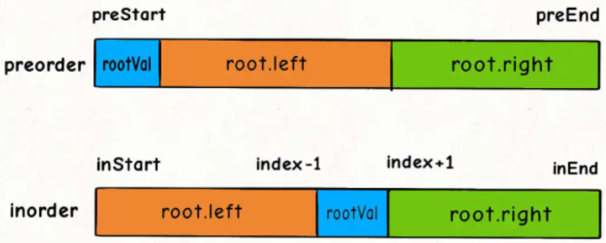

> 对于 preorder[] 呢？如何确定左右数组对应的起始索引和终止索引？可以通过左子树的节点数推导出来，因为中序数组的左子树的节点数必定等于前序数组左子树的节点数，假设左子树的节点数为 leftSize，那么 preorder[] 上的索引情况是这样的：


```java
Map<Integer, Integer> map = new HashMap<>();

public TreeNode buildTree(int[] preorder, int[] inorder) {
    int n = preorder.length;
    if (n == 0) return null;
    for (int i = 0; i < inorder.length; i++)
        map.put(inorder[i], i);
    return build(preorder, 0, n - 1, inorder, 0, n - 1);
}

public TreeNode build(int[] preorder, int preStart, int preEnd, int[] inorder, int inStart, int inEnd) {
    if (preStart > preEnd) return null;

    int rootValue = preorder[preStart];
    int rootIndex = map.get(rootValue);
    TreeNode root = new TreeNode(rootValue);

    int leftSize = rootIndex - inStart;
    root.left =  build(preorder, preStart + 1, preStart + leftSize, inorder, inStart, rootIndex - 1);
    root.right = build(preorder, preStart + leftSize + 1, preEnd,   inorder, rootIndex + 1, inEnd);
    return root;
}
```

### 6.3、中序 + 后序构造

> #106：https://leetcode-cn.com/problems/construct-binary-tree-from-inorder-and-postorder-traversal/
>
> - 时间复杂度：O(n)
> - 空间复杂度：O(n)


```java
Map<Integer, Integer> map = new HashMap<>();

public TreeNode buildTree(int[] inorder, int[] postorder) {
    int n = inorder.length;
    if (n == 0) return null;
    for (int i = 0; i < inorder.length; i++)
        map.put(inorder[i], i);
    return build(inorder, 0, n - 1, postorder, 0, n - 1);
}

public TreeNode build(int[] inorder, int inStart, int inEnd, int[] postorder, int postStart, int postEnd) {
    if (postStart > postEnd) return null;

    int rootValue = postorder[postEnd];
    int rootIndex = map.get(rootValue);
    TreeNode root = new TreeNode(rootValue);

    int leftSize = rootIndex - inStart;
    root.left =  build(inorder, inStart, rootIndex - 1, postorder, postStart, postStart + leftSize - 1);
    root.right = build(inorder, rootIndex + 1, inEnd,   postorder, postStart + leftSize, postEnd - 1);
    return root;
}
```

## 7、寻找重复的子树

> #652：https://leetcode-cn.com/problems/find-duplicate-subtrees/
>
> 算法思想：
>
> 1. 以 root 为根的二叉树 / 子树长啥样？
> 2. 以其他节点为根的子树都长啥样？
> 3. 根据以上两个问题，可将所有子树的序列化结果存到 map 中，遍历到当前节点时，将当前节点的子树序列化，判断是否在 map 中即可。
>
> - 时间复杂度：O(n<sup>2</sup>)
> - 空间复杂度：O(n)

```java
Map<String, Integer> map = new HashMap<>();
List<TreeNode> list = new ArrayList<>();

public List<TreeNode> findDuplicateSubtrees(TreeNode root) {
    if (root == null) return null;
    traverse(root);
    return list;
}

private String traverse(TreeNode root) {
    // 序列化以 root 为根的子树
    if (root == null) return null;
    StringBuilder sb = new StringBuilder();
    String left = traverse(root.left);
    String right = traverse(root.right);
    sb.append(left).append(",").append(right).append(",").append(root.val);
    String s = sb.toString();
    Integer cnt = map.getOrDefault(s, 0);
    if (cnt == 1) list.add(root);  // 第一次遇到相同的子树才加进 list，后面再遇到就不加了，去重！
    map.put(s, cnt + 1);
    return sb.toString();
}
```

## 8、二叉搜索树 (二叉排序树)

### 8.1、验证二叉搜索树 ⭐

> #98：https://leetcode-cn.com/problems/validate-binary-search-tree/  HOT100

```java
// 错误示例：
public boolean isValidBST(TreeNode root) {
    if (root == null) return true;
    if (root.left != null && root.left.val >= root.val) return false;
    if (root.right != null && root.right.val <= root.val) return false;
    return isValidBST(root.left) && isValidBST(root.right);
}
// 以上代码不能正确验证如下的树：5 < 6，不是 BST。所以在判断 6 时，不能只传入当前节点 4，还要带上"上界5"
   5
4     7
 6 
```

```java
/* 法1：中序遍历，判断是否升序
 * 时间复杂度：O(n)
 * 空间复杂度：平均 O(log n)，最坏 O(n)
 */
boolean flag = true;
long pre = Long.MIN_VALUE;

public boolean isValidBST(TreeNode root) {
    if (root == null) return true;
    inorder(root);
    return flag;
}

private void inorder(TreeNode root) {
    if (root == null) return;
    inorder(root.left);
    if (root.val <= pre) {
        flag = false;
        return;
    }
    pre = root.val;
    inorder(root.right);
}

/* 法2：递归（先序），带上下界
 * 时间复杂度：O(n)
 * 空间复杂度：平均 O(log n)，最坏 O(n)
 */
public boolean isValidBST(TreeNode root) {
    if (root == null) return true;
    return isValidBST(root, Long.MIN_VALUE, Long.MAX_VALUE);
}

private boolean isValidBST(TreeNode root, long min, long max){
    if (root == null) return true;
    if (root.val <= min || root.val >= max) return false;
    return isValidBST(root.left, min, root.val) && isValidBST(root.right, root.val, max);
}
```

### 8.2、插入节点
> #701：https://leetcode-cn.com/problems/insert-into-a-binary-search-tree/
```java
/* 法1：迭代
 * 时间复杂度：O(n)
 * 空间复杂度：O(1)
 */
public TreeNode insertIntoBST(TreeNode root, int val) {
    TreeNode node = new TreeNode(val);
    if (root == null) return node;
    TreeNode pre = null;
    TreeNode cur = root;
    while (cur != null) {
        pre = cur;
        if (cur.val < val) cur = cur.right;
        else cur = cur.left;
    }
    if (val < pre.val) pre.left = node;
    else pre.right = node;
    return root;
}

/* 法2：递归
 * 时间复杂度：O(n)
 * 空间复杂度：平均 O(log n)，最坏 O(n)
 */
public TreeNode insertIntoBST(TreeNode root, int val) {
    if (root == null) return new TreeNode(val);
    if (val < root.val)
        root.left = insertIntoBST(root.left, val);
    else
        root.right = insertIntoBST(root.right, val);
    return root;
}
```

### 8.3、删除节点

> #450：https://leetcode-cn.com/problems/delete-node-in-a-bst/
>
> 迭代法巨难写。。。
>
>  * 时间复杂度：O(log n)
>  * 空间复杂度：平均 O(log n)，最坏 O(n)

```java
public TreeNode deleteNode(TreeNode root, int key) {
    if (root == null) return null;
    if (key < root.val) {
        root.left = deleteNode(root.left, key);
    } else if (key > root.val) {
        root.right = deleteNode(root.right, key);
    } else {
        if (root.left == null) return root.right;	// 左子树为空，右子树不为空，右子树的根节点代替被删节点
        if (root.right == null) return root.left;	// 右子树为空，左子树不为空，左子树的根节点代替被删节点
        TreeNode candidateNode = getMinRight(root.right);  // 左右子树均非空，用右子树最左下的节点代替被删节点
        root.val = candidateNode.val;
        root.right = deleteNode(root.right, candidateNode.val);
    }
    return root;
}

private TreeNode getMinRight(TreeNode root) {
    while (root.left != null) root = root.left;
    return root;
}
```

### 8.4、转为累加树 ⭐

> #538：https://leetcode-cn.com/problems/convert-bst-to-greater-tree/  HOT100
>
> 算法思想：看给出的例子的图，从右到左看：8 变成了 8，7 变成了 8+7，6 变成了 8+7+6...

```java
int sum = 0;

public TreeNode convertBST(TreeNode root) {
    traverse(root);
    return root;
}

private void traverse(TreeNode root) {
    if (root == null) return;
    traverse(root.right);
    sum += root.val;
    root.val = sum;
    traverse(root.left);
}
```

### 8.5、不同的二叉搜索树 ⭐

> #96：https://leetcode-cn.com/problems/unique-binary-search-trees/  HOT100
>
> 算法思想：
> - 设 n 个节点存在二叉排序树的总个数为 g(n)，设以 j 为根的二叉搜索树的总个数为 f(j)，则 g(n) = f(1) + f(2) + f(3) + ... + f(n)；
> - 当 i 为根节点时，其左子树节点个数为 i-1 个，右子树节点为 n-i 个，则 f(i) = g(i-1) * g(n-i)；

```java
public int numTrees(int n) {
    return count(1, n);
}

// 计算 [left, right] 二叉搜索树的总个数
private int count(int left, int right) {
    if (left >= right) return 1;
    int sum = 0;
    for (int root = left; root <= right; root++) {
        int cnt1 = count(left, root - 1);
        int cnt2 = count(root + 1, right);
        sum += cnt1 * cnt2;
    }
    return sum;
}
```

> - 以上代码时间复杂度为 O(n<sup>2</sup>)，但存在大量重复计算，效率很低！用 DP 优化！
> ---
> - 时间复杂度：O(n<sup>2</sup>)
> - 空间复杂度：O(n)

```java
public int numTrees(int n) {
    int[] dp = new int[n + 1];            // dp[i] 表示：总的节点数为 i 时，不同的二叉搜索树的个数；
    dp[0] = 1;
    dp[1] = 1;
    dp[2] = 2;
    for (int i = 3; i <= n; i++) {        // 总的节点个数为 i
        for (int j = 1; j <= i; j++) {    // j 为根节点时，左子树有 j-1 个节点，右子树有 i-j 个节点
            dp[i] += dp[j - 1] * dp[i - j];
        }
    }
    return dp[n];
}
```

### 8.6、不同的二叉搜索树 II

> #95：https://leetcode-cn.com/problems/unique-binary-search-trees-ii/
>
> 算法思想：回溯
>
> - 时间复杂度：O(4<sup>n</sup> / √n)：卡特兰数
> - 空间复杂度：O(4<sup>n</sup> / √n)

```java
public List<TreeNode> generateTrees(int n) {
    if (n == 0) return new ArrayList<>();
    return build(1, n);
}

// 构造 [left, right] 组成的 BST
private List<TreeNode> build(int left, int right) {
    List<TreeNode> list = new ArrayList<>();
    if (left > right) {    // 说明无法产生子树，返回 null，表示子树为空
        list.add(null);
        return list;
    }
    if (left == right) {
        list.add(new TreeNode(left));
        return list;
    }
    // 1.穷举 root 节点的所有可能
    for (int i = left; i <= right; i++) {
        // 2.递归构造出左右子树的所有合法 BST
        List<TreeNode> leftTree = build(left, i - 1);
        List<TreeNode> rightTree = build(i + 1, right);
        // 3.给 root 节点穷举所有左右子树的组合
        for (TreeNode leftNode : leftTree) {
            for (TreeNode rightNode : rightTree) {
                TreeNode root = new TreeNode(i);
                root.left = leftNode;
                root.right = rightNode;
                list.add(root);
            }
        }
    }
    return list;
}
```

### 8.7、二叉搜索树的后序遍历序列 ⭐

> #剑指offer33：https://leetcode-cn.com/problems/er-cha-sou-suo-shu-de-hou-xu-bian-li-xu-lie-lcof/
>
> 算法思想：如 [1, 3, 2, 6, 5]，
>
> - 5 是根，从左到右找比 5 小的，即 1、3、2 都是左子树；
> - 继续从左到右找比 5 大的，即 6 是右子树；
> - 在找右子树的过程中，若出现比 5 小的节点，则一定不是二叉搜索树！
> - 递归判定左子树和右子树是不是二叉搜索树。
>
> ---
>
> - 时间复杂度：O(n<sup>2</sup>)
> - 空间复杂度：O(log n)，树退化成链表时，最差 O(n)

```java
public boolean verifyPostorder(int[] postorder) {
    return verify(postorder, 0, postorder.length - 1);
}

private boolean verify(int[] postorder, int start, int end) {
    if (start >= end) return true;
    int rootVal = postorder[end];
    int i = start;
    while (i < end && postorder[i] < rootVal) i++;    // 从左到右找左子树
    int j = i;
    while (i < end && postorder[i] > rootVal) i++;    // 从左到右找右子树
    return i == end && verify(postorder, start, j - 1) && verify(postorder, j, end - 1);
}
```

### 8.8、二叉搜索树与双向链表 ⭐

> #426：https://leetcode-cn.com/problems/er-cha-sou-suo-shu-yu-shuang-xiang-lian-biao-lcof/  剑指offer36、牛客TOP101
> - 时间复杂度：O(n)
> - 空间复杂度：O(log n)，树退化成链表时，最差 O(n)

```java
Node pre;
Node head;

public Node treeToDoublyList(Node root) {
    if (root == null) return null;
    inorder(root);
    head.left = pre;      // 此时 head 是双向链表的头节点，pre 是尾节点
    pre.right = head;
    return head;
}

private void inorder(Node cur) {
    if (cur == null) return;
    inorder(cur.left);
    if (pre == null) {    // pre == null 只有第一次才成立，所以此时 cur 就是树中最小节点！
        pre = cur;
        head = cur;
    } else {
        pre.right = cur;
        cur.left = pre;
        pre = cur;
    }
    inorder(cur.right);
}
```

## 9、LCA 问题 ⭐

### 9.1、二叉树的最近公共祖先

> #236：https://leetcode-cn.com/problems/lowest-common-ancestor-of-a-binary-tree/
>
> 剑指offer68 - Ⅱ、HOT100、牛客TOP101

**1、模拟**

> 案例：求 5 和 4 的最近公共祖先；
>
> 算法思想：
>
> - 求根节点分别到 5 的路径：3 -> 5；
> - 求根节点分别到 4 的路径：3 -> 5 -> 2 ->4；
> - 两条路径交点就是公共祖先！
>
> ---
>
> - 时间复杂度：O(n)
> - 空间复杂度：O(n)


```java
Deque<TreeNode> stack = new LinkedList<>();
Deque<TreeNode> path = new LinkedList<>();

private void preorder(TreeNode root, TreeNode target) {
    if (root == null) return;
    stack.push(root);
    if (root == target) {
        path = new LinkedList<>(stack);
        return;
    }
    preorder(root.left, target);
    preorder(root.right, target);
    stack.pop();
}

public TreeNode lowestCommonAncestor(TreeNode root, TreeNode p, TreeNode q) {
    if (root == null) return null;

    preorder(root, p);
    List<TreeNode> list1 = new ArrayList<>(path);
    stack.clear();
    path.clear();
    preorder(root, q);
    List<TreeNode> list2 = new ArrayList<>(path);

    if (list1.isEmpty() || list2.isEmpty()) return null;    // 没有公共祖先
    Collections.reverse(list1);
    Collections.reverse(list2);
    int i = 0;
    while (i < Math.min(list1.size(), list2.size()) && list1.get(i) == list2.get(i)) {
        i++;
    }
    return list1.get(i - 1);
}
```

**2、递归**

> 算法思想：
>
> ```
> 设当前节点为 root，则三种情况：
> 1. p、q 一个在左子树，一个在右子树，则当前节点 root 为最近公共祖先
> 2. p、q 都在左子树，递归去左子树找
> 3. p、q 都在右子树，递归去右子树找
> ```
>
> - 时间复杂度：O(n)
> - 空间复杂度：O(n)

```java
public TreeNode lowestCommonAncestor(TreeNode root, TreeNode p, TreeNode q) {
    if (root == null || root == p || root == q) return root;
    // 为什么用后序？因为要找【最近】公共祖先！
    TreeNode left = lowestCommonAncestor(root.left, p, q);	  // 在左子树中找 p、q
    TreeNode right = lowestCommonAncestor(root.right, p, q);  // 在右子树中找 p、q
    if (left == null) return right;		// p、q 都不在左子树，到右子树去找
    if (right == null) return left;		// p、q 都不在右子树，到左子树去找
    return root;			            // p、q 分别在左右子树，故 root 就是 LCA
}
```

### 9.2、二叉搜索树的最近公共祖先

> #235：https://leetcode-cn.com/problems/lowest-common-ancestor-of-a-binary-search-tree/  剑指offer 68-Ⅰ、牛客TOP101

```java
/* 法1：迭代
 * 时间复杂度：O(n)
 * 空间复杂度：O(1)
 */
public TreeNode lowestCommonAncestor(TreeNode root, TreeNode p, TreeNode q) {
    if (root == null) return null;
    while (true) {
        if (root.val > p.val && root.val > q.val) root = root.left;
        else if (root.val < p.val && root.val < q.val) root = root.right;
        else return root;    // 此时 root.val 位于 p.val、q.val 之间
    }
}

/* 法2：递归
 * 时间复杂度：O(n)
 * 空间复杂度：平均 O(log n)，最坏 O(n)
 */
public TreeNode lowestCommonAncestor(TreeNode root, TreeNode p, TreeNode q) {
    if (root == null) return null;
    if (root.val > p.val && root.val > q.val) return lowestCommonAncestor(root.left, p, q);
    if (root.val < p.val && root.val < q.val) return lowestCommonAncestor(root.right, p, q);
    return root;    // 此时 root.val 位于 p.val、q.val 之间
}
```

## 10、树的子结构 ⭐

> 剑指 Offer 26：https://leetcode-cn.com/problems/shu-de-zi-jie-gou-lcof/
>
> 第一次就做出来了

```java
public boolean isSubStructure(TreeNode A, TreeNode B) {
    if (A == null && B == null) return true;
    if (A == null || B == null) return false;
    return isSame(A, B) || isSubStructure(A.left, B) || isSubStructure(A.right, B);
}

private boolean isSame(TreeNode A, TreeNode B) {
    if (B == null) return true;    // 说明 B 遍历完了，是子树！
    if (A == null) return false;
    return A.val == B.val && isSame(A.left, B.left) && isSame(A.right, B.right);
}
```

## 11、对称的二叉树 ⭐

> 剑指 Offer 28：https://leetcode-cn.com/problems/dui-cheng-de-er-cha-shu-lcof/  牛客TOP101

```java
public boolean isSymmetric(TreeNode root) {
    if (root == null) return true;
    return isMirror(root.left, root.right);
}

private boolean isMirror(TreeNode A, TreeNode B) {
    if (A == null && B == null) return true;
    if (A == null || B == null) return false;
    return A.val == B.val && isMirror(A.left, B.right) && isMirror(A.right, B.left);
}
```

## 12、二叉树最大宽度

> #662：https://leetcode.cn/problems/maximum-width-of-binary-tree/
>
> 算法思想：给节点打编号，当前节点为 n，则左右孩子分别为 2n+1、2n+2；
>
> - 时间复杂度：O(n)
> - 空间复杂度：O(n)

```java
public int widthOfBinaryTree(TreeNode root) {
    int max = -1;
    if (root == null) return 0;
    Queue<TreeNode> nodeQueue = new LinkedList<>();
    Queue<Integer> noQueue = new LinkedList<>();
    nodeQueue.offer(root);
    noQueue.offer(0);
    while (!nodeQueue.isEmpty()) {
        int size = nodeQueue.size();
        int firstNo = 0;
        int lastNo = 0;
        for (int i = 0; i < size; i++) {
            TreeNode node = nodeQueue.poll();
            Integer no = noQueue.poll();
            if (i == 0) firstNo = no;
            if (i == size - 1) lastNo = no;
            if (node.left != null) {
                nodeQueue.offer(node.left);
                noQueue.offer(no * 2 + 1);
            }
            if (node.right != null) {
                nodeQueue.offer(node.right);
                noQueue.offer(no * 2 + 2);
            }
        }
        max = Math.max(max, lastNo - firstNo + 1);
    }
    return max;
}
```

## 13、完全二叉树的节点个数

> #222：https://leetcode-cn.com/problems/count-complete-tree-nodes/
>
> 算法思想：
>
> 1. 若 leftHeight == rightHeight，则左子树一定是满二叉树，因为节点已经填充到右子树了，左子树必定已经填满了。所以左子树的节点总数为 2<sup>leftHeight</sup> - 1，加上当前 root 节点，则正好是 2<sup>leftHeight</sup>。再对右子树进行递归统计。


> 2. 若 leftHeight != rightHeight，则说明此时最后一层不满，但倒数第二层已经满了，也就是说，此时的右子树是一棵满二叉树，可以直接得到右子树的节点个数 2<sup>rightHeight</sup> - 1。加上当前 root 节点，则正好是 2<sup>rightHeight</sup>。再对左子树进行递归统计。

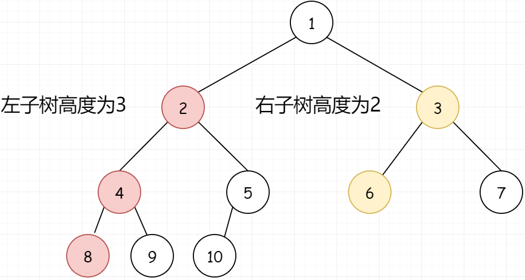

> - 时间复杂度：O(log<sup>2 </sup>n)
> - 空间复杂度：O(log n)

```java
public int countNodes(TreeNode root) {
    if(root == null) return 0;
    int leftHeight = getHeight(root.left);
    int rightHeight = getHeight(root.right);
    if (leftHeight == rightHeight)   // 左子树是满二叉树，节点总数 = 左子树节点数 + 根结点 + 递归右子树
        return (int) Math.pow(2, leftHeight) + countNodes(root.right);
    else                             // 右子树是满二叉树，节点总数 = 右子树节点数 + 根结点 + 递归左子树
        return (int) Math.pow(2, rightHeight) + countNodes(root.left);
}

// 完全二叉树，可以这样求高度！
private int getHeight(TreeNode root) {
    int height = 0;
    while (root != null) {
        root = root.left;
        height++;
    }
    return height;
}
```

## 14、完全二叉树

> #958：https://leetcode.cn/problems/check-completeness-of-a-binary-tree/  牛客TOP101
>
> 算法思想：层序遍历，遍历到当前节点时，若当前节点为空，且后面还有节点，说明不是完全二叉树！
>
> - 时间复杂度：O(n)
> - 空间复杂度：O(n)

```java
public boolean isCompleteTree(TreeNode root) {
    if (root == null) return true;
    boolean hasNullNode = false;
    Queue<TreeNode> queue = new LinkedList<>();
    queue.offer(root);
    while (!queue.isEmpty()) {
        int size = queue.size();
        for (int i = 0; i < size; i++) {
            TreeNode node = queue.poll();
            if (node == null) {    // 当前节点为空，继续遍历下一个节点，如果下一个节点不为空，则不是完全二叉树
                hasNullNode = true;
                continue;
            }
            // 走到这，说明当前节点 node != null，如果前面的节点为空，说明不是完全二叉树
            if (hasNullNode) return false;
            queue.offer(node.left);
            queue.offer(node.right);
        }
    }
    return true;
}
```

## 15、路径和

### 15.1、路径总和 II ⭐

> #113：https://leetcode-cn.com/problems/path-sum-ii/  剑指offer34、牛客TOP101
>
> - 时间复杂度：O(n<sup>2</sup>)，最坏情况下，二叉树上面是链表，下面是二叉树，这样上面的链表就需要重复遍历多次
> - 空间复杂度：O(n)

```java
List<List<Integer>> pathList = new ArrayList<>();
List<Integer> path = new ArrayList<>();
int curSum = 0;

public List<List<Integer>> pathSum(TreeNode root, int targetSum) {
    if (root == null) return pathList;
    backTrack(root, targetSum);
    return pathList;
}

private void backTrack(TreeNode root, int targetSum) {
    if (root == null) return;
    curSum += root.val;
    path.add(root.val);
    if (curSum == targetSum && root.left == null && root.right == null) {
        pathList.add(new ArrayList<>(path));
    }
    backTrack(root.left, targetSum);
    backTrack(root.right, targetSum);
    path.remove(path.size() - 1);
    curSum -= root.val;
}
```

### 15.2、路径总和 III ⭐

> #437：https://leetcode.cn/problems/path-sum-iii/  HOT100

**1、双重 dfs**

> 算法思想：
> 
> 1、外层 dfs：遍历树中每一个节点；
> 
> 2、内层 dfs：对于当前节点，向下搜索，看是否存在和为 targetSum 的路径；
> 
> - 时间复杂度：O(n<sup>2</sup>)
> - 空间复杂度：O(n<sup>2</sup>)

```java
int cnt = 0;

public int pathSum(TreeNode root, int targetSum) {
    if (root == null) return 0;
    preorder(root, targetSum);
    pathSum(root.left, targetSum);
    pathSum(root.right, targetSum);
    return cnt;
}

private void preorder(TreeNode root, int targetSum) {
    if (root == null) return;
    targetSum -= root.val;
    if (targetSum == 0) cnt++;
    preorder(root.left, targetSum);
    preorder(root.right, targetSum);
}
```

**2、前缀和 + 哈希表**

> 若要输出路径，只能用双重 dfs！
> 
> 算法思想：参考【#560 和为 K 的子数组】
> 
> - 时间复杂度：O(n)
> - 空间复杂度：O(n)

```java
int cnt = 0;
long curPrefixSum = 0;
Map<Long, Integer> map = new HashMap<>();

public int pathSum(TreeNode root, int targetSum) {
    if (root == null) return 0;
    preorder(root, targetSum);
    return cnt;
}

private void preorder(TreeNode root, int targetSum) {
    if (root == null) return;
    curPrefixSum += root.val;
    if (curPrefixSum == targetSum) cnt++;
    cnt += map.getOrDefault(curPrefixSum - targetSum, 0);
    map.put(curPrefixSum, map.getOrDefault(curPrefixSum, 0) + 1);
    preorder(root.left, targetSum);
    preorder(root.right, targetSum);
    map.put(curPrefixSum, map.get(curPrefixSum) - 1);
    curPrefixSum -= root.val;
}
```

### 15.3、二叉树中的最大路径和 ⭐

> #124：https://leetcode-cn.com/problems/binary-tree-maximum-path-sum/	HOT100
>
> 算法思想：
> - 当前子树 root 的路径和 = root.left 的路径和 + root.right 的路径和 + root.val；
> - 求最大路径和要注意：节点值可能为负！！！所以 root 的最大路径和在以下 4 部分中取最大值：
>
> 1. 左子树最大路径和 + 右子树最大路径和 + root.val；
> 2. 左子树最大路径和 + 0 + root.val；
> 3. 0 + 右子树最大路径和 + root.val；
> 4. 0 + 0 + root.val；
>
> 注意：其中 2、3、4 是当前子树可以向上提供的最大路径；但 1 不能向上提供，因为左右孩子都算上了，如下图：子树 2 的左右孩子都算上了，求 root = 1 的最大路径时，子树 2 的左右孩子没法都算上，不然路径就分叉了，只能用 (4, 2, 1, 3) 或 (7, 5, 2, 1, 3)，即：子树 2 撑死只能算一个孩子，不能都算！


> - 时间复杂度：O(n)
> - 空间复杂度：O(n)

```java
int maxSum = Integer.MIN_VALUE;

public int maxPathSum(TreeNode root) {
    dfs(root);
    return maxSum;
}

private int dfs(TreeNode root) {
    if (root == null) return 0;
    // 树节点的值可能为负
    int leftVal = Math.max(0, dfs(root.left));
    int rightVal = Math.max(0, dfs(root.right));
    maxSum = Math.max(maxSum, leftVal + root.val + rightVal);    // 全局最大路径
    // 当前子树能向上提供的最大路径，左右孩子只能取一个，若都取，则不能向上提供
    return Math.max(leftVal, rightVal) + root.val;
}
```

> 字节、蔚来：打印路径

```java
int maxSum = Integer.MIN_VALUE;
List<Integer> maxPath = new ArrayList<>();

public int maxPathSum(TreeNode root) {
    dfs(root);
    System.out.println(maxPath);
    return maxSum;
}

private Node dfs(TreeNode root) {
    if (root == null) return new Node(0, new ArrayList<>());
    Node left = dfs(root.left);
    Node right = dfs(root.right);
    if (left.curSum < 0) left = new Node(0, new ArrayList<>());
    if (right.curSum < 0) right = new Node(0, new ArrayList<>());

    if (maxSum < left.curSum + root.val + right.curSum) {
        maxSum = left.curSum + root.val + right.curSum;
        List<Integer> curPath = new ArrayList<>();
        curPath.addAll(left.curPath);          // 左
        curPath.add(root.val);                 // 根
        Collections.reverse(right.curPath);    // 右，因为是前序，所以右子树得 reverse
        curPath.addAll(right.curPath);
        Collections.reverse(right.curPath);    // 恢复过来
        maxPath = curPath;
    }

    int curSum = 0;
    List<Integer> curPath = new ArrayList<>();
    if (left.curSum > right.curSum) {
        curSum += left.curSum;
        curPath.addAll(left.curPath);
    } else {
        curSum += right.curSum;
        curPath.addAll(right.curPath);
    }
    curSum += root.val;
    curPath.add(root.val);
    return new Node(curSum, curPath);
}

class Node {
    int curSum;
    List<Integer> curPath;
    public Node(int curSum, List<Integer> curPath) {
        this.curSum = curSum;
        this.curPath = curPath;
    }
}
```

> #543：https://leetcode-cn.com/problems/diameter-of-binary-tree/  HOT100
> 
> 算法思想同上
> - 时间复杂度：O(n)
> - 空间复杂度：O(n)

```java
int maxNodes = 0;

public int diameterOfBinaryTree(TreeNode root) {
    getHeight(root);
    return maxNodes - 1;    // 路径数 = 节点数 - 1
}

private int getHeight(TreeNode root) {
    if (root == null) return 0;
    int leftHeight = getHeight(root.left);
    int rightHeight = getHeight(root.right);
    maxNodes = Math.max(maxNodes, leftHeight + rightHeight + 1);
    return Math.max(leftHeight, rightHeight) + 1;
}
```

## 16、实现 Trie (前缀树) ⭐

> #208：https://leetcode-cn.com/problems/implement-trie-prefix-tree/  HOT100

```java
class Trie {

    TreeNode dummyRoot;

    public Trie() {
        dummyRoot = new TreeNode('^', new TreeNode[26], false);
    }

    public void insert(String word) {
        TreeNode p = dummyRoot;
        char[] chars = word.toCharArray();
        for (char c : chars) {
            if (p.children[c - 'a'] == null) {
                p.children[c - 'a'] = new TreeNode(c, new TreeNode[26], false);
            }
            p = p.children[c - 'a'];
        }
        p.isEnd = true;
    }

    public boolean search(String word) {
        TreeNode p = dummyRoot;
        for (char c : word.toCharArray()) {
            TreeNode child = p.children[c - 'a'];
            if (child == null) return false;
            p = child;
        }
        return p.isEnd;
    }

    public boolean startsWith(String prefix) {
        TreeNode p = dummyRoot;
        for (char c : prefix.toCharArray()) {
            TreeNode child = p.children[c - 'a'];
            if (child == null) return false;
            p = child;
        }
        return true;
    }

}

class TreeNode {
    char val;
    TreeNode[] children;
    boolean isEnd;    // 当前 val 是否为单词最后一个字母

    TreeNode() { }

    TreeNode(char val, TreeNode[] children, boolean isEnd) {
        this.val = val;
        this.children = children;
        this.isEnd = isEnd;
    }
}
```

# 十、DFS & BFS
> BFS 的本质就是找起点到终点的最短路径，其代价是空间复杂度比 DFS 高；算法框架：
```java
// 计算从起点 start 到终点 target 的最近距离
int BFS(Node start, Node target) {
    Queue<Node> queue = new ArrayDeque<>();
    Set<Node> visited = new HashSet<>(); 	// 避免走回头路，二叉树不需要，因为子节点没有指向父节点，不会走回头路

    queue.offer(start); 					// 将起点加入队列
    visited.add(start);
    int step = 0; 							// 记录扩散的步数

    while (!queue.isEmpty()) {
        int size = queue.size();
        for (int i = 0; i < size; i++) {	// 将当前队列中的所有节点向四周扩散，不可 i < queue.size() !!!
            Node cur = queue.poll();
            if (cur is target)				// 划重点：这里判断是否到达终点
                return step;
            for (Node x : cur.adj()) {		// 将 cur 的相邻节点加入队列
                if (!visited.contains(x)) {
                    queue.offer(x);
                    visited.add(x);			// 划重点：一定在这里更新 visited，不能在其他地方
                }
            }
        }
        step++;								// 划重点：更新步数在这里
    }
}
```

## 1、二叉树的最小深度
> #111：https://leetcode-cn.com/problems/minimum-depth-of-binary-tree/
> - 时间复杂度：O(n)
> - 空间复杂度：O(n)
```java
// 迭代：层序
public int minDepth(TreeNode root) {
    if (root == null) return 0;
    Queue<TreeNode> queue = new ArrayDeque<>();
    queue.offer(root);
    int h = 1;
    while (!queue.isEmpty()) {
        int size = queue.size();
        for (int i = 0; i < size; i++) {
            TreeNode node = queue.poll();
            if (node.left == null && node.right == null)  return h;
            if (node.left != null) queue.offer(node.left);
            if (node.right != null) queue.offer(node.right);
        }
        h++;
    }
    return h;
}

// 递归
int minH = Integer.MAX_VALUE;

public int minDepth(TreeNode root) {
    if (root == null) return 0;
    dfs(root, 1);
    return minH;
}

private void dfs(TreeNode root, int h) {
    if (root == null) return;
    if (root.left == null && root.right == null) {
        minH = Math.min(minH, h);
        return;
    }
    dfs(root.left, h + 1);
    dfs(root.right, h + 1);
}
```

## 2、合并二叉树 ⭐

> #617：https://leetcode-cn.com/problems/merge-two-binary-trees/  HOT100、牛客TOP101

**2.1、DFS**
```java
public TreeNode mergeTrees(TreeNode root1, TreeNode root2) {
    if (root1 == null) return root2;
    if (root2 == null) return root1;
    root1.val += root2.val;		// 先序
    root1.left = mergeTrees(root1.left, root2.left);
    root1.right = mergeTrees(root1.right, root2.right);
    return root1;
}
```

**2.2、BFS**
```java
public TreeNode mergeTrees(TreeNode root1, TreeNode root2) {
    if (root1 == null) return root2;
    if (root2 == null) return root1;
    return bfs(root1, root2);
}

private TreeNode bfs(TreeNode root1, TreeNode root2) {
    Queue<TreeNode> queue1 = new ArrayDeque<>();
    Queue<TreeNode> queue2 = new ArrayDeque<>();
    queue1.offer(root1);
    queue2.offer(root2);
    while (!queue1.isEmpty()) {
        TreeNode node1 = queue1.poll();
        TreeNode node2 = queue2.poll();
        node1.val += node2.val;
        if (node1.left != null && node2.left != null) {
            queue1.offer(node1.left);
            queue2.offer(node2.left);
        } else if (node1.left == null && node2.left != null) {
            node1.left = node2.left;    
            // 不用 queue1.offer 了，因为 node1 本来就就没 left，把 node2.left 挂过来，node2.left 的下层节点就自动挂过来了
        }

        if (node1.right != null && node2.right != null) {
            queue1.offer(node1.right);
            queue2.offer(node2.right);
        } else if (node1.right == null && node2.right != null) {
            node1.right = node2.right;
        }
    }
    return root1;
}
```

## 3、二叉树的序列化与反序列化 ⭐

> #297：https://leetcode-cn.com/problems/serialize-and-deserialize-binary-tree/  剑指offer37、HOT100、牛客TOP101

**3.1、DFS**

>- 时间复杂度：O(n)
>- 空间复杂度：O(n)

```java
class Codec {

    StringBuilder sb = new StringBuilder();
    LinkedList<String> list = new LinkedList<>();

    // 输入数组是层序，这里序列化的结果是先序！
    public String serialize(TreeNode root) {
        sb.append("[");
        dfsSerialize(root);
        sb.deleteCharAt(sb.length() - 1).append("]");
        return sb.toString();
    }

    private void dfsSerialize(TreeNode root) {
        if (root == null) {
            sb.append("null,");
            return;
        }
        sb.append(root.val).append(",");
        dfsSerialize(root.left);
        dfsSerialize(root.right);
    }


    public TreeNode deserialize(String str) {
        String[] split = str.substring(1, str.length() - 1).split(",");
        list = new LinkedList<>(Arrays.asList(split));
        return dfsDeserialize();
    }

    private TreeNode dfsDeserialize() {
        if (list.isEmpty()) return null;
        String first = list.removeFirst();
        if (first.equals("null")) return null;
        TreeNode root = new TreeNode(Integer.parseInt(first));
        root.left = dfsDeserialize();
        root.right = dfsDeserialize();
        return root;
    }
}
```

**3.2、BFS**

> 即：层序遍历。需要注意的是：序列化时，需要把每一层空余的位置填满 null，保存成完全二叉树的样子；
> 
> 但如果输入的树只有单分支，即单链表，将其补齐为完全二叉树，则时空复杂度都由 O(n) → O(2<sup>n</sup>)。

## 4、岛屿的最大面积
> #695：https://leetcode-cn.com/problems/max-area-of-island/
> - 时间复杂度：O(row × col)
> - 空间复杂度：O(row × col)

**4.1、DFS**
```java
public int maxAreaOfIsland(int[][] grid) {
    int row = grid.length;
    int col = grid[0].length;
    int maxArea = 0;
    for (int i = 0; i < row; i++) {
        for (int j = 0; j < col; j++) {
            if (grid[i][j] == 1)
                maxArea = Math.max(maxArea, dfs(grid, i, j));
        }
    }
    return maxArea;
}

private int dfs(int[][] grid, int i, int j) {
    int row = grid.length;
    int col = grid[0].length;
    if (i < 0 || i >= row || j < 0 || j >= col || grid[i][j] != 1) return 0;
    grid[i][j] = 0;        // 已经访问过，置为 0，下次不再访问，或者单独开辟空间 boolean visited[row][col]
    int top    = dfs(grid, i - 1, j);
    int bottom = dfs(grid, i + 1, j);
    int left   = dfs(grid, i, j - 1);
    int right  = dfs(grid, i, j + 1);
    return top + bottom + left + right + 1;
}

@Test
public void test() {
    int[][] grid = {{0,0,1,0,0,0,0,1,0,0,0,0,0},
                    {0,0,0,0,0,0,0,1,1,1,0,0,0},
                    {0,1,1,0,1,0,0,0,0,0,0,0,0},
                    {0,1,0,0,1,1,0,0,1,0,1,0,0},
                    {0,1,0,0,1,1,0,0,1,1,1,0,0},
                    {0,0,0,0,0,0,0,0,0,0,1,0,0},
                    {0,0,0,0,0,0,0,1,1,1,0,0,0},
                    {0,0,0,0,0,0,0,1,1,0,0,0,0}};
    System.out.println(maxAreaOfIsland(grid));
}
```

**4.2、BFS**

```java
public int maxAreaOfIsland(int[][] grid) {
    int row = grid.length;
    int col = grid[0].length;
    int maxArea = 0;
    for (int i = 0; i < row; i++) {
        for (int j = 0; j < col; j++) {
            if (grid[i][j] == 1)
                maxArea = Math.max(maxArea, bfs(grid, i, j));
        }
    }
    return maxArea;
}

private int bfs(int[][] grid, int i, int j) {
    int row = grid.length;
    int col = grid[0].length;
    Queue<int[]> queue = new LinkedList<>();
    queue.offer(new int[]{i, j});
    int area = 0;
    while (!queue.isEmpty()) {
        int size = queue.size();
        for (int p = 0; p < size; p++) {
            int[] ints = queue.poll();
            int x = ints[0];
            int y = ints[1];
            if (x < 0 || x >= row || y < 0 || y >= col || grid[x][y] == 0) continue;
            grid[x][y] = 0;
            area++;
            queue.offer(new int[]{x - 1, y});  // 上
            queue.offer(new int[]{x + 1, y});  // 下
            queue.offer(new int[]{x, y - 1});  // 左
            queue.offer(new int[]{x, y + 1});  // 右
        }
    }
    return area;
}
```

## 5、最大人工岛
> #827：https://leetcode.cn/problems/making-a-large-island/  华为、微软
>
> 算法思想：
>
> 1、暴力法：遍历 grid[\][]，若 grid[i\][j] == 0，将其置为 1，然后 dfs 求当前岛屿的面积；时间复杂度 O(n<sup>4</sup>)；
>
> 2、优化：先遍历一遍 grid[\][]，将所有岛屿的面积求出来，存入 map <岛屿编号, 岛屿面积>，岛屿编号从 2 开始；
>
> 再遍历一遍 grid[\][]，当 grid[i\][j] == 0 时，将其上下左右的岛屿加起来得到 curArea，最大的 curArea 即为所求！
>
> - 时间复杂度：O(n<sup>2</sup>)
> - 空间复杂度：O(n<sup>2</sup>)

```java
int num = 2;
Map<Integer, Integer> map = new HashMap<>();    // <岛屿编号, 岛屿面积>

public int largestIsland(int[][] grid) {
    int row = grid.length;
    int col = grid[0].length;
    for (int i = 0; i < row; i++) {
        for (int j = 0; j < col; j++) {
            if (grid[i][j] == 1) {
                map.put(num, dfs(grid, i, j));
                num++;  // 不能合并到上一句！！
            }
        }
    }

    boolean all1 = true;    // 整个 grid[][] 都是 1
    int maxArea = 0;
    for (int i = 0; i < row; i++) {
        for (int j = 0; j < col; j++) {
            if (grid[i][j] == 0) {
                all1 = false;
                // 去重，不然如 grid[3][9] == 0，将其变为陆地后当前面积为 6 + 1 = 7，
                // 若不去重，则其左右下会重复加 3 次，变成 6 + 6 + 6 + 1 = 19
                Set<Integer> set = new HashSet<>();
                if (i - 1 >= 0)  set.add(grid[i - 1][j]);
                if (i + 1 < row) set.add(grid[i + 1][j]);
                if (j - 1 >= 0)  set.add(grid[i][j - 1]);
                if (j + 1 < col) set.add(grid[i][j + 1]);
                int area = 1;
                for (Integer num : set) {
                    area += map.getOrDefault(num, 0);
                }
                maxArea = Math.max(maxArea, area);
            }
        }
    }
    return all1 ? row * col : maxArea;
}

private int dfs(int[][] grid, int i, int j) {
    int row = grid.length;
    int col = grid[0].length;
    if (i < 0 || i >= row || j < 0 || j >= col || grid[i][j] != 1) return 0;
    grid[i][j] = num;    // 岛屿标号
    int top    = dfs(grid, i - 1, j);
    int bottom = dfs(grid, i + 1, j);
    int left   = dfs(grid, i, j - 1);
    int right  = dfs(grid, i, j + 1);
    return top + bottom + left + right + 1;
}

@Test
public void test() {
    int[][] grid = {{0, 0, 1, 0, 0, 0, 0, 1, 0, 0, 0, 0, 0},
                    {0, 0, 0, 0, 0, 0, 0, 1, 1, 1, 0, 0, 0},
                    {0, 1, 1, 0, 1, 0, 0, 0, 0, 0, 0, 0, 0},
                    {0, 1, 0, 0, 1, 1, 0, 0, 1,[0],1, 0, 0},
                    {0, 1, 0, 0, 1, 1, 0, 0, 1, 1, 1, 0, 0},
                    {0, 0, 0, 0, 0, 0, 0, 0, 0, 0, 1, 0, 0},
                    {0, 0, 0, 0, 0, 0, 0, 1, 1, 1, 0, 0, 0},
                    {0, 0, 0, 0, 0, 0, 0, 1, 1, 0, 0, 0, 0}};
    System.out.println(largestIsland(grid));
}
```

## 6、腐烂的橘子 ⭐
> #994：https://leetcode-cn.com/problems/rotting-oranges/
>
> 算法思想：多源 BFS
> - 时间复杂度：O(row × col)
> - 空间复杂度：O(row × col)

```java
public int orangesRotting(int[][] grid) {
    int row = grid.length;
    int col = grid[0].length;
    boolean[][] visited = new boolean[row][col];
    Queue<int[]> queue = new LinkedList<>();
    for (int i = 0; i < row; i++) {
        for (int j = 0; j < col; j++) {
            if (grid[i][j] == 2) {
                queue.offer(new int[]{i, j});
            }
        }
    }
    int time = 0;
    while (!queue.isEmpty()) {
        boolean flag = false;
        int size = queue.size();
        for (int i = 0; i < size; i++) {
            int[] ints = queue.poll();
            int x = ints[0];
            int y = ints[1];
            if (x < 0 || x >= row || y < 0 || y >= col || visited[x][y] || grid[x][y] == 0) continue;
            if (grid[x][y] == 1) {
                flag = true;
                grid[x][y] = 2;
            }
            // 这题必须用 visited[][]，因为 grid[][] 有三种状态 0、1、2，
            // 若只有两种状态 0、1，当前元素遍历完了就从 1 改为 0，就不需要 visited[][]
            visited[x][y] = true;
            queue.offer(new int[]{x - 1, y});
            queue.offer(new int[]{x + 1, y});
            queue.offer(new int[]{x, y - 1});
            queue.offer(new int[]{x, y + 1});
        }
        if (flag) time++;   // 有橘子烂了时间才 +1，因为第一次是从烂橘子出发，此时还没传染，不能 +1
    }
    for (int i = 0; i < row; i++) {    // 若有好橘子不可达，return -1
        for (int j = 0; j < col; j++) {
            if (grid[i][j] == 1)
                return -1;
        }
    }
    return time;
}
```

## 7、01 矩阵

>#542：https://leetcode-cn.com/problems/01-matrix/

1.算法思想：对于每一个 1，从 1 出发 BFS 找最近的 0。缺点：本题求多源最短路径，不是单源最短路径，这样做重复搜索太多，超时！
> - 时间复杂度：O((row × col)<sup>2</sup>)
> - 空间复杂度：O(row × col)

```java
public int[][] updateMatrix(int[][] mat) {
    int row = mat.length;
    int col = mat[0].length;
    int[][] dist = new int[row][col];
    for (int i = 0; i < row; i++) {
        for (int j = 0; j < col; j++) {
            if (mat[i][j] == 1)
                dist[i][j] = bfs(mat, i, j);
        }
    }
    return dist;
}

private int bfs(int[][] mat, int i, int j) {
    int row = mat.length;
    int col = mat[0].length;
    Queue<int[]> queue = new LinkedList<>();
    queue.offer(new int[]{i, j});
    int step = 1;
    while (!queue.isEmpty()) {
        int size = queue.size();
        for (int p = 0; p < size; p++) {
            int[] ints = queue.poll();
            int x = ints[0];
            int y = ints[1];
            // 只要遇到 0，就 return
            if (x - 1 >= 0 && mat[x - 1][y] == 0 || x + 1 < row && mat[x + 1][y] == 0 || 
                y - 1 >= 0 && mat[x][y - 1] == 0 || y + 1 < col && mat[x][y + 1] == 0)
                return step;
            if (x - 1 >= 0  && mat[x - 1][y] == 1) queue.offer(new int[]{x - 1, y});
            if (x + 1 < row && mat[x + 1][y] == 1) queue.offer(new int[]{x + 1, y});
            if (y - 1 >= 0  && mat[x][y - 1] == 1) queue.offer(new int[]{x, y - 1});
            if (y + 1 < col && mat[x][y + 1] == 1) queue.offer(new int[]{x, y + 1});
        }
        step++;
    }
    return step;
}

@Test
public void test() {
    int[][] mat = {{1,1,1},
                   {1,1,1},
                   {1,1,1},
                   {1,1,1},
                   {1,1,1},
                   {1,1,1},
                   {1,1,1},
                   {1,1,1},
                   {1,1,1},
                   {1,1,1},
                   {1,1,1},
                   {1,1,1},
                   {1,1,1},
                   {1,1,1},
                   {1,1,1},
                   {1,1,1},
                   {1,1,1},
                   {1,1,1},
                   {1,1,1},
                   {0,0,0}};
    int[][] dist = updateMatrix(mat);
    for (int[] ints : dist) {
        System.out.println(Arrays.toString(ints));
    }
}
```
2.算法思想：从 0 开始 BFS 找 1，初始化一个距离矩阵 dist[][]，值为 Integer.MAX_VALUE，dist[i][j] 表示当前点到 0 的最短距离；
如果 mat[i][j] == 0，则 dist[i][j] = 0。如果 mat[i][j] == 1，则 dist[i][j] = min(上,下,左,右) + 1。
> - 时间复杂度：O(row × col)
> - 空间复杂度：O(row × col)

```java
public int[][] updateMatrix(int[][] mat) {
    int row = mat.length;
    int col = mat[0].length;
    int[][] dist = new int[row][col];
    for (int[] arr : dist) Arrays.fill(arr, Integer.MAX_VALUE);  // dist[][]：初始化为 Integer.MAX_VALUE
    Queue<int[]> queue = new ArrayDeque<>();
    for (int i = 0; i < row; i++) {
        for (int j = 0; j < col; j++) {
            if (mat[i][j] == 0) {
                dist[i][j] = 0;
                queue.offer(new int[]{i, j});
            }
        }
    }
    while (!queue.isEmpty()) {
        int size = queue.size();
        for (int p = 0; p < size; p++) {
            int[] ints = queue.poll();
            int x = ints[0];
            int y = ints[1];
            if (x - 1 >= 0 && dist[x - 1][y] > dist[x][y] + 1) {
                dist[x - 1][y] = dist[x][y] + 1;
                queue.offer(new int[]{x - 1, y});
            }
            if (x + 1 < row && dist[x + 1][y] > dist[x][y] + 1) {
                dist[x + 1][y] = dist[x][y] + 1;
                queue.offer(new int[]{x + 1, y});
            }
            if (y - 1 >= 0 && dist[x][y - 1] > dist[x][y] + 1) {
                dist[x][y - 1] = dist[x][y] + 1;
                queue.offer(new int[]{x, y - 1});
            }
            if (y + 1 < col && dist[x][y + 1] > dist[x][y] + 1) {
                dist[x][y + 1] = dist[x][y] + 1;
                queue.offer(new int[]{x, y + 1});
            }
        }
    }
    return dist;
}
```

## 8、打开转盘锁

> #752：https://leetcode-cn.com/problems/open-the-lock/
> - 时间复杂度：O(n)
> - 空间复杂度：O(n)

```java
public int openLock(String[] deadends, String target) {
    Set<String> deadSet = new HashSet<>(Arrays.asList(deadends));
    if (deadSet.contains("0000")) return -1;
    Set<String> visitedSet = new HashSet<>();
    Queue<String> queue = new LinkedList<>();
    queue.offer("0000");
    visitedSet.add("0000");
    int step = 0;

    while (!queue.isEmpty()) {
        int size = queue.size();
        for (int i = 0; i < size; i++) {
            String cur = queue.poll();
            if (cur.equals(target)) return step;
            for (int j = 0; j < 4; j++) {
                String up = up(cur, j);
                if (!deadSet.contains(up) && !visitedSet.contains(up)) {
                    visitedSet.add(up);
                    queue.offer(up);
                }
                String down = down(cur, j);
                if (!deadSet.contains(down) && !visitedSet.contains(down)) {
                    visitedSet.add(down);
                    queue.offer(down);
                }
            }
        }
        step++;
    }
    return -1;
}

private String up(String code, int i) {     // 当前密码 code，第 i 位数字向上拨动
    char[] chars = code.toCharArray();
    if (chars[i] == '9')
        chars[i] = '0';
    else
        chars[i] += 1;
    return new String(chars);
}

private String down(String code, int i) {   // 当前密码 code，第 i 位数字向下拨动
    char[] chars = code.toCharArray();
    if (chars[i] == '0')
        chars[i] = '9';
    else
        chars[i] -= 1;
    return new String(chars);
}
```

## 9、课程表 (拓扑排序) ⭐

> #207：https://leetcode-cn.com/problems/course-schedule/  HOT100、微软、华为

**1、DFS**

> 算法思想：DFS 判断有向图是否有环。
> 
> <font color=red>**后序遍历的逆序就是拓扑排序**</font>
> 
> - 时间复杂度：O(n + m)，n 为课程数，m 为先修课程的要求数
> - 空间复杂度：O(n + m)

```java
public boolean canFinish(int numCourses, int[][] prerequisites) {
    List<List<Integer>> graph = buildGraph(numCourses, prerequisites);
    int[] visited = new int[numCourses];
    for (int i = 0; i < numCourses; i++) {
        if (!dfs(graph, visited, i)) return false;
    }
    return true;
}

/*
    visited[i] ==  0：未被访问
    visited[i] ==  1：已被当前节点启动的 dfs 访问
    visited[i] == -1：已被其他节点启动的 dfs 访问
    其实不要 -1 这个状态也可以，但会超时，因为重复计算太多！如邻接表：
    0: 1 2 
    1: 2 5 4
    2: 5 3
    3:
    4:
    5:
    以 0 作为 dfs 起点，则其邻接表的 1、2 是第二层 dfs 的起点
    第二层 dfs，以 1 为起点的遍历顺序：1 -> 2 -> 5，遍历成功，没有环，说明以 1、2、5 作为 dfs 的起点都能遍历成功！
    第二层 dfs，以 2 为起点的遍历顺序：2 -> 5，遍历成功，没有环，说明以 2、5 作为 dfs 的起点都能遍历成功！但是都是重复计算，因为上面已经计算了 2、5 都能成功！！！
    所以可用 visited[] = -1 进行剪枝！
 */
private boolean dfs(List<List<Integer>> graph, int[] visited, int i) {
    if (visited[i] == 1) return false; // 成环
    if (visited[i] == -1) return true; // 剪枝，其他节点启动的 dfs 已经遍历过该节点了，该路径没问题，不用再遍历了
    visited[i] = 1;
    for (Integer to : graph.get(i)) {
        if (!dfs(graph, visited, to)) return false;
    }
    visited[i] = -1;
    // list.add(i); 拓扑排序的【逆序】存入 list (因为是后序遍历)，拓扑排序不唯一
    return true;
}

// 构造邻接表
public List<List<Integer>> buildGraph(int numCourses, int[][] prerequisites) {
    List<List<Integer>> graph = new ArrayList<>();
    for (int i = 0; i < numCourses; i++) {
        graph.add(new ArrayList<>());
    }
    for (int[] edge : prerequisites) {
        int from = edge[1];
        int to = edge[0];
        graph.get(from).add(to);
    }
    return graph;
}
```

**2、BFS**
> 算法思想：BFS 求有向无环图 (DAG) 的拓扑排序。
> - 时间复杂度：O(n + m)，n 为课程数，m 为先修课程的要求数
> - 空间复杂度：O(n + m)

```java
public boolean canFinish(int numCourses, int[][] prerequisites) {
    List<List<Integer>> graph = buildGraph(numCourses, prerequisites);
    int[] inDegreeTable = buildInDegreeTable(numCourses, prerequisites);

    Queue<Integer> queue = new ArrayDeque<>();
    for (int i = 0; i < inDegreeTable.length; i++) {	// 入度为 0 的节点入队
        if (inDegreeTable[i] == 0)
            queue.offer(i);
    }

    while (!queue.isEmpty()) {
        int size = queue.size();
        for (int i = 0; i < size; i++) {
            Integer from = queue.poll();
            // list.add(from); 拓扑排序的【顺序】存入 list，拓扑排序不唯一
            for (Integer to : graph.get(from)) {
                if (--inDegreeTable[to] == 0)
                    queue.offer(to);
            }
        }
    }
    return Arrays.stream(inDegreeTable).allMatch(i -> i == 0);
}

// 构造入度表
public int[] buildInDegreeTable(int numCourses, int[][] prerequisites) {
    int[] inDegreeTable = new int[numCourses];
    for (int[] edge : prerequisites) {
        int from = edge[1];
        int to = edge[0];
        inDegreeTable[to]++;
    }
    return inDegreeTable;
}
```

## 10、矩阵中的最长递增路径
> #329：https://leetcode.cn/problems/longest-increasing-path-in-a-matrix/  牛客TOP101、剑指 Offer II 112
> - 时间复杂度：O(row * col)
> - 空间复杂度：O(row * col)

```java
int[][] dp;  // dp[i][j] 表示从 matrix[i][j] 出发的最长递增路径长度

public int longestIncreasingPath(int[][] matrix) {
    int row = matrix.length;
    int col = matrix[0].length;
    dp = new int[row][col];
    int max = 0;
    for (int i = 0; i < row; i++) {
        for (int j = 0; j < col; j++) {
            max = Math.max(max, dfs(matrix, i, j));
        }
    }
    return max;
}

private int dfs(int[][] matrix, int i, int j) {
    if (dp[i][j] != 0) return dp[i][j];
    int row = matrix.length;
    int col = matrix[0].length;

    int max = 0;
    if (i - 1 >= 0  && matrix[i - 1][j] > matrix[i][j]) max = Math.max(max, dfs(matrix, i - 1, j));
    if (i + 1 < row && matrix[i + 1][j] > matrix[i][j]) max = Math.max(max, dfs(matrix, i + 1, j));
    if (j - 1 >= 0  && matrix[i][j - 1] > matrix[i][j]) max = Math.max(max, dfs(matrix, i, j - 1));
    if (j + 1 < col && matrix[i][j + 1] > matrix[i][j]) max = Math.max(max, dfs(matrix, i, j + 1));
    dp[i][j] = max + 1;
    return dp[i][j];
}
```

# 十一、回溯算法

> 回溯法使用 DFS 策略，解决最优化问题。一个最优化问题的解，往往可以用一个 "解空间树" 来表示，故回溯法是对隐式图的 DFS。
> 
> 回溯可用于所有用穷举法解决的问题，许多复杂的、规模较大的问题都可以使用回溯法，有 "通用解题方法" 的美称。
> 
> 算法模板：

```java
pathList = [[], [], ...];    // 解集合
path = [];                   // 一个解
int step = 0;                // 回溯前进的步数
void backtrack (输入数据, pathList, path, step){
    if (满足结束条件) {
        pathList.add(path);
        return;
    }
    for (选择列表) {          // 若 path.length() == 输入数据.length()，则 for 从 0 遍历
        做选择;               // 若 path.length() <= 输入数据.length()，则 for 从 step 遍历
        backtrack(输入数据, pathList, path, step);
        撤销选择;
    }
}
```

> 若不想找出所有解，找到一个解就结束（如：解数独）：

```java
pathList = [[], [], ...];	   // 解集合
path = [];					   // 一个解
int step = 0;				   // 回溯前进的步数
boolean backtrack(输入数据, pathList, path, step) {
    if (满足结束条件) {
        pathList.add(path);
        return true;
    }
    for (选择列表) {			   // 本质就是 DFS 遍历多叉树
        做选择;
        if (backtrack(输入数据, pathList, path, step)) return true;    // 重要！！！
        撤销选择;
    }
    return false;
}
```

## 1、排列问题 ⭐

### 1.1、全排列
> #46：https://leetcode-cn.com/problems/permutations/  HOT100
> - 时间复杂度：O(n × n!)，搜索树共有 n! 个叶节点，即 backTrack() 调用了 n! 次，每找到一个答案，要用 O(n) 的时间来复制；
> - 空间复杂度：O(n)，搜索树的深度为 n；

```java
List<List<Integer>> pathList = new ArrayList<>();
List<Integer> path = new ArrayList<>();
boolean[] visited;

public List<List<Integer>> permute(int[] nums) {
    visited = new boolean[nums.length];
    backTrack(nums);
    return pathList;
}

private void backTrack(int[] nums) {
    if (path.size() == nums.length) {
        pathList.add(new ArrayList<>(path));
        return;
    }
    for (int i = 0; i < nums.length; i++) {
        if (visited[i]) continue;
        visited[i] = true;
        path.add(nums[i]);
        backTrack(nums);
        path.remove(path.size() - 1);
        visited[i] = false;
    }
}
```

空间优化：
> 在上面的代码中，path 中的元素是逐渐填入的，当前用过的数，就都在 path 的前面填充着。所以可以在开始时，将 nums 复制到 path 中。然后在 path 中每填充一个数据，就把所填数和前面的元素交换。这样，我们得到的依然是原始 nums 那些元素。不过现在是一个被 “分割” 的数组，前面部分是已经填充过的；而从当前要考虑的 i 位置开始，后面是没有填充过的。而对于回溯操作，也非常简单：只要把之前交换的两数，再换回来就可以了。

```java
List<List<Integer>> pathList = new ArrayList<>();
List<Integer> path;

public List<List<Integer>> permute(int[] nums) {
    path = Arrays.stream(nums).boxed().collect(Collectors.toList());
    backTrack(0);
    return pathList;
}

private void backTrack(int curIndex) {
    if (curIndex >= path.size()) {
        pathList.add(new ArrayList<>(path));
        return;
    }
    for (int i = curIndex; i < path.size(); i++) {
        Collections.swap(path, curIndex, i);
        backTrack(curIndex + 1);
        Collections.swap(path, curIndex, i);
    }
}
```

### 1.2、全排列 II
> #47：https://leetcode-cn.com/problems/permutations-ii/  剑指offer38
> - 时间复杂度：O(n × n!)
> - 空间复杂度：O(n)

```java
// 法1：set 去重，效率低
public List<List<Integer>> permuteUnique(int[] nums) {
    Set<List<Integer>> set = new HashSet<>(permute(nums));
    return new ArrayList<>(set);
}
```

```java
// 法2：先排序，使相同的元素必相邻，在选择元素的时候剪枝，效率高一点
List<List<Integer>> pathList = new ArrayList<>();
List<Integer> path = new ArrayList<>();
boolean[] visited;

public List<List<Integer>> permuteUnique(int[] nums) {
    visited = new boolean[nums.length];
    Arrays.sort(nums);
    backTrack(nums);
    return pathList;
}

private void backTrack(int[] nums) {
    if (path.size() == nums.length) {
        pathList.add(new ArrayList<>(path));
        return;
    }
    for (int i = 0; i < nums.length; i++) {
        if (visited[i]) continue;
        /*
            !visited[i-1]：
            假设有两个 1，则顺序可能为 1a1b 或 1b1a，因为要去重，所以只能保留一种顺序，假设只保留 1a1b：
            只有当 visit 1a 之后我们才能去 visit 1b，也就是说 1a 还没 visit，则 1b 也不能 visit
        */
        if (i > 0 && nums[i] == nums[i - 1] && !visited[i - 1]) continue;
        visited[i] = true;
        path.add(nums[i]);
        backTrack(nums);
        path.remove(path.size() - 1);
        visited[i] = false;
    }
    /*
        注意：回溯算法题的结果集如何去重？ 
        题型1：输入数组 nums[] 中无重复元素，则使用：visited[] 即可去重，如全排列！
        题型2：输入数组 nums[] 中有重复元素，则使用：sort() + visited[] + !visited[i - 1] 剪枝去重，如本题！
    */
}
```

### 1.3、字母大小写全排列
> #784：https://leetcode-cn.com/problems/letter-case-permutation/
> - 时间复杂度：O(n × 2<sup>n</sup>)：最坏情况每个字符都是字母，而每个字母有大小写两种状态，一共是 2<sup>n</sup> 种；
> - 空间复杂度：O(n)

```java
List<String> list = new ArrayList<>();
StringBuilder sb = new StringBuilder();

public List<String> letterCasePermutation(String s) {
    backTrack(s, 0);
    return list;
}

private void backTrack(String s, int curIdx) {
    if (curIdx >= s.length()) {
        list.add(sb.toString());
        return;
    }
    char c = s.charAt(curIdx);
    if (Character.isDigit(c)) {
        sb.append(c);
        backTrack(s, curIdx + 1);
        sb.deleteCharAt(sb.length() - 1);    // 不能丢
    } else if (Character.isLetter(c)) {
        sb.append(Character.toLowerCase(c));
        backTrack(s, curIdx + 1);
        sb.deleteCharAt(sb.length() - 1);

        sb.append(Character.toUpperCase(c));
        backTrack(s, curIdx + 1);
        sb.deleteCharAt(sb.length() - 1);
    }
}
```

## 2、子集问题

### 2.1、子集 ⭐
> #78：https://leetcode-cn.com/problems/subsets/  HOT100
> - 时间复杂度：O(n × 2<sup>n</sup>)，子集的最大个数为 2<sup>n</sup>，复制正确答案需要 O(n)；
> - 空间复杂度：O(n)，搜索树的深度为 n；

```java
List<List<Integer>> pathList = new ArrayList<>();
List<Integer> path = new ArrayList<>();

public List<List<Integer>> subsets(int[] nums) {
    backTrack(nums, 0);
    return pathList;
}

private void backTrack(int[] nums, int curIdx) {
    pathList.add(new ArrayList<>(path));
    if (curIdx >= nums.length) return;
    // 子集问题：不是从 0 开始遍历，因为 [0, curIdx) 已经选过了，要从 [curIdx, end] 中选
    for (int i = curIdx; i < nums.length; i++) {	
        path.add(nums[i]);        // 当前元素
        backTrack(nums, i + 1);   // 下一个元素
        path.remove(path.size() - 1);
    }
}
```

### 2.2、子集 II ⭐
> #90：https://leetcode-cn.com/problems/subsets-ii/
> - 时间复杂度：O(n × 2<sup>n</sup>)，子集的最大个数为 2<sup>n</sup>，复制正确答案需要 O(n)；
> - 空间复杂度：O(n)，搜索树的深度为 n；

```java
// 法1：set 去重，效率低
Set<List<Integer>> resList = new HashSet<>();
List<Integer> res = new ArrayList<>();

public List<List<Integer>> subsetsWithDup(int[] nums) {
    Arrays.sort(nums);
    Set<List<Integer>> set = subsets(nums);
    return new ArrayList<>(set);
}

public Set<List<Integer>> subsets(int[] nums) {
    backTrack(nums, 0);
    return resList;
}
```

```java
// 法2：先排序，使相同的元素必相邻，在选择元素的时候剪枝，效率高一点
List<List<Integer>> pathList = new ArrayList<>();
List<Integer> path = new ArrayList<>();
boolean[] visited;

public List<List<Integer>> subsetsWithDup(int[] nums) {
    Arrays.sort(nums);
    visited = new boolean[nums.length];
    backTrack(nums, 0);
    return pathList;
}

private void backTrack(int[] nums, int curIdx) {
    pathList.add(new ArrayList<>(path));
    if (curIdx >= nums.length) return;

    for (int i = curIdx; i < nums.length; i++) {
        if (visited[i]) continue;
        if (i > 0 && nums[i] == nums[i - 1] && !visited[i - 1]) continue;
        visited[i] = true;
        path.add(nums[i]);
        backTrack(nums, i + 1);
        path.remove(path.size() - 1);
        visited[i] = false;
    }
}
```

### 2.3、递增子序列

> #491：https://leetcode.cn/problems/non-decreasing-subsequences/
> - 时间复杂度：O(n × 2<sup>n</sup>)，最坏情况，所有元素都不相同，子集的最大个数为 2<sup>n</sup>，复制正确答案需要 O(n)；
> - 空间复杂度：O(n)，搜索树的深度为 n；
>
> 去重是个坑，一般我们子集去重直接 i > 0 && nums[i] == nums[i - 1] && !visited[i - 1] 就行了，
>
> 那么 [1,2,3,1,1,1,1] 这个用例就过不了，因为我们提前排序了，而这里不是有序的，所以得在每层循环中加 set 来去重；

```java
List<List<Integer>> pathList = new ArrayList<>();
List<Integer> path = new ArrayList<>();

public List<List<Integer>> findSubsequences(int[] nums) {
    backTrack(nums, 0);
    return pathList;
}

private void backTrack(int[] nums, int curIdx) {
    if (path.size() >= 2) pathList.add(new ArrayList<>(path));
    if (curIdx >= nums.length) return;

    // set 只记录树的一层节点！对同层节点去重！
    Set<Integer> set = new HashSet<>();
    for (int i = curIdx; i < nums.length; i++) {
        if (set.contains(nums[i])) continue;
        if (!path.isEmpty() && nums[i] < path.get(path.size() - 1)) continue;
        set.add(nums[i]);
        path.add(nums[i]);
        backTrack(nums, i + 1);
        path.remove(path.size() - 1);
        // set.remove(nums[i]);    // 不能加
    }
}
```

### 2.4、划分为 k 个相等的子集
> #698：https://leetcode-cn.com/problems/partition-to-k-equal-sum-subsets/
> 
> 题解：https://leetcode.cn/problems/partition-to-k-equal-sum-subsets/solutions/1441006/by-lfool-d9o7/
> - 时间复杂度：O(k<sup>n</sup>)，每个数有 k 种选择；
> - 空间复杂度：O(n)，搜索树的深度为 n；

```java
public boolean canPartitionKSubsets(int[] nums, int k) {
    if (k > nums.length) return false;
    int sum = Arrays.stream(nums).sum();
    if (sum % k != 0) return false;
    int target = sum / k;
    int[] bucket = new int[k];
    // 超时优化一：对 nums 逆序排序，桶优先放大的数字，放不下就跳过，所以加速
    Arrays.sort(nums);
    for (int i = 0, j = nums.length - 1; i < j; i++, j--) {
        int temp = nums[i];
        nums[i] = nums[j];
        nums[j] = temp;
    }
    return backTrack(nums, bucket, target, 0);
}

private boolean backTrack(int[] nums, int[] bucket, int target, int curIdx) {
    if (curIdx >= nums.length) {
        for (int num : bucket) {    // 若有一个桶装的数 != target，则这次划分失败
            if (num != target) return false;
        }
        return true;
    }
    // 以数字为视角，看当前数能塞进哪个桶
    for (int i = 0; i < bucket.length; i++) {
        // 超时优化二
        if (i > 0 && bucket[i] == bucket[i - 1]) continue;
        if (nums[curIdx] + bucket[i] > target) continue;
        bucket[i] += nums[curIdx];
        if (backTrack(nums, bucket, target, curIdx + 1)) return true;
        bucket[i] -= nums[curIdx];
    }
    return false;
}
```

## 3、组合问题

### 3.1、组合
> #77：https://leetcode-cn.com/problems/combinations/
> - 时间复杂度：O(k × C<sub>n</sub><sup>k</sup>)，搜索树有 C<sub>n</sub><sup>k</sup> 个叶节点，需要递归 C<sub>n</sub><sup>k</sup> 次，复制正确答案需要 O(n)；
> - 空间复杂度：O(n)，搜索树的深度为 n；

```java
List<List<Integer>> pathList = new ArrayList<>();
List<Integer> path = new ArrayList<>();

public List<List<Integer>> combine(int n, int k) {
    backTrack(n, k, 1);
    return pathList;
}

private void backTrack(int n, int k, int cur) {
    if (path.size() >= k) {
        pathList.add(new ArrayList<>(path));
        return;
    }
    // 类似于子集问题：不是从 0 开始遍历；因为要从 [1, n] 中选 k 个，[0, cur) 已经选过了，要从 [cur, end] 中选
    for (int i = cur; i <= n; i++) {
        // 剪枝：path.size() 加上区间 [cur, n] 的长度小于 k，不可能构造出长度为 k 的结果；也可以不加，但效率低
        if (path.size() + (n - i + 1) < k) return;
        path.add(i);		       // 当前元素
        backTrack(n, k, i + 1);    // 下一个元素
        path.remove(path.size() - 1);
    }
}
```

### 3.2、组合总和 ⭐
> #39：https://leetcode-cn.com/problems/combination-sum/  HOT100
> - 时间复杂度：O(S)，其中 S 为所有可行解的长度之和
> - 空间复杂度：O(target)，最坏的情况：candidates[] 包含 1，1 这个元素被选了 target 次；

```java
List<List<Integer>> pathList = new ArrayList<>();
List<Integer> path = new ArrayList<>();

public List<List<Integer>> combinationSum(int[] candidates, int target) {
    backTrack(candidates, target, 0);
    return pathList;
}

private void backTrack(int[] candidates, int target, int curIdx) {
    if (target == 0) {
        pathList.add(new ArrayList<>(path));
        return;
    }
    if (curIdx >= candidates.length) return;
    // 不选当前元素，进入下一轮递归
    backTrack(candidates, target, curIdx + 1);
    // 选当前元素 (可以选多次)
    if (target - candidates[curIdx] >= 0) {
        path.add(candidates[curIdx]);
        backTrack(candidates, target - candidates[curIdx], curIdx);
        path.remove(path.size() - 1);
    }
}
```

### 3.3、组合总和 II
> #40：https://leetcode-cn.com/problems/combination-sum-ii/
> - 时间复杂度：O(n × 2<sup>n</sup>)，最坏情况：n 个元素都不同，每个元素选或不选，共有 2<sup>n</sup> 种，复制正确答案需要 O(n)；
> - 空间复杂度：O(n)，搜索树的深度为 n；

```java
List<List<Integer>> pathList = new ArrayList<>();
List<Integer> path = new ArrayList<>();
boolean[] visited;

public List<List<Integer>> combinationSum2(int[] candidates, int target) {
    Arrays.sort(candidates);
    visited = new boolean[candidates.length];
    backTrack(candidates, target, 0);
    return pathList;
}

private void backTrack(int[] candidates, int target, int curIdx) {
    if (target == 0) {
        pathList.add(new ArrayList<>(path));
        return;
    }
    if (curIdx >= candidates.length) return;
    // 不选当前元素，进入下一轮递归
    backTrack(candidates, target, curIdx + 1);
    // 选当前元素 (只能选 1 次)
    if (curIdx > 0 && candidates[curIdx] == candidates[curIdx - 1] && !visited[curIdx - 1]) return;
    if (target - candidates[curIdx] >= 0) {
        visited[curIdx] = true;
        path.add(candidates[curIdx]);
        backTrack(candidates, target - candidates[curIdx], curIdx + 1);  // curIdx + 1 保证 curIdx 只被选 1 次
        path.remove(path.size() - 1);
        visited[curIdx] = false;
    }
}
```

### 3.4、组合总和 III
> #216：https://leetcode-cn.com/problems/combination-sum-iii/
> - 时间复杂度：O(n × C<sub>n</sub><sup>k</sup>)，其中 n = 9，搜索树有 C<sub>n</sub><sup>k</sup> 个叶节点，需要递归 C<sub>n</sub><sup>k</sup> 次，复制正确答案需要 O(n)；
> - 空间复杂度：O(n)，搜索树的深度为 n；

```java
List<List<Integer>> pathList = new ArrayList<>();
List<Integer> path = new ArrayList<>();

public List<List<Integer>> combinationSum3(int k, int n) {
    backTrack(k, n, 1);
    return pathList;
}

private void backTrack(int k, int n, int cur) {
    if (k == 0 && n == 0) {
        pathList.add(new ArrayList<>(path));
        return;
    }
    if (cur > 9) return;
    
    // 不选当前元素，进入下一轮递归
    backTrack(k, n, cur + 1);
    
    // 选当前元素 (只能选 1 次)
    path.add(cur);
    backTrack(k - 1, n - cur, cur + 1);  // cur + 1 可以保证当前元素只选 1 次
    path.remove(path.size() - 1);
}
```

### 3.5、电话号码的字母组合 ⭐
> #17：https://leetcode-cn.com/problems/letter-combinations-of-a-phone-number/  HOT100
> - 时间复杂度：O(3<sup>m</sup> × 4<sup>n</sup>)，m 为 digits 中包含三个字母的数字的个数，n 为 digits 中包含四个字母的数字的个数，即 9 的个数。
> - 空间复杂度：O(m + n)，递归深度为 digits 的长度 m + n

```java
List<String> list = new ArrayList<>();
StringBuilder sb = new StringBuilder();
Map<Character, String> map = new HashMap<Character, String>() {
    {
        put('2', "abc");
        put('3', "def");
        put('4', "ghi");
        put('5', "jkl");
        put('6', "mno");
        put('7', "pqrs");
        put('8', "tuv");
        put('9', "wxyz");
    }
};

public List<String> letterCombinations(String digits) {
    if ("".equals(digits)) return list;
    backtrack(digits, 0);
    return list;
}

private void backtrack(String digits, int curIdx) {
    if (curIdx >= digits.length()) {
        list.add(sb.toString());
        return;
    }
    char digit = digits.charAt(curIdx);
    char[] letters = map.get(digit).toCharArray();
    for (char letter : letters) {
        sb.append(letter);
        backtrack(digits, curIdx + 1);
        sb.deleteCharAt(sb.length() - 1);
    }
}
```

### 3.6、括号生成 ⭐
> #22：https://leetcode-cn.com/problems/generate-parentheses/  HOT100
> - 时间复杂度：O(4<sup>n</sup> / √n)：n * 第 n 个卡特兰数，不考；第 n 个卡特兰数为 C<sub>2n</sub><sup>n</sup>/(n+1) = 4<sup>n</sup> / n√n，复制正确答案需要 O(n)，n * (4<sup>n</sup> / n√n) = 4<sup>n</sup> / √n
> - 空间复杂度：O(n)，搜索树的深度为 2n；

```java
List<String> list = new ArrayList<>();
StringBuilder sb = new StringBuilder();

public List<String> generateParenthesis(int n) {
    backTrack(n, 0, 0);
    return list;
}

private void backTrack(int n, int open, int close) {
    if (open == n && close == n) {
        list.add(sb.toString());
        return;
    }
    if (open > n || close > n) return;

    sb.append("(");
    backTrack(n, open + 1, close);
    sb.deleteCharAt(sb.length() - 1);

    if (close < open) {    // 剪枝优化
        sb.append(")");
        backTrack(n, open, close + 1);
        sb.deleteCharAt(sb.length() - 1);
    }
}
```

## 4、棋盘问题

### 4.1、N 皇后 ⭐

> #52：https://leetcode-cn.com/problems/n-queens-ii/
>
> #51：https://leetcode-cn.com/problems/n-queens/
>
> 下面以 八皇后 为例：
>
> 设问题的解空间为：x[] = (x0, x1, x2, x3, x4, x5, x6, x7)，下标 0~7 分别表示第 i 行，每个元素 x[i] 分别表示皇后所处的列。
>
> 约束条件为：八个皇后位置 (0, x0)，(1, x1)，……，(7, x7) 不在同一行、同一列和同一对角线上。

**4.1.1、暴力法**
>- 时间复杂度：O(n<sup>n</sup>)
>- 空间复杂度：O(n)

```java
public int totalNQueens() {
    int cnt = 0;
    for (int i0 = 0; i0 < 8; i0++) {
        for (int i1 = 0; i1 < 8; i1++) {
            for (int i2 = 0; i2 < 8; i2++) {
                for (int i3 = 0; i3 < 8; i3++) {
                    for (int i4 = 0; i4 < 8; i4++) {
                        for (int i5 = 0; i5 < 8; i5++) {
                            for (int i6 = 0; i6 < 8; i6++) {
                                for (int i7 = 0; i7 < 8; i7++) {
                                    int[] arr = {i0, i1, i2, i3, i4, i5, i6, i7};
                                    if (valid(arr)) {
                                        printQueue(arr);
                                        cnt++;
                                    }
                                }
                            }
                        }
                    }
                }
            }
        }
    }
    return cnt;
}

private boolean valid(int[] arr) {
    for (int i = 0; i < arr.length; i++) {
        for (int j = i + 1; j < arr.length; j++) {
            // 任意两个皇后不在同一列、同一对角线上
            if (arr[i] == arr[j] || Math.abs(arr[i] - arr[j]) == Math.abs(i - j)) return false;
        }
    }
    return true;
}

private void printQueue(int[] arr) {
    System.out.println(Arrays.toString(arr));
    int n = arr.length;
    for (int i = 0; i < n; i++) {
        String[] msg = new String[n];
        Arrays.fill(msg, "口");
        msg[arr[i]] = "王";
        for (int j = 0; j < n; j++) {
            System.out.print(msg[j] + " ");
        }
        System.out.println();
    }
    System.out.println("-------------------");
}
```

**4.1.2、回溯**
>- 时间复杂度：O(n!)
>- 空间复杂度：O(n)

```java
int cnt = 0;

public int totalNQueens(int n) {
    int[] arr = new int[n];
    backTrack(arr, 0);
    return cnt;
}

private void backTrack(int[] arr, int curIdx) {
    if (curIdx >= arr.length) {
        if (valid(arr))
            cnt++;
        return;
    }
    for (int i = 0; i < arr.length; i++) {
        arr[curIdx] = i;	// curIdx 是行，i 是列上的值
        backTrack(arr, curIdx + 1);
        arr[curIdx] = 0;
    }
}
```

> 判断皇后冲突的方法 valid() 时间复杂度为 O(n<sup>2</sup>)，可被优化，如下图：
> - 如果两个皇后满足 i1 - i2 = j1 - j2，则两个皇后都在主对角线；
> - 如果两个皇后满足 i1 +j1 = i2 + j2，则两个皇后都在辅对角线；

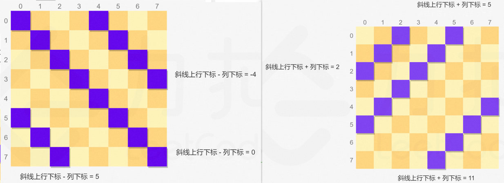

```java
int cnt = 0;
Set<Integer> cols = new HashSet<>();
Set<Integer> diags1 = new HashSet<>();
Set<Integer> diags2 = new HashSet<>();

public int totalNQueens(int n) {
    int[] arr = new int[n];
    backTrack(arr, 0);
    return cnt;
}

private void backTrack(int[] arr, int row) {
    if (row >= arr.length) {
        cnt++;
        return;
    }
    for (int col = 0; col < arr.length; col++) {
        if (cols.contains(col) || diags1.contains(row - col) || diags2.contains(row + col)) continue;
        cols.add(col);
        diags1.add(row - col);
        diags2.add(row + col);
        arr[row] = col;
        backTrack(arr, row + 1);
        arr[row] = 0;
        cols.remove(col);
        diags1.remove(row - col);
        diags2.remove(row + col);
    }
}
```

### 4.2、解数独
> #37：https://leetcode-cn.com/problems/sudoku-solver/
>
> 官解没有给复杂度，但 n=9，是 O(1)；如果推广到 n=N，则是 NP 难题无法分析

```java
public void solveSudoku(char[][] board) {
    backTrack(board, 0, 0);
}

/*
	若用 void，i == 9 时也能找到解，但递归会一直回退，直到回退到第一层，board[][] 被填充好的数字又被恢复成原样了...
	可以在 i == 9 时将解拷贝出去，或直接把返回值改为 boolean：
    if (i >= 9) return true 和 if (backTrack()) return true 能保证一旦找到一个解，立马返回，board[][] 不会回退
*/
private boolean backTrack(char[][] board, int i, int j) {
    if (i >= 9) return true;
    if (board[i][j] != '.') {
        return backTrack(board, i + (j+1)/9, (j+1)%9);
    }
    for (char k = '1'; k <= '9'; k++) {
        if (!valid(board, i, j, k)) continue;
        board[i][j] = k;
        if (backTrack(board, i + (j+1)/9, (j+1)%9)) return true;
        board[i][j] = '.';
    }
    return false;
}

private boolean valid(char[][] board, int row, int col, char k) {
    for (int i = 0; i < 9; i++) {
        if (board[row][i] == k) return false;    // 判断行是否存在重复
        if (board[i][col] == k) return false;    // 判断列是否存在重复
    }
    int rowStart = row / 3 * 3, rowEnd = row / 3 * 3 + 3;
    int colStart = col / 3 * 3, colEnd = col / 3 * 3 + 3;
    for (int i = rowStart; i < rowEnd; i++) {    // 左闭右开，判断 3 x 3 方框是否存在重复
        for (int j = colStart; j < colEnd; j++) {
            if (board[i][j] == k) return false;
        }
    }
    return true;
}

@Test
public void test() {
    char[][] board =   {{'5','3','.','.','7','.','.','.','.'},
                        {'6','.','.','1','9','5','.','.','.'},
                        {'.','9','8','.','.','.','.','6','.'},
                        {'8','.','.','.','6','.','.','.','3'},
                        {'4','.','.','8','.','3','.','.','1'},
                        {'7','.','.','.','2','.','.','.','6'},
                        {'.','6','.','.','.','.','2','8','.'},
                        {'.','.','.','4','1','9','.','.','5'},
                        {'.','.','.','.','8','.','.','7','9'}};
    solveSudoku(board);
    for (char[] chars : board) {
        System.out.println(Arrays.toString(chars));
    }
}
```

## 5、字符串分割问题

### 5.1、分割回文串
> #131：https://leetcode-cn.com/problems/palindrome-partitioning/
> - 时间复杂度：O(n × 2<sup>n</sup>)，最坏情况：所有字母都相同，每遍历到一个字母，都可以分割或不分割，共有 2<sup>n</sup> 种可能，复制正确答案需要 O(n)；
> - 空间复杂度：O(n)，搜索树的深度为 n；

```java
List<List<String>> pathList = new ArrayList<>();
List<String> path = new ArrayList<>();

public List<List<String>> partition(String s) {
    backTrack(s, 0);
    return pathList;
}

private void backTrack(String s, int curIdx) {
    if (curIdx >= s.length()) {
        pathList.add(new ArrayList<>(path));
        return;
    }
    for (int i = curIdx; i < s.length(); i++) {        // 类似于子集问题：不是从 0 开始遍历
        if (!isPalindrome(s, curIdx, i)) continue;
        path.add(s.substring(curIdx, i + 1));
        backTrack(s, i + 1);
        path.remove(path.size() - 1);
    }
}

private boolean isPalindrome(String s, int start, int end) {
    for (int i = start, j = end; i < j; i++, j--) {
        if (s.charAt(i) != s.charAt(j))
            return false;
    }
    return true;
}
```

### 5.2、分割回文串 II
> #132：https://leetcode.cn/problems/palindrome-partitioning-ii/  腾讯笔试、回溯超时

```java
int cnt = Integer.MAX_VALUE;
List<String> path = new ArrayList<>();

public int minCut(String s) {
    backTrack(s, 0);
    return cnt;
}

private void backTrack(String s, int curIdx) {
    if (curIdx >= s.length()) {
        cnt = Math.min(cnt, path.size() - 1);
        return;
    }
    for (int i = curIdx; i < s.length(); i++) {        // 类似于子集问题：不是从 0 开始遍历
        if (!isPalindrome(s, curIdx, i)) continue;
        path.add(s.substring(curIdx, i + 1));
        backTrack(s, i + 1);
        path.remove(path.size() - 1);
    }
}
```

> 动态规划：
>
> 算法思想：#5 最长回文子串 + #300 最长递增子序列；定义 dp[i] 为 s[0...i] 的最小分割次数；
> - 时间复杂度：O(n<sup>2</sup>)
> - 空间复杂度：O(n<sup>2</sup>)

```java
// #5 最长回文子串：求出所有回文子串
public boolean[][] longestPalindrome(String s) {
    int n = s.length();
    boolean[][] dp = new boolean[n][n];
    for (int i = 0; i < n; i++) dp[i][i] = true;    // 一个字符肯定是回文串
    for (int i = n - 1; i >= 0; i--) {
        for (int j = i + 1; j < n; j++) {
            if (s.charAt(i) != s.charAt(j))   // 子串 s[i ... j] 首尾字符不相等，一定不是回文子串
                dp[i][j] = false;
            else {                            // 子串 s[i ... j] 首尾字符相等，要分情况讨论
                if (j - i + 1 <= 3)           // 当子串长度 <= 3 且首尾字符相等时一定是回文子串
                    dp[i][j] = true;
                else                          // 否则取决于更小的子串
                    dp[i][j] = dp[i + 1][j - 1];
            }
        }
    }
    return dp;
}

// #300 最长递增子序列：这里求的是最小分割次数
public int minCut(String s) {
    int n = s.length();
    boolean[][] isPalindrome = longestPalindrome(s);
    int[] dp = new int[n];
    for (int i = 1; i < n; i++) {
        // s[0...i] 是回文，不需要分割
        if (isPalindrome[0][i]) {
            dp[i] = 0;
            continue;
        }
        dp[i] = i;   // 最坏情况，i+1 个字符要分割 i 次
        for (int j = 0; j < i; j++) {
            if (isPalindrome[j + 1][i])    // s[0...j] 已经判断过了，从 j+1 开始判断
                dp[i] = Math.min(dp[i], dp[j] + 1);
        }
    }
    return dp[n - 1];
}
```

### 5.3、复原IP地址 ⭐
> #93：https://leetcode-cn.com/problems/restore-ip-addresses/  牛客TOP101
> - 时间复杂度：O(3<sup>4</sup> × n)：IP 每段最大是 255，即最多 3 位，故 backTrack 中 for 最多循环 3 次；IP 只有 4 段，故递归的深度最多 4；复制正确答案需要 O(n)；
> - 空间复杂度：O(4)，ip4 最多 4 段；

```java
List<String> list = new ArrayList<>();
StringBuilder sb = new StringBuilder();

public List<String> restoreIpAddresses(String s) {
    backTrack(s, 0, 0);
    return list;
}

private void backTrack(String s, int curIdx, int dotNum) {
    int n = s.length();
    if (curIdx >= n) {
        if (dotNum == 4)    // 4：3 个 . 再加最后一个多余的 .
            list.add(sb.substring(0, sb.length() - 1));    // 删除最后多余的 .
        return;
    }
    if (dotNum > 3) return;
    // IP 每一段最大是 255，三位数，i - curIdx <= 3，剪枝
    for (int i = curIdx + 1; i <= n && i - curIdx <= 3; i++) {
        String substring = s.substring(curIdx, i);
        if (!valid(substring)) break;
        int length = sb.length();
        sb.append(substring).append('.');
        backTrack(s, i, dotNum + 1);
        sb.delete(length, sb.length());
    }
}

// 判断 s 能否作为 IP 的一段
private boolean valid(String s) {
    int i = Integer.parseInt(s);
    if (i > 255) return false;
    if (String.valueOf(i).length() < s.length()) return false;    // 数字有前导 0
    return true;
}
```

### 5.4、删除无效的括号 ⭐

> #301：https://leetcode.cn/problems/remove-invalid-parentheses/  HOT100
>
> 算法思想：先求出多余的 (、) 的数量，再回溯删除这些数量的括号；
> - 时间复杂度：O(n × 2<sup>n</sup>)，一个字符串最多有 2<sup>n</sup> 个子序列，valid 算法 O(n)；
> - 空间复杂度：O(n<sup>2</sup>)，每次递归调用时需要复制字符串一次；

```java
List<String> list = new ArrayList<>();

public List<String> removeInvalidParentheses(String s) {
    // 求要删除的 (、) 的数量
    int open = 0;
    int close = 0;
    for (int i = 0; i < s.length(); i++) {
        char c = s.charAt(i);
        if (c != '(' && c != ')') continue;
        if (c == '(') {
            open++;
        } else {
            if (open != 0) open--;
            else close++;
        }
    }
    backTrack(s, 0, open, close);
    return list;
}

private void backTrack(String s, int curIdx, int open, int close) {
    if (open == 0 && close == 0) {
        if (valid(s))
            list.add(s);
        return;
    }
    for (int i = curIdx; i < s.length(); i++) {
        char c = s.charAt(i);
        if (i > 0 && c == s.charAt(i - 1)) continue;    // s[i-1] == s[i]，删哪个都一样，删一个就行！ 
        if (c == '(' && open > 0) {
            backTrack(s.substring(0, i) + s.substring(i + 1), i, open - 1, close);
        }
        if (c == ')' && close > 0) {
            backTrack(s.substring(0, i) + s.substring(i + 1), i, open, close - 1);
        }
    }
}

private boolean valid(String s) {
    int balance = 0;
    for (int i = 0; i < s.length(); i++) {
        char c = s.charAt(i);
        if (c != '(' && c != ')') continue;
        if (c == '(') balance++;
        else balance--;
        if (balance < 0) return false;
    }
    return balance == 0;
}
```

# 十二、动态规划
> 将原问题划分成多个 "阶段"，依次做 "决策"，用于解决 "最优化问题"。
>
> 动态规划算法适用场景的显著特征：
> - 最优子结构：问题的最优解一定包含子问题的最优解，即：可从子问题的最优解一步步决策推向总的最优解；
> - 重叠子问题：如斐波那契数列问题，递归法包含大量的重复计算，可用迭代代替递归，空间换时间。
>
> 算法步骤：
> 1. 划分子问题、判断最优子结构性质；
> 2. 写出状态转移方程、确定决策过程；
> 3. 自底向上计算局部最优值，保存备忘录、构造问题的最优解；
> 4. 写代码；
> 5. 空间优化（常用滚动数组）；
> 6. 追踪算法。
>
> DP 的算法效率非常可观：
> - 一般都能把 指数级 和 阶乘级 时间复杂度的算法优化成 O(n<sup>2</sup>)，堪称算法界的二向箔；
> - 可利用滚动数组将二维 dp 的空间复杂度由 O(n<sup>2</sup>) 优化到 O(n)，也可将一维 dp 的空间复杂度由 O(n) 优化到 O(1)。
>
> 打印路径：迭代过程中使用 HashMap 记录状态变化！

## 1、基础题 ⭐

### 1.1、爬楼梯

> #70：https://leetcode-cn.com/problems/climbing-stairs/  剑指offer10、HOT100、牛客TOP101
>
> 算法思想： 如何爬到第 n 阶？
> - 先爬到第 n-1 阶，再爬一步；
> - 先爬到第 n-2 阶，直接爬两步。
>
> 定义 f(n)  为爬到第 n 阶时的方法数，则 f(n) = f(n-1) + f(n-2)，即：斐波那契数列问题。
>
> 但稍有不同：斐波那契数列是 1，1，2，3，5；本题是 1，2，3，5。
>
> - 时间复杂度：O(n)
> - 空间复杂度：O(1)

```java
public int climbStairs(int n) {
    if (n == 0 || n == 1 || n == 2) return n;
    int i = 1;
    int j = 2;
    int k = 3;
    for (int p = 3; p <= n; p++) {
        k = i + j;
        i = j;
        j = k;
    }
    return k;
}
```

### 1.2、把数字翻译成字符串

> #剑指offer46：https://leetcode-cn.com/problems/ba-shu-zi-fan-yi-cheng-zi-fu-chuan-lcof/  牛客TOP101
>
> #91：https://leetcode.cn/problems/decode-ways/  和本题类似
>
> 算法思想：和上一题 "爬楼梯" 一样，只不过需要判断能不能一次性跳两个台阶。

```java
public int translateNum(int num) {
    String s = String.valueOf(num);
    if (s.length() == 1) return 1;
    int[] dp = new int[s.length()];
    dp[0] = 1;
    char c1 = s.charAt(0);
    char c2 = s.charAt(1);
    int t1 = Integer.parseInt(String.valueOf(c1) + c2);
    if (t1 >= 10 && t1 <= 25)
        dp[1] = 2;
    else
        dp[1] = 1;

    for (int i = 2; i < s.length(); i++) {
        char c3 = s.charAt(i - 1);
        char c4 = s.charAt(i);
        int t2 = Integer.parseInt(String.valueOf(c3) + c4);
        // 若 t2 < 10，说明有前导 0，如 xx05，[0、5] 只能分开翻译
        // 若 t2 > 25，如 xx98，[9、8] 也只能分开翻译
        if (t2 >= 10 && t2 <= 25)    // 如 xx21，[2、1] 可以分开翻译，也可以翻译成一个字母
            dp[i] = dp[i - 1] + dp[i - 2];
        else
            dp[i] = dp[i - 1];
    }
    return dp[dp.length - 1];
}
```

### 1.3、整数拆分

> #343：https://leetcode-cn.com/problems/integer-break/  剑指offer14-I、剪绳子
>
> 算法思想：定义 dp[i] 为：拆分正整数 i 得到的最大乘积，故 dp[0] = 0，dp[1] = 0，dp[2] = 1。
> - 时间复杂度：O(n<sup>2</sup>)
> - 空间复杂度：O(n)

```java
public int integerBreak(int n) {
    int[] dp = new int[n + 1];
    dp[2] = 1;
    for (int i = 3; i <= n; i++) {
        int max = 0;
        for (int j = 2; j < i; j++) {
            // 1.将 i 拆分为两个正整数，j 和 i-j
            // 2.将 i 拆分为多个正整数，即：将 i-j 继续拆分
            max = max(max, j*(i-j), j*dp[i-j]);
        }
        dp[i] = max;
    }
    return dp[n];
}
```

## 2、打家劫舍问题 ⭐

### 2.1、打家劫舍

> #198：https://leetcode-cn.com/problems/house-robber/  HOT100、牛客TOP101
>
> 定义 dp[i]：偷前 i 间的最大钱数，则：dp[i] = Math.max(dp[i - 1], dp[i - 2] + nums[i]);
> - 时间复杂度：O(n)
> - 空间复杂度：O(n)

```java
public int rob(int[] nums) {
    if (nums.length == 0) return 0;
    if (nums.length == 1) return nums[0];
    int[] dp = new int[nums.length];
    dp[0] = nums[0];
    dp[1] = Math.max(nums[0], nums[1]);
    for (int i = 2; i < nums.length; i++) {
        dp[i] = Math.max(dp[i - 1], dp[i - 2] + nums[i]);
    }
    return dp[dp.length - 1];
}
```

> 打印路径
```java
public int rob(int[] nums) {
    Map<Integer, Integer> map = new HashMap<>();    // <toIndex, fromIndex>
    List<Integer> path = new LinkedList<>();
    int len = nums.length;
    if (len == 0) return 0;
    if (len == 1) {
        path.add(nums[0]);
        System.out.println(path);
        return nums[0];
    } else if (len == 2) {
        if (nums[0] > nums[1]) {
            path.add(nums[0]);
            System.out.println(path);
            return nums[0];
        } else {
            path.add(nums[1]);
            System.out.println(path);
            return nums[1];
        }
    }
    int[] dp = new int[len];
    dp[0] = nums[0];
    dp[1] = Math.max(nums[0], nums[1]);
    for (int i = 2; i < len; i++) {
        if (dp[i - 1] > dp[i - 2] + nums[i]) {
            dp[i] = dp[i - 1];
            map.put(i, i - 1);
        } else {
            dp[i] = dp[i - 2] + nums[i];
            map.put(i, i - 2);
        }
    }
    path = getPath(nums, map);
    System.out.println(path);
    return dp[len - 1];
}

/*
如：nums = [2, 7, 9, 3, 1]，map = {2=0, 3=2, 4=2}，
   倒推路径，最后加入 map 的 key = 4，则路径下标为：4 <- 2 <- 0，路径为：2 -> 9 -> 1

特殊情况：偷倒数第二间，最后一间不偷，要特殊处理
   如 nums = [2, 3, 4, 1]，map = {2=0, 3=2}，即状态变化：index = 0 -> 2 -> 3
   倒推路径，最后加入 map 的 key = 3，则路径下标为：3 <- 2 <- 0，路径为：2 -> 4 -> 1
   这样计算的路径是错的，多了最后一个 1！因为状态从 2 -> 3 并没有偷，把路径最后一个元素去掉即可
   判断条件：toIndex - 1 == fromIndex，表示相邻的两间，把后面一间删掉即可！
*/
private List<Integer> getPath(int[] nums, Map<Integer, Integer> map) {
    List<Integer> path = new ArrayList<>();
    int toIndex = nums.length - 1;

    // 特殊情况，不计算最后一个元素！
    int fromIndex = map.get(toIndex);
    if (toIndex - 1 == fromIndex) {
        map.remove(toIndex);
        toIndex = fromIndex;
    }

    path.add(nums[toIndex]);
    while (map.containsKey(toIndex)) {
        fromIndex = map.get(toIndex);
        path.add(nums[fromIndex]);
        toIndex = fromIndex;
    }
    Collections.reverse(path);
    return path;
}
```

> 空间优化
> - 时间复杂度：O(n)
> - 空间复杂度：O(1)

```java
public int rob(int[] nums) {
    if (nums.length == 0) return 0;
    if (nums.length == 1) return nums[0];
    int prePre = nums[0];
    int pre = Math.max(nums[0], nums[1]);
    int cur = Math.max(prePre, pre + nums[prePre]);
    for (int i = 2; i < nums.length; i++) {
        cur = Math.max(pre, prePre + nums[i]);
        prePre = pre;
        pre = cur;
    }
    return cur;
}
```

> 自顶向下解法：其实就是暴力递归 + 记录状态 = 记忆化搜索

```java
Map<Integer, Integer> map = new HashMap<>();

public int rob(int[] nums) {
    return rob(nums, nums.length - 1);
}

private int rob(int[] nums, int idx) {
    if (idx >= nums.length || idx < 0) return 0;
    if (map.containsKey(idx)) return map.get(idx);
    int i = rob(nums, idx - 2) + nums[idx];
    int j = rob(nums, idx - 1);
    map.put(idx, Math.max(i, j));
    return Math.max(i, j);
}
```

### 2.2、打家劫舍 II

> #213：https://leetcode-cn.com/problems/house-robber-ii/  牛客TOP101
>
> 算法思想：第一间和最后一间不能同时偷，所以结果为以下两种情况的最大值：
> 1. nums[0...n-2] 中选择偷的最大钱数；
> 2. nums[1...n-1] 中选择偷的最大钱数。
> - 时间复杂度：O(n)
> - 空间复杂度：O(n)，可优化为 O(1)

```java
public int rob(int[] nums) {
    if (nums.length == 0) return 0;
    if (nums.length == 1) return nums[0];
    return Math.max(robRange(nums, 0, nums.length - 2), robRange(nums, 1, nums.length - 1));
}

public int robRange(int[] nums, int left, int right) {
    if (left == right) return nums[left];
    int[] dp = new int[nums.length];
    dp[left] = nums[left];
    dp[left + 1] = Math.max(nums[left], nums[left + 1]);
    for (int i = left + 2; i <= right; i++) {
        dp[i] = Math.max(dp[i - 1], dp[i - 2] + nums[i]);
    }
    return dp[right];
}
```

### 2.3、打家劫舍 III
> #337：https://leetcode-cn.com/problems/house-robber-iii/  HOT100
> - 时间复杂度：O(n)
> - 空间复杂度：O(n)

```java
Map<TreeNode, Integer> map = new HashMap<>();

public int rob(TreeNode root) {
    if (root == null) return 0;
    if (map.containsKey(root)) return map.get(root);
    // 不偷当前节点
    int i = rob(root.left) + rob(root.right);
    // 偷当前节点
    int j = root.val;            				
    if (root.left != null) j += rob(root.left.left) + rob(root.left.right);
    if (root.right != null) j += rob(root.right.left) + rob(root.right.right);
    map.put(root, Math.max(i, j));
    return Math.max(i, j);
}
```

### 2.4、删除并获得点数

> #740：https://leetcode.cn/problems/delete-and-earn/
>
> 算法思想：转换为【打家劫舍】，如原数组 nums[] = [2, 2, 3, 3, 3, 4]，将其转化为新数组 arr[]；将 nums[] 的元素值 num 作为 arr 的下标，即 arr[num] = num * cnt，cnt 为 num 在 nums[] 里出现的次数；
>
> 如原数组 nums[] = [2, 2, 3, 3, 3, 4]，则新数组 arr[] = [0, 0, 4, 9, 4]：nums[] 中没有 0 和 1，所以前两个元素为 0，nums[] 中有两个 2，所以 arr[2] = 4 ...... 删除 nums[i] 后，还要删除 nums[i] + 1 和 nums[i] - 1，在新数组 arr[] 中就意味着不能取相邻的元素，因此转换为【打家劫舍】！

```java
public int deleteAndEarn(int[] nums) {
    int max = 0;
    for (int num : nums) {
        max = Math.max(max, num);
    }
    int[] arr = new int[max + 1];
    for (int num : nums) {
        arr[num] += num;
    }
    return rob(arr);
}
```

## 3、背包问题

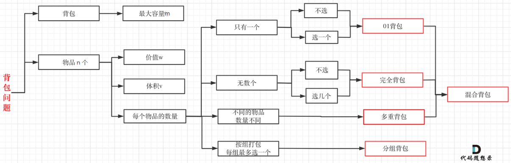

### 3.1、0-1 背包

#### 3.1.1、0-1 背包问题

> 背包容量 m = 12，有 n = 6 个物品，物品不可分割。要求尽可能让装入背包中的物品总价值最大，但不能超过总容量。
>
> 若采用暴力回溯，每个物品可以选或不选，共有 2<sup>n</sup> 种，时间复杂度 O(2<sup>n</sup>) ！

|   物品    |  A   |  B   |  C   |  D   |  E   |  F   |
| :-------: | :--: | :--: | :--: | :--: | :--: | :--: |
| 重量 w[i] |  4   |  6   |  2   |  2   |  5   |  1   |
| 价值 v[i] |  8   |  10  |  6   |  3   |  7   |  2   |

1. 定义状态 dp[i][j]：将 [1...i] 个物品装进剩余容量为 j 的背包，可获得的最大价值。

2. 确定状态转移方程
> - 当 j < w[i] 时，说明背包剩余容量不够，装不下第 i 个物品，此时 dp[i][j] = dp[i-1][j]；
> - 当 j >= w[i] 时，说明背包装得下第 i 个物品，到底装不装，取决于总价值的大小：
>   - 装：dp[i][j] = dp[i-1][j-w[i]] + v[i]；
>   - 不装：dp[i][j] = dp[i-1][j]，同 "当 j < w[i] 时"。

```java
if(j < w[i])
   dp[i][j] = dp[i-1][j];
else
   dp[i][j] = max(dp[i-1][j], dp[i-1][j-w[i]] + v[i]);
```

3. 自底向上计算局部最优值 dp[i][j]，保存备忘录、构造问题的最优解：即 dp[n][m]
> 第一行和第一列为序号，其数值为 0

|  0   |  1   |  2   |  3   |  4   |  5   |  6   |  7   |  8   |  9   |  10  |  11  |  12  |
| :--: | :--: | :--: | :--: | :--: | :--: | :--: | :--: | :--: | :--: | :--: | :--: | :--: |
|  1   |  0   |  0   |  0   |  8   |  8   |  8   |  8   |  8   |  8   |  8   |  8   |  8   |
|  2   |  0   |  0   |  0   |  8   |  8   |  10  |  10  |  10  |  10  |  18  |  18  |  18  |
|  3   |  0   |  6   |  6   |  8   |  8   |  14  |  14  |  16  |  16  |  18  |  18  |  24  |
|  4   |  0   |  6   |  6   |  9   |  9   |  14  |  14  |  17  |  17  |  19  |  19  |  24  |
|  5   |  0   |  6   |  6   |  9   |  9   |  14  |  14  |  17  |  17  |  19  |  21  |  24  |
|  6   |  2   |  6   |  8   |  9   |  11  |  14  |  16  |  17  |  19  |  19  |  21  |  24  |

4. 代码：
> - 时间复杂度：O(n × m)
> - 空间复杂度：O(n × m)

```java
public int bag(int n, int m, int[] w, int[] v) {
   int[][] dp = new int[n + 1][m + 1];
   for (int i = 1; i <= n; i++) {    		// 不使用矩阵的第一行第一列
       for (int j = 1; j <= m; j++) {
           if(j < w[i])
               dp[i][j] = dp[i-1][j];
           else
               dp[i][j] = Math.max(dp[i-1][j], dp[i-1][j-w[i]] + v[i]);
       }
   }
   return dp[n][m];
}

@Test
public void test(){
   int n = 6;
   int m = 12;
   int[] w = {0, 4, 6, 2, 2, 5, 1};		 // 不使用 w[0]
   int[] v = {0, 8, 10, 6, 3, 7, 2};	 // 不使用 v[0]
   System.out.println(bag(n, m, w, v));  // 24
}
```

5. 空间优化：
> 由状态转移方程可知：dp[i][j] 只和第 i-1 行有关，因此没必要将整个矩阵保存下来，只保存上一行的数据即可。即：动态规划中常用的方法：**滚动数组。**
> - 时间复杂度：O(n × m)
> - 空间复杂度：O(m)
```java
public int bag(int n, int m, int[] w, int[] v) {
   int[] dp = new int[m + 1];
   for (int i = 1; i <= n; i++) {
       // 为什么要倒序遍历？原方程 dp[i][j] = Math.max(dp[i-1][j], dp[i-1][j-w[i]] + v[i])
       // dp[i][j] 取决于 dp[i-1][j-w[i]]：取决于上一行的第 j-w[i] 列
       // 但滚动数组只有一行，如果正序遍历，计算本行的 dp[j] 时，本行的 dp[0...j-1] 已经被算出来了（此时保存的是本行的，而不是上一行的，相当于上一行的数据被覆盖了）
       // 逆序遍历，遍历到的 j-w[i] 就是上一行的，而不是本行的，不会被覆盖
       for (int j = m; j >= 1; j--) {
           if(j < w[i])
               dp[j] = dp[j];
           else
               dp[j] = Math.max(dp[j], dp[j-w[i]] + v[i]);
       }
   }
   return dp[m];
}
```

#### 3.1.2、分割等和子集 ⭐
> #416：https://leetcode-cn.com/problems/partition-equal-subset-sum/  HOT100
>
> 算法思想：转换为 0-1 背包，背包容量 m = ( Σnums[i] ) / 2，物品 (集合里的元素) 的重量为元素的数值，价值也为元素的数值，直接套 0-1 背包代码！
> - 时间复杂度：O(n × m)
> - 空间复杂度：O(n × m)

```java
public boolean canPartition(int[] nums) {
    int n = nums.length;        // 物品数量
    int sum = Arrays.stream(nums).sum();
    if (sum % 2 != 0) return false;
    int target = sum / 2;       // 背包容量
    int[][] dp = new int[n + 1][target + 1];
    for (int i = 1; i <= n; i++) {
        for (int j = 1; j <= target; j++) {
            int wv = nums[i - 1];  // 第 i 个物品的重量 / 价值
            if (j >= wv) {
                dp[i][j] = Math.max(dp[i - 1][j - wv] + wv, dp[i - 1][j]);
            } else {
                dp[i][j] = dp[i - 1][j];
            }
        }
    }
    return dp[n][target] == target;
}

// 滚动数组优化空间
public boolean canPartition(int[] nums) {
    int n = nums.length;
    int sum = Arrays.stream(nums).sum();
    if (sum % 2 != 0) return false;
    int target = sum / 2;

    int[] dp = new int[target + 1];
    for (int i = 1; i <= n; i++) {
        for (int j = target; j > 0; j--) {
            int wv = nums[i - 1];
            if (j >= wv) {
                dp[j] = Math.max(dp[j - wv] + wv, dp[j]);
            } else {
                dp[j] = dp[j];
            }
        }
    }
    return dp[target] == target;
}
```

#### 3.1.3、最后一块石头的重量 II

> #1049：https://leetcode-cn.com/problems/last-stone-weight-ii/
>
> 算法思想：转换为 0-1 背包，将所有石头分为总重量尽可能相等的两堆，两堆石头的重量差即为所求。上一题 "分割等和子集" 是求背包是否正好装满，而本题是求背包最多能装多少。
> - 时间复杂度：O(n × m)
> - 空间复杂度：O(n × m)

```java
public int lastStoneWeightII(int[] stones) {
    int n = stones.length;    // 物品数量
    int sum = Arrays.stream(stones).sum();
    int target = sum / 2;     // 背包容量

    // int[] dp = new int[target + 1];   // 滚动数组优化空间
    int[][] dp = new int[n + 1][target + 1];
    for (int i = 1; i <= n; i++) {
        for (int j = target; j > 0; j--) {
            int wv = stones[i - 1];   // 第 i 个物品的重量 / 价值
            if (j >= wv) {
                // dp[j] = Math.max(dp[j - wv] + wv, dp[j]);   // 滚动数组优化空间
                dp[i][j] = Math.max(dp[i - 1][j - wv] + wv, dp[i - 1][j]);
            } else {
                // dp[j] = dp[j];   // 滚动数组优化空间
                dp[i][j] = dp[i - 1][j];
            }
        }
    }
    // return sum - 2 * dp[target];   // 滚动数组优化空间
    return sum - 2 * dp[n][target];
}
```

#### 3.1.4、目标和 ⭐

> #494：https://leetcode-cn.com/problems/target-sum/  HOT100

**1、回溯**
> - 时间复杂度：O(2<sup>n</sup>)
> - 空间复杂度：O(n)

```java
int cnt = 0;

public int findTargetSumWays(int[] nums, int target) {
    backTrack(nums, target, 0);
    return cnt;
}

private void backTrack(int[] nums, int target, int curIndex) {
    if (curIndex >= nums.length) {
        if (target == 0) cnt++;
        return;
    }
    backTrack(nums, target + nums[curIndex], curIndex + 1);
    backTrack(nums, target - nums[curIndex], curIndex + 1);
}
```

**2、DP**
> 原问题等价于： 找到 nums[] 的一个正子集和一个负子集，使两者之差 = target；
>
> 假设 P 是正子集，N 是负子集；
>
> 如：nums = [1, 2, 3, 4, 5]，target = 3，其中一解为 + 1 - 2 + 3 - 4 + 5 = 3，此时正子集 P = [1, 3, 5]，负子集 N = [2, 4]。则：

```
               	  sum(P) - sum(N) = target
sum(P) + sum(N) + sum(P) - sum(N) = target + sum(P) + sum(N)
                       2 * sum(P) = target + sum(nums)
```

> 转为 0-1 背包问题：在 nums[] 中找到一个正子集 P，使得 sum(P) = [target + sum(nums)] / 2，这样的 P 有几种？
>
> 定义 dp[i][j]：在 nums[] 的前 i 个数中选取元素，使得这些元素之和等于 j 的方案数；
>
> - 时间复杂度：O(n × positive)
> - 空间复杂度：O(n × positive)，可优化

```java
public int findTargetSumWays(int[] nums, int target) {
    int n = nums.length;
    int sum = Arrays.stream(nums).sum();
    int positive = (sum + target) / 2;
    if (sum < target || (sum + target) % 2 != 0 || positive < 0) return 0;
    int[][] dp = new int[n + 1][positive + 1];
    dp[0][0] = 1;
    for (int i = 1; i <= n; i++) {
        for (int j = 0; j <= positive; j++) {
            if (j < nums[i - 1])  // 当前元素比容量 j 大，装不下
                dp[i][j] = dp[i - 1][j];
            else                  // 装得下，总方案数 = 不装 + 装
                dp[i][j] = dp[i - 1][j] + dp[i - 1][j - nums[i-1]];
        }
    }
    return dp[n][positive];
}
```

### 3.2、完全背包 ⭐

#### 3.2.1、完全平方数

> #279：https://leetcode-cn.com/problems/perfect-squares/  HOT100
>
> 题目等价于：有 n 个物品，重量为 1、4、9、16 ...，有一个容量为 m 的背包，问：填满背包最少需要几个物品？
>
> 算法思想：定义 dp[i] 为最少需要多少个平方数来表示 i。这些数必然 ∈ [1, √n]，我们枚举这些数，假设当前枚举到 j，则将 i 拆分成 (i - j<sup>2</sup>) + j<sup>2</sup>，因此 dp[i] = dp[i- j<sup>2</sup>] + 1。但题目要求最少的数量，因此 j 遍历 [1, √n] 时用遍历 min 记录最少的数量。
>
> 状态转移方程：dp[i] = min(dp[i- j<sup>2</sup>]) + 1
>
> - 时间复杂度：O(n × √n)
> - 空间复杂度：O(n)

```java
public int numSquares(int n) {
    int[] dp = new int[n + 1];
    for (int i = 1; i <= n; i++) {
        int min = Integer.MAX_VALUE;
        for (int j = 1; j*j <= i; j++) {
            min = Math.min(min, dp[i - j*j]);
        }
        dp[i] = min + 1;
    }
    return dp[n];
}
```

#### 3.2.2、零钱兑换

> #322：https://leetcode.cn/problems/coin-change/  HOT100、牛客TOP101
>
> 算法思想：和上题一样，amount 可以拆分为 coins[i] + (amount - coins[i])，但是如果 amount - coins[i] 不能被 coins[] 表示，则不能拆！状态转移方程：dp[i] = min(dp[i - coins[i]) + 1，如果 i 不能被 coins[] 表示，则 dp[i] = -1；
>
> - 时间复杂度：O(amount * coins.length)
> - 空间复杂度：O(amount)

```java
public int coinChange(int[] coins, int amount) {
    int[] dp = new int[amount + 1];
    for (int i = 1; i <= amount; i++) {
        int minCoinNum = Integer.MAX_VALUE;
        for (int coin : coins) {
            // 当前金额要 >= 硬币面值 && (当前金额 - 其中一种面值) 可以被 coins[] 表示
            if (i >= coin && dp[i - coin] != -1)
                minCoinNum = Math.min(minCoinNum, dp[i - coin]);
        }
        if (minCoinNum == Integer.MAX_VALUE)	// 不能被 coins[] 表示
            dp[i] = -1;
        else
            dp[i] = minCoinNum + 1;
    }
    return dp[amount];
}
```

#### 3.2.3、零钱兑换 II

> #518：https://leetcode.cn/problems/coin-change-ii/
> 
> 算法思想：和爬楼梯类似，爬楼梯 dp[i] = dp[i-1] + dp[i-2]，但这里是 dp[i] = dp[i-coin1] + dp[i-coin2] + ...
> - 时间复杂度：O(amount * coins.length)
> - 空间复杂度：O(amount)

```java
public int change(int amount, int[] coins) {
    int[] dp = new int[amount + 1];
    dp[0] = 1;
    // 注意：本题求组合数，3 = 2 + 1 和 3 = 1 + 2 是一样的！
    // 先遍历 amount，再遍历 coins[] 则求的是排列数，结果有重复！
    // 对于一般的背包问题，先遍历物品还是先遍历背包都没问题，因为求的是背包最多能装多少，不用管计算过程中有没有重复；
    // 但这道题要求组合数，必须先遍历物品再遍历背包，保证遍历的全程 coins 的顺序是恒定的！
    for (int coin : coins) {
        for (int j = coin; j <= amount; j++) {
            dp[j] += dp[j - coin];
        }
    }
    return dp[amount];
}
```

#### 3.2.4、单词拆分

> #139：https://leetcode-cn.com/problems/word-break/  HOT100、字节飞书一面原题😟
>
> 算法思想：和 "零钱兑换" 一样，定义 dp[i] 表示字符串 s[0 ... i) 是否可被字典中的单词表示，则 s[0...i) = s[0...j) + s[j...i)，即：dp[i] = dp[j] && 字典中是否包含子串 s[j ... i)
> - 时间复杂度：O(n<sup>2</sup>)
> - 空间复杂度：O(n)

```java
public boolean wordBreak(String s, List<String> wordDict) {
    Set<String> set = new HashSet<>(wordDict);
    int n = s.length();
    boolean[] dp = new boolean[n + 1];
    dp[0] = true;
    for (int i = 1; i <= n; i++) {
        for (int j = 0; j < i; j++) {
            if (dp[j] && set.contains(s.substring(j, i))) {
                dp[i] = true;
                break;
            }
        }
    }
    return dp[n];
}
```

## 4、买卖股票问题 ⭐

### 4.1、买卖股票的最佳时机

> #121：https://leetcode-cn.com/problems/best-time-to-buy-and-sell-stock/  剑指offer63、HOT100、牛客TOP101
>
> 方法一：前 i 天的最大收益 = max{前 i-1 天的最大收益，第 i 天的价格 - 前 i-1 天中的最小价格}
> - 时间复杂度：O(n)
> - 空间复杂度：O(1)

```java
public int maxProfit(int[] prices){
    if (prices.length == 1) return 0;
    int minPrice = Integer.MAX_VALUE;
    int maxProfit = 0;
    for (int price : prices) {
        maxProfit = Math.max(maxProfit, price - minPrice);
        minPrice = Math.min(minPrice, price);
    }
    return maxProfit;
}
```

> 方法二：定义 dp[i][j] 表示第 i 天的最大利润，其中 j 可取 1、0，分别表示第 i 天是否持有股票，则：
>
> - dp[i][0]：第 i 天不持有股票，说明：
>   - 前 [0, i-1] 天也不持有股票，所以第 i 天不持有股票；
>   - 第 i-1 天持有股票，但第 i 天卖掉了，所以第 i 天不持有股票；
> - dp[i][1]：第 i 天持有股票，说明：
>   - 前 [0, i-1] 天持有股票，所以第 i 天也持有股票；
>   - 前 [0, i-1] 天不持有股票，但第 i 天买入了，所以第 i 天持有股票；
>
> - 时间复杂度：O(n)
> - 空间复杂度：O(n)

```java
public int maxProfit(int[] prices) {
    int[][] dp = new int[prices.length][2];
    dp[0][0] = 0;			// 第 0 天没买股票，手里 0 元
    dp[0][1] = -prices[0];	// 第 0 天买了股票，手里 -prices[0] 元
    for (int i = 1; i < prices.length; i++) {
        dp[i][0] = Math.max(dp[i-1][0], dp[i-1][1] + prices[i]);
        dp[i][1] = Math.max(dp[i-1][1], -prices[i]);	// 手里本来 0 元，买了股票后欠了 prices[i] 元
    }
    return dp[dp.length-1][0];
}
```

### 4.2、买卖股票的最佳时机 II

> #122：https://leetcode-cn.com/problems/best-time-to-buy-and-sell-stock-ii/  牛客TOP101

**1、动态规划**
> 算法思想：如上题 4.1，区别在于可以买卖多次。
> - 时间复杂度：O(n)
> - 空间复杂度：O(n)

```java
public int maxProfit(int[] prices) {
    int[][] dp = new int[prices.length][2];
    dp[0][0] = 0;           // 第 0 天没买
    dp[0][1] = -prices[0];  // 第 0 天买入
    for (int i = 1; i < prices.length; i++) {
        dp[i][0] = Math.max(dp[i-1][0], dp[i-1][1] + prices[i]);
        dp[i][1] = Math.max(dp[i-1][1], dp[i-1][0] - prices[i]);
    }
    return dp[dp.length-1][0];
}
```

**2、贪心**
> 算法思想：第 0 天买入，第 2 天卖出，则利润 = prices[2] - prices[0] = (prices[2] - prices[1]) + (prices[1] - prices[0])
> - 时间复杂度：O(n)
> - 空间复杂度：O(1)

```java
public int maxProfit(int[] prices) {
    int maxProfit = 0;
    for (int i = 0; i < prices.length - 1; i++) {
        if (prices[i] < prices[i + 1]) {
            maxProfit += prices[i + 1] - prices[i];
        }
    }
    return maxProfit;
}
```

### 4.3、最佳买卖股票时机含冷冻期
> #309：https://leetcode-cn.com/problems/best-time-to-buy-and-sell-stock-with-cooldown/  HOT100
>
> 算法思想：如上题 4.2，区别在于卖出后第二天不能买。
> - 时间复杂度：O(n)
> - 空间复杂度：O(n)

```java
public int maxProfit(int[] prices) {
    if (prices.length == 1) return 0;
    int[][] dp = new int[prices.length][2];
    dp[0][0] = 0;           // 第 0 天没买
    dp[0][1] = -prices[0];  // 第 0 天买入
    dp[1][0] = Math.max(0, prices[1] - prices[0]);    // 第 0 天没买，或第 0 天买了而第 1 天卖了
    dp[1][1] = Math.max(-prices[0], -prices[1]);      // 第 0 天买入，或第 1 天买入
    for (int i = 2; i < prices.length; i++) {
        dp[i][0] = Math.max(dp[i-1][0], dp[i-1][1] + prices[i]);
        dp[i][1] = Math.max(dp[i-1][1], dp[i-2][0] - prices[i]);
        // 今天持有股票，今天口袋的钱 = max(昨天本来就持有股票, 前天买了股票(昨天就不能买了))
    }
    return dp[prices.length-1][0];
}
```

### 4.4、买卖股票的最佳时机含手续费
> #714：https://leetcode-cn.com/problems/best-time-to-buy-and-sell-stock-with-transaction-fee/
>
> 算法思想：如上题 4.2，区别在于卖出后要交固定的手续费。
> - 时间复杂度：O(n)
> - 空间复杂度：O(n)

```java
public int maxProfit(int[] prices, int fee) {
    if (prices.length == 1) return 0;
    int[][] dp = new int[prices.length][2];
    dp[0][0] = 0;           // 第 0 天没买
    dp[0][1] = -prices[0];  // 第 0 天买入
    for (int i = 1; i < prices.length; i++) {
        dp[i][0] = Math.max(dp[i-1][0], dp[i-1][1] + prices[i] - fee);    // 卖出要交手续费
        dp[i][1] = Math.max(dp[i-1][1], dp[i-1][0] - prices[i]);
    }
    return dp[prices.length-1][0];
}
```

### 4.5、买卖股票的最佳时机 III

> #122：https://leetcode-cn.com/problems/best-time-to-buy-and-sell-stock-iii/  牛客TOP101
>
> 算法思想：定义 dp[天数][当前是否持股][卖出的次数]，第 i 天结束时，有以下 6 种情况：
>
> 1. 未持股，未卖出：说明从未进行过买卖，利润为 0：dp[i][0][0] = 0
>
> 2. 未持股，卖出 1 次：可能是之前卖出的，也可能是昨天持股今天卖出，也可能是今天买今天卖 (这种情况不用考虑)
>    ```java
>    dp[i][0][1] = Math.max(dp[i-1][0][1], dp[i-1][1][0] + prices[i]);
>    ```
>
> 3. 未持股，卖出 2 次：可能是之前卖出的，也可能是昨天持股今天卖出，也可能是今天买今天卖 (这种情况不用考虑)
>    ```java
>    dp[i][0][2] = Math.max(dp[i-1][0][2], dp[i-1][1][1] + prices[i]);
>    ```
>
> 4. 持股，未卖出：可能是之前买入的，也可能是今天刚买的
>    ```java
>    dp[i][1][0] = Math.max(dp[i-1][1][0], dp[i-1][0][0] - prices[i]);
>    ```
>
> 5. 持股，卖出过 1 次：可能是之前买入的，也可能是今天刚买的，也可能是今天买今天卖再今天买 (这种情况不用考虑)
>    ```java
>    dp[i][1][1] = Math.max(dp[i-1][1][1], dp[i-1][0][1] - prices[i]);
>    ```
>
> 6. 持股，卖出过 2 次：因为最多交易 2 次，所以这种情况不存在
>    ```java
>    dp[i][1][2] = 0;
>    ```
>
> - 时间复杂度：O(n)
> - 空间复杂度：O(n)

```java
public int maxProfit(int[] prices) {
    int n = prices.length;
    int[][][] dp = new int[n][2][3];
    dp[0][0][0] = 0;
    dp[0][0][1] = 0;            // 今天买今天卖
    dp[0][0][2] = 0;            // 今天买今天卖，再今天买今天卖
    dp[0][1][0] = -prices[0];   // 今天买
    dp[0][1][1] = -prices[0];   // 今天买今天卖，再今天买
    // dp[0][1][2] = 0;         // 不可能
    for (int i = 1; i < n; i++) {
        dp[i][0][0] = 0;
        dp[i][0][1] = Math.max(dp[i-1][0][1], dp[i-1][1][0] + prices[i]);
        dp[i][0][2] = Math.max(dp[i-1][0][2], dp[i-1][1][1] + prices[i]);
        dp[i][1][0] = Math.max(dp[i-1][1][0], dp[i-1][0][0] - prices[i]);
        dp[i][1][1] = Math.max(dp[i-1][1][1], dp[i-1][0][1] - prices[i]);
        //dp[i][1][2] = 0;    // 不可能
    }
    return Math.max(0, Math.max(dp[n-1][0][1], dp[n-1][0][2]));
}
```

> 简化：第 i 天结束时，有以下 5 种情况：
> 1. 未进行过任何操作；
> 2. 只进行过一次买操作，记为 buy1；
> 3. 进行了一次买操作和一次卖操作，即完成了一笔交易，记位 sell1；
> 4. 在完成了一笔交易的前提下，进行了第二次买操作，记为 buy2；
> 5. 完成了两笔交易，记为 sell2。

```java
public int maxProfit(int[] prices) {
    if (prices.length == 1) return 0;
    // 初始化
    int buy1 = -prices[0];    // 今天买
    int sell1 = 0;            // 今天买今天卖
    int buy2 = -prices[0];    // 今天买今天卖，再今天买
    int sell2 = 0;            // 今天买今天卖，再今天买今天卖
    for (int i = 1; i < prices.length; i++) {
        // 等号左边的 buy、sell 是今天的，等号右边的 buy、sell 是昨天的
        buy1 = Math.max(buy1, -prices[i]);
        sell1 = Math.max(sell1, buy1 + prices[i]);
        buy2 = Math.max(buy2, sell1 - prices[i]);
        sell2 = Math.max(sell2, buy2 + prices[i]);
    }
    // 应该 return max(0, sell1, sell2)，但 sell1、sell2 不可能小于 0，
    // 而且 sell1 后，当天买再当天卖，即可转移为 sell2
    return sell2;
}
```

## 5、子序列问题

### 5.1、最长公共子序列
> #1143：https://leetcode-cn.com/problems/longest-common-subsequence/
>
> 设字符串 str1[0...i-1] 和 str2[0...j-1] 的最长公共子序列为 lcs[0...k-1]，则去掉 str1 和 str2 各自的最后一个字符时：
> - 若 str1[i-1] == str2[j-1]，则 lcs[k-1] 必定 == str1[i-1] == str2[j-1]，且 lcs[0...k-2] 是 str1[0...i-2] 和 str2[0...j-2] 的 LCS；
> - 若 str1[i-1] != str2[j-1]：
>   - 若 lcs[k-1] != str1[i-1] && lcs[k-1] != str2[j-1]，则 lcs[0...k-1] 是 str1[0...i-2] 和 str2[0...j-2] 的最长公共子序列；
>   - 若 lcs[k-1] == str1[i-1] && lcs[k-1] != str2[j-1]，则 lcs[0...k-1] 是 str1[0...i-2] 和 str2[0...j-2] 的最长公共子序列；
>   - 若 lcs[k-1] != str1[i-1] && lcs[k-1] == str2[j-1]，则 lcs[0...k-1] 是 str1[0...i-2] 和 str2[0...j-1] 的最长公共子序列；
>
> 定义  dp[i][j] 为 str1[0…i-1] 和 str2[0…j-1] 的 lcs 长度，则：

```java
if (str1.charAt(i-1) == str2.charAt(j-1))
    dp[i][j] = dp[i-1][j-1] + 1;
else
    // 其实应该是 max(dp[i-1][j-1], dp[i-1][j], dp[i][j-1])，但 dp[i-1][j-1] 没有另外两项大
    dp[i][j] = Math.max(dp[i-1][j], dp[i][j-1]);
```

> - 时间复杂度：O(|str1| × |str2|)
> - 空间复杂度：O(|str1| × |str2|)

```java
public int longestCommonSubsequence(String str1, String str2) {
    int len1 = str1.length();
    int len2 = str2.length();
    int[][] dp = new int[len1 + 1][len2 + 1];
    for (int i = 1; i <= len1; i++) {
        for (int j = 1; j <= len2; j++) {
            if (str1.charAt(i - 1) == str2.charAt(j - 1))
                dp[i][j] = dp[i - 1][j - 1] + 1;
            else
                dp[i][j] = Math.max(dp[i - 1][j], dp[i][j - 1]);
        }
    }
    return dp[len1][len2];
}

// 空间优化：O(|str2|)
public int longestCommonSubsequence(String str1, String str2) {
    int len1 = str1.length();
    int len2 = str2.length();
    int[][] dp = new int[2][len2 + 1];
    for (int i = 1; i <= len1; i++) {
        for (int j = 1; j <= len2; j++) {
            if (str1.charAt(i - 1) == str2.charAt(j - 1))
                dp[1][j] = dp[0][j - 1] + 1;
            else
                dp[1][j] = Math.max(dp[0][j], dp[1][j - 1]);
        }
        dp[0] = Arrays.copyOf(dp[1], len2 + 1);
    }
    return dp[1][len2];
}
```

> trace 算法：
>
> 构造 dp[i][j] 的同时，用 trace[i][j] 状态转移方向，用 1 表示来自左上方，2 表示来自左边，3 表示来自上边；
>
> 对于 s1 = "cbdec"，s2 = "bdac"，LCS = "bdc"

```java
// dp[][]：
[0, 0, 0, 0, 0]
[0, 0, 0, 0, 1]
[0, 1, 1, 1, 1]
[0, 1, 2, 2, 2]
[0, 1, 2, 2, 2]
[0, 1, 2, 2, 3]

/*
trace[][] 从右下往左上看：
1. [1]：表示状态从左上方传递过来，追踪到 [2]
2. [2]：表示状态从左方传递过来，追踪到 [3]
3. [3]：表示状态从上方传递过来，追踪到 [1]
4. [1]：表示状态从左上方传递过来，追踪到 [1]
5. [1]：表示状态从左上方传递过来，追踪到 [0]，结束！
追踪过程中，只有遇到 [1] 才说明这个字符 ∈ LCS
*/
         b    d    a    c
  [ 0,   0,   0,   0,   0 ]
c [ 0,   2,   2,   2,   1 ]
b [ 0,  [1],  2,   2,   2 ]
d [ 0,   3,  [1],  2,   2 ]
e [ 0,   3,  [3], [2],  2 ]
c [ 0,   3,   3,   2,  [1]]
```

```java
public String LCS(String s1, String s2) {
    int len1 = s1.length();
    int len2 = s2.length();
    int[][] dp = new int[len1 + 1][len2 + 1];
    int[][] trace = new int[len1 + 1][len2 + 1];

    for (int i = 1; i <= len1; i++) {
        for (int j = 1; j <= len2; j++) {
            if (s1.charAt(i - 1) == s2.charAt(j - 1)) {
                dp[i][j] = dp[i - 1][j - 1] + 1;
                trace[i][j] = 1;
            } else {
                if (dp[i - 1][j] > dp[i][j - 1]) {
                    dp[i][j] = dp[i - 1][j];
                    trace[i][j] = 3;
                } else {
                    dp[i][j] = dp[i][j - 1];
                    trace[i][j] = 2;
                }
            }
        }
    }

    int i = len1;
    int j = len2;
    StringBuilder sb = new StringBuilder();
    while (true) {
        if (i < 0 || j < 0 || trace[i][j] == 0) break;
        if (trace[i][j] == 1) {
            sb.append(s1.charAt(i - 1));    // 追踪到 [1]，将当前字符添加进 LCS
            i--;
            j--;
        } else if (trace[i][j] == 2) {
            j--;
        } else if (trace[i][j] == 3) {
            i--;
        }
    }
    return sb.reverse().toString();
}
```

### 5.2、两个字符串的删除操作
> #583：https://leetcode-cn.com/problems/delete-operation-for-two-strings/
>
> 算法思想1：在两个字符串中分别删除最长公共子序列，剩余的字符数即为所求。

```java
public int minDistance(String word1, String word2) {
    int len1 = word1.length();
    int len2 = word2.length();
    return len1 + len2 - 2 * longestCommonSubsequence(word1, word2);
}
```

> 算法思想2：dp[i][j] 表示 word1[0...i-1] 和 word2[0...j-1] 的最小距离
```java
public int minDistance(String word1, String word2) {
    int m = word1.length();
    int n = word2.length();
    int[][] dp = new int[m + 1][n + 1];
    for (int i = 1; i <= m; i++) {
        dp[i][0] = i;
    }
    for (int j = 1; j <= n; j++) {
        dp[0][j] = j;
    }
    for (int i = 1; i <= m; i++) {
        for (int j = 1; j <= n; j++) {
            if (word1.charAt(i - 1) == word2.charAt(j - 1)) {  // 末尾字符相同，就不需要删
                dp[i][j] = dp[i - 1][j - 1];
            } else {                                           // 末尾字符不同，要删，删哪个？选最小
                dp[i][j] = Math.min(dp[i][j - 1], dp[i - 1][j]) + 1;
            }
        }
    }
    return dp[m][n];
}
```

### 5.3、两个字符串的最小ASCII删除和
> #712：https://leetcode-cn.com/problems/minimum-ascii-delete-sum-for-two-strings/
```java
public int minimumDeleteSum(String s1, String s2) {
    int len1 = s1.length();
    int len2 = s2.length();
    int[][] dp = new int[len1 + 1][len2 + 1];
    for (int i = 1; i <= len2; i++) {
        dp[0][i] = dp[0][i-1] + s2.charAt(i-1);
    }
    for (int i = 1; i <= len1; i++) {
        dp[i][0] = dp[i-1][0] + s1.charAt(i-1);
    }
    for (int i = 1; i <= len1; i++) {
        for (int j = 1; j <= len2; j++) {
            if (s1.charAt(i-1) == s2.charAt(j-1))
                dp[i][j] = dp[i-1][j-1];
            else
                dp[i][j] = Math.min(dp[i-1][j] + s1.charAt(i-1), dp[i][j-1] + s2.charAt(j-1));
        }
    }
    return dp[len1][len2];
}
```

### 5.4、最长递增子序列 ⭐
> #300：https://leetcode-cn.com/problems/longest-increasing-subsequence/  HOT100、牛客TOP101、华为、美团、字节 (要求输出序列)
> - 时间复杂度：O(n<sup>2</sup>)
> - 空间复杂度：O(n)
>
> 算法思想：例如怎么求 dp[5]？nums[5] = 3，比 3 小的有 nums[0]、nums[4]，所以 dp[5] = max(dp[0], dp[4]) + 1；
>
> 状态转移方程：dp[i] = max(dp[j]) + 1，其中 j < i

| index |  0   |  1   |  2   |  3   |  4   |  5   |
| :---: | :--: | :--: | :--: | :--: | :--: | :--: |
| nums  |  1   |  4   |  3   |  4   |  2   |  3   |
|  dp   |  1   |  2   |  2   |  3   |  2   |  ?   |

```java
public int lengthOfLIS(int[] nums) {
    int n = nums.length;
    int[] dp = new int[n];
    Arrays.fill(dp, 1);    // 初始全为1
    for (int i = 0; i < n; i++) {
        for (int j = 0; j < i; j++) {
            if (nums[j] < nums[i])
                dp[i] = Math.max(dp[i], dp[j] + 1);
        }
    }
    return Arrays.stream(dp).max().getAsInt();
}
```

> 打印路径，自己做出来的：
```java
public int lengthOfLIS(int[] nums) {
    Map<Integer, Integer> map = new HashMap<>();
    int n = nums.length;
    int[] dp = new int[n];
    Arrays.fill(dp, 1);
    for (int i = 0; i < n; i++) {
        // 倒着遍历，可以得到字典序最小的最长递增子序列
        // 如：nums = [1, 3, 2, 5]，若正着遍历，则结果为 1, 3, 5，若倒着遍历，则结果为 1, 2, 5
        for (int j = i - 1; j >= 0; j--) {
            if (nums[j] < nums[i]) {
                if (dp[i] < dp[j] + 1) {
                    dp[i] = dp[j] + 1;
                    map.put(i, j);
                }
            }
        }
    }
    int max = -1;
    int maxIndex = -1;
    for (int i = 0; i < dp.length; i++) {
        if (dp[i] > max) {
            max = dp[i];
            maxIndex = i;
        }
    }
    List<Integer> path = getPath(nums, map, maxIndex);
    System.out.println(path);
    return max;
}

private List<Integer> getPath(int[] nums, Map<Integer, Integer> map, int start) {
    List<Integer> path = new ArrayList<>();
    int toIndex = start;
    path.add(nums[toIndex]);
    while (map.containsKey(toIndex)) {
        int fromIndex = map.get(toIndex);
        path.add(nums[fromIndex]);
        toIndex = fromIndex;
    }
    Collections.reverse(path);
    return path;
}
```

### 5.5、俄罗斯套娃信封问题
> #354：https://leetcode-cn.com/problems/russian-doll-envelopes/
>
> 算法思想：最长递增子序列 (LIS) 是一维数组，这里是二维数组，想办法固定其中一维，另一维的 LIS 即为所求！
>
> 按 w 升序，h 降序对 envelopes[w][h] 进行排序，则问题转换为求 h 的最长递增子序列，
>
> 必须对 h 降序，如果 h 升序，如：
> - [1, 2]
> - [2, 3]
> - [2, 4]
>
> LIS(h) = LIS([2, 3, 4]) = 3，但第 3 个信封并不能套住第 2 个信封，因为它们的 w 相同，问题：w 相同的信封被选了多次！
>
> 同理，若 h 不排序，也可能导致 w 相同的信封被选多次；
> 
> 关键点：【w 相同的信封被选了多次】怎么解决？当 w 相同时，h 降序排，求 h 的最长递增子序列，由于 h 降序，所以 w 相同的里面只会取 1 个！
> 
> 只有 h 降序时，w 相同的信封只会被选 1 次，如：
> - [1, 2]
> - [2, 4]
> - [2, 3]
>
> LIS(h) = LIS([2, 4, 3]) = 2，LIS 只能取 2、4 或 2、3；
>
> - 时间复杂度：O(n<sup>2</sup>)，超时了 (官方又加了测试用例)
> - 空间复杂度：O(n)

```java
public int maxEnvelopes(int[][] envelopes) {
    int len = envelopes.length;
    Arrays.sort(envelopes, ((o1, o2) -> o1[0] == o2[0] ? o2[1] - o1[1] : o1[0] - o2[0]));
    int[] h = Arrays.stream(envelopes).map(o -> o[1]).mapToInt(Integer::intValue).toArray();
    return lengthOfLIS(h);
}

public int maxEnvelopes(int[][] envelopes) {
    int[] h = Arrays.stream(envelopes)
        .sorted((o1, o2) -> o1[0] == o2[0] ? o2[1] - o1[1] : o1[0] - o2[0])
        .map(o -> o[1])
        .mapToInt(Integer::intValue)
        .toArray();
    return lengthOfLIS(h);
}
```

### 5.6、最长回文子序列
> #516：https://leetcode-cn.com/problems/longest-palindromic-subsequence/
>
> 算法思想：定义 dp[i][j] 为 s[i...j] 的最长回文子序列长度。对于 dp[i][j]，其子问题是 dp[i+1][j-1]、dp[i+1][j]、dp[i][j-1]：
>
> - 若 s[i] == s[j]，则 dp[i][j] = dp[i+1][j-1] + 2；

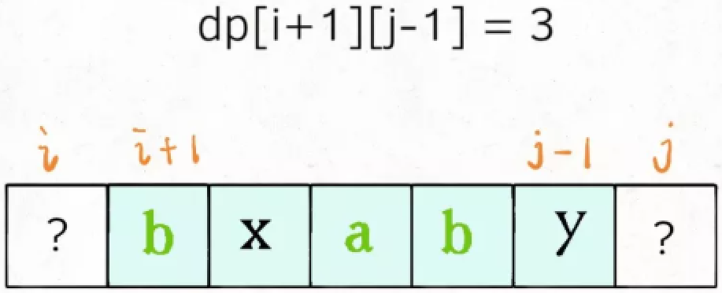

> - 若 s[i] != s[j]，则 dp[i][j] = Math.max(dp[i+1][j], dp[i][j-1])；

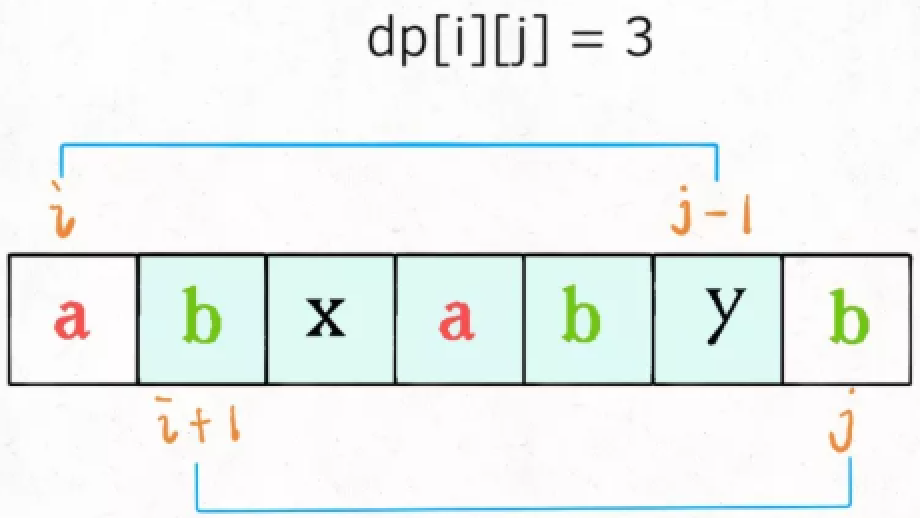

> - base case：dp[i][i] = 1，且由于 i 必定小于 j，所以 dp[][] 矩阵左下角都是 0；
>
> - 要求 dp[i][j]，必须先求其子问题 dp[i+1][j-1]、dp[i+1][j]、dp[i][j-1]，因此可按照以下两种顺序遍历，这里使用后者：
    
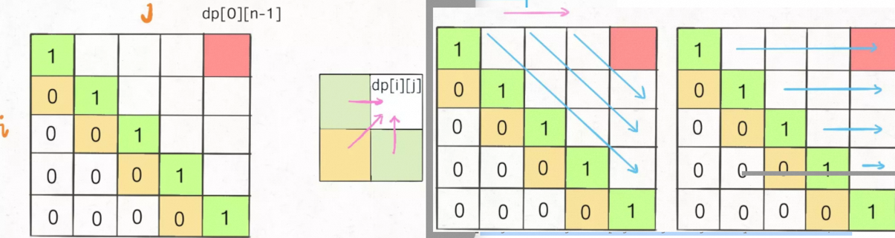

> Tips：还可以把问题转化为：求ｓ和ｓ的逆序的最长公共子序列！
>
> - 时间复杂度：O(n<sup>2</sup>)
> - 空间复杂度：O(n<sup>2</sup>)

```java
public int longestPalindromeSubseq(String s) {
    int n = s.length();
    int[][] dp = new int[n][n];
    for (int i = 0; i < n; i++) dp[i][i] =  1;
    for (int i = n - 1; i >= 0; i--) {
        for (int j = i + 1; j < n; j++) {
            if (s.charAt(i) == s.charAt(j))
                dp[i][j] = dp[i + 1][j - 1] + 2;
            else
                dp[i][j] = Math.max(dp[i + 1][j], dp[i][j - 1]);
        }
    }
    return dp[0][n - 1];
}
```

## 6、子串问题 ⭐

### 6.1、最大子数组和
> #53：https://leetcode-cn.com/problems/maximum-subarray/  剑指offer42、HOT100、牛客TOP101

**1、动态规划**
> 算法思想：定义 dp[i] 为：以 i 结尾的最大子序和
```java
// dp[i] = dp[i-1] + nums[i]：将当前元素 nums[i] 加入前面的子数组中
// dp[i] = nums[i]：重新构造子数组，因为题目说子数组是连续的
dp[i] = Math.max(dp[i-1] + nums[i], nums[i]);
```
> - 时间复杂度：O(n)
> - 空间复杂度：O(n)，可优化为 O(1)

```java
public int maxSubArray(int[] nums) {
    int[] dp = new int[nums.length];
    dp[0] = nums[0];
    for (int i = 1; i < nums.length; i++) {
        dp[i] = Math.max(dp[i-1] + nums[i], nums[i]);
    }
    return Arrays.stream(dp).max().getAsInt();
}
```

> 空间优化：
```java
public int maxSubArray(int[] nums) {
    int max = nums[0];
    int finalMax = nums[0];
    for (int i = 1; i < nums.length; i++) {
        max = Math.max(nums[i], max + nums[i]);
        finalMax = Math.max(max, finalMax);
    }
    return finalMax;
}
```

**2、贪心**
> 算法思想：从左到右遍历，若 curSum 为负，则 curSum 置 0，从下一个位置继续遍历，最大的 curSum 即为所求！
> - 时间复杂度：O(n)
> - 空间复杂度：O(1)

```java
public int maxSubArray(int[] nums) {
    if (nums.length == 1) return nums[0];
    int maxSum = Integer.MIN_VALUE;
    int curSum = 0;
    for (int num : nums) {
        curSum += num;
        maxSum = Math.max(maxSum, curSum);
        if (curSum <= 0) {
            curSum = 0;
        }
    }
    return maxSum;
}
```

### 6.2、乘积最大子数组
> #152：https://leetcode-cn.com/problems/maximum-product-subarray/  HOT100
>
> 算法思想：和上一题类似，dp[i] = Math.max(dp[i-1] * nums[i], nums[i])，
>
> 但是，nums[i] 可能为负！当前最大值乘负数，则变成了最小值！
>
> - 时间复杂度：O(n)
> - 空间复杂度：O(n)

```java
public int maxProduct(int[] nums) {
    int n = nums.length;
    int[] max = new int[n];
    int[] min = new int[n];
    max[0] = min[0] = nums[0];
    for (int i = 1; i < n; i++) {
        max[i] = max(max[i - 1] * nums[i], nums[i], min[i - 1] * nums[i]);
        min[i] = min(min[i - 1] * nums[i], nums[i], max[i - 1] * nums[i]);
    }
    return Arrays.stream(max).max().getAsInt();
}

private int max(int a, int b, int c) {
    return Math.max(a, Math.max(b, c));
}
private int min(int a, int b, int c) {
    return Math.min(a, Math.min(b, c));
}
```

> 贪心：空间复杂度 O(1)
```java
public int maxProduct(int[] nums) {
    int max = Integer.MIN_VALUE;
    int curMax = 1;
    int curMin = 1;
    for (int num : nums) {
        // 若当前元素为负，则 swap(curMax, curMin)
        if (num < 0) {
            int temp = curMax;
            curMax = curMin;
            curMin = temp;
        }
        curMax = Math.max(curMax * num, num);
        curMin = Math.min(curMin * num, num);
        max = Math.max(max, curMax);
    }
    return max;
}
```

### 6.3、最长回文子串
> #5：https://leetcode-cn.com/problems/longest-palindromic-substring/  HOT100、牛客TOP101

**1、中心扩散法**
> - 时间复杂度：O(n<sup>2</sup>)
> - 空间复杂度：O(1)

```java
public String longestPalindrome(String s) {
    int n = s.length();
    if (n == 1) return s;
    int start = 0, end = 0;  // 回文子串的开始 / 结束下标
    for (int i = 0; i < n; i++) {
        int left = i, right = i;
        while (left - 1 >= 0 && s.charAt(left - 1) == s.charAt(i)) left--;
        while (right + 1 < n && s.charAt(right + 1) == s.charAt(i)) right++;
        while (left - 1 >= 0 && right + 1 < n && s.charAt(left - 1) == s.charAt(right + 1)) {
            left--;
            right++;
        }
        if (right - left > end - start) {
            start = left;
            end = right;
        }
    }
    return s.substring(start, end + 1);
}
```

**2、动态规划**
> 算法思想：回文串天然具有递推的性质，s[i...j] 一定是回文串 <=> s[i] == s[j] && 子串 s[i+1 ... j-1] 也是回文串；
>
> 定义 dp[i][j] 表示字串 s[i...j] 是否为回文子串，dp[i][j] == true 	<=>	 s[i] == [j] && dp[i+1][j-1] == true；
> - 时间复杂度：O(n<sup>2</sup>)
> - 空间复杂度：O(n<sup>2</sup>)

```java
public String longestPalindrome(String s) {
    int n = s.length();
    if (n == 1) return s;
    boolean[][] dp = new boolean[n][n];
    for (int i = 0; i < n; i++) dp[i][i] = true;    // 一个字符肯定是回文串
    int start = 0, end = 0;
    // 遍历顺序：由 dp[i][j] 定义可知，i <= j，所以只需要遍历 dp[][] 上三角，
    // 又因为 dp[i][j] 依赖 dp[i+1][j-1]（左下角），所以 i 从下往上遍历，j 从左往右遍历
    for (int i = n - 1; i >= 0; i--) {
        for (int j = i + 1; j < n; j++) {
            if (s.charAt(i) != s.charAt(j))   // 子串 s[i...j] 首尾字符不相等，一定不是回文子串
                dp[i][j] = false;
            else {                            // 子串 s[i...j] 首尾字符相等，要分情况讨论
                if (j - i + 1 <= 3)           // 当子串长度 <= 3 且首尾字符相等时一定是回文子串
                    dp[i][j] = true;
                else                          // 否则取决于更小的子串
                    dp[i][j] = dp[i + 1][j - 1];
            }
            if (dp[i][j] && j - i > end - start) {
                start = i;
                end = j;
            }
        }
    }
    return s.substring(start, end + 1);
}
```

**3、回文子串**
> #647：https://leetcode-cn.com/problems/palindromic-substrings/  HOT100
>
> 算法思想：同上。
> - 时间复杂度：O(n<sup>2</sup>)
> - 空间复杂度：O(n<sup>2</sup>)

```java
public int countSubstrings(String s) {
    int n = s.length();
    if (n == 1) return 1;
    int cnt = 0;
    boolean[][] dp = new boolean[n][n];
    for (int i = 0; i < n; i++) dp[i][i] = true;
    for (int i = n - 1; i >= 0; i--) {
        for (int j = i + 1; j < n; j++) {
            if (s.charAt(i) != s.charAt(j))
                dp[i][j] = false;
            else {
                if (j - i + 1 <= 3)
                    dp[i][j] = true;
                else
                    dp[i][j] = dp[i + 1][j - 1];
            }
            if (dp[i][j]) cnt++;
        }
    }
    return cnt + n;	// +n：dp[i][i] 都是回文子串，加上
}
```

### 6.4、编辑距离
> #72：https://leetcode-cn.com/problems/edit-distance/  HOT100  牛客TOP101
>
> 算法思想：定义 dp[i][j] 为：s1[0...i-1] 转换成 s2[0...j-1] 所需的最少步数，状态转移方程：
```java
if (s1.charAt(i-1) == s2.charAt(j-1))
    dp[i][j] = dp[i-1][j-1];
else		// min(word1替换，word1删除，word1插入)
    dp[i][j] = min(dp[i-1][j-1], dp[i-1][j], dp[i][j-1]) + 1;
```

> - 时间复杂度：O(|s1| × |s2|)
> - 空间复杂度：O(|s1| × |s2|)

```java
public int minDistance(String s1, String s2) {
    int m = s1.length(), n = s2.length();
    int[][] dp = new int[m + 1][n + 1];
    // 第一行：0, 1, 2, 3, ...
    for (int i = 1; i <= n; i++) {
        dp[0][i] = i;
    }
    // 第一列：0, 1, 2, 3, ...
    for (int i = 1; i <= m; i++) {
        dp[i][0] = i;
    }
    for (int i = 1; i <= m; i++) {
        for (int j = 1; j <= n; j++) {
            if (s1.charAt(i - 1) == s2.charAt(j - 1))
                dp[i][j] = dp[i - 1][j - 1];
            else
                dp[i][j] = Math.min(dp[i - 1][j - 1], Math.min(dp[i - 1][j], dp[i][j - 1])) + 1;
        }
    }
    return dp[m][n];
}
```

> 进阶：牛客 35：https://www.nowcoder.com/practice/05fed41805ae4394ab6607d0d745c8e4
```java
// insertCost, deleteCost, replaceCost：插入、删除、替换一个字符的代价
public int minEditCost(String str1, String str2, int insertCost, int deleteCost, int replaceCost) {
    int m = str1.length();
    int n = str2.length();
    int[][] dp = new int[m + 1][n + 1];
    // 第一行：str1 为空串，str1 必须不断插入字符才能编辑成 str2；0, insertCost, 2insertCost, 3insertCost, ...
    for (int i = 1; i <= n; i++) {
        dp[0][i] = i * insertCost;
    }
    // 第一列：str2 为空串，str1 必须不断删除字符才能编辑成 str2；0, deleteCost, 2deleteCost, 3deleteCost, ...
    for (int i = 1; i <= m; i++) {
        dp[i][0] = i * deleteCost;
    }
    for (int i = 1; i <= m; i++) {
        for (int j = 1; j <= n; j++) {
            if (str1.charAt(i - 1) == str2.charAt(j - 1))
                dp[i][j] = dp[i - 1][j - 1];
            else
                dp[i][j] = Math.min(dp[i - 1][j - 1] + replaceCost, Math.min(dp[i - 1][j] + deleteCost, dp[i][j - 1] + insertCost));
        }
    }
    return dp[m][n];
}
```

### 6.5、最大正方形
> #221：https://leetcode-cn.com/problems/maximal-square/  HOT100
>
> 算法思想：定义 dp[i][j] 表示以 matrix[i][j] 为右下角只包含 1 的正方形的最大边长，由下图可知：

```java
if (matrix[i][j] == '0')
    dp[i][j] = 0;
else  	// 为什么取最小？要取三个正方形的交集，因为左上、上、左都有可能有 0
    dp[i][j] = Math.min(dp[i-1][j-1], Math.min(dp[i-1][j], dp[i][j-1])) + 1;
```

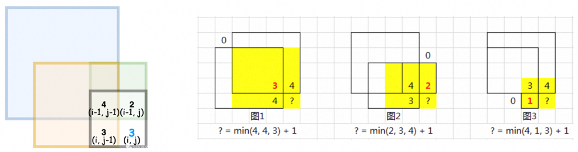

> - 时间复杂度：O(mn)
> - 空间复杂度：O(mn)

```java
public int maximalSquare(char[][] matrix) {
    int m = matrix.length, n = matrix[0].length;
    int[][] dp = new int[m][n];
    for (int j = 0; j < n; j++) {
        dp[0][j] = matrix[0][j] - '0';
    }
    for (int i = 0; i < m; i++) {
        dp[i][0] = matrix[i][0] - '0';
    }
    for (int i = 1; i < m; i++) {
        for (int j = 1; j < n; j++) {
            if (matrix[i][j] == '0')
                dp[i][j] = 0;
            else
                dp[i][j] = Math.min(dp[i-1][j-1], Math.min(dp[i-1][j], dp[i][j-1])) + 1;
        }
    }

    int maxEdge = 0;
    for (int i = 0; i < m; i++) {
        for (int j = 0; j < n; j++) {
            maxEdge = Math.max(maxEdge, dp[i][j]);
        }
    }
    return maxEdge * maxEdge;
}
```

### 6.6、最长公共子串

> https://www.nowcoder.com/practice/f33f5adc55f444baa0e0ca87ad8a6aac  牛客TOP101
>
> 自己做出来的
>
> 定义 dp[i][j]：str1[0...i-1]，str2[0...j-1] 的公共子串长度，参考 LCS 的状态转移方程：

```java
if (str1.charAt(i-1) == str2.charAt(j-1))
    dp[i][j] = dp[i-1][j-1] + 1;
else
    dp[i][j] = 0;
```

> - 时间复杂度：O(n<sup>2</sup>)
> - 空间复杂度：O(n<sup>2</sup>)

```java
public String LCS(String str1, String str2) {
    int m = str1.length(), n = str2.length();
    int[][] dp = new int[m + 1][n + 1];
    int max = -1, maxI = -1;
    for (int i = 1; i <= m; i++) {
        for (int j = 1; j <= n; j++) {
            if (str1.charAt(i - 1) == str2.charAt(j - 1)) {
                dp[i][j] = dp[i - 1][j - 1] + 1;
                if (max < dp[i][j]) {
                    max = dp[i][j];
                    maxI = i;
                }
            } else {
                dp[i][j] = 0;
            }
        }
    }
    return str1.substring(maxI - max, maxI);    // 若只求长度，return max 即可
}
```

### 6.7、正则表达式匹配
> #10：https://leetcode.cn/problems/zheng-ze-biao-da-shi-pi-pei-lcof/  HOT100、剑指Offer19、牛客TOP101
>
> 算法思想：
>
> 设主串 s 长度为 m，模式串 p 长度为 n，定义 dp[i][j] 表示主串前 i 个字符 s[0...i-1] 和模式串前 j 个字符 p[0...j-1] 是否匹配，则：
> 1. 若 p[j-1] 是正常字母，且 s[i-1] == p[j-1]，则 dp[i][j] = dp[i-1][j-1]；
> 2. 若 p[j-1] 是 "."，可以匹配任何字符，则 dp[i][j] = dp[i-1][j-1]；
> 3. 若 p[j-1] 是 "*"，表示 p[j-2] 可以重复 0 次或多次，假设 s[i-1] 是字母 c，p[j-2] 是字母 d：
>    - 若 c ! = d，则不可能匹配，除非 d **重复 0 次**，即 p[j-2] 和 p[j-1] 不要了，p 末尾的 d* 直接扔掉，此时 dp[i][j] = dp[i][j-2]；
>    - 若 c == d (或 d == '.')，若 d **重复 0 次**，则 dp[i][j] = dp[i][j-2]；若 d **重复多次**，dp[i][j] = dp[i-1][j]，为什么？ 如 s = xxxxxa，p = xxxa*，则让 s、p 的末尾分别抵消一个 a，则 s = xxxxx，p 的末尾还是 a\*，即 p = xxxa\*；
>
> 初始条件：
> - 主串为空，模式串为空，则匹配，dp[0][0] = true；
> - 主串不为空，模式串为空，则必然不匹配，dp[1...m][0] = false；
> - 主串为空，模式串不为空，要分情况，如 A= ""，B= a\*b\*c*，也匹配！

> - 时间复杂度：O(mn)
> - 空间复杂度：O(mn)

```java
public boolean isMatch(String s, String p) {
    int m = s.length(), n = p.length();
    boolean[][] dp = new boolean[m + 1][n + 1];
    dp[0][0] = true;
    for (int i = 1; i <= n; i++) {
        if (p.charAt(i - 1) == '*')
            dp[0][i] = dp[0][i - 2];
    }
    for (int i = 1; i <= m; i++) {
        for (int j = 1; j <= n; j++) {
            if (p.charAt(j - 1) != '*') {
                if (s.charAt(i - 1) == p.charAt(j - 1) || p.charAt(j - 1) == '.')
                    dp[i][j] = dp[i - 1][j - 1];
            } else {
                if (s.charAt(i - 1) == p.charAt(j - 2) || p.charAt(j - 2) == '.')
                    dp[i][j] = dp[i][j - 2] || dp[i - 1][j];  // 重复 0 次 || 重复多次
                else  // 重复 0 次
                    dp[i][j] = dp[i][j - 2];
            }
        }
    }
    return dp[m][n];
}
```

## 7、其他问题 ⭐

### 7.1、n 个骰子的点数
> #剑指offer60：https://leetcode-cn.com/problems/nge-tou-zi-de-dian-shu-lcof/  BAT 都考过、阿里把 🎲 换成了扑克
>
> 算法思想：定义 dp[i][j]：i 个 🎲 点数之和为 j 的所有可能的组合数，
>
> 则：dp[i][j] = dp[i-1][j-1] + dp[i-1][j-2] + dp[i-1][j-3] + dp[i-1][j-4] + dp[i-1][j-5] + dp[i-1][j-6]
>
> 初始条件：dp[1][1] = dp[1][2] = dp[1][3] = dp[1][4] = dp[1][5] = dp[1][6] = 1 种
>
> - 时间复杂度：O(n<sup>2</sup>)
> - 空间复杂度：O(n<sup>2</sup>)

```java
public double[] dicesProbability(int n) {
    int[][] dp = new int[n + 1][n * 6 + 1];
    for (int i = 1; i <= 6; i++) dp[1][i] = 1;
    for (int i = 2; i <= n; i++) {
        for (int j = i; j <= i * 6; j++) {
            // 递推公式：
            for (int k = 1; k <= 6; k++) {
                if (j - k <= 0) break;
                dp[i][j] += dp[i-1][j-k];
            }
        }
    }
    double all = Math.pow(6, n);	// n 个 🎲 所有可能的点数
    double[] ans = new double[6 * n - n + 1];
    for(int i = n; i <= 6 * n; i++)
        ans[i-n] = dp[n][i] / all;
    return ans;
}
```

### 7.2、戳气球
> #312：https://leetcode-cn.com/problems/burst-balloons/  HOT100
>
> 算法思想：参考 https://leetcode-cn.com/problems/burst-balloons/solution/zhe-ge-cai-pu-zi-ji-zai-jia-ye-neng-zuo-guan-jian-/
> 1. 定义 dp[i][j]：戳破开区间 (i, j) 内的所有气球能获得的最多硬币，为什么用开区间，因为超出边界后认为是 1，用开区间可以避免处理边界条件！
> 2. 设 k 是 (i, j) 中最后被戳破的气球（最后只剩下 3 个气球 i、k、j），k ∈ (i, j)；
> 3. 戳破最后一个气球 k 所得金币 = nums[i] * nums[k] * nums[j]
> 4. 再加上之前戳破的气球，总的金币 = dp[i][k] + nums[i] * nums[k] * nums[j] + dp[k][j]
> 5. 但是不知道最后戳哪一个气球是最优解，因此要遍历 k ∈ (i, j)
> 6. 即：dp[i][j] = Math.max(dp[i][j], dp[i][k] + nums[i] * nums[k] * nums[j] + dp[k][j])，k ∈ (i, j)

> - 时间复杂度：O(n<sup>3</sup>)
> - 空间复杂度：O(n<sup>2</sup>)

```java
public int maxCoins(int[] nums) {
    int n = nums.length;
    if (n == 0) return 0;
    if (n == 1) return nums[0];
    // max(先戳 nums[0] 再戳 nums[1], 先戳 nums[1] 再戳 nums[0])
    if (n == 2) return Math.max(1 * nums[0] * nums[1] + 1 * nums[1] * 1, nums[0] * nums[1] + 1 * nums[0] * 1);

    // 令 arr[] = {1, nums[], 1}，长 n+2
    int[] arr = new int[n + 2];
    arr[0] = arr[arr.length - 1] = 1;
    for (int i = 1; i < arr.length - 1; i++) {
        arr[i] = nums[i - 1];
    }

    int[][] dp = new int[arr.length][arr.length];
    for (int i = arr.length - 1; i >= 0; i--) {
        for (int j = i + 2; j <= arr.length - 1; j++) {
            for (int k = i + 1; k <= j - 1; k++) {
                dp[i][j] = Math.max(dp[i][j], dp[i][k] + arr[i] * arr[k] * arr[j] + dp[k][j]);
            }
        }
    }
    return dp[0][dp.length - 1];
}
```

### 7.3、圆环回原点
> https://www.nowcoder.com/practice/16409dd00ab24a408ddd0c46e49ddcf8  字节高频题
>
> 查看 CodeTop 所有补充题：https://mp.weixin.qq.com/s/NZPaFsFrTybO3K3s7p7EVg
> 
> 算法思想：和爬楼梯类似，走 n 步到 0 的方案数 = 走 n-1 步到 1 的方案数 + 走 n-1 步到 9 的方案数
> 
> 定义 dp[i][j]: 从 0 点出发走 i 步到 j 点的方案数
>
> - 时间复杂度：O(n)
> - 空间复杂度：O(n)

```java
public int circle(int n) {
    int[][] dp = new int[n + 1][10];
    dp[0][0] = 1;
    for (int i = 1; i <= n; i++) {
        for (int j = 0; j <= 9; j++) {
            dp[i][j] = dp[i-1][(j-1+10) % 10] + dp[i-1][(j+1) % 10];
            dp[i][j] %= Math.pow(10, 9) + 7;
        }
    }
    return dp[n][0];
}
```

## 7.4、高楼扔鸡蛋

> #887：https://leetcode.cn/problems/super-egg-drop/  Google 经典面试题、腾讯、字节、vivo
>
> 算法思想：定义 dp[i][j]：i 层楼 j 个鸡蛋最少需要试的次数，则从第 k 层楼扔时，k ∈ [1, i]：
> - 如果没碎，则鸡蛋数 j 不变，需要继续在 (k, i] 层中试，假设最坏需要试 x 次；
> - 如果碎了，则鸡蛋数 j--，需要继续在 [1, k] 层中试，假设最坏需要试 y 次；
> - 则 dp[i][j] = max(x, y) + 1；

> - 为什么 +1？因为从第 k 层楼扔，已经扔了一次；
> - 为什么取 max？因为要取最坏的情况，如下图：

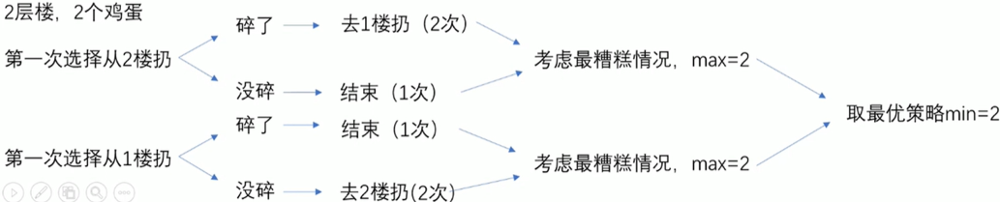

```java
// 时间复杂度：O(floors^2 * eggs)
// 空间复杂度：O(floors * eggs)
public int superEggDrop(int eggs, int floors) {
    int[][] dp = new int[floors + 1][eggs + 1];
    for (int i = 1; i <= floors; i++) {     // i 层楼，只有 1 个鸡蛋，则要试 i 次！
        dp[i][1] = i;
    }
    for (int i = 1; i <= eggs; i++) {		// 1 层楼，i 个鸡蛋，则只需要试 1 次！
        dp[1][i] = 1;
    }
    for (int i = 2; i <= floors; i++) {
        for (int j = 2; j <= eggs; j++) {
            int min = i;
            for (int k = 1; k <= i; k++) {
                //                               没碎             碎了
                min = Math.min(min, Math.max(dp[i - k][j], dp[k - 1][j - 1]) + 1);
            }
            dp[i][j] = min;
        }
    }
    return dp[floors][eggs];
}
```

> 优化：k ∈ [1, i]：随着 k 增大，T1 = dp[k - 1][j - 1] 单调递增，T2 = dp[i - k][j] 单调递减；
>
> k 没必要挨个遍历，可用二分查找，k 每次取 mid！
>
> 注意：T1、T2 的交点即为 min，但交点不一定是整数，可能是小数，如第 5.3 层楼，4.6 个鸡蛋；
>
> 可以用二分查找找到交点附近的整数！

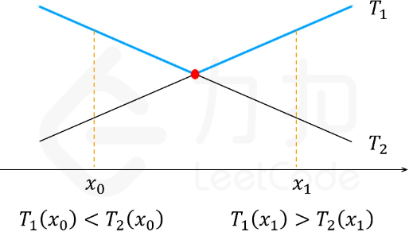

```java
// 时间复杂度：O(floors * log floors * eggs)
// 空间复杂度：O(floors * eggs)
public int superEggDrop(int eggs, int floors) {
    int[][] dp = new int[floors + 1][eggs + 1];
    for (int i = 1; i <= floors; i++) {
        dp[i][1] = i;
    }
    for (int i = 1; i <= eggs; i++) {
        dp[1][i] = 1;
    }
    for (int i = 2; i <= floors; i++) {
        for (int j = 2; j <= eggs; j++) {
            int min = i;
            // 二分查找
            int left = 1, right = i;
            while (left <= right) {
                int mid = left + (right - left) / 2;
                int t1 = dp[mid - 1][j - 1];
                int t2 = dp[i - mid][j];
                if (t1 == t2) {
                    min = t1 + 1;
                    break;
                } else if (t1 > t2) {
                    right = mid - 1;
                    min = Math.min(min, t1 + 1);
                } else {
                    left = mid + 1;
                    min = Math.min(min, t2 + 1);
                }
            }
            dp[i][j] = min;
        }
    }
    return dp[floors][eggs];
}
```

# 十三、贪心算法
> 很多场景并不适用！

> 1. 基本思路
> - 建立数学模型描述问题；
> - 一般结合分治的思想，把求解的问题分成若干个子问题；
> - 对每一子问题求解，得到子问题的**局部最优解**；
> - 把所有子问题的解，即：所有局部最优解，合成最终解（可能并非全局最优，需要无后效性）。
>
> 2. 实现框架
>```java
> 从问题的某一初始解出发；
> while (能朝给定总目标前进一步) { 
>     利用可行的决策，求出可行解的一个解元素；
> }  
> 由所有解元素组合成问题的一个可行解；
>```
>
> 3. 贪心算法存在的问题
> - 不从整体考虑，只考虑眼前，得到**局部最优解**；
> - 要保证最终得到的是**全局最优解**，贪心策略必须具备**无后效性；**
>
> 4. 适用场景
> - 哈夫曼树、哈夫曼编码；
> - 最小生成树(Prim、Kruscal)；
> - 单源最短路径(Dijkstra) 等；
> - 背包问题等。
>
> 5. 【背包问题】
> 
> 物品可以分割成任意大小。要求尽可能让装入背包中的物品总价值最大。直接选单位重量价值最大的物品即可。若题目要求物品 "不能分割"，即：0-1 背包问题，贪心法失效，要用动态规划。

## 1、盛最多水的容器 ⭐
> #11：https://leetcode-cn.com/problems/container-with-most-water/  HOT100

**1、暴力法**
> - 时间复杂度：O(n<sup>2</sup>)
> - 空间复杂度：O(1)

```java
public int maxArea(int[] height) {
    int max = -1;
    int n = height.length;
    for (int i = 0; i < n - 1; i++) {
        for (int j = i + 1; j < n; j++) {
            int w = j - i;
            int h = Math.min(height[i], height[j]);
            max = Math.max(max, w * h);
        }
    }
    return max;
}
```

**2、贪心 + 双指针**
> 算法思想：刚开始双指针分别指向数组头尾，此时容器的底是最大的，接下来随着指针向内移动，会造成容器的底变小，但不管是左指针向右移动一位，还是右指针向左移动一位，容器的底都是一样的，都比原来减少了 1。所以想要让指针移动后的容器面积增大，就要使移动后的容器的高尽量大，所以选择指针所指的高较小的那个指针进行移动。
> - 时间复杂度：O(n)
> - 空间复杂度：O(1)

```java
public int maxArea(int[] height) {
    int max = -1;
    int left = 0, right = height.length - 1;
    while (left < right) {
        int w = right - left;
        int h = Math.min(height[left], height[right]);
        max = Math.max(max, w * h);
        if (height[left] > height[right])
            right--;
        else
            left++;
    }
    return max;
}
```

## 2、最长有效括号 ⭐
> #32：https://leetcode.cn/problems/longest-valid-parentheses/  HOT100
>
> 算法思想：只有一种括号，从前向后遍历，用 open、close 计数，有以下三种情况：
> 1. open == close，则 maxLen = Math.max(maxLen, open * 2)；
> 2. open < close，则括号序列不合法，重新置 0：open = close = 0；
> 3. open > close，如：(()，没法处理；解决办法：反向遍历！
> - 时间复杂度：O(n)
> - 空间复杂度：O(1)

```java
public int longestValidParentheses(String s) {
    int maxLen = 0;
    int open = 0, close = 0;
    for (int i = 0; i < s.length(); i++) {
        if (s.charAt(i) == '(') open++;
        else close++;
        if (open == close)
            maxLen = Math.max(maxLen, open * 2);
        else if (close > open)
            open = close = 0;
    }

    open = close = 0;
    for (int i = s.length() - 1; i >= 0; i--) {
        if (s.charAt(i) == '(') open++;
        else close++;
        if (open == close)
            maxLen = Math.max(maxLen, open * 2);
        else if (close < open)
            open = close = 0;
    }
    return maxLen;
}
```

## 3、分发糖果 ⭐
> #135：https://leetcode.cn/problems/candy/  牛客TOP101、字节
>
> 算法思想：必须采用两次贪心，如果一次遍历想要兼顾两边，则会顾此失彼！初始时每个人都分一个糖果；
>
> 贪心1：从左到右遍历，遇到更大的元素则糖果 + 1；
>
> 贪心2：从右到左遍历，遇到更大的元素则糖果 + 1；
>
> 两次遍历的结果取最大值，就能同时满足左规则和右规则！
>
> - 时间复杂度：O(n)
> - 空间复杂度：O(n)

```java
public int candy(int[] ratings) {
    int n = ratings.length;
    int[] left = new int[n];
    int[] right = new int[n];
    Arrays.fill(left, 1);
    Arrays.fill(right, 1);
    for (int i = 1; i < n; i++) {
        if (ratings[i] > ratings[i - 1]) left[i] = left[i - 1] + 1;
    }
    for (int i = n - 2; i >= 0; i--) {
        if (ratings[i] > ratings[i + 1]) right[i] = right[i + 1] + 1;
    }
    int sum = 0;
    for (int i = 0; i < n; i++) {
        sum += Math.max(left[i], right[i]);
    }
    return sum;
}
```

> 将数组改成环：字节 (改成了给员工发奖品)、网易、华为面试

```java
public int candy(int[] ratings) {
    int n = ratings.length;
    int[] left = new int[n];
    int[] right = new int[n];
    Arrays.fill(left, 1);
    Arrays.fill(right, 1);
    for (int i = 1; i < n; i++) {
        if (ratings[i] > ratings[i - 1]) left[i] = left[i - 1] + 1;
    }
    for (int i = n - 2; i >= 0; i--) {
        if (ratings[i] > ratings[i + 1]) right[i] = right[i + 1] + 1;
    }
    // 单独处理头尾
    // 头比尾大，头元素 = 尾元素 + 1，头元素变大了，若第二个元素比头元素大，则第二个元素也要更新
    if (ratings[0] > ratings[n - 1]) left[0] = left[n - 1] + 1;
    for (int i = 1; i < n; i++) {
        if (ratings[i] > ratings[i - 1]) left[i] = left[i - 1] + 1;
    }
    // 同理
    if (ratings[n - 1] > ratings[0]) right[n - 1] = right[0] + 1;
    for (int i = n - 2; i >= 0; i--) {
        if (ratings[i] > ratings[i + 1]) right[i] = right[i + 1] + 1;
    }

    int sum = 0;
    for (int i = 0; i < n; i++) {
        sum += Math.max(left[i], right[i]);
    }
    return sum;
}
```

## 4、区间问题

### 4.1、合并区间（并集） ⭐
> #56：https://leetcode-cn.com/problems/merge-intervals/  HOT100、字节、腾讯、百度、美团
>
> 算法思想：要判断两个区间 [a1, b1], [a2, b2] 是否可合并，其实就是判断是否有 a1 <= a2 <= b1 或 a2 <= a1 <= b2。即：若某个子区间的左边界在另一子区间内，则它们可以合并，先将所有子区间按左边界排序：
> - 时间复杂度：O(n log n)
> - 空间复杂度：O(n)

```java
public int[][] merge(int[][] intervals) {
    Arrays.sort(intervals, (o1, o2) -> o1[0] - o2[0]);    // 所有子区间按左边界排序
    List<int[]> list = new ArrayList<>();
    list.add(intervals[0]);
    for (int i = 1; i < intervals.length; i++) {
        int[] pre  = list.get(list.size() - 1);
        int[] cur  = intervals[i];
        int start1 = pre[0], end1 = pre[1];
        int start2 = cur[0], end2 = cur[1];
        if (end1 >= start2) {   // [start1, end1]、[start2, end2] 可合并为 [start1, max(end1, end2)]
            list.get(list.size() - 1)[1] = Math.max(end1, end2);
        } else {
            list.add(cur);
        }
    }
    return list.toArray(new int[0][]);
}
```

### 4.2、用最少数量的箭引爆气球（交集）
> #452：https://leetcode.cn/problems/minimum-number-of-arrows-to-burst-balloons/  一次 AC
> - 时间复杂度：O(n log n)
> - 空间复杂度：O(log n)
```java
public int findMinArrowShots(int[][] points) {
    int cnt = 1;
    Arrays.sort(points, (o1, o2) -> o1[0] != o2[0] ? Integer.compare(o1[0], o2[0]) : Integer.compare(o1[1], o2[1]));
    int[] pre = points[0];
    for (int i = 1; i < points.length; i++) {
        int[] cur  = points[i];
        int start1 = pre[0], end1 = pre[1];
        int start2 = cur[0], end2 = cur[1];
        if (end1 >= start2) {    // 求交集
            pre[0] = Math.max(start1, start2);
            pre[1] = Math.min(end1, end2);
        } else {
            pre = cur;
            cnt++;
        }
    }
    return cnt;
}
```

### 4.3、无重叠区间
> #435：https://leetcode.cn/problems/non-overlapping-intervals/  一次没做出来，用上一题代码！
> - 时间复杂度：O(n log n)
> - 空间复杂度：O(log n)
```java
public int eraseOverlapIntervals(int[][] intervals) {
    int cnt = 1;
    Arrays.sort(intervals, (o1, o2) -> o1[0] != o2[0] ? Integer.compare(o1[0], o2[0]) : Integer.compare(o1[1], o2[1]));
    int[] pre = intervals[0];
    for (int i = 1; i < intervals.length; i++) {
        int[] cur  = intervals[i];
        int start1 = pre[0], end1 = pre[1];
        int start2 = cur[0], end2 = cur[1];
        if (end1 > start2) {    // 求交集，[1, 2] 和 [2, 3] 不算重叠
            pre[0] = Math.max(start1, start2);
            pre[1] = Math.min(end1, end2);
        } else {
            pre = cur;
            cnt++;
        }
    }
    return intervals.length - cnt;
}
```

## 5、摆动序列
> #376：https://leetcode.cn/problems/wiggle-subsequence/
>
> 算法思想：遇到连续上升或连续下降的节点时，不考虑这些节点！
> - 时间复杂度：O(n)
> - 空间复杂度：O(1)

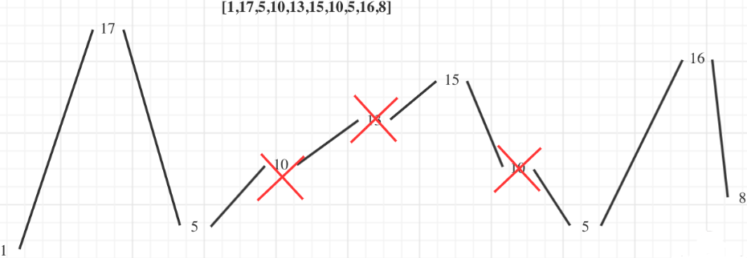

```java
public int wiggleMaxLength(int[] nums) {
    if (nums.length <= 1) return nums.length;
    int curDiff = 0;  // 当前差值
    int preDiff = 0;  // 上一个差值
    int cnt = 1;
    for (int i = 1; i < nums.length; i++) {
        curDiff = nums[i] - nums[i - 1];
        if (curDiff == 0 || curDiff < 0 && preDiff < 0 || curDiff > 0 && preDiff > 0) continue;
        // 如果当前差值和上一个差值为一正一负
        cnt++;
        preDiff = curDiff;
    }
    return cnt;
}
```

## 6、跳跃游戏 ⭐
> #55：https://leetcode-cn.com/problems/jump-game/  HOT100
>
> 算法思想：从左到右遍历，则当前能跳的最远的位置为 right = i + nums[i]，不断的更新最远距离 right，最终若 right >= nums.length - 1，则成功！
> - 时间复杂度：O(n)
> - 空间复杂度：O(1)

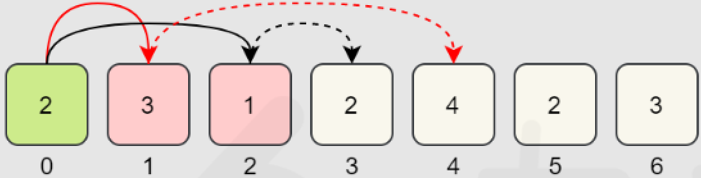

```java
public boolean canJump(int[] nums) {
    int right = 0;
    for (int i = 0; i < nums.length; i++) {
        if (i > right) return false;    // 当前位置 > 能跳到的最远的位置，即：跳不到当前位置！
        right = Math.max(right, i + nums[i]);
    }
    return true;
}
```

## 8、跳跃游戏II
> #45：https://leetcode-cn.com/problems/jump-game-ii/

**1、反向跳跃**

> 算法思想：利用上一题的算法思想，设最后一步是从元素 A 跳到最后一个元素，怎么找到元素 A？
>
> 【只经过一步就能跳到最后元素】的元素可能有多个，根据贪心思想，取这些元素中最左的为 A！
>
> - 时间复杂度：O(n<sup>2</sup>)
> - 空间复杂度：O(1)

```java
public int jump(int[] nums) {
    int right = nums.length - 1;
    int step = 0;
    while (right > 0) {
        // 从左向右遍历，第一个能跳到 right 的元素就是【所有经过一步就能跳到 right 的元素中】最左的元素
        for (int i = 0; i < nums.length; i++) {
            if (i + nums[i] >= right) {
                right = i;
                step++;
                break;
            }
        }
    }
    return step;
}
```

**2、正向跳跃**
> 算法思想：从左到右遍历，每次都跳到最远，肯定不满足全局最优，那就多考虑一次，把下次也考虑上！下次跳的最远时的跳跃起点，就是这次跳跃的终点！
> - 时间复杂度：O(n)
> - 空间复杂度：O(1)

```java
public int jump(int[] nums) {
    int step = 0;
    for (int i = 0; i < nums.length - 1; ) {	// 不要 i++
        int right = i + nums[i];         		// 当前能跳到的最远位置
        if (right >= nums.length - 1) return step + 1;  // 如果能跳到最后一个元素，结束
        // 否则，筛选下一个跳跃元素
        int nxtMaxIdx = 0;
        for (int j = i + 1; j <= i + nums[i] && j < nums.length; j++) {
            if (j + nums[j] > right) {  	   // 跳的更远，则更新
                right = j + nums[j];
                nxtMaxIdx = j;
            }
        }
        i = nxtMaxIdx;  				 	   // 下次跳的最远时的跳跃起点，就是这次跳跃的终点
        step++;
    }
    return step;
}
```

## 9、加油站
> #134：https://leetcode.cn/problems/gas-station/

**1、暴力法**
> 算法思想：依次尝试以每个站作为起点，看能否完成绕行；
> - 时间复杂度：O(n<sup>2</sup>)
> - 空间复杂度：O(1)

**2、贪心**
> 算法思想：
> 1. 若 sum(gas[]) < sum(cost[])，则不可能走完一圈，否则一定能走完一圈！
> 2. 如果 sum(gas[0...i]) < sum(cost[0...i])，则区间 [0...i] 都不能作为起点，只能从 [i+1...end] 继续找起点；
> 3. 因为 sum(gas[0...i]) - sum(cost[0...i]) < 0，且 sum(gas[]) > sum(cost[])，所以 sum(gas[i+1...end]) - sum(cost[i+1...end]) > 0；
> 4. 因此区间 [i+1...end] 多出的油一定能够弥补区间 [0...i] 缺的油，可以绕一圈。
> - 时间复杂度：O(n)
> - 空间复杂度：O(1)

```java
public int canCompleteCircuit(int[] gas, int[] cost) {
    int curSum = 0, totalSum = 0, start = 0;
    for (int i = 0; i < gas.length; i++) {
        curSum += gas[i] - cost[i];
        totalSum += gas[i] - cost[i];
        if (curSum < 0) {
            curSum = 0;
            start = i + 1;
        }
    }
    return totalSum < 0 ? -1 : start;
}
```

## 10、单调递增的数字
> #738：https://leetcode.cn/problems/monotone-increasing-digits/
>
> 算法思想：如 332，从后向前遍历，3 > 2，则把 2 变为 9，把 3 减一变为 2，即：332 -> 329 -> 299！
> - 时间复杂度：O(log n)，数字 n 的位数为 log<sub>10</sub> n
> - 空间复杂度：O(log n)

```java
public int monotoneIncreasingDigits(int n) {
    char[] chars = String.valueOf(n).toCharArray();
    int start = chars.length;
    for (int i = chars.length - 2; i >= 0; i--) {
        if (chars[i] > chars[i + 1]) {
            // chars[i + 1] = '9';
            chars[i]--;
            start = i + 1;
        }
    }
    for (int i = start; i < chars.length; i++) {
        chars[i] = '9';
    }
    return Integer.parseInt(new String(chars));
}
```

## 11、任务调度器 ⭐
> #621：https://leetcode-cn.com/problems/task-scheduler/  HOT100
> - 时间复杂度：O(n)
> - 空间复杂度：O(1)
```java
public int leastInterval(char[] tasks, int n) {
    // 统计每一个任务的个数，并找出个数最多的任务
    int[] nums = new int[26];
    for (char c : tasks) {
        nums[c - 'A']++;
    }
    int max = Arrays.stream(nums).max().getAsInt();
    // 假设个数最多的任务为 A，有 3 个，n = 2，则最小长度为 7：Axx Axx A
    int mixLen = (max - 1) * (n + 1) + 1;
    // 如果 B 的个数和 A 一样多，则最小长度为 8：ABx ABx AB
    int maxCnt = 0;
    for (int i : nums) {
        if (i == max) maxCnt++;
    }
    mixLen += maxCnt - 1;
    // 剩下的任务往 x 处填就行，x 之间的距离 >= n，不用冷却，所以 minLen 不变
    // 若 x 被填完了，如：ABC ABC AB，要填任务 D
    // 则直接填在一组的后面即可，如：ABCD ABCD AB，但此时 minLen 怎么算？
    // 不用算，因为就是 task.length！
    return Math.max(mixLen, tasks.length);
}
```

## 12、划分字母区间
> #763：https://leetcode.cn/problems/partition-labels/  字节
> - 时间复杂度：O(n)
> - 空间复杂度：O(26)
```java
public List<Integer> partitionLabels(String s) {
    List<Integer> list = new ArrayList<>();
    int n = s.length();
    Map<Character, Integer> map = new HashMap<>();
    for (int i = 0; i < n; i++) {
        map.put(s.charAt(i), i);
    }
    for (int i = 0; i < n; ) {
        int lastIdx = map.get(s.charAt(i));
        for (int j = i + 1; j < lastIdx; j++) {
            lastIdx = Math.max(lastIdx, map.get(s.charAt(j)));
        }
        list.add(lastIdx - i + 1);
        i = lastIdx + 1;
    }
    return list;
}

```

# 十四、位运算和数学方法
> <font color=red>**若题目要求不能使用额外空间，往往要用到位运算。**</font>

## 1、只出现一次的数字 ⭐
> #136：https://leetcode-cn.com/problems/single-number/  HOT100
>
> 算法思想：a ⊕ a = 0，a ⊕ 0 = a，异或运算满足交换律和结合律。将所有的数进行异或运算，就能得到解。
> - 时间复杂度：O(n)
> - 空间复杂度：O(1)

```java
public int singleNumber(int[] nums) {
    int res = 0;
    for (int num : nums) {
        res ^= num;
    }
    return res;
}
```

> 进阶：有序数组中的单一元素
>
> #540：https://leetcode.cn/problems/single-element-in-a-sorted-array/  自己做出来的
>
> 算法思想：由题知：nums.length 一定是奇数，找规律：
> 1. 单一元素在 mid 左边，如：[1, 1, 2, 3, 3, 4, 4]，找到 nums[mid] 所在的一对元素，即 <3, 3>，发现两者的下标分别为奇、偶！
> 2. 单一元素在 mid 右边，如：[1, 1, 2, 2, 3, 4, 4]，找到 nums[mid] 所在的一对元素，即 <2, 2>，发现两者的下标分别为偶、奇！
>
> - 时间复杂度：O(logn)
> - 空间复杂度：O(1)

```java
public int singleNonDuplicate(int[] nums) {
    int left = 0, right = nums.length - 1;
    while (left <= right) {
        int mid = left + (right - left) / 2;
        if (mid + 1 < nums.length && nums[mid] == nums[mid + 1] && mid % 2 == 0 || 
            mid - 1 >= 0 && nums[mid] == nums[mid - 1] && (mid - 1) % 2 == 0) {
            left = mid + 1;
        } else if (mid + 1 < nums.length && nums[mid] == nums[mid + 1] && mid % 2 == 1 || 
                   mid - 1 >= 0 && nums[mid] == nums[mid - 1] && (mid - 1) % 2 == 1) {
            right = mid - 1;
        } else {
            return nums[mid];
        }
    }
    return -1;
}
```

## 2、2 的幂
> #231：https://leetcode-cn.com/problems/power-of-two/

**1、除 2 判余**

> - 时间复杂度：O(log n)
> - 空间复杂度：O(1)

```java
public boolean isPowerOfTwo(int n) {
    if (n <= 0) return false;
    if (n == 1) return true;
    while (n % 2 == 0) {
        n /= 2;
    }
    return n == 1;
}
```

**2、位运算**
> - 时间复杂度：O(1)
> - 空间复杂度：O(1)
```java
// 若一个数是 2 的幂，则其二进制只有一个 1
// 法1：
public boolean isPowerOfTwo(int n) {
    if (n <= 0) return false;
    return Integer.bitCount(n) == 1;	
}

// Integer.bitCount() 可用 Integer.toBinaryString() 实现！
public boolean isPowerOfTwo(int n) {
    if (n <= 0) return false;
    String s = Integer.toBinaryString(n);
    int cnt = 0;
    for (int i = 0; i < s.length(); i++) {
        if (s.charAt(i) == '1') cnt++;
    }
    return cnt == 1;
}

// 法2：
public boolean isPowerOfTwo(int n) {
    if (n <= 0) return false;
    return (n & (n-1)) == 0;
}

// 法3：
public boolean isPowerOfTwo(int n){
    if (n <= 0) return false;
    return (n & -n) == n;
}
```

## 3、汉明距离 ⭐
> #461：https://leetcode-cn.com/problems/hamming-distance/  HOT100
> - 时间复杂度：O(1)
> - 空间复杂度：O(1)
```java
// 法1：
public int hammingDistance(int x, int y) {
    return Integer.bitCount(x ^ y);
}

// 法2：
public int hammingDistance(int x, int y) {
    int cnt = 0;
    int z = x ^ y;
    while (z != 0) {
        if ((z & 1) == 1)
            cnt++;
        z >>>= 1;
    }
    return cnt;
}

// 法3：快速移位
public int hammingDistance(int x, int y) {
    int cnt = 0;
    int z = x ^ y;
    // 快速右移，跳过最后一个1之后的所有0
    while (z != 0) {
        z &= z - 1;
        cnt++;
    }
    return cnt;
}
```

## 4、Pow(x, n) ⭐
> #50：https://leetcode-cn.com/problems/shu-zhi-de-zheng-shu-ci-fang-lcof/  剑指offer16
> 算法思想：快速幂
> - x<sup>n</sup> = x<sup>n/2</sup> * x<sup>n/2</sup>，n 为偶数
> - x<sup>n</sup> = x * x<sup>(n-1)/2</sup> * x<sup>(n-1)/2</sup>，n 为奇数
```java
// 时间复杂度：O(log n)
public double myPow(double x, int n) {
    if(n == 0) return 1;
    if(n == 1) return x;
    if(n == -1) return 1 / x;
    double half = myPow(x, n / 2);
    double mod = myPow(x, n % 2);
    return half * half * mod;
}
```

## 5、数组中数字出现的次数 ⭐
> #剑指offer56-I：https://leetcode-cn.com/problems/shu-zu-zhong-shu-zi-chu-xian-de-ci-shu-lcof/  牛客TOP101
>
> 算法思想：从时空复杂度的要求来看，铁定用异或！
> 1. 设两个不同的目标数分别为 a、b，则 XOR(nums[]) = a ^ b！
> 2. 设 XOR(nums[]) = 10010，则说明 a、b 从右到左第 2 位是不一样的，如：a = * * * 1 *、b = * * * 0 *；
> 3. 将 nums[] 划分为两个子数组，其中 nums1[] 的元素都形如 * * * 1 *，nums2[] 的元素都形如 * * * 0 *；
> 4. 即：将两个不同的数 a、b 分别划分到两个子数组中，分别对两个子数组中的所有元素求异或，则结果就是 a、b！
>
> - 时间复杂度：O(n)
> - 空间复杂度：O(1)

```java
public int[] singleNumbers(int[] nums) {
    int ret = 0;        // 为什么取 0？因为 0 ^ x = x
    for (int num : nums) {
        ret ^= num;
    }

    int div = 0;
    while (ret > 0) {	// 从右到左找第一个为 1 的数位
        if ((ret & 1) == 1) break;
        ret >>= 1;
        div++;
    }
    int a = 0, b = 0;
    for (int num : nums) {
        if (((num >> div) & 1) == 0)
            a ^= num;
        else
            b ^= num;
    }
    return new int[]{a, b};
}
```

> #剑指offer56-II：https://leetcode-cn.com/problems/shu-zu-zhong-shu-zi-chu-xian-de-ci-shu-ii-lcof/
>
> 算法思想：如 nums[] = [3, 4, 3, 3, 2, 2, 2]，设所求元素为 x，
> 1. 2 = 0010，3 = 0011，4 = 0100，所有元素对应位相加得：0163；
> 2. 从右到左第 1、2 位都能被 3 整除，说明 x = **00；
> 3. 从右到左第 3 位不能被 3 整除，说明 x = *100；
> 4. 从右到左第 4 位能被 3 整除，说明 x = 0100，即 x = 4！
>
> - 时间复杂度：O(n)
> - 空间复杂度：O(1)

```java
public int singleNumber(int[] nums) {
    int[] arr = new int[32];  // 题目规定 num 不超过 32 位
    for (int num : nums) {
        for (int i = 0; i < 32; i++) {
            // num 从低位到高位依次 & 1
            arr[i] += (num >> i) & 1;	
        }
    }
    int ret = 0;
    for (int i = 0; i < 32; i++) {
        ret |= (arr[i] % 3) << i;
    }
    return ret;
}
```

## 6、数字 1 的个数 ⭐

### 6.1、十进制数：1 的个数

> #233：https://leetcode-cn.com/problems/number-of-digit-one/  剑指offer43、这种找规律的数学题不重要？
>
> 算法思想：如 2304，答案为四个部分之和：
> 1. 所有 <= 2304 的正整数中，个位出现 1 的次数；
> 2. 所有 <= 2304 的正整数中，十位出现 1 的次数；
> 3. 所有 <= 2304 的正整数中，百位出现 1 的次数；
> 4. 所有 <= 2304 的正整数中，千位出现 1 的次数。
>
> 设 n = leftNum + digit + rightNum，其中 digit 为当前数位，假设求十位出现 1 的个数：
> 1. 若十位为 0，如 n = 2304：
>    - 锁定十位为 1，即 \*\*1*，则所有 <= 2304 的整数为 [0010, 2219]，即十位出现 1 的次数为 229 - 000 + 1 = 230 次；
>    - 计算公式：leftNum * 10 = 23 * 10 = 230；
> 2. 若十位为 1，如 n = 2314：
>    - 锁定十位为 1，即 \*\*1*，则所有 <= 2314 的整数为 [0010, 2314]，即十位出现 1 的次数为 234 - 000 + 1 = 235 次；
>    - 计算公式：leftNum *10 + rightNum + 1 = 23 * 10 + 4 + 1 = 235；
> 3. 若十位为 [2, 9]，如 n = 2324：
>    - 锁定十位为 1，即 \*\*1*，则所有 <= 2324 的整数为 [0010, 2319]，即十位出现 1 的次数为 239 - 000 + 1 = 240 次；
>    - 计算公式：(leftNum + 1) * 10 = (23 + 1) * 10 = 240；
>
> 这里 n = 2304，所以取第 1 种情况，其他位同理。

```java
public int countDigitOne(int n) {
    String s = String.valueOf(n);
    int len = s.length();
    int[] arr = new int[len];   // 分别保存 个、十、百、千位...上 1 的个数
    int i = 1;
    while (i <= len) {
        char c = s.charAt(len - i);
        int digit = c - '0';    // 分别为 个、十、百、千位...上的数字

        // 若 digit 是十位，则 leftNum 是十位左边的所有数，即：万千百位
        // 若 digit 是十位，则 rightNum 是十位右边的所有数，即：个位
        int leftNum = 0, rightNum = 0;
        String leftString = s.substring(0, len - i);
        if (leftString.length() > 0)
            leftNum = Integer.parseInt(leftString);
        String rightString = s.substring(len - i + 1, len);
        if (rightString.length() > 0)
            rightNum = Integer.parseInt(rightString);

        if (digit == 0)
            arr[len - i] = leftNum * (int)Math.pow(10, i-1);
        else if (digit == 1)
            arr[len - i] = leftNum * (int)Math.pow(10, i-1) + rightNum + 1;
        else
            arr[len - i] = (leftNum + 1) * (int)Math.pow(10, i-1);
        i++;
    }
    int sum = 0;
    for (int num : arr) sum += num;
    return sum;
}
```

### 6.2、二进制数：1 的个数
> #338：https://leetcode.cn/problems/w3tCBm/  HOT100、剑指 Offer Ⅱ 003
>
> 算法思想：
> 1. 若 i 为偶数，则其二进制中 1 的个数和 i / 2 相同；
> 2. 若 i 为奇数，则其二进制中 1 的个数比 i / 2 多一个；
>
> - 时间复杂度：O(n)
> - 空间复杂度：O(n)

```java
public int[] countBits(int n) {
    if (n == 0) return new int[]{0};
    if (n == 1) return new int[]{0, 1};
    if (n == 2) return new int[]{0, 1, 1};
    int[] dp = new int[n + 1];
    dp[1] = 1;
    dp[2] = 1;
    for (int i = 3; i <= n; i++) {
        dp[i] = dp[i / 2] + (i % 2);
    }
    return dp;
}
```

### 6.3、阶乘末尾 0 的个数
> #172：https://leetcode.cn/problems/factorial-trailing-zeroes/
>
> 算法思想：0 的个数取决于 5 的个数，因为只有 5 和 2 才能造出 0，但 5 比 2 少，如：
>
> 11! = 11 * 10 * 9 * 8 * 7 * 6 * 5 * 4 * 3 * 2 * 1
>
>  = 11 * (2 * 5) * 9 * (2 * 2 * 2) * 7 * (3 * 2) * (1 * 5) * (2 * 2) * 3 * (1 * 2) * 1，因子中有 2 个 5，所以阶乘末尾有 2 个 0；
>
> 再如：31 中 5 的个数：【5, 10, 15, 20, 25, 30】=【1 * 5, 2 * 5, 3 * 5, 4 * 5, 5 * 5, 6 * 5】，提供了 6 个 5？
> 
> 不对，25 = 5 * 5，提供 2 个，因此一共是 7 个 5；同理 125 = 5 * 5 * 5 能提供 3 个 5；
>
> 31 中 5 的个数 = 31 / 5 + 31 / 25 = 7 个！

```java
public int trailingZeroes(int n) {
    return n/5 + n/25 + n/125 + n/625 + n/3125 + .... ;
}
// 等价于以下代码：
// 第一次循环求 n/25，第二次循环求 n/25 ......
public int trailingZeroes(int n) {
    int cnt = 0;
    while (n != 0) {
        n /= 5;
        cnt += n;
    }
    return cnt;
}
```

## 7、第 N 位数字 ⭐
> #400：https://leetcode-cn.com/problems/nth-digit/  剑指offer44、这种找规律的数学题不重要？
```java
/*  数字范围    数量   位数   占多少位
    1-9        9      1     9
    10-99      90     2     180
    100-999    900    3     2700
    1000-9999  9000   4     36000

    例如 n = 2901 = 9 + 180 + 2700 + 12，即一定是 4 位数的第 12 位，即 "1000 1001 1002"
    对应的数字为 1000 + (12 - 1) / 4 = 1000 + 2 = 1002
    到底是 1002 中的哪一位？(12 - 1) % 4 = 3，"1002".charAt(3) = 2;
*/

public int findNthDigit(int n) {
    long rangeLeft = 1, rangeRight = 9;
    int count = 9;
    int bit = 1;
    long rangeBit = count * bit;

    while (n > rangeBit) {
        n -= rangeBit;

        rangeLeft *= 10;
        rangeRight = rangeRight * 10 + 9;
        count *= 10;
        bit++;
        rangeBit = (long) count * bit;
    }
    long num = rangeLeft + (n - 1) / bit;
    return String.valueOf(num).charAt((n - 1) % bit) - '0';
}
```

## 8、丑数 ⭐
> #263：https://leetcode-cn.com/problems/ugly-number/
>
> 判断 n 是否为丑数：当 n > 0 时，若 n 是丑数，则 n 可以写成 n = 2<sup>i</sup> * 3<sup>j</sup> * 5<sup>k</sup> 的形式，其中 i、j、k 均 >= 0。
> - 时间复杂度：O(log n)
> - 空间复杂度：O(1)

```java
public boolean isUgly(int n) {
    if (n <= 0) return false;
    while (n % 2 == 0) n /= 2;
    while (n % 3 == 0) n /= 3;
    while (n % 5 == 0) n /= 5;
    return n == 1;
}
```

> #264：https://leetcode-cn.com/problems/ugly-number-ii/  剑指offer49
>
> 暴力法：时间复杂度 O(n × log n)
>
> 三指针法：由前面可知，丑数可写成 2<sup>i</sup> * 3<sup>j</sup> * 5<sup>k</sup> 的形式，假设所有丑数升序组成 ugly[] = {1, 2, 3, 4, 5, 6, 8, 9, 10, 12, ... }，设：
>
> ```java
> A[] = ugly * 2 = {1*2, 2*2, 3*2, 4*2, 5*2, 6*2, 8*2, 9*2, 10*2, 12*2, ...}
> B[] = ugly * 3 = {1*3, 2*3, 3*3, 4*3, 5*3, 6*3, 8*3, 9*3, 10*3, 12*3, ...}
> C[] = ugly * 5 = {1*5, 2*5, 3*5, 4*5, 5*5, 6*5, 8*5, 9*5, 10*5, 12*5, ...}
> ```
>
> 如何求第 n 个丑数？只需将三个数组 A[]、B[]、C[] 合并成一个升序的数组 ugly[] 并去重，则 ugly[n-1] 即为所求！
>
> 但问题是我们并不知道丑数数组 ugly[] 具体有哪些元素，怎么办？一边合并 A[]、B[]、C[]，一边求 ugly[]！
>
> - 时间复杂度：O(n)
> - 空间复杂度：O(n)

```java
public int nthUglyNumber(int n) {
    int[] ugly = new int[n];
    ugly[0] = 1;    // 第一个丑数是 1
    int p2 = 0, p3 = 0, p5 = 0;
    for (int i = 1; i < n; i++) {
        ugly[i] = Math.min(ugly[p2] * 2, Math.min(ugly[p3] * 3, ugly[p5] * 5));
        if (ugly[i] == ugly[p2] * 2) p2++;    // 去重
        if (ugly[i] == ugly[p3] * 3) p3++;    // 去重
        if (ugly[i] == ugly[p5] * 5) p5++;    // 去重
    }
    return ugly[n - 1];
}
```

## 9、圆圈中最后剩下的数字 ⭐
> #剑指offer62：https://leetcode-cn.com/problems/yuan-quan-zhong-zui-hou-sheng-xia-de-shu-zi-lcof/  约瑟夫环问题

**9.1、暴力模拟**
> - 时间复杂度：O(n<sup>2</sup>)
> - 空间复杂度：O(n)
```java
public int lastRemaining(int n, int m) {
    List<Integer> list = new ArrayList<>();
    for (int i = 0; i < n; i++) {
        list.add(i);
    }
    int start = 0;
    while (list.size() != 1) {
        int index = (start + m - 1) % list.size();
        list.remove(index);
        start = index;
    }
    return list.get(0);
}
```

**9.2、数学法**
> - 时间复杂度：O(n)
> - 空间复杂度：O(1)
```java
/*
最后只剩下一个元素，假设该元素为 num，该元素的下标为 0 (因为最后只剩这一个元素)，
如果我们可以推出 num 在上一轮中的下标，进而再推出 num 在上上一轮的下标，
直到推出 num 在第一轮中的下标，那么就可以根据这个下标获取到最终的元素了。推断过程如下：

最后一轮中 num 的下标是 0；
那上一轮应该有 2 个元素，此轮次中 num 的下标为 (0 + m) % n = (0 + 3) % 2 = 1，说明这一轮删除之前 num 的下标为 1
再上一轮应该有 3 个元素，此轮次中 num 的下标为 (1 + 3) % 3 = 1，说明这一轮某元素被删除之前 num 的下标为 1
再上一轮应该有 4 个元素，此轮次中 num 的下标为 (1 + 3) % 4 = 0，说明这一轮某元素被删除之前 num 的下标为 0
再上一轮应该有 5 个元素，此轮次中 num 的下标为 (0 + 3) % 5 = 3，说明这一轮某元素被删除之前 num 的下标为 3
....
由于数字是从 0 ~ n-1，所以元素在第一轮中的下标，就等于元素本身

*/
public int lastRemaining(int n, int m) {
    int cur = 0;
    for (int i = 2; i <= n; i++)	// 最后一轮剩下2个人，所以从2开始反推
        cur = (cur + m) % i;
    return cur;
}
```

## 10、不用加减乘除做加法
> #剑指offer65：https://leetcode-cn.com/problems/bu-yong-jia-jian-cheng-chu-zuo-jia-fa-lcof/
>
> 腾讯二面，这题还是背下来吧...
> - ^：1^1=0，0^0=0，1^0=1；相当于无进位的求和；
> - &：1&1=1，1&0=0，0&0=0；相当于求进位位；
> - 故 a + b = (a^b) + ((a&b)<<1)；
> - 如 1 + 1：
>   - 无进位的求和：1^1=0；
>   - 进位位：1&1=1；
>   - 0 + (1 << 1) = 2。

```java
public int add(int a, int b) {
    if (a == 0) return b;
    if (b == 0) return a; 
    return add(a^b, (a&b) << 1);    // 不断重复这个过程，直到进位位为 0
}
```

## 11、c 的平方根 ⭐
> #69：https://leetcode.cn/problems/sqrtx/

**1、二分查找**
> - 时间复杂度：O(log c)
> - 空间复杂度：O(1)

```java
public int mySqrt(int c) {
    if (c == 0) return 0;
    long left = 1;
    long right = c;
    while (left < right) {
        long mid = left + (right - left + 1) / 2;
        if (mid * mid <= c)
            left = mid;
        else
            right = mid - 1;
    }
    return (int) left;
}
```

**2、牛顿迭代法**
> 算法思想：设 x 接近于 √c 的值，怎么求 x？求 f(x) = x<sup>2</sup> - c = 0 的解即可！
> 1. 随便取一个初始值，只要初始值在正根的右边即可，假设取 x = x<sub>0</sub>；
> 2. 在 (x<sub>0</sub>, f(x<sub>0</sub>)) 处做切线，y - f(x<sub>0</sub>) = k (x - x<sub>0</sub>)，其中 k = f'(x<sub>0</sub>) = 2x<sub>0</sub>，则切线方程：y - (x<sub>0</sub><sup>2</sup> - c) = 2x<sub>0</sub>(x - x<sub>0</sub>)；
> 3. 计算切线与 x 轴的交点：取 y = 0，则 x = (x<sub>0</sub> + c/x<sub>0</sub>) / 2，即 x<sub>1</sub>；
> 4. 将 x<sub>0</sub> 迭代到 x<sub>1</sub>；同理，继续迭代，最终 x 会趋近于真实值！

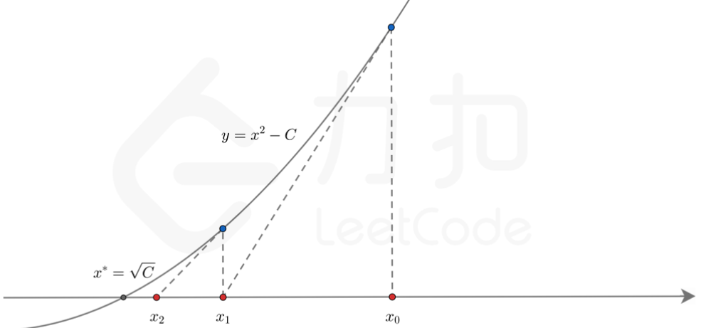

> - 时间复杂度：O(log c)，但比二分查找快！
> - 空间复杂度：O(1)

```java
public int mySqrt(int c) {
    if (c == 0) return 0;
    double x0 = c;
    double x1;
    while (true) {
        x1 = (x0 + c / x0) / 2;
        if (x0 - x1 < 1e-7) break;   // 当 x 与正确答案的误差小于 10^-7 时，返回；常考：结果必须在指定精度范围内
        x0 = x1;
    }
    return (int) x1;
}
```

## 12、用 Rand7 实现 Rand10
> #470：https://leetcode.cn/problems/implement-rand10-using-rand7/
>
> 算法思想：设 randX() 等概率生成 [1, X] 的随机数，则
>
> **(randX() - 1) * Y + randY()** 可以等概率的生成 [1, X * Y] 范围的随机数！如 (rand9 - 1) * 7 + rand7 ∈ [1, 63]：

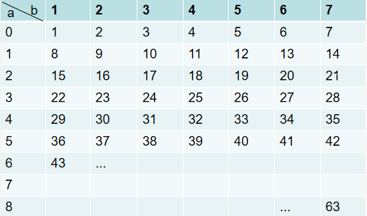

> 虽然 Rand7() * Rand7() ∈ [1, 49]，但是 [1, 49] 并不是等概率分布！！！如下表：

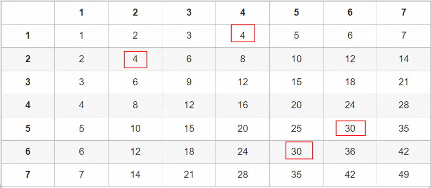

> 怎么用 randM() 生成 randN()，其中 M > N？
> - 若 M 是 N 的整数倍，则取余后是等概率，符合要求；如 rand10 生成 rand5，则 rand5 = rand10 % 5 + 1；
> - 若 M 不是 N 的整数倍，则取余后不是等概率！如 rand49 生成 rand10，rand10 = rand49 % 10 + 1 并不符合要求，
>
> 解决办法：40 是 10 的整数倍，所以 if rand49 ∈ [41, 49]，**拒绝采样**，再次生成 rand49；else rand10 = rand49 % 10 + 1；
>
> 缺点：如果生成的 rand49 一直 ∈ [41, 49]，则时间复杂度变成了 O(∞)；

```java
public int rand10() {
    int a = rand7();
    int b = rand7();
    while (true) {
        int num = (a - 1) * 7 + b;
        if (num <= 40)
            return num % 10 + 1;
    }
}

private int rand7() {
    return new Random().nextInt(7) + 1;
}
```

> 优化：上述代码很容易导致 O(∞)，因为拒绝采样的区间 [41, 49] 太大了，将其缩小：

```java
public int rand10() {
    int a = rand7();
    int b = rand7();
    while (true) {
        int num = (a - 1) * 7 + b;
        if (num <= 40)
            return num % 10 + 1;

        a = num - 40;   // rand9
        b = rand7();
        num = (a - 1) * 7 + b;  // rand63
        if (num <= 60)
            return num % 10 + 1;

        a = num - 60;    // rand3
        b = rand7();
        num = (a - 1) * 7 + b;  // rand21
        if (num <= 20)
            return num % 10 + 1;

        // a = num - 20;   // rand1，采样区间缩小到了 [21, 21]，命中的概率很小！
    }
}
```

## 13、可怜的小猪
> #458：https://leetcode-cn.com/problems/poor-pigs/
```java
/*
对于两只猪，喝完毒药 15min 死去，在 1h 内最多能检验多少桶？答案是 25 桶，如下图所示：
1. 最多做 1h / 15min = 4 轮实验：
2. 猪 A 只喝行，猪 B 只喝列，第 0 行第 0 列都不喝，从 1 开始喝！
3. 若两只猪都死了，就能唯一确定一个桶了；如 matrix[1][4] 有毒，则猪 A 第一次喝第 1 行，15min 后死掉，说明第 1 行里有毒；猪 B 从第一列开始喝，都没死，直到喝了第 4 列，猪 B 死了，第 1 行和第 4 列的交集就是 matrix[1][4]！
4. 若两只猪都没死，说明 matrix[0][0] 有毒；
5. 若猪 A 死了，猪 B 没死，说明第 0 列有毒；
6. 若猪 A 没死，猪 B 死了，说明第 0 行有毒；

对于三只猪，喝完毒药 15min 死去，在 1h 内最多能检验多少桶？答案是 125 桶，即：5 * 5 * 5，三维矩阵
*/
```

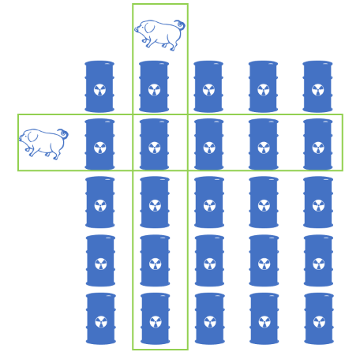

```java
public int poorPigs(int buckets, int minutesToDie, int minutesToTest) {
    if (buckets == 1) return 0;
    int round = minutesToTest / minutesToDie;    // 能检测几轮
    int cnt = 1;
    while (Math.pow(round + 1, cnt) < buckets) {
        cnt++;
    }
    return cnt;
}
```