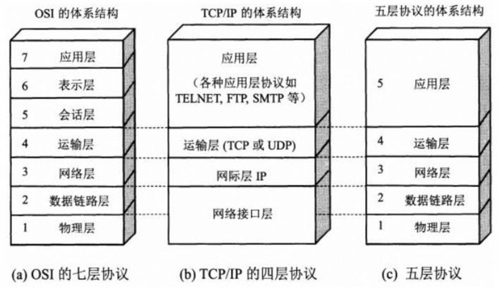
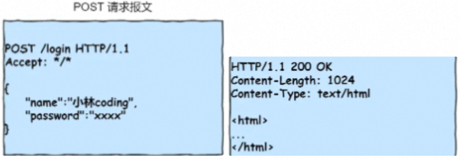
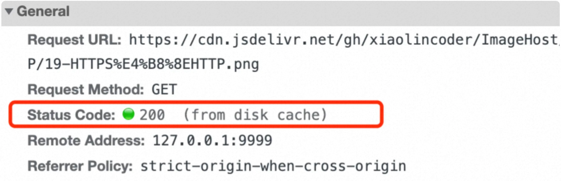
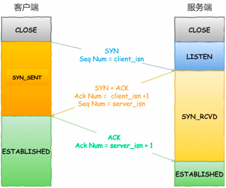
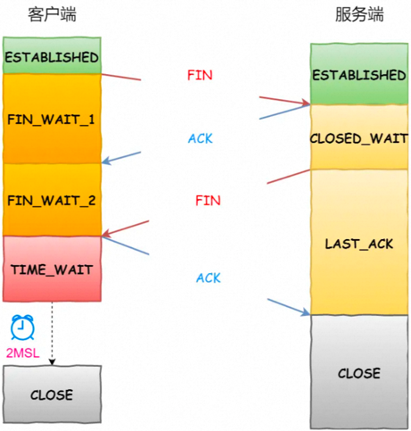
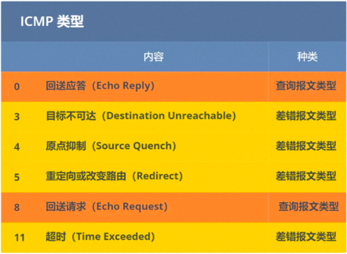

抓包工具：Wireshark

# 一、基础
## 1、网络体系结构
> 五层体系结构不存在，只是方便授课
> 


## 2、键入 URL 发生什么事
**1、浏览器解析 URL，并将其封装成 HTTP 请求报文**

> 1. 状态行
> 2. 请求头 / 响应头
> 3. 请求体 / 响应体



**2、域名解析，拿到目标服务器的 IP**

> 域名和 ip 是多对多的关系！
> 
> 先查缓存：浏览器缓存、本机 hosts 文件、本地域名服务器
>
> 递归查询：
>
> - 【本地域名服务器】请求【根域名服务器】、【根域名服务器】请求【顶级域名服务器】、【顶级域名服务器】请求【权威域名服务器】、注意：还可能有三级、四级 ... 等域名服务器；
> - 若在【权威域名服务器】中拿到【目标服务器】的 ip；则 ip 按照【权威域名服务器】->【顶级域名服务器】->【根域名服务器】递归返回，最后由【根域名服务器】将 ip 返回给 【本地域名服务器】；
>
> 迭代查询： 
>
> - 【本地域名服务器】请求【根域名服务器】，拿到【顶级域名服务器】的 IP；
> - 【本地域名服务器】请求【顶级域名服务器】，拿到【权威域名服务器】的 IP；
> - 【本地域名服务器】请求【权威域名服务器】，若拿到【目标服务器】的 ip，直接缓存到【本地域名服务器】，不用递归返回；
>
> 注意：域名解析使用 UDP，因为域名解析犹如大海捞针，要求速度快；
>

**3、建立 TCP 连接 (三次握手)**

**4、浏览器发起 HTTP 请求、服务器处理请求并返回 HTTP 响应**
> - TCP 协议给 HTTP 数据加上 TCP 头 (封装端口信息)；
> - IP  协议给 TCP 数据加上 IP 头 (封装 IP 信息)；
> - ARP 协议给 IP 数据加上 MAC 头 (封装 MAC 地址信息)、MAC 尾 (CRC 校验)；
> - 浏览器通过 "网卡 -> 交换机 -> 路由器" 发送数据；
> - 服务器通过 "路由器 -> 交换机 -> 网卡" 接收数据，处理请求并返回 HTTP 响应；

| 设备 | 作用 |
| --- | --- |
| 网卡 | 物理层，传输数据 |
| 交换机 | 数据链路层，根据 MAC 寻址 |
| 路由器 | 网络层，根据 IP 寻址 |


**5、浏览器解析 HTML 并渲染**

**6、TCP 四次挥手断开连接 (HTTP1.0 会断开，HTTP1.1 支持长连接)**

## 3、负载均衡
> 问：Nginx 挂了怎么办？
>
> 答：Nginx 可以用作负载均衡，单机能支持 10w 并发，如果并发很大，就要走 Nginx 集群，Nginx 集群的前面也需要一个负载均衡器，这就是 LVS； 
>
> - 七层负载均衡：如 Nginx，工作在第七层（应用层），一般根据请求 URL 进行转发； 
> - 四层负载均衡：如 LVS（Linux 虚拟服务器，被集成在 Linux 内核中），工作在第四层（传输层），仅根据 ip + port 进行转发，处理速度快，单机轻松几十万 qps，适用于大流量、高并发场景； 
>     - LVS 没有健康检查，如果后端服务挂了还会继续转发请求，因此一般和 Keepalived 配合使用； 
>     - F5：硬件四层负载均衡器，贵！
>

# 二、HTTP
## 1、http 特点、状态码、常用字段
> - 超文本：文字、图片、音频、视频、html 文本等； 
> - 无连接：每次 http 连接只处理一个请求，服务器处理完客户的请求后，立刻断开连接； 
> - 无状态：服务器不会记录客户端的信息，不知道客户端是什么状态。如客户端发送两次请求，服务器不知道两次请求来自同一客户端；优点：节约服务器 CPU、内存资源； 
> - 问：http 怎么实现有状态？  
答：用 cookie 或 session，如果 cookie 被禁用，可以把 sessionId 放在 url 中！
>

> - 1xx：服务器收到了请求，需要等待浏览器继续执行操作；100 Continue；
> - 2xx：服务器成功处理了请求；200 OK；
> - 3xx：资源相关；301 永久重定向 (浏览器会用新的网址把旧网址替换掉)、302 临时重定向 (浏览器继续使用旧网址)、304 http 协商缓存；
> - 4xx：客户端错误；400 Bad Request、401 Unauthorized、403 Forbidden；404 Not Found；
> - 5xx：服务端错误；500 Internal Server Error、502 Bad Gateway、503 Service Unavailable、504 Gateway Timeout；
>
> 面试：502、504 怎么排查？
>
> 答：502、504 是网关 (nginx、gateway) 返回的状态码，不是后端服务，先查看网关日志看哪个服务出了问题；
>
> - 502：网关和后端服务通信异常，可能是： 
>     - 网关配置的路由信息有问题 (ip:port)；
>     - 后端服务挂了：用 ping 检查下，看后端的错误日志，找到挂掉的原因；
>     - 后端服务或网关的连接池满了，无法处理请求；
> - 504：后端超时，调大网关的超时时间，或优化后端代码；
>

| Header 字段 | 说明 |
| --- | --- |
| Host: www.itbilu.com:80 | 目标服务器域名、端口号 |
| Connection: Keep-Alive | http/1.1 长连接 |
| Content-Length: 1000 | body 数据的长度 |
| Content-Type: text/html; charset=utf-8 | 告诉对方自己发送的数据格式 |
| Accept: */* | 告诉对方自己能接受的数据格式 |
| ...... | ...... |


## 2、Get、Post
> 1. RFC 规范：get 的语义是获取资源，post 的语义是提交资源，get、put 幂等，post、delete 不幂等； 但我们可以不按照 RFC 规范，比如用 post 实现获取资源 (幂等)，用 get 实现删除资源 (不幂等)；
> 2. get 通过 QueryString 传参，post 通过 RequestBody / QueryString 传参，相对来说 post 比 get 安全，但抓包也不安全；
> 3. get 也能带 RequestBody，但 get 用来获取资源，基本没人这么做；
> 4. get 请求的参数是有长度限制的，且参数只能是 ASCII 字符，post 没有限制；
> 5. get 请求会被浏览器缓存，post 不会；
> 6. get 只产生一个 TCP 数据包，会将 header 和 data 一并发送；post 会产生两个 TCP 数据包，先发送 header，服务器响应 100 continue 后再发送 data。所以效率 get > post，但当网络环境比较差的时候，post 的数据包完整性更好。
> - Head 请求，和 Get 类似，但只接收 http header，可用来检查超链接的有效性等；
>

## 3、http 缓存
**3.1、强制缓存**
> 服务器可以通过以下两个字段之一，将响应结果缓存到浏览器，浏览器再次发送请求时，先查浏览器缓存，没过期就直接用！

| 响应头字段 | 说明 |
| --- | --- |
| Cache-Control | 是一个相对时间，优先级比 Expire 高 |
| Expires | 是一个绝对时间 |
| Last-Modified | 资源最后的修改时间 |
| ETag | 资源的唯一标识 |

> from disk cache：表示浏览器走了缓存，而不是请求服务器！



**3.2、协商缓存**

> 打开 F12，有时候会看到请求 304，
>
> 原因：强制缓存过期了，浏览器再次请求服务器，服务器比较该资源是否发生修改，若没修改，则返回 304，表示：虽然缓存过期了，但没修改，可以继续用！
>
> 比较办法：
> 1. 若资源发生修改，则 ETag 会变，浏览器根据 Etag 判断 (优先级高)；
> 2. 浏览器根据资源的 Last-Modified 判断是否发生修改；

## 4、转发 VS 重定向
> - 转发：服务器行为，地址栏 URL 不变，是一次请求，共享 request 数据；
> - 重定向：浏览器行为，地址栏 URL 改变，是两次请求，不共享 request 数据；

## 5、cookie、session
> - http 是无状态的，cookie 和 session 都是保持状态的方案；
> - cookie 保存在浏览器，不安全；session 保存在服务器，安全；
> - cookie 最大 4kb，且只能保存 ASCII 类型的数据，一个站点最多保存 20 个 cookie；session 无限制；

## 6、URI、URL
> - URI：统一资源标识符，如身份证号，表示这个资源是唯一的；
> - URL：统一资源定位符，如详细地址，表示如何找到这个资源 (也表示这个资源是唯一的)；
> - URL 是 URI 的子集；

## 7、https
> SSL 是 TLS 的前身：属于应用层和传输层之间 (表示层)
> - http 明文传输不安全；https 使用 SSL 加密传输协议，安全，但是效率比 http 低；
> - http 端口是 80，https 端口是 443；
> - https 比 http 多了个 TLS 握手过程，先 TCP 握手，再 TLS 握手；
> - 一个 https 请求至少包含两个 http 请求：
>     - 第一个 http 请求：使用非对称加密生成会话密钥；
>     - 第二个 http 请求：使用会话密钥，对称加密进行通信 (因为非对称加密效率低)；
>
> 对称加密，如 AES 算法：
>
> - 加解密方式：通信双方共用同一把密钥，密钥可对数据加密，也可对数据解密；
> - 速度：采用**位运算**，快；
> - 安全性：低，密钥一旦被别人知道，加密形同虚设。 
>
> 非对称加密，如 RSA 算法：
>
> - 加解密方式：用公钥加密的内容必须用私钥才能解开，用私钥加密的内容必须用公钥才能解开；
> - 速度：采用**幂运算 (连乘)**，慢；
> - 安全性：高；
>
> 哈希算法：如 SHA256 及以上；

> CA 证书：
>
> - Certificate Authority (证书授权中心)：是一个第三方机构，负责颁发 CA 证书；
> - 服务器需要申请 CA 证书，客户端通过验证 CA 证书来确定服务器是否合法 (是否为中间人)；
> - 服务器申请 CA 证书后，CA 证书上有公钥和私钥，服务器会将公钥暴露给客户端，私钥独有。
>
> CA 作用：防止中间人攻击 (黑客冒充目标服务器)；
>
> 问题：若中间人冒充 CA 机构怎么办？答：CA 机构上面还有更高级的 CA 机构，除非把所有的 CA 机构都冒充掉，很难！
>
> Client 怎么验证 CA 证书？ 
> - CA 会对 Server 的信息求 hash，再用 CA 私钥对 hash 值加密，得到签名，把【Server 信息 + 签名 + CA 公钥】保存到证书中；
> - Client 验证 CA 证书时，会用 CA 公钥对签名解密得到一个 hash 值，再对证书上的 Server 信息求 hash，判断两个 hash 是否相等！

> HTTPS RSA 四次握手过程：
>
> 1. Client 向 Server 发送 TLS 握手请求，包括【TLS 版本、支持的加密算法、随机数 1】；
> 2. Server 选择一个加密套件，返回【TLS 版本、加密套件、随机数 2、证书 (包含明文公钥)】；
>   - Client 从根证书开始，根据证书链逐级验证 CA 证书的合法性，并用证书的公钥验证签名，**这样就能确认服务端的身份了！**
> 3. Client 生成随机数 3 并用公钥加密，即：**预主密钥** ，将【预主密钥】发送给 Server，
>   - 双方通过【随机数 1 + 随机数 2 + 预主密钥】计算出【会话密钥】。(预主密钥只有 Client 和 Server 知道，所以就算明文的公钥被别人劫持了也没关系！)
> 4. Server 返回 TLS 握手完成；
>
> 此后，Client 和 Server 使用会话密钥，对称加密进行通信。
>
> RSA 算法的缺点：服务器的私钥是不变的，一旦私钥泄露，则所有会话的数据就会被破解；
>
> 目前使用最广泛的是 ECDHE 算法，每次会话的私钥都是随机生成的，就算私钥泄露，只有当前会话的数据会被破解！

> 设私钥为 p，给定椭圆曲线 f(x) 和基点 G，则可以生成公钥 q，整个过程不可逆！
>
> HTTPS ECDHE 四次握手过程： 
>
> 1. Client 向 Server 发送 TLS 握手请求，包括【TLS 版本、支持的加密套件、随机数 1】； 
> 2. Server 生成一个随机数作为本地**私钥 1**；选择一个加密套件，返回【TLS 版本、加密套件、随机数 2】+【证书】； 
>   - 用椭圆曲线和基点计算出一个**公钥 1**，为了防止公钥 1 被篡改，用 RSA 给公钥 1 做签名，返回【椭圆曲线、基点、公钥 1】；
>   - Clent 从根证书开始，根据证书链逐级验证 CA 证书的合法性，并用证书的公钥验证签名，**这样就能确认服务端的身份了！**
> 3. Client 生成一个随机数作为本地**私钥 2**，用椭圆曲线和基点计算出一个**公钥 2** 并发送给 Server；
>   - 此时双方都有椭圆曲线、基点、自己的私钥、对方的公钥；
>   - 双方计算出椭圆上的点 (x, y)，椭圆曲线关于 x 轴对称，x 一定相同，因此用【随机数 1 + 随机数 2 + x】作为【**会话密钥**】；
> 4. Server 返回 TLS 握手完成；
>
> 此后，Client 和 Server 使用会话密钥，对称加密进行通信。

## 8、http 各版本
**0、http/0.9**：只支持 get 请求；

**1、http/1.0**
> 默认使用 tcp 短连接：每次 Client 与 Server 通信时，都要经历 tcp 三次握手、四次挥手，效率低；

**2、http/1.1：目前使用最广泛**
> - 默认长连接：多个 http 请求使用同一个 tcp 连接，减少了 tcp 建立销毁时的开销；会在响应头中加入 **Connection:keep-alive**；
> - 相较于 http/1.0，请求头中增加了一些和缓存相关的字段；

> Client 与 Server 通信时建立连接，通信结束后并不会立刻断开 tcp 连接， 而是等到 keep-alive 时间后再断开！注意，header 有两种： 
> - end to end：发送方携带的 header 一定会被接收方接收； 
> - hop by hop：发送方携带的 header，只会被第一个接收方接收；  
   Connection 就是 hop by hop header，如果浏览器直接访问服务器，则两者之间建立长连接；如果浏览器和服务器中间有代理服务器 (Nginx)，则浏览器和代理服务器建立长连接！ 
>
> 问题：长连接导致 http 队头阻塞："请求 -> 响应 -> 请求 -> 响应" 必须串行执行，一个阻塞，则后面的所有步骤都阻塞！
>
> 解决办法：**创建多个 tcp 连接** (浏览器**默认的 TCP 最大连接数是 6 个**)；
>
> 注意：http/1.1 提出了**管道化请求**，多个请求可以并发，解决了请求的队头阻塞，但响应必须串行执行！但很多浏览器都不支持管道化，了解！

**3、http/2.0**
> - 基于 https；
> - 对 http/1.1 进行优化；使用**多路复用**技术，多个 Stream 复用一个 TCP 连接！每个 http 请求被切分成多帧，多个 http 的帧可以在多个 Stream 中**并发乱序传输** (**同一 Stream 内部的帧必须是严格有序的**)，接收方接收后再通过 Stream ID 将乱序的帧组装好，所以不存在 http 队头阻塞！
> - **二进制传输**：之前版本数据都是用文本传输，有多种格式，如 json、html、xml 等；http/2.0 统一使用二进制传输；
> - **header 压缩**：http/1.1 支持 body 压缩 (gzip 算法)，http/2.0 支持 header 压缩 (hpack 算法，多次 http 请求的 header 都相同，用文本效率太低，对常见的 header 进行哈夫曼编码，发送二进制数据！)；
> - **服务端推送**：Server 可以主动推送一些资源给浏览器，减少通信次数；

**4、http/3.0**
> tcp 队头阻塞：tcp 数据包是有序传输，中间一个数据包丢失，会等待该数据包重传，造成后面的数据包阻塞；只有干掉 tcp 才能解决 tcp 队头堵塞问题，所以 http/3.0 不使用 tcp，使用 quic；
>
> quic 基于 udp，可以实现类似 tcp 的可靠传输；
>
> http/3.0 普及缓慢！
>
> ~~注意：http 不能用 udp 实现，http 必须使用可靠的传输协议！！！~~

## 9、http VS rpc
> rpc：远程过程调用，是一种理念，出现的比 http 早；属于应用层 / 传输层，因为可以基于 http / tcp；
>
> http：可以看作是 rpc 的一种通用的具体实现，因为浏览器要访问不同的服务器，必须要有统一的通信协议，因此 http 诞生了；
>
> 但 http/1.1 的效率不高，为了追求效率，后端服务之间一般都用成熟的 rpc 协议取代 http；
>
> 也可以自定义 rpc 协议，如约定好 header 的格式 (规定第一行就代表 Content-Type 字段)，只传 value 不传 key，这样 header 就比 http 小很多；也可以自定义 body 的序列化方式，使用效率更高的算法等！
>
> http/2.0 效率比 http/1.1 高很多，所以直接用 http/2.0 即可，没必要用 rpc；但 http/2.0 是 2015 年出来的，rpc 早就诞生了，很多公司的 rpc 已经跑了很多年了，所以没法直接切到 http/2.0！

# 三、TCP、UDP
> TCP 特殊报文：
> + SYN：表示希望建立连接；
> + FIN：希望断开连接；
> + ACK：确认收到；
> + RST：TCP 异常，强制断开连接！

## 1、TCP 三次握手
> 内存、CPU 等资源无限的情况下，可以支持多少个 TCP 连接？答：取决于 OS 能打开的文件数 (fd 数量)；



> 1. **为什么不是两次握手？** 避免历史连接 
>     - Client 向 Server 发送一个连接请求，但该请求在网络中拥堵了，迟迟没有到达 Server；
>     - Client 重新向 Server 发送了一个连接请求，Server 响应了该请求，则两次握手，TCP 建立成功，C / S 可以发送数据了；
>     - 若此时第一个连接请求到达了 Server，Server 也会响应该请求，则两次握手，TCP 建立成功，但 Client 会使用最新的连接发送数据，并不会使用历史连接，但 Server 却要一直监听这个连接；
>     - 若这种情况多了，则 Server 资源浪费严重，会导致 Server 无法建立新的 TCP 连接。 
> 2. **为什么不是四次握手？** 四次握手也可以，和四次挥手一样，把中间两步合并，就成了三次握手，没必要，因为三次足矣；
> 3. **第 2 次握手传回了 ACK，为什么还要传回 SYN？**
>
> TCP 是全双工的，第一次握手的 SYN 表示 Client 请求连接 Server，第二次握手的 SYN 表示 Server 请求连接 Client；
>
> 4. ISN (初始 seq) 为什么是随机的？
>     - 防止黑客攻击：如果每次连接 ISN 都是固定的，则黑客可以模仿 Client 的 IP 和 ISN 跟 Server 通信；
>     - 防止历史报文被接收 (主要方面)：如果每次连接 ISN 都是固定的，因网络拥堵导致的历史报文很可能还会被 Server 正常接收！
> 5. **握手异常：**
>     - 第一次握手 SYN 丢失：Client 超时重传 SYN；
>     - 第二次握手 ACK、SYN 丢失：Client 超时重传 SYN & Server 超时重传 ACK、SYN；
>     - 第三次握手 ACK 丢失：Server 超时重传 ACK、SYN，Client 收到后会再次发送 ACK（client 不会主动重传 ACK）；

```bash
cat /proc/sys/net/ipv4/tcp_syn_retries    	 # syn 重传次数
5

cat /proc/sys/net/ipv4/tcp_synack_retries    # syn + ack 重传次数
5
```

## 2、TCP 四次挥手
> 为什么必须是四次挥手？
> - TCP 连接是全双工的，C / S 都可以主动关闭连接单方向的连接，因此要四次挥手；当 Server 没有要发送的数据时，也可以三次挥手！

> MSL：报文在网络中最大的存活时间，如果接收后发现超时，则会被丢弃；Linux 默认 **<font style="color:#DF2A3F;">MSL = 30s</font>**；
>
> TIME_WAIT = 2MSL 的作用？
>
> 1、保证 TCP 连接的可靠释放
>
> - 第四次挥手丢失时，Server 会超时重传第三次挥手，如果第四次挥手后 Client 立刻关闭，就收不到 Server 重传，Server 必须等到重传 5 次后因为超时才能关闭 TCP 连接，浪费 Server 资源！所以 Client 发完第四次挥手后不能立刻关闭！
> - 第三次挥手 + 第四次挥手 < 2MSL；
> - 即：2MSL 允许第四次挥手丢失一次 (为什么不设置为 4 MSL，这样就允许丢失两次了？因为没必要，假设丢包率 1%，则两次都丢失的概率为万分之一！)
>
> 2、2MSL 能保证：此次 TCP 连接中的所有数据能在下一次 TCP 连接成功之前全部失效掉！不会影响下次 TCP 连接！

> CLOSE_WAIT：Client 到 Server 的单向通道已关闭，但 Server 可能还有数据没传完，Server 到 Client 的单向通道还不能关闭；



> 第二次挥手结束后，客户端就处于 FIN_WAIT_2，如果服务器不发送第三次挥手，则客户端会一直等待，直到 tcp_fin_timeout = 60s 后直接断开 TCP 连接！
>
> 高并发问题：Client 主动关闭连接 (主动发起第一次挥手) 和 Server 主动关闭连接的区别？ 
>
> 1、Client 主动关闭连接
> - 会导致大量的连接在 Client 端处于 TIME_WAIT (Client 端，不重要)；
> - 可能导致大量的连接在 Server 端处于 CLOSE_WAIT，解决办法：检查代码，Server 端肯定没及时关闭连接！ 
>
> 2、Server 主动关闭连接：和 Client 主动关闭相反，会导致大量的连接在 Server 端处于 TIME_WAIT，不能快速释放以响应新的连接请求，解决办法：修改 OS 配置
> - 设置 net.ipv4.tcp_tw_reuse = 1：TIME_WAIT 状态的 socket 可被新的 tcp 连接**重用**；
> - 设置 net.ipv4.tcp_tw_recycle = 1：快速回收 TIME_WAIT 状态的 socket；
> - Server 端尽量不要主动关闭连接，让 Cilent 主动关闭，这样 TIME_WAIT 状态就都分布在各个 Client 端了；

## 3、TCP keepalive
> 与 http 的 Keep-Alive 不同 (表示长连接)！
>
> TCP 连接建立后 Client 挂了怎么办？用 keepalive 机制：
> - Server 每次收到 Client 的数据时，都会将保活计时器复位，默认为 2h；
> - 如果 2h 内没有收到数据，则每隔 75s 发送一个探测报文；
> - 如果连续发送了 10 个探测报文都没被响应，则认为 Client 挂了，Server 会关闭 TCP 连接。
>
> 若 Keepalive 机制没开启，则 Server 会死等！

```bash
net.ipv4.tcp_keepalive_time=7200    # 2h
net.ipv4.tcp_keepalive_intvl=75     # 探测报文发送的间隔时间
net.ipv4.tcp_keepalive_probes=10    # 探测报文发送的次数
```

**1、Client 拔掉网线 (或宕机) 后， 原本的 TCP 连接还存在吗**
> + 没有数据传输的情况：Server 会进行 TCP keepalive 探测，若在 keepalive 探测期间插回网线，则 TCP 还能正常通信，否则断开连接；如果没开启 keepalive，则 TCP 连接会一直存在，插上网线后还能继续通信；
> + 有数据传输的情况：Client 拔掉网线后，如果 Server 发送了数据，则收不到 Client 的 ACK，因此会最多重试 5 次；若重试期间插回网线，则 TCP 还能正常通信；若重试达到最大次数，则 Server 主动断开连接，断开后如果 Client 插上网线并发送数据，则 Server 回 RST 报文，Client 收到后也会断开连接；

**2、Client 进程崩溃，原本的 TCP 连接还存在吗**
> Client 进程崩溃后，OS 内核会向 Server 发送 FIN 报文，进行四次挥手。

## 4、IP 会分片，TCP 为什么要分段？
> **MTU: Maximum Transmit Unit** 是**数据链路层**的传输能力，一般 MTU = **1500B**，所以 IP 层会对数据分片 <= MTU；
>
> **MSS：Maximum Segment Size** 是 TCP 报文的最大大小，不包括 TCP 头，超过了就会分段；
>
> 既然网络层会分片，传输层为什么要分段？
>
> 答：如果传输层不分段，到了网络层才分片，一次性发送一个大报文，如果其中某个字节丢失了，则 TCP 会重传整个大报文，效率低！如果传输层分段，则只会重传一个分段！

## 5、TCP VS UDP
> 应用场景： 
> - TCP 可靠，但传输慢，适合对准确率要求高的场景，如文件传输、发送邮件等；
> - UDP 不可靠，但传输快，适合对准确率要求低的场景，如即时通信：短信、视频、广播等；

| 类型 | 特点 | 传输形式 | 首部 | 通信 |
| :---: | :---: | :---: | :---: | :---: |
| TCP | 面向连接、可靠、传输效率**慢** | 字节流 | 20 ~ 60 byte | 端到端 |
| UDP | 无连接、不可靠、传输效率**快** | 数据报 | 8 byte | 单播、广播、组播 |

## 6、TCP 可靠 (稳定) 传输
**1、序列号机制、ACK 机制**
> - TCP 传输数据时，会对每个字节都进行编号；
> - 接收方收到数据后会返回一个 ACK 给发送方；
> - ACK 报文中带有序列号，告诉发送方，接收到了哪些数据，下一次的数据从哪里发。

**2、超时重传**
> - TCP 每发送一个报文，就对该报文设置**重传计时器**，在规定时间内没有收到接收方的 ACK，则会超时重传；
> - 超时时间不是固定的，而是根据 RTT 动态计算的；
> - 默认最多重传 5 次，重传间隔分别是 1、2、4、8、16s；超过 5 次后，关闭 TCP 连接！

**3、数据包校验和**

**4、流量控制**
> - 如果发送方发送得太快，接收方可能会来不及接收，造成数据的丢失；
> - 流量控制就是让发送方慢点，要让接收方来得及接收；
> - TCP 使用**滑动窗⼝**实现流量控制，接收方返回给发送方的 ACK 中包含了滑动窗口的大小信息，发送方会调整自己的发送窗口。
> - 当接收方的滑动窗口满了，则返回给发送方的窗口大小为 0！

**5、拥塞控制**
> 防止发送方将过多的数据注入到网络中，造成网络拥塞；
>
> 引入拥塞窗口，调节发送方的发送窗口，发送窗口 = min(接收窗口，拥塞窗口)；
>
> 发送方没有接收到接收方的 ACK，则超时重传，认为网络出现拥塞，则拥塞窗口变小；没有出现拥塞，则拥塞窗口变大！
>
> - 慢开始：TCP 连接建立后，拥塞窗口指数增长，拥塞窗口 ∈ [1, 慢开始门限)；
> - 拥塞避免：线性增长，拥塞窗口 ∈ [慢开始门限, 网络拥塞(超时) 时的拥塞窗口大小]；
> - 快重传：当接收方收到的报文段中有些序列号丢失了，发生拥塞，则会返回 3 个冗余 ACK，告诉发送方这个报文段丢失了，此时发送方立刻重传，不用超时重传；拥塞窗口 /= 2，慢开始门限 = 拥塞窗口；
> - 快恢复：当发送方接收到 3 个 ACK 时，开始执行拥塞避免算法，而不是慢开始算法；
>
> 区别： 
> - 流量控制：点对点的流量控制；
> - 拥塞控制：全局的流量控制；

## 7、TCP 拆包、粘包
> 拆包：当 TCP 报文太大时，会拆成多个包发送；
>
> 粘包：接收到多个数据包时，并不知道哪个数据包属于哪个 TCP 报文，即 TCP 没有消息边界，会导致粘包；
>
> 注意：
> - http/1.0 默认短连接：每次 Client 与 Server 通信时，都要经历三次握手和四次挥手，不会存在粘包问题；
> - http/1.1 默认长连接：多个 http 请求使用同一个 tcp 连接，导致多个请求的数据包存在粘包问题！
> - UDP 不存在粘包问题，因为 UDP 面向数据报，接收方每次只接收一条独立的数据报；但 TCP **面向字节流**，没有消息边界！
>
> 解决办法：
> - 发送方发送数据时，把数据长度也发送过去，接收方根据数据长度来分割数据包；
> - 发送方设置消息边界，如消息之间添加分隔符等；

**http 解决 TCP 粘包：**
```bash
# CRLF = \r\n = 回车换行
# http 请求报文格式：
1）请求行，以 \r\n 结束
2）请求头1，以 \r\n 结束
   请求头2，以 \r\n 结束
3）\r\n
4）请求体
```
> - 读到第一个 \r\n 表示读取请求行结束； 
> - 读到 \r\n\r\n 表示读取请求头结束； 
> - 怎么读取 body 数据呢？ 
>     - 根据 header 中的 Content-Length 字段，单位字节； 
>     - 使用 Transfer-Encoding: chunked 取代 Content-Length； 
>
> Content-Length 有时候很难获取，如 body 来自网络文件、或者是动态生成的，则必须要开一个足够大的 Buffer，等 body 缓存好了才能计算大小，这样做消耗内存 && 耗时！
>
> Transfer-Encoding: chunked 表示分块传输编码，将 body 分成多个块依次传输，最后一个块的大小为 0，body 格式：

```bash
块 1 的字节数(16 进制)，以 \r\n 结束
块 1 的数据          ，以 \r\n 结束
块 2 的字节数(16 进制)，以 \r\n 结束
块 2 的数据          ，以 \r\n 结束
0，以 \r\n 结束    # 最后一个块的大小为 0，所以 body 以【0 + \r\n】结束
```

## 8、TCP 连接队列、SYN 攻击
> OS 内核会维护两个 tcp 队列： 
> - 半连接队列 (SYN 队列)
> - 全连接队列 (Accept 队列)
>
> Server 收到 tcp 第一次握手时，内核会把连接存到 SYN 队列；Server 收到 tcp 第三次握手时，内核会把连接从 SYN 队列转移到 Accept 队列，**等待进程调用 accept() 时把连接取出来**，然后 IO 多路复用；
>
> 面试 (腾讯、字节)：connect() 和 accept() 发生在三次握手的哪个阶段？答：第一次握手、三次握手完成后！
>
> 高并发问题：
> 1. Accept 队列溢出：后续的连接请求就会被丢弃；解决办法：调大队列长度 (注意：队列长度怎么调不用管，不同的 Linux 版本不一样！)； 
> 2. SYN 队列溢出：后续的连接请求就会被丢弃；解决办法：
>    - 调大队列长度； 
>    - 减少 SYN+ACK 重传次数，尽快丢弃不合法的连接请求； 
>    - 开启 tcp_syncookies = 1：不使用 SYN 队列的情况下建立连接；  

```bash
net.ipv4.tcp_syncookies
# 0：表示关闭该功能；
# 1：表示仅当 SYN 半连接队列放不下时，再启用它；
# 2：表示无条件开启功能；
```

> SYN 攻击：如果 Client 恶意的向 Server 不断发送 SYN，然后不进行第三次握手确认，则 SYN 队列很快被打满，
>
> 而队列中的连接永远无法完成三次握手，只能等待一个 RTT 时间后自动超时然后被丢弃，而 SYN 队列一旦满了之后，服务器将会拒绝任何连接请求！ 
>
> 解决办法：见 "SYN 队列溢出"；

## 9、UDP 实现可靠传输
> UDP 是无连接的，不可靠，只能在应用层去实现可靠传输；
>
> 可以模仿 TCP 的实现，比如添加 "序列号和 ACK 机制"、超时重传机制等，
>
> 如 QUIC 协议 (传输层)，基于 UDP，已经被用在 http/3.0 了！

## 10、TCP 和 UDP 能共用端口吗？
> 可以；TCP 和 UDP 在 OS 内核中是由两个完全独立的软件模块实现的。
>
> 当服务器收到数据包后，通过 IP 包头的「协议号」字段知道该数据包是 TCP / UDP，然后发给对应的 TCP / UDP 模块去处理；
>
> 因此， TCP / UDP 端口号相互独立，互不影响，可以相同！

# 四、IP
> 传输层：提供**端到端**的通信；
>
> 网路层：提供**点到点**的通信，通信两点没有直连；
>
> 数据链路层：提供**跳到跳**的通信，通信两点直连；
>
> 经过多个路由器，源 ip 和目标 ip 不会变化，但源 MAC 和目标 MAC 会变化！

## 1、IP、MAC
> - MAC 地址用于数据链路层和物理层，是物理地址，用于定位主机的位置； 
> - IP 地址用于网络层及以上，是逻辑地址，用来区别**网络上**的主机。

> 有了 MAC 地址为什么还需要 IP 地址？ 
> - MAC 地址 (48 位) 寻址困难，每个路由器需要 2^48 = 256T 内存保存所有 MAC 地址，不现实！ 
> - IP 地址和地域相关，同一子网的 ip 前缀都相同，通过 ip 前缀寻址，快速！

> 有了 IP 地址为什么还需要 MAC 地址？ 
> - 主机接入子网后才有 ip 地址，没接入前用 MAC 地址区分；

## 2、ARP 攻击
> ARP：将下一跳的 IP (根据路由表找到的) 转为 MAC 地址，过程：
> - 源主机查看自己的 ARP 列表，看有没有 (目的 ip -> MAC)；
> - 若没有，则在**所在局域网**广播 ARP 请求 (源 ip、源 MAC、目的 ip)；
> - 其他主机收到后，若自己的 ip == 目的 ip，则将自己的 MAC 发送给源主机 (ARP 响应)；
> - 源主机将 (目的 ip -> MAC) 写入自己的 ARP 列表；
>
> RARP：MAC 转 ip；

> ARP 攻击：
> - ARP 缓存保存的是 (目的 ip -> 目的 MAC)，ARP 攻击会将其改为 (目的 ip，攻击者 MAC)， 所有发给目的 ip 的数据，都会被转发给攻击者！ 
> - 攻击者伪造 ARP 响应报文，向**网络内的所有主机**都发送，每个主机收到 ARP 报文后，都会修改自己的 ARP 列表，将被攻击的 ip 映射到攻击者的 MAC！

## 3、DHCP
> 动态获取 IP 地址
```bash
客户端    ---- DHCP 发现报文 --->    DHCP 服务器
客户端    <--- DHCP 提供报文 ----    DHCP 服务器
客户端    ---- DHCP 请求报文 --->    DHCP 服务器
客户端    <--- DHCP ACK 报文 ----    DHCP 服务器
```

## 4、NAT
> NAT：网络地址转换，保存了内网到外网的映射，能缓解 ipv4 不足的问题，也能隐藏、保护内网主机；
> - 静态转换：内网转换为固定的外网地址，当外网地址被占用时，则设备无法联网；
> - 动态转换：内网转换为不固定的外网地址，避免了外网地址被占用的问题；
> - **端口复用**：内网转换为固定的外网地址，但占用外网的不同的端口；

## 5、ICMP、ping、traceroute

> - 询问报文 (网络是否畅通，如 ping 命令)；
> - 差错控制报文 (传输是否可靠，如发生丢包，icmp 会告诉发送方丢包原因)；

> ping 的底层是 ICMP 询问报文，会发送一个 Echo request，目标主机接收后会回复一个 Echo reply；
>
> 断网了也能 ping 127.0.0.1、ping 本机 ip，两者没有区别，都走了本地回环接口，数据都不会发送到网络中，用于检查本机网络配置是否正常；0.0.0.0 ping 不通，表示服务器上所有的 ipv4 地址 (一个服务器可以有多个网卡、多个 ip)！

> traceroute <目标 ip>：路径跟踪，打印出沿途经过的路由器 ip 和时延； 
>
> 原理：先发送一个 TTL = 1 的 UDP 报文，到达第一个路由器后超时，路由器返回 ICMP 超时报文，所以能拿到第一个路由器的 ip 和延时；同理，再发送一个 TTL = 2 的 UDP 报文，拿到第二个路由器的 ip 和延时；以此类推，直到到达目标 ip！
>
> 注意：有些路由器可能不允许 trace，不会返回 ICMP 超时报文，因此拿不到这一跳的信息，但可以继续拿下一跳的信息；

# 安全
## 1、DNS 劫持 (污染)
> DNS 劫持：黑客攻击 DNS 服务器，把里面的 (域名 -> 目标服务器 IP) 换为 (域名 -> 钓鱼网站 IP)

## 2、CSRF
> CSRF：跨站请求伪造，黑客拿到用户的 cookie 去请求服务器。

## 3、DDoS
> DDoS (分布式拒绝服务，使用多台机器攻击目标服务器) 攻击有两种：
> - 流量攻击：发送大量数据包，占用网络带宽，造成网络拥堵，使用户的数据包无法到达服务器；
> - 资源耗尽攻击：服务器资源耗尽，如 SYN 攻击、发送大量 http 请求等；
>
> 解决办法：
> - 分析攻击者的特征，如 ip、userAgent 等，拦截掉；
> - 如果没有特征，扩容；

# 查看网络的命令
> - ifconfig
> - ip
> - netstat
> - ping
> - traceroute