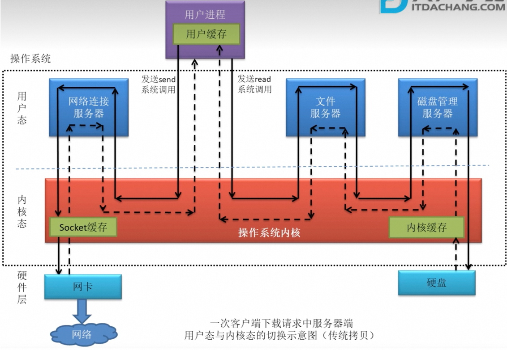
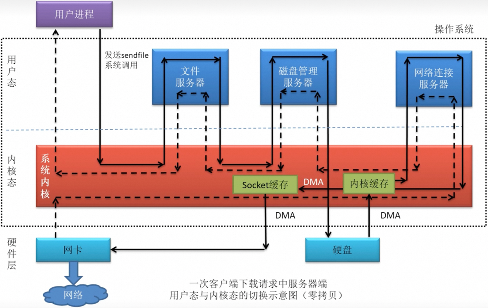
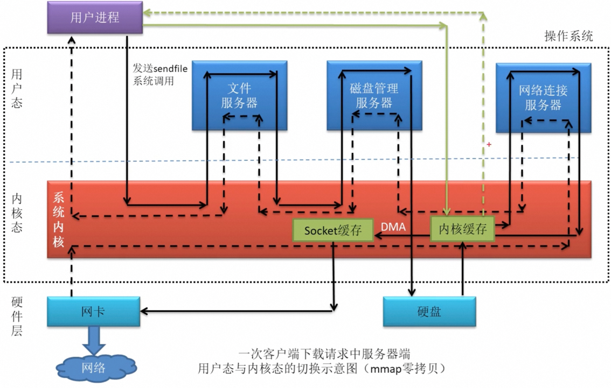
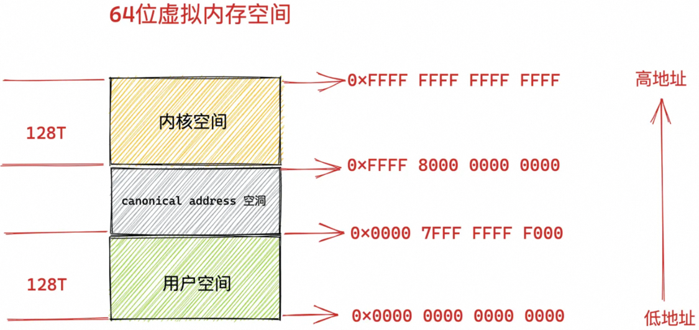
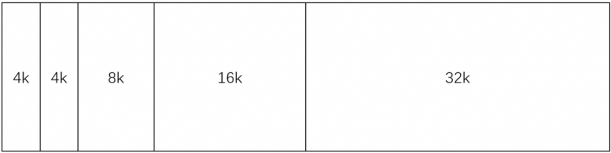

# 一、拷贝

> 面试：OS 复制拷贝的过程？
>
> 零拷贝：将数据从一个存储区域 copy 到另一个存储区域，无需 CPU 参与，而是使用硬件：DMA (Direct Memory Access)；
>
> 优点：CPU 消耗少，减少两态的切换次数，提高效率。

## 1、传统拷贝

> 如：下载请求
> 1. 用户进程发送 read 系统调用；
> 2. 内核拷贝数据：磁盘 → 内核缓存 (使用 DMA)，内核缓存 → 用户缓存 (使用 CPU)，read 返回；
> 3. 用户进程发送 send 系统调用；
> 4. 内核拷贝数据：用户缓存 f→ Socket 缓存 (使用 CPU)，Socket 缓存 → 网卡 (使用 DMA)，send 返回；
>
> 整个过程涉及到 16 次两态切换，4 次数据拷贝 (2 次 CPU 拷贝，2 次 DMA 拷贝)！



## 2、零拷贝
> 零拷贝：在**传统拷贝**中，直接将内核缓存的数据拷贝到 Socket 缓存，不经过用户缓存！
> 1. 用户进程发送 sendfile 系统调用；
> 2. 内核拷贝数据：磁盘 → 内核缓存 (使用 DMA)，内核缓存 → Socket 缓存 (使用 DMA)，Socket 缓存 → 网卡 (使用 DMA)；
>
> 整个过程涉及到 14 次两态切换，3 次数据拷贝 (均为 DMA 拷贝)！



## 3、Gather Copy
> - 零拷贝中，为什么不能直接将内核缓存的数据拷贝到网卡，为什么偏要经过 Socket 缓存？因为只有地址连续的数据才能用 DMA 拷贝，内核缓存中的数据并不一定内存连续 (如链表)，需要将其整理成内存连续的数据再拷贝给 Socket 缓存 (如数组)。
> - Gather Copy：将内核缓存中的数据描述信息 (数据地址及偏移量) 拷贝到 Socket 缓存，而不是将数据拷贝过去！
> - 整个过程涉及到 14 次两态切换，2 次数据拷贝 (均为 DMA 拷贝)，1 次数据描述信息拷贝！

## 4、mmap 拷贝
> - 零拷贝不会将数据从内核缓存拷贝到用户缓存，那么用户就不能操作数据了！
> - mmap (Memory Map)，是对零拷贝的改进，用户进程和内核共享内核缓存，即：用户缓存就是内核缓存！此时用户就可以操作数据了 (涉及两态切换)。



# 二、CPU

## 1、进程通信、同步

> 每个进程都有自己的虚拟内存，一个进程不能直接访问其他进程的内存；
>
> 进程通信：

**1、**<font style="color:#DF2A3F;">**共享内存 (速度最快)**</font>：多个进程共享⼀块内存空间，需要依靠一些同步操作，如互斥锁和信号量等；

**2、管道通信**：只能实现一个写进程、一个读进程之间的通信
- 匿名管道：用于父子进程之间的通信，如：ps -ef | grep mysql
- 有名管道：用于任意两个进程之间的通信，如：
```bash
mkfifo myPipe           # 创建有名管道
echo "hello" > myPipe   # 写管道，该命令执行后会卡住，直到管道内容被读取
cat < myPipe			# 读管道
```

**3、消息队列**：是存在于内核中的链表，消息是格式化的，需要发送方和接收方提前约定好格式；

**4、Socket 通信**；

**5、信号 (Signal)**：**信号是进程间通信机制中唯一的异步通信机制**，用于通知某进程某个事件已经发生，如 Linux 提供了几十种信号，kill -9 1050，表示给 pid = 1050 的进程发送 SIGKILL 信号，立即结束该进程；

**6、信号量 (Semaphores)**：信号量是⼀个计数器，用于解决多个进程访问共享资源时的同步问题 (P、V 操作)。

> 进程同步：信号量、管程

## 2、调度算法

**1、进程调度算法**

> - 先来先服务、短作业优先、时间片算法、优先级调度算法等；

**2、页面置换算法**

> 当 CPU 发生缺页中断时，会将所缺页从磁盘调入内存，当内存满时，触发页面置换算法；
> - FIFO、LRU、LFU、Clock 算法；

## 3、孤儿进程、僵尸进程
> - 孤儿进程：父进程退出，子进程还在运行，则子进程成为孤儿进程，孤儿进程会被 init 进程 (pid=1) 所收养，并由 init 进程对它们完成状态收集工作。
> - 僵尸进程：如果子进程退出，而父进程并没有调用 wait 或 waitpid 销毁子进程，那么子进程变成僵尸进程。
> - 僵尸进程的危害：虽然不占用内存空间，但占用 pid，会导致系统没有 pid 可用！

## 4、进程、线程
> 线程切换要保存上下文信息，包括线程的私有数据：栈和程序计数器等；
>
> 进程内的多个线程**共享进程的虚拟内存**，线程切换时，共享资源 (地址空间，如虚拟内存、页表等) 不需要保存，只需要保存线程私有数据，所以线程切换的开销小！
>
> fork()：子进程共享进父程的资源 (读时共享，写时复制，CopyOnWrite)

## 5、栈比堆快？
> - 申请内存速度：栈内存在编译时分配，堆内存在运行时动态分配；
> - 访问速度：栈由 CPU 直接访问，堆由 OS 访问，需要二次寻址；

## 6、中断、系统调用
> 【中断 + 异常】是 OS 夺回 CPU 使用权的唯一方式，涉及两态切换；
>
> 1、中断：OS 收到中断请求，会暂停正在执行的进程，调用**中断处理程序**，去处理中断请求；
> - 外中断：内核外部的中断，如：时钟中断、IO 中断 (IO 完成了，请求 cpu 执行下一步操作)；
> - 内中断 / 异常：内核内部的中断，如：缺页中断、系统调用；
>
> 2、系统调用
> - OS 分为用户态、内核态，目的：凡是与资源相关的操作都放入内核，保证 OS 的安全性；
> - 系统调用会产生中断；

## 7、守护进程、后台进程
> - 后台进程：command & 启动，与终端有关，关闭终端后，后台进程也会结束；
> - 守护进程：nohup command & 启动，完全脱离终端，生命周期和 OS 相同；

# 三、内存

## 1、虚拟内存
> 物理内存：程序必须全部加载进内存才能运行，运行结束才能退出内存，浪费内存，因为程序的运行有局部性原理！
>
> 虚拟内存：程序使用虚拟内存，虚拟内存到物理内存的映射由 OS 保证！
> - 提高了内存的利用率，虚拟内存比物理内存大：只需将程序的一部分加载进内存即可运行，运行过程中产生缺页中断时，再由 OS 将数据从磁盘调入内存，运行中暂时没用到的部分也可以先换出到磁盘，腾出更多内存空间；
> - 实现进程隔离：每个进程都有自己的页表 (私有)，进程间的虚拟内存是相互独立的；
> - 安全：若直接使用物理内存，则内存管理由程序员自己维护；若使用虚拟内存，内存管理由 OS 维护！

## 2、内存分配
> - 内碎片：OS 把内存分给进程，但进程没用完；
> - 外碎片：OS 把内存分给进程，OS 剩下的内存有碎片！

### 2.1、内存分段
> 程序的组成：代码段、数据段、栈段、堆段等；
>
> **以用户角度**：根据用户程序大小向内存申请多个段，无内碎片，有外碎片！
>
> 缺段中断效率很低，因为要从磁盘调入一大段！
>
> 段表：保存虚拟内存到物理内存的映射；

### 2.2、内存分页
> 将虚拟内存、物理内存都分页，每页 4KB；
>
> **以内存角度**：根据用户程序大小向内存申请多个页，有内碎片，无外碎片！
>
> 缺页中断效率高，著需要从磁盘调入几个页！
>
> 页表：保存虚拟内存到物理内存的映射；
>
> 寻址范围要覆盖到所有虚拟内存，所以页非常多，可用二级页表、三级页表等；

### 2.3、段页式
> 先将程序分段，再将段分页！

### 2.4、Linux 虚拟内存空间
> 用户态、内核态各占 128T，分布在内存两端，中间由 canonical address (空洞地址，不能使用) 分隔，防止段越界！



### 2.5、连续分配
> 上述是非连续分配，连续分配的方式有：首次适应、最佳适应、最坏适应、临近适应

### 2.6、buddy 算法
> 参考：[https://www.bilibili.com/video/BV1jL411N7sK/](https://www.bilibili.com/video/BV1jL411N7sK/)
>
> 假设 OS 内存有 64K，**当程序要申请内存时**，内存会被分为以下形状：



> OS 页大小为 4K，所以最小就是 4K，没法再分，两个 4K 就是**伙伴**，因为它们是从一个 8K 中分出来的；
>
> 然后开始给程序分配内存，当 4K、4K、8K 都被程序占用时，如果程序 x 需要 7K 内存，则 16K 会再分为两个 8K！
>
> 程序结束回收内存时，**伙伴**会合并，如两个 8K 会再合并为 16K；
>
> **当所有程序都回收时**，则会合并为一个完整的 64K！

# 四、磁盘

## 1、linux 查看进程打开的文件

> lsof -p

## 2、软、硬链接的区别

```bash
# 硬链接：多个目录项指向同一个 inode
ln 源文件 目标文件

# 软链接：类似于快捷方式，目录项指向新的 inode，但这个 inode 保存的是目标文件的路径
ln -s 源文件 目标文件
```

## 3、顺序IO、随机IO

kafka 等中间件都采用顺序读，因为顺序读不需要移动磁头，效率高！

