Mac 破解 Navicat：https://zhuanlan.zhihu.com/p/680613290

[宋红康.zip](https://www.yuque.com/attachments/yuque/0/2023/zip/26352795/1689929283127-395c2f5f-f644-4b5f-8ab7-b71d846b9aaa.zip)


面试：
- MySQL 单机 QPS：取决于硬件、数据量、SQL 复杂度，没有固定的值 
- 大表全表扫描会把 MySQL 内存打满吗：不会，MySQL 会分批把数据发送给客户端，批大小 net_buffer = 16k；
- MySQL 可以存储大文件吗？  
可以用 BLOB (binary large object) 类型存储二进制大对象。  
但一般都用文件服务器存储文件，MySQL 存文件路径，因为 MySQL 存大文件会增大读写压力！ 
- 怎么存 IP？  
用 varchar，但不支持范围查询；
建议用 unsigned int，只需占用 4 个字节，支持范围查询；  
插入 ip 时，用 INET_ATON(ip) 将 ip 转为整型再插入；  
查询 ip 时，用 INET_NTOA(int) 将整型转为 ip 再查出；  
若为 ip6，用 INET6_ATON() 和 INET6_NTOA()； 
- 怎么存长文本？  
TINYTEXT(最长 255)  
TEXT(最长 65535)  
MEDIUMTEXT (int 最大值 16M)  
LONGTEXT(long 最大值 4G)  
建议将数据在 es 存一份，使用 es 进行检索；  
若 text 不常使用，建议将 text 字段单独拆分出来一张表，加快原表的 crud 速度； 
- 怎么存时间？  
DATETIME：插入时原样插入，查询时原样查出；  
TIMESTAMP：自动转换时区；插入时将时间从当前时区转为 UTC 进行存储；查询时将时间从 UTC 转为当前时区返回；  
TIMESTAMP 空间占用比 DATETIME 小一点；  
DATETIME 存储范围：1000-01-01 00:00:00.000000 ~ 9999-12-31 23:59:59.999999；  
TIMESTAMP 存储范围：1970-01-01 00:00:01.000000 ~ 2038-01-19 03:14:07.999999； 
- SQL 预编译和 SQL 注入？  
客户端传来的 SQL 只是字符串而已，MySQL 要对其进行语法解析，才能变成真正的 SQL 再执行！  
SQL 注入案例：select * from user where id = ${id}; 若 id 传 "1; drop table user" 就 G 了，所有数据直接删了！  
因为没有进行预编译，MySQL 会对 select * from user where id = 1; drop table user 进行语法解析，  
即：只要参数符合 SQL 语法，也会被 MySQL 解析成 SQL！  
若使用 #{id}，则 MySQL 会将 SQL 字符串预编译为 select * from user where id = ?；  
传参时，因为已经编译过了，所以 MySQL 不会再对参数进行语法解析，只会将参数作为普通值填到 ? 处，不会发生 SQL 注入！ 
- 深分页怎么优化 (聚簇索引不存在问题)？
  如 select * from user order by age limit 10000,10 会先取 10010 条数据，回表 10010 次查到所有字段，再把前 10000 条数据丢掉！  
1、建立索引：如 select * from user where age > 10000 limit 10，给 age 加索引，过滤大部分数据，减少回表次数，再 limit；  
2、若没有索引，可用延迟关联，阿里《Java开发手册》：先获取 id (因为 id 有索引，所以快)，再根据 id 查询全部字段 

```sql
select t1.*
from user t1
    join (select id from user limit 10000, 10) t2
    on t1.id = t2.id
order by
    age  -- age 没有索引，但只需回表 10 次！
```

- char、varchar 的区别？ 

| 字符串(文本)类型 | 特点 | 长度范围 | 查询效率 |
| --- | --- | --- | --- |
| CHAR(M) | 固定长度，浪费空间 | M ∈ [0, 255] | 高 |
| VARCHAR(M) | 可变长度，节省空间 | M ∈ [0, 65535] | 低，查询时要计算长度 |

- 如何处理慢查询？ 
    - 查询慢日志，定位慢 SQL；
    - 分析 SQL 语句，是不是查了多余的数据；
    - EXPLAIN 分析慢 SQL、show profile 查看 SQL 执行的生命周期；
    - 索引优化；
    - 分库分表；
- NULL 值并不会存储在行中，而是单独存储在【NULL 值列表】，NULL 值列表默认占 1 字节，每位表示一个列，如一张表有 5 个列允许为 NULL，则 NULL 值列表 = 0001 1111，若有 9 个列允许为 NULL，则占 2 字节。 
- 一行记录最大能存储 2^16-1=65535 字节，如果采用 utf8mb4，一个汉字 4 字节，则 VARCHAR(n)，n < 65535 / 4； 
- 怎么删除表？ 
    - delete：把记录标记为被删除，但并不删除磁盘文件（新插入的记录可以复用这条记录的磁盘空间）；delete 大表很慢，但可恢复；
    - truncate：删除表数据，并删除磁盘文件，但保留表结构、索引等；truncate 大表能瞬间完成，但不可恢复；
    - drop：彻底删除表！也可以修改表的一部分；
    - **先 delete，再 optimize table table_name 就可释放磁盘空间！**
- MySQL 执行流程：
    - 连接器：建立连接，校验用户身份；
    - 查询缓存：查询语句如果命中查询缓存则直接返回，否则继续往下执行。**MySQL 8.0 已删除该模块**；
    - 分析器：对 SQL 进行词法分析、语法分析；
    - 优化器：基于查询成本的考虑， 选择查询成本最小的<font style="color:red;">**执行计划**</font>；
    - 执行器：根据执行计划执行 SQL 查询语句，从存储引擎读取记录，返回给客户端；

# 一、逻辑架构
> MySQL 是 CS 架构的，用户将 SQL 发送到 S 端执行；
>
> 简单的逻辑架构图：
>
> 即：SQL 执行流程：查询缓存 → 分析器 → 优化器 → 执行器

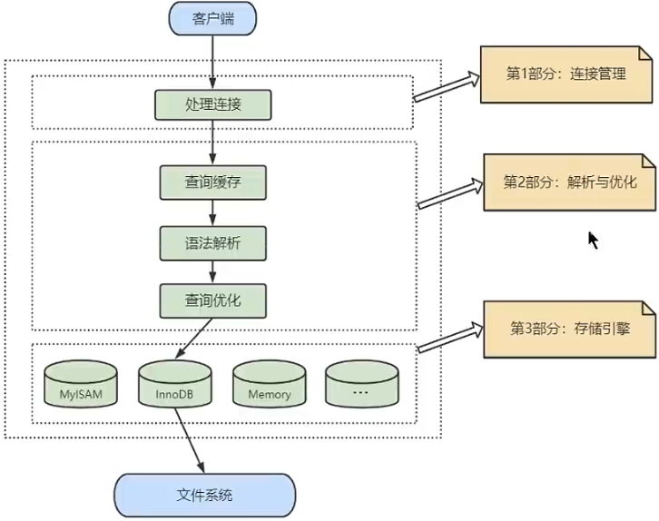

> 详细的逻辑架构图：

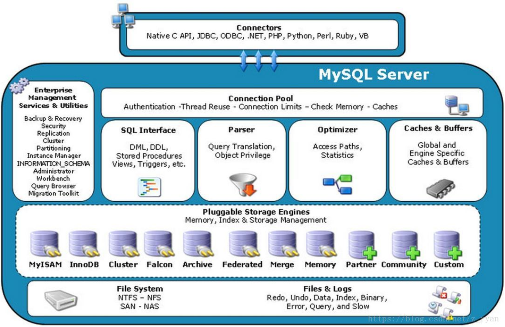

## 1、第一层：连接层
> Connection Pool：MySQL 客户端和服务端建立 TCP 连接，服务端单独分配一个线程对用户账号密码做身份认证、获取权限；
> - 若用户名或密码不对，报错：Access denied for user；
> - 若用户名密码认证通过，会从权限表查出账号拥有的权限；

## 2、第二层：服务层
**1、Management Serveices & Utilities**：系统管理和控制工具。备份、安全、复制、集群等；

**2、SQL Interface**：接收用户的 SQL 命令、返回用户的查询结果；

**3、Parser**：对 SQL 进行语法分析、语义分析、生成语法树；

**4、Optimizer**：优化 SQL (如：决定使用哪个索引、表的连接顺序、子查询转连接等)，确定 SQL 的执行路径，生成一个执行计划；

**5、Caches & Buffers**：缓存用户的查询结果，命中率太低，在 MySQL 8.0 中被删除，因为两个查询请求在任何字符上的不同 (如：空格、注释、 大小写)，都会导致缓存不会命中，当表的数据被修改时，会自动删除缓存，因此命中率更低。

> 语法树样例：

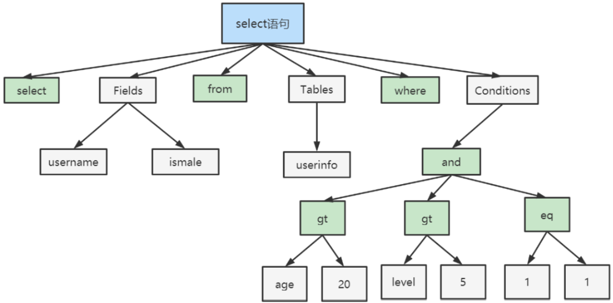

## 3、第三层：引擎层
> 真正负责了 MySQL 中数据的存储和提取；
>
> Pluggable Storage Engines**：存储引擎接口；
>
> MySQL 的存储引擎接口是可拔插的 (**存储引擎是基于表的，而不是数据库**)。

```sql
mysql> show engines;  	-- 查看所有存储引擎
mysql> show variables like 'default_storage_engine%';	  -- 查看当前数据库的存储引擎
```

> InnoDB VS MyISAM：
> - 几乎都是读操作可以选 MyISAM，否则用 InnoDB；
> - MySQL 部分系统表使用的是 MyISAM；
>
> **面试：为什么 MyISAM 读比 InnoDB 快？**
> - InnoDB 支持事务，查询时要有 MVCC 的比较过程；
> - InnoDB 非聚簇索引要回表，MyISAM 只有非聚簇索引，B-Tree 的叶子节点直接保存了记录的磁盘地址；
> - InnoDB 支持行锁，查询时还要检查是否加了表锁、行锁，MyISAM 只需要检查表锁！

| 对比项 | MyISAM | InnoDB |
| :---: | :---: | :---: |
| **外键** | 不支持 | 支持 |
| **事务** | 不支持 | 支持 |
| **锁** | 表锁，不适合高并发 | 行锁，**适合高并发** |
| 缓存 (MySQL 8 废弃) | 只缓存索引，不缓存真实数据 | 索引和真实数据都缓存，对内存要求较高，内存大小对性能有决定性影响 |
| 表空间 | 占的小 | 占的大 |
| 关注点 | 读性能 | 并发写、事务、资源 |
| 默认引擎 | MySQL 5.5 之前 | MySQL 5.5 及之后 |

## 4、存储层
> 所有的数据都存在文件系统上，以文件的方式存在，并完成与存储引擎的交互。

# 二、索引
## 1、索引简介
> 定义：索引是帮助 MySQL 高效获取数据的数据结构，索引两大作用：**查找（WHERE）、排序（ORDER BY）**。
>
> 索引的优势：
> - 查找：提高数据检索的效率，降低数据库的 IO 成本；
> - 排序：通过索引对数据进行排序，降低数据排序的成本，降低了 CPU 的消耗。
>
> 索引的劣势：
> - 每建立一个索引就要建立一个 B+Tree ，建索占磁盘空间；
> - 索引提高了读速度，但降低了写速度；因为增删改数据时，索引也要更新。

## 2、InnoDB 的索引
### 2.1、B+Tree
> 注意：B+Tree 的插入是先插入到叶子节点，再向上调整树；但 MySQL 的 B+Tree 是根节点一旦创建就不再改变，因此是将记录先插入根节点，再向下调整树。
>
> B+Tree 有多少层，磁盘 IO 就要多少次，一般情况下，B+Tree 不超过 4 层，因为 4 层能存很多记录！
>
> B+Tree 相对于其他数据结构的优点 (面试常问)：
> - Hash 表：获取数据 O(1)，但是无序，排序、范围查询效率低！
> - 二叉搜索树：会退化成单链表，且二叉树太高，不如 B+Tree 矮；
> - AVL 树：维护平衡的代价太大，且二叉树太高，不如 B+Tree 矮；
> - B-Tree VS B+Tree： 
>     - B+Tree 的高度比 B-Tree 小：B+Tree 只有叶节点保存完整的记录，非叶节点只保存【索引列的值 + 页号】，而 B-Tree 所有节点都保存完整的记录，因此 B+Tree 的非叶节点能保存更多的索引列，所以 B+Tree 高度更小；
>     - B+Tree 的查询效率更加稳定：B+Tree 只有叶子节点保存完整的记录，磁盘 I/O 次数都相等；对于 B-Tree 来说，越靠近树根，磁盘 I/O 次数越少；
>     - 对于范围查询说， B+Tree 只需遍历叶子节点链表即可， B-Tree 却需要重复地中序遍历；
> - B+Tree VS 跳表：B+Tree 比跳表更矮，因为 B+Tree 每个节点可以存多条数据！假设有 n 条数据，B+Tree 有 m 叉，则 h(B+Tree) = log<sub>m</sub>n，而 h(跳表) = log<sub>2</sub>n！
> - 自适应哈希索引：是 Innodb 引擎的一个优化，当某些索引值被使用的非常频繁时，会在内存中基于 B+Tree 之上再创建一个哈希索引，加速查找。这是一个完全自动的行为，用户无法控制或配置；

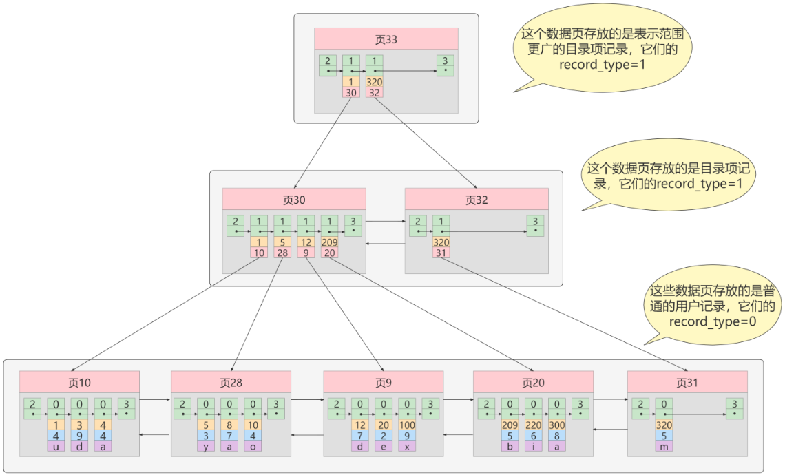

### 2.2、聚簇索引 & 二级索引
> 面试：为了减少磁盘 IO，索引树会一次性全部加载到内存吗？
>
> 答：不会，因为索引可能很大，B+Tree 一般都是 2~4 层，InnoDB 会将 B+Tree 的根节点常驻内存，因此只需要 1~3 次磁盘 IO。
>
> **InnoDB 默认以【页】为单位进行读写，一页 16KB (空间连续)，页之间通过双向链表连接！**
>
> 面试：3 层 B+Tree 能存多少条记录？
>
> 答：MySQL 的指针占 6B，假设主键为 bigint 占 8B，则 8+6=14B，一页能存 16KB/14B = 1170 个！
>
> 假设一条记录占 1KB，则一页能存 16 条记录，则 2 层的 B+Tree 能存 16 * 1170 条记录；
>
> 同理：3 层 B+Tree 能存 16 * 1170 * 1170 = 2190 2400 条记录！

> 如表 user(id, name, mobile, sex, age)，id 是主键，给 mobile 建立索引，给 (sex, age) 建立组合索引，因此存在三颗 B+Tree：
> - id 的 B+Tree 是聚簇索引；
> - mobile 的 B+Tree 是非聚簇索引；
> - (sex, age) 的 B+Tree 也是非聚簇索引。

**1、聚簇索引**
> InnoDB 支持聚簇索引，MyISAM 不支持；
> - 每个表**只有一个**聚簇索引，默认是主键；
> - 若无主键，用非空唯一索引字段代替；
> - **若无唯一索引，InnoDB 会隐式的定义一个主键作为聚簇索引。**
>
> 聚簇索引：B+Tree 非叶节点只保存【主键值 + 页号】，而叶子节点保存了完整的记录，因此通过主键能直接拿到记录；
>
> 注意：为了保证聚簇索引 B+Tree 的性能，InnoDB 表的主键尽量有序，**所以一般定义主键自增，否则 B+Tree 要不停的分裂调整！**

**2、非聚簇索引**
> 非聚簇索引 (二级索引)：B+Tree 非叶节点只保存【非聚簇索引字段值 + 页号】，且叶子节点没有保存完整的记录，保存的是"非聚簇索引字段 → 主键" 的映射；通过非聚簇索引查找记录时，要先通过非聚簇索引列拿到主键，**再通过主键拿到记录，这个过程称为回表**，因此要查两颗 B+Tree；
>
> 若叶子节点保存完整的记录，则每创建一个索引，所有记录都要复制一份，数据冗余！还要维护多份数据的一致性！

**3、组合索引**
> 组合索引的字段越少越好，因为 B+Tree 叶子节点要保存组合索引的字段，占空间。

## 3、索引分类
> - 普通索引：字段可以为 NULL 或不唯一；
> - 唯一索引：字段可以为 NULL (坑：NULL 可能会重复出现多次)、必须 UNIQUE；
> - 主键索引：NOT NULL + UNIQUE；
> - 全文索引：适合对长文本字段进行检索，已被 ES 等技术淘汰！

## 4、索引的增删改
```sql
-- 方式一：创建表时创建索引，索引名默认为列名
CREATE TABLE dept(
  id INT PRIMARY KEY AUTO_INCREMENT,            -- 主键索引
  name VARCHAR(20)
);
CREATE TABLE emp(
  id INT PRIMARY KEY AUTO_INCREMENT,            -- 主键索引
  name VARCHAR(20) UNIQUE,                      -- 唯一索引
  dept_id INT,
  CONSTRAINT emp_dept_id_fk FOREIGN KEY(dept_id) REFERENCES dept(id)  	-- 外键索引
);

-- 方式二：表已创建好，创建索引
-- column_name[length]：若列是字符串，可以指定给该列的前 length 个字符创建索引
CREATE [UNIQUE] INDEX index_name ON table_name(column_name[length], ...) [ASC | DESC] [VISIBLE | INVISIBLE]
-- MySQL 8.0 新特性：
-- 1.支持降序索引：默认 ASC，若 ORDER BY column_name DESC，则效率低
-- 2.支持隐藏索引，默认 VISIBLE。作用：
-- 	2.1 若直接删除表的索引，可能报错！将索引改为隐藏的，若不报错，就可以删除该索引！
--	2.2 将索引设置为隐藏的，则查询优化器不再使用该索引，若想验证某个索引是否有效，则可以分别将该索引设置为可见/隐藏去比较
-- 注意1：主键不能设置为隐藏索引
-- 注意2：隐藏索引虽然不会被使用，但依旧会随着数据的更新而更新，不要留着，删掉！
ALTER TABLE tablename ALTER INDEX index_name VISIBLE    # 切换成非隐藏索引

-- 删除索引
-- 删除表中的列时，如果该列 ∈ 组合索引，则组合索引会自动删除该列。如果组合索引的所有列都被删除，则整个索引将被删除
DROP INDEX [index_name] ON table_name

-- 查看索引：加上 \G ：以列的形式查看；不加则以表的形式查看
SHOW INDEX FROM table_name \G
```

## 5、索引的设计原则
> 建议：每张表建的索引最好不要超过 6 个！

**1、字段值具有唯一性**
> 有唯一性的字段尽量用唯一索引，而不是普通索引；
>
> 唯一索引效率比普通索引差，因为插入时要先检查数据是否存在；
>
> 阿里 《Java 开发手册》【强制】业务上具有唯一特性的字段，即使是多个字段的组合，也必须建成唯一索引。 说明：不要以为唯一索引影响了 insert 速度，这个速度损耗可以忽略，但提高查找速度是明显的；另外，即使在应用层做了非常完善的校验控制，只要没有唯一索引，根据墨菲定律，必然有脏数据产生。

**2、WHERE 后的字段**

**3、GROUP BY 或 ORDER BY 的列**
> GROUP BY 比 ORDER BY 更慢，因为 GROUP BY 是先排序后分组。
> - GROUP BY 后面只有一个字段，则建立普通索引，否则建立组合索引；
> - ORDER BY 后面只有一个字段，则建立普通索引，否则建立组合索引；
> - GROUP BY a, b 和 ORDER BY c, d 同时出现，则建立组合索引 (a, b, c, d)，a, b 在前，c, d 在后。

**4、DISTINCT 字段、统计字段**
> 面试：DISTINCT 和 GROUP BY 哪个效率高？
>
> 答：两者类似，都是先排序再分组；如果有索引，两者效率差不多；
>
>        如果没索引，DISTINCT 比 GROUP BY 效率高，因为 GROUP BY 在 MySQL8.0 之前会进行隐式排序，导致 filesort；
>
> MySQL8.0 删除了隐式排序，两者效率差不多；
>
> 统计字段如：count()、max()；

**5、 多表 JOIN 的连接字段**
> 见 "关联查询优化"
> - 连接表的数量尽量不要超过 3 张；
> - 对 WHERE 字段创建索引；
> - 对连接的字段创建索引。

**6、为字符串创建前缀索引**
> 不建议使用，建议用 ES；
>
> 阿里《Java 开发手册》【 强制 】：
>
> 在 varchar 字段上建立索引时，必须指定索引长度，没必要对全字段建立索引，根据实际文本区分度决定索引长度。
>
> 说明：索引的长度与区分度是一对矛盾体，一般对字符串类型数据，长度为 20 的索引，区分度会高达 90% 以上 ，可以使用字符串字段的区分度来确定索引长度。

> 前缀索引的好处：
> - B+Tree 不用保存完整的字符串，所占空间小；
> - 做字符串比较时不用全串比较，只需要比较前缀部分。
>
> 问题：前缀到底截取多长？
> - 截取的太长，则起不到前缀索引的好处；
> - 截取的太短，可能多个字符串的前缀都相同，没有区分度，需要更多次的查找！
> - 根据字符串字段的区分度截取！

```sql
-- 字符串字段的区分度的公式：越接近 1，说明区分度越大！
select count(distinct left(列名, 索引长度)) / count(*) from t

-- 若以下 4 个区分度都差不多，则选择短的
select 
    count(distinct left(address, 10)) / count(*) as sub10,   -- 截取前10个字符的选择度
    count(distinct left(address, 15)) / count(*) as sub11,   -- 截取前15个字符的选择度
    count(distinct left(address, 20)) / count(*) as sub12,   -- 截取前20个字符的选择度
    count(distinct left(address, 25)) / count(*) as sub13    -- 截取前25个字符的选择度
from t;

-- 注意：前缀索引会导致覆盖索引失效，因为二级索引叶子结点只有 address 部分信息，要想查 address 所有信息，必须回表
select id, address from  where address = 'asfnqwej'
```

> 注意：一旦对字符串字段使用了前缀索引，则查询该字段时，就用不了覆盖索引了，
>
> 因为前缀索引必须回表查看完整的字符串是否匹配。

> 【开发经验拓展】需求：数据库要保存身份证号
> -  若直接对 id_card 字段建立索引，则 B+Tree 的每个非叶节点都保存 id_card，而 id_card 特别长，导致 B+Tree 占磁盘空间大，且每个非叶节点能保存的 id_card 就变少，进而影响查询的效率； 
> -  若为 id_card 创建前缀索引，但同一个地区的身份证号的前面很多位都是相同的，区分度太低！ 
>
> 常用的解决办法：
> 1.  将身份证号逆序存储，然后用前缀索引； 
> 2.  对身份证号取哈希值 (常用)： 
>     -  id_card 依旧存储原始的身份证号，在表中增加一个字段 id_card_crc 用来存储 CRC32(id_card)，然后对 id_card_crc 字段创建索引即可。 
>     -  注意：MySQL 自带的 CRC32() 存在哈希冲突，因此查询时不能只查 id_card_crc，还要查 id_card，即： 
> + 这两种方法都不支持范围查询！

```sql
SELECT * FROM user 
WHERE id_card_crc = CRC32('input id_card string') and id_card = 'input id_card string'
```

**7、区分度高的列**
> 与 6 同理，区分度计算公式如下，区分度越接近 1 越好 (主键的区分度 = 1)，区分度超过 33% 就可以建索引了；
>
> 拓展：组合索引要把区分度高的列放在前面。

```sql
select count(distinct 列名) / count(*) from t
```

**9、最左前缀原则**
> 创建组合索引时，要把经常使用的列放在前面，可以增加组合索引的使用概率。

**10、组合索引优于单值索引**
> 当多个字段都要创建单值索引时，建议创建组合索引，因为单值也能使用组合索引。

不建议建索引：
- 数据少 (千条以下)；
- 经常增、删、改的字段；
- WHERE、GROUP BY、ORDER BY 后用不到的字段不要建索引；
- 区分度低的字段 (该列有大量重复数据) 不要建索引；
- 值无序的列，如该列保存 UUID、MD5 等无序数据；
- 不要定义冗余或重复的索引，如组合索引 (name(10), mobile) 和单值索引 (name)，后者冗余！
- 参与 MySQL 函数计算的列！

# 三、InnoDB 数据存储结构
p121 - p127

# 四、性能分析工具
## 1、数据库优化步骤
> - S：观察
> - A：行动

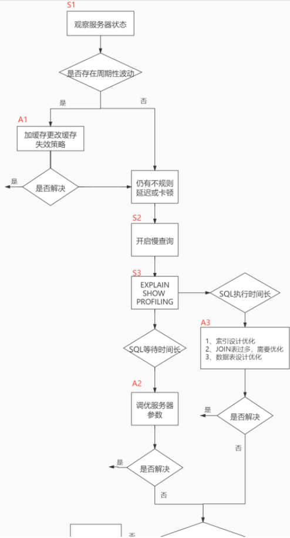 

<br/>

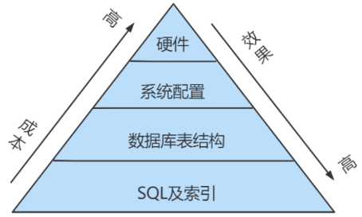

<!-- 这是一张图片，ocr 内容为： -->


## 2、查看 MySQL 性能参数
```sql
SHOW [GLOBAL|SESSION] STATUS LIKE '参数';
```
> 常用的性能参数如下：
> - Connections：连接 MySQL 服务器的次数；
> - Uptime：MySQL 服务器上线了多长时间；
> - Slow_queries：慢查询的次数；
> - Innodb_rows_%：执行 SELECT、INSERT、UPDATE、DELETE 查询返回、插入、更新、删除的行数；
> - Com_%：SELECT、INSERT、UPDATE、DELETE 操作的次数 (批量插入的 INSERT 操作，只累加一次)。

## 3、统计 SQL 查询成本
> 使用场景：用于比较开销，特别当我们有好几种查询方式可选时。

```sql
SHOW STATUS LIKE 'last_query_cost';		-- 统计最后一个查询语句的成本
+-----------------+-----------+
| Variable_name   |   Value   |
+-----------------+-----------+
| Last_query_cost | 20.134453 |			-- 大概需要进行 20 个页的查询
+-----------------+-----------+
```

## 4、慢 SQL
### 4.1、慢查询日志
> 慢查询阈值默认 long_query_time = 10s；
>
> **慢查询日志默认关闭，一般都是调优时开启，平时关闭，因为开启会影响性能 (记录日志会消耗 CPU 资源)。**

```sql
SHOW VARIABLES LIKE '%slow_query_log%';       -- 查看慢查询日志是否开启，默认为 OFF

SET global slow_query_log = 1;                -- 临时开启数据库的慢查询日志，MySQL 重启后失效，永久开启要修改配置文件

SHOW VARIABLES LIKE '%slow_query_log_file%';  -- 查看慢查询日志的文件路径

SHOW VARIABLES LIKE 'long_query_time';        -- 查看慢查询阈值，单位 s

SET long_query_time = 1;                      -- 设定慢查询阈值，单位 s

select sleep(2);                              -- 沉睡 2s

SHOW GLOBAL STATUS LIKE '%Slow_queries%';     -- 慢查询 SQL 数量
```

### 4.2、慢查询日志分析工具 mysqldumpslow
> 在 Linux Bash 下执行 mysqldumpslow 命令，参数如下：
> - -a：不加的话会把数字抽象成 N，字符串抽象成 S；
> - **-s：表示按照下列何种方式排序**
> - c：访问次数；
> - l：锁定时间；
> - r：返回记录；
> - **t：查询时间；**
> - al：平均锁定时间；
> - ar：平均返回记录数；
> - at：平均查询时间 (默认方式)；
> - ac：平均查询次数。
> - **-t：返回前 n 条的数据；**
> - -g：后边搭配一个正则匹配模式，大小写不敏感。

```bash
# 得到返回记录集最多的 10 个 SQL
mysqldumpslow -a -s r -t 10 /var/lib/mysql/atguigu-slow.log	# 慢查询日志的文件路径

# 得到访问次数最多的 10 个 SQL
mysqldumpslow -a -s c -t 10 /var/lib/mysql/atguigu-slow.log

# 得到按照时间排序的前 10 条里面含有左连接的查询语句
mysqldumpslow -a -s t -t 10 -g "left join" /var/lib/mysql/atguigu-slow.log

# 建议在使用这些命令时结合 | 和 more 使用 ，否则有可能出现爆屏情况
mysqldumpslow -a -s r -t 10 /var/lib/mysql/atguigu-slow.log | more
```

## 5、查看 SQL 执行生命周期 show profiles
> Mysql 默认开启 show profiles：

```sql
show variables like '%profiling%'
show profiles			-- 查看最近的 15 条 sql 运行信息
```

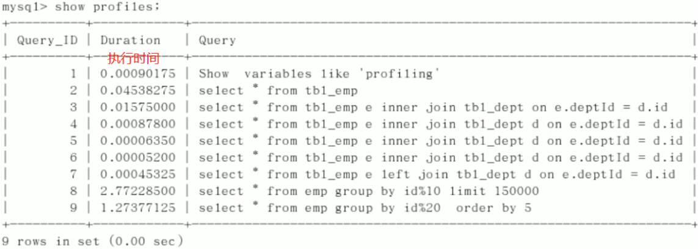

```sql
-- 查看 sql 执行的详细生命周期，包括：开始、检查缓存是否命中、查询表、存入缓存。。。。
show profile cpu, block io for query {Query_ID}
```

> 若 status 出现以下情况，则是性能瓶颈，必须优化 SQL：
> - converting HEAP to MyISAM：查询结果太大，内存不够用，需要往磁盘上搬；
> - creating tmp table：创建了临时表，消耗性能；
> - copying to tmp table on disk：将内存中的临时表复制到磁盘，极其消耗性能！
> - locked：死锁！

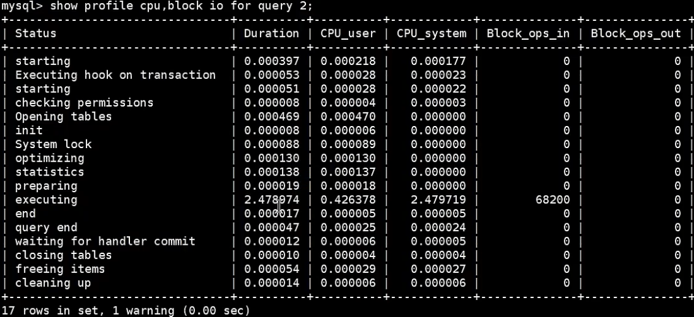

## 6、SQL 性能分析 EXPLAIN
> 关键字 EXPLAIN：查看优化器生成的最优的<font style="color:red;">**执行计划**</font>，并没有执行 SQL；

```sql
mysql> EXPLAIN SELECT * FROM users;
```

### 6.1、table
> 不论 SQL 多复杂，不管连接了多少个表 ，到最后都是分别对每个表进行单表访问的；
>
> SQL 有几张表， EXPLAIN 就会产生几条记录，有时产生临时表，如 UNION 查询，导致记录会更多。

### 6.2、<font style="color:red;">id</font>
> SELECT 语句的 id，表示查询表的顺序。
1. 多个 id 相同：表示同一个 SELECT 语句要查询多个表，执行顺序由上至下

2. 多个 id 不同：表示 SQL 中有多个 SELECT，id 越大优先级越高，越先被执行
   - 查询优化器会对 SQL 优化，所以就算写子查询，也不一定有多个 id，因为子查询可能被优化成连接查询

   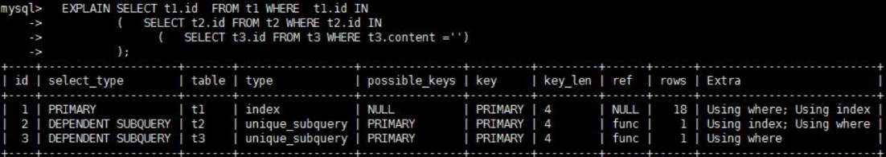
   
3. id 有相同也有不同：先执行 id 大的，id 相同的按顺序执行

4. id 为 null 则最后执行

### 6.3、select_type
> SQL 中小查询在大查询中扮演的角色，即：查询的类型，用于区别普通查询、联合查询、子查询等。
- SIMPLE：简单的 SELECT 查询，查询中不包含子查询或 UNION 查询； 
- SUBQUERY：非相关子查询被标记为 SUBQUERY，相关子查询被标记为 DEPENDENT SUBQUERY，若相关子查询是 UNION 查询，则被标记为 DEPENDENT UNION； 
- PRIMARY：子查询的最外层查询被标记为 Primary，UNION 查询的左表也被表记为 Primary； 
- DERIVED：在 FROM 列表中包含的子查询被标记为 DERIVED (派生表)； 
- UNION：UNION 查询的右表被表记为 UNION；若 UNION 包含在 FROM 子句的子查询中，则外层 SELECT 将被标记为 DERIVED； 
- UNION RESULT：UNION 查询的会产生临时表，临时表被标记为 UNION RESULT； 
- MATERIALIZED：子查询物化之后与外查询做连接，则子查询被标记为 MATERIALIZED，如： 
  ```sql
  select * from s1 where k1 in (select k1 from s2)
  ```

### 6.4、partitions (略)
### 6.5、type ⭐
> 查询的类型，从最好到最坏依次是：system > const > eq_ref > ref > ~~fulltext > ref_or_null > index_merge > unique_subquery > index_subquery~~ > range > index > ALL
>
> 阿里《Java 开发手册》：保证查询至少达到 range 级别，最好能达到 ref。

> - system：平时不会出现，可忽略不计；如 MyISAM 的 count(*) 是 O(1)，因为内部有变量记录个数； 
> - const：主键或唯一索引字段与常数匹配时。如：select * from t where id = 1； 
> - eq_ref：主键或唯一索引等值匹配时，如：select * from t1, t2 where t1.id = t2.id； 
> - ref：二级索引与常数匹配时，如：select * from t where name = "NJJ"，其中 name 建立了普通索引； 
> - range：对索引列范围查询，如 >、<、between、in，如：explain select * from actor where id > 1; 
> - index：使用了覆盖索引，比 all 好一点； 
> - all：全表扫描。 

### 6.6、possible_keys、key ⭐
> - possible_keys：查询时可能用到的索引；
> - key：查询时实际用到的索引。
> - 覆盖索引只出现在 key 中，不会出现在 possible_keys 中。

### 6.7、key_len ⭐
> 使用到索引字段的总长度，长度越大，则说明索引使用越充分，长度计算方式：
> - int = 4 字节，bigint = 8 字节；
> - 允许为空的字段要加 1 字节；
> - varchar 和 char 看字符集，utf8 要 ×3，utf8mb4 要 ×4，如 utf8mb4：char(20) = 80；
> - varchar 要额外加 2 字节，如 utf8mb4：varchar(20) = 82；若可为 null，则 83！

### 6.8、ref (了解)
> 显示索引列和哪一列进行等值匹配

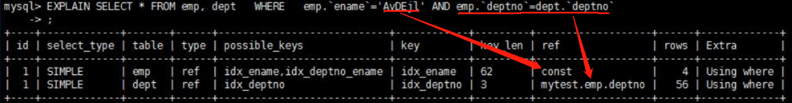

### 6.9、rows、filtered ⭐
> - rows：预计要读取的行数；
> - filtered：是百分比，rows * filtered 为实际要读取的行数；
> - rows 越小、filtered 越大越好。

### 6.10、Extra ⭐
> - No tables used：没有用到表； 
> - Impossible WHERE：WHERE 子句的值总是 false； 
> - Using where：使用了 where，但 where 有字段没有创建索引； 
> - <font style="color:red;">Using index</font>：使用了覆盖索引，不需回表； 
> - <font style="color:red;">Using index condition</font>：索引下推，省去了一些回表操作，比 Using index 稍好； 
> - <font style="color:red;">Using MRR：使用了 MRR，好；</font>
> - Using join buffer：连接查询时，被驱动表没有索引可用，则 MySQL 只能分配一块缓存去尽力加速连接操作； 
> - Not exists：查询某列为 NULL，但该列不允许为 NULL，则不存在； 
> - <font style="color:red;">**Using filesort</font>**：排序字段没有索引，只能全表排序，尽量避免！ 
> - <font style="color:red;">Using temporary</font>：创建了临时表，尽量避免！ 

### 6.11、EXPLAIN 输出格式
> 上面的是传统格式，除此之外，还有 JSON 格式、TREE 格式、可视化输出 (MySQL WorkBench 工具)；
>
> JSON 格式比传统格式多了查询成本的信息！

```sql
EXPLAIN FORMAT=JSON SELECT ....
```

### 6.12、SHOW WARNINGS
> 执行完 EXPLAIN SELECT 后，紧接着执行 SHOW WARNINGS\G，则会显示 SELECT 语句被优化器优化后的语句。

## 7、MySQL 监控分析视图 sys schema
> MySQL 5.7.7 将 performance_schema 表和 information_schema 表的数据以更容易理解的方式归纳成了 sys schema 视图！
>
> 注意：通过以下 SQL 查询 sys schema，会导致 MySQL 消耗大量资源去收集相关信息，严重时可能导致业务请求被阻塞，生产环境不要频繁查 sys schema 视图、performance_schema 表和 information_schema 表！

**1、索引相关**
```sql
-- 1.查询冗余索引
select * from sys.schema_redundant_indexes;
-- 2.查询未使用过的索引
select * from sys.schema_unused_indexes;
-- 3.查询索引的使用情况
select index_name, rows_selected, rows_inserted, rows_updated, rows_deleted
from sys.schema_index_statistics 
where table_schema='dbname';
```

**2、表相关**
```sql
-- 1.查询所有表的访问量，IO 次数
select table_schema, table_name, sum(io_read_requests+io_write_requests) as io 
from sys.schema_table_statistics 
group by table_schema, table_name 
order by io desc;
-- 2.查询占用 bufferpool 较多的表
select object_schema, object_name, allocated, data
from sys.innodb_buffer_stats_by_table 
order by allocated 
limit 10;
-- 3.查看表的全表扫描情况
select * from sys.statements_with_full_table_scans where db='dbname';
```

**3、语句相关**
```sql
-- 1.监控 SQL 执行的频率
select db, exec_count, query 
from sys.statement_analysis
order by exec_count desc;
-- 2.监控使用了排序的 SQL
select db, exec_count, first_seen, last_seen, query
from sys.statements_with_sorting 
limit 1;
-- 3.监控使用了临时表或者磁盘临时表的 SQL
select db, exec_count, tmp_tables, tmp_disk_tables, query
from sys.statement_analysis 
where tmp_tables > 0 or tmp_disk_tables > 0
order by (tmp_tables+tmp_disk_tables) desc;
```

**4、IO 相关**
```sql
-- 查看消耗磁盘 IO 的文件
select file, avg_read, avg_write, avg_read + avg_write as avg_io
from sys.io_global_by_file_by_bytes 
order by avg_read
limit 10;
```

**5、InnoDB 相关**
```sql
-- 行锁阻塞情况
select * from sys.innodb_lock_waits;
```

## 8、其他调优策略
> 见 "第12章_数据库其它调优策略.pdf"，视频 p159-p160

# 五、索引优化
## 1、索引失效情况
> **有时明明能走索引，但还是会全表扫描，因为 MySQL 查询优化器可能认为全表扫描的效率比【索引+回表】效率高！**
>
> **建议：区分度高的字段在组合索引中尽量靠前！**
>
> 索引失效时的解决办法：
> - 索引不合理，修改索引；
> - 不使用 select *，select 具体字段，以达到覆盖索引！

**1、最左前缀原则**
> 带头大哥不能死，中间兄弟不能断。
```sql
CREATE INDEX idx_a_b_c ON t1(a, b, c);

-- 全值匹配：以下三条 sql 均能使用到索引（WHERE 后的三个字段就算调换位置也可以！因为 MySQL 优化器会自动优化！）
EXPLAIN SELECT * FROM t1 WHERE a = 1
EXPLAIN SELECT * FROM t1 WHERE a = 1 AND b = 2
EXPLAIN SELECT * FROM t1 WHERE a = 1 AND b = 2 AND c = 3

-- 以下三条 sql 均为全表扫描，因为没有 a
EXPLAIN SELECT * FROM t1 WHERE b = 2
EXPLAIN SELECT * FROM t1 WHERE b = 2 AND c = 3

-- 以下 sql 只能使用到 a 索引，b、c 均失效，即：只使用部分索引
EXPLAIN SELECT * FROM t1 WHERE a = 1 AND c = 3
```

**2、不要操作索引列**
```sql
-- 对 a 字段建立索引，则：
EXPLAIN SELECT * FROM t1 WHERE a like 'Jerr%'     -- 用到索引

-- 对索引列使用函数，会扫描整个索引树
EXPLAIN SELECT * FROM t1 WHERE left(a, 4) = 'Jerr'
EXPLAIN SELECT * FROM t1 WHERE month(a) = 1

-- 字符串必须带引号，否则类型转换，会扫描整个索引树
EXPLAIN SELECT * FROM t1 WHERE a = 123

-- MySQL 会偷懒，扫描整个 id 索引树
EXPLAIN SELECT * FROM t1 WHERE id + 1 = 123
```

**3、范围之后全失效**
> 对于组合索引 (a, b)：
>
> **建议：范围查询字段一定要放到组合索引的最后面。**
>
> 面试：为什么范围查询会导致索引失效？
>
> 答：如 where a > 0，则 b 的索引失效，因为 a > 0 时 b 是无序的！

```sql
-- 索引只用到了 a，没用到 b，因为 a > 2 时 b 无序
EXPLAIN SELECT * FROM t1 WHERE a > 2 AND b = 1
/*
  索引全用到了，其实在 a = 2 时才会用到索引 b，a > 2 的数据不会用到索引 b
  因为对于组合索引 (a, b)，先按 a 排序，再按 b 排序，所以排序后的数据：
  a b
  2 3
  2 4
  3 2
  a > 2 时，b 无序；a = 2 时，b 有序！
*/
EXPLAIN SELECT * FROM t1 WHERE a >= 2 AND b = 1

-- 同理，between() 是闭区间，索引全用到了，其实只有在 a = 2 和 a = 8 时才会用到索引 b
-- like% 也是同理！
-- 但是不建议，毕竟等于的情况太少了，范围查询的情况太多，所以后面的索引虽然【可能】能用到，但效率并不高！
EXPLAIN SELECT * FROM t1 WHERE a BETWEEN 2 AND 8 AND b = 2
```

**4、不要使用 select***
> 尽量 select 具体字段名，达到覆盖索引；

**5、!=、>、<**
> - !=、>、< 会使索引失效，造成全表扫描； 
> - is not null 可能会使索引失效 (由 MySQL 版本和数据决定)； 
> - is null 是等值判断，不会使索引失效。 
>
> 因此设计表时尽量 not null default，因为可能造成索引失效，而且 NULL 值占磁盘空间，也不好进行一些操作。
>
> 面试：如果表中有字段为 null，又被经常查询，该不该给这个字段创建索引？
>
> 答：应该创建索引，使用的时候尽量用 is null 判断。

**6、in、not in**
> MySQL8 之前会导致索引失效，MySQL8 之后走索引！
```sql
-- age 有索引
select * from t1 where age not in (10, 20);
-- not in 走索引的原理：not in 会被拆成范围查询！但没卵用，范围太大了，查询优化器偏向于全表扫描！
select * from t1 where (age < 10) or (age > 10 and age < 20) or (age > 20)
```

**7、like**
> - %like% 和 %like 会使索引失效，造成全表扫描；
> - 例外：当表里只有主键和模糊字段时，左模糊匹配也能走索引：
```sql
-- 表 (id, name)    索引字段：id、name
-- 走索引，因为这里 select * == select id, name
-- 相当于覆盖索引，所以会对 name 的 b+ 树全部遍历一遍，拿到符合的叶子节点直接返回，不需要回表
-- 虽然走了索引，但还是全部遍历了 name 的 b+ 树！！！
-- 为什么遍历 id 的 b+ 树呢？因为聚簇索引叶节点保存了完整的记录，加载到内存很慢！
select * from t1 where name like '%张'
```
> - like% 会使用到索引，且 type = range，且 like% 后面的字段还能使用到索引；  
>   - 如 name like 'j%'，其实只有当 name = j 时，才能用到后面的索引字段！ 
>
> 阿里《Java 开发手册》【强制】：严禁左模糊和全模糊，如果需要，使用搜索引擎，如 ES。

**8、or**
> or 前后存在非索引列会使索引失效，直接全表扫描。
```sql
-- 给 a 和 b 必须都分别创建单值索引
EXPLAIN SELECT * FROM t1 WHERE a = 1 or b = 2
```

**9、面试题**
> - 表 (c1, c2, c3, c4, c5)
> - 复合索引 (c1, c2, c3, c4)
```sql
-- 索引全用到了
EXPLAIN SELECT * FROM test WHERE c1 = 'a1' and c2 = 'a2' and c4 = 'a4' and c3 = 'a3'
EXPLAIN SELECT * FROM test WHERE c1 = 'a1' and c2 = 'a2' and c3 = 'a3' and c4 = 'a4' and c5 = 'c5'

EXPLAIN SELECT * FROM test WHERE c1 = 'a1' and c2 = 'a2' and c3 > 'a3' and c4 = 'a4'      -- 索引用到了c1 c2 c3
EXPLAIN SELECT * FROM test WHERE c1 = 'a1' and c2 = 'a2' and c4 > 'a4' and c3 = 'a3'      -- 索引全用到了
EXPLAIN SELECT * FROM test WHERE c1 = 'a1' and c2 = 'a2' and c3 != 'a3' and c4 = 'a4'	  -- 索引用到了c1 c2
EXPLAIN SELECT * FROM test WHERE c1 = 'a1' and c2 = 'a2' and c3 is null and c4 = 'a4'	  -- 索引全用到了

EXPLAIN SELECT * FROM test WHERE c1 = 'a1' and c2 like '%a' and c3 = 'a3' and c4 = 'a4'   -- 索引只用到了 c1

-- MySQL5.6 之前，索引只用到了 c1、c2
-- MySQL5.6 及之后，索引只用到了 c1、c2，但由于索引下推，会过滤出 c3 = 'a3' and c4 = 'a4' 的数据后再回表，所以效率更高
EXPLAIN SELECT * FROM test WHERE c1 = 'a1' and c2 like 'a%' and c3 = 'a3' and c4 = 'a4'
EXPLAIN SELECT * FROM test WHERE c1 = 'a1' and c2 like 'a%aa%' and c3 = 'a3' and c4 = 'a4'
```

## 2、join 优化
> 连接表的数量尽量不要超过 3 张；
>
> MySQL 对内存敏感，关联过多会占用更多内存空间，使性能下降；
>
> MySQL 限制最多关联 61 张表；

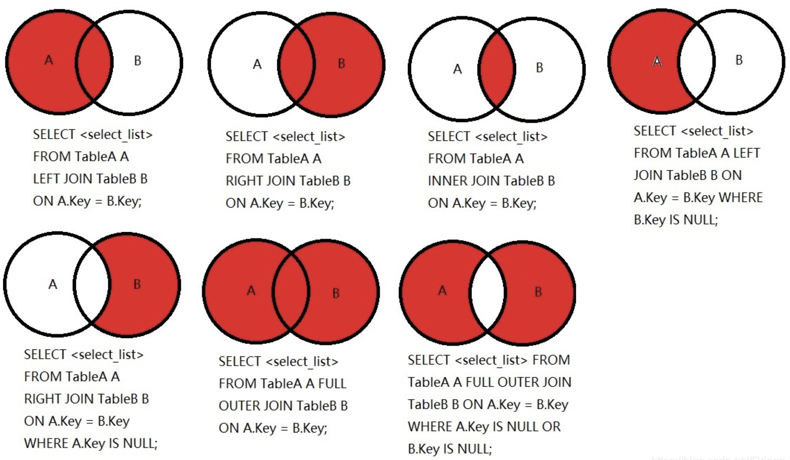

**1、单表**
```sql
EXPLAIN SELECT id, author_id FROM article WHERE category_id = 1 AND comments > 1 ORDER BY views DESC LIMIT 1

-- order by 会产生 Using filesort，因为 comments 是范围查询，导致 views 索引失效
CREATE INDEX cv on article(category_id, comments, views);
-- 正确建立索引的方法：消除了 Using filesort
CREATE INDEX cv on article(category_id, views);
```

**2、两表 join**
> t1 和 t2 的字段都是 (id, a, b)，t1 100 行数据，t2 1000 行，t2 的索引为 (a)；
```sql
SELECT * FROM t1 LEFT JOIN t2 ON t1.a = t2.a
```
> 若 t1 为驱动表，t2 为被驱动表，则 t1 需要全表扫描，t2 需要多次树查询，因此：
> - **小表驱动大表**时效率最高！（小表指的是经过 WHERE 条件过滤后数据量更小的表。）
> - 只需**为被驱动表的 join 字段创建索引**即可，驱动表的 join 字段不用创建，因为驱动表本来就要全表扫描！

**3、三表 join**
> 与两表 join 同理，驱动表的连接字段不需要创建索引，两个被驱动表的连接字段都需要创建索引。

## 3、子查询优化 (in / exists)
> 面试：子查询与 join 哪个效率高？
>
> 子查询效率低！原因：MySQL 会为子查询的结果集创建临时表，外层查询语句从临时表中查询记录，但临时表没有索引，所以效率低。查询完毕后，还要撤销临时表，这样会消耗过多的 CPU 和 IO 资源；

> in 和 exists 用哪个？原则：小表驱动大表！
>
> 如下，两条 SQL 执行结果完全等价，但当数据量 "B 表 < A 表" 时，用 in 效率高；反之用 exists 效率高，因为小表驱动大表！
```sql
select * from A where id in (select id from B)
select * from A where exists (select 1 from B where B.id = A.id)
```

## 4、排序优化
> **排序 (order by、group by) 可能会产生 using filesort，注意：using filesort 不一定就是效率最差的！有时候用上部分索引也会 using filesort，因为可能是 WHERE 过滤掉大部分数据，导致数据量小，走索引还不如直接排序快！！！**
>
> 注意：**没有筛选条件时，Order By 不走索引！** 如 select * from user order by id，依旧全表扫描；
>
> 排序时不要用 select *，使用 "select *" 更可能因为字段太多而使用双路排序，效率低；使用 "select 具体字段" 更可能使用单路排序，效率高！

```sql
select a from t where b = ? and c > 1 order by d
-- 建索引 (d,b,c,a)，不用排序，不用回表！
```

> 表字段：(a, b, c, d)
>
> 复合索引：(a, b, c)

```sql
-- 索引用到了 a b；其实 c 也用到了 (因为 a、b 是常量！)，用来加速排序，但不统计在 explain 中！
-- 也可能产生 using filesort，因为 WHERE 已经过滤掉大量数据，导致数据量小，filesort 可能比索引还快！
WHERE a = 'const' AND b = 'const' ORDER BY c
-- 索引用到了 a，b c 用来排序，也可能产生 using filesort
WHERE a = 'const' ORDER BY b, c
-- 索引用到了 a，b 用来排序，c 没用到；不要以为 "有 c = 'const'，b 就用不到了" ！也可能产生 using filesort
WHERE a = 'const' AND c = 'const' ORDER BY b
-- 索引用到了 a b，c 用来排序；
-- 不会产生 filesort，因为 ORDER BY c, b 等价于 ORDER BY c，因为 b 已经是常量了，没必要排序
WHERE a = 'const' AND b = 'const' ORDER BY c, b

-- 产生 using filesort：
-- 索引用到了 a，排序只用了 b，c 没用到，要想用到，必须【要升序都升序，要降序都降序】
where a = 'const' order by b asc, c desc    
where d = 'const' order by b, c		# 没用到索引，带头大哥不能死
where a = 'const' order by c, b		# 用到索引 a，中间兄弟不能断
where a > 'const' order by b, c		# 用到索引 a，范围之后全失效
where a in (....) order by b, c		# 用到索引 a，in 是范围查询，同上

-- 对于如下查询，创建组合索引 (a, b, c)，(a, c) 一般
where a = 'const' and b > 'const' order by c
```

```sql
-- group by 和 order by 法则几乎一致，因为分组前要先排序
-- 唯一区别：没有过滤条件，group by 也可以用上索引，但 order by 不行
where a = 'const' group by b, c   -- 索引用到了 a，b c 用来排序
where a = 'const' group by c, b   -- 索引用到了 a，产生临时表和 filesort！
```

## 5、优先考虑覆盖索引
> **覆盖索引："索引列 + 主键" 包含 "要查询的列"，不需要回表！**
>
> 原因：对于非聚簇索引，B+Tree 的叶子节点保存了 "索引列 + 主键"，所以若要查询的列被包含在叶子节点中，直接返回，不需要回表！同理，若要查询的列中，不全被包含在叶子节点中，则必须回表查找该列！
>
> **建议：为了使用覆盖索引，要 select 具体字段，不要 select \*；**

```sql
-- 表 (id, age, name, sex)
-- 组合索引 (age, name)
EXPLAIN SELECT * FROM student WHERE age != 20;                      -- 不会使用索引，因为 != 会造成索引失效
EXPLAIN SELECT age, name FROM student WHERE age != 20;              -- 用到了覆盖索引！因为在组合索引的叶子节点就能找到

EXPLAIN SELECT * FROM student WHERE name like '%eery';              -- 不会使用索引
EXPLAIN SELECT id, age, name FROM student WHERE name like '%eery';  -- 使用覆盖索引，且不需要回表查完整的 name
```

> 注意：一旦对字符串字段使用了前缀索引，则 select 该字段时，就用不了覆盖索引了，
>
> 因为前缀索引必须回表查看完整的字符串是否匹配。

## 6、索引下推 (ICP)
> 案例：select * from user where name like '张%' and age=10 and sex=1，组合索引 (name, age)；
>
> ICP (Index Condition Pushdown)：索引下推，服务层把过滤工作下推到引擎层，**减少回表次数（扫描索引时就尽可能过滤不符合的数据）！**
> 1. MySQL 5.6 之前，非聚簇索引查到叶子节点时，再一个个回表查询完整记录，再过滤记录（所有 name like '张%' 都要回表）；
> 2. MySQL 5.6 及之后，索引下推，非聚簇索引查到叶子节点时，先把不符合条件的叶子节点过滤掉，再回表，减少回表次数（满足 name like '张%' and age=10 的才回表）！
>
> ICP 只能用于非聚簇索引、和覆盖索引不能同时存在、若 WHERE 后的字段不在非聚簇索引中，则只能回表，不能 ICP。
>
> 感觉索引下推是一个设计缺陷，能在非聚簇索引上过滤，为啥还要回表。。。

## 7、MRR 优化
> Multi-Range Read：尽量使用顺序读盘（局部性原理：顺序读效率高）；
>
> 案例：select * from t where a between 1 and 100;	非聚簇索引 a；
>
> 查询时，每查一个 a 拿到一个 id 就要回表一次，最多回表 100 次，所有的 id 都是随机访问的，随机读磁盘效率太低；
>
> id 一般都是递增的，因此 MRR 就是把所有要回表的 id 保存到 read_rnd_buffer 并排序，按 id 的顺序去访问磁盘，效率更高！
>
> 注意：MRR 只适用于范围查询；MySQL 默认开启 MRR，但倾向于不使用，使用 set optimizer_switch="mrr_cost_based=off" 就能固定使用 MRR 了；
>

## 7、count()
> 结论：count(*) ≈ count(1) > count(id) > count(字段)
> - count(id)：扫描全表，引擎层要把 id 返回给服务层，服务层判断 id 是否为空，再按行累加；
> - count(*) ≈ count(1)：扫描全表，但不取字段值，因为 1 和 * 肯定不为空，不需要判断，直接按行累加，所以效率 > count(id)；
> - count(字段)：只统计非 null 个数；
>
> MySQL 对 count() 的优化：
> - MyISAM：每张表都维护了一个变量 row_count，row_count 的累加不会出现并发问题，因为有表级锁，时间复杂度 O(1)；
> - InnoDB：由于 InnoDB 支持事务，采用行级锁和 MVCC 机制，无法像 MyISAM 一样维护内部变量，需要全表扫描，O(n)；
> - InnoDB：当表中有非聚簇索引时，count(*)、count(1) 会统计非聚簇索引的行数，当没有非聚簇索引时，采用聚簇索引，因为非聚簇索引比聚簇索引小 (聚簇索引叶节点保存了完整的记录，加载到内存很慢)；

## 8、淘宝数据库主键
**1、自增 ID 的问题**
> 主键用自增的 BIGINT，不要用 INT：在架构设计上不及格！
>
> 注意：一般项目 INT 就够用了，可在前面加 unsigned 修饰，提高表示范围。
>
> 优点：自增 ID，简单；
>
> 缺点：
> - 可靠性不高：自增 ID 存在回溯的问题，MySQL 8.0 才修复；
> - 安全性不高：如接口：/user/1，可以非常容易猜测用户的 ID，用户总数，也非常容易通过接口进行数据的爬取；
> - 性能差：自增 ID 需要在数据库生成；
> - 交互多：业务还需要额外执行一次类似 last_insert_id() 的函数才能知道刚才插入的自增值，这需要多一次的网络交互。在海量并发的系统中，多一条 SQL，就多一次性能上的开销；
> - 局部唯一：而不是全局唯一，在分布式系统中行不通。

**2、业务字段作为主键**
> 会员卡号、手机号：会被回收利用；
>
> 身份证号：属于隐私信息，用户不一定愿意给你，所以一般情况下，手机号、身份证号字段都允许 NULL；

**3、淘宝的主键设计**
```plain
1550672064762308113
1481195847180308113
1431156171142308113
1431146631521308113
大胆猜测，淘宝的订单 ID 应该是 "时间 + 去重字段 + 用户ID后6位"
这样的设计能做到全局唯一，且对分布式系统查询及其友好。
```

**4、推荐的主键设计**
> - 非核心业务：如日志、监控等信息，用自增 ID 即可； 
> - 核心业务：要保证全局唯一 + 单调递增，用分布式 ID！

# 六、数据库设计规范
> - 超键：能唯一标识元组的属性集
> - 候选键：若超键不包含多余的属性，则为候选键；
> - 主键：从候选键中任选一个；
> - 主属性：所有候选键中的属性；
> - 非主属性：剩余属性。

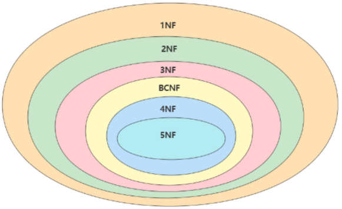

## 1、四大范式及反范式化
**1、1NF**
> 属性是原子的，不可再分。

**2、2NF**
> 非主属性不能局部依赖候选键，要完全依赖。
```sql
-- 姓名，年龄局部依赖于球员编号
(球员编号, 比赛编号) -> (姓名, 年龄, 比赛时间, 比赛场地，得分)

-- 对上表拆分，使其满足 2NF
(球员编号) -> (姓名，年龄)
(比赛编号) -> (比赛时间, 比赛场地)
```

**3、3NF**
> 非主属性不能传递依赖于候选键。
```sql
-- category_name 依赖于 category_id
sku_info(id, name, price, category_id, category_name)

-- 对上表拆分，使其满足 3NF
sku_info(id, name, price, category_id)
category(category_id, category_name)
```

**4、反范式化**
> 范式级别越高，数据冗余越少；同时，被拆分成更多的表，连接查询效率越低！时间和空间不可兼得！
>
> 反范式化是用空间换时间，针对查询操作。
>
> 常见的反范式化：
> - 给表中添加冗余字段，避免大量联表查询；
> - 给表中添加计算列，避免查询时计算。

```sql
-- category_name 依赖于 category_id，不遵循 3NF，category_name 就是冗余字段，
-- 若 sku_info 经常被查询，且每次查询时都需要查询 category_name，为了避免联表查询，可以这样设计
sku_info(id, name, price, category_id, category_name)
```

> 反范式化带来的问题：
> - 冗余字段占空间；
> - 更新表时，也要同步更新冗余字段，因此若某个字段经常被修改，则其不适合作冗余字段；
> - 数据量小时，反范式不能体现查询性能的优势，还会使数据库的设计变得复杂。

**5、BCFN**
> BCNF 是对 3NF 的微调：属性不能局部依赖于候选键，要完全依赖。
```sql
ware_info(id, admin, sku_id, sku_stock)
-- 假设一个仓库只有一个管理员，则：
(id, sku_id) -> (admin, sku_stock)
(admin, sku_id) -> (sku_id, sku_stock)
-- admin 部份依赖于候选键 (id, sku_id)，拆成两张表：
ware_info(id, admin)
stock_info(id, sku_id, sku_stock)
```

## 2、E-R 模型
> 别看了

## 3、PowerDesigner
> 是一款常用的数据库建模工具，可以方便地制作数据流程图、概念数据模型、物理数据模型，几乎包括了数据库模型设计的全过程。

# 七、事务
## 1、MySQL 事务
> MySQL 事务：通过 redo log、undo log、锁、MVCC 实现；
> - 原子性 (atomicity)：事务要么成功，要么回滚；通过【Undo Log】保证；
> - 一致性 (consistency)：事务前后数据的完整性必须保持一致；通过【持久性 + 原子性 + 隔离性】来保证；
> - 隔离性 (isolation)：多个并发事务之间的数据相互隔离、互不干扰；通过【锁 + MVCC】保证；
> - 持久性 (durability)：事务一旦提交，它对数据库中数据的改变就是永久性的 (持久化到磁盘)；通过【Redo Log】保证；

**1、隐式事务**
> MySQL 的隐式事务默认是开启的，每一条 DML 执行完毕后都会自动提交。
>
> 注意：DDL 语句执行后自动提交事务，与隐式事务是否开启无关。

```sql
SHOW VARIABLES LIKE 'autocommit'
SET autocommit = 0;		-- 关闭自动提交
```

**2、显式事务**
> 注意：只要是在显式事务代码块中，不管是 DML 还是 DDL，都不会自动提交，COMMIT 后才提交；

```sql
-- 1.开启事务
-- READ ONLY：事务只能读
-- READ WRITE：事务能读能写(默认)
-- WITH CONSISTENT SNAPSHOT：开启一致性读
START TRANSACTION [READ ONLY | READ WRITE] [WITH CONSISTENT SNAPSHOT]; 	-- 或 BEGIN，BEGIN 不能带参数

-- 2.提交事务
COMMIT;

-- 3.回滚事务
ROLLBACK;
```

## 2、事务并发问题和事务隔离级别
> - 脏读：T1 读取了 T2 还没有提交的数据，然后 T2 回滚了；
> - 不可重复读：T1 读数据后，T2 修改了这条数据并提交事务，T1 再读时发现**这条数据变了**；
> - 幻读：T1 读数据后得到一个结果集，T2 插入数据并提交事务，T1 再读时发现**结果集数量变化了**。

> SQL 标准规定的事务隔离级别：

| | 脏读 | 不可重复读 | 幻读 |
| --- | :---: | :---: | :---: |
| 读未提交 READ UNCOMMITTED | 有 | 有 | 有 |
| 读已提交 READ COMMITTED | 无 | 有 | 有 |
| 可重复读 REPEATABLE READ | 无 | 无 | 有 |
| 串行化 SERIALIZABLE | 无 | 无 | 无 |

> 事务隔离级别越高，锁粒度越大，数据一致性就越强，但并发度越低；
>
> 事务隔离级别的实现：锁、MVCC；

```sql
-- 查看 MySQL 默认的隔离级别
SHOW VARIABLES LIKE 'transaction_isolation';	-- REPEATABLE READ：可重复读！
-- 修改隔离级别
SET [GLOBAL|SESSION] TRANSACTION_ISOLATION = '隔离级别'
-- 其中，隔离级别格式：
-- READ-UNCOMMITTED
-- READ-COMMITTED
-- REPEATABLE-READ
-- SERIALIZABLE

-- GLOBAL：当前会话无效，再打开其他会话会生效
-- SESSIOM：仅在当前会话生效
-- 不管是 GLOBAL 还是 SESSIOM，MySQL 重启后都失效！要想不失效，必须写在配置文件中
```

# 八、锁和 MVCC
> 写写并发问题只能加锁解决，读写并发问题解决方案：
> - 加锁，性能低；
> - MVCC，性能高；
>
> MySQL 的锁从大体上可以分为：
> - 读锁：共享锁；
> - 写锁：排他锁。
>
> InnoDB 的读锁和写锁可以加在表上，也可以加在行上。
>
> 不管是表锁还是行锁，每个层级的锁数量是有限制的，因为锁会占用内存空间，锁空间的大小是有限的；
>
> 当某个层级的锁数量超过了这个层级的阈值时，就会进行锁升级，用更大粒度的锁替代多个更小粒度的锁，如行锁升级为表锁，则行锁的锁空间就空出来了，但同时并发度也下降了。

## 1、表锁
> 所有存储引擎都支持，加锁快，开销小，无死锁，锁的粒度大，锁冲突概率大，并发度低。
### 1.1、表级读写锁
```sql
create table book (
    id int not null primary key auto_increment,
    name varchar(20) default ''
) engine myisam;

create table author (
    id int not null primary key auto_increment,
    name varchar(20) default '',
    book_id int
) engine myisam;
```

```sql
lock table book read, author write  -- 当前会话对 book 表上读锁，对 author 表上写锁，其他会话并没有上锁！！！
show open tables                    -- In_use 字段：是否上锁  show open tables where in_use > 0
unlock tables                       -- 当前会话所有表都解锁
```

> 查看表锁的状态：
```sql
show status like 'table%'
-- Table_locks_immediate：立即获取锁的次数，每立即获取一次就 +1
-- Table_locks_waited：不能立即获取锁的次数，每阻塞一次就 +1，此值越大，说明表锁争用情况越严重
```

### 1.2、意向锁
> 意向锁是表锁；
>
> 问题：当 session1 给表加行级写锁后，session2 试图给该表加表锁，此时 session2 需要去判断该表中是否存在行锁，因此要遍历表中每条记录，效率低！
>
> 意向锁是 InnoDB 自动维护的：
> - 当给表加行锁时，InnoDB 会自动给该表添加意向锁，意向锁的作用就是**快速告诉别人当前表有无行锁**；
> - 意向锁和意向锁之间、意向锁和行锁之间都是共享的；
> - 意向锁和表锁是否共享互斥，与行锁和表锁的共享互斥是一样的，因为意向锁就是用来表示行锁的。
>
> 加表锁时，InnoDB 会判断该表是否有意向锁：
> - 若没有，直接加锁；
> - 若有，则直接判断表锁和意向锁是否互斥 (等价于判断表锁和行锁是否互斥，意向锁就是用来表示行锁的)， 
>     - 若兼容，则直接加表锁；
>     - 若互斥，则直接阻塞等待；
>     - 不需要再依次遍历每条记录！

### 1.3、自增锁 (了解)
> 主键自增也需要加锁，自增锁是表锁。

### 1.4、元数据锁 (MDL 锁) & Online DDL
> 问题：session1 读表，session2 改变表的结构 (如删除一列)，肯定不行！
>
> MDL 是表锁，存储引擎自动加锁；当对表做 CRUD 时，加 MDL 读锁；当对表结构做变更时，加 MDL 写锁。
>
> **面试：添加列、索引时会锁表吗？**
>
> 答：不一定，尽量使用 Online DDL 避免锁表！

> **<font style="color:red">Online DDL</font>**：alter table 时会锁表，导致表不可读写，Online DDL（MySQL 5.6 支持）可以避免锁表（默认开启），让 ddl 和 dml 并发执行！语法：
>
> [http://mysql.taobao.org/monthly/2021/03/06/](http://mysql.taobao.org/monthly/2021/03/06/)

```sql
ALTER TABLE `t` ADD COLUMN `name` varchar(8) NULL COMMENT '姓名', ALGORITHM = INPLACE, LOCK = NONE;
ALTER TABLE `t` ADD INDEX idx_name(name) USING BTREE, ALGORITHM = INPLACE, LOCK = NONE;
-- 若不指定 ALGORITHM 和 LOCK，默认都是 DEFAULT，建议显式指定；
-- 如 ALGORITHM = INPLACE，当无法执行 INPLACE 时，会报错；
-- 若不指定，可能使用 COPY 导致线上事故；
```

| ALGORITHM | 作用                                                                             |
| --- |--------------------------------------------------------------------------------|
| DEFAULT | 默认算法，从其他算法中选择最优，MySQL 5.6：INPLACE > COPY，MySQL 8.0.12：INSTANT > INPLACE > COPY |
| INPLACE | 直接在原表上修改，不会拷贝临时表                                                               |
| COPY | 创建临时表，ALTER 临时表，然后 Rename 替换原表；在此过程中，原表不可读写(就算指定 LOCK=NONE)，并且会消耗一倍的存储空间！                    |
| INSTANT | <font style="color:red;">8.0.12 引入，8.0.29 成为默认算法，可以快速添加删除列！</font>             |

| LOCK | 作用 |
| --- | --- |
| NONE | 无锁 |
| SHARED | 共享锁，可读不可写 |
| DEFAULT | 默认，由 MySQL 自行决定，尽量不加锁 |
| EXCLUSIVE | 互斥锁，不可读写 |

> 注意：并非所有操作都支持 Online DDL（会报错），详见：[https://dev.mysql.com/doc/refman/8.0/en/innodb-online-ddl-operations.html?spm=ata.21736010.0.0.79637f07BOwvw0](https://dev.mysql.com/doc/refman/8.0/en/innodb-online-ddl-operations.html?spm=ata.21736010.0.0.79637f07BOwvw0)
>
> 如：INPLACE 几乎支持所有操作列的命令！

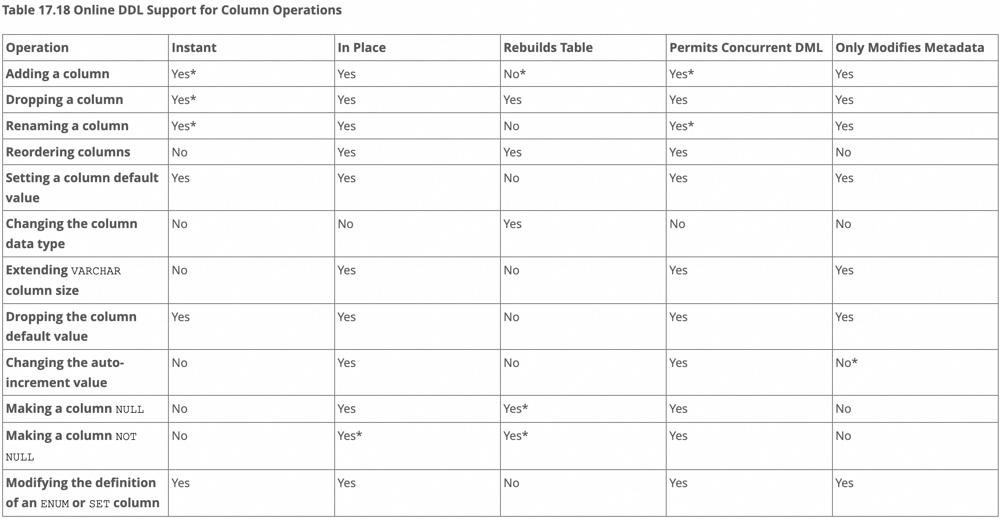

## 2、InnoDB 的行锁
> MyISAM 不支持，加锁慢，开销大，有死锁，锁的粒度小，锁冲突概率小，并发度高。

### 2.1、记录锁 Record Lock
> 解决的是**多个事务同时更新一行数据**；
>
> 和表级读写锁一样，只不过粒度是行；
```sql
select * from user where id = 5 lock in share mode;  -- MySQL5.7 加共享锁
select * from user where id = 5 lock for share;      -- MySQL8.0 加共享锁
select * from user where id = 5 lock for update;     -- 加排他锁
-- 注意：lock for share 和 lock for update 会给所有查询结果加行锁，若查询全表，则变为表锁！
-- 应用：详见 "分布式锁.md"
```

```sql
show status like 'innodb_row_lock%'
-- Innodb_row_lock_current_waits：当前正在等待锁的 sql 个数
-- Innodb_row_lock_time：从 MySQL 启动到目前，所有行锁锁定的总时长
-- Innodb_row_lock_time_avg：平均时长
-- Innodb_row_lock_time_max：最大时长
-- Innodb_row_lock_waits：从 MySQL 启动到目前，锁等待的总次数
```

> 注意：update 的 where 一定要走索引列，不然 update 会全表扫描，给所有记录上行锁，导致整张表被锁住，相当于上了表锁！

### 2.2、间隙锁 Gap Lock
> 解决幻读，防止同一事务的两次**当前读**出现幻读！

```sql
-- 记录：
(id, name,  age)
(1,   A,    25)
(3,   B,    20)
(8,   C,    23)
(9,   D,    24)

-- 若无间隙锁，session1 两次当前读结果集不一样，出现幻读
-- 若有间隙锁，session1 两次当前读结果集一样，因为 session1 给 id ∈ (3, 8) 上了间隙锁（ 临键锁(3,8] 退化为间隙锁(3,8) ），session2 插入数据被阻塞，
-- 需要 session1 手动 commit 后，session2 才插入成功，间隙锁保证了 session1 不会出现幻读，因为 session2 不能插入
-- 注意：session1 如果是快照读，则两次读的结果集一样，因为读的是快照；但无论是快照读还是当前读，都会加间隙锁！
                  session1                                                    session2
              
begin;
select * from user where id > 3 and id < 8 for update;
                                                           insert into user(id, name, age) values(5, 'NJJ');
select * from user where id > 3 and id < 8 for update;
commit;
```

> 间隙锁原理：
>
> 在 id 的 B+Tree 的叶子节点的链表中，(id = 3).next 指向 (id = 8)，但是这个 next 指针被上了间隙锁，所以在 id ∈ (3, 8) 之间不能插入数据，其他区间还是可以插入的。
>
> 注意：
> - 若 WHERE 是等值条件并且值存在，则加的是行锁（临键锁退化为行锁）；
> - 若 WHERE 是等值条件但值不存在，或范围查询，则加的也是间隙锁（临键锁退化间隙锁）；
> - 行锁 + 间隙锁，保证了事务 A select 之后，其他事务相应的 insert 操作会阻塞，因此不会出现幻读！
>
> 自己总结面试回答：
> - MySQL 默认隔离级别是可重复读，可重复读会导致当前读出现幻读，间隙锁就是解决幻读的！
> - 间隙锁只作用于索引列，因为查找时用到了索引，才会加行锁；若没有索引或索引失效，则会造成全表扫描，加的是表锁，表锁粒度大，不存在幻读的问题；
> - 间隙锁就是给索引列的一个开区间加锁，若当前事务还没提交，其他事务不能向这个开区间插入数据，所以避免了幻读！
> - 间隙锁的实现：给 B+Tree 的叶子节点的 next 指针上锁，所以其他事务不能插入数据。

```sql
-- 注意：面试但凡想不出来，就要往间隙锁死锁方向来想！！！
id  name  score
15    A    80
20    B    81
30    C    79
35    D    76

-- 事务 A 执行：
update t1 set score = 100 where id = 25;                -- 1
insert into t1(id, name, score) value (25, 'son', 90);  -- 3

-- 事务 B 执行：
update t1 set score = 100 where id = 26;                -- 2
insert into t1(id, name, score) value (26, 'ace', 90);  -- 4
```
> 答：发生死锁！
> - 事务 A 执行 1 时，会给 id ∈ (20, 30) 上间隙锁；事务 B 执行 2 时，也会给 id ∈ (20, 30) 上间隙锁；临键锁 (20, 30] 退化为间隙锁 (20, 30)，因为不等于 30！
> - 此时事务 A 执行 3 会被事务 B 上的间隙锁阻塞，事务 B 执行 4 会被事务 A 上的间隙锁阻塞！
> - **间隙锁之间是兼容的，即多个事务加的间隙锁可以有交集，并不存在互斥关系，因为多个间隙锁的目的是防止插入导致幻读，都是保护这个间隙区间的！**

### 2.3、临键锁 Next-Key Lock
> 临键锁 = 记录锁 + 间隙锁
>
> 间隙锁：开区间；
>
> <font style="color:red">临键锁加锁原则：</font>
> - <font style="color:red">左开右闭区间；</font>
> - <font style="color:red">查找过程中访问到的对象才会加锁；</font>
> - <font style="color:red">唯一索引等值查询可以退化为行锁；</font>
> - <font style="color:red">非唯一索引等值查询，向后遍历到最后一个值不满足等值条件的时候，可以退化为间隙锁。</font>

```sql
CREATE TABLE `t` (
  `id` int(11) NOT NULL,
  `c` int(11) DEFAULT NULL,
  `d` int(11) DEFAULT NULL,
  PRIMARY KEY (`id`),
  KEY `c` (`c`)
) ENGINE=InnoDB;

insert into t values(0,0,0),(5,5,5),(10,10,10),(15,15,15),(20,20,20),(25,25,25);
```

> 案例一：
> - SessionA 加临键锁 (5,10]，由于 id=7，<font style="color:red">退化成间隙锁</font> (5,10)；
> - SessionC 先删后查会失败，因为删除后导致间隙变大，间隙锁变为 (5,15)！

| Session A | Session B | Session C                                                                                                                                            |
| --- | --- |------------------------------------------------------------------------------------------------------------------------------------------------------|
| begin;<br/>update t set d=d+1 where id=7; | |                                                                                                                                                      |
| | insert into t values(8,8,8); <font style="color:red">(blocked)</font> |                                                                                                                                                      |
| | | update t set d=d+1 where id=10; <font style="color:green">(Query OK)</font>                                                                          |
| | | delete from t where id=10; <font style="color:green">(Query OK)   </font>insert into t values(10,10,10); <font style="color:red">(blocked)</font> |

> 案例二：
> - SessionA 给普通索引 c 加临键锁 (0,5]，<font style="color:red">由于 c 是普通索引，还要向后扫描，直到 c!=5</font>，因此给 (5,10) 也加锁（如果是唯一索引扫描到 5 即可）；
> - SessionB 正常执行，因为 SessionA 使用了覆盖索引，不需要回表，因此不用给主键索引 id 加锁；
> - SessionC 被临键锁阻塞；
>
> 注意：
> - 锁是加在索引上的，不同索引上的锁是不冲突的！
> - 如果 SessionA 是 for update，则系统认为接下来要更新数据，会给逐渐索引 id 也加临键锁，SessionB 就会被阻塞！

| Session A | Session B | Session C |
| --- | --- | --- |
| begin;<br/>select id from t where c=5<br/>lock in share mode; | | |
| | update t set d=d+1 where id=5; <font style="color:green">(Query OK)</font> | |
| |  | insert into t values(7,7,7); <font style="color:red">(blocked)</font> |

> 案例三：
> - SessionA 加临键锁 (5,10]，由于 id 是唯一索引且等值查询，<font style="color:red">退化成行锁</font> [10]；加临键锁 (10,15]，退化成间隙锁 (10,15)；
> - 如果 id 换成 c，则 SessionA 加临键锁 (5,10]，<font style="color:red">由于 c 不是唯一索引，不会退化成行锁</font> [10]；加临键锁 (10,15]，退化成间隙锁 (10,15)；SessionB 会被阻塞；

| Session A | Session B | Session C |
| --- | --- | --- |
| begin;<br/>select * from t where id>=10 and id<11 for update; | | |
| | insert into t values(8,8,8); <font style="color:green">(Query OK)</font><br/>insert into t values(13,13,13);<font style="color:red"> (blocked)</font> | |
| |  | update t set d=d+1 where id=15; <font style="color:green">(Query OK)</font> |

> 案例四：SessionA 加临键锁 (5,10]、(10, 15)；

| Session A | Session B | Session C |
| --- | --- | --- |
| begin;<br/>delete from t where c=10; | | |
| | insert into t values(12,12,12); <font style="color:red">(blocked)</font> | |
| |  | update t set d=d+1 where id=15; <font style="color:green">(Query OK)</font> |


> 案例五：加锁的方向和排序条件有关，倒序多加一个锁
>
> + SessionA 需要找到最右边的 20，加临键锁 (20,25)；再加 (15,20]；再向左找到第一个不满足 c>=15 的，即 (10,15]，由于倒序，会额外多加一个间隙 (5,10]；
> + SessionA 在普通索引 c 上加的锁是 (5,25)，由于 select * 需要回表，因此在主键索引 id 上加行锁 id=10、15、20；
>

| Session A | Session B |
| --- | --- |
| begin;<br/>select * from t where c>=15 and c<=20 order by c desc lock in share mode; | |
| | insert into t values(11,11,11); <font style="color:red">(blocked)</font><br/>insert into t values(21,21,21);<font style="color:red"> (blocked)</font><br/>insert into t values(6,6,6);<font style="color:red"> (blocked)</font> |

### 2.4、插入意向锁
> 事务在插入记录前需要判断插入位置是否被别的事务加了间隙锁 / 临键锁，如果加了，则插入操作阻塞等待，直到间隙锁 / 临键锁释放。但 InnoDB 规定事务在阻塞等待时也需要在内存中生成一个锁结构，表明有事务想在某个间隙中插入新记录，但现在在等待。这种锁就是插入意向锁，在 insert 操作时产生。

### 2.5、页锁 (了解)
> 大小：行 < 页 < 表；
>
> 所以页锁介于行锁和表锁之间，并发一般，会出现死锁；

## 3、死锁
```sql
-- session1:
bigin;
update user set name = 'NJJ' where id = 1;    -- 成功，但锁没释放，事务结束后才释放

-- session2:
begin;
update user set name = 'ZJH' where id = 2;    -- 成功，但锁没释放，事务结束后才释放
update user set name = 'NJJ' where id = 1;    -- 阻塞

-- 此时在 session1:
update user set name = 'ZJH' where id = 2;    -- session1 和 session2 构成死锁
```

> MySQL 解决死锁的策略：
```sql
-- 锁的超时时间默认为 50s，即：上锁 50s 后还没释放，则 MySQL 会自动释放这个锁，所以当发生死锁时，50s 后会自动释放
-- 能不能把这个参数调小点，让死锁发生后立刻释放？不行！因为会误伤！
-- 若没有发生死锁，只是正常的抢夺锁失败而陷入阻塞，这个参数过小就会误伤！
show variables like 'innodb_lock_wait_timeout';
```

```sql
-- 死锁后，MySQL 会主动回滚死锁链条中的某个事务（回滚持有最少行级排他锁的事务，这样回滚代价最小），让其他事务继续执行
-- 死锁检测是有代价的：每次获取锁失败而阻塞时，都要花时间去判断当前线程和其他与这把锁有关的线程是否构成死锁
show variables like 'innodb_deadlock_detect';    -- 默认开启
```

## 4、InnoDB 锁的内存结构
> [https://www.bilibili.com/video/BV1iq4y1u7vj?p=182](https://www.bilibili.com/video/BV1iq4y1u7vj?p=182)

## 5、MVCC
> MVCC (Multi Version Concurrency Control)，多版本并发控制，**只有 InnoDB 支持**。
>
> **MVCC 的作用：**
> - **支持快照读，提升写后读的并发度 (类似于 Java 的写锁降级为读锁)；**
> - **配合 Read View 实现了两个隔离级别：读已提交、可重复读；**
> - **在可重复读的隔离级别下，解决快照读的幻读问题 (当前读的幻读问题由临键锁解决)！**

### 5.1、快照读、当前读
> T1 写操作还未提交，则 T2 不能读，但 T2 能读该数据更新前的历史快照，因此不用等待锁释放！
> - 快照读：不加锁的 SELECT 都属于快照读，快照读基于MVCC，读取的是数据的历史快照，不一定是最新数据；
> - 当前读：加锁的 SELECT 和增删改都属于当前读，读的是数据的最新版本，而不是历史快照，因此一定要等锁先释放再读。

### 5.2、MVCC 原理
> 在 MySQL 中，每条记录都有 1 个隐藏字段 trx_id，表示最新修改这条记录的事务 id；

```sql
-- 假设 id = 8 的事务向 user 表插入一条数据：
insert into student values(1, '张三', '一班');
-- 则会向 Undo Log 中插入一条：
(1, '张三', '一班', 8)	 # trx_id = 8
```

```sql
-- 事务 A (id = 10)：
update student set name = '李四' where id = 1;
update student set name = '王五' where id = 1;
-- 事务 B (id = 20)：
update student set name = '钱七' where id = 1;
update student set name = '宋八' where id = 1;
```

> 则该条记录在 Undo Log 中保存的历史快照：

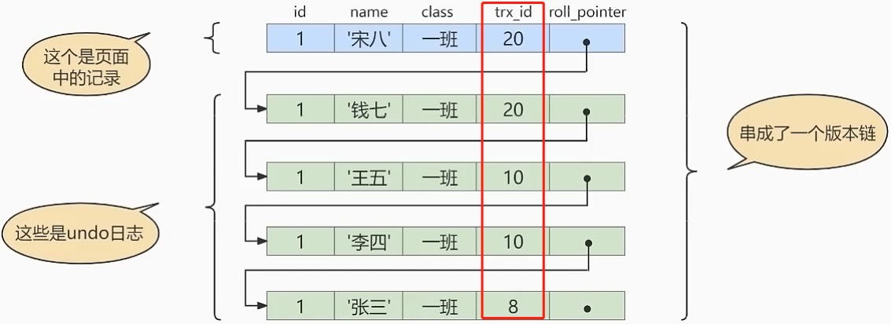

> 原理：MVCC 的实现依赖于：
> - trx_id：记录的隐藏字段，表示最新修改这条记录的事务 id；
> - **Undo Log**：保存了数据所有的历史快照（只保存箭头，而不是把 DB 所有数据都备份一遍）；
> - **Read View**：决定到底读哪个版本的快照。
>
> Read View：告诉事务数据的哪些版本是可见的，Read View 内部有 4 个字段比较重要：
> - creator_trx_id：创建这个 Read View 的事务的 id；
> - trx_ids：创建 Read View 时，当前系统中所有活跃的事务的 id 列表 (尚未提交的事务)；
> - up_limit_id：活跃的事务中最小的事务 id；
> - low_limit_id：创建 Read View 时，当前系统应该为下一个即将到来的事务分配的 id 值 (系统给事务分配 id 类似主键自增)。
>
> Read View 的规则：
> 
> - 若记录的 trx_id < up_limit_id，即：trx_id 在当前事务开启前已经提交，所以该版本能被当前事务访问； 
> - 若记录的 trx_id >= low_limit_id，即：trx_id 在当前事务开启后才开启，不管有没有提交，该版本都不能被当前事务访问； 
> - 若记录的 trx_id ∈ [up_limit_id, low_limit_id)，要先判断 trx_id 是否在 trx_ids 中： 
>     - 若在，说明生成该记录的事务还是活跃的，还没提交，所以该版本不能被访问； 
>     - 若不在，说明该记录在当前事务开启前已经提交，该版本可以被访问。 
> - 若记录的 trx_id 符合 Read View 的规则，则将该纪录添加到结果集中，否则就在 Undo Log 中找更早的历史快照继续比较。 
> - 即：MVCC 就是读快照时，只会读这条记录最后被提交的版本。 

### 5.3、MVCC 和事务隔离级别
> - 读未提交：**MVCC 不起作用**，因为读的是数据的最新版本，不是历史快照； 
> - 可串行化：**MVCC 不起作用**，因为读的是数据的最新版本，不是历史快照； 
> - 读已提交：**事务中的每个 SELECT 都会重新创建一次 Read View**，为什么会出现不可重复读和幻读？因为若前后两个 Read View 不同，就可能出现不可重复读或幻读； 
> - 可重复读：**事务中只有第一个 SELECT 会创建 Read View**，为什么可以重复读？幻读是怎么解决的？因为后面的 SELECT 都用这个 Read View，整个事务中的 Read View 都相同，所以可以重复读，不会出现幻读。 

### 5.4、案例
> 在可重复读的隔离级别下，假设 trx_id = 10 的事务插入了一条数据并提交：
>
> 
>
> 此时，事务 A (trx_id = 20) 和事务 B (trx_id = 30) 并发执行，事务 A 生成的 Read View：
> - creator_trx_id：20；
> - trx_ids：[20, 30]；
> - up_limit_id：20；
> - low_limit_id：31。

```sql
-- 此时事务 A 能查到记录 (1, '张三')，为什么？
-- 因为该记录的 trx_id = 10 < min(trx_ids) = 20，说明该条记录早已提交，当然能查出来
select * from student where id >= 1;
```

```sql
-- 此时事务 B 插入两条记录并提交，Undo Log 如下图
insert into student(id,name) values(2,'李四');
insert into student(id,name) values(3,'王五');
```

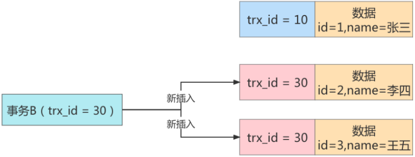

> 此时事务 A 再次查询，结果还是 (1, '张三')，为什么？
>
> 因为是可重复读，事务 A 第二次 select 不会生成新的 Read View，用的还是之前的；
>
> 事务 A 查不到 (3, '王五') ，因为 trx_id = 30 ∈ [up_limit_id, low_limit_id)，且 trx_id ∈ trx_ids，说明事务 A 创建 Read View 时事务 B 时活跃的，即：事务 A 和事务 B 的执行是交叉的，不是串行化的，因此这条数据不能让事务 A 看到；
>
> 同理，事务 A 也查不到 (2, '李四')；
>
> 事务 A 能查 (1, '张三')，和第一次查询一样；
>
> 因此，事务 A 前后两次查询结果是一样的，可重复读，也不会出现幻读！

### 5.5、再谈幻读
> 当隔离级别为可重复读时：
> - 若事务中只有快照读，则幻读问题可由 MVCC 解决；
> - 若事务中只有当前读，则幻读问题由临键锁解决；
> - MySQL 并没有完全解决幻读：若事务中先快照读，再当前读，则出现幻读问题！如：T1 中先执行快照读，T2 插入数据并提交，T1 再执行当前读 (如：以相同条件更新数据)，会发现 T2 新插入的数据也被 T1 更新了，出现幻读！

# 九、日志
> 日志的弊端：
> - 日志功能会降低 MySQL 数据库的性能，因为记录日志要消耗 CPU 资源；
> - 日志会占用大量的磁盘空间 。

## 1、慢查询日志 (slow query log)
## 2、通用查询日志 (general query log)
> 记录用户的所有操作，包括
> - 启动和关闭 MySQL 服务；
> - 所有用户连接的开始时间和截止时间；
> - 所有 SQL 指令等。
>
> 当数据发生异常时，可以查看通用查询日志， 还原操作时的具体场景，帮助我们准确定位问题。

**1、查看日志**
```sql
SHOW VARIABLES LIKE '%general%';
+-------------------+-------------------------------------------------------+
|   Variable_name   |                         Value                         |
+-------------------+-------------------------------------------------------+
|    general_log    |                          OFF                          |   -- 默认关闭，因为消耗 cpu
|  general_log_file | D:\Mysql\mysql-5.7.30-winx64\data\LAPTOP-4MLB03NQ.log |   -- 默认文件名是 主机名.log
+-------------------+-------------------------------------------------------+
-- 注意：通用查询日志默认关闭，所以刚开始是没有日志文件的，只有默认的文件路径，必须开启后才会自动生成日志文件
```

**2、开启 / 关闭日志**
```sql
-- 临时开启
SET GLOBAL general_log = on;
SET GLOBAL general_log_file = 'path/filename';	-- 可以不写路径和文件名，使用默认的
-- 临时关闭
SET GLOBAL general_log = off;
```

```bash
# 永久开启
[mysqld]
general_log=ON
general_log_file=[path[filename]]   # 可以不写路径和文件名，使用默认的
# 永久关闭
general_log=OFF  # 或直接把上面的 general_log=ON 注掉
```

**3、删除 / 刷新日志文件**
> 关闭日志功能，直接手动删除或重命名即可，再开启日志功能，发现就会自动生成新的空日志文件；
>
> 或者在日志功能开启的情况下，手动删除日志或重命名即可，然后用 mysqladmin -uroot -p flush-logs 重新生成空日志文件。

## 3、错误日志 (error log)
> 记录 MySQL 服务的启动、运行、停止时出现的问题，方便我们了解服务器的状态；
>
> 错误日志默认开启，且无法关闭！

**1、查看日志**
```sql
SHOW VARIABLES LIKE 'log_err%';
+-------------------+-------------------------------------------------------+
|   Variable_name   |                         Value                         |
+-------------------+-------------------------------------------------------+
|  general_log_file | D:\Mysql\mysql-5.7.30-winx64\data\LAPTOP-4MLB03NQ.err |  
+-------------------+-------------------------------------------------------+
-- Windows 下默认文件名是 主机名.err
--  Linux  下默认文件名是 mysqld.log
```

```bash
[mysqld]
log-error=[path/[filename]] 	# 配置日志文件路径
```

**2、删除 / 刷新日志文件**
> 手动删除日志或重命名，然后执行下列指令即可生成新的空日志文件：

```bash
install -omysql -gmysql -m0644 /dev/null /var/log/mysqld.log
mysqladmin -uroot -p flush-logs
```

## 4、binlog
> **记录所有写操作**，作用：数据备份、主从复制

### 4.1、配置
**1、查看日志配置**
```sql
show variables like '%log_bin%';
+---------------------------------+---------------------------------------------------+
|          Variable_name          |                       Value                       |
+---------------------------------+---------------------------------------------------+
|             log_bin             |                        ON                         |		# 默认开启
|        log_bin_basename         |    D:\Mysql\mysql-5.7.30-winx64\data\mysql-bin    |
|          log_bin_index          | D:\Mysql\mysql-5.7.30-winx64\data\mysql-bin.index |
| log_bin_trust_function_creators |                        OFF                        |
|    log_bin_use_v1_row_events    |                        OFF                        |
|           sql_log_bin           |                        ON                         |
+---------------------------------+---------------------------------------------------+
-- log_bin_basename：是所有 binlog 文件名的前缀
-- log_bin_index：每次启动 MySQL，都会生成新的 binlog，靠 index 区分，如：mysql-bin.000001、mysql-bin.000002
-- 注意：Linux 下，binlog 文件名为 binlog.000001 ...
-- log_bin_trust_function_creators = OFF：不信任 binlog 中的函数，如：master 插入数据用到了 NOW() 函数，slave 复制时当然不能用 Now()，因为主从复制需要时间，两个 NOW() 肯定不是同一个时间！
-- sql_log_bin = ON：增删改的 SQL 都会记录到 binlog 中
```

**2、开启 / 关闭日志**
```bash
# 永久修改
[mysqld]
# log_bin_basename 变成了 D:\Mysql\mysql-5.7.30-winx64\data\njj-bin
# 注意：数据和 binlog 不要放在同一个磁盘上，不然磁盘坏了数据就都没了，可以把 binlog 设置为其他的路径
log-bin=njj-bin						
binlog_expire_logs_seconds=600    # binlog 过期时间 600s，过期自动清除，默认 30 天
max_binlog_size=100M              # 单个 binlog 文件的最大大小，一般不改，默认值和最大值都是 1GB，超过了则创建新的 binlog。若文件已经 0.99999GB，而当前事务还没结束，可该事务也会向这个 binlog 中插入数据，即使会超过 1GB
```

### 4.2、日志格式
> - Statement (默认)：记录 SQL 命令，日志量小；缺点：有些 MySQL 函数，如 Now()，只记录函数是有问题的，要记录值！
> - Row：记录数据，日志量大；记录 Now() 的值，不存在问题；
> - Mix：两者结合，可能引发主备数据不同时用 Row，否则用 Statement；缺点：无法识别系统变量。
> - 现在越来越多的场景要求 binlog 格式设置成 Row，理由：**恢复数据、同步**更方便，阿里就是 Row，日志大无所谓，磁盘不值钱。

```sql
show variables like 'binlog_format';
+---------------+-------+
| Variable_name | Value |
+---------------+-------+
| binlog_format |  ROW  |
+---------------+-------+
```

### 4.3、数据恢复案例
```sql
insert into student values(20, 'aaa', 'No.1');
insert into student values(21, 'aaa', 'No.1');
insert into student values(22, 'aaa', 'No.1');
delete from student where id >= 20;	# 误删，怎么恢复前面的三条数据？
```

```sql
show binary logs;
+---------------+-----------+
|   Log_name    | File_size |
+---------------+-----------+
| mysqld.000001 |    179    |
| mysqld.000002 |    2691   |
+---------------+-----------+
```

> 可以看到，前面 3 条 SQL 都保存在了最新的日志文件 mysqld.000002 中，我们要创建并使用新的日志文件 mysqld.000003，不然数据恢复时，写操作又记录在  mysqld.000002 中了...

```sql
flush logs;	  -- 生成新的日志文件 mysqld.000003
```

> 查看 binlog：

```sql
show binlog events IN 'mysqld.000002';
```

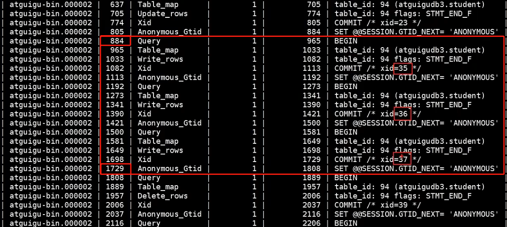

> 怎么定位开始结束 pos？前面的三条 insert 是连续执行的，所以 MySQL 生成的 xid 也是连续的，所以是 xid = 35、36、37 三条！
>
> 数据恢复命令：

```bash
mysqlbinlog [option] filename | mysql –uuser -ppass;
# option:
# --start-date 和 --stop-date：按照 Bin Log 中的起始时间点和结束时间点恢复数据
# --start-position 和 --stop-position：按照 Bin Log 中数据的开始位置和结束位置进行恢复
```

```bash
# 用位置信息 pos 恢复数据：
mysqlbinlog --start-position=884 --stop-position=1729 
--database=atguigudb3 mysqld.000002 | mysql –uroot -p123456 -v atguigudb3;
```

> 数据恢复成功！同理，update、delete 也可以恢复。

### 4.4、查看、删除日志
**1、查看**
```sql
show binary logs;    -- 查询所有 binlog 文件
```

> binlog 是二进制的，无法直接打开，可用以下命令，将 binlog 以伪 SQL 打印出来，并附带时间戳信息：

```sql
mysqlbinlog -v --base64-output=DECODE-ROWS "binlog 路径"
```

> 更为方便的查询命令，附带位置信息 pos，但没有时间戳信息：

```sql
show binlog events [IN 'bin_log_name'] [FROM pos] [LIMIT [offset,] row_count];
-- IN 'bin_log_name'：指定要查询哪个 binlog 文件，若不指定，则查询最早的第一个 binlog
-- FROM pos：从 binlog 中哪一个 pos 开始查看，若不指定，则从第 0 个开始
-- LIMIT offset：偏移量，不指定就是 0 
-- row_count：查询总行数，不指定就是所有行
```

**2、删除**

```bash
show binary logs;
+---------------+-----------+
|   Log_name    | File_size |
+---------------+-----------+
| mysqld.000001 |    179    |
| mysqld.000002 |    2691   |
| mysqld.000003 |    2691   |
| mysqld.000004 |    2691   |
+---------------+-----------+
# 方式一：按文件名删除
mysql> PURGE MASTER LOGS TO 'mysqld.000003';		# 删除 mysqld.000003 之前的 binlog，不包括 mysqld.000003
# 方式二：按日期删除
bash>  mysqlbinlog --no-defaults 'mysqld.000003';	# 可以看出 mysqld.000003 的创建时间为 20220105
mysql> PURGE MASTER LOGS BEFORE '20220105';			# 删除 20220105 之前的 binlog
# 方式三：删除全部 binlog，慎用！
mysql> RESET MASTER
```

### 4.5、binlog 刷盘时机
> MySQL 会给每个线程都分配一块内存 binlog cache，事务执行过程中，先把日志写到 binlog cache，事务提交时，再把 binlog cache 写到 binlog 文件中。

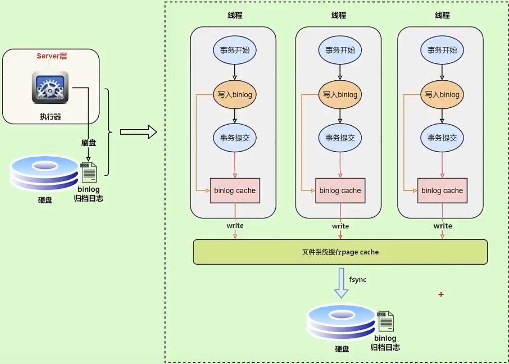

> binlog 刷盘时机由参数 sync_binlog 控制：
> - sync_binlog = 0 (默认)：每次提交事务都 write 到文件系统的 page cache（由 OS 判断什么时候执行 fsync 刷盘），性能最好，但风险最大；
> - sync_binlog = 1：每次提交事务都会立即刷盘，性能最差，但风险最小；
> - sync_binlog = N (N>1)：每次提交事务都 write，但累积 N 个事务后才执行 fsync 刷盘。

### 4.6、binlog VS redolog
> **有 binlog，为什么还要 redolog？binlog 在事务提交后写入，事务提交后还没写入 binlog 就挂了怎么办？即：binlog 没有 crash-safe 的能力**
> - **redolog：侧重事务的持久性，使 MySQL 具有 crash-safe 的能力；**
> - **binlog：侧重数据备份；**

## 5、redolog 和 undolog
> - redolog：重做日志，用来保证事务的持久性。事务提交后，内存中的数据发生改变，若还没写回磁盘时 MySQL 宕机，则当 MySQL 服务恢复后，根据日志重做事务。redolog 只记录未被刷盘的数据，已经刷盘的数据会从 redolog 中删除！ 
> - undolog：回滚日志，用来保证事务的原子性、一致性。作用：1. 回滚数据：对写操作执行逆过程；2. MVCC：读操作时，若数据被其他事务占用，则当前事务可以通过 undolog 读取数据之前的版本。 
> - MySQL WAL 技术：Write-Ahead Logging，先写日志，再写磁盘；

### 5.1、刷盘时机
> MySQL 进程有一块内存空间 redolog buffer；
>
> redolog 和 undolog 的刷盘时机由参数 innodb_flush_log_at_trx_commit 控制：
> - innodb_flush_log_at_trx_commit = 0：不刷盘，redolog 仍停留在 redolog buffer；
> - innodb_flush_log_at_trx_commit = 1：每次提交事务都会立即刷盘；
> - innodb_flush_log_at_trx_commit = 2：每次事务提交都把 redolog 写到 page cache；
>
> InnoDB有一个后台线程，每隔 1s，就会把 redolog buffer 中的日志写到 page cache，然后持久化到磁盘。

### 5.2、redolog 两阶段提交
> binlog 和 redolog 只要有一个写失败就会导致两份日志数据不一致！
>
> - redolog 写成功，事务还没提交 MySQL 挂了，binlog 还没来得及刷盘，MySQL 重启后重做 redolog，但重做 redolog 并不会写入 binlog，则 binlog 少数据！
>     - redolog 写 page cache 成功，事务还没提交 MySQL 挂了，OS 会把 page cache 刷盘，即：redolog 刷盘成功，但事务还没提交。。。
> - binlog 写成功，数据已经变了，事务还没提交 MySQL 挂了，redolog 还没来得及写，MySQL 重启后该事务无效，则 binlog 多数据！
>
> 两阶段提交：保证 redolog 和 binlog 的一致性！
>
> - 4 发生 crash：binlog 还没写，redolog prepare 直接废弃即可，能保证两份日志一致；
> - 6 发生 crash：redolog 还没提交，会检查 binlog 是否已经写入，如果写入就提交，否则连同 redolog prepare 直接废弃，能保证两份日志一致；

```sql
1.begin
2.写操作
3.redolog prepare（redolog 已经写好了，只差提交）
4.
5.写入 binlog
6.
7.redolog commit（事务 commit）
```

## 6、中继日志 (Relay Log)
> **中继日志只在主从架构的从服务器上存在**。slave 为了与 master 的数据保持一致，要从主服务器读取 Bin Log，并写入到自己本地的Relay Log 中。然后，slave 读取 Relay Log，对自己的数据进行更新，完成主从服务器的数据同步。
>
> Relay Log 文件名的格式：从服务器名-relay-bin.序号；
>
> Relay Log 还有一个索引文件：从服务器名-relay-bin.index，用来定位当前正在使用的 Relay Log。
>
> Relay Log 也是二进制的，无法直接查看，同样用 mysqlbinlog 命令查看。
>
> 主从复制典型的错误：
>
> slave 宕机，要重装系统时，发现数据恢复不了，原因：
>
> 1. Relay Log 文件损坏；
> 2. Relay Log 中记录了从服务器名，因此重装系统后，slave 要改成和以前一样的名！

# 十、高可用集群
> 优化 MySQL 不要一上来就搭建集群，成本太高！
>
> 最佳实战：DB 一般都是读多写少，采用主备从架构，主库负责写和少部分实时读，从库负责其他读，备库不做操作（也是从库，压力小，主备切换快）；
>
> 主从复制的作用：
> - 读写分离；
> - 数据备份；
> - 高可用。

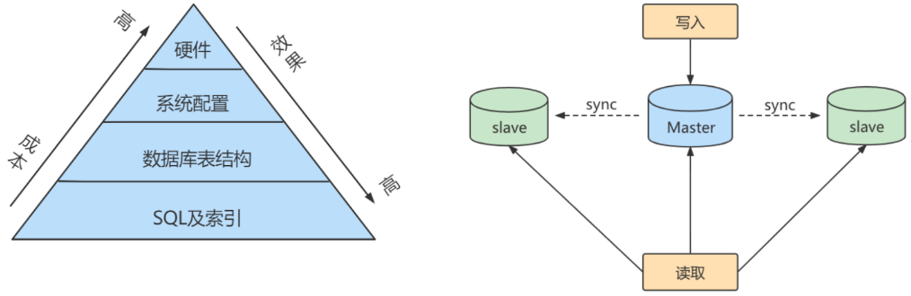

## 1、主从复制的原理
> - Binlog dump thread：master 的线程，负责将 Bin Log 发送给 slave；
> - I/O thread：slave 线程，负责接收 master 的 Bin Log，并写入到自己的 Relay Log 中；
> - SQL thread：slave 线程，负责读取自己的 Relay Log 并执行，保证主从数据同步。

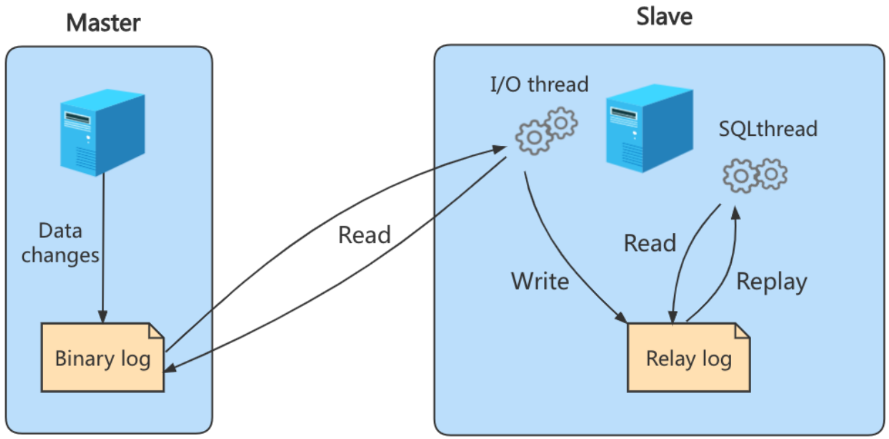

## 2、搭建一主一从
> 注意：主从 MySQL 尽量版本一致！主从都关闭防火墙。

**1、master 配置文件**
```bash
# 主服务器唯一 ID
server-id=1
# 启用Bin Log，文件路径为
log-bin=mysql-bin
```
```bash
# 0(默认)：表示读写(主机)，1：表示只读(从机)
read-only=0
# 设置日志文件保留的时长，单位秒
binlog_expire_logs_seconds=6000
# 单个 Bin Log 文件的最大大小，默认 1GB
max_binlog_size=200M
# 设置不需要复制的数据库
binlog-ignore-db=mysql
# 设置需要复制的数据库，默认所有数据库都需要
binlog-do-db=testdb
# 设置 Bin Log 格式
binlog_format=STATEMENT
```

**2、slave 配置文件**
```bash
# 从服务器唯一ID
server-id=2
```
```bash
# 中继日志路径
relay-log=mysql-relay
```

**3、 master 创建账户并授权，允许 slave 通过这个账号密码来访问**
```sql
-- "slave 的 IP" 也可以直接换成 %，完全允许外部访问
GRANT REPLICATION SLAVE ON *.* TO 'slave'@'slave 的 IP' IDENTIFIED BY '123456';
flush privileges;
```
```sql
CREATE USER 'slave'@'slave 的 IP' IDENTIFIED BY '123456';
GRANT REPLICATION SLAVE ON *.* TO 'slave'@'slave 的 IP';
ALTER USER 'slave'@'slave 的 IP' IDENTIFIED WITH mysql_native_password BY '123456';
flush privileges;
```
```sql
show master status;
```
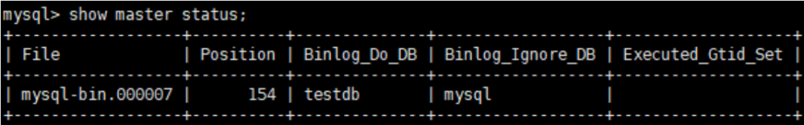

**4、slave 使用 master 授权的账号密码访问 master**
```sql
CHANGE MASTER TO MASTER_HOST='master 的 IP', MASTER_USER='slave', MASTER_PASSWORD='123456', MASTER_LOG_FILE='mysql-bin.000007', MASTER_LOG_POS=154, MASTER_PORT=3306;
-- 若报错，可能是 slave 已经启动了，执行 STOP SLAVE 再重试该命令

START SLAVE;	  -- 启动主从同步，若报错，执行 RESET SLAVE，再重试上面的命令
```
```sql
SHOW SLAVE STATUS\G;
-- 若出现如下状态，说明配置成功，此时就可以主从复制了
Slave_IO_Runing: YES
Slave_SQL_Runing: YES
```

**5、停止主从复制**
```bash
mysql> STOP SLAVE;      # 停止 I/O 线程和 SQL 线程的操作
mysql> RESET SLAVE;     # 在从机上执行，删除 slave 的 relaylog 文件，并重新启用新的 relaylog 文件
mysql> RESET MASTER;    # 在主机上执行，删除 master 的 binglog 文件，并重新开始所有新的日志文件
```

## 3、主从延迟
> 主从复制的三个阶段都是需要时间的，假设分别消耗时间 t1、t2、t3，slave 消费 Relay Log 最耗时，因此 t3 远大于 t1 和 t2！

```bash
# 在 slave 上可以通过该命令查看主从延迟(seconds_behind_master 字段，单位秒)
# 就算主从机器的时间不一样，也会自动校正！
SHOW SLAVE STATUS\G;
```

> 造成延迟的主要原因：
> - slave 机器性能比 master 差：slave 消费 RelayLog 更慢了，建议主从机器同配置；
> - 从库的压力大：因为读多写少，从库的读压力比较大，建议一主多从分担读压力；
> - 大事务的执行：master 要等事务执行完才写入 BinLog，事务如果很耗时，如 10min，则 slave 也要消耗 10min 执行该事务（MySQL5.6 支持并行消费 RelayLog）； 
>
> 主从复制默认是异步复制的，因此数据是弱一致的 (最终一致性)，怎么实现强一致？即：MySQL 主从集群是 AP 的，怎么实现 CP？

**1、半同步复制**
> slave 可能有多个，当 MySQL 客户端 (Java 程序) 提交事务后，master 不要立即返回，要等一个 slave 复制完毕后再返回，虽然 Java 程序响应慢了，但起码有一个 slave 实现了数据复制的强一致！

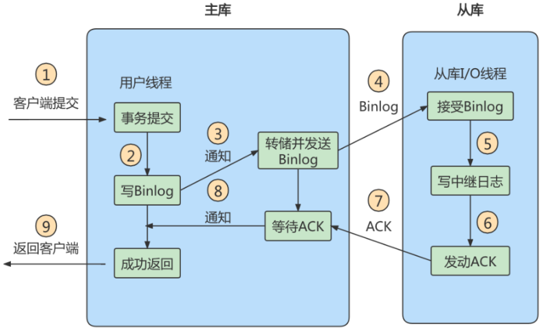

**2、组复制**
> 原理：对于读写事务，半同步复制需要等一个 slave 复制完毕再返回，组复制需要等超过一半的 slave，即：(n / 2 + 1)；对于只读事务，可直接返回；组复制基于 Paxos 协议。

## 4、主备切换
> 可靠性优先（存在不可用时间）：
> 1. 监听备库的 seconds_behind_master，如果小于某个值（比如5秒）继续下一步，否则持续重试这一步；
> 2. 把主库改成只读状态，readonly=true；
> 3. 判断备库的 seconds_behind_master，直到值为 0（没有主从延迟，说明数据同步完了）；
> 4. 把备库改成可读写状态，readonly=false；
> 5. 把业务请求切到备库。
>
> 可用性优先：依次执行 4、5、2 即可，不存在不可用时间，但存在数据不一致，慎用！

# 十一、数据备份与恢复
> - 物理备份：备份的是数据，把数据库物理文件转储到某一目录。物理备份恢复速度比较快，但占用空间比较大，MySQL 中可用 xtrabackup 工具进行物理备份；
> - 逻辑备份：备份的不是数据，而是转储为 SQL。逻辑备份恢复速度慢 (要执行 SQL)，但占用空间小，更灵活。MySQL 中可用 mysqldump 工具进行逻辑备份。

## 1、逻辑备份 mysqldump
**1、备份**
```bash
# 备份一个数据库
mysqldump –u 用户名 –h 主机名 –p 数据库名 > 备份文件名.sql
# 备份所有数据库
mysqldump -u 用户名 -p --all-databases > allDB.sql
# 备份部分数据库
mysqldump –u 用户名 –h 主机名 –p --databases dbname1 dbname2 > 备份文件名.sql

# 备份部分表
mysqldump –u 用户名 –h 主机名 –p 数据库名 表名1 表名2 > 备份文件名.sql
# 备份单表的部分数据
mysqldump -u 用户名 -p 数据库名 表名 --where="id<10" > 备份文件名.sql
# 排除某些表
mysqldump -u 用户名 -p 数据库名 --ignore-table=数据库名.表名 > 备份文件名.sql

# 只备份结构
mysqldump -u 用户名 -p 数据库名 --no-data > 备份文件名.sql
# 只备份数据
mysqldump -u 用户名 -p 数据库名 --no-create-info > 备份文件名.sql
```
```sql
-- 以上命令并不会备份存储过程、函数、事件，可使用参数 --routines 备份存储过程和函数，--events 备份事件
-- 查看当前数据库有哪些存储过程和函数
SELECT SPECIFIC_NAME, ROUTINE_TYPE, ROUTINE_SCHEMA 
FROM information_schema.Routines 
WHERE ROUTINE_SCHEMA="数据库名";
```
> mysqldump 其他参数，详见 "第19章_数据库备份与恢复.pdf"

**2、恢复**
```bash
# 若 sql 文件中已经包含 ceate database 命令，则：
mysql –u 用户名 –p < 备份文件名.sql
# 若 sql 文件中不包含 ceate database 命令，则：
mysql –u 用户名 –p 数据库名 < 备份文件名.sql

# 从所有数据库的备份文件中，只恢复其中一个数据库，如：从 all_databases.sql 中恢复一个数据库 order：
# 1.先把这个 order 的 sql 导出来
sed -n '/^-- Current Database: `order`/,/^-- Current Database: `/p' all_databases.sql > order.sql
# 2.再执行 order.sql 即可

# 从数据库的备份文件中，只恢复其中一张表，如：从 order.sql 中只恢复 order_item 表：
# 1.先把 order_item 表的结构导出来
cat order.sql | sed -e '/./{H;$!d;}' -e 'x;/CREATE TABLE `order_item`/!d;q' > order_item_structure.sql
# 2.再把 order.sql 中有关 order_item 表的 insert 语句导出来
cat order.sql | grep --ignore-case 'insert into `order_item`' > order_item_data.sql
# 3.依次执行这两个 sql 文件即可
```

## 2、物理备份
> 物理备份很简单，直接复制数据库文件即可：
> - Windows：D:\Mysql\mysql-5.7.30-winx64\data\数据库名；
> - Linux：/var/lib/mysql/数据库名。

**1、备份**
> 物理备份方法不好，因为实际开发中可能不允许锁表，而且这种方法 InnoDB 用不了，MyISAM 可以用。
```bash
# 1.备份前将数据库内的所有表锁住，只允许读
FLUSH TABLES WITH READ LOCK
# 2.将数据库文件 copy 出去
# 3.解锁
UNLOCK TABLES
```

**2、恢复**
> 只需把数据库文件拷贝到 MySQL 相关目录下即可，注意：
> - 数据库文件必须和数据库的主版本号相同； 
> - 数据库文件拷到 MySQL 相关目录下后，必须将数据库文件的权限开放给 MySQL，然后重启 MySQL 即可。 

```bash
chown -R mysql.mysql /var/lib/mysql/数据库名	# 两个 mysql 分别表示组和用户
```

## 3、表的导出与导入
> 还可以把表的数据以各种格式导入导出，详见视频

## 4、数据库迁移
> 前面的备份与恢复都是在本机上，数据库迁移是从一台机器迁到另一台机器，详见 pdf，讲的不详细

## 5、误删怎么恢复
见 pdf 和视频