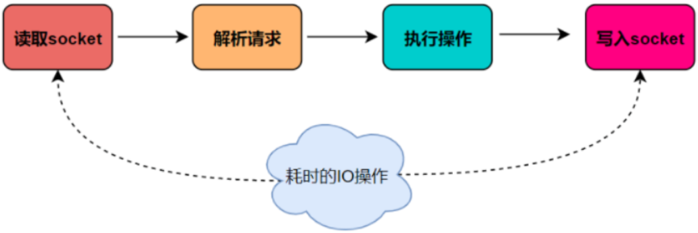
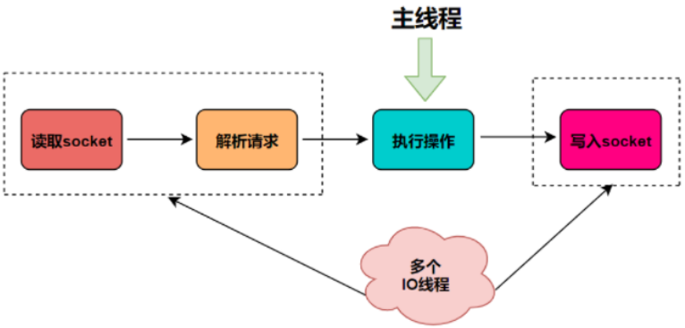
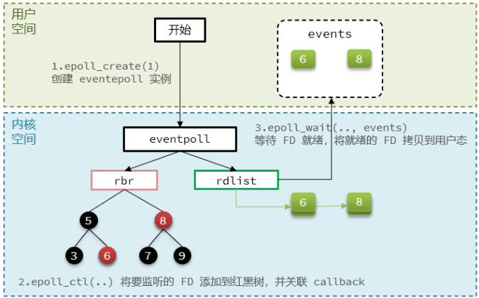
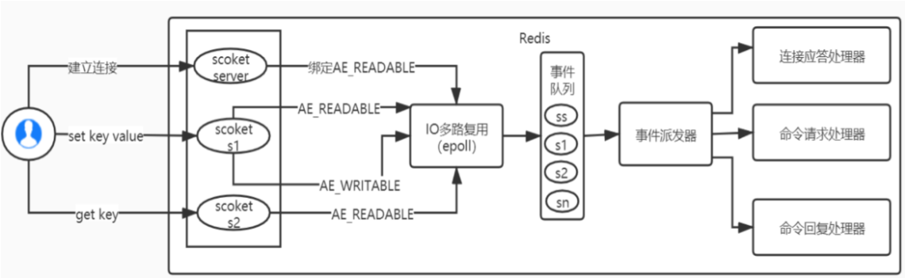
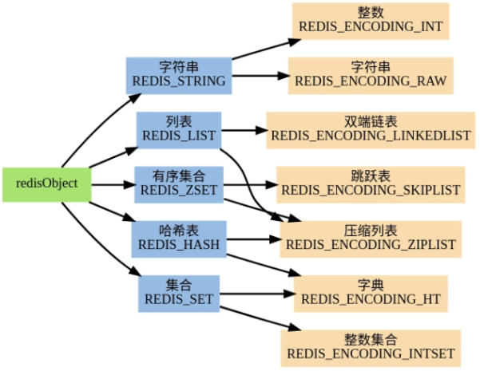
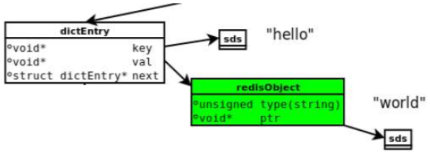
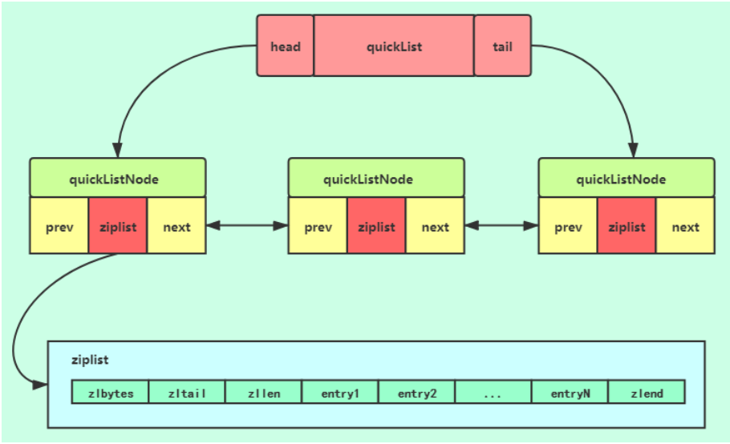
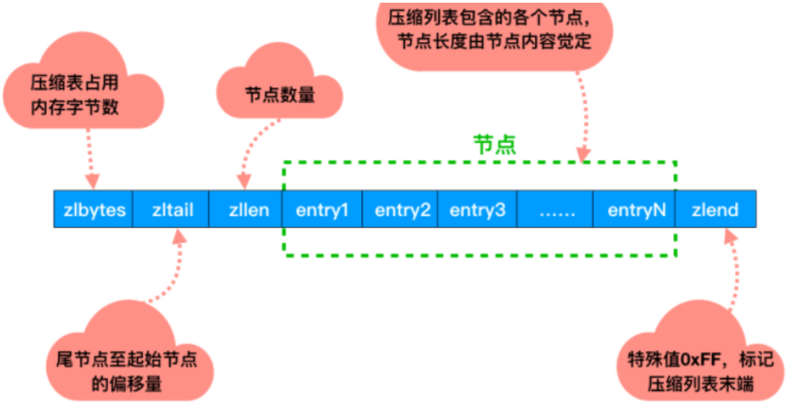
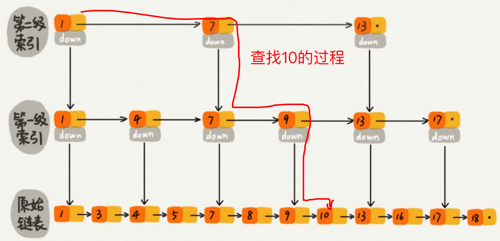
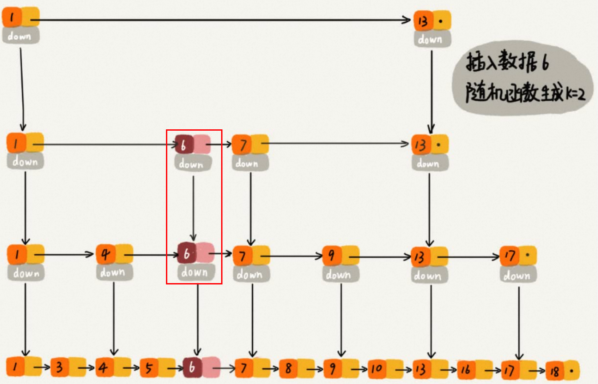

[redis-7.0.5.tar.gz](https://www.yuque.com/attachments/yuque/0/2023/gz/26352795/1689929357490-340a79f6-088b-4d12-8ac7-e26d9d9f0161.gz)

[Redis大厂高阶班20210511班最终版.mmap](https://www.yuque.com/attachments/yuque/0/2023/mmap/26352795/1689929344979-469fe190-3edb-4697-bdd1-455dc01c525c.mmap)

# 一、Redis 概述
> - 英文官网：[https://redis.io/](https://redis.io/)
> - 中文官网：[http://www.redis.cn/](http://www.redis.cn/)
> - 命令大全：[http://www.redis.cn/commands.html](http://www.redis.cn/commands.html)
> - 在线测试：[https://try.redis.io](https://try.redis.io)

## 1、Redis 简介
1. 什么是 Redis：REmote DIctionary Server（远程字典服务器，C 语言编写）
2. Redis 能干嘛 
    - 取最新N个数据：通过 List 实现按自然时间排序；
    - 排行榜、Top N：Zset 有序集合；
    - 数据去重：Set 集合；
    - 时效性的数据：Expire 过期，如手机验证码；
    - 计数器、秒杀：原子性，INCR、DECR；
    - 发布、订阅消息系统：pub / sub 模式；
3. Redis 为什么牛逼？ 
    - 内存数据库，每条命令都具有原子性，不加锁就能实现高并发！

## 2、下载 / 安装 / 配置 / 启动
1. 下载 redis-6.0.10.tar.gz（版本最好 ≥ 6.0.8，6.0.7 有 bug）传到 Linux，安装的程序建议放在 /opt 下； 
2. tar -zxvf redis-6.0.10.tar.gz
3. 安装 Redis：cd redis-6.0.10、make、make install； 
4. 默认安装路径：/usr/local/bin； 
5. 修改配置文件 
```bash
# redis.conf:
# 1.修改 daemonize 为 yes			    # 后台启动，相当于 nohup
# 2.修改 protected-mode 为 no		  # 关闭保护模式，否则无法从外网连接 Redis
# 3.注释掉 bind 127.0.0.1 -::1	  # 默认只能从本地访问 Redis
```
6.  启动 Redis： 
```bash
cd /usr/local/bin
redis-server -v						# 查看 Redis 版本
redis-server redis.conf		# 启动 Redis 服务
redis-cli -p 6379					# 启动 Redis 客户端
```
7. 关闭 Redis：shutdown、exit。 

## 3、Redis 的网络模型
> 面试：Redis3.x 为什么单线程，为什么单线程还那么快？
> - 基于内存操作，执行速度非常快，性能瓶颈在网络 IO，而非内存； 
> - 数据结构简单：Redis 的数据结构是专门设计的，这些简单的数据结构的查找和操作大部分 O(1)； 
> - 单线程没有锁和线程上下文切换的开销； 
> - Redis3.x 使用 IO 多路复用提升网络 IO 性能，可以使用一个线程高效的处理多个客户端的 Socket 连接请求。Redis 处理客户端请求包括以下 4 步，本来只有一个请求处理完了才能处理下一个请求，但采用了 IO 多路复用后，虽然一个请求没执行完，却可以接收下一个请求！ 



> 面试：Redis 的 IO 模型？是单线程还是多线程？
>
> 答：Redis 工作线程是单线程的 (执行客户端命令是单线程的)，但整个 Redis 是多线程的；
>
> - Redis3.x 及以前是单线程模型； 
> - Redis4.x 引入了多线程，如持久化、del big key(unlink 命令) 等耗时的任务都由后台线程执行；  
但处理客户端连接请求 (单线程 IO 多路复用)、执行命令仍是主线程； 
> - **<font style="color:red">Redis6.0：使用多线程处理客户端连接请求 (多线程 IO 多路复用)、但执行命令仍是主线程；</font>**
>
> 做法：使用多线程处理客户端连接请求，使多个 Socket 的读写并行化！



## 4、OS 的网络 IO 模型
> 注意概念：
> - 客户端线程
> - 用户线程：服务端的用户态线程，不是客户端线程；
> - 内核线程：服务端的内核态线程；

### 4.1、BIO
> 读写 IO 的 read()、write() 都是系统调用；
>
> 客户端发起 IO 请求时，此时客户端线程要阻塞掉，直到服务端准备好数据再唤醒客户端！

### 4.2、NIO
> 客户端发起 IO 请求时，客户端线程不阻塞，而是一直轮询，如果服务端还没准备好数据，会返回 Error，直到准备好数据；
>
> NIO 和 BIO 的区别就像 CAS 和 synchronized：
> - 优点：不会阻塞，实时性好；
> - 缺点：虽然是非阻塞，但性能并没有提高，CPU 要不断轮询，涉及到多次两态切换；
```java
while(true) {
    res = read();    // 系统调用，两态切换
    if (res != error) {
        // 处理数据
        break;
    }
}
```

### 4.3、IO 多路复用
> C10K 问题：client 1w 个连接请求，怎么办？每个请求都创建一个线程，浪费服务器资源！
>
> I/O 多路复用是理念，select、poll、epoll 是 Linux、Unix 提供的函数，是具体实现，IO 多路复用还是 NIO；
>
> Redis、Nginx 只有装在 Linux 上才能发挥最大性能，因为它们的底层都用到了 epoll()！
>
> **文件描述符 (File Descriptor, FD)**：是一个从 0 开始的无符号整数。Linux 一切皆文件，包括 Socket；
>
> **IO 多路复用**：使用单个线程同时监听多个 FD 是否就绪！

**1、select**
> NIO 的缺点：客户端线程需要不断地轮询，CPU 空转，效率低；
>
> select()：将一批 FD (fd_set) 拷贝到内核，在内核只用**一个线程**遍历所有 FD，把就绪的 FD 标记出来，再把这批 FD 拷贝到用户态，用户线程再通过遍历找到就绪的 FD；如此反复，直到所有 FD 都就绪并被用户线程处理；

```java
/*
FD 是一个无符号整数，多个 Socket 请求组成一个 fd_set 数组，
1. select(fd_set) 触发系统调用，将 fd_set 传入内核，在内核态轮询 fd_set，若所有 fd 都没有就绪，则 select() 阻塞
2. 当有 fd 就绪时，select() 就返回，将所有 fd_set 再拷贝回用户态，在用户态遍历所有 fd，找到就绪的 fd 再执行相应操作
3. 没有就绪的 fd 会在下一轮循环中通过 select() 再拷贝到用户态！
*/
while(true) {
    select(fd_set);
    for(fd : fd_set) {
        if(fd 已经就绪) {
            // 执行相应操作
        }
    }
}
```
> 缺点：
> - 在内核态和用户态都要遍历 fd_set，时间复杂度 O(n)；
> - 需要在内核态和用户态之间多次拷贝 fd_set，效率低；
> - fd_set 采用 bitmap 存储，长度为 1024，即：select() 最多只能监听 1024 个 FD；

**2、poll**
> poll() 使用链表，能监听的 FD 数量没有上限；
>
> 性能和 select() 比，并没有提升！

**3、epoll**
> - select、poll 采用**轮询**算法，epoll 采用**事件通知机制代替轮询**！
> - 使用红黑树保存要监听的 FD，能监听的 FD 数量无上限，而且增删改查 logn！
> - 执行 epoll_ctl 将被监听的 FD 从用户态添加到内核态的红黑树中；
> - 当红黑树中的 FD 就绪时，触发回调函数，将 FD 移到就绪链表，调用 epoll_wait 将就绪的 FD 拷贝到用户态；

> - 减少了 FD 的拷贝次数；
> - 使用**事件通知机制代替轮询**，时间复杂度 O(1) (用户线程拿到的 FD 都是就绪的)；

```cpp
struct eventpoll {
    struct rb_root rbr;           // 红黑树，记录所有要监听的 FD，数量上限取决于 OS 能打开的 FD 数量，logn
    struct list_head rdlist;      // 链表，记录就绪的 FD
    //...
};

// 1.在内核态创建 eventpoll，返回 eventpoll 的句柄 epfd
int epoll_create(int size);    

// 2.将 FD 作为一个节点添加到红黑树 rbr 中，并为 FD 节点设置 callback，
//   当 FD 就绪时，callback 就将该 FD 添加到就绪链表 rdlist 中
int epoll_ctl(
    int epfd,                     // eventpoll 的句柄
    int op,                       // 要执行的操作，包括：ADD、MOD、DEL
    int fd,                       // 要监听的FD
    struct epoll_event *event     // 要监听的事件类型：读、写、异常等
);

// 3.检查就绪联表 rdlist 是否为空，不为空则返回就绪 FD 的数量，并将所有就绪的 FD 拷贝到用户态
int epoll_wait(
    int epfd,                     // eventpoll 的句柄
    struct epoll_event *events,   // 空数组，用于接收就绪的 FD
    int maxevents,                // events 数组的最大长度
    int timeout                   // 超时时间，-1用不超时；0不阻塞；大于0为阻塞时间
);
/*
epoll 的两种事件通知机制：
1. LevelTriggered 水平触发：内核会多次调用 epoll_wait() 把就绪的 FD 拷贝到用户态，直到用户线程处理完这些 FD
   当 FD 就绪时，调用 epoll_wait() 将数据拷贝到用户态，然后清空就绪联表 rdlist；
   如果数据没读完，再次调用 epoll_ctl() 将就绪的 FD 加入 rdlist，再调用 epoll_wait() 将数据拷贝到用户态；
   如此循环，直到用户进程把数据读完为止！
2. EdgeTriggered 边缘触发：当 FD 就绪时，内核只会调用一次 epoll_wait()，数据只拷贝一次，所以用户线程必须立刻处理 FD
   当 FD 就绪时，调用 epoll_wait() 将数据拷贝到用户态，然后清空就绪联表 rdlist，不管数据是否读完
   
LT：多次通知，效率低
ET：只通知一次，效率高
select、poll 只支持 LT，epoll 支持 LT (默认)、ET
惊群现象：LT 存在惊群现象，当多个用户进程监听同一个 FD 时，若 FD 就绪，则所有用户进程都被唤醒，但可能前几个用户进程就能把 FD 的数据读完，没必要全部唤醒！ET 模式只会唤醒一个进程，不存在惊群！
*/
```


> 面试：Redis 的 IO 多路复用？
> - Redis 使用 epoll() 实现了 I/O 多路复用，使用一个线程可以同时监听多个 Socket 连接请求；
> - Socket 连接请求到达时，I/O 多路复用程序会将它们的 FD 放到事件队列中；
> - 当某个 FD 就绪时，事件派发器就会把事件分发给事件处理器去处理；


### 4.4、信号驱动 IO
> 客户端发起 IO 请求时，会给对应的 socket 注册一个信号函数，然后客户端线程会继续执行，当内核准备好数据时会发送一个信号给客户端，客户端线程接收到信号之后，便在信号函数中进行 IO 读写。

### 4.5、AIO
> 前 4 种都是同步 IO，AIO 是异步 IO；
>
> 客户端发起 IO 请求时，服务端会立刻返回成功，客户端就可以做其它事了。
>
> 内核会准备好数据，并将数据拷贝到用户态，然后给客户端发送一个信号，通知客户端线程 IO 操作已经完成。

### 4.4、同步异步、阻塞非阻塞
> 同步、异步：
> - 同步：客户端发送请求，要一直等待服务端返回结果；
> - 异步：客户端发送请求，可以去干其他事，服务端就绪时再通知客户端；
>
> 阻塞、非阻塞：
> - 阻塞：用户线程被阻塞；
> - 非阻塞：用户线程 CAS；
>
> 四种组合：同步阻塞、同步非阻塞、异步阻塞、异步非阻塞

# 二、Redis 命令
## 1、基本数据类型
> Redis 常见数据类型操作命令：[http://redisdoc.com/](http://redisdoc.com/)
>
> Set、Zset 考的非常多！

### 1.0、Key & 通用命令
> 注意：生产环境不要使用 KEYS 命令，会扫描所有 KEY，导致主线程阻塞，用 SCAN 命令代替！

| 命令 | 作用 |
| --- | --- |
| SCAN          cursor [MATCH pattern] [COUNT count] [TYPE type] | 迭代 Redis 的 key |
| HSCAN key cursor [MATCH pattern] [COUNT count] [TYPE type] | 迭代 HASH 中的 key |
| SSCAN  key cursor [MATCH pattern] [COUNT count] [TYPE type] | 迭代 SET 中的 key |
| ZSCAN  key cursor [MATCH pattern] [COUNT count] [TYPE type] | 迭代 ZSET 中的 key |

> - cursor：迭代开始的游标；
> - pattern：迭代要匹配的 key 的模式；
> - count：迭代多少个元素，默认为 10；
> - type：要迭代什么类型的 value，默认为所有类型。
>
> SCAN 会返回一个数组 [nextCursor, valueSet]
> - nextCursor：下一次迭代的起始游标；
> - valueSet：本次迭代的结果集；

```bash
# 假设有 k1 ~ k10
127.0.0.1:6379> SCAN 0 MATCH * COUNT 5  # 从游标 = 0 开始遍历 5 个
1) "17"                                 # 下一次迭代的起始游标
2) 1) "k1"                              # 本次迭代的结果集
   2) "k2"
   3) "k3"
   4) "k4"
   5) "k5"
127.0.0.1:6379> SCAN 17 MATCH * COUNT 5
1) "66"
2) 1) "k6"
   2) "k7"
   3) "k8"
   4) "k9"
   5) "k10"
127.0.0.1:6379> SCAN 66 MATCH * COUNT 5
1) "0"                                 # 迭代完了
2) (empty list or set)
```

| 命令 | 描述 |
| :---: | :---: |
| <font style="color:red">KEYS *</font> | 查看所有 key，支持 ant 风格，如：keys e?，? 可以配任何一位字母 |
| KEYS pattern | 查找所有符合给定模式 (pattern) 的 key |
| <font style="color:red">EXISTS key</font> | 检查 key 是否存在，1存在，0不存在 |
| <font style="color:red">DEL key1 key2</font> | 当 key 存在时删除 key |
| <font style="color:red">UNLINK key</font> | 异步删除 key (非阻塞)，适合删除大 key |
| <font style="color:red">EXPIRE key seconds</font> | 设置 key 的过期时间，以秒计 |
| PEXPIRE key milliseconds | 设置 key 的过期时间，以毫秒计 |
| EXPIREAT key timestamp | 为 key 设置过期时间，接受的时间参数是 UNIX 时间戳 (unix timestamp) |
| MOVE key dbNum | 将当前 DB 的 key 移动到指定的 DB，若 key 同名，则移动失败 |
| <font style="color:red">TTL key</font> | 查看 key 还有多少秒过期，-1永不过期，-2已过期 |
| PTTL key | 查看 key 还有多少毫秒过期 |
| <font style="color:red">TYPE key</font> | 返回 value 的类型 |
| RENAME key newkey | 给 key 改名 |
| RENAMENX key newkey | 仅当 newkey 不存在时，将 key 改名为 newkey |
| PERSIST key | 移除 key 的过期时间，永不过期 |
| DUMP key | 序列化给定 key ，并返回被序列化的值 |
| RANDOMKEY | 从当前 DB 中随机返回一个 key |

| 通用命令 | 描述 |
| :---: | :---: |
| SELECT n | 切换数据库，n ∈ [0, 15]，默认使用 0 号库 |
| FLUSHDB | 清空当前库 |
| FLUSHALL | 清空所有库 |
| DBSIZE | 返回当前库 key 的数量 |

> Redis 的源码位于 redis6.x.x/src 下，
>
> Java 一切皆对象 (Object)，Redis 一切皆字典 (dictEntry)，
>
> 其中 key 一般为 String，value 为 Redis 对象 (redisObject，是个 C 结构体)，故：dictEntry = String : redisObject；



```c
typedef struct dictEntry {
    void *key;
    union {
        void *val;
        uint64_t u64;
        int64_t s64;
        double d;
    } v;
    struct dictEntry *next;
} dictEntry;

typedef struct redisObject {
    unsigned type:4;          // 对象的类型: String、List、Hash、Set、ZSet
    unsigned encoding:4;      // 对象的编码，即: 该对象的底层的数据结构
    unsigned lru:LRU_BITS;    // 最近被访问的时间戳
    int refcount;             // 当前对象的引用计数，为0就可GC了
    void *ptr;                // 指向该对象保存的数据
} robj;
```

> 如：set hello world，对于字符串，Redis 并没有用 C 的 char[] 存储，而是用 Redis 自定义的 SDS 存储：



```bash
# 命令:
192.168.10.150> type key               # 查看 key 的类型
192.168.10.150> object encoding key    # 查看 key 的编码
192.168.10.150> debug object key       # 查看 key 的 debug 结构
```

### 1.1、String
> String 是 Redis 最基本的类型，60% 的操作都是 String；
>
> 应用：
> 1. 缓存对象；
> 2. 计数器；
> 3. 分布式锁；
> 4. 防止 Dos 攻击 (Denial of Service，请求合法，但一直请求，占用服务器资源)，限定每个 ip 每分钟只能访问 100 次
```java
 // key 为 ip，value 为 1，过期时间为 60s，key 不存在时才设置，key 已存在时返回 null
 String ip = request.getRemoteIp();
 Boolean key = redisTemplate.opsForValue().setIfAbsent(ip, "1", 60, TimeUnit.SECONDS);
 if (key != null && redisTemplate.opsForValue().get(ip) > 100) {
     // 请求打回
 } else {
     redisTemplate.opsForValue().increment(ip);
     // 放行
 }
```

| 命令 | 描述 |
| :---: | :---: |
| <font style="color:red">set key value [EX seconds] [PX milliseconds] [NX|XX]</font> | EX|PX：过期时间，NX：key 不存在时才创建，XX：key 存在时覆盖 |
| <font style="color:red">GET key</font> | 获取 key 的值 |
| <font style="color:red">MSET k1 v1  k2 v2 …</font> | 同时设置多个 k-v，若 k 已存在，则覆盖 |
| <font style="color:red">MGET k1 k2 …</font> | 同时获取多个 key 的值 |
| <font style="color:red">INCR key</font> | value++，key 必须是整型 |
| <font style="color:red">DECR key</font> | value-- |
| <font style="color:red">INCRBY key num</font> | value += num |
| <font style="color:red">DECRBY key decrement</font> | value -= num |
| INCRBYFLOAT key float | value += float |
| <font style="color:red">STRLEN key</font> | 返回 String 的长度 |
| <font style="color:red">APPEND key str</font> | 若 key 已存在且是 String，则追加值；若不存在，则设置值 |
| SETBIT key offset value | String[offset] = value |
| GETBIT key offset | 返回 String[offset] |
| SETRANGE key offset str | String 的 [offset, -1] 被覆盖为 str |
| GETRANGE key start end | 截取子串 [start, end]，支持负索引，如 end = -1 表示最后一个元素 |
| MSETNX k1 v1 k2 v2 … | 同时设置多个 k-v 对，当且仅当所有给定 k 都不存在 |
| <font style="color:red">GETSET key value</font> | 为 key 设置新 value ，并返回 key 的旧 value |

**1、String 的 3 大编码格式**
> int：
> - 使用 INT 编码，不使用 SDS，保存 long 型的 value，64 位，若超出表示范围或不是 int 型，则编码为 embstr 型； 
> - Redis 启动时会预先建立一个缓存，用于存储整型 [0, 9999] 的 redisObject，类似于 Java 的 IntegerCache。 
> 
> embstr：
> - 用 SDS (Simple Dynamic String，简单动态字符串) 保存，保存长度 < 44B 的字符串；若超出长度则编码为 raw；
> - 编码为 embstr 的字符串，redisObject 的 ptr 指针指向 SDS，且 **redisObject 和 SDS 的内存空间是连续的**，**避免了内存碎片**。
> 
> raw：
> - 用 SDS 保存长度 ∈ [44B, 512MB] 的字符串；
> - 和 embstr 的区别：**redisObject 和 SDS 的内存空间不连续**；
```bash
127.0.0.1:6379> set k1 123	
OK
127.0.0.1:6379> object encoding k1
"int"
127.0.0.1:6379> set k1 99999999999999999999		# 超出 long 范围
OK
127.0.0.1:6379> object encoding k1
"embstr"
127.0.0.1:6379> set k1 aaaaaaaaaaaaaaaaaaaaaaaaaaaaaaaaaaaaaaaaaaaaaaaaaaa		# 长度 > 44 byte
OK
127.0.0.1:6379> object encoding k1
"raw"

# 注意：embstr 的实现是只读的，因此修改 embstr 时，会先转为 raw 再修改，所以修改后的 embstr 一定是 raw
127.0.0.1:6379> set k1 a
OK
127.0.0.1:6379> APPEND k1 b
(integer) 2
127.0.0.1:6379> get k1
"ab"
127.0.0.1:6379> object encoding k1
"raw"
```

**2、SDS**
> String 的底层就是 SDS；
>
> 由于 C 语言没有 String，只有 char[]，操作起来很不方便，因此 SDS 的本质就是把 char[] 包了一层。

```c
// sds.h

typedef char *sds;

struct __attribute__ ((__packed__)) sdshdr5 {	// 不使用
 unsigned char flags;
 char buf[];
};
struct __attribute__ ((__packed__)) sdshdr8 {	// 可存储 2 ^ 8 = 256 byte 的字符串
 uint8_t len;			// buf[] 内字符串的实际长度
 uint8_t alloc;			// buf[] 的总长度
 unsigned char flags;	// buf[] 的属性: sdshdr8、sdshdr16、sdshdr32...，用于存储不同长度的字符串
 char buf[];			// 字符串的值
};
struct __attribute__ ((__packed__)) sdshdr16 {
 uint8_t len;
 uint8_t alloc;
 unsigned char flags;
 char buf[];
};
struct __attribute__ ((__packed__)) sdshdr32 {
 uint8_t len;
 uint8_t alloc;
 unsigned char flags;
 char buf[];
};
struct __attribute__ ((__packed__)) sdshdr64 {
 uint64_t len;
 uint64_t alloc;
 unsigned char flags;
 char buf[];
};
```

> 好处：
> 1、求字符串长度
>    - C 语言的 char[] 求长度需要 O(n)；
>    - SDS 直接拿 len 属性，O(1)。
>
> 2、内存扩容
> - C 语言的 char[] 不可扩容； 
> - SDS 支持 "空间预分配"、"惰性空间释放"： 
>     - 空间预分配 (String 扩容机制)：若 String 修改后的 len < 1MB，则扩容 2 倍；否则扩容 1MB；一个 String 最大为 512M；
>     - 惰性空间释放：String 缩短时并不会回收 SDS 多余的内存空间，只是更新 len 字段而已，下次 String 变长时，先使用这些多余的内存空间，不够了再扩容，减少扩容次数！
>
> 3、二进制安全
> - C 语言的 char[] 以 "\0" 为结束标志，若字符串中本来就有 "\0"，则表示不出来；
> - SDS 根据 len 属性确定字符串是否结束，可以存储任何数据，如 jpg 图片或序列化的对象。

### 1.2、List
> 应用：
>
> 1、实现栈、队列、可以做分页；
>
> 2、微信公众号订阅的消息：
> - 公众号发布文章，就会 push 进订阅者的 list，如：LPUSH  articleList:1001 1024，key 是用户 id，value 是文章 id；
> - 默认只显示 10 篇文章：LRANGE articleList:1001 0 9。
>
> 3、商品评论列表：
> - 需求1：保存商品评论时，要按时间顺序排序； 
> - 需求2：查看商品评论时，需要时间逆序排序； 
> - 用 List 存储评论信息，key 是商品 id，value 是评论信息的 json 串： 
>
> LPUSH items:commentList:1001 {"id":1001,"name":"huawei","date":1600484283054,"content":"这手机真好看"}

| 命令 | 描述 |
| :---: | :---: |
| <font style="color:red">LPUSH list e1 e2 e3 ...</font> | 从左边添加元素 |
| <font style="color:red">RPUSH list e1 e2 e3 ...</font> | 从右边添加元素 |
| <font style="color:red">LPOP list [count]</font> | 删除并返回左边 count 个元素 (当 list 没有元素时，list 会被删除) |
| <font style="color:red">RPOP list [count]</font> | 删除并返回右边 count 个元素 (当 list 没有元素时，list 会被删除) |
| <font style="color:red">LLEN list</font> | list.size() |
| <font style="color:red">LRANGE key start end</font> | 返回 [start, end] 的元素 |
| LPUSHX list value | 当 list 存在时，从左边添加元素；list 不存在时，也不报错 |
| RPUSHX list value | 当 list 存在时，从右边添加元素；list 不存在时，也不报错 |
| LTRIM list start end | list = list[start, end]，支持负索引 |
| LINDEX list index | 通过 index 获取元素 (从左到右，从 0 计数) |
| LSET list index value | list[index] = value |
| <br/>LREM list count value | 删除 list 中 count 个值都为 value 的元素；   若 count > 0，则从左到右删除 count 个；   若 count < 0，则从右到左删除 count 个；   若 count == 0，则删除所有值为 value 的元素；返回删除数量 |
| RPOPLPUSH list1 list2 | RPOP list1 的元素，并将该元素 LPUSH 进 list2，返回该元素 |
| <font style="color:red">INSERT list BEFORE | AFTER pivot value</font> | 在 list 中，在 pivot 前 | 后插入 value，返回插入后的 list.size() |

> 当把 list 当作 MQ 使用时 (不常用，了解)，不能用 LPOP 和 RPOP，因为 list 为空时，这俩命令返回 nil，而不是阻塞，要用：
> - BLPOP list1 [list2 ...] [timeout]：删除并返回左边第一个元素，当 list 没有元素时，BLPOP 会被阻塞，直到 list 有元素或超时；
> - BRPOP list1 [list2 ...] [timeout]：删除并返回右边第一个元素，当 list 没有元素时，BRPOP 会被阻塞，直到 list 有元素或超时；
> - BRPOPLPUSH list1 list2 [timeout]；

```bash
# 默认配置:
# 1.list-max-ziplist-size:
# 	 1.1、若为负数，表示以字节为单位限制quicklist每个ziplist节点的大小
# 		 -5: ziplist大小不能超过64KB
# 		 -4: ziplist大小不能超过32KB
# 		 -3: ziplist大小不能超过16KB
# 		 -2: ziplist大小不能超过8KB
#  		 -1: ziplist大小不能超过4KB
#    1.2、若为正数，表示以数据项为单位限制quicklist每个ziplist节点的大小
#        如: 取5，表示每个ziplist节点最多只能包含5个数据项
# 2.list-compress-depth: 表示quicklist两端有多少个ziplist节点不被压缩
#        如: 取2，头两个后最后两个ziplist节点不压缩，中间节点都压缩
192.168.10.150> config get list*
1) "list-max-ziplist-size"
2) "-2"
3) "list-compress-depth"
4) "0"
```

> List 的底层是 quicklist，quicklist = linkedList (双向链表) + ziplist，每个节点是一个 ziplist；
>
> 注意：当 List 中无元素时，List 被销毁；



> 面试：已经有双向链表了，为什么还要 ziplist？
>
> 答：当存储的数据量很小时，用双向链表得不偿失，因为 prev、next 指针占的空间可能比数据还要大。ziplist 是一个特殊的双向链表，存储的元素是 entry，且各个节点 (entry) 是连续的 (相当于元素长度不等的数组)。ziplist 的每个节点没有 prev、next 指针，而是保存了前一个 entry 的长度，通过计算长度得出前一个 entry 的地址，由此实现逆序遍历，相当于时间换空间。
>
> 注意：为了实现逆序遍历，ziplist 的每个 entry 都保存前一个 entry 的长度，在写操作高并发的情况下，若当前 entry 的长度被修改时，会级联更新其他 entry 保存的长度，效率很低，因此在 Redis7.0 中，ziplist 被替换成了 listpack：不再保存前一个 entry 的长度，而是保存当前 entry 的长度！
>
> ziplist 获取长度 O(1)，查找元素 O(n)，ziplist 的结构：



### 1.3、Hash
> 应用：Hash 相当于 Java 的 Map<String, Map<Object, Object>>，特别适合存储对象；
>
> 如：可用于购物车 (大厂不再使用，中小厂还在用)
> - 新增商品 → HSET shopcar:uid1024  334488  1     // uid = 1024 的用户，在购物车新增了1个 id = 334488 的商品
> - 增加商品数量 → HINCRBY shopcar:uid1024 334488  2  // 该用户又新增了 2 个 id = 334488 的商品
> - 商品总数 → HLEN shopcar:uid1024
> - 全部选择 → HGETALL shopcar:uid1024

| 命令 | 描述 |
| :---: | :---: |
| <font style="color:red">HSET map field value</font> | map.put(field, value) |
| <font style="color:red">HSETNX map field value</font> | field 不存在时，map.put(field, value) |
| <font style="color:red">HGET map field</font> | map.get(field) |
| <font style="color:red">HMSET map f1 v1 f2 v2 ...</font> | map.put(f1, v1).put(f1, v2) |
| <font style="color:red">HMGET map f1 f2 ...</font> | map.get(f1).get(f2) |
| <font style="color:red">HGETALL map</font> | map.entrySet() |
| <font style="color:red">HLEN map</font> | map.size() |
| <font style="color:red">HDEL map f1 f2 ...</font> | map.remove(f1).remove(f2) |
| <font style="color:red">HEXISTS map field</font> | map.contains(field) |
| <font style="color:red">HKEYS map</font> | map.keySet() |
| <font style="color:red">HVALS map</font> | map.valueSet() |
| <font style="color:red">HINCRBY map field num</font> | value += num |
| <font style="color:red">HINCRBYFLOAT map field num</font> | value += num |
| HSTRLEN map field | map.get(field).length |

> Hash、List、Set、ZSet 最大支持 2<sup>32</sup> - 1 个 key！
>
> Hash 的底层：当 field-value 较少时，使用 ziplist，否则使用 hashtable：

```bash
# 默认配置: 当 hash 保存的 f-v 对的个数 ≤ 512 且 len(v) ≤ 64 byte 时，用 ziplist 保存，否则用 hashtable 保存
# 注意：ziplist 可升级为用 hashtable 保存，反过来降级不可以
192.168.10.150> config get hash*
1) "hash-max-ziplist-entries"	
2) "512"
3) "hash-max-ziplist-value"
4) "64"

192.168.10.150> HMSET person name jack age 18
192.168.10.150> object encoding person
"ziplist"
```

> hashtable = 数组 + 链表，满时才扩容。
> - hashtable 扩容时采用渐进式 rehash，因为一次性 rehash 会导致主线程阻塞！
> - hashtable 里有两个数组 ht[2]，ht0 对外提供服务，ht1 负责扩容，然后取代 ht0；
> - 当 ht0 满时：初始化 ht1，长度为 ht0.length * 2；rehashindex = 0，指向 ht0 的第 0 个元素；此后的 CRUD 都只会对 ht0[rehashindex] 的元素进行单步 rehash；
> - 插入元素：rehashindex = 0，将 ht0[0] 的链表元素全部 rehash 到 ht1，rehashindex++，再将新元素插入到 ht1；
> - 读取元素：rehashindex = 1，将 ht0[1] 的链表元素全部 rehash 到 ht1，rehashindex++，从 ht0 读取元素；
> - 直到 ht0 全部 rehash 完成，然后用 ht1 代替掉 ht0；

### 1.4、Set
> 应用：
>
> 1、一人只能抽奖一次：
> - 用户点击抽奖按钮：SADD set userId；
> - 统计抽奖人数：SCARD set；
> - 从 set 中随机选取 3 个中奖人：SPOP / SRANDMEMBER set 3。
>
> 2、一人只能点赞一次：
> - 点赞：SADD set userId；
> - 取消点赞：SREM set userId；
> - 显示所有点赞的用户：SMEMBERS set；
> - 统计点赞数：SCARD set；
> - 判断某人是否点赞：SISMEMBER set userId。
> - 查询点赞列表，且先点赞的人头像放在前面，则用 ZSet，分数保存时间戳即可！
>
> 3、社交关系：
> - 共同关注的人 / 共同好友：求交集 SINTER set1 set2；
> - 可能认识的人：A 认识 C、D，B 认识 C，则 B 可能认识 D：求差集 SDIFF set1 set2；
> - 注意：集合操作复杂度很高，会导致主线程阻塞，建议用 Slave 节点执行！

| 命令 | 描述 |
| :---: | :---: |
| <font style="color:red">SADD set e1 e2 ...</font> | set.add(e1).add(e2) |
| <font style="color:red">SREM set e1 e2 ...</font> | set.remove(e1).remove(e2) |
| <font style="color:red">SMEMBERS set</font> | 返回 set 所有元素 |
| <font style="color:red">SISMEMBER set e</font> | set.contains(e)，返回 1 / 0 |
| <font style="color:red">SCARD set</font> | set.size() |
| <font style="color:red">SRANDMEMBER set [count]</font> | 随机返回 set 中 count 个元素 |
| <font style="color:red">SPOP set [count]</font> | 随机删除 set 中 count 个元素并返回 |
| <font style="color:red">SMOVE set1 set2 e</font> | set1.remove(e)，set2.add(e) |
| <font style="color:red">SDIFF set1 set2 [set3 ...]</font> | 求差集 set1 - set2 [- set3 ...] |
| <font style="color:red">SINTER set1 set2 [set3 ...]</font> | 求交集 set1 ∩ set2 [∩ set3 ...] |
| <font style="color:red">SUNION set1 set2 [set3 ...]</font> | 求并集 set1 ∪ set2 [∪ set3 ...] |
| SDIFFSTORE set3 set1 set2 [set3 ...] | set3 = set1 - set2 [- set3 ...] |
| SINTERSTORE set3 set1 set2 [set3 ...] | set3 = set1 ∩ set2 [∩ set3 ...] |
| SUNIONSTORE set3 set1 set2 [set3 ...] | set3 = set1 ∪ set2 [∪ set3 ...] |

> Set 的底层是 intset + hashtable；
>
> 若元素是 long 型，且 intset.size ≤ 512，用 intset 存储；否则用 hashtable 存储，key 为存储的值，value = null。
>
> intset 是一个有序数组（节省空间、方便二分查找）

```bash
# 默认配置: 当intset保存的数据个数超过512时，改为用hashtable保存
192.168.10.150> config get set*
1) "set-max-intset-entries"
2) "512"
192.168.10.150> SADD set1 9223372036854775807
192.168.10.150> object encoding set1
"intset"
192.168.10.150> SADD set1 9223372036854775808	# 超出long的表示范围
"hashtable"
```

### 1.5、ZSet
> - ZSet 是有序的 Set，成员唯一，但分数可以重复，通过分数可为元素排序；
> - **<font style="color:red">ZSet 返回元素集合时，默认按分数升序返回，若分数相同，则按字典序！</font>**

> 应用：排行榜
>
> 1、商品销量排行：id 作为 member，销量作为 score
> - 购买商品：ZADD goods:sellsort 9 1001 15 1002：id = 1001 的商品卖了 9 个，id = 1002 的商品卖了 15 个；
> - 再次购买：ZINCRBY goods:sellsort 2 1001：id = 1001 的商品又卖了 2 个；
> - 求销量前 10：ZREVRANGE goods:sellsort 0 9 WITHSCORES。
>
> 2、微博热搜：同理，id 作为 member，搜索量作为 score
>
> 3、分页：ZRANGEBYSCORE zset min max LIMIT offset size

| 命令 | 描述 |
| :---: | :---: |
| <font style="color:red">ZADD zset score1 e1 score2 e2 ...</font> | 添加元素，若元素已存在，则更新分数 |
| <font style="color:red">ZRANGE zset start end [WITHSCORES]</font> | 返回 zset[start, end] 区间的元素 [返回分数] |
| ZREVRANGE zset start end [WITHSCORES] | 按分数逆序返回，同上，索引从 0 计数，支持负索引 |
| <font style="color:red">ZRANGEBYSCORE zset min max [WITHSCORES] [LIMIT offset size]</font> | 返回 score ∈ [min, max] 的元素 [返回分数] [类似分页] |
| <font style="color:red">例：ZRANGEBYSCORE zset 60 (90 WITHSCORES LIMIT 0 5</font> | 返回 score ∈ [60, 90) 的元素，( 表开区间，从第 0 个元素开始，取 5 个 |
| ZREVRANGEBYSCORE zset max min [withscores] [LIMIT offset size] | 按分数逆序返回，同上 |
| <font style="color:red">ZSCORE zset e</font> | e.socre |
| <font style="color:red">ZINCRBY zset num e</font> | e.score += num |
| <font style="color:red">ZCARD zset</font> | zset.size() |
| <font style="color:red">ZCOUNT zset min max</font> | 返回 score ∈ [min, max] 的元素个数 |
| <font style="color:red">ZREM zset e1 e2 …</font> | 删除元素 |
| ZREMRANGEBYRANK zset start end | 删除 zset[start, end] 的元素 |
| ZREMRANGEBYSCORE zset min max | 删除 zset 中 score ∈ [min, max] 的元素 |
| <font style="color:red">ZRANK zset e</font><font style="color:red">⭐</font> | 获取 e 的分数排名，从小到大，从 0 计数 |
| <font style="color:red">ZREVRANK zset e</font><font style="color:red">⭐</font> | 获取 e 的分数排名，从大到小，从 0 计数 |
| <font style="color:red">ZDIFF 2 zset1 zset2</font> | 求差集 zset1 - zset2 |
| <font style="color:red">ZINTER 2 zset1 zset2</font> | 求交集 zset1 ∩ zset2 |
| <font style="color:red">ZUNION 2(count(k)) zset1 zset2</font> | 求并集 zset1 ∪ zset2 |

> ZSet 的底层是 ziplist + skiplist；
```bash
# 默认配置: zset的ziplist中，若entry的数量 ≤ 128 且元素的长度 ≤ 64 byte，用ziplist存储，否则改为用skiplist存储
192.168.10.150> config get zset*
1) "zset-max-ziplist-entries"
2) "128"
3) "zset-max-ziplist-value"
4) "64"
```

> 面试：跳表的缺点？时空复杂度？为什么不用红黑树？
> - skiplist = 双向链表 + 多级索引，本质上就是可以二分查找的有序链表，以空间换时间，CRUD 的时空复杂度 O(log n)、O(n)；
> - skiplist VS 红黑树：红黑树范围查询效率低；
> - 此外，skiplist 实现简单！



> 对 skiplist 进行写操作，会自动更新索引结构，否则两个索引节点中间的数据非常多，会退化至单链表；
>
> 更新方法：使用随机函数生一个 k，将该结点添加到第一级到第 k 级的索引中，如：



## 2、新数据类型
> 痛点：亿级数据的统计，如：头条、抖音、淘宝的用户访问级别都是亿级；
>
> 面试1：
> - 统计 App 中每天的所有用户的登录信息，包括用户 ID 和移动设备 ID；
> - 统计一个商品的所有评论信息；
> - 统计 APP 上每天的所有用户的打卡签到信息；
> - 统计网站的每天的访问信息；
>
> 面试2：
> - 对集合中的数据进行统计；
> - 统计每天的新增用户数和第二天的留存用户数；
> - 在电商网站的商品评论中，需要统计评论列表中的最新评论；
> - 统计一个月内连续打卡的用户数；

> 常用的统计类型：
> - 聚合统计：使用交集、并集、差集、聚合函数，统计多个集合元素的聚合结果；
> - 排序统计：
> - 抖音面试：设计一个展现列表，展现抖音最新评论； 
>     - 思路：排序 + 分页，用 List 或 ZSet！
>     - List 实现：来一条评论，就 LPUSH 一次，List 左端始终是最新的评论，即：List 自带排序，分页用 LRANGE；
>     - ZSet 实现：令 score = 时间戳，来一条评论，就 ZADD 一次，Zset 根据 score (时间戳) 自动排序，用 ZREVRANGEBYSCORE 分页。
>     - 建议：数据更新频繁或需要分页显示，尽量使⽤ ZSet。
> - 二值统计：元素的取值只有 0 和 1，用 Bitmap；
> - 基数统计：统计⼀个集合中不重复的元素个数，用 HyperLogLog。

### 2.1、BitMap (位图)
> BitMap 底层采用 String，本质就是一个 01 字符串，最大支持 2^32 = **512 MB**，非常节省内存，每次**扩容 8 位**；
>
> BitMap 用于统计二值数据，如：
> - 统计是否登录过、是否签到过、是否播放过；
> - 统计最近一周的活跃用户；
> - 统计某用户一年中哪几天登录过？哪几天没登录？全年中登录的天数共计多少？
> - 实现布隆过滤器；
>
> 大厂案例：京东每日签到
> - 中小厂：采用 MySQL，建表 login(id, userId, login_date)；
> - 局限：数据量大就完蛋了，如：京东平均每天 3000w 的用户签到，一天记录 3000w 条数据，一个月就是 9 亿条数据！ 
> - 大厂：采用 Redis 的 BitMap，一个月最多 31 天，31 bit 就可存储一个用户一个月的签到信息，3000w 用户一个月只需 110.8 MB！ 

```bash
127.0.0.1:6379> SETBIT login:u1:202107 0 1
127.0.0.1:6379> SETBIT login:u1:202107 1 1
127.0.0.1:6379> SETBIT login:u1:202107 2 1     # 设置用户u1在7月的前三天都签到了
127.0.0.1:6379> GETBIT login:u1:202107 2       # 第3天签到了
1												
127.0.0.1:6379> GETBIT login:u1:202107 30      # 第31天没签到
0												
127.0.0.1:6379> BITCOUNT login:u1:202107 0 30  # 7月共签到3天
(integer) 3
```

```bash
127.0.0.1:6379> SETBIT login:20210701 0 1      # 0、1、2、3号用户在7月1号都签到了
127.0.0.1:6379> SETBIT login:20210701 1 1
127.0.0.1:6379> SETBIT login:20210701 2 1
127.0.0.1:6379> SETBIT login:20210701 3 1
127.0.0.1:6379> SETBIT login:20210702 0 1      # 0、2号用户在7月2号签到了
127.0.0.1:6379> SETBIT login:20210702 2 1
127.0.0.1:6379> BITOP and destkey login:20210701 login:20210702
(integer) 1
127.0.0.1:6379> BITCOUNT destkey               # 连续两天都签到的人有2个
(integer) 2
# 问题：万一用户号不是数字，如何做位运算？
# 答：要将用户号映射到BitMap的位置上。
```

```bash
127.0.0.1:6379> SETBIT k1 1 1
127.0.0.1:6379> SETBIT k1 2 1
127.0.0.1:6379> SETBIT k1 7 1
127.0.0.1:6379> type k1    # BitMap的底层是String类型，其本质就是一个0/1字符串
string
127.0.0.1:6379> get k1     # 既然BitMap的底层是String，自然可用String的get命令
"a"                        # 为什么是"a"？因此此时k1的字符串是"01100001"，转为十进制为97，ASCII码为"a"

# 注意：如果k1设置为“1100001”，则结果不是"a"，因为BitMap的【扩容机制】是一次性扩8位，
# 实际上设置的不是“1100001”，而是“11000010”，转为十进制为194，转为十六进制为"c2"，
# 194超出ASCII码表示范围，所以直接返回十六进制？
127.0.0.1:6379> SETBIT k2 0 1
127.0.0.1:6379> SETBIT k2 1 1
127.0.0.1:6379> SETBIT k2 6 1
127.0.0.1:6379> get k2		
"\xc2"

# 再次验证：BitMap的扩容机制是一次性扩8位
127.0.0.1:6379> STRLEN k2        # k2="1100 0010"，所以长度为1B
(integer) 1
127.0.0.1:6379> SETBIT k2 8 1    # 扩容8位，此时k2="1100 0010 1000 0000"，所以长度为2B
127.0.0.1:6379> STRLEN k2
(integer) 2
```

| 命令 | 描述 |
| :---: | :---: |
| SETBIT key offset 0|1 | 2^32 位中，第 offset 位设为 0|1，返回修改前的值 |
| GETBIT key offset | 返回第 offset 位的 value |
| BITCOUNT key start end | 返回 key 中 [start, end] 中 1 的数量 |
| BITOP operation destkey key [key ...] | 对多个 key 进行位运算，结果保存在 destkey，operation = and / or / not / xor |
| BITPOS key 0/1 [start] [end] | 查找范围内第一个 0 或 1 出现的位置 |
| BITFIELD xxx   如：BITFIELD key GET u2 0 | 查询、修改某些位，常用来查询，GETBIT 只能查 1 位，BITFIELD 能查多位   如：从第 0 位开始，向后取 2 位，转为无符号 (u) 十进制返回 |

### 2.2、HyperLogLog (统计)
> 名词：
> - UV (Unique Visitor)：独立访客，一个用户 (一个 IP) 一天只能贡献一个 UV；
> - PV (Page View)：页面浏览量，一个用户一天能贡献多个 PV (疯狂刷新访问)；
> - DAU (Daily Active User)：日活跃用户量，一个用户一天只能贡献一个 DAU；
> - MAU (MonthIy Active User)：月活跃用户量，一个用户一天只能贡献一个 MAU；
> - 基数统计：统计一个集合中不重复的元素个数。
>
> 需求：
> - 统计某个网站的 UV、DAU、MAU；
> - 用户搜索网站关键词的数量；
> - 统计用户每天搜索不同词条个数。
>
> 基数统计的解决方案：
> - Java 的 Set 或 Redis 的 Set / ZSet：用户访问了，就把 userId 存到 Set 中，太占内存；
> - BitMap：也占内存 
>     - 假设一个样本对象要统计 1 亿个数据，1 亿 bit = 12MB，内存占用还行；
>     - 但如果要统计 1w 个样本对象，就需要 117GB！
>     - 但 BitMap 的计算是精确的。
> - HyperLogLog：极其节省内存 
>     - HyperLogLog 底层是 String； 
>     - HyperLogLog 会自动去重！不直接存储数据本身，采用**概率算法**，牺牲准确率来换取空间，误差仅 **0.81%** 左右； 
>     - 每个 HyperLogLog 只需要 **12KB** 就可以计算 2^64 个不同元素的基数！适合亿级大数据的基数统计！ 
>         * Redis 共 16384 个 Hash Slot，每个 Slot 取 6 位，2^6-1 = 63，16384 * 6 / 8 = 12KB
```bash
127.0.0.1:6379> PFADD taobao:uv:20210901 192.168.1.1 192.168.1.2  				      # 9月1号有2个用户访问
127.0.0.1:6379> PFCOUNT taobao:uv:20210901
(integer) 2
127.0.0.1:6379> PFADD taobao:uv:20210902 192.168.1.1 192.168.1.2 192.168.1.3  	# 9月2号有3个用户访问
127.0.0.1:6379> PFCOUNT taobao:uv:20210902
(integer) 3
127.0.0.1:6379> PFMERGE taobao:uv taobao:uv:20210901 taobao:uv:20210902			    # 合并两天的 UV
OK
127.0.0.1:6379> PFCOUNT taobao:uv												                        # 合并后的 UV=3
(integer) 3
```

| 命令 | 描述 |
| :---: | :---: |
| PFADD key e1 e2 ... | 添加元素 |
| PFCOUNT key | 统计 key 的估算值 (0.81% 的误差) |
| PFMERGE newkey key1 key2 ... | 将多个 key 合并至 newkey |


### 2.3、GEO (地理)
> 适用：查找附近的单车、附近的酒店、附近好友 ...
>
> 底层是 ZSet，GEO 没有提供删除命令，可以用 ZREM 删除；

| 命令 | 描述 |
| :---: | :---: |
| GEOADD key longitude1 latitude1 e1 ... | 添加 e1 的经纬度 |
| GEOPOS key e1 e2 ... | 返回 e1、e2 的经纬度 |
| GEODIST key e1 e2 <M | KM | FT | MI> | 返回 e1、e2 的距离，单位：米(默认) | 千米 | 英尺 | 英里 |
| GEOHASH key e1 e2 ... | 返回 e1、e2 坐标哈希值 (geohash 算法生成的 base32 编码值) |

```bash
# 按矩形或圆形范围搜索所有元素，并按照与【指定点(如圆心)】的距离排序后返回
GEOSEARCH key <FROMMEMBER member | FROMLONLAT longitude latitude>
<BYRADIUS radius <M | KM | FT | MI> | BYBOX width height <M | KM | FT | MI>> 
[ASC | DESC] [COUNT count [ANY]] [WITHCOORD] [WITHDIST] [WITHHASH]

# FROMMEMBER member：指定点是 GEO 里的某个元素
# FROMLONLAT longitude latitude：自己通过经纬度指定 指定点
# BYRADIUS radius：搜索以指定点为圆心，以 radius 为半径的圆内，所有的元素
# BYBOX width height：按矩形搜索，width height 到底是什么方向？
# ASC | DESC：按照距离远近排序返回，默认 ASC
# COUNT count [ANY]：返回前 count 个元素，默认全返回
#     ANY：只要条件满足，立刻返回，如 COUNT 3 ANY：在范围内随机找 3 个元素，只要找到 3 个，立刻返回，性能高，
#          但不保证这 3 个就是最近的
# WITHCOORD：返回元素的经纬度
# WITHDIST：返回元素到指定点的距离
# WITHHASH：返回元素经纬度的哈希值
```

```bash
# 与 GEOSEARCH 相同，但会把搜索结果保存到一个 key 里
GEOSEARCHSTORE destination source <FROMMEMBER member | FROMLONLAT longitude latitude> 
<BYRADIUS radius <M | KM | FT | MI> | BYBOX width height <M | KM | FT | MI>> 
[ASC | DESC] [COUNT count [ANY]] [STOREDIST]
```

### 2.4、Stream (了解)
> Redis 实现消息队列：


## 3、事务 & 锁
> - **建议用 Lua 脚本代替 Redis 事务，因为 Redis 事务不保证原子性 (一条命令失败，其他命令会继续执行)**
> - 一个事务中的所有命令都会被串行化执行 (所有命令都被塞进一个队列)；
> - redis 事务具有一次性、顺序性、排他性。

### 3.1、事务过程
> 1、正常执行
> - 开启事务（multi 命令）；
> - 命令入队（输入要执行的命令集合）；
> - 执行事务（exec 命令，事务执行完就不存在了！）。
>
> 2、放弃事务
> - 开启事务（multi 命令）；
> - 命令入队（输入要执行的命令集合）；
> - 放弃事务（discard 命令）。
>
> 3、事务异常1（如命令写错）：事务队列中所有命令均执行失败，报错。
>
> 4、事务异常2（如 incr 字符串）：异常命令不执行且报错，但其他命令照常执行，即：不保证原子性，不会回滚！

### 3.2、watch 乐观锁实现事务隔离
> - 使用 `watch key` 监控指定数据，相当于对该数据加乐观锁；
> - 使用 `unwatch` 进行解锁，相当于对该数据的乐观锁解锁，即获取 version 最新值；
> - Redis 的 watch 是通过 CAS (check-and-set) 实现的。

| 命令 | 说明 |
| :---: | :---: |
| WATCH k1 k2 … | 监视一个或多个 key ，如果在事务执行之前这些 key 被其他命令所改动，那么事务将被打断。 |
| UNWATCH | 取消 WATCH 命令对所有 key 的监视。 |

1、事务正常执行
```bash
127.0.0.1:6379> set money 100 	# 设置余额 100
OK
127.0.0.1:6379> set use 0 		  # 支出 0
OK
127.0.0.1:6379> watch money 	  # 监视 money (上锁)
OK
127.0.0.1:6379> multi
OK
127.0.0.1:6379> DECRBY money 20
QUEUED
127.0.0.1:6379> INCRBY use 20
QUEUED
127.0.0.1:6379> exec 			# 在事务过程中，被监视的数据 money 没有被中途修改，事务正常执行
1) (integer) 80
2) (integer) 20
```

2、watch key 加乐观锁

```bash
# 线程1：
127.0.0.1:6379> set money 100 	 # 1.设置余额 100
OK
127.0.0.1:6379> set use 0 		   # 2.设置支出 0
OK
127.0.0.1:6379> watch money  	   # 3.money 上锁
OK
127.0.0.1:6379> multi						 # 5.
OK
127.0.0.1:6379> DECRBY money 20  # 6.
QUEUED
127.0.0.1:6379> INCRBY use 20	   # 7.
QUEUED
127.0.0.1:6379> exec   					 # 8.执行事务（失败，相当于更新时获取 version，发现线程1的 version ≤ 线程2的 version）
(nil)
```

```bash
# 线程2：
127.0.0.1:6379> set money 1000 	# 4.在线程1执行事务之前，修改了线程1中被监视的 money
OK
```

3、unwatch 解锁

```bash
# 线程1：
127.0.0.1:6379> set money 100 	  # 1.设置余额 100
OK
127.0.0.1:6379> set use 0 		    # 2.设置支出 0
OK
127.0.0.1:6379> watch money  	    # 3.money 上锁
OK
127.0.0.1:6379> unwatch 	  	    # 5.unwatch 解锁，即获取了最新的 version
OK
127.0.0.1:6379> watch money  	    # 6.对 money 重新加乐观锁（这一步加不加无所谓）
OK
127.0.0.1:6379> multi						  # 7.
OK
127.0.0.1:6379> DECRBY money 20   # 8.
QUEUED
127.0.0.1:6379> INCRBY use 20	    # 9.
QUEUED
127.0.0.1:6379> exec 							# 10.执行事务（成功，因为线程1的 version 是最新的）
(integer) 980
(integer) 20
```

```bash
# 线程2：
127.0.0.1:6379> set money 1000 	# 4.在线程1执行事务之前，修改了线程1中被监视的 money
OK
```

注意：每次执行 exec 或 discard 后，都会自动释放 watch 锁。

## 4、消息订阅发布 (了解)
> 在真实环境中，redis 用来做缓存，而不是消息队列，一般采用 MQ 做消息队列。故了解即可。
>
> redis 消息订阅发布是进程间的一种消息通信模式：发送者 (pub) 发送消息，订阅者 (sub) 接收消息。
>
> 如下图，三个 client 向 channel 订阅消息：
>
> <!-- 这是一张图片，ocr 内容为： -->

>
> 当有新消息通过 PUBLISH 命令发送给频道 channel 时，这个消息就会被发送给订阅它的三个 client：
>
> <!-- 这是一张图片，ocr 内容为： -->

>
> 常用命令：
>

| 命令 | 说明 |
| :---: | :---: |
| PSUBSCRIBE pattern [pattern …] | 订阅一个或多个符合给定模式的频道 |
| PUBSUB subcommand [argument [argument …]] | 查看订阅与发布系统状态 |
| PUBLISH channel message | 将信息发送到指定的频道 |
| PUNSUBSCRIBE [pattern [pattern …]] | 退订所有给定模式的频道 |
| SUBSCRIBE channel [channel …] | 订阅给定的一个或多个频道的信息 |
| UNSUBSCRIBE [channel [channel …]] | 指退订给定的频道 |


> 案例1：
>

```bash
# 线程1
127.0.0.1:6379> SUBSCRIBE channel1 channel2		# 1.线程1订阅频道 channel1、channel2
Reading messages... (press Ctrl-C to quit)
1) "subscribe"
2) "channel1"
3) (integer) 1									# 订阅 channel1 成功
1) "subscribe"
2) "channel2"
3) (integer) 2									# 订阅 channel2 成功
1) "message"									  # 3.channel2 发布消息后，线程1收到了消息
2) "channel2"
3) "hello~"
```

```bash
# 线程2
127.0.0.1:6379> PUBLISH channel2 hello~			# 2.channel2 发布消息
(integer) 1
```

> 案例2：
>

```bash
# 线程1
127.0.0.1:6379> PSUBSCRIBE cctv-*				# 1.线程1订阅频道 cctv-*（PSUBSCRIBE：redis 消息支持通配符）
Reading messages... (press Ctrl-C to quit)
1) "psubscribe"
2) "cctv-*"
3) (integer) 1
1) "pmessage"														# 3.cctv-1 发布消息后，线程1收到了消息
2) "cctv-*"
3) "cctv-1"
4) "hello1"
```

```bash
127.0.0.1:6379> PUBLISH cctv-1 hello1			# 2.cctv-1 发布消息
(integer) 1
```


# 三、SpringBoot 整合
```xml
<!-- Redis -->
<dependency>
    <groupId>org.springframework.boot</groupId>
    <artifactId>spring-boot-starter-data-redis</artifactId>
</dependency>
<!-- 分布式锁 + 布隆过滤器 -->
<dependency>
    <groupId>org.redisson</groupId>
    <artifactId>redisson-spring-boot-starter</artifactId>
    <version>3.16.4</version>
</dependency>

<!-- Spring Boot 2.x 默认通过 commons-pool2 连接池连接 Redis，
     Spring Boot 2.6 不用加这个依赖，不然报错.. -->
<dependency>
    <groupId>org.apache.commons</groupId>
    <artifactId>commons-pool2</artifactId>
    <version>2.6.0</version>
</dependency>
```

```yaml
spring: 
  redis:
    host: 192.168.1.10
    port: 6379
    database: 0
    password: 			    # 默认为空
    timeout: 10000ms    # 最大等待时间，超时则抛出异常，否则请求一直等待
    lettuce:
      pool:
        max-active: 8   # 最大连接数，负值表示没有限制，默认8
        max-wait: -1    # 最大阻塞等待时间，负值表示没限制，默认-1
        max-idle: 8     # 最大空闲连接，默认8
        min-idle: 0     # 最小空闲连接，默认0
```

```java
@Configuration
@ConfigurationProperties("spring.redis")
@Setter
public class RedisConfig {

    private String host;
    private String port;

    // 配置序列化方式：默认使用 JDK 序列化
    // 1.若不配置：向 Redis 放数据必须先手动把数据转成 Json：JSON.toJSONString(数据)；
    //             从 Redis 拿数据后必须要手动将 Json 转为对象：JSON.parseObject(数据)。
    // 2.配置后：类要实现 Serializable 接口，并且要有默认构造器，
    //           向 Redis 放数据则直接放，该配置会自动将数据转为 Json 存入 Redis；
    //			 从 Redis 取数据只需将结果强转为指定类即可，该配置会自动将 Json 数据转为对象。
    @Bean
    public RedisTemplate<String, Serializable> redisTemplate(RedisConnectionFactory connectionFactory) {
        RedisTemplate<String, Serializable> redisTemplate = new RedisTemplate<>();
        redisTemplate.setConnectionFactory(connectionFactory);	// 设置连接池工厂
        // 设置 key 的序列化方式：String、设置 value 的序列化方式：Json
        redisTemplate.setKeySerializer(new StringRedisSerializer());
        redisTemplate.setValueSerializer(new GenericJackson2JsonRedisSerializer());
        redisTemplate.setHashKeySerializer(new StringRedisSerializer());
        redisTemplate.setHashValueSerializer(new GenericJackson2JsonRedisSerializer());
        return redisTemplate;
    }

    // Redis 单机版
    // RedissonClient 是接口，Redisson 是实现类
    @Bean
    public RedissonClient redissonClient() {
        Config config = new Config();
        // 若使用 "rediss" 而不是 "redis://"，表示使用 SSL 安全连接。setDatabase 可不写，默认为0
        config.useSingleServer().setAddress("redis://" + host + ":" + port).setDatabase(0);
        return Redisson.create(config);
    }
}
```

> 注意：RedisTemplate 可以自动序列化 / 反序列化，因为数据被保存 Redis 时，不仅保存数据本身，还会保存数据的类的全限定名，如 com.njj.entity.Product，会占用额外的内存空间！
>
> 为了节省内存，不建议使用 RedisTemplate，一般都用 StringRedisTemplate，此时 key 和 value 的序列化方式都是 String，如果向 Redis 存对象或读对象，就要手动序列化 / 反序列化！
>
> 注意：Lettuce 和 Jedis 都是操作 Redis 的底层客户端，Spring 将两者共同封装成了 RedisTemplate，Lettuce 和 Jedis 不管导哪个 Jar 包，用 RedisTemplate 就行：
>

<!-- 这是一张图片，ocr 内容为： -->


# 四、配置文件 redis.conf
## 1、Units 单位
```bash
# 1k => 1000 bytes
# 1kb => 1024 bytes
# 1m => 1000000 bytes
# 1mb => 1024*1024 bytes
# 1g => 1000000000 bytes
# 1gb => 1024*1024*1024 bytes
# 单位大小写不敏感

# 只支持 bytes，不支持 bit，对大小写不敏感
```

## 2、INCLUDES
> 集群模式下，可以把所有节点公共的配置提取出来，然后每个节点再 include 进去
>

```bash
# include /path/to/local.conf
# include /path/to/other.conf
```

## 3、NETWORK
```bash
bind 127.0.0.1 -::1		# 配置允许访问 Redis 的客户端 ip，默认只能本地。若想远程访问，注释掉！
protected-mode yes 		# 保护模式，只能本机访问，不能远程访问。若想远程访问，改为 no！
port 6379				      # 默认端口号
tcp-backlog 511			  # backlog 是一个连接队列，backlog 队列总长度 = 未完成三次握手队列 + 已经完成三次握手队列
# 在高并发环境下，要配大一点，来避免客户端【慢连接】问题。
# 注意：Linux 内核会将这个值减小到 /proc/sys/net/core/somaxconn 的值(128)，所以需要共同增大
# /proc/sys/net/core/somaxconn 和 /proc/sys/net/ipv4/tcp_max_syn_backlog(128) 两个值来达到想要的效果。
timeout 0				      # 空闲的客户端维持多少秒会被关闭。0 表示永不关闭
tcp-keepalive 300		  # 对客户端的心跳检测，每隔 n 秒检测一次。若设为 0，则不会检测，建议设成 60
```

## 4、GENERAL
```bash
daemonize yes        # 默认为 no，改为 yes 后 redis 为守护进程，后台启动

# 当 redis 以守护进程方式运行时，默认把 redis 进程的 pid 写入 /var/run/redis.pid
pidfile /var/run/redis_6379.pid

# Specify the server verbosity level.
# This can be one of:
# debug (a lot of information, useful for development/testing)  	   建议：开发环境
# verbose (many rarely useful info, but not a mess like the debug level)
# notice (moderately verbose, what you want in production probably)  建议：生产环境
# warning (only very important / critical messages are logged)		   建议：生产环境
loglevel notice  	   # 默认日志级别
logfile ""			     # 日志文件的路径和名字，为空表示只输出到控制台，不输出到文件

databases 16		     # 数据库的数量

always-show-logo no	 # 是否显示 redis 的 logo
```

## 5、SNAPSHOTTING
```bash
save 3600 1				    # 3600s 内至少发生一次写操作，则 fork 子进程执行 bgsave 进行 rdb 持久化
save 300 100
save 60 10000
# save ""             # 禁用 RDB

stop-write-on-bgsave-error yes   # 若 bgsave 失败，则禁用主线程写操作(直到 bgsave 恢复正常)

rdbcompression yes		# 是否压缩 rdb 文件，开启会消耗 CPU，但文件小了能加速主从数据同步
rdbchecksum yes			  # 保存 rdb 文件时，Redis 使用 CRC64 算法进行数据校验，会消耗 CPU 性能

dir ./					      # rdb、aof 文件保存的位置
dbfilename dump.rdb 	# rdb 文件名
```

## 6、SECURITY
```bash
rename-command keys ""         # 把 keys 命令重命名，禁用 keys 命令
requirepass 123456	           # 设置 redis 密码，默认没有密码

127.0.0.1:6379> auth 123456    # 使用密码登录
OK
127.0.0.1:6379> config get requirepass
1) "requirepass"
2) "123456"
```

## 7、CLIENTS
```bash
# Linux 最多可打开的 fd 的数量默认为 1024 个，可在 /etc/secutiry/limits.conf 中修改，可用 ulimit -n 查看
# 连接 redis 的客户端最大的数量，真实效果取 min(maxclients - k, Linux)，其中 k 为 Redis 内部要占用的连接数
maxclients 10000	 
```

## 8、MEMORY MANAGEMENT
> 面试：
>
> **如何配置、修改 Redis 的内存大小？生产上你们的 Redis 内存设置多少，Redis 默认内存多大？**
>
> **如果内存满了你怎么办？答：查看 redis.conf 的 maxmemory 和缓存淘汰策略。**
>
> **Redis 缓存淘汰策略有哪些？默认是哪个？你们公司用哪个？**
>
> **怎么查看 Redis 内存使用情况？答：命令 info memory**
>
> **Redis 过期 key 的删除策略？**(注意： key 过期后并不是立马就从内存中删除！)
>
> 答：1. 立即删除：key 过期后立刻被删。占用 CPU，对 CPU 不友好，用时间换空间；
>
>        2. 惰性删除：key 过期后先不删，下次访问该 key 时再删。会造成内存泄漏，对内存不友好，空间换时间；
>
>        3. 定期删除：以上两种太极端，折中一下。定期抽样 key，如果过期就删掉。但确定抽样频率是个难点，且依旧存在内存泄漏；
>
>        4. 以上三种策略都不好，因此**内存淘汰策略**出现，只有**内存满时才触发**！
>
> **LRU 缓存污染：**低频的操作大批量数据，这批数据的操作时间都比存量数据晚，导致执行 LRU 时不淘汰这批数据，而淘汰存量数据，但存量数据可能存在高频操作的数据（不应该被淘汰）；
>
> 原因：LRU 只认最后操作时间导致的，解决办法：用 LFU！
>

```bash
# Redis 的最大内存，不设置或设置为 0 默认取物理内存，建议设置为物理内存的 3/4
# 内存不宜过大，会影响持久化或主从同步性能。
# maxmemory <bytes>

maxmemory-policy noeviction		# 默认策略
# 1.volatile-lru: 	 只对设置了过期时间的 key 使用 LRU
# 2.allkeys-lru: 	   对所有 key 使用 LRU
# 3.volatile-lfu:    只对设置了过期时间的 key 使用 LFU
# 4.allkeys-lfu:     对所有 key 使用 LFU，最通用！！！
# 5.volatile-random: 只对设置了过期时间的 key 随机删除
# 6.allkeys-random:  对所有 key 随机删除
# 7.volatile-ttl: 	 删除 TTL 值最小的一些 key，即：将过期的 key
# 8.noeviction: 	   不删除 key，内存满时直接报 OOM。实际环境中要用1~5，建议用4

# maxmemory-samples 5	  # 设置采样数量，默认为 5，因为 Redis 的【LRU 和 LFU 并非是精确的算法】，而是估算值
# 若使用 LRU，则 Redis 一次只会对这些样本做 LRU。一般设置 3~7，数值越小越不准确，但性能消耗越小。

# maxmemory-eviction-tenacity 10    # 缓存淘汰容忍度，值越小表示容忍度越低，淘汰缓存的延迟越小
```

## 9、APPEND ONLY MODE
```bash
# Redis7.0 之前的配置
appendonly no			    # 默认不开启 aof 模式（默认使用 rdb）
appendfilename "appendonly.aof"		# aof 文件名

# 将写命令记录到 aof 文件的同步方式
# appendfsync always 	# 同步刷盘：每次执行写命令，【主线程】会立刻将写命令记录到 aof 文件。性能差但数据完整性较好
appendfsync everysec 	# 每秒刷盘：默认值，每秒执行一次同步，可能会丢失这 1s 的数据！
# appendfsync no     	# 由 OS 自己决定何时刷盘(Linux 默认同步周期为 30s)，速度最快！
```

```bash
# Redis7.0 的配置
dir /a
dbfilename dump.rdb 			   # rdb 文件存储位置：/a/dump.rdb
appenddirname "/b"
appendfilename "appendonly.aof"	  # aof 文件存储位置：/a/b/appendonly.aof

# Redis7.0 之前只有一个 appendonly.aof；Redis7.0 之后采用 Multi Part 设计，有一组 appendonly.aof，包括：
# 基本文件：保存内存中的数据，可以是 RDB (默认，更快) 或 AOF 格式，该文件只有一个，由子进程 rewrite 产生；
# 增量文件：保存写操作，该文件可有多个；
# 清单文件：管理多个 aof 文件的创建顺序，该文件只有一个；
appendonly.aof.1.base.rdb    # 基本文件
appendonly.aof.1.incr.aof	   # 增量文件
appendonly.aof.2.incr.aof	   # 增量文件
appendonly.aof.manifest		   # 清单文件
```

## 10、REDIS CLUSTER
```bash
cluster-enabled yes   # 只有配置了 yes 的 redis 节点才能加入集群
# 节点配置文件名，内容由节点自己管理，不可手动修改，集群内不可重名，会被创建在 /usr/local/bin 下
cluster-config-file nodes-6379.conf
# 集群中 master 之间会通过 ping 检查彼此之间是否连通，超时后 (毫秒) 则认为该节点宕机，进行主从切换？
cluster-node-timeout 15000   
replica-announce-ip 192.168.1.10    # 当前 Redis 实例的 IP

# 默认为 yes，当有一个 slot 不可用时，整个集群不可用。如某台 master 宕机，其 slave 也宕机或没有 slave，则该 master 持有的 slot 就不可用了，虽然其他 master 的 slot 还正常，但配为 yes 后整个集群都不可用！
# 若配为 no，则宕掉的 slot 不可用，正常的 slot 依旧可用！
cluster-require-full-coverage yes
```

## 11、SLOW LOG
```bash
# 不包含网络 IO，仅指命令执行时间！
slowlog-log-slower-than 10000    # 单位微秒，即：10ms，超过这个时间，则为慢查询
slowlog-max-len 128  			       # 慢日志队列的长度，默认只记录 128 条慢日志
```

```bash
# 相关命令：
slowlog len               # 查询慢日志队列的长度
slowlog get [n]           # 读取 n 条慢查询日志，从 1 开始计数
slowlog reset             # 清空慢日志队列

127.0.0.1:6379> keys *    # 生产环境不要用，很耗时间
......
127.0.0.1:6379> slowlog get [1]
1) (integer) 19           # 慢日志编号
2) (integer) 1647595522   # 慢日志产生时的时间戳
3) (integer) 16777        # 慢查询消耗的时间
4) 1) "keys"              # 产生慢查询的命令
   2) "*" 
5) "127.0.0.1:46846"      # 客户端 ip:port
6) ""					            # 客户端名称
```

## 12、REPLICATION
```bash
# 若使用命令配置主从复制，则只是暂时配置：SLAVEOF ip port 或 REPLICAOF ip port
# 使用配置文件可以永久配置，该 Redis 一启动就是 Slave！不能用 127.0.0.1，不然连不上
replicaof <masterip> <masterport>

masterauth <master-password>         # 配置 Master 的密码
replica-read-only yes                # Slave 默认只读
# 还有其他配置......
```

## 13、THREADED I/O
```bash
# io-threads 4              # 指定【多线程 IO 模型】的线程数量，官方建议: 4 核 CPU 建议设置为 2 或 3，8 核 CPU 建议设置为 6
# io-threads-do-reads no    # Redis6.x 多线程默认是关闭的
```


# 五、持久化
## 1、RDB
> RDB 模式的配置在 SNAPSHOTTING 模块中。
>

**1.1、什么是 RDB**

> Redis DataBase：
>
> + **将内存中的数据以快照的形式持久化到 rdb 文件中，恢复时将 rdb 文件直接读到内存；**
> + 持久化过程：从主进程 fork 一个子进程进行持久化，先将内存数据写入到临时文件中，再用该临时文件替换上次的 rdb 文件；
> + 只要 dump.rdb 和 redis-cli 同目录，Redis 启动时会自动将 dump.rdb 读到内存；
>

**1.2、如何触发 RDB 快照**

> 1. 手动执行 save 命令：主进程立刻进行数据持久化，会阻塞所有客户端请求；Redis 停机时会执行一次 save 命令；
> 2. 手动执行 bgsave 命令：fork 子进程异步进行持久化，主进程不阻塞；lastsave 命令可获取最后一次成功执行快照的时间；
> 3. 执行 redis.conf 中默认的快照配置，如 save 3600 1，也会触发 RDB 快照；
>
> 注意：flushall 命令也会触发 RDB 快照，但 rdb 文件是空的，相当于清空 rdb 文件；
>

**1.3、特点**

> 优势：rdb 是压缩的二进制文件，文件小、恢复速度快。
>
> 劣势：save 配置是按一定频率进行备份的，如果 Redis 意外 down 掉的话，会丢失最后一次快照之后的数据；
>

## 2、AOF
> AOF 模式的配置在 APPEND ONLY MODE 模块中。
>

**2.1、什么是 AOF**

> Append Only File：
>
> + **将 Redis 执行过的所有****<font style="color:red">写操作</font>****都记录到 aof 文件中**，只能追加不能改写 (增量保存)；
> + 开启 aof 模式后启动 Redis，会发现 redis-cli 同目录下会生成 appendonly.aof 文件。再次以 aof 模式启动 Redis，Redis 会读取该文件，根据其内容将写指令从前到后执行一次以完成数据的恢复工作；注意：flushDB 也是写操作！
> + dump.rdb 和 appendonly.aof 可共存，默认优先使用 appendonly.aof。若 appendonly.aof 中有错误，则 Redis 启动不起来。在 redis-cli 同目录下有 redis-check-aof 文件，执行 redis-check-aof --fix appendonly.aof，则会自动修复文件 (语法错误的都删掉)，同理 redis-check-rdb。
>

**2.2、Rewrite**

> AOF 文件会越追加越大，rewrite 可以只保留恢复数据的最小指令集；重写触发时机：
>
> 1. 手动执行 bgrewriteaof 命令，会 fork 一个子进程完成 rewrite，主进程不阻塞； 
> 2. 当 AOF 文件的大小超过阈值时，会自动执行 bgrewriteaof 命令进行 rewrite：  
当 AOF 文件的大小是上次 rewrite 后大小的一倍 && 文件大于 64M 时触发：  
配置文件 APPEND ONLY MODE 模块：  
auto-aof-rewrite-percentage 100	 # 重写的基准值，一倍，若设为 0 则关闭自动 rewrite  
auto-aof-rewrite-min-size 64mb	 # 重写的基准值，64mb 
>

**2.3、特点**

> 优势：数据完整性比 rdb 好，取决于刷盘策略，其中 appendfsync = everysec 可将数据丢失的时间窗口限制在 1s 之内：
>
> 劣势：aof 文件比 rdb 大，恢复时要执行 aof 中的所有命令，速度慢；
>

## 3、混合持久化
> + RDB：文件小，**恢复快，数据完整性较差**，默认开启；
> + AOF：文件大，**恢复慢，数据完整性较好**，默认没开启；
>
> Redis4.0 支持混合持久化，兼具两者优点！执行 rewrite 时，会将 RDB 文件的内容写入到 AOF 文件，后续的写操作继续追加在 AOF 文件后面，所以 AOF 的恢复速度更快！即：RDB 做全量持久化，AOF 做增量持久化
>

```bash
# 开启混合持久化
appendonly yes
aof-use-rdb-preamble yes
```

> 1. 若对数据不敏感，只用 RDB；
> 2. 若对数据敏感，官方建议两者都启用 (混合持久化)；
> 3. 若只作缓存，两者都不用。
>


# 六、集群
> 主从复制：Master 以写为主，Slave 只读，Master 数据更新后会自动同步到 Slave；
>
> 主从 + 哨兵：
>
> + 主从：实现读写分离，提升并发读的性能；
> + 哨兵：保证高可用、容灾恢复；
>

## 1、主从复制集群
### 1.1、一主二从
```bash
mkdir -p /docker/redis/master/conf /docker/redis/slave1/conf /docker/redis/slave2/conf
```

```bash
vim /docker/redis/master/conf/redis.conf
appendonly yes	          # Master 开启 AOF，Slave 不用管，默认开启 RDB
pidfile /var/run/redis6379.pid
logfile /redis6379.log    # 日志，用来排查问题

vim /docker/redis/slave1/conf/redis.conf    # 创建空的配置文件
vim /docker/redis/slave2/conf/redis.conf    # 创建空的配置文件

# 若要设置密码，则三个节点的 requirepass 和 masterauth 都设置相同！
# requirepass 123456  # master 的密码
# masterauth 123456   # slave 访问 master 时，master 的密码
```

```bash
docker run -p 7001:6379 --name redis-master \
-v /docker/redis/master/data:/data \
-v /docker/redis/master/conf/redis.conf:/etc/redis/redis.conf \
--restart=always --privileged -d redis \
redis-server /etc/redis/redis.conf    # 执行启动命令

docker run -p 7002:6379 --name redis-slave1 \
-v /docker/redis/slave1/data:/data \
-v /docker/redis/slave1/conf/redis.conf:/etc/redis/redis.conf \
--restart=always --privileged -d redis \
redis-server /etc/redis/redis.conf

docker run -p 7003:6379 --name redis-slave2 \
-v /docker/redis/slave2/data:/data \
-v /docker/redis/slave2/conf/redis.conf:/etc/redis/redis.conf \
--restart=always --privileged -d redis \
redis-server /etc/redis/redis.conf
```

> 将 7002、7003 配置为 7001 的从机：
>

```bash
[root@master ~]# docker exec -it redis-slave1 redis-cli
127.0.0.1:6379> SLAVEOF 192.168.1.10 7001
127.0.0.1:6379> exit
[root@master ~]# docker exec -it redis-slave2 redis-cli
127.0.0.1:6379> SLAVEOF 192.168.1.10 7001
127.0.0.1:6379> exit

[root@master ~]# docker exec -it redis-master redis-cli
127.0.0.1:6379> INFO REPLICATION    # 查看复制信息
role:master			                  	# 当前 Redis 为 Master
connected_slaves:2				      		# 当前 Redis 有 2 个 Slave
slave0:ip=172.17.0.1,port=6379,state=online,offset=84,lag=1
slave1:ip=172.17.0.1,port=6379,state=online,offset=84,lag=0
master_failover_state:no-failover
master_replid:ef81239533aa27375d3979a79d4bcaa76eaab001
master_replid2:0000000000000000000000000000000000000000
master_repl_offset:84
second_repl_offset:-1
repl_backlog_active:1
repl_backlog_size:1048576
repl_backlog_first_byte_offset:1
repl_backlog_histlen:84
```

> 读写测试：
>

```bash
# 主机 7001 set key
127.0.0.1:6379> set k1 v1
OK

# 从机 7002、7003 都能正常同步数据
127.0.0.1:6379> get k1
"v1"
```

```bash
# 从机 7002、7003 set key 失败，因为从机只读！
127.0.0.1:6379> set k2 v2
(error) READONLY You can't write against a read only replica.
```

> 主机宕机，从机原地待命：
>

```bash
# 主机 7001 宕机
[root@master ~]# docker stop redis-master
```

```bash
# 从机 7002、7003 原地待命
[root@master ~]# docker exec -it redis-slave1 redis-cli
127.0.0.1:6379> INFO REPLICATION     # 查看复制信息
role:slave			                     # 当前 Redis 为 Slave
master_host:192.168.1.10
master_port:7001
master_link_status:down       		   # down 表示和主机没连通，up 表示和主机正常连通
master_last_io_seconds_ago:-1
master_sync_in_progress:0
slave_read_repl_offset:346
slave_repl_offset:346
master_link_down_since_seconds:3
slave_priority:100
slave_read_only:1
replica_announced:1
connected_slaves:0
master_failover_state:no-failover
master_replid:ef81239533aa27375d3979a79d4bcaa76eaab001
master_replid2:0000000000000000000000000000000000000000
master_repl_offset:346
second_repl_offset:-1
repl_backlog_active:1
repl_backlog_size:1048576
repl_backlog_first_byte_offset:1
repl_backlog_histlen:346

127.0.0.1:6379> keys *    # 从机依旧保持着主机的数据
1) "k1"
```

```bash
# 主机宕机后重连，则依旧是一主二从，主机 set key，从机也可 get 到
```

```bash
# 从机重启后，不再是从机，和主从集群没有任何关系了，变成一个独立的 Redis 实例
# 若想要从机重启后依旧是从机，就不要用 SLAVEOF 命令，在 redis.conf 中配置主从关系
```

### 1.2、薪火相传
```bash
# 一主二从是一个 2 层的树结构，二从也可以是其他节点的主机，这样就变成了多层树结构！
# 非叶节点的从机执行 INFO REPLICATION，发现自己依旧是 slave，而不是 master
# 所有节点执行 INFO REPLICATION，不能看到自己从机的从机，只能看到自己的从机！
# 若一个 Master 有很多从机，则该 Master 要向所有从机同步数据，写压力大！薪火相传可以降低 Master 的写压力
```

### 1.3、反客为主
```bash
# 主机宕机后，从机必须手动执行 SLAVEOF no one 才能变成主从集群的新主机 (反客为主)，其他从机自动变成新主机的从机，
# 但原来的主机重启后，就和主从集群没有任何关系了，变成一个独立的 Redis 实例
```

### 1.4、主从复制原理
> 1. slave 连接到 master 后，向 master 会发送 psync 命令 (sync 同步失败就要重头同步，psync 支持从断点继续同步)；
> 2. master 收到 psync 命令后，执行 bgsave，将最新的 rdb 文件发给 slave，slave 清空本地数据，加载 master 的 rdb 文件，即：全量同步；
> 3. 此后每次 master 执行写命令后，会先将写命令保存在本地缓冲区 repl_baklog 中，master 会主动将 repl_baklog 中的写命令发给 slave，slave 执行写命令，即：增量同步；
>
> 总结：第一次同步是**全量同步**，后面都是**增量同步**；增量同步使用 **TCP 长连接**，降低消耗！
>
> 注意：
>
> 1. master 怎么确定 slave 是第一次同步？
>
> 每台 Redis 都有一个 Replication Id，slave 连上 master 后，会继承 master 的 Replication Id；
>
> 2. 缓冲区 repl_baklog 的大小是有限制的，如果 slave 断开 master 太久，repl_baklog 中的内容会被 master 执行的新的写命令覆盖，slave 再连上 master 后，增量同步就会丢失数据！ 
> 3. Redis6.0 支持无盘操作：配置文件中配置 repl-diskless-sync yes (默认为 no)
>     - 无盘全量同步：master 不用先执行 bgsave 存盘，而是直接将内存的数据发给 slave；
>     - 无盘加载：slave 不用将 master 的数据存盘，而是直接写入到内存；
> 4. 复制延时：数据从 master 同步到 slave 是需要时间的，master 的 slave 越多，延迟越严重；所以当 slave 很多时，建议使用薪火相传减轻 master 压力； 
> 5. 主从同步是**异步**的； 
>
> 如何确定节点是否存活？
>
> + Master 每隔 repl-ping-replica-period=10s 对 Slave 发送 ping 命令；
> + Slave 每隔 1s 向 Master 发送 replconf ack{offset} 命令，检查网络连接、检查数据是否丢失；
>

### 1.5、哨兵模式 (面试)
> + 反客为主是手动的，若 Master 半夜挂掉，GG；而且 Slave 反客为主成为新的 Master 后，原来的 Master 就和主从集群再也没有关系了，变成了一个独立的 Redis 实例； 
> + 采用哨兵模式可以自动进行主从切换，且宕机实例恢复后会自动变成新 Master 的从机！ 
>

```bash
# 一主二从三哨兵
vim /docker/redis/master/conf/sentinel.conf
port 17001    # sentinel 的端口
sentinel announce-ip 192.168.1.10
# sentinel monitor 被监控的主机名(随便写) ip 端口 quorum
# quorum 建议配：节点数量 / 2 + 1，即：超过一半的节点
sentinel monitor redis-master 192.168.1.10 7001 2
sentinel down-after-milliseconds redis-master 30000  # 超过 30s(默认) ping 不到 master，认为 master 主观下线
sentinel failover-timeout redis-master 60000         # 故障转移超时时间，默认 3m
# sentinel auth-pass redis-master 123456             # 配置要监控的 master 的密码

vim /docker/redis/slave1/conf/sentinel.conf
port 17002
sentinel announce-ip 192.168.1.10
sentinel monitor redis-master 192.168.1.10 7001 2
sentinel down-after-milliseconds redis-master 10000
sentinel failover-timeout redis-master 60000

vim /docker/redis/slave2/conf/sentinel.conf
port 17003
sentinel announce-ip 192.168.1.10
sentinel monitor redis-master 192.168.1.10 7001 2
sentinel down-after-milliseconds redis-master 10000
sentinel failover-timeout redis-master 60000
```

```bash
docker run -p 17001:17001 --name redis-master-sentinel \
# sentinel 启动后会向 sentinel.conf 写内容，这里不要挂载 sentinel.conf 文件，要挂载目录，不然无法写入导致启动报错
-v /docker/redis/master/conf:/etc/redis \
--restart=always --privileged -d redis \
redis-sentinel /etc/redis/sentinel.conf

docker run -p 17002:17002 --name redis-slave1-sentinel \
-v /docker/redis/slave1/conf:/etc/redis \
--restart=always --privileged -d redis \
redis-sentinel /etc/redis/sentinel.conf
 
docker run -p 17003:17003 --name redis-slave2-sentinel \
-v /docker/redis/slave2/conf:/etc/redis \
--restart=always --privileged -d redis \
redis-sentinel /etc/redis/sentinel.conf
```

> 此时 docker stop redis-master，发现自动选取从机为新的 Master，redis-master 重启后，自动变为新 Master 的从机！
>
> 注意：Docker 搭建 Sentinel 有坑，以上步骤并不能主从切换，会一直报错，不知道怎么解决：
>

```bash
Next failover delay: I will not start a failover before Sat Oct 15 06:17:46 2022
```

> Sentinel 监控：
>
> + Sentinel 每隔 1s 会向集群的每个实例发送 ping 命令；
> + 主观下线：如果某实例未在规定时间内响应，则 Sentinel 认为该实例**主观下线**；
> + 客观下线：若超过 quorum 的 Sentinel 都认为该实例主观下线，则该实例**客观下线**，进行主从切换；
> + Sentinel 集群也会选取 Leader，因此节点数量要为奇数！
>

---

> Sentinel Master 的选举策略采用 Raft 算法！
>
> 反客为主的 Master 选举策略：
>
> + 选择优先级最高的 slave：
>     - redis.conf 中配置 replica-priority 100  # 此值越小，成为新主机的优先级越高，默认为 1，若为 0，则该实例不参与选举
> + 若优先级相同，选择复制偏移量最大的 slave
>     - 如：主机是 6379，从机是 6380、6381。若 6380 有 9 个数据和 6379 相同，6381 有 8 个数据和 6379 相同，则选 6380。
> + 若复制偏移量相同，选择 runid 小的 slave (每个 Redis 实例启动后都会随机生成一个 40 位的 runid)
>

---

> Sentinel 模式的 SpringBoot 整合：
>
> 只需要配哨兵集群，不用配 Redis 的 IP，当 Redis 主从发生变化时，哨兵集群会自动感知变化并切换，我们并不需要关心！
>

```yaml
spring:
  redis:
    sentinel:
      master: master    # 指定 master 名称
      nodes:    		    # 指定 Sentinel 集群
        - 192.168.1.10:16379
        - 192.168.1.10:16380
        - 192.168.1.10:16381
```

```java
/*
    ReadFrom 可取：
        MASTER                从 master 读
        MASTER_PREFERRED      优先从 master 读，master 不可用时再从 slave 读
        UPSTREAM
        UPSTREAM_PREFERRED
        REPLICA               从 slave 读
        REPLICA_PREFERRED     优先从 slave 读，slave 不可用时再从 master 读
        NEAREST
    	ANY
    	ANY_REPLICA
*/
@Bean
public LettuceClientConfigurationBuilderCustomizer configurationBuilderCustomizer() {
    return configBuilder -> configBuilder.readFrom(ReadFrom.REPLICA_PREFERRED);
}
```

### 1.6、集群脑裂
> Master + Slave1 + Slave2 + Slave3
>
> 当 Master 与所有 Slave 和哨兵断连时，Master 还能继续接收写请求，但哨兵会在 3 个 Slave 中重新选取新 Master，假设 Slave1 上位；当网络恢复时，集群有两个 Master，发生脑裂；哨兵会把旧的 Master 降级为 Slave，此时旧 Master 会清空自己的数据，请求新 Master 进行全量同步，所以旧 Master 断连后的所有写操作都丢失了！
>

```bash
min-slaves-to-write n    # Master 至少要与 n 个 Slave 连接，如果小于这个数，Master 会禁止写数据。
min-slaves-max-lag n     # 主从复制的延迟不能超过 n 秒，如果超过 n 秒，Master 会禁止写数据。
```

### 1.7、CAP 定理 & BASE 理论
<!-- 这是一张图片，ocr 内容为： -->


> 网络分区：如 3 节点集群部署在 3 台机器上，则有 3 个网络分区！
>
> 分区故障：分区之间网络不通；
>
> + C：Consistency (一致性)：数据在所有节点上保持强一致性；
> + A：Availability (可用性)：对于用户的请求，分布式系统总是可以在**有限的时间内**对用户做出**正确响应**；
> + P：Partition tolerance (分区容错性)：发生节点故障或网络分区故障时，分布式系统仍能对外提供服务；如某节点宕机，或分区之间网络不通时，正常的节点依旧能对外提供服务！
>
> CAP 三者不能同时兼得，只能三选二；分布式系统必然存在 P，所以分布式系统只有 AP / CP：
>
> + CA：没有网络分区，即所有节点都处于同一网络分区，即单点集群！
> + AP：保证高可用，允许数据在各个节点上不一致，整个集群也能对外提供服务！允许数据暂时不一致，但要最终一致！
> + CP：保证强一致，数据在各个节点上必须一致时，整个集群才能对外提供服务！
>

---

> BASE 理论：是对 CAP 中【一致性和可用性】权衡的结果，来源于对大规模互联网系统分布式实践的总结， 是基于 CAP 定理逐步演化而来的。BASE 理论的核心思想是：即使无法做到强一致性，但每个应用都可以根据自身业务特点，采用适当的方式来使系统达到最终一致性：
>
> + 基本可用 (Basically Available)：分布式系统在出现不可预知故障的时候，允许损失部分可用性；  
系统功能上的损失：流量很高时，为了保证核心功能正常运行，非核心功能允许缺失；  
响应时间上的损失：如出现故障时，允许响应时间延长； 
> + 软状态 (Soft state)：数据存在中间状态，即：分布式系统的数据同步允许存在延时； 
> + 最终一致 (Eventually consistent)：数据最终一致；
>

---

> 案例：
>
> + Redis 主从集群是 AP，所以 Redis 主从集群的分布式锁并不可靠；
> + Zookeeper 集群是 CP，分布式锁是可靠的；
> + Consul 集群是 CP；
> + Nacos 集群支持 CP / AP；
>
> 银行、证券、金融等公司使用 CP；互联网公司使用 AP；
>

### 1.8、Raft 算法
> 只有一种分布式一致性算法，即：Paxos 算法，非常晦涩难懂；其他分布式一致性算法都是 Paxos 算法的改进或简化，包括 Raft！
>
> 分布式一致性算法的两个过程：Leader 选举、数据同步；
>
> Raft 算法是一种通过对**日志复制管理**来达到集群节点一致性的算法；
>
> Raft 算法目前是分布式系统开发的首选算法，如 etcd、Consul、CockroachDB 等都使用该算法；
>

---

> 在 Raft 中，节点有三种角色：
>
> + Leader：唯一负责处理客户端**写请求**的节点，也可以处理客户端读请求，同时负责日志复制工作；
> + Candidate：Leader 选举的候选人，可能会成为 Leader，是一个中间角色；
> + Follower：只能处理客户端**读请求**，负责同步来自于 Leader 的日志；当接收到其它 Cadidate 的投票请求后可以进行投票；当发现 Leader 挂了，会先转变为 Candidate 发起 Leader 选举；
>

## 2、主从分片集群
> 主从 + 分片，相对于主从复制集群：
>
> + 多了分片存储，提高集群存储容量；
> + 多个 Master 节点，提升并发写的性能；
> + 无需哨兵，Master 之间通过 ping 命令监测彼此健康状态，一旦某台 Master 宕机，其 Slave 会自动上位，宕机恢复后，也会自动变为从机，不需要 Sentinel！
>
> 分片集群的缺点：
>
> + 如果多个 key 的 slot 不属于同一个 Master，不能使用 mget、mset 等操作；
> + 单机可以使用 db0 ~ db15 的数据库，集群只能用 db0；
> + 不支持薪火相传，复制结构只能有一层；
> + 命令大多会重定向，耗时多；
>
> 建议：主从 + 哨兵足以，可以不用分片集群；
>

### 2.1、常见集群形式
#### 2.1.1、哈希取余分区 (小厂)
> 优点：简单粗暴，能起到负载均衡 + 分而治之的作用；
>
> 缺点：扩容缩容麻烦，如增加一台 Redis，或一台 Redis 宕机了，都会导致取余公式变化，导致全部数据 rehash！
>

<!-- 这是一张图片，ocr 内容为： -->


#### 2.1.2、一致性 Hash 算法分区 (中厂)
> 哈希取余是对 Redis 节点数取余，因此当 Redis 节点数发生变化时就要对所有数据 rehash，效率低！
>
> 一致性哈希算法的：当 Redis 节点数变动时，尽量减少 rehash！
>
> 1. 构建 Hash 环：一致性哈希算法的全量集为 [0, 2<sup>32</sup>-1]，是一个线性空间，将其首尾相连，按顺时针组成一个逻辑上的环空间；
> 2. 构建映射关系：使用 hash(IP) 或 hash(主机名) 将 Redis 服务器 NodeA、NodeB、NodeC、NodeD、映射到 Hash 环；
> 3. 落键规则：使用 hash(key) 计算出 key 在 Hash 环上的位置，从此位置沿环**顺时针行走**，遇到的第一台 Redis 就是其落键位置。
>

<!-- 这是一张图片，ocr 内容为： -->


> 优点：
>
> + 容错性好：如上右图，Object C 本应存储到 NodeC，若 NodeC 宕机，则继续沿环顺时针行走，最终存储到 NodeD；受到影响的数据仅仅是：NodeB 到 NodeC 之间的数据会被存储到 NodeD 中。
> + 扩展性好：假设在 NodeA 和 NodeB 之间增加一台 NodeX，则受到影响的数据仅仅是：NodeA 到 NodeX 之间的数据，本应存储到 NodeB，现在存储到 NodeX，不会导致全部数据 rehash！
>
> 缺点：会产生数据倾斜！尤其 Redis 节点少的时候不要用这种算法，如两台 Redis：
>
> 从下图也可看出，为了避免数据倾斜，Redis 节点在 Hash 环上的分布越均匀越好。
>

<!-- 这是一张图片，ocr 内容为： -->


#### 2.1.3、哈希槽分区 (大厂)
> Hash Slot 是一个 [0, 2<sup>14</sup>-1] 的数组，Redis Cluster 没有使用一致性哈希算法，而是使用哈希槽，默认只有 2<sup>14 </sup>(16384) 个 slot，这些 slot 会分配给集群中的所有主节点(可以指定分配规则)，计算 key 应该存储在哪个 slot：CRC16(key) % 16384。
>
> 经典面试题：为什么 Redis Cluster 的 Hash Slot 最大是 16384 个？
>
> 答：Redis 使用 slot = CRC16(key) %16384 计算 key 应该放在哪个 slot 中，CRC16 算法产生的 hash 值有 16 bit，2<sup>16</sup> = 65536，但 Redis Cluster 的 Hash Slot 只有 16384 个，而不是 65536；
>
> 1. Redis 分片集群中，为了检测集群的健康状态，Master 节点之间会定期互相发送心跳包，如果 slot 有 65536 个，则心跳包的消息头达 8KB，浪费带宽；而如果 slot 有 16384 个，则心跳包的消息头只有 2KB； 
> 2. Redis 作者建议分片集群的 Master 节点不要超过 1000 个，因为节点越多，发送的心跳包就越多，会导致网络拥堵；对于 Master 节点 < 1000 个的分片集群，每个 Master 节点能分配到 16384 / 1000 = 16 个槽位，够用了，没有必要用 65536 个；生产环境中，一般也不会搭建 1000 个 Master 节点的大集群，一般都是每个业务使用一个小集群！ 
>

<!-- 这是一张图片，ocr 内容为： -->


### 2.2、配置、启动
```bash
# 1.创建配置文件、启动 redis 容器
for port in $(seq 7001 7006); \
do \
mkdir -p /docker/redis/node-${port}/conf
touch /docker/redis/node-${port}/conf/redis.conf
cat << EOF >/docker/redis/node-${port}/conf/redis.conf
port ${port}
cluster-enabled yes
cluster-config-file node-${port}.conf
cluster-node-timeout 5000
replica-announce-ip 192.168.1.10
appendonly yes
EOF
docker run -p ${port}:${port} -p 1${port}:1${port} --name redis-${port} \
-v /docker/redis/node-${port}/data:/data \
-v /docker/redis/node-${port}/conf/redis.conf:/etc/redis/redis.conf \
-d redis redis-server /etc/redis/redis.conf
done

docker rm -f $(docker ps -a | grep redis-700 | awk '{ print $1}')    # 删除所有 redis 容器

docker exec -it redis-7001 bash    # 进入 redis-7001

# 创建 redis 集群
# 注意：一定要开启端口 17001、17002、17003、17004、17005、17006，不然集群搭不起来
# 注意: 必须用真实IP，不能用 localhost、127.0.0.1
# --replicas 1: 一个集群至少要有 3 个主节点，1 表示一个主机配一个从机，一主一从，正好三组
redis-cli --cluster create --cluster-replicas 1 192.168.1.10:7001 192.168.1.10:7002 192.168.1.10:7003 192.168.1.10:7004 192.168.1.10:7005 192.168.1.10:7006

# 以集群方式连接 Redis 服务器，任何一个节点都可作为集群的入口，所以连哪一台 Redis 都一样
redis-cli -c -p 7001
```

```bash
>>> Performing hash slots allocation on 6 nodes...
# 分配哈希槽
Master[0] -> Slots 0 - 5460
Master[1] -> Slots 5461 - 10922
Master[2] -> Slots 10923 - 16383
# 分配主从机，这个主从关系是假的
Adding replica 192.168.1.10:7005 to 192.168.1.10:7001
Adding replica 192.168.1.10:7006 to 192.168.1.10:7002
Adding replica 192.168.1.10:7004 to 192.168.1.10:7003
>>> Trying to optimize slaves allocation for anti-affinity
[WARNING] Some slaves are in the same host as their master
M: 8be71e39 192.168.1.10:7001
   slots:[0-5460] (5461 slots) master
M: e46c2691 192.168.1.10:7002
   slots:[5461-10922] (5462 slots) master
M: 725fb83d 192.168.1.10:7003 
   slots:[10923-16383] (5461 slots) master
S: 9fccda57 192.168.1.10:7004 
   replicates e46c2691
S: 75e1297f 192.168.1.10:7005 
   replicates 725fb83d
S: 2fd74bcd 192.168.1.10:7006 
   replicates 8be71e39
Can I set the above configuration? (type 'yes' to accept): yes	# 输入 yes
>>> Nodes configuration updated
>>> Assign a different config epoch to each node
>>> Sending CLUSTER MEET messages to join the cluster
Waiting for the cluster to join
>>> Performing Cluster Check (using node 192.168.1.10:7001)
# 这个主从关系是真的
M: 8be71e39 192.168.1.10:7001 
   slots: [0-5460] (5461 slots) master 
   1 additional replica(s)
M: e46c2691 192.168.1.10:7002 
   slots: [5461-10922] (5462 slots) master 
   1 additional replica(s)
M: 725fb83d 192.168.1.10:7003 
   slots: [10923-16383] (5461 slots) master 
   1 additional replica(s)
S: 9fccda57 192.168.1.10:7004 
   slots: (0 slots) slave 
   replicates e46c2691    # 7004 是 7002 的从机
S: 75e1297f 192.168.1.10:7005 
   slots: (0 slots) slave
   replicates 725fb83d    # 7005 是 7003 的从机
S: 2fd74bcd 192.168.1.10:7006 
   slots: (0 slots) slave 
   replicates 8be71e39    # 7006 是 7001 的从机
# 集群搭建成功！
[OK] All nodes agree about slots configuration.
>>> Check for open slots...
>>> Check slots coverage...
[OK] All 16384 slots covered.
```

> 查看集群状态：
>
> + cluster info：查看集群状态
> + cluster nodes：查看主从关系
> + redis-cli --cluster check 192.168.1.10:7001：查看集群状态
>

```bash
root@55474eefb3a4:/data# redis-cli -p 7001 -h 192.168.1.10 -c    # 以集群方式连接 redis
192.168.1.10:7001> cluster info
cluster_state:ok				      # 集群 ok
cluster_slots_assigned:16384
cluster_slots_ok:16384			  # 16384 个 slot 分配 ok
cluster_slots_pfail:0
cluster_slots_fail:0
cluster_known_nodes:6			    # 6 个节点
cluster_size:3
cluster_current_epoch:6
cluster_my_epoch:1
cluster_stats_messages_ping_sent:1441
cluster_stats_messages_pong_sent:1436
cluster_stats_messages_sent:2877
cluster_stats_messages_ping_received:1431
cluster_stats_messages_pong_received:1441
cluster_stats_messages_meet_received:5
cluster_stats_messages_received:2877

192.168.1.10:7001> cluster nodes
8be71e39 172.17.0.1:7001@17001 master - 0 1664355728000 1 connected 0-5460
e46c2691 172.17.0.1:7002@17002 master - 0 1664355729523 2 connected 5461-10922
725fb83d 172.17.0.1:7003@17003 master - 0 1664355731507 3 connected 10923-16383
9fccda57 172.17.0.1:7004@17004 slave e46c2691 0 1664355731000 2 connected    # 7004 是 7002 的从机
75e1297f 172.17.0.1:7005@17005 slave 725fb83d 0 1664355731507 3 connected    # 7005 是 7003 的从机
2fd74bcd 172.17.0.1:7006@17006 slave 8be71e39 0 1664355730000 1 connected    # 7006 是 7001 的从机
192.168.1.10:7001> exit

root@55474eefb3a4:/data# redis-cli --cluster check 192.168.1.10:7001	       # 查看集群状态
192.168.1.10:7001 (8be71e39...) -> 0 keys | 5461 slots | 1 slaves.
172.17.0.1:7002 (e46c2691...) -> 0 keys | 5462 slots | 1 slaves.
172.17.0.1:7003 (725fb83d...) -> 0 keys | 5461 slots | 1 slaves.
[OK] 0 keys in 3 masters.
0.00 keys per slot on average.
>>> Performing Cluster Check (using node 192.168.1.10:7001)
M: 8be71e39 192.168.1.10:7001 slots: [0-5460] (5461 slots) master 1 additional replica(s)
M: e46c2691 192.168.1.10:7002 slots: [5461-10922] (5462 slots) master 1 additional replica(s)
M: 725fb83d 192.168.1.10:7003 slots: [10923-16383] (5461 slots) master 1 additional replica(s)
S: 9fccda57 192.168.1.10:7004 slots: (0 slots) slave replicates e46c2691    # 7004 是 7002 的从机
S: 75e1297f 192.168.1.10:7005 slots: (0 slots) slave replicates 725fb83d    # 7005 是 7003 的从机
S: 2fd74bcd 192.168.1.10:7006 slots: (0 slots) slave replicates 8be71e39    # 7006 是 7001 的从机
[OK] All nodes agree about slots configuration.
>>> Check for open slots...
>>> Check slots coverage...
[OK] All 16384 slots covered.
```

### 2.3、Hash Slot
> Redis 分片集群包含 16384 个 slot，一个 slot 可以放多个 key；slot 解耦了数据和节点；
>
> Redis 分片集群使用公式 CRC16(key 的有效部分) % 16384 来计算 key 属于哪个 slot；
>
> + 若 key 不包含 {}，则整个 key 都是有效部分；
> + 若 key 包含 {}，且 {} 至少包含一个字符，则 {xxx} 是有效部分，被称为 hash tag；如 key = product:{type}，则 {type} 是有效部分！
>
> 问：如何将同一类数据固定的保存在同一个 Redis 实例？
>
> 答：利用 hash tag，如 key = product:{type}，则 xxx:{type}:xxx 都会被保存在同一个 Redis 实例！
>
> 使用 hash tag 时要注意，数据量不宜太过庞大，否则大量数据被保存在同一个 Redis 实例，导致数据倾斜！
>

---

> Redis 分片集群中的每个 Master 负责处理一部分 slot，若向集群中加入新的 Master 节点，则会将原来所有的节点所管辖的一部分 slot 分配给新节点；
>
> 同理，若某节点退出集群，则其管辖的所有 slot 都会分配给其他节点管辖；
>
> 所以，一个节点管辖的所有 slot 不一定是连续的，因为向集群中扩缩容会导致 slot 的重分配；
>
> 集群中每个节点都保存着其他节点管辖着哪些 slot，这样最多访问两次就可命中，但命令会重定向而不是转发，效率低，
>
> 如：get k1 访问节点 A，经计算 k1 对应的 slot 属于节点 B，那么该命令会被重定向到节点 B，访问了 2 次；
>

```bash
# 查询 key 的 slot
127.0.0.1:7001> cluster keyslot emp
(integer) 13178

# 查询 slot 中 key 的数量
127.0.0.1:7001> cluster countkeysinslot 13178
(integer) 1

# 查询 slot 中的 key
127.0.0.1:7001> cluster getkeysinslot 13178
1) "name{emp}"
```

### 2.4、读写测试
> 此时，在任意一台 Redis 上 set 数据，其他 Redis 节点都能 get 到；
>
> 注意：要以集群方式连接！
>

```bash
root@55474eefb3a4:/data# redis-cli -p 7001    # 以单机方式连接
127.0.0.1:7001> set k2 v2
OK
127.0.0.1:7001> set k1 v1
(error) MOVED 12706 172.17.0.1:7003    # k1 应该存储在 12706 号 slot，而 Redis-7001 的 slot ∈[0, 5460]
127.0.0.1:7001> exit
```

```bash
# 以集群方式连接，防止路由失效！任何一个节点都可作为集群的入口，所以连哪一台 Redis 都一样
root@55474eefb3a4:/data# redis-cli -p 7001 -h 192.168.1.10 -c
192.168.1.10:7001> FLUSHALL
OK
192.168.1.10:7001> set k2 v2
OK
192.168.1.10:7001> set k1 v1   # 计算出 k1 的 slot=12706，属于 7003 负责，命令自动重定向！
-> Redirected to slot [12706] located at 172.17.0.1:7003
OK
```

```bash
# 注意：如果多个 key 的 slot 不属于同一 Master，不能使用 mget、mset 等操作
192.168.1.10:7001> mset k1 v1 k2 v2 k3 v3
(error) CR0SSSL0T Keys in request don't hash to the same slot
# 可以通过 Hash Tag 定义组的概念，此时计算 slot 不再根据 key 计算，而是根据 {} 的内容计算，
# 因此 k1{group1}、k2{group1}、k3{group1} 的 slot 相同
192.168.1.10:7001> mset k1{group1} v1 k2{group1} v2 k3{group1} v3
-> Redirect to slot [4847] located at 192.168.10.150:6379
OK

# 查询 slot 号
192.168.1.10:7001> cluster keyslot k1
(integer) 12706
192.168.1.10:7001> cluster keyslot group1
(integer) 4847

# 查询 slot 中有几个 key，注意：如 slot=12706 不属于 Master 7001 管辖，则 12706 查询结果为 0
192.168.1.10:7001> cluster countkeysinslot 4847
(integer) 3
# 获取 slot=4847 中的 2 个 key
192.168.1.10:7001> cluster getkeysinslot 4847 2
1) "k1{group1}"
2) "k1{group2}"
```

### 2.5、宕机测试
> 总结：Master 宕机，则其 Slave 上位为新 Mater
>

```bash
[root@master ~]# docker stop redis-7001
[root@master ~]# docker exec -it redis-7002 bash
root@f8e1a0fb6413:/data# redis-cli -p 7002 -c
127.0.0.1:7002> cluster nodes    # 注意：7001 停掉后要等一会，下面的集群信息才会更新！
8be71e39 172.17.0.1:7001@17001 master,fail - 1664356231545 1664356230540 1 disconnected  # 7001 宕机
e46c2691 172.17.0.3:7002@17002 master - 0 1664356311000 2 connected 5461-10922
725fb83d 172.17.0.1:7003@17003 master - 0 1664356312356 3 connected 10923-16383
9fccda57 172.17.0.1:7004@17004 slave e46c2691 0 1664356311347 2 connected
75e1297f 172.17.0.1:7005@17005 slave 725fb83d 0 1664356311000 3 connected
2fd74bcd 172.17.0.1:7006@17006 master - 0 1664356311550 7 connected 0-5460    # 7001 的从机 7006 上位为主机
```

> 总结：Master 重连，则变为 Slave
>

```bash
[root@master ~]# docker start redis-7001
[root@master ~]# docker exec -it redis-7001 bash
root@55474eefb3a4:/data# redis-cli -p 7001 -c
127.0.0.1:7001> cluster nodes
8be71e39 172.17.0.2:7001@17001 slave 2fd74bcd 0 1664356602000 7 connected	 # 主机重连，变为从机
e46c2691 172.17.0.1:7002@17002 master - 0 1664356602646 2 connected 5461-10922
725fb83d 172.17.0.1:7003@17003 master - 0 1664356602545 3 connected 10923-16383
9fccda57 172.17.0.1:7004@17004 slave e46c2691 0 1664356603000 2 connected
75e1297f 172.17.0.1:7005@17005 slave 725fb83d 0 1664356603553 3 connected
2fd74bcd 172.17.0.1:7006@17006 master - 0 1664356603655 7 connected 0-5460
```

> 为了后面的实验，把 7001 恢复为主机、7006 恢复为从机
>
> 手动主从切换：Slave 执行命令 cluster failover，则其 Master 不再接受任何写操作，Slave 会立刻同步 Master 所有数据，然后两者切换主从身份，并通知其他 Master 节点！
>
> 注意：该命令不要加任何参数，如 force、takeover 等，否则 Slave 不会同步 Master 数据，导致数据不一致！
>

```bash
[root@master ~]# docker exec -it redis-7002 bash
root@f8e1a0fb6413:/data# redis-cli -p 7002 -c
127.0.0.1:7002> cluster failover
OK
```

### 2.6、集群扩容
> 需求：给集群再加一主一从！其中 7007 作为主机，7008 作为 7007 的从机
>
> 命令：redis-cli --cluster add-node ip1:port1 ip2:port2，其中
>
> + ip1:port1 为新加入的 Redis 节点的 ip:port；
> + ip2:port2 为 Redis Cluster 中的任意节点的 ip:port。
>

```bash
for port in $(seq 7007 7008); \
do \
mkdir -p /docker/redis/node-${port}/conf
touch /docker/redis/node-${port}/conf/redis.conf
cat << EOF >/docker/redis/node-${port}/conf/redis.conf
port ${port}
cluster-enabled yes
cluster-config-file nodes-${port}.conf
cluster-node-timeout 5000
appendonly yes
EOF
docker run -p ${port}:${port} -p 1${port}:1${port} --name redis-${port} \
-v /docker/redis/node-${port}/data:/data \
-v /docker/redis/node-${port}/conf/redis.conf:/etc/redis/redis.conf \
-d redis redis-server /etc/redis/redis.conf
done
```

```bash
[root@master ~]# docker exec -it redis-7007 bash
root@9d1d151d0611:/data# redis-cli --cluster add-node 192.168.1.10:7007 192.168.1.10:7001
>>> Adding node 106.14.89.79:6387 to cluster 106.14.89.79:6381
>>> Performing Cluster Check (using node 106.14.89.79:6381)
# 还是 6 个节点，因为还没更新
>>> Adding node 192.168.1.10:7007 to cluster 192.168.1.10:7001
>>> Performing Cluster Check (using node 192.168.1.10:7001)
M: 8be71e39 192.168.1.10:7001 
   slots:[0-5460] (5461 slots) master 
   1 additional replica(s)
M: e46c2691 192.168.1.10:7002 
   slots:[5461-10922] (5462 slots) master 
   1 additional replica(s)
M: 725fb83d 192.168.1.10:7003 
   slots:[10923-16383] (5461 slots) master 
   1 additional replica(s)
S: 9fccda57 192.168.1.10:7004 
   slots: (0 slots) slave 
   replicates e46c2691
S: 75e1297f 192.168.1.10:7005 
   slots: (0 slots) slave 
   replicates 725fb83d
S: 2fd74bcd 192.168.1.10:7006 
   slots: (0 slots) slave 
   replicates 8be71e39
[OK] All nodes agree about slots configuration.
>>> Check for open slots...
>>> Check slots coverage...
[OK] All 16384 slots covered.
>>> Send CLUSTER MEET to node 192.168.1.10:7007 to make it join the cluster.
[OK] New node added correctly.    # 添加 Master 成功！
```

> 重新查看集群信息：
>

```bash
root@iZuf6ci72qaon68276u27uZ:/data# redis-cli --cluster check 192.168.1.10:7001
106.14.89.79:6381 (a337569b...) -> 0 keys | 5461 slots | 1 slaves.
106.14.89.79:6382 (fd0fa8b4...) -> 0 keys | 5462 slots | 1 slaves.
106.14.89.79:6383 (59bac7af...) -> 0 keys | 5461 slots | 1 slaves.
106.14.89.79:6387 (eeca7a58...) -> 0 keys | 0 slots | 0 slaves.      # 新加入的 Master 6387 并没有 slot！
[OK] 0 keys in 4 masters.
0.00 keys per slot on average.
>>> Performing Cluster Check (using node 106.14.89.79:6381)

root@9d1d151d0611:/data# redis-cli --cluster check 192.168.1.10:7001
192.168.1.10:7001 (8be71e39...) -> 1 keys | 5461 slots | 1 slaves.
172.17.0.1:7003 (725fb83d...) -> 1 keys | 5461 slots | 1 slaves.
172.17.0.1:7002 (e46c2691...) -> 0 keys | 5462 slots | 1 slaves.
172.17.0.1:7007 (d9af46e6...) -> 0 keys | 0 slots | 0 slaves.
[OK] 2 keys in 4 masters.
0.00 keys per slot on average.
>>> Performing Cluster Check (using node 192.168.1.10:7001)
# 7 个节点！
M: 8be71e39 192.168.1.10:7001 
   slots:[0-5460] (5461 slots) master 
   1 additional replica(s)
M: e46c2691 192.168.1.10:7002 
   slots:[5461-10922] (5462 slots) master 
   1 additional replica(s)
M: 725fb83d 192.168.1.10:7003 
   slots:[10923-16383] (5461 slots) master 
   1 additional replica(s)
S: 9fccda57 192.168.1.10:7004 
   slots: (0 slots) slave 
   replicates e46c2691
S: 75e1297f 192.168.1.10:7005 
   slots: (0 slots) slave 
   replicates 725fb83d
S: 2fd74bcd 192.168.1.10:7006 
   slots: (0 slots) slave 
   replicates 8be71e39
M: d9af46e6 192.168.1.10:7007 
   slots: (0 slots) master    # 新加入的 Master 节点，没有分配 slot！
[OK] All nodes agree about slots configuration.
>>> Check for open slots...
>>> Check slots coverage...
[OK] All 16384 slots covered.
```

> 重新分配 slot；
>
> 注意：此时集群有 4 个 Master，若平均分配，则每个 Master 有 4096 个 slot；为了提升效率，Redis 并不会重新分配 slot，而是集群中的每一个 Master 都拿出一些 slot 分配给新加入的 Master！
>
> 命令：redis-cli --cluster reshard ip:port，其中 ip:port 为 Redis Cluster 中任意节点的 ip:port。
>

```bash
root@9d1d151d0611:/data# redis-cli --cluster reshard 192.168.1.10:7001
>>> Performing Cluster Check (using node 106.14.89.79:6381)
M: 8be71e39 192.168.1.10:7001 
   slots:[0-5460] (5461 slots) master 
   1 additional replica(s)
M: e46c2691 192.168.1.10:7002 
   slots:[5461-10922] (5462 slots) master 
   1 additional replica(s)
M: 725fb83d 192.168.1.10:7003 
   slots:[10923-16383] (5461 slots) master
   1 additional replica(s)
S: 9fccda57 192.168.1.10:7004 
   slots: (0 slots) 
   slave replicates e46c2691
S: 75e1297f 192.168.1.10:7005 
   slots: (0 slots) 
   slave replicates 725fb83d
S: 2fd74bcd 192.168.1.10:7006 
   slots: (0 slots) 
   slave replicates 8be71e39
M: d9af46e6 192.168.1.10:7007 
   slots: (0 slots) master
[OK] All nodes agree about slots configuration.
>>> Check for open slots...
>>> Check slots coverage...
[OK] All 16384 slots covered.
How many slots do you want to move (from 1 to 16384)? 4096    # 要分配 16384 / 4 = 4096 个 slot
What is the receiving node ID? d9af46e6					      # 接收这 4096 个 slot 的主机 ID，即：主机 7007
Please enter all the source node IDs.
  Type 'all' to use all the nodes as source nodes for the hash slots.
  Type 'done' once you entered all the source nodes IDs.
Source node #1: all    # 输入 all，表示这 4096 个 slot 从当前集群中所有的 Master 中划出，分配给新加入的 Master
# 若输入 7001 的 id，则只从 7001 划出 4096 个 slot
Do you want to proceed with the proposed reshard plan (yes/no)? yes    # 输入 yes
```

> 再次查看集群信息：
>

```bash
root@9d1d151d0611:/data# redis-cli --cluster check 192.168.1.10:7001
192.168.1.10:7001 (8be71e39...) -> 0 keys | 4096 slots | 1 slaves.
192.168.1.10:7002 (e46c2691...) -> 0 keys | 4096 slots | 1 slaves.
192.168.1.10:7003 (725fb83d...) -> 0 keys | 4096 slots | 1 slaves.
192.168.1.10:7007 (d9af46e6...) -> 0 keys | 4096 slots | 0 slaves.    # 新加入的主机 6387 有 slot 了！
[OK] 0 keys in 4 masters.
0.00 keys per slot on average.
>>> Performing Cluster Check (using node 192.168.1.10:7001)
M: 8be71e39 192.168.1.10:7001 
   slots:[1365-5460] (4096 slots) master 
   1 additional replica(s)
M: e46c2691 192.168.1.10:7002 
   slots:[6827-10922] (4096 slots) master 
   1 additional replica(s)
M: 725fb83d 192.168.1.10:7003 
   slots:[12288-16383] (4096 slots) master 
   1 additional replica(s)
S: 9fccda57 192.168.1.10:7004
   slots: (0 slots) slave
   replicates e46c2691
S: 75e1297f 192.168.1.10:7005 
   slots: (0 slots) slave 
   replicates 725fb83d
S: 2fd74bcd 192.168.1.10:7006
   slots: (0 slots) slave
   replicates 8be71e39
M: d9af46e6 192.168.1.10:7007 
   slots:[0-1364],[5461-6826],[10923-12287] (4096 slots) master		# 其他 3 个主机把 slot 匀给了 6387
[OK] All nodes agree about slots configuration.
>>> Check for open slots...
>>> Check slots coverage...
[OK] All 16384 slots covered.
```

```bash
root@9d1d151d0611:/data# redis-cli --cluster add-node 192.168.1.10:7008 192.168.1.10:7007 --cluster-slave --cluster-master-id d9af46e60e7a713712b5928a5a3d7839a2e81d74    # --cluster-master-id 为主机的 id (哈希值)
```

```bash
root@9d1d151d0611:/data# redis-cli --cluster check 192.168.1.10:7001
```

### 2.7、集群缩容
> 需求：将一主一从 7007 - 7008 从集群中删除，建议先删从机，再删主机。
>

```bash
redis-cli --cluster check 192.168.1.10:7001               # 查看集群信息，从机 7008 的 ID 为 b97319a2ac
redis-cli --cluster del-node 192.168.1.10:7008 8c46304f   # 删除从机
redis-cli --cluster check 192.168.1.10:7001               # 再次查看集群信息，发现集群中没有 7008，删除成功
```

> 删除 Master 前，要将其 slot 全部移交出去，否则无法删除！
>

```bash
root@9d1d151d0611:/data# redis-cli --cluster reshard 192.168.1.10:7001
>>> Performing Cluster Check (using node 192.168.1.10:7001)
M: 8be71e39 192.168.1.10:7001
   slots:[1365-5460] (4096 slots) master
   1 additional replica(s)
M: e46c2691 192.168.1.10:7002
   slots:[6827-10922] (4096 slots) master
   1 additional replica(s)
M: 725fb83d 192.168.1.10:7003
   slots:[12288-16383] (4096 slots) master
   1 additional replica(s)
S: 9fccda57 192.168.1.10:7004
   slots: (0 slots) slave
   replicates e46c2691
S: 75e1297f 192.168.1.10:7005
   slots: (0 slots) slave
   replicates 725fb83d
S: 2fd74bcd 192.168.1.10:7006
   slots: (0 slots) slave
   replicates 8be71e39
M: d9af46e6 192.168.1.10:7007
   slots:[0-1364],[5461-6826],[10923-12287] (4096 slots) master
[OK] All nodes agree about slots configuration.
>>> Check for open slots...
>>> Check slots coverage...
[OK] All 16384 slots covered.
How many slots do you want to move (from 1 to 16384)? 4096    # 要分配 4096 个 slot
What is the receiving node ID? 8be71e39  					  # 主机 7001 接收这 4096 个 slot
Please enter all the source node IDs.
  Type 'all' to use all the nodes as source nodes for the hash slots.
  Type 'done' once you entered all the source nodes IDs.
# 输入主机 7007 的 ID，再输入 done，表示这 4096 个 slot 从主机 7007 中划出，分配给主机 7007
Source node #1: 8be71e39
Source node #2: done
Do you want to proceed with the proposed reshard plan (yes/no)? yes    # 输入 yes
```

> 再次查看集群信息：
>

```bash
root@9d1d151d0611:/data# redis-cli --cluster check 192.168.1.10:7001
192.168.1.10:7001 (8be71e39...) -> 0 keys | 8192 slots | 1 slaves. # 主机 7007 释放的 slot 都给主机 7001 了
192.168.1.10:7003 (725fb83d...) -> 0 keys | 2730 slots | 1 slaves.
192.168.1.10:7002 (e46c2691...) -> 0 keys | 2731 slots | 1 slaves.
192.168.1.10:7007 (d9af46e6...) -> 0 keys | 2731 slots | 0 slaves.
[OK] 0 keys in 4 masters.
0.00 keys per slot on average.
>>> Performing Cluster Check (using node 192.168.1.10:7001)
M: 8be71e39 192.168.1.10:7001
   slots:[0-6826],[10923-12287] (8192 slots) master    # 主机 7001 的 slot
   1 additional replica(s)
M: e46c2691 192.168.1.10:7002
   slots:[8192-10922] (2731 slots) master
   1 additional replica(s)
M: 725fb83d 192.168.1.10:7003
   slots:[13654-16383] (2730 slots) master
   1 additional replica(s)
S: 9fccda57 192.168.1.10:7004
   slots: (0 slots) slave
   replicates e46c2691
S: 75e1297f 192.168.1.10:7005
   slots: (0 slots) slave
   replicates 725fb83d
S: 2fd74bcd 192.168.1.10:7006
   slots: (0 slots) slave
   replicates 8be71e39
M: d9af46e6 192.168.1.10:7007
   slots: (0 slots) master	 # 主机 6387 的 slot
[OK] All nodes agree about slots configuration.
>>> Check for open slots...
>>> Check slots coverage...
[OK] All 16384 slots covered.
```

> 删除主机 7007 并再次查看集群信息，发现主机 7007 被删了：
>

```bash
redis-cli --cluster del-node 192.168.1.10:7007 d9af46e6
redis-cli --cluster check 192.168.1.10:7001
```

### 2.8、SpringBoot 整合
```yaml
spring:
  redis:
    cluster:
      nodes:    		       # 指定主从分片集群
        - 192.168.1.10:6379
        - 192.168.1.10:6380
        - 192.168.1.10:6381
        - 192.168.1.10:6382
        - 192.168.1.10:6383
        - 192.168.1.10:6384
    lettuce:
      pool:
        max-redirect: 3    # get key 失败，最大的重定向次数
        max-active: 8
        max-wait: -1
        max-idle: 8
        min-idle: 0
      cluster:
        refresh:
          adaptive: true   # 集群发生主从切换后，RedisTemplete 会自动刷新集群拓扑图感知到变化
          period: 2000     # 每 2s 刷新一下集群的拓扑图
```

> 配置读写分离：
>

```java
/*
    ReadFrom 可取：
        MASTER                从 master 读
        MASTER_PREFERRED      优先从 master 读，master 不可用时再从 slave 读
        UPSTREAM
        UPSTREAM_PREFERRED
        REPLICA               从 slave 读
        REPLICA_PREFERRED     优先从 slave 读，slave 不可用时再从 master 读
        NEAREST
    	ANY
    	ANY_REPLICA
*/
@Bean
public LettuceClientConfigurationBuilderCustomizer configurationBuilderCustomizer() {
    return configBuilder -> configBuilder.readFrom(ReadFrom.REPLICA_PREFERRED);
}
```


# 七、企业应用问题
> 面试：说下 Redis 的缓存击穿、穿透、雪崩、解决办法
>

<!-- 这是一张图片，ocr 内容为： -->


## 1、缓存雪崩
> 发生原因：Redis 中大量数据同时过期，如：Redis 集群挂了。
>
> 解决方案：
>
> 1.  Redis 集群实现高可用： 
>     - 小公司：Redis 单机够用；
>     - 大中厂：至少一主一从，共三组，6 台 Redis。
> 2.  设置 key 的过期时间加一个随机值，这样所有 key 就不会同时过期了，尤其是我们将大量数据同时导入 Redis 中时； 
> 3.  构建多级缓存架构： 
>     - 传统缓存策略：Tomcat 先查 Redis，未命中再查 MySQL；缺点：Tomcat 性能比 Redis 低很多，请求能不能直接打到 Redis，不经过 Tomcat？答：可以在 Nginx 写 Lua 脚本直接向 Redis 发送请求！
>     - 多级缓存策略：请求先到达 Nginx 集群，Nginx 查 Redis ，若未命中，则请求到达 Tomcat；Tomcat 先查 Redis，未命中再查 MySQL，再将缓存写入 Redis 或 JVM 本地缓存！此外，还可以使用 Canal 监听 MySQL 的 binlog，当 MySQL 数据发生变化时，Tomcat 自动将新数据写入 Redis 或 JVM 本地缓存！
> 4. Sentinel 限流 & 降级：返回降级页面；
>

<!-- 这是一张图片，ocr 内容为： -->


## 2、缓存穿透
> 发生原因：大量的请求查询不存在的数据，MySQL 没有数据，Redis 自然也就没有数据，把 MySQL 打死 (洪水攻击)！
>
> 解决方案：
>
> 1. 缓存空对象 
>     - 原理：对于一个 key，当 Redis 和 MySQL 都没命中时，将该 key 的 value 设为默认值或空，再回写到 Redis 中；
>     - 缺陷：查询大量不同的 key，导致 Redis 存储大量无用的空对象，耗内存，解决办法，给空对象设一个短的 TTL。
> 2. Google 的布隆过滤器 Guava（只能单机使用，但实际中一般都是分布式的场景） 
> 3. Redis 的布隆过滤器：在客户端和 Redis 中间加一层布隆过滤器，请求先到达布隆过滤器，若 key 在布隆过滤器中不存在，直接打回请求！
>     - 优点：内存占用低 (解决了缓存空对象的缺点)；
>     - 缺点：实现复杂，存在误判可能 (详见 BitMap)；
>
> 布隆过滤器命令：
>

| 命令 | 描述 |
| :---: | :---: |
| BF.ADD filter member | 添加元素 |
| BF.ADD filter member1 member2 ... | 添加多个元素 |
| BF.EXISTS filter member | 判断元素是否存在 |
| BF.EXISTS filter member1 member2 ... | 判断多个元素是否存在 |
| BF.RESERVE filter error_rate initial_size | 指定误判率、初始大小 |


```bash
cd /usr/local/software
wget https://github.com/RedisLabsModules/rebloom/archive/v2.2.6.tar.gz
tar -zxvf v2.2.6.tar.gz
cd RedisBloom-2.2.6
make
cd /usr/local/bin
vim redis.conf
# 在 MODULES 模块中添加：
loadmodule /usr/local/software/RedisBloom-2.2.6/redisbloom.so
# 重启 Redis 即可使用布隆过滤器
```

> 案例：白名单过滤器，若 key 已存在布隆过滤器中，则放行请求，否则直接打回 (黑名单同理)。
>

```xml
<!-- 分布式锁 + 布隆过滤器 -->
<dependency>
    <groupId>org.redisson</groupId>
    <artifactId>redisson</artifactId>
    <version>3.13.4</version>
</dependency>
```

```java
class RedissonBloomFilterDemo {

    // 预计要向布隆过滤器里插入多少数据
    // 注意：大小上限为 2^32，超过则报错，若 2^32 不够用怎么办？根据分片思想，设置多个布隆过滤器，将所存数据 hash 到不同的布隆过滤器里即可！
    public static int size = 1000000;
    // 误判率。注意：误判率设置的越低，误判的就越少，但代价是布隆过滤器的 bit 数组长度变大，哈希函数变多！
    public static double fpp = 0.001;        
    static RedissonClient redissonClient;
    static RBloomFilter<String> bloomFilter;

    static {
        Config config = new Config();
        // config.useClusterServers() 使用集群
        config.useSingleServer().setAddress("redis://192.168.10.150:6379").setDatabase(0);
        redissonClient = Redisson.create(config);                        // 构造 Redisson
        bloomFilter = redissonClient.getBloomFilter("myBloomFilter");    // 构造 BloomFilter
        bloomFilter.tryInit(size, fpp);

        // 测试1: 布隆过滤器有 + Redis 有
        bloomFilter.add("21721686");    // BloomFilter 添加 key
        // Redis 添加 key-value，相当于 redisTemplate.opsForValue().set("21721686", "NJJ");
        redissonClient.getBucket("21721686").set("NJJ");

        // 测试2: 布隆过滤器有 + Redis 无
        // bloomFilter.add("21721686");

        // 测试3: 都没有
    }

    public static void main(String[] args) {
        String result = get("21721686");
        System.out.println("+++++++++++++++++++++++++++" + result);
        redissonClient.shutdown();
    }

    private static String get(String id) {
        String result;
        // 1.先查布隆过滤器
        if (bloomFilter.contains(id)) {
            // 2.布隆过滤器里有，再查 Redis
            result = (String) redissonClient.getBucket(id).get();
            if (result != null) return "from Redis: " + result;
            else {  // 3.Redis 没有，查 MySQL
                result = getFromMySQL(id);
                if (result != null) {
                    redissonClient.getBucket(id).set(result);   // 写回 Redis
                    return "from MySQL: " + result;
                }
            }
        }
        return null;
    }

    private static String getFromMySQL(String id) {
        return "NJJ";
    }
}
```

> 测试1：运行程序，控制台打印：+++++++++++++++++++++++++++from Redis: NJJ
>

```bash
127.0.0.1:6379> keys *
1) "myBloomFilter"
2) "{myBloomFilter}:config"
3) "21721686"
127.0.0.1:6379> get 21721686
"NJJ"
127.0.0.1:6379> type "{myBloomFilter}:config"
hash
127.0.0.1:6379> HGETALL "{myBloomFilter}:config"
1) "size"								    # 布隆过滤器的 bit 数组大小
2) "7298440"
3) "hashIterations"					# 布隆过滤器的 Hash 函数数量
4) "5"
5) "expectedInsertions"		  # 代码里设置的，布隆过滤器里预计要插入多少数据
6) "1000000"
7) "falseProbability"				# 代码里设置的，误判率
8) "0.03"
   127.0.0.1:6379> type "myBloomFilter"
   string
   127.0.0.1:6379> get "myBloomFilter" 	# 显示的是布隆过滤器的 bit 数组
   \x00\x00\x00\x00\x00\x00\x00\x00\x00\x00\x00\x00\x00\x00...
```

> 测试2：先 FLUSHDB； 
>
> + 运行程序，控制台打印：+++++++++++++++++++++++++++from MySQL: NJJ
> + 再次运行程序，控制台打印：+++++++++++++++++++++++++++from Redis: NJJ
>
> 测试3：
>
> + 先 FLUSHDB；
> + 运行程序，控制台打印：+++++++++++++++++++++++++++null (请求直接被布隆过滤器打回)
>

## 3、缓存击穿
> 发生原因：大量的请求同时查询同一个热点 key，但该 key 突然过期，请求全部打到 MySQL。
>
> 解决方案：
>
> 1. 设置热点数据永不过期；
> 2. 设置互斥锁 (双检锁)，防止多个线程同时查 MySQL：每个线程先查询 Redis，若 key 不存在，则查 MySQL，并将数据回写至 Redis； 查询 MySQL 前都需要获取锁，加锁成功就去查 MySQL，加锁失败就重试先查 Redis，再加锁查 MySQL；
> 3. 下一个线程查询这个 key 时自然就能查到了。
>

```java
// 注意：绝大多数场景使用第二版即可，因为没有极端高并发的场景，第三四版一般只存在于面试中！

// 第一版：1w 个请求，假设第一个请求抢锁成功，则其他 9999 个请求阻塞，还会再抢 9999 次锁，查 9999 次 db！
public String getCoupon(Long id) {
    String cacheData = redis.get(id);
    if (StringUtils.isBlank(cacheData)) {
        Lock lock = getRedisLock(id);
        lock.lock();
        try {
            String dbData = couponMapper.selectById(id);
            if (StringUtils.isBlank(dbData)) {
                throw new ClientException("coupon not found");
            }
            redis.set(id, dbData);
            cacheData = dbData;
        } finally {
            lock.unlock();
        }
    }
    return cacheData;
}

// 第二版：阻塞抢锁 + 双检锁
// 优点：只需要【查一次 db】，用户不需要重试，等待抢到锁请求就返回了，体验好（但并发太高会导致等待时间长）；
// 缺点：【上 9999 次锁】，后面的 9999 个请求都会阻塞，还会再抢 9999 次锁，效率低！
// 适用场景：并发一般
public String getCoupon(Long id) {
    String cacheData = redis.get(id);
    if (StringUtils.isBlank(cacheData)) {
        Lock lock = getRedisLock(id);
        lock.lock();
        try {
            cacheData = redis.get(id);
            if (StringUtils.isBlank(cacheData)) {  // double check
                String dbData = couponMapper.selectById(id);
                if (StringUtils.isBlank(dbData)) {
                    throw new ClientException("coupon not found");
                }
                redis.set(id, dbData);
                cacheData = dbData;
            }
        } finally {
            lock.unlock();
        }
    }
    return cacheData;
}

// 第三版：tryLock 抢不到锁快速失败
// 优点：只需要【上一次锁，查一次 db】，也不需要双检锁，效率高
// 缺点：用户体验不好，用户必须重试！
// 适用场景：高并发
public String getCoupon(Long id) {
    String cacheData = redis.get(id);
    if (StringUtils.isBlank(cacheData)) {
        Lock lock = getRedisLock(id);
        if (!lock.tryLock()) {
            throw new RuntimeException("当前访问人数过多，请稍候再试...");
        }
        try {
            String dbData = couponMapper.selectById(id);
            if (StringUtils.isBlank(dbData)) {
                throw new ClientException("coupon not found");
            }
            redis.set(id, dbData);
            cacheData = dbData;
        } finally {
            lock.unlock();
        }
    }
    return cacheData;
}

// 第四版：优雅实现，阻塞抢锁（分片锁）+ 双检锁
// 优点：只需要【上几次锁，查一次 db】，用户不需要重试，等待抢到锁请求就返回了，体验好
// 注意：需要控制好分片锁的数量
// 也可以用 JVM 本地锁实现分片锁，此时：分片的数量 == 服务实例的数量，详见 mall 的 SpringCache。
public String getCoupon(Long id) {
    String cacheData = redis.get(id);
    if (StringUtils.isBlank(cacheData)) {
        int idx = Math.abs(userId.hashCode()) % 100;
        Lock lock = getRedisLock(id + "-" + idx);
        lock.lock();
        try {
            cacheData = redis.get(id);
            if (StringUtils.isBlank(cacheData)) {
                String dbData = couponMapper.selectById(id);
                if (StringUtils.isBlank(dbData)) {
                    throw new ClientException("coupon not found");
                }
                redis.set(id, dbData);
                cacheData = dbData;
            }
        } finally {
            lock.unlock();
        }
    }
    return cacheData;
}
```

## 4、缓存一致性
### 4.1、canal [kə'næl]
> 面试：canal 工作原理
>
> 答：canal 将自己伪装成 MySQL slave 节点，向 master 发送 dump 请求，master 会将自己的 Bin Log 推送给 canal，canal 解析 Bin Log，再将数据写入 MQ、ES 等。
>

### 4.2、缓存一致性
**<font style="color:red">最佳实战 1：Cache Aside 策略：先更新 MySQL，再删除 Redis；</font>**

> 问题：若 MySQL 采用主从架构，会有问题：t1 更新 MySQL 主库再删 Redis，但主从同步还没完成，t2 读 MySQL 从库，拿到脏数据再写回 Redis；
>
> 解决办法：**<font style="color:red">延时双删</font>**
>

```java
mysql.update(key);
redis.delete(key);
sleep(主从同步的 time);    // 等待 MySQL 主从同步完成
redis.delete(key);
```

```java
// 第二次删除改为异步，但要占用新的线程！
CompletableFuture.supplyAsync(() -> {
    return redis.delete(key);
}).whenComplete() {

}.exceptionally() {

}
```

**<font style="color:red">最佳实战 2：Cache Aside 策略 + MQ；</font>**

> Cache Aside 策略有可能会出现 Redis 删除失败的情况！
>
> 建议：先更新 MySQL，订阅服务订阅 MySQL 的 Bin Log，将修改信息发到 MQ，缓存服务消费 MQ 去删除 Redis；若删除失败则消息退回，保证一定会被删除，如果删除失败达到一定次数，告警给程序员！
>

---

> **注意：所有的写操作以 MySQL 为准，对 Redis 的写操作只是尽最大努力即可，即：写 Redis 成功与否，并没有写 MySQL 重要！**
>
> 建议：
>
> + 并发几率小的数据不用考虑暂时数据不一致问题；
> + 加分布式锁可以实现强一致性，但不建议，因为锁太笨重，还不如直接查 MySQL；
> + **对于经常修改、一致性要求高的数据，建议直接查 MySQL；**
> + **缓存设置过期时间 + 分布式读写锁**可以解决大部分缓存脏数据问题。
>

## 5、布隆过滤器 BloomFilter
> 布隆过滤器：一个长度很长且初值为 0 的 bit 数组 + 多个 Hash 函数 (防止冲突)，用于在大数据中快速判断某个数据是否已存在。
>
> +  优点：插入和查询非常高效，占用空间少； 
> +  缺点：**可以添加元素，但不能删除元素**，因为删除元素会导致**误判率**增加，因为 Hash 冲突。 
>
> 原理：
>
> + 布隆过滤器只是标记 Redis 中的 key 是否存在，并不存储这些 key - value；
> + 添加 key：计算 key 的多个 Hash 函数值，再分别对 bit 数组长度取模，得到多个位置，将这多个位置都置 1；
> + 查询 key：多个位置中只要有一个是 0，则 key 就不存在；若都是 1，则 key **可能**存在；
> + 误判：如 key1 已存在，散列后的位置是 1、3、5，这些位置置 1；key2 不存在，查找 key2 时计算的位置是 1、3，但 1、3 已经被 key1 置 1 了，所以误判！
> + 不能删除：如 key1 已存在，散列后的位置是 1、3、5，这些位置置 1；key2 也存在，位置是 5、7，这些位置置 1；若删除 key2，则将 5、7 置 0，就导致 key1 的 5 号位置也为 0！
> + 扩容机制：当 Redis 中 key 的数量 > 布隆过滤器的初始化数量时，哈希冲突会加剧，扩容并 rehash；
>
> 使用场景：
>
> **1、解决缓存穿透：**
>
> + 在 Redis 前挡一层布隆过滤器，将已存在的 key 保存到布隆过滤器中，接收到查询请求时：
> + 若布隆过滤器中有，则查询 Redis → MySQL； 
> + 若布隆过滤器中没有，**直接返回**，请求不会到达 Redis 和 MySQL！
>
> **2、黑 (白) 名单：**
>
> + 如识别垃圾邮件等，当黑名单的数量是亿级的，非常耗费空间时，可用布隆过滤器；
> + 将所有黑名单都放在布隆过滤器中，在收到邮件时，判断邮件地址是否在布隆过滤器中即可。
>
> 布谷鸟过滤器 (了解)：比布隆过滤器查询性能更强、空间利用效率更高、支持删除操作、支持计数等。
>

## 6、BigKey
> 《阿里云 Redis 开发规范》：String 超过 10KB，List、Hash、Set、ZSet 的元素个数超过 5000 个都算 BigKey！
>
> BigKey 的危害：删除 BigKey 会导致主线程阻塞、集群内存分配不均；
>
> 定位 BigKey：
>
> + redis-cli -h 127.0.0.1 -p6379 -a "password" -- bigkeys：给出每种数据类型 Top1 的 BigKey、元素个数、元素平均大小；会导致主线程阻塞，建议在从节点使用；
> + MEMORY USAGE  [SAMPLES count]：返回 Key 所占用的字节数；如果 Key 为嵌套类型 (非 String)，可用 SAMPLES 选项去抽样 Key 里的元素，default count = 5，count = 0 表示抽样所有元素！
> + 第三方的 RDB 文件解析工具 (**建议**)，只分析 RDB 文件，不对 Redis 造成任何影响；
>
> 删除方法：
>
> + String：使用 UNLINK 异步删除；
> + List：使用 LTRIM 渐进式删除；
> + Hash：使用 HSCAN 每次获取 Hash 中少量的 Key，再用 HDEL 删除这些 Key，整体上是渐进式删除；
> + Set：使用 SSCAN 每次获取 Set 中少量的 Key，再用 SREM 删除这些 Key，整体上是渐进式删除；
> + ZSet：使用 ZSCAN 每次获取 ZSet 中少量的 Key，再用 ZREMRANGEBYRANK 删除这些 Key，整体上是渐进式删除；
>
> 注意：过期自动删除使用 DEL 命令，**BigKey 的过期自动删除会造成主线程阻塞！**
>


# 八、分布式锁
> 面试 (考点：加锁逻辑、解锁逻辑)：
>
> + Redis 除了做缓存，你还见过哪些用法？
> + Redis 做分布式锁的时候有哪些需要注意的问题？
> + 如果是 Redis 是单点部署的，会带来什么问题？那你准备怎么解决单点问题呢？
> + 集群模式下，比如主从模式，有没有什么问题呢？
> + 你知道 Redis 是怎么解决集群模式也不靠谱的问题的吗？
> + 那你简单的介绍一下 Redlock 吧？你简历上写 redisson，你谈谈？
> + 你觉得 Redlock 有什么问题呢？
> + Redis 分布式锁如何续期？看门狗知道吗？
>

---

> 问题引出：JVM 本地锁 synchronized / Lock 只能用于单机应用，分布式应用需要分布式锁！
>
> 分布式锁要注意：
>
> 1. 独占性：任何时刻只能有一个线程持有；
> 2. 高可用：若 Redis 集群环境下，不能因为某一个节点挂了而出现获取锁和释放锁失败的情况；
> 3. 防死锁：必须有超时控制机制或者撤销操作，有个兜底终止跳出方案；
> 4. 不乱抢：不能 unlock 别人的锁，只能自己加锁自己释放。
> 5. 重入性：同一个节点的同一个线程如果获得锁之后，它也可以再次获取这个锁。
>

```bash
# 不推荐，因为两条命令不是原子的
SETNX key value
EXPIRE key time

# 推荐
SET key value [EX seconds] [PX milliseconds] [NX|XX]	# NX: key不存在时才创建  XX: key存在时覆盖
```

## 1、传统版
```bash
setnx key value		# 会造成死锁，当客户端程序宕机，则锁永远不会被释放！
```

```bash
setnx key value		# 依旧会造成死锁，因为两条命令不是原子的，当客户端程序在第二条命令执行前宕机，则锁永远不会被释放！
expire key seconds
```

```bash
# 将 setnx、expire 合二为一，变成原子的
# 问题：会导致一个线程释放别的线程的锁！
# 如：线程 A 还没执行完，锁就过期了，当线程 A 执行完后，依旧会尝试释放锁！
set key value ex seconds nx
del key
```

```java
// 一个线程只能释放自己上的锁！所以在 del key 之前要先判断这把锁是不是自己上的
// 问题："判断锁、del锁" 不是原子的，依旧会导致一个线程释放别的线程的锁！
// 如：线程 A 业务执行结束，在判断锁是否是自己上和 del 锁之间，锁过期了，被线程 B 占用，然后线程 A 判断这把锁就是自己上的，就把线程 B 的锁删了...
try {
    String key = "Lock";
    String value = UUID.randomUUID().toString() + Thread.currentThread().getName();
    Boolean flag = stringRedisTemplate.opsForValue().setIfAbsent(key, value, 10L, TimeUnit.SECONDS);
    if(!flag) return "抢锁失败";
    // 业务流程 ...
} finally {
    if (stringRedisTemplate.opsForValue().get(key).equals(value)) {
        stringRedisTemplate.delete(key);
    }
}
```

```java
// 使用 Lua 脚本保证 "判断锁、del锁" 的原子性
finally {
    String script = "if redis.call('get', KEYS[1]) == ARGV[1] then return redis.call('del', KEYS[1]) else return 0 end";
    // 删除分布式锁 key
    // KEYS[1] 就是 key，ARGV[1] 就是 value，Redis 删除成功返回 1，删除失败返回 0，所以用 Long
	redisTemplate.execute(new DefaultRedisScript<>(script, Long.class), Array.asList("key"), value);
}
```

## 2、Redisson
### 2.1、分布式锁 (单机版)
> 传统版太麻烦！而且还要估算业务执行时间，锁的存活时间必须 > 业务执行时间；
>
> 最佳实战：使用 Redisson！
>
> + Redisson 的 RLock 实现了 juc.Lock 接口，可以直接用 Lock 接口中的方法！
> + Redisson 有看门狗机制，不需要设置锁的过期时间，也不用担心执行到 finally 前服务宕机导致分布式锁不会被释放的问题！
>

```xml
<dependency>
    <groupId>org.redisson</groupId>
    <artifactId>redisson</artifactId>
    <version>3.18.0</version>
</dependency>
```

```java
@Configuration
public class RedissonConfig {
    @Bean
    RedissonClient redissonClient() {
        Config config = new Config();
        config.useSingleServer().setAddress("redis://192.168.1.10:6379");
        return Redisson.create(config);
    }
}
```

```java
// 方式1：lock()，已经自动设置了 key 的过期时间，有看门狗续命，获取锁失败不会重试
String key = "Lock";
RLock lock = redissonClient.getLock(key); 
lock.lock();    // 拿不到锁就阻塞
try {
    // 业务流程 ...
} finally {
    lock.unlock();
}
```

```java
// 方式2：lock(long leaseTime, TimeUnit unit)
// 锁的过期时间为 leaseTime，不会有看门狗续命，所以必须确保 leaseTime > 业务执行时间，获取锁失败不会重试
String key = "Lock";
RLock lock = redissonClient.getLock(key); 
lock.lock(10, TimeUnit.SECONDS);    // 拿不到锁就阻塞
try {
    // 业务流程 ...
} finally {
    lock.unlock();
}
```

```java
// 方式3：tryLock(long waitTime, long leaseTime, TimeUnit unit)
// 前两种方法是阻塞式的，tryLock 不是阻塞式
// waitTime: 超过这个时间还没获得锁，则上锁失败，在这期间获取锁失败会不断重试
// leaseTime: 锁的过期时间，默认 -1，有看门狗续命，若自定义，则没有看门狗续命
String key = "Lock";
RLock lock = redissonClient.getLock(key); 
// boolean result = lock.tryLock();
boolean result = lock.tryLock(100, 10, TimeUnit.SECONDS);
if (result) {
    try {
        // 业务流程 ...
    } finally {
        lock.unlock();
    }
}
```

### 2.2、缓存续命之看门狗
> 如下代码：不用设置分布式锁 key 的过期时间，因为 RedLock 已经自动设置了；
>
> 看门狗源码：
>
> + 上锁后，若 lock() 方法的 leaseTime = -1 (没设置锁的过期时间)，则开启看门狗，RedLock 会另起一个守护线程，每 10s 检查一次分布式锁是否还被用户线程所持有；
> + 如果是，则默认刷新锁的过期时间为 30s (缓存续命)，可以修改默认时间：Config setLockWatchdogTimeout(long time)；
> + 解锁后，会取消看门狗；
>

### 2.3、加锁、解锁、可重入原理
> RLock 默认可重入，实现原理和 ReentrantLock 类似，RLock 使用 Redis 的 Hash 结构实现可重入锁，结构如下：
>
> 其中 field 保存 JVM 的 tid，value 保存锁的重入次数：
>

<!-- 这是一张图片，ocr 内容为： -->


**1、加锁**

```bash
192.168.10.150> keys *
"my_key"
192.168.10.150> HGETALL my_key
1) "10a8db41-3e6a-4a5d-89ed-a15517554206:240"	# jvm 线程 id
2) "3"											# 重入次数
```

> 加锁时，RLock 会执行一段 Lua 脚本：
>

```lua
-- 通过 exists 判断，如果锁不存在，则设置值和过期时间，加锁成功
if (redis.call('exists', KEYS[1]) == 0) then
    redis.call('hincrby', KEYS[1], ARGV[2], 1);
	redis.call('pexpire', KEYS[1], ARGV[1]);
	return nil;
end;
-- 通过 hexists 判断，如果锁已存在，并且被当前线程持有，则重入加锁
if (redis.call('hexists', KEYS[1], ARGV[2]) == 1) then 
    redis.call('hincrby', KEYS[1], ARGV[2], 1);  -- hincrby 1: 重入加锁次数++
	redis.call('pexpire', KEYS[1], ARGV[1]); 
	return nil; 
end;
-- 如果锁已存在，且不被当前线程持有，则加锁失败，返回锁的过期时间
return redis.call('pttl', KEYS[1]);"
```

**2、解锁**

> 解锁时，RLock 也会执行一段 Lua 脚本：
>

```lua
-- 若释放锁的线程和持有锁的线程不是同一个，return null
if (redis.call('hexists', KEYS[1], ARGV[3]) == 0) then 
  return nil;
end;
-- hincrby -1: 重入加锁次数--，即：先解锁一次，若解锁后重入锁次数还 > 0，说明是重入锁，还没解锁完，刷新锁的过期时间
local counter = redis.call('hincrby', KEYS[1], ARGV[3], -1);
if (counter > 0) then 
  redis.call('pexpire', KEYS[1], ARGV[2]); 
  return 0;
  -- 若解锁后，重入锁次数 = 0，说明重入锁解锁完毕，delete 锁，并 publish 解锁成功的消息 (Redis 发布订阅)，解锁成功
  -- publish 的消息会被 tryLock() 方法订阅，所以 tryLock() 才会重试获取锁！
else 
  redis.call('del', KEYS[1]); 
  redis.call('publish', KEYS[2], ARGV[1]); 
  return 1; 
end; 
return nil;
```

### 2.4、分布式锁 (集群版 - RedLock)
> 上述单机版实现的分布式锁，在主从集群不能使用，因为主从复制是有延迟的，会造成锁丢失；
>
> 如：线程 1 在 master 加锁成功，如果 master 在将锁信息同步给其 slave 的过程中挂掉，则 slave 拿不到锁信息，认为还没上锁，但实际上已经上锁了。此时 slave 上位为 master，线程 2 又可在 slave 上加锁，导致多个线程拿到同一把分布式锁！
>
> 为解决这个问题，Redis 之父提出了 RedLock 算法；
>
> 官网：[https://github.com/redisson/redisson/wiki/8.-分布式锁和同步器](https://github.com/redisson/redisson/wiki/8.-%E5%88%86%E5%B8%83%E5%BC%8F%E9%94%81%E5%92%8C%E5%90%8C%E6%AD%A5%E5%99%A8)
>

---

> **Redis 单机存在单点故障问题，Redis 主从集群的复制有延迟，怎么实现可靠的分布式锁？**
>
> 答：使用 RedLock，要求所有节点之间没有关系，都是 Master，且不能配 Slave 节点！
>
> 最佳实战：项目里配一个主从集群 + n 个单节点 Redis
>
> + 主从集群：负责缓存的高可用；
> + n 个单节点：负责分布式锁；
> + 若只有一个主从集群怎么办？主从同步导致的锁丢失问题不管了，打好日志，自己修补数据；
>
> [https://www.bilibili.com/video/BV1iY411R76g/?vd_source=04eaf9981148eb876b6cadd9b021971d](https://www.bilibili.com/video/BV1iY411R76g/?vd_source=04eaf9981148eb876b6cadd9b021971d)
>
> + 加锁：以相同的 key 向所有节点加锁，**只要超过一半节点加锁成功 && 加锁时间 < 锁的过期时间**，才认为加锁成功；
> + 解锁：向所有 Redis 实例发送 del 命令，进行解锁；
>
> 示例：5 台 Redis 节点
>
> + 线程 1 加锁：Redis1、Redis2、Redis3 加锁成功，Redis4、Redis5 没加锁，则线程 1 获得分布式锁成功；
> + 线程 2 加锁：最多在 Redis4、Redis5 加锁成功，只有两台，没有超过半数，因此线程 2 获得分布式锁失败；
>
> 最佳实战：除非要求强一致，如银行转账，必须要用 RedLock 或 ZK，其他情况使用 Redisson 即可，因为 RedLock 效率太差！
>
> 注意：RedLock 在高版本被废弃了，用 RLock 或 RFencedLock 代替；
>

```java
@Configuration
public class RedissonConfig {
    @Bean
    RedissonClient redissonClient1() {
        Config config = new Config();
        config.useSingleServer().setAddress("redis://192.168.1.10:7001");
        return Redisson.create(config);
    }
    @Bean
    RedissonClient redissonClient2() {
        Config config = new Config();
        config.useSingleServer().setAddress("redis://192.168.1.10:7002");
        return Redisson.create(config);
    }
    @Bean
    RedissonClient redissonClient3() {
        Config config = new Config();
        config.useSingleServer().setAddress("redis://192.168.1.10:7003");
        return Redisson.create(config);
    }
}
```

```java
@RestController
public class RedLockController {

    @Autowired
    RedissonClient redissonClient1;

    @Autowired
    RedissonClient redissonClient2;

    @Autowired
    RedissonClient redissonClient3;

    @GetMapping(value = "/redlock")
    public void getlock() {
        RLock lock1 = redissonClient1.getLock("lock1");
        RLock lock2 = redissonClient2.getLock("lock2");
        RLock lock3 = redissonClient3.getLock("lock3");
        RedissonRedLock lock = new RedissonRedLock(lock1, lock2, lock3);
        boolean isLock = redLock.tryLock(5, 300, TimeUnit.SECONDS);
        try {
            if (isLock) {
                // ......
            }
        } catch (Exception e) {
            log.error(e);
        } finally {
            lock.unlock();
        }
    }
}
```

### 2.5、其他分布式锁
#### 2.5.1、联锁
> 联锁：将多个锁关联成一个锁，只有当所有 Redis 实例都加锁成功，才算加锁成功；
>
> 当一个线程需要同时申请多个共享资源时，可使用联锁。联锁实现了对多个共享资源申请的原子性，要么都申请到，只要缺少一个资源，则将申请到的所有资源全部释放，可预防死锁；是 OS 底层原理中 AND 型信号量机制的典型应用。
>

```java
@RestController
public class RedLockController {

    @Autowired
    RedissonClient redissonClient1;

    @Autowired
    RedissonClient redissonClient2;

    @Autowired
    RedissonClient redissonClient3;

    @GetMapping(value = "/redlock")
    public void getlock() {
        // 联锁可以都使用同一个 redisson
        RLock lock1 = redissonClient1.getLock("lock1");
        RLock lock2 = redissonClient2.getLock("lock2");
        RLock lock3 = redissonClient3.getLock("lock3");
        RedissonMultiLock lock = new RedissonMultiLock(lock1, lock2, lock3);
        try {
            boolean isLock = redLock.tryLock(5, 300, TimeUnit.SECONDS);
            if (isLock) {
                // ......
            }
        } catch (Exception e) {
            log.error(e);
        } finally {
            lock.unlock();
        }
    }
}
```

#### 2.5.2、公平锁
```java
RLock fairLock = redissonClient.getFairLock("lock");
fairLock.lock();
```

#### 2.5.3、读写锁
```java
RLock rwLock = redissonClient.getReadWriteLock("lock");
Rlock rlock = rwLock.readLock();
Rlock wlock = rwLock.writeLock();
```

#### 2.5.4、信号量
> 可以做分布式限流，如：整个服务最高支持 1w 并发，在 Redis 设置 semaphore = 1w，当超过 1w 时，用户等待。
>

```java
// 在 Redis 中设置 semaphore = 10000
RSemaphore semaphore = redissonClient.getSemaphore("semaphore");
semaphore.acquire();	       // semaphore--
semaphore.acquire(permits);    // semaphore = semaphore - permits
semaphore.tryAcquire();
semaphore.tryAcquire(permits);
semaphore.tryAcquire(time, timeUnit);
semaphore.tryAcquire(permits, waitTime, timeUnit);

semaphore.release();	       // semaphore++
semaphore.release(permits);    // semaphore = semaphore + permits

semaphore.trySetPermits(100);  // 设置信号量的值

// 可过期信号量：在 RSemaphore 基础上，为信号量增加过期时间；
// 且每个信号都通过 ID 来标识，释放时也只能通过 ID 才能释放；
// 可过期信号量每次只能申请一个，也只能释放一个！
RPermitExpirableSemaphore pes = redissonClient.getPermitExpirableSemaphore("pes");
String permitId = pes.acquire();
String permitId = pes.tryAcquire();    // 成功则返回 id，失败则返回 null
// ......
pes.release(permitId);
boolean b = pes.tryRelease(permitId);
// ......
```

#### 2.5.5、闭锁
```java
RCountDownLatch countDownLatch = redissonClient.getCountDownLatch("countDownLatch");
countDownLatch.trySetCount(5);
countDownLatch.countDown();
countDownLatch.await();
```


# 九、案例实战
## 3、Feed 流
> Feed 流：持续推送给用户的信息流；
>
> Feed 流的两种常见模式：
>
> + Timeline：不做内容筛选，按照内容<font style="color:red">发布时间</font>排序，推送给用户，如朋友圈、微博关注的人发动态等；
> + 智能排序：使用算法分析用户感兴趣的内容，推送给用户，如抖音、B 站等；
>
> Timeline 的实现方式：
>

**1、拉模式**

> A 关注了 B、C，A 查看 Feed 流时，实时从 post 表拉取；
>
> B、C 发帖时，直接写 post 表，不需要维护 feed 表；
>

```sql
select * from post where member_id in (B, C) order by gmt_create desc limit 1,10;
```

> 缺点：member_id in 查询，对分库分表不友好；如果 A 关注的用户很多，查询效率低下！
>

**2、推模式**

> 维护 Feed 表，空间换时间，B、C 发帖时，除了写 post 表，还要写 feed 表；
>
> 缺点：如果一个用户是大 V，粉丝很多，则发贴时要向 feed 表写入大量数据，系统压力很大；解决办法：按 follwer_id 分库分表；
>

```sql
id  leader_id  follwer_id  post_id  post_gmt_create
1		    B					 A					1			  2025-07-03
2				B					 A 					2   	  2025-07-04
3				C					 A					3   	  2025-07-05
```

> A 查看 Feed 流时，直接读 feed 表；
>

```sql
select post_id from feed where follwer_id = A order by post_gmt_create desc limit 1,10;
```

**3、推拉结合**

> 折中方案；
>
> 若发帖人是普通人，粉丝少，则用推模式；
>
> 若发件人是大 V，粉丝多，则用推拉结合；对于活跃粉丝，采用推模式；对于僵尸粉，采用拉模式；
>

<!-- 这是一张图片，ocr 内容为： -->


> List 可用 index 实现分页，ZSet 可用 index 或 score 实现分页，采用哪个？
>
> 答：使用 ZSet，因为用 index 分页不能实现滚动分页！
>
> 如下图：假设 1~11 就是时间戳，时间戳越大，表示消息越新，使用 List 时，t1 时第一页包含 Feed6，t3 时第二页也包含 Feed6！
>

<!-- 这是一张图片，ocr 内容为： -->


> ZSet 实现滚动分页：ZREVRANGEBYSCORE zset max min [withscores] [LIMIT offset size]
>
> t1 查第一页时，取 max = ∞，min = 0，查询所有元素，LIMIT 取前 5 个元素作为第一页，写代码时，∞ 要换成当前时间戳；
>
> t3 查第二页时，取 max = 6 (上一页的最小时间戳)，min = 0，若上一页的最小时间戳 6 只有一个，则取 offset = 1，若 6 有 n 个，则取 offset = n；
>
> 详见：[https://www.bilibili.com/video/BV1cr4y1671t?p=86](https://www.bilibili.com/video/BV1cr4y1671t?p=86)
>

<!-- 这是一张图片，ocr 内容为： -->


## 4、批处理
> 若要向 Redis 中导入大量数据：
>
> + 一条一条的执行命令：效率极低，大部分时间浪费在网络 IO 上；
> + MSET、HMSET：可以向 Redis 一次性插入多个值，效率极高，而且是原子的，但只支持部分数据结构；
> + Pipeline：将多个命令打包一起发给 Redis，Redis 会依次执行所有命令，效率比 MSET 低一些，多条命令之间不是原子的！注意：Pipeline 打包的命令也不要过多！
>

```java
stringRedisTemplate.executePipelined(xxx);    // 自己去查资料
```

> 集群模式下 RedisTemplate 使用 MSET：
>

```java
/*
	集群模式下，多个 key 的 slot 不一定在同一 Redis 节点上，所以 MSET 会报错
	但 Spring 封装的 RedisTemplate 已经帮我们做好了处理：
	1.计算所有 key 的 slot，并按 slot 分组；
	2.每组 slot 使用一个 Pipeline 执行；
	3.多个 Pipeline 之间并行！
*/
stringRedisTemplate.opsForValue().multiSet(map);
```


