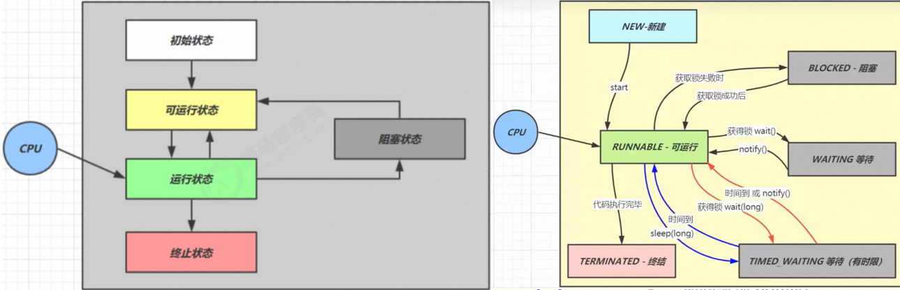
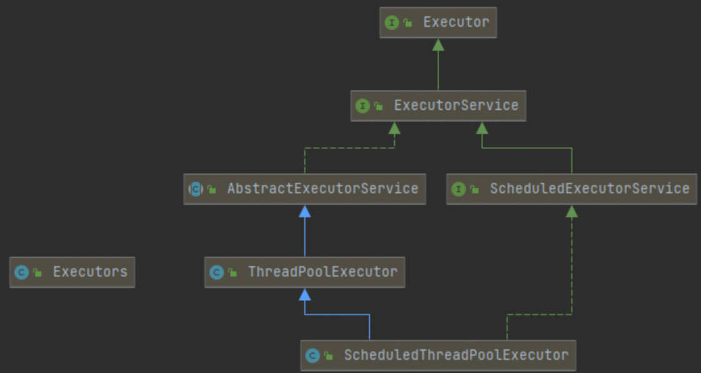
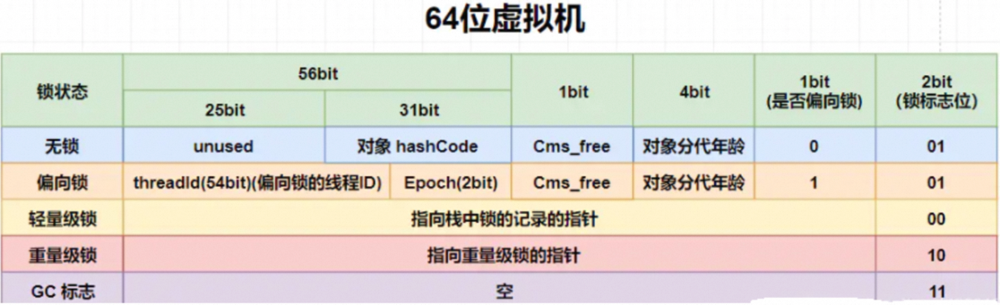
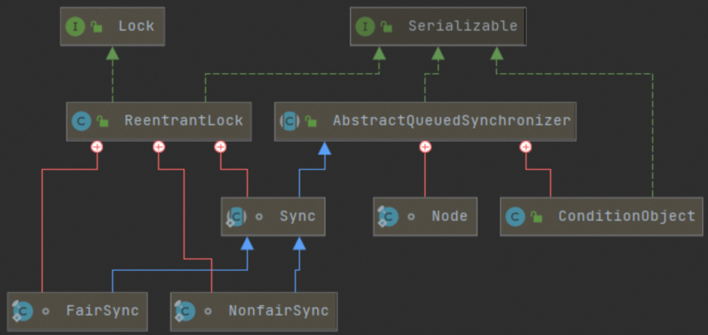
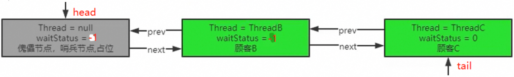
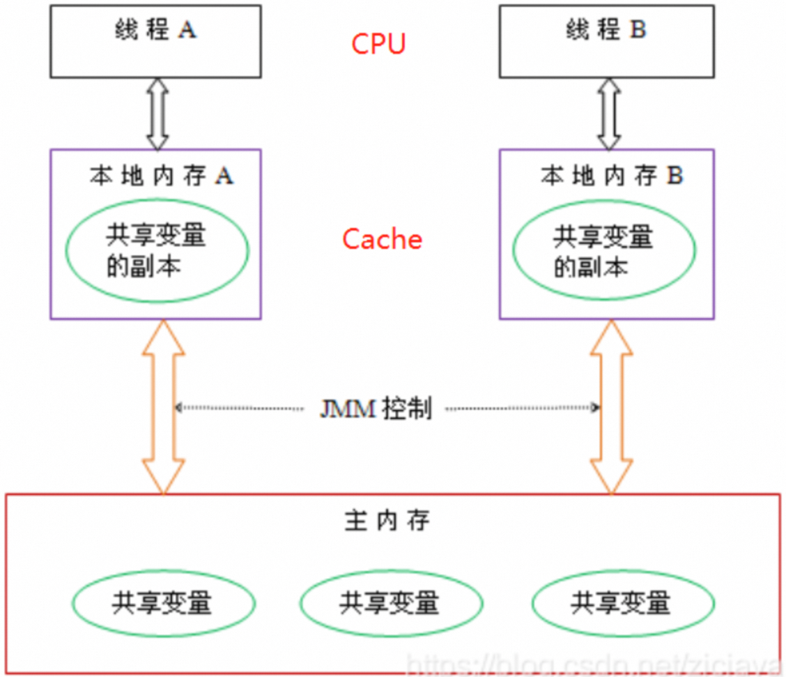
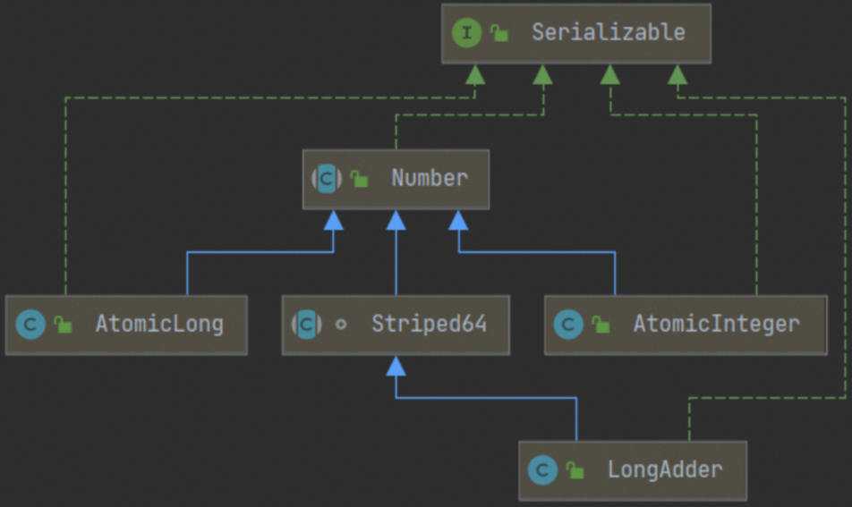
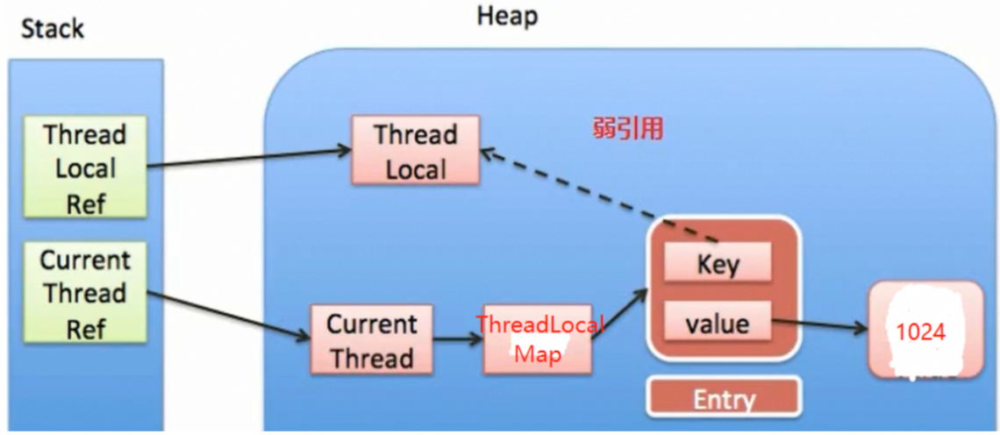
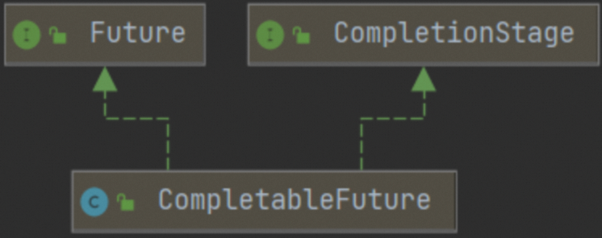

高并发有三宝：缓存、异步、队排好

高可用有三宝：分片、复制、选领导


面试必问：
- 手写单例、手写死锁、手写自旋锁、手写生产者消费者
- 线程池参数
- synchronized 锁升级、读写锁锁降级
- volatile 四大内存屏障
- CAS 以及 ABA 问题
- Java 对象头，new Object() 和 new Thread() 占几个字节？答：16
- 原子操作类的 base + cell[]
- ThreadLocal
- AQS

> 注意：Java 多线程必须在 main 方法下测，在单元测试里测不出来
>
> Java 中的线程分为：用户线程、守护线程；
>
> 两者几乎完全相同，只不过守护线程是用来服务用户线程的，线程可调用 setDaemon(true) 由用户线程转为守护线程。

注意：在分布式系统下
```java
// 不要使用，因为抢不到锁就阻塞！
lock.lock();
try {
    // TODO
} catch (Exception e) {
    e.printStackTrace();
} finally {
    lock.unlock();
}

// 建议使用，抢不到锁自旋轮询
// if (lock.tryLock())						// 抢不到锁立刻执行 else
if (lock.tryLock(3L, TimeUnit.SECONDS)) {	// 3s 内抢不到锁再执行 else
    try() {
        // TODO
    } catch (Exception e) {
        e.printStackTrace();
    } finally {
        lock.unlock();
    }
} else {
    // 没抢到锁
}
```

# 一、线程
## 1、Thread 类
> 面试题：Thread.run()、Thread.start() 区别？ 
> - 在主线程调用 Thread.start()：启动新的线程（只能调一次，多次调用会抛异常）； 
> - 在主线程调用 Thread.run()：相当于调用了一个普通方法，还在主线程内。

```java
// 构造器：
Thread();
Thread(String name);                    // 创建线程，并指定线程名
Thread(Runnable target);
Thread(Runnable target, String name);	// 创建线程，并指定线程名

// 常用 API：
void start();                           // 启动线程；执行其 run() 方法，并不是立刻启动，只是让线程就绪，要等时间片
void run();                             // 线程要执行的操作
 
long getId();                           // 获取 tid
String getName();                       // 获取当前线程的名字
void setName(String name);              // 设置当前线程的名字
Thread currentThread();                 // 返回当前线程，常用于主线程和 Runnable 实现类

void yield();                           // 线程让步，释放 CPU 时间片，让其他线程先执行，当前线程由运行变为就绪
void join();                            // 等待线程运行结束，线程 A 中调用 B.join()，则 A 阻塞，等待 B 执行完后再继续执行 A
void join(long n);                      // 最多等待 n 毫秒
void sleep(long n);                     // 阻塞 n 毫秒
boolean isAlive();                      // 当前线程是否存活 (运行完毕)
State getState();                       // 获取线程状态
void setDaemon(boolean on);             // 守护线程
```

> 线程优先级： 
> - 线程创建时继承父线程的优先级；
> - 低优先级只是获得 CPU 调度的概率低，并非一定是在高优先级线程之后才被调度。

```java
public final static int MIN_PRIORITY = 1;
public final static int NORM_PRIORITY = 5;	// 默认优先级
public final static int MAX_PRIORITY = 10;

public final int getPriority();
public final void setPriority(int newPriority);
```

## 2、线程的生命周期
> OS 线程的 5 种状态、Java 线程的 6 种状态：
```java
public enum State {
    NEW,            // 新建
    RUNNABLE,		// 运行
    BLOCKED,		// 阻塞（被动）；线程抢不到锁会变成 BLOCKED，必须等待抢到锁
    WAITING,		// 等待（主动），线程调用 wait() 会变成 WAITING，必须等待 notify() 才能获取时间片
    TIMED_WAITING,	// 有限等待，如 wait(500)
    TERMINATED;		// 死亡
}
```


## 3、创建线程
### 3.1、方式一：继承 Thread 类
> 继承 Thread 类，重写 run()：
```java
class MyThread extends Thread {

    @Override
    public void run() {
        System.out.println(Thread.currentThread().getName());
    }

    public static void main(String[] args) {    // 主线程
        new MyThread().start(); 				// 启动子线程
    }
}
```

### 3.2、方式二：实现 Runnable 接口
```java
// 不建议使用：Java 是单继承的，若一个类已经有父类了，则不可能再继承 Thread 类；
class MyThread implements Runnable {

    @Override
    public void run() {
        System.out.println(Thread.currentThread().getName());
    }

    public static void main(String[] args) {
        new Thread(new MyThread(), "线程1").start();
    }
}

// Lambda 表达式简化
class MyThread {
    public static void main(String[] args) {
        new Thread(() -> System.out.println(Thread.currentThread().getName())).start();
    }
}
```

### 3.3、方式三：实现 Callable 接口
> Callable 比 Runnable 更强大：
> - call() 有返回值，run() 无返回值；
> - call() 方法无法完成计算时会抛异常，run() 不会；
> - Callable 需要借助 FutureTask 获取返回结果。

```java
@FunctionalInterface
public interface Callable<V> {
    V call() throws Exception;
}
```
> Future 接口定义了**异步任务**的相关方法：
```java
public interface Future<V> {

    boolean cancel(boolean mayInterruptIfRunning);              // 如果尚未启动，它将中断任务。如果已启动，则仅在 mayInterrupt = true 中断任务

    boolean isCancelled();

    boolean isDone();                                           // 任务是否完成

    V get() throws InterruptedException, ExecutionException;	// 阻塞等待结果，可以 get 多次，只有第一次会阻塞

    V get(long timeout, TimeUnit unit) throws InterruptedException, ExecutionException, TimeoutException;	// 有限等待
}
```

> - **FutureTask** 是 Future 接口的唯一的实现类；
> - FutureTask 同时实现了 Runnable、Future 接口，既可作为 Runnable 被线程执行，又可作为 Future 得到 Callable 的返回值！

```java
public static void main(String[] args) {
    FutureTask<Integer> futureTask = new FutureTask<>(() -> {	// FutureTask(Callable)
        return 1024;
    });
    new Thread(futureTask).start();
    while (!futureTask.isDone()) {
        System.out.println("wait...");
    }
    System.out.println("总和为：" + futureTask.get());
}
```

### 3.4、方式四：线程池
#### <font style="color:red;">3.4.1、ThreadPool</font>
> 优点：
> - 可设置参数管理线程的数量，防止一直创建线程把 CPU、Memory 打满；
> - 线程拿来就用，不用频繁的创建、销毁；



**1、API**

```java
// 1.构造器，七大参数：
public ThreadPoolExecutor(int corePoolSize,                     // 1.核心线程数
                          int maximumPoolSize,                  // 2.最大线程数
                          long keepAliveTime,                   // 3.空闲线程（非核心线程）的存活时间
                          TimeUnit unit,                        // 4.存活时间的单位
                          BlockingQueue<Runnable> workQueue, 	// 5.阻塞队列
                          ThreadFactory threadFactory,          // 6.线程工厂，用于创建线程，一般用默认的即可
                          RejectedExecutionHandler handler); 	// 7.拒绝策略，阻塞队列满时，拒绝任务的策略

// 2.Executors：线程池工具类，以下四个方法底层都是调用 ThreadPoolExecutor 的构造器创建的
Executors.newSingleThreadExecutor();   // 只有一个线程
Executors.newFixedThreadPool(n);       // 固定 n 个线程
Executors.newCachedThreadPool();       // 线程池会自动调节线程数，会根据需要自动新建和回收线程
Executors.newScheduledThreadPool(n);   // 线程池支持定时任务、周期任务，了解
// Alibaba 开发手册禁止使用 Executors 创建线程池，因为不能控制阻塞队列的长度（最长可达为 Integer.MAX_VALUE）、或不能控制最大线程数（最多可达为 Integer.MAX_VALUE），容易 OOM。

/*
Runtime.getRuntime().availableProcessors() 返回 CPU 核数
3. 若程序是 CPU 密集型，设置 corePoolSize = CPU 核数 + 1
       CPU 可能会出现缺页中断、任务异常等 IO 操作，+1 可以最大限度的发挥多核 CPU 的优势。
       
   若程序是 I O 密集型，设置 corePoolSize = CPU 核数 * 2 + 1 (要根据业务情况去计算，阻塞队列起 delay 的作用)
   	   - tasks：每秒的任务数，假设 500 ~ 1000，80% 情况下是 800
       - task_time：每个任务花费时间，假设 100ms
       - response_time：系统容忍的最大响应时间，假设发起请求后 1s 内必须响应！
       corePoolSize = tasks * tascorePoolSizek_time = 50~100 个，
           因为 tasks * tascorePoolSizek_time = 50~100s，即：对于 1s 内的所有任务，单线程要处理 50~100s，
           则 50~100 个线程只需要处理 1s！若 80% 情况下 tasks = 800，则设置 corePoolSize = 80 即可！
       阻塞队列的容量 = (corePoolSize / task_time) * response_time = (80 / 0.1) * 1 = 800

   https://mp.weixin.qq.com/s/i2wHBF_u_zrUDSCpaYX0Zw
*/

// 4.ThreadPoolExecutor API
void execute(Runnable command);          // 执行 Runnable 任务，无返回值
<T> Future<T> submit(Callable<T> task);  // 执行 Callable 任务，有返回值

// 提交一组任务 tasks，所有任务都执行完再返回
<T> List<Future<T>> invokeAll(Collection<? extends Callable<T>> tasks);
<T> List<Future<T>> invokeAll(Collection<? extends Callable<T>> tasks, long timeout, TimeUnit unit);

// 提交一组任务 tasks，只要有一个任务执行完就返回，其它任务取消
<T> T invokeAny(Collection<? extends Callable<T>> tasks);
<T> T invokeAny(Collection<? extends Callable<T>> tasks, long timeout, TimeUnit unit);

void shutdown();                 // 线程池优雅关闭，不会接收新任务，但已提交的任务会执行完，非阻塞
List<Runnable> shutdownNow();    // 线程池强制关闭，不会接收新任务，试图停止所有正在执行的任务，若任务不可 interrupt，则等待其执行完，返回已提交未执行完的任务
boolean awaitTermination(long timeout, TimeUnit unit);    // 阻塞等待线程池关闭，返回内线程池任务是否都执行完

boolean prestartCoreThread();    // 预热，立即创建一个核心线程
int prestartAllCoreThreads();	 // 预热，立即创建所有核心线程

public class ThreadPoolConfig {

    public static final ThreadPoolExecutor threadPoolExecutor = new ThreadPoolExecutor(4, 8, 10, TimeUnit.SECONDS, 
             new SynchronousQueue<>(), new NamedThreadFactory("myThread"), new ThreadPoolExecutor.CallerRunsPolicy());

    // 注册 JVM 钩子，JVM 关闭前执行（如果是 Spring 环境，用 @PreDestory 就行）
    static {
        Runtime.getRuntime().addShutdownHook(new Thread(() -> {
            threadPoolExecutor.shutdown();    // 关闭线程池，不会接收新任务，不阻塞主线程
            // 阻塞等待线程池关闭
            // 只用 shutdown 没用，因为非阻塞，线程池内任务没完成 JVM 也会关闭；必须要配合 awaitTermination 等待线程池关闭后再关闭 JVM；
            boolean finished = threadPoolExecutor.awaitTermination(5, TimeUnit.SECONDS);
            System.out.println("线程池任务执行完成：" + finished);
        }));
    }

    // 自定义线程名
    static class NamedThreadFactory implements ThreadFactory {

        private final String namePrefix;

        public NamedThreadFactory(String namePrefix) {
            this.namePrefix = namePrefix;
        }

        @Override
        public Thread newThread(Runnable r) {
            Thread thread = new Thread(r);
            thread.setName(namePrefix + "-" + thread.threadId());
            return thread;
        }
    }
}
```

**2、线程池的工作原理**
> 1. 线程池创建后，里面的<font style="color:#DF2A3F;background-color:#FBDE28;">线程数为 0</font>；
> 2. 当调用 execute() 处理任务时： 
>     - 若线程数 < corePoolSize，则立刻创建核心线程执行该任务；
>     - 若线程数 ≥ corePoolSize，则将该任务放入阻塞队列；
>     - 若线程数 ≥ corePoolSize，且阻塞队列已满，则创建非核心线程立刻执行该任务，而阻塞队列的任务还在等待 (总线程数要 < maximumPoolSize)；
>     - 若阻塞队列已满，且正在运行的线程数量达到 maximumPoolSize，则线程池会启动拒绝策略拒绝该任务； 
> 3. 当一个线程执行完任务时，会从阻塞队列取下一个任务来执行；
> 4. 当一个非核心线程空闲超过 keepAliveTime 时，该线程就被回收；核心线程不会被回收。
>
> 面试：线程池 corePoolSize = 7，maximumPoolSize = 20，BlockingQueue.size() = 50，100 个并发进来，线程怎么分配？
>
> 答：7 个任务立即执行，50 个任务进入阻塞队列，13 个任务会创建线程立即执行，剩余 30 个任务使用拒绝策略。

**3、拒绝策略**
> - AbortPolicy (默认)：丢弃任务，抛 RejectedExecutionException 异常；
> - CallerRunsPolicy：把该任务返还给调用者同步执行，不异步了；
> - DiscardOldestPolicy：丢弃阻塞队列中等待最久的一个任务，并将新任务加入；
> - DiscardPolicy：丢弃任务，不抛异常。

**4、线程异常怎么办？**
> - execute() 会将异常打印到控制台，而 submit() 不会，必须调用 Future.get() 时，才能可以捕获到异常；
> - 一个线程出现异常不会影响线程池里其他线程；
> - 异常线程会被移除掉，同时创建一个新的线程放到线程池中；
> - **子线程出现异常并不影响主线程！！！**

#### 3.4.2、ForkJoinPool (jdk7)
> 注意：ForkJoinPool 编写起来很难，所以一般不用，ParallelStream 底层就采用 ForkJoinPool 实现的并行计算！ 
>
> ForkJoinPool 适合做 CPU 密集型运算：

### 3.5、方式五：@Async  
> @Async  是 SpringBoot 自带的！ 
>
> 注意坑：
> - 异步方法使用 static 修饰，会导致 @Async  失效； 
> - 异步方法所属类没被 Spring 管理 (没标 @Component  注解)，会导致 @Async  失效； 
> - 异步方法不能与调用方法在同一个类中，否则会导致 @Async  失效； 

```java
@EnableAsync    // 开启异步
@SpringBootApplication
public class MainApp {
    public static void main(String[] args) {
        SpringApplication.run(MainApp.class, args);
    }
}
```

> 配置线程池：
> - ThreadPoolExecutor：JVM 线程池；
> - ThreadPoolTaskExecutor：是 Spring 对 JVM 线程池的封装，可配置多个（线程隔离）；

```java
@Configuration
public class ThreadPoolConfig {
    @Bean
    public ThreadPoolTaskExecutor threadPoolTaskExecutor01() {
        ThreadPoolTaskExecutor taskExecutor = new ThreadPoolTaskExecutor();
        taskExecutor.setThreadNamePrefix("1号线程池-");
        taskExecutor.setCorePoolSize(10);
        taskExecutor.setMaxPoolSize(100);
        taskExecutor.setQueueCapacity(50);
        taskExecutor.setKeepAliveSeconds(200);
        taskExecutor.setRejectedExecutionHandler(new ThreadPoolExecutor.AbortPolicy());
        taskExecutor.setWaitForTasksToCompleteOnShutdown(true);    // 等待所有的任务结束后再关闭线程池
        taskExecutor.initialize();
        return taskExecutor;
    }

    @Bean
    public ThreadPoolTaskExecutor threadPoolTaskExecutor02() {
        ThreadPoolTaskExecutor taskExecutor = new ThreadPoolTaskExecutor();
        taskExecutor.setThreadNamePrefix("2号线程池-");
        taskExecutor.setCorePoolSize(10);
        taskExecutor.setMaxPoolSize(100);
        taskExecutor.setQueueCapacity(50);
        taskExecutor.setKeepAliveSeconds(200);
        taskExecutor.setRejectedExecutionHandler(new ThreadPoolExecutor.AbortPolicy());
        taskExecutor.setWaitForTasksToCompleteOnShutdown(true);
        taskExecutor.initialize();
        return taskExecutor;
    }

    @Bean
    public ThreadPoolTaskExecutor threadPoolTaskExecutor03() {
        ThreadPoolTaskExecutor taskExecutor = new ThreadPoolTaskExecutor();
        taskExecutor.setThreadNamePrefix("3号线程池-");
        taskExecutor.setCorePoolSize(10);
        taskExecutor.setMaxPoolSize(100);
        taskExecutor.setQueueCapacity(50);
        taskExecutor.setKeepAliveSeconds(200);
        taskExecutor.setRejectedExecutionHandler(new ThreadPoolExecutor.AbortPolicy());
        taskExecutor.setWaitForTasksToCompleteOnShutdown(true);
        taskExecutor.initialize();
        return taskExecutor;
    }
}
```
```java
@Service
public class TaskService {

    @Async("threadPoolTaskExecutor01")    // 执行线程池
    public Future<String> do1() throws InterruptedException {
        TimeUnit.SECONDS.sleep(1);
        return new AsyncResult<>("111");
    }

    @Async("threadPoolTaskExecutor02")
    public Future<String> do2() throws InterruptedException {
        TimeUnit.SECONDS.sleep(2);
        return new AsyncResult<>("222");
    }

    @Async("threadPoolTaskExecutor03")
    public Future<String> do3() throws InterruptedException {
        TimeUnit.SECONDS.sleep(3);
        return new AsyncResult<>("333");
    }
}
```
```java
@RestController
public class TaskController {

    @Autowired
    private TaskService taskService;

    @GetMapping("/test")
    public String test() throws ExecutionException, InterruptedException {
        long t1 = System.currentTimeMillis();
        Future<String> future1 = taskService.do1();
        Future<String> future2 = taskService.do2();
        Future<String> future3 = taskService.do3();
        String s1 = future1.get();
        String s2 = future2.get();
        String s3 = future3.get();
        System.out.println("执行时间：" + System.currentTimeMillis() - t1);    // 3s 多一点
        return s1 + s2 + s3;
    }
}
```

> 结果：可以看到，3 个线程分别来自 3 个线程池！
```plain
2022-11-03 17:17:34.755  INFO 6956 --- [1号线程池-1] com.njj.service.TaskService: 任务 1 执行完成
2022-11-03 17:17:35.766  INFO 6956 --- [2号线程池-1] com.njj.service.TaskService: 任务 2 执行完成
2022-11-03 17:17:36.756  INFO 6956 --- [3号线程池-1] com.njj.service.TaskService: 任务 3 执行完成
执行时间：3018
```

## 4、线程中断
> 面试 (蚂蚁金服)：如何停止、中断一个运行中的线程？答：重点讲 **Thread.interrupt()**
>
> 注意：
> - 已经获取 synchronized 锁的线程可以被中断，等待 synchronized 锁的线程不能被中断；
> - 已经获取 ReentrantLock 锁的线程可以被中断，等待 ReentrantLock 锁的线程要分情况：若用 ReentrantLock#lock()，则不可中断；若用 ReentrantLock#lockInterruptibly()，则可以中断！

### 4.1、方式一：volatile 变量
```java
private static volatile boolean stop;    // volatile: 一个线程修改 volatile 变量后，其他线程立刻可见

public static void main(String[] args) throws InterruptedException {
    new Thread(() -> {
        while (true) {
            if (stop) {
                System.out.println("子线程收到打断通知，开始做善后工作，并结束");
                break;
            }
            System.out.println("子线程正在运行");
        }
    }).start();

    TimeUnit.SECONDS.sleep(1);
    stop = true;
}
```

> 原子类也使用了 volatile：
```java
private static AtomicBoolean stop = new AtomicBoolean(false);

public static void main(String[] args) throws InterruptedException {
    new Thread(() -> {
        while (true) {
            if (stop.get()) {
                System.out.println("子线程收到打断通知，开始做善后工作，并结束");
                break;
            }
            System.out.println("子线程正在运行");
        }
    }).start();

    TimeUnit.SECONDS.sleep(1);
    stop.set(true);
}
```

### 4.2、方式二：Thread.interrupt
> - 线程优雅停止：Thread.interrupt() 是一种通知机制，仅将线程的中断标识置为 true，至于线程是否立刻中断由它自己决定！！！
> - 线程强制停止：Thread.stop()、Thread.suspend()、Thread.resume() 都已过时。

```java
public class Thread implements Runnable {
    // 将当前线程的中断标识置为 true，
    // 若当前线程处于阻塞状态 (sleep、wait、join) 时调用该方法，则抛 interruptedException，且中断标识置为 false
    public void interrupt();
    public static boolean interrupted();      // 1.返回当前线程的中断标识 2.清除当前线程的中断标识 (置为false)
    public boolean isInterrupted();	      // 返回当前线程的中断标识
}
```

```java
public static void main(String[] args) throws InterruptedException {
    Thread t1 = new Thread(() -> {
        while (true) {
            if (Thread.currentThread().isInterrupted()) {
                System.out.println("子线程收到打断通知，开始做善后工作，并结束");
                break;
            }
            System.out.println("子线程正在运行");
        }
    });
    t1.start();

    TimeUnit.SECONDS.sleep(1);
    t1.interrupt();
}
```

## 5、线程通信
### 5.1、synchronized 方案
```java
// 注意：必须使用在同步代码块或同步方法中，且调用者必须是 Monitor，否则报 IllegalMonitorStateException 异常。
Object.wait();              // 阻塞当前线程，直到被 notify，并释放同步监视器
Object.wait(long milli);    // 有限等待
Object.notify();            // 唤醒同步监视器的被 wait 的一个线程（优先唤醒优先级高的线程）
Object.notifyAll();         // 唤醒同步监视器的所有被 wait 的线程
```

> 释放锁的时机：
> - 同步代码块 / 同步方法执行结束；
> - 同步代码块 / 同步方法中 break、return；
> - 同步代码块 / 同步方法中出现了未处理异常；
> - 同步代码块 / 同步方法中执行了 Monitor.wait() 方法。
>
> 面试题：sleep() 和 wait() 的异同？
> - 同：1. 都能使当前线程进入阻塞状态；  
       2. 它们都可以被 interrupted() 方法中断。 
> - 异：1. sleep() 位于 Thread 类，wait() 位于 Object 类；  
      2. sleep() 随便用，wait() 只能在同步代码块 / 同步方法中使用；  
      3. sleep() 不会释放锁，它也不需要占用锁 (Thread.yield() 也不会释放锁)，wait() 会释放锁，必须在同步代码块中用。 
>
> 多线程编程步骤 (上)：
> 1. 创建资源类，创建资源类的属性、操作方法；
> 2. 操作方法的具体实现：判断、干活、通知；
> 3. 创建多个线程，调用资源类的操作方法。

案例一：两个窗口交替卖票，窗口 1 卖奇数票，窗口 2 卖偶数票

```java
@Slf4j
class Window {

    private int tickets = 100;

    private synchronized void showEven() throws InterruptedException {
        if (tickets % 2 == 1) wait();	// 1.判断
        if (tickets > 0)				// 2.干活
            log.info(Thread.currentThread().getName() + ":卖票，票号为：" + tickets--);
        notifyAll();					// 3.通知
    }

    private synchronized void showOdd() throws InterruptedException {
        if (tickets % 2 == 0) wait();
        if (tickets > 0)
            log.info(Thread.currentThread().getName() + ":卖票，票号为：" + tickets--);
        notifyAll();
    }

    public static void main(String[] args) {
        Window window = new Window();
        new Thread(() -> { while (true) window.showOdd();  }, "窗口1").start();
        new Thread(() -> { while (true) window.showEven(); }, "窗口2").start();
    }
}
```

案例二：四个窗口交替卖票，窗口 1、3 卖奇数票，窗口 2、4 卖偶数票

```java
new Thread(() -> { while (true) window.showOdd();  }, "窗口1").start();
new Thread(() -> { while (true) window.showEven(); }, "窗口2").start();
new Thread(() -> { while (true) window.showOdd();  }, "窗口3").start();
new Thread(() -> { while (true) window.showEven(); }, "窗口4").start();
```

> wait() 方法必须用在 while() 中，而非 if() ：防止虚假唤醒，类似 double check；
>
> 以上代码存在**虚假唤醒**问题，会出现 3 号窗口卖偶数票、4号窗口卖奇数票等，原因如：
> - 窗口 2 先卖100号票；
> - 窗口 4 抢到 CPU，陷入 wait()；
> - 窗口 2 再次抢到 CPU，陷入 wait()；
> - 窗口 4 再次抢到 CPU，此时不再 wait()，执行 wait() 的下一条代码，因为 wait() 在哪里睡，就在哪里醒！！！
>
> 解决办法：将 `if (tickets % 2 != 0) wait();` 中的 if 改为 while。
>
> 多线程编程步骤（下）：
> 1. 创建资源类，创建资源类的属性、操作方法；
> 2. 操作方法的具体实现：判断、干活、通知；
> 3. 创建多个线程，调用资源类的操作方法；
> 4. 防止**虚假唤醒**问题，将 2 中的 if 改为 while！

面试：两线程交替打印

```java
@Slf4j
public class User {

    volatile boolean flag;

    public static void main(String[] args) {
        User user = new User();

        new Thread(() -> {
            while (true) {
                synchronized (user) {
                    while (user.flag) user.wait();
                    user.flag = true;
                    log.info("Thread1");
                    user.notifyAll();
                }
            }
        }, "Thread1").start();

        new Thread(() -> {
            while (true) {
                synchronized (user) {
                    while (!user.flag) user.wait();
                    user.flag = false;
                    log.info("Thread2");
                    user.notifyAll();
                }
            }
        }, "Thread2").start();
    }
}
```

面试：三线程交替打印

```java
@Slf4j
public class User {

    volatile int flag = 1;

    public static void main(String[] args) {
        User user = new User();

        new Thread(() -> {
            while (true) {
                synchronized (user) {
                    while (user.flag != 1) user.wait();
                    user.flag = 2;
                    log.info("Thread1");
                    user.notifyAll();
                }
            }
        }, "Thread1").start();

        new Thread(() -> {
            while (true) {
                synchronized (user) {
                    while (user.flag != 2) user.wait();
                    user.flag = 3;
                    log.info("Thread2");
                    user.notifyAll();
                }
            }
        }, "Thread2").start();

        new Thread(() -> {
            while (true) {
                synchronized (user) {
                    while (user.flag != 3) user.wait();
                    user.flag = 1;
                    log.info("Thread3");
                    user.notifyAll();
                }
            }
        }, "Thread3").start();
    }
}
```

面试：生产者 - 消费者 (不允许用 BlockingQueue，要自己实现)

```java
class MyBlockingQueue {

    private int maxCapacity;
    private Queue<Integer> queue;

    public MyBlockingQueue(int maxCapacity) {
        this.maxCapacity = maxCapacity;
        this.queue = new ArrayDeque<>();
    }

    public synchronized void offer(int num) throws InterruptedException {
        while (queue.size() == maxCapacity) wait();
        queue.offer(num);
        notifyAll();
    }

    public synchronized Integer poll() throws InterruptedException {
        while (queue.isEmpty()) wait();
        Integer num = queue.poll();
        notifyAll();
        return num;
    }

    public static void main(String[] args) {
        MyBlockingQueue queue = new MyBlockingQueue(5);

        new Thread(() -> {
            while (true) {
                TimeUnit.SECONDS.sleep(1);
                int num = new Random().nextInt(5);
                queue.offer(num);
                log.info("producer 生产了一个：{}", num);
            }
        }, "producer").start();

        new Thread(() -> {
            while (true) {
                TimeUnit.SECONDS.sleep(2);
                Integer num = queue.poll();
                log.info("consumer 消费了一个：{}", num);
            }
        }, "consumer").start();
    }
}
```

### 5.2、Lock 方案
```java
// Condition 必须使用在 Lock.lock() 和 Lock.unlock() 之间；
Condition.await();
Condition.await(long time, TimeUnit unit);
Condition.signal();
Condition.signalAll();
```

```java
@Slf4j
class Window {

    private int tickets = 100;
    private Lock lock = new ReentrantLock();
    private Condition condition = lock.newCondition();

    private void showEven() throws InterruptedException {
        lock.lock();
        try {
            while (tickets % 2 == 1) condition.await();		// 1.判断
            if (tickets > 0)                            	// 2.干活
                log.info(Thread.currentThread().getName() + ":卖票，票号为：" + tickets--);
            condition.signalAll();                      	// 3.通知
        } finally {
            lock.unlock();
        }
    }

    private void showOdd() throws InterruptedException {
        lock.lock();
        try {
            while (tickets % 2 == 0) condition.await();
            if (tickets > 0)
                log.info(Thread.currentThread().getName() + ":卖票，票号为：" + tickets--);
            condition.signalAll();
        } finally {
            lock.unlock();
        }
    }

    public static void main(String[] args) {
        new Thread(() -> { while (true) window.showOdd(); }, "窗口1").start();
        new Thread(() -> { while (true) window.showEven();}, "窗口2").start();
        new Thread(() -> { while (true) window.showOdd(); }, "窗口3").start();
        new Thread(() -> { while (true) window.showEven();}, "窗口4").start();
    }
}
```

### 5.3、定制化线程通信
> 案例：按照 "窗口1 → 窗口2 → 窗口3" 的顺序卖票，每个窗口每次卖5张。

```java
@Slf4j
class Window {

    private int flag = 1;   // 1：窗口1卖票  2：窗口2卖票  3：窗口3卖票
    private int tickets = 100;
    private Lock lock = new ReentrantLock();
    private Condition condition1 = lock.newCondition();
    private Condition condition2 = lock.newCondition();
    private Condition condition3 = lock.newCondition();

    private void show1() throws InterruptedException {
        lock.lock();
        try {
            while (flag != 1) condition1.await();			// 1.判断
            for (int i = 0; i < 5 && tickets > 0; i++) { 	// 2.干活
                log.info(Thread.currentThread().getName() + ":卖票，票号为：" + tickets--);
            }
            flag = 2;
            condition2.signal();                      		// 3.通知
        } finally {
            lock.unlock();
        }
    }

    private void show2() throws InterruptedException {
        lock.lock();
        try {
            while (flag != 2) condition2.await();
            for (int i = 0; i < 5 && tickets > 0; i++) {
                log.info(Thread.currentThread().getName() + ":卖票，票号为：" + tickets--);
            }
            flag = 3;
            condition3.signal();
        } finally {
            lock.unlock();
        }
    }

    private void show3() throws InterruptedException {
        lock.lock();
        try {
            while (flag != 3) condition3.await();
            for (int i = 0; i < 5 && tickets > 0; i++) {
                log.info(Thread.currentThread().getName() + ":卖票，票号为：" + tickets--);
            }
            flag = 1;
            condition1.signal();
        } finally {
            lock.unlock();
        }
    }

    public static void main(String[] args) {
        Window window = new Window();
        new Thread(() -> { while (true) window.show1(); }, "窗口1").start();
        new Thread(() -> { while (true) window.show2(); }, "窗口2").start();
        new Thread(() -> { while (true) window.show3(); }, "窗口3").start();
    }
}
```

### 5.4、LockSupport
> LockSupport 使用 permit 实现线程的阻塞和唤醒，每个线程都有一个 permit，permit 只能取 0、1，默认为 0 表示阻塞。

```java
public class LockSupport {
    public static void park();
    public static void unpark(Thread thread);
}
```

| 线程通信的方法 | 限制 |
| --- | --- |
| Object：wait()、notify() | 1. wait()、notify() 必须用在 synchronized 内部    2. 必须先 wait() 再 notify() |
| Condition：await()、signal() | 同上 |
| LockSupport：park()、unpark() | 无 |

> 案例一：
```java
public static void main(String[] args) throws InterruptedException {
    Thread t1 = new Thread(() -> {
        System.out.println("子线程被阻塞");
        LockSupport.park();
        System.out.println("子线程被唤醒");
    });
    t1.start();

    TimeUnit.SECONDS.sleep(1);
    LockSupport.unpark(t1);
}
```

> 案例二：子线程会被阻塞，因为 permit 最大为 1，不会累加
```java
public static void main(String[] args) throws InterruptedException {
    Thread t1 = new Thread(() -> {
        try { TimeUnit.SECONDS.sleep(3); } catch (InterruptedException e) { e.printStackTrace(); }
        System.out.println("子线程被阻塞");
        LockSupport.park();
        LockSupport.park();
        System.out.println("子线程被唤醒");
    });
    t1.start();

    LockSupport.unpark(t1);
    LockSupport.unpark(t1);
}
```

# 二、锁
> 线程安全问题的原因：多个线程同时操作共享数据，由 JMM 可知，每个线程只能操作自己的工作内存，不能直接操作主存，所以多线程访问共享数据存在线程安全问题！

## 1、synchronized
> <font style="color:#DF2A3F;background-color:#FBDE28;">重写 synchronized 修饰的方法时，synchronized 不会被继承！</font>

```java
// 1、同步代码块
synchronized (monitor) { 
}

// 2、同步方法
public synchronized void func () {
}
```

> synchronized 锁的是同步监视器 (Monitor，管程对象)，Monitor 会和 Java 对象一同创建并销毁，每个对象都有一个 Monitor，底层由 C++ 实现。不要用字面量的 String 去充当 Monitor，Monitor 最好都是 new 出来的，或者用 String.intern()；

| 方法 | 锁 |
| :---: | :---: |
| synchronized | 当前对象 this |
| static synchronized | 当前类.class |
| synchronized(obj) | obj |
| 普通方法 | 没有锁 |


### 1.1、线程八锁
1、标准访问
```java
@Slf4j
class Test {
    public synchronized void func1() {
        log.info("func1");
    }

    public synchronized void func2() {
        log.info("func2");
    }

    public static void main(String[] args) throws InterruptedException {
        Test test = new Test();
        new Thread(test::func1).start();
        TimeUnit.SECONDS.sleep(1);
        new Thread(test::func2).start();
    }
}

// 输出：
// func1
// func2
```

2、func1() 内停 3s
```java
public synchronized void func1() {
    TimeUnit.SECONDS.sleep(3);
    log.info("func1");
}

// 输出还是：
// func1
// func2
// 因为先调用 func1，当前对象 this 被锁，func1 结束后释放 this，func2 才能执行！
```

3、调用普通方法 func3()
```java
@Slf4j
class Test {
    public synchronized void func1() {
        TimeUnit.SECONDS.sleep(3);
        log.info("func1");
    }

    public synchronized void func2() {
        log.info("func2");
    }

    public void func3() {
        log.info("func3");
    }

    public static void main(String[] args) throws InterruptedException {
        Test test = new Test();
        new Thread(test::func1).start();
        new Thread(test::func3).start();
    }
}

// 输出变成：
// func3
// func1
// 因为普通方法和同步锁无关
```

4、两个对象
```java
public static void main(String[] args) throws InterruptedException {
    Test test1 = new Test();
    Test test2 = new Test();
    new Thread(test1::func1).start();
    TimeUnit.SECONDS.sleep(1);
    new Thread(test2::func2).start();
}
// 输出变成：
// func2
// func1
// 因为两个对象对应两把锁，两个线程锁的不是同一个对象
```

5、两个静态同步方法，一个对象
```java
@Slf4j
class Test {
    public static synchronized void func1() {
        TimeUnit.SECONDS.sleep(3);
        log.info("func1");
    }

    public static synchronized void func2() {
        log.info("func2");
    }

    public static void main(String[] args) throws InterruptedException {
        Test test = new Test();
        new Thread(() -> test.func1()).start();
        TimeUnit.SECONDS.sleep(1);
        new Thread(() -> test.func2()).start();
    }
}
// 输出：
// func1
// func2
// 因为 static synchronized 锁的是 Test.class
```

6、两个静态同步方法，两个对象
```java
public static void main(String[] args) throws InterruptedException {
    Test test1 = new Test();
    Test test2 = new Test();
    new Thread(() -> test1.func1()).start();
    TimeUnit.SECONDS.sleep(1);
    new Thread(() -> test2.func2()).start();
}
// 输出还是：
// func1
// func2
// 因为 static synchronized 锁的是当前类 Test.class！
```

7、一个静态同步方法，一个普通同步方法，一个对象
```java
@Slf4j
class Test {
    public static synchronized void func1() {
        TimeUnit.SECONDS.sleep(3);
        log.info("func1");
    }

    public synchronized void func2() {
        log.info("func2");
    }

    public static void main(String[] args) throws InterruptedException {
        Test test = new Test();
        new Thread(() -> test.func1()).start();
        new Thread(() -> test.func2()).start();
    }
}
// 输出：
// func2
// func1
// 因为 func1 锁的是 Test.class，func2 锁的是 this
```

8、一个静态同步方法，一个普通同步方法，两个对象
```java
public static void main(String[] args) throws InterruptedException {
    Test test1 = new Test();
    Test test2 = new Test();
    new Thread(() -> test1.func1()).start();
    TimeUnit.SECONDS.sleep(1);
    new Thread(() -> test2.func2()).start();
}
// 输出还是：
// func2
// func1
// 因为 func1 锁的是 Test.class，func2 锁的是 this
```

### 1.2、锁升级 jdk6
> 面试：偏向锁和轻量级锁的区别？
>
> 答：轻量级锁每次退出同步块都需要释放锁，而偏向锁是在竞争发生时才释放锁。
>
> 面试：什么是偏向锁，说说偏向锁的撤销？
>
> 面试：synchronized 实现同步的时候用到 CAS 了吗？JVM 对 Java 原生锁做了哪些优化？为什么说 synchronized 是非公平锁？为什么说 synchronized 是悲观锁？
>
> 答：这 4 个问题都是锁升级的知识，1. 用到了，轻量级锁	2. 锁升级过程	3. 采用 OS 的 mutex 锁实现，非公平	4. 偏向锁、轻量级锁、重量级锁都是先上锁再操作！

> synchronized 是分阶段的，并不是上来就加重量级锁，效率太低，而是一步一步的锁升级：
> 1. 无锁；
> 2. 偏向锁；
> 3. 轻量级锁 (CAS 自旋)；
> 4. 重量级锁 (阻塞)；
>
> Java 对象头的 Mark Word：



1. 无锁 
> 新创建的对象默认无锁，Monitor 对象头的 Mark Word 最后三位为 001。 

2. 偏向锁 
> 出现原因：Hotspot 的作者经过研究发现，多线程的情况下，大多数时候并不存在多个线程竞争同一把所锁，而是一把锁总是被同一个线程连续多次获得！比如 3 个窗口卖 100 张票，几乎总是其中一个线程卖的最多，另外两个线程几乎没卖！ 
>
> 概念：**单线程**退出同步块时，该线程后续再次访问同步块时无需加锁解锁 (偏向锁)，可直接访问；
>
> 优点：只需要进入同步块时加锁一次，其他线程抢占同步块时解锁一次；
>
> 缺点：多线程竞争锁时，撤销偏向锁会消耗性能；
>
> 适用：**单线程**访问同步块。

| 加偏向锁 | 将 Monitor 对象头的最后 3 位改为 101，并将前 54 位改为当前线程的 ID，表示该 Monitor 偏向当前线程 |
| --- | --- |
| 释放偏向锁 | 将 Monitor 对象头恢复到无锁的状态 |

> 偏向锁只是在 JVM 层面比较对象头中的线程 ID，不涉及 OS 层面 (用户态到内核态的转换)，性能极高！ 
>
> 偏向锁默认开启，在 JDK15 默认关闭，在 JDK18 废弃；
>
> 若并发量很高，总是存在多线程竞争，则可以直接把偏向锁关掉，此时无锁可以直接升级到轻量级锁，避免了偏向锁加锁解锁的开销。 

3. 轻量级锁 
> 概念：多线程访问同步块时，得不到锁的线程 **CAS 自旋**，减少重量级锁的使用频率，本质就是自旋锁；
>
> 优点：竞争锁的线程不会阻塞 (但会自旋轮询)，提高了程序的响应速度；
>
> 缺点：CAS 本质是乐观锁，只适合读多写少，若多线程写操作竞争激烈，则效率很低；

| 加轻量级锁 | 将 Monitor 对象头的 Mark Word 最后 2 位改为 00 |
| --- | --- |
| 释放轻量级锁 | 将 Monitor 对象头的 Mark Word 恢复到偏向锁的状态 |

4. 重量级锁 
> 概念：多线程访问同步块时，进入同步块前后必须加锁解锁；
>
> 优点：多线程竞争锁不使用自旋 (但会阻塞)，不会消耗 CPU；
>
> 缺点：**<font style="color:#DF2A3F;">线程阻塞，响应非常慢，因为 Java 的线程是映射到 OS 原生线程之上的，要阻塞或唤醒一个 Java 线程就必须要 OS 介入，需要在户态与内核态之间切换，被阻塞的线程也要等到 CPU 时间片才能唤醒</font>**，而 Monitor 是 OS 的 Mutex Lock 实现的，因此 synchronized 效率很低，所以引入了偏向锁和轻量级锁。
>
> 适用：多线程写操作竞争激烈，追求吞吐量，同步块执行时间较长。

5. **<font style="color:#DF2A3F;">锁升级过程</font>**<font style="color:#DF2A3F;"> </font>
> -  当一个线程进入同步代码块后，会加偏向锁； 
> -  当偏向线程执行完同步块后，**不会主动释放偏向锁，只有遇到其他线程竞争偏向锁时，才会释放**； 
> -  后续线程试图进入该同步块时，先比较 Monitor 对象头中的偏向线程 ID 和该线程是否相等： 
> -  若相等，即偏向线程再次进入同步块，此时**无需再次加偏向锁 (提升性能)，因为上一次偏向线程已经加了，还没释放**； 
> -  若不等，则分两种情况： 
>     - 情况1：偏向线程已经执行完同步块时，另一线程来竞争偏向锁，则需要等待偏向线程到达 Safe Point (该时间点上没有字节码正在执行，即 STW) 时才能**释放偏向锁，Monitor 重新偏向为另一线程**；
>     - 情况2：偏向线程还没退出同步块时，另一线程来竞争偏向锁，则**偏向锁升级为轻量级锁**，轻量级锁依然被偏向线程持有，偏向线程继续执行同步块，而**另一线程 CAS 自旋等待**该轻量级锁的释放；
> -  若竞争偏向锁的线程很多，即：偏向线程持有轻量级锁执行同步块，其他所有线程都在 CAS 自旋，则 CPU 空转严重，所以当线程自旋达到一定次数时 (具体多少次由 JVM 自适应)，轻量级锁会升级为重量级锁； 
> -  升级到重量级锁后，偏向线程持有重量级锁执行同步块，其他所有线程不再 CAS 自旋，而是阻塞等待重量级锁的释放。 

6. 锁消除 
```java
public void func() {
    Object o = new Object();
    synchronized (o) {	 // 锁线程的局部对象，没有扩散到其他线程，即：线程之间不会竞争锁，JIT 会无视这次上锁
        System.out.println("-----------");
    }
}
```

7. 锁粗化 
```java
static Object o = new Object();

public static void main(String[] args) {
    new Thread(() -> {
        // 前后相邻的锁同一个对象，JIT 会优化这几个 synchronized 块，将其合并成一个大块，减少加锁解锁的次数
        synchronized (o) {
            System.out.println("11111");
        }
        synchronized (o) {
            System.out.println("22222");
        }
        synchronized (o) {
            System.out.println("33333");
        }
    }).start();
}
```

### 1.3、原理
> synchronized 是依赖 OS 的互斥锁实现的，JVM 在 OS 互斥锁的基础上做了很多优化：
> 1. 锁升级；
> 2. JVM 将锁信息保存在对象头，因此每个对象都能成为 Monitor；
> 3. 加锁解锁的字节码指令是 monitorenter、monitorexit；
> 4. JVM 自定义<font style="color:rgb(25, 27, 31);">一套线程的调度队列（</font>等待队列 _WaitSet、就绪队列 _<font style="color:rgb(25, 27, 31);">EntryList），</font>避免 OS 惊群效应；OS 有调度队列，但如果要唤醒一个线程，会把所有线程都唤醒，每个线程都判断自己是否应该被唤醒，即惊群效应。<font style="color:rgb(25, 27, 31);">JVM 为每个线程设置一个 mutex 互斥量，只需要释放这个线程对应的锁，就唤醒这个线程了。</font>

## 2、Lock (jdk5)
> 接口：java.util.concurrent.locks.Lock；
>
> 实现类：ReentrantLock (可重入锁)。
>
> 面试题：synchronized (**非公平**) 与 Lock 的区别：
> - synchronized 是 JVM 层面的锁，涉及到锁升级过程；ReentrantLock 是 Java 语言层面的锁，采用 AQS 实现！
> - synchronized 会自动释放锁；而 Lock 需要手动上锁和解锁；
> - synchronized 不可中断，除非正常执行结束或抛异常；ReentrantLock 可中断 (Thread#interrupt)；
> - Lock 的功能比 synchronized 更强大，如 公平锁、非公平锁、读写锁、锁降级、条件变量 Condition、tryLock() 非阻塞加锁；
>
> 面试题：synchronized 和 Lock 的性能？优先使用顺序？
> - 多线程竞争不激烈时，synchronized 性能好，因为 synchronized 轻量级锁没有阻塞，效率高，Lock 抢不到锁会直接阻塞；
> - 竞争激烈时，Lock 性能好一点，首先 synchronized 锁升级过程会消耗性能、其次 Lock 的调度队列 AQS 是 Java 实现的，synchronized 的调度是 native 的，虽然 native 代码的执行比 Java 快，但调 native 的过程很慢，高并发时尤其明显！

```java
public class Window {

    private int tickets = 100;
    private ReentrantLock lock = new ReentrantLock();   // 1.实例化 ReentrantLock

    private void show() {
        lock.lock();        	// 2.加锁，注意：一定要写到 try 外面且和 try 紧邻！避免 lock 和 try 中间出现异常导致 unlock 不会被执行！
        try {
            if (tickets > 0) {
                try { Thread.sleep(100); } catch (InterruptedException e) { e.printStackTrace(); }
                System.out.println(Thread.currentThread().getName() + "：售票，票号为：" + tickets--);
            }
        } finally {
            lock.unlock();      // 3.解锁，注意：一定要写在 finally 的第一行！避免 finally 内出现异常导致 unlock 不会被执行！
        }
    }

    public static void main(String[] args) {
        Window window = new Window();
        Runnable runnable = () -> {
            while (true) window.show();
        };
        new Thread(runnable, "窗口1").start();
        new Thread(runnable, "窗口2").start();
        new Thread(runnable, "窗口3").start();
    }
}
```

### 2.1、公平锁 & 非公平锁
> 面试：为什么默认非公平？使用公平锁有什么问题？两者适用场景 (重视吞吐量就用非公平锁)？

```java
// 源码
public ReentrantLock() {
    sync = new NonfairSync();	// ReentrantLock 的构造器，默认创建非公平锁
}

public ReentrantLock(boolean fair) {
    sync = fair ? new FairSync() : new NonfairSync();
}

// 公平锁源码
protected final boolean tryAcquire(int acquires) {
    final Thread current = Thread.currentThread();
    int c = getState();
    if (c == 0) {
        // 公平锁：拿不到锁的线程在队列按序排队，每次唤醒队头线程
        // 非公平锁：先尝试加锁，若加锁失败，则当前线程按序排队。刚来的线程可以抢占锁，会导致线程饥饿 (插队)
        // 公平锁和非公平锁的唯一区别就是多了 !hasQueuedPredecessors()：判断同步队列中是否还有前驱节点
        // 为什么公平锁效率低？因为队头线程没就绪之前，CPU 要一直切换线程，直到队头线程拿到时间片并且就绪，但插队不需要切换线程
        if (!hasQueuedPredecessors() &&	compareAndSetState(0, acquires)) {
            setExclusiveOwnerThread(current);
            return true;
        }
    }
    ......
}

// 案例：如之前的 3 个窗口卖 100 张票，会出现第 1 个窗口把 100 张票全卖完了，导致锁饥饿；若换成公平锁，则不会
```

### 2.2、读写锁 & 锁降级 & 邮戳锁
> 面试：说说 ReentrantReadWriteLock 的锁降级策略？
>
> 面试：有没有比读写锁更快的锁？答：邮戳锁。

**1、读写锁**
> - Lock、synchronized 都是排他锁，效率低；
> - ReentrantReadWriteLock.readLock()：读锁，共享锁；
> - ReentrantReadWriteLock.writeLock()：写锁，排他锁；
>
> 读写锁的特点：读读共享，写写互斥，读写互斥，非公平锁；
>
> 读写锁的优点：排他锁效率太低，读锁是共享锁，允许并发读，效率高；只有在**读多写少**时 (如缓存)，读写锁才能体现性能！
>
> 读写锁的缺点：
> - 读多写少时，会导致写线程锁饥饿，解决办法： 
>     - 使用公平锁，但牺牲了吞吐量；
>     - 使用邮戳锁。
> - 读写互斥，导致并发度下降，解决办法： 
>     - 优化写后读：锁降级；
>     - 优化读后写：邮戳锁。
>
> 读写锁的演变：
> - 无锁：存在并发问题；
> - 独占锁：性能低；
> - 读写锁：适合读多写少；
> - 邮戳锁：对读写锁的优化；

> 案例：读写锁实现缓存强一致性！
>
> 先更新 MySQL，再删除 Redis 的问题：更新完，但还没来得及删，则客户端还会查到 Redis 的旧数据！
>
> 解决办法：读写锁！
>
> 如下：线程1 执行 updateByUser() 必须结束后，其他线程才能执行 getUserById()，保证了缓存的强一致性！
>
> 但存在问题：写线程饥饿！

```java
public class UserServiceImpl {

    @Resource
    private RedissonClient redissonClient;

    private RReadWriteLock readWriteLock = redissonClient.getReadWriteLock("user_read_write_lock");
    private RLock readLock = readWriteLock.readLock();
    private RLock writeLock = readWriteLock.writeLock();

    public User getUserById(Integer id) {
        readLock.lock();
        try {
            User user = redis.get(id);
            if (user != null) {
                return user;
            }
            user = baseMapper.selectById(id);
            if (user != null) {
                redis.set(id, user);
            }
            return user;
        } finally {
            if (readLock.isLocked() && readLock.isHeldByCurrentThread()) {
                readLock.unlock();
            }
        }
    }

    public void updateByUser(User user) {
        writeLock.lock();
        try {
            baseMapper.updateById(user);
            redis.delete(user.getId());
        } finally {
            if (writeLock.isLocked() && writeLock.isHeldByCurrentThread()) {
                writeLock.unlock();
            }
        }
    }

}
```

**2、锁降级**
> ReentrantReadWriteLock 也是可重入锁：
> - 线程加**读**锁后，可以继续加**读**锁；
> - 线程加**写**锁后，可以继续加**写**锁；
> - 线程加**写**锁后，可以继续加**读**锁，即：获取写锁 → 获取读锁 → 释放写锁 → 释放读锁；只要完成前 3 步，写锁立刻降级为读锁；
> - 线程加**读**锁后，不能继续加**写**锁，即：不支持锁升级，"获取读锁 → 获取写锁" 会死锁！
>
> 锁降级的作用：保证数据的可见性，如： 
> - 线程1：获取写锁 → 释放写锁，然后线程2：获取读锁 → 释放读锁；但线程2 读到的数据不一定是线程1 写的，因为两者之间可能被其他写线程插队！
> - 但线程1：获取写锁 → 获取读锁 → 释放写锁，完成锁降级，此时线程1 持有的是读锁；因为读写互斥，读读共享，所以其他写线程不能写，但读线程可以直接读，即：其他线程可以立马读到线程1 写的内容！
>
> 锁降级的应用：保证缓存数据的可见性，如： 
>
> 线程1 写缓存，线程2 读缓存，线程1 锁降级后，线程2 能立马读到线程1 写的缓存数据，而不用担心缓存数据被其他写线程改掉！

**3、邮戳锁**
> 邮戳锁 StampedLock (JDK8)，工作中不要用，非常危险 (不可重入)，应付面试即可，其解决的问题： 
> - 读写锁在读多写少时，写线程会产生锁饥饿；
> - 读写互斥导致并发度低；
>
> StampedLock 的特点：
> - 加锁的方法返回邮戳 (stamp，代表锁的状态)，stamp == 0 表示加锁失败，否则成功；
> - 解锁的方法需要传参邮戳 (stamp)，且该 stamp 必须和加锁成功时返回的 stamp 一致，才能解锁； 
>
> StampedLock有三种访问模式：
> - 读模式：和 ReentrantReadWriteLock 的读锁一样；
> - 写模式：和 ReentrantReadWriteLock 的写锁一样；
> - 乐观读模式：读线程没有加读锁，写线程加写锁，所以写线程不会让着读线程，解决写线程锁饥饿；读线程没有加读锁，提高读写并发性能。

```java
@Slf4j
public class Test {

    private int data;
    private StampedLock lock = new StampedLock();

    public void write(int newData) throws InterruptedException {
        long stamp = lock.writeLock();
        log.info("获取写锁，stamp：{}", stamp);
        try {
            TimeUnit.SECONDS.sleep(3);
            this.data = newData;
        } finally {
            log.info("释放写锁，stamp：{}", stamp);
            lock.unlockWrite(stamp);
        }
    }

    public void read() throws InterruptedException {
        long stamp = lock.tryOptimisticRead();    // 乐观读，没有加读锁！
        log.info("尝试乐观读，stamp：{}", stamp);
        if (lock.validate(stamp)) {
            TimeUnit.SECONDS.sleep(1);
            log.info("乐观读结束，stamp：{}, data：{}", stamp, data);
            return;
        }

        // 锁升级 - 读锁
        log.info("乐观读失败，加读锁，stamp：{}", stamp);
        try {
            stamp = lock.readLock();
            TimeUnit.SECONDS.sleep(1);
            log.info("悲观读结束，stamp：{}, data：{}", stamp, data);
        } finally {
            log.debug("释放读锁，stamp：{}", stamp);
            lock.unlockRead(stamp);
        }
    }
}
```

> 两个线程都乐观读成功，没有加读锁，效率很高！
```java
public static void main(String[] args) {
    Test test = new Test();
    test.data = 10;
    new Thread(()-> test.read()).start();
    new Thread(()-> test.read()).start();
}
```

> 线程2 加了写锁，修改了 stamp，线程1 乐观读失败，升级为读锁再读一遍！
```java
public static void main(String[] args) {
    Test test = new Test();
    test.data = 10;
    new Thread(()-> test.read()).start();
    new Thread(()-> test.write(20)).start();
}
```

> 缺点：
> - StampedLock 不可重入，如果一个线程已经持有了写锁，再去获取写锁就会造成死锁！
> - StampedLock 的悲观读锁和写锁都不支持条件变量 (Condition)；
> - 使用 StampedLock 一定不要调用中断操作，即不要调用 interrupt()。

### 2.3、AQS
> 问 AQS 前必问 LockSupport；
>
> 面试题：ReentrantLock 实现的原理？实现可重入的原理和 synchronized 有什么不同？



> AQS 是 JUC 的基石，如 ReentrantLock、Semaphore、CountDownLatch 等源码中都用到了 AQS；
>
> AQS 是抽象队列同步器，通过内置的 **双向链表** 对暂时拿不到锁的线程进行排队，并通过 state 变量表示持有锁的状态；

```java
// AQS = state + 双向链表
public abstract class AbstractQueuedSynchronizer extends AbstractOwnableSynchronizer {

    static final class Node {					// 队列存储的节点类，Node = waitStatus + Thread
        static final Node SHARED = new Node();	// 线程以共享的模式等待锁
        static final Node EXCLUSIVE = null;		// 线程以排他的模式等待锁

        volatile int waitStatus;				// Node 的等待状态，默认为 0，也可取以下几种值：
        static final int CANCELLED =  1;		// 表示线程获取锁的请求已经取消了
        static final int SIGNAL    = -1;		// 表示线程准备好了，就等资源释放了
        static final int CONDITION = -2;		// 表示线程还在 AQS 队列中等待
        static final int PROPAGATE = -3;		// 当前线程处于 SHARED 情况下，该字段才会使用

        volatile Node prev;
        volatile Node next;
        
        volatile Thread thread;
    }				

    private transient volatile Node head;		// 队头指针
    private transient volatile Node tail;		// 队尾指针

    private volatile int state;					// 共享资源被上锁的次数，0 表示资源没被线程占用
}												// 1 表示资源被线程占用，大于 1 表示被重入次数
```

#### 2.3.1、加锁 (阻塞线程)
> 面试回答：
> - 加锁时先 CAS 将 state 从 0 改为 1，若成功则加锁成功；
> - 如果失败，则判断持有锁的线程是不是当前线程，如果是则锁重入，加锁成功；
> - 如果不是，则加锁失败，当前线程加入 AQS 队列，调用 LockSupport#park 把当前线程阻塞掉；
>
> Lock 接口的实现类，基本都是通过【组合】了一个【AQS】的子类完成线程访问控制的，以非公平锁为例：

```java
public class ReentrantLock implements Lock, java.io.Serializable {

    private transient Thread exclusiveOwnerThread;	// 排他锁的持有线程，transient: 不可被序列化

    private final Sync sync;

    abstract static class Sync extends AbstractQueuedSynchronizer {
        abstract void lock();						// 抽象方法，供公平锁和非公平锁实现
        // ......
    }

    static final class NonfairSync extends Sync {
        // CAS 将 AQS.state 从 0 改为 1
        final void lock() {
            if (compareAndSetState(0, 1))  // 加锁成功
                setExclusiveOwnerThread(Thread.currentThread());	
            else                           // 加锁失败
                acquire(1);							
        }
    }
}

// AQS.acquire(1):
public final void acquire(int arg) {
    // 当前线程加锁失败，用 tryAcquire(arg) 再次尝试加锁，再给一次机会
    if (!tryAcquire(arg) && acquireQueued(addWaiter(Node.EXCLUSIVE), arg))
        selfInterrupt();
}
```

```java
// AQS.tryAcquire(): 直接抛异常，没关系，看其子类 NonfairSync 对该方法的实现即可
protected boolean tryAcquire(int arg) {
    throw new UnsupportedOperationException();
}

// NonfairSync.tryAcquire(1)
protected final boolean tryAcquire(int acquires) {
    return nonfairTryAcquire(acquires);
}

// Sync.nonfairTryAcquire(1)
final boolean nonfairTryAcquire(int acquires) {
    final Thread current = Thread.currentThread();	// 线程 B
    int c = getState();
    if (c == 0) {	// CAS 将 AQS.state 从 0 改为 1，若成功则加锁成功
        if (compareAndSetState(0, acquires)) {
            setExclusiveOwnerThread(current);
            return true;
        }
    }
    // 若持有锁的线程就是当前线程，则 state++，即：可重入！
    else if (current == getExclusiveOwnerThread()) {	
        int nextc = c + acquires;
        if (nextc < 0)
            throw new Error("Maximum lock count exceeded");
        setState(nextc);
        return true;
    }
    return false;
}
```

```java
// 条件2: AQS.addWaiter(Node.EXCLUSIVE)
private Node addWaiter(Node mode) {
    Node node = new Node(Thread.currentThread(), mode);	  // 把线程封装成队列节点 node
    Node pred = tail;
    if (pred != null) {
        node.prev = pred;
        if (compareAndSetTail(pred, node)) {
            pred.next = node;
            return node;
        }
    }
    enq(node);		// node 加入 AQS 队列
    return node;
}

// AQS.enq(node)
private Node enq(final Node node) {
    for (;;) {
        Node t = tail;
        if (t == null) {
            if (compareAndSetHead(new Node()))	// new Node(): 创建 AQS 队列的头节点(dummy 结点)
                tail = head;
        } else {
            node.prev = t;
            if (compareAndSetTail(t, node)) {	// node 作为 dummy.next，是第二个节点
                t.next = node;
                return t;
            }
        }
    }
}
```

```java
// 条件3: AQS.acquireQueued(node, 1)
final boolean acquireQueued(final Node node, int arg) {
    boolean failed = true;
    try {
        boolean interrupted = false;
        for (;;) {
            final Node p = node.predecessor();    // node 的前驱节点
            // head 就是 dummy，
            // 1. p == head 说明 node 是 dummy.next，即：第一个阻塞线程
            // 2. tryAcquire(1): 再次尝试获取锁
            if (p == head && tryAcquire(arg)) {	  
                setHead(node);
                p.next = null; // help GC
                failed = false;
                return interrupted;
            }
            if (shouldParkAfterFailedAcquire(p, node) && parkAndCheckInterrupt())
                interrupted = true;
        }
    } finally {
        if (failed)
            cancelAcquire(node);
    }
}
// AQS.shouldParkAfterFailedAcquire(p, node): CAS 将前驱节点 pred.waitStatus 由 0 改为 -1
private static boolean shouldParkAfterFailedAcquire(Node pred, Node node) {
    int ws = pred.waitStatus;	// waitStatus 为默认值 0
    if (ws == Node.SIGNAL)		// Node.SIGNAL = -1
        return true;
    if (ws > 0) {
        do {
            node.prev = pred = pred.prev;
        } while (pred.waitStatus > 0);
        pred.next = node;
    } else {
        compareAndSetWaitStatus(pred, ws, Node.SIGNAL);	// CAS 把 pred.waitStatus 由 0 改为 -1
    }
    return false;
}

// AQS.parkAndCheckInterrupt(): 线程阻塞！
private final boolean parkAndCheckInterrupt() {
    LockSupport.park(this);		// 线程阻塞在这里
    return Thread.interrupted();
}
```

> 若线程A 持有锁，线程 B 和线程 C 也想加锁，则 AQS 队列如下：



#### 2.3.2、解锁 (唤醒线程)
> 面试回答：
> - 解锁时先判断锁的持有线程是否为当前线程，是的话将 state--，如果 state == 0 则解锁成功，不然还是锁重入；
> - 解锁成功后，从 AQS 队列里取出第一个被阻塞的线程，调用 LockSupport#unpark 将其唤醒；
> - 被唤醒的线程再尝试加锁 (如果是非公平锁，新来的线程会在这里把锁抢走)；

```java
// ReentrantLock.unlock():
public void unlock() {
    sync.release(1);
}

// AQS.release(1):
public final boolean release(int arg) {
    if (tryRelease(arg)) {	  // tryRelease(1) 返回 true: 线程释放锁成功
        Node h = head;
        // dummy != null && dummy.waitStatus == -1，则唤醒第一个被阻塞的线程
        if (h != null && h.waitStatus != 0)
            unparkSuccessor(h);
        return true;
    }
    return false;
}
```

```java
// AQS.tryRelease(1): 直接抛异常，没关系，看其子类 Sync 对该方法的实现即可
protected boolean tryRelease(int arg) {
    throw new UnsupportedOperationException();
}

// Sync.tryRelease(1): 这块公平锁和非公平锁一样，
protected final boolean tryRelease(int releases) {
    int c = getState() - releases;    // state--
    if (Thread.currentThread() != getExclusiveOwnerThread())
        throw new IllegalMonitorStateException();
    boolean free = false;
    if (c == 0) { 					  // 如果 state == 0，则释放锁
        free = true;
        setExclusiveOwnerThread(null);
    }
    setState(c);
    return free;
}
```

```java
// AQS.unparkSuccessor(node): 唤醒 node 的后继节点
private void unparkSuccessor(Node node) {
    int ws = node.waitStatus;					// -1
    if (ws < 0)
        compareAndSetWaitStatus(node, ws, 0);	// CAS 把 node.waitStatus 由 -1 改为 0
    Node s = node.next;							// 后继节点.waitStatus == -1
    if (s == null || s.waitStatus > 0) {		// 不进入
        s = null;
        for (Node t = tail; t != null && t != node; t = t.prev)
            if (t.waitStatus <= 0)
                s = t;
    }
    if (s != null)
        LockSupport.unpark(s.thread);			// 唤醒后继节点
}

// AQS.parkAndCheckInterrupt() :
private final boolean parkAndCheckInterrupt() {
    LockSupport.park(this);		  // 原来的线程被阻塞在这里，则在这里被唤醒！！！
    return Thread.interrupted();  // return false;
}

// AQS.acquireQueued(node, 1)
final boolean acquireQueued(final Node node, int arg) {
    boolean failed = true;
    try {
        boolean interrupted = false;
        for (;;) {
            final Node p = node.predecessor(); 
            // 2.锁已经被前一个线程释放，被唤醒的线程在这里 tryAcquire(1) 可以成功抢夺锁！
            // 注意：在这里抢夺锁之前，若有一个新的线程调用 NonfairSync.lock()，则锁被新线程抢走了！即：非公平！
            if (p == head && tryAcquire(arg)) {	  
                setHead(node);		// node 变为新的 dummy
                p.next = null;		// 原来的 dummy 结点指向 null，会被 GC
                failed = false;
                return interrupted;
            }
            // 1.线程被唤醒后，不进入这个 if，再次进入 for 循环
            if (shouldParkAfterFailedAcquire(p, node) && parkAndCheckInterrupt())	
                interrupted = true;
        }
    } finally {
        if (failed)
            cancelAcquire(node);
    }
}
```

## 3、乐观锁 & 悲观锁
> 乐观锁类似于 git 的提交机制，必须先 update 下来才能提交；
>
> 乐观锁的两种实现方式： 
> - version 版本号；
> - CAS；
>
> synchronized 和 ReentrantLock 都是悲观锁。

## 4、可重入锁 (递归锁)
> 可重入锁：线程可重复获得同一把锁，synchronized 和 ReentrantLock 都是可重入锁；
>
> **synchronized 可重入的原理**：每个对象都对应一个 ObjectMonitor (C++)，有一个锁计数器和一个指向持有锁的线程的指针，
> - 执行 monitorenter 时， 
>     - 如果锁计数器 == 0，则锁没被占用，JVM 将线程指针指向当前线程，锁计数器 ++；
>     - 如果锁计数器 ! = 0，判断线程指针是否指向当前线程。若是，则重入，锁计数器 ++；若不是，则等待锁释放。
> - 执行 monitorexit 时，锁计数器 --，当锁计数器 == 0 时，释被放锁。

```java
// 1.同步代码块
class User {
    public static void main(String[] args) {
        Object o = new Object();
        new Thread(() -> {
            synchronized (o) {
                System.out.println(Thread.currentThread().getName() + " 外层");
                synchronized (o) {
                    System.out.println(Thread.currentThread().getName() + " 内层");
                }
            }
        }).start();
    }
}
// 输出：
// Thread-0 外层
// Thread-0 内层
// 若不是可重入锁，则只能进入外层，无法进入内层，因为外层已经拿到了对象 o，内层无法拿到。

// 2.同步方法
class User {
    public synchronized void show() {
        show();
    }
    public static void main(String[] args) {
        new Thread(() -> {
            new User().show();
        }).start();
    }
}
// 会报 StackOverflowError，若不是可重入锁，则递归一次就结束了，不可能栈溢出。

// 3.Lock
public static void main(String[] args) {
    ReentrantLock lock = new ReentrantLock();
    new Thread(() -> {
        try {
            lock.lock();
            System.out.println(Thread.currentThread().getName() + " 外层");
            try {
                lock.lock();
                System.out.println(Thread.currentThread().getName() + " 内层");
            } finally {
                lock.unlock();
            }
        } finally {
            lock.unlock();
        }
    }).start();
}
// 输出：
// Thread-0 外层
// Thread-0 内层
// 若不是可重入锁，则只能进入外层，无法进入内层。
```

## 5、自旋锁 SpinLock
## 6、死锁
> 概念：一个线程需要同时获取多个共享资源 (多把锁)，多线程并发时，可能导致因争夺资源而造成相互等待的现象，若无外力作用，这些线程都陷入无限的等待中。
>
> 出现死锁后，不会出现异常，不会出现提示，只是所有的线程都处于阻塞状态，无法继续。
>
> 死锁的必要条件：
> - 互斥条件：一个资源每次只能被一个进程使用。
> - 请求与保持条件：一个进程因请求资源而阻塞时，对已获得的资源保持不放。
> - 不剥夺条件：进程已获得的资源，在未使用完之前，不能强行剥夺。
> - 循环等待条件：若干进程之间形成一种头尾相接的循环等待资源关系。
>
> 死锁的原因：
> - 系统资源不足；
> - 进程推进顺序不合适；
> - 资源分配不当。
>
> 处理死锁：
> - 避免死锁：银行家算法、破坏循环等待条件 (不要写出循环等待的代码)；
> - 解除死锁：破坏不可剥夺条件，如 MySQL，给锁加超时时间、发生死锁时回滚掉某个事务。
>
> 死锁案例：
```java
public static void main(String[] args) {
    Object a = new Object();
    Object b = new Object();

    new Thread(() -> {
        synchronized (a) {
            System.out.println(Thread.currentThread().getName() + " 持有锁a，试图获取锁b");
            Thread.sleep(1000);
            synchronized (b) {
                System.out.println(Thread.currentThread().getName() + " 获取锁b");
            }
        }
    }).start();

    new Thread(() -> {
        synchronized (b) {
            System.out.println(Thread.currentThread().getName() + " 持有锁b，试图获取锁a");
            Thread.sleep(1000);
            synchronized (a) {
                System.out.println(Thread.currentThread().getName() + " 获取锁a");
            }
        }
    }).start();
}
```

检验代码中是否有死锁：jps 和 jstack 命令
```bash
D:\Development\mp>jps -l		# 查看所有 Java 进程，类似 Linux 的 ps
12372 org.jetbrains.jps.cmdline.Launcher
12392 com.njj.mp.controller.DeadLock
12776 sun.tools.jps.Jps

D:\Development\mp>jstack 12392	# 查看进程内所有线程的栈信息
"Thread-1":		# 持有0x0000000780eb2790，等待0x0000000780eb2780
        at com.njj.mp.controller.DeadLock.lambda$main$1(UserController.java:103)
        - waiting to lock <0x0000000780eb2780> (a java.lang.Object)
        - locked <0x0000000780eb2790> (a java.lang.Object)
        at com.njj.mp.controller.DeadLock$$Lambda$2/1637506559.run(Unknown Source)
        at java.lang.Thread.run(Thread.java:748)
"Thread-0":		# 持有0x0000000780eb2780，等待0x0000000780eb2790
        at com.njj.mp.controller.DeadLock.lambda$main$0(UserController.java:90)
        - waiting to lock <0x0000000780eb2790> (a java.lang.Object)
        - locked <0x0000000780eb2780> (a java.lang.Object)
        at com.njj.mp.controller.DeadLock$$Lambda$1/1161082381.run(Unknown Source)
        at java.lang.Thread.run(Thread.java:748)
Found 1 deadlock.
```

# 三、Java 内存模型
> 面试：JMM 的作用、三大特性、和 volatile 的关系？
>
> **面试：happens-before 先行发生原则**
>
> 面试：为什么需要 JMM？
>
> 答：内存的读写速度比 CPU 慢很多，所以目前的计算机都是在两者之间加入了 3 级 Cache (在 "任务管理器 → 性能 → CPU" 中可以看到)，但这样就导致各级 Cache 之间、Cache 和主存之间存在数据不一致的问题。Java 虚拟机规范定义了 JMM，目的就是为了屏蔽各种硬件和 OS 的内存访问差异。

## 1、JMM 三大特性
> 1. **<font style="color:#DF2A3F;">可见性：当某线程修改了变量的值，其他线程能立刻感知到</font>**
> - JMM 规定所有的变量都存储在主存中，每个线程只能操作自己的工作内存，不能直接操作主存和其他线程的工作内存；
> - 因此一个线程修改了自己工作内存中的变量，什么时候同步到主存，主存什么时候同步到其他线程的工作内存，都是不确定的，所以多线程并发会造成脏读。



> 2. **<font style="color:#DF2A3F;">原子性：线程安全</font>**
> 3. **<font style="color:#DF2A3F;">有序性：禁止指令重排</font>**
> - 程序并非从上到下按序执行，编译器会对程序进行指令重排。
> - 在单线程下，不用管指令重排；但在多线程下，多线程之间的指令可能存在数据依赖，指令重排后可能产生脏读。

## 2、先行发生原则 happens-before
> 在 JMM 中，以下 8 条规则已经存在，不需要借助同步机制来实现；
>
> 对于任意的两个操作，如果它们之间的关系不在以下的规则中，则 JVM 可以随意的对它们进行重排序。
>
> 1. 次序规则：在同一线程中，按照代码的上下顺序，前面的操作先行发生于后面的操作；
> 2. 锁定原则：对于同一把锁，unLock 操作先行发生于后面的 Lock操作；
> 3. volatile 变量规则：对 volatile 变量的写操作先行发生于后面对这个变量的读操作，前面的写对后面的读是可见的；
> 4. 传递规则：若操作 A 先行发生于 B，操作 B 先行发生于 C，则操作 A 先行发生于 C；
> 5. 线程启动规则：Thread.start() 先行发生于此线程的每一个操作；
> 6. 线程中断规则：Thread.interrupt() 先行发生于 Thread.interrupted()；
> 7. 线程终止规则：线程的每一个操作都先行发生于线程的终止检测；
> 8. 对象终结规则：对象的初始化完成（构造器执行完毕）先行发生于它的 finalized()；
>
> 案例：线程 A 先调用了setValue(1)，然后线程 B 调用 getValue()，问：线程 B get 的值是什么？
>
> 答：不确定，因为线程 A、B 不满足上述 8 条先行发生原则，所以线程 A、B 的操作可以随便排序，因此结果不确定。
>
> 解决办法：1. 属性 value 的 Setter 和 Getter 加 synchronized；
>
>                2. 属性 value 加 volatile，则修改后立马可见。

## 3、volatile
> volatile 是 JVM 提供的轻量级的同步机制，有三大特点：
> - 保证可见性
> - **不保证原子性**
> - 禁止指令重排
>

### 3.1、可见性
> - 一个线程写 volatile 变量时，立刻将工作内存中的 volatile 变量同步到主存；
> - 一个线程读 volatile 变量时，直接从主存读最新数据，线程工作内存中的旧值作废；
>
> 案例：如下代码，main 线程会卡死在 while 循环，因为子线程修改 flag 后，main 线程不可见，把 flag 修改为 volatile 就好了；
>
> 除此之外，在 while 里调用 System.out.println()，主线程也会结束，原因：synchronized 也具有可见性，System.out.println() 里用到了 synchronized！

```java
public class Test {

    private static boolean flag = true;

    public static void main(String[] args) {
        new Thread(() -> {
            TimeUnit.SECONDS.sleep(1);
            flag = false;
        }).start();

        while (flag) {
        }
    }
}
```

### 3.2、不保证原子性
### 3.3、禁止指令重排
> volatile 的有序性由**内存屏障**实现 ( **面试重点！**)：
>
> Java 编译器在生成字节码指令时，会插入内存屏障指令，被内存屏障指令包裹的字节码指令不会重排序。**内存屏障之前的所有写操作都要写回主存，且对内存屏障之后的读操作可见 (写后读)**

**1、四大内存屏障指令**

```java
public final class Unsafe {
    public native void loadFence();
    public native void storeFence();
    public native void fullFence();
}
```

```java
// c++ 源码：
// 类似先行发生原则
class OrderAccess : AllStatic {
    public:
    	static void loadload();		// load1  将主存的数据读到线程工作内存后，load2 才能读
    	static void storestore();	// store1 的写操作已经同步到主存后，store2 才能写
    	static void loadstore();	// load1  将主存的数据读到线程工作内存后，store2 才能写
    	static void storeload();	// store1 的写操作已经同步到主存后，load2 才能读
}
```

> 内存屏障指令的插入策略：
> - 对于 volatile 写操作：在写之前插入一个 storestore 屏障，在写之后插入一个 storeload 屏障；
> - 对于 volatile 读操作：在读之前插入一个 loadload 屏障，在读之后插入一个 loadstore 屏障。

**2、volatile 的有序性**

> 只要不存在以下的数据依赖，指令可以重排：
> - 第一个操作是 volatile 读操作时，不论第二个操作是什么，指令都不能重排，保证了读 volatile 变量之后的操作不会重排到之前；
> - 第二个操作是 volatile 写操作时，不论第一个操作是什么，指令都不能重排，保证了写 volatile 变量之前的操作不会重排到之后；
> - 第一个操作是 volatile 写操作，第二个操作是 volatile 读操作时，指令都不能重排。

### 3.3、使用场景
> 1. 优雅的中断线程；
> 2. 原子类使用 volatile + CAS 实现无锁并发；
> 3. AQS 采用 volatile 修饰 int state，表示共享资源被线程占用的情况；
> 4. 双检锁 (Double Check Lock) 的单例模式；

```java
/*
    volatile：防止指令重排造成线程不安全，因为 new Singleton() 分为三步：

    1. 申请内存空间，创建空对象
    2. 初始化阶段，为属性 instance 显式初始化
    3. 将内存地址返回给栈中的引用变量

    其中 2、3 不存在数据依赖，故编译器可能会重排为 1、3、2，
    此时对象 != null，但还没完成初始化，其属性 instance 为空！
*/
public class Singleton {

    // 私有化，防止 Singleton.instance 调用
    private volatile static Singleton instance;		

    private Singleton() {}

    // 1.直接上 synchronized 锁太大；第一个 if 优化性能
    // 2.双重检查锁 + 内存可见性
    public static Singleton getInstance() {
        if (instance == null) {
            synchronized (Singleton.class) {
                if(instance == null)
                    instance = new Singleton();
            }
        }
        return instance;
    }
}
```

# 四、无锁并发
## 1、CAS & Unsafe
> 面试：CAS → Unsafe → ABA 问题 → AtomicStampedReference

> 线程安全问题的解决方法：
> - 阻塞式：synchronized、Lock。线程获取不到锁会被**阻塞**，CPU 跑其他线程，此时该线程的响应速度很慢，因为从阻塞到唤醒需要多次 CPU **切换**，只有当当前线程要等到 CPU 时间片后才能运行；
> - 非阻塞式：CAS + volatile (如：原子类)。效率比 synchronized 高很多！线程获取不到锁并**不会被阻塞**，而是依然持有 CPU，不断的自旋轮询，此时该线程的响应速度快；
> - 注意1：synchronized 是悲观锁，而 CAS 是乐观锁的思想，适合读多写少，若读写冲突很严重，多个线程同时执行一个 CAS 操作时只会有一个成功，其他线程会导致 CPU 空转严重，还不如阻塞掉！
> - 注意2：**<font style="color:#DF2A3F;">单核 CPU 自旋没有任何意义</font>**，浪费 CPU，只有在多核环境下自旋才有意义！
>
> CAS 必须配合 volatile 使用，因为获取旧值必须保证可见性！
>
> CAS (Compare And Swap) 步骤：
> 1. 将变量与期望值比较；
> 2. 若相等，则更新为新值；
> 3. 若不等，则不更新 (类似于乐观锁更新失败)，自旋，重新开始比较，直到相等再更新；

> **面试：CAS 原理？AtomicInteger 为什么能保证操作的原子性？**
>
> 答：AtomicInteger 用 CAS + volatile 实现操作的原子性；
>
> - AtomicInteger 的 value 被 volatile 修饰，保证了内存的可见性； 
> - 对 AtomicInteger 的操作会调用 Unsafe 类中的 CAS 方法，这些 CAS 方法都是 native 的，能直接操作内存！ 
> - Unsafe 类提供的 CAS 方法 (CompareAndSwapXxx) 的是对 CPU 的汇编**原子**指令 cmpxchg 的封装，cmpxchg 指令由硬件关中断实现了操作的原子性！

```java
public class AtomicInteger {

    private static final Unsafe unsafe = Unsafe.getUnsafe();
    private static final long valueOffset;
    private volatile int value;		// volatile：Compare 时需要，Swap 后也需要通知其他线程

    public final int getAndIncrement() {
        // (当前AtomicInteger对象，AtomicInteger对象的内存地址，自增1)
        return unsafe.getAndAddInt(this, valueOffset, 1);	
    }
}

public final class Unsafe {

    public final int getAndAddInt(Object obj, long offset, int delta) {
        int oldVal;
        do {
            // native 方法，拿到对象 obj 的内存地址 offset 处的最新值，其实就是取对象 obj 的字段值
            oldVal = this.getIntVolatile(obj, offset);
        } while(!this.compareAndSwapInt(obj, offset, oldVal, oldVal + delta));	// native 的 CAS 方法
        // 若 offset 处的值 == oldVal，则 oldVal += delta；
        // 否则，重新获取 offset 处的值，并 while 比较，即：自旋！
        return oldVal;
    }
}
```

> CAS 的优缺点：
> - CAS + volatile 适用于读多写少 (乐观锁)、多核 CPU 的情况！若写操作竞争激烈，则 CAS + volatile 效率很低，因为同一时刻只会有一个线程的写操作成功，其他线程的比较全部失败，CPU 空转开销大！还不如用 synchronized； 
> - ABA 问题，如：线程 1 CAS 把变量从 A 改成 B，线程 2 要 CAS 把变量从 A 改成 C，在线程 2 CAS 之前，线程 1 又 CAS 把变量从 B 改回了 A，然后线程 2 发现变量值还是 A，CAS 成功，把变量改成了 C。  
尽管线程 2 CAS 成功，但并不代表这个过程就没有问题，因此要让其 CAS 失败才安全。 

案例一：ABA 问题
```java
class ABADemo {
    
    static AtomicInteger atomicInteger = new AtomicInteger(100);	// atomicInteger.value = 100
    
    public static void main(String[] args) {
        new Thread(() -> {
            atomicInteger.compareAndSet(100, 101);	  			// 修改成功，atomicInteger.value变为 101
            atomicInteger.compareAndSet(101, 100);	  			// 修改成功，atomicInteger.value变为 100
        }, "t1").start();

        try { TimeUnit.SECONDS.sleep(3); } catch (InterruptedException e) { e.printStackTrace(); }

        new Thread(() -> {
            TimeUnit.SECONDS.sleep(1);
            boolean b = atomicInteger.compareAndSet(100, 1024);	// 修改成功，atomicInteger.value变为 1024
            System.out.println(atomicInteger.get());
        }, "t2").start();
    }
}
```

案例二：通过版本号解决 ABA 问题
```java
class ABADemo {
    static AtomicStampedReference<Integer> atomic = new AtomicStampedReference<>(100, 1);

    public static void main(String[] args) {
        new Thread(() -> {
            int stamp = atomic.getStamp();
            log.info(Thread.currentThread().getName() + " 默认版本号: " + stamp);  // 1
            TimeUnit.SECONDS.sleep(1);    // 让后面的 t2 的版本号和 t1 一样都是 1，好比较
            atomic.compareAndSet(100, 101, stamp, stamp + 1);
            log.info(Thread.currentThread().getName() + " CAS 1 次版本号: " + atomic.getStamp());  // 2
            atomic.compareAndSet(101, 100, atomic.getStamp(), atomic.getStamp() + 1);
            log.info(Thread.currentThread().getName() + " CAS 2 次版本号: " + atomic.getStamp());  // 3
        }, "t1").start();

        new Thread(() -> {
            int stamp = atomic.getStamp();
            log.info(Thread.currentThread().getName() + " 默认版本号: " + stamp);  // 1
            // 等 t1 完成 ABA
            try { TimeUnit.SECONDS.sleep(3); } catch (InterruptedException e) { e.printStackTrace(); }
            boolean b = atomic.compareAndSet(100, 1024, stamp, stamp + 1);	// 此时 stamp = 3，更新失败
            log.info(Thread.currentThread().getName());    // t2
            log.info(b);								   // false
            log.info(atomic.getStamp());  	    		   // 3
            log.info(atomic.getReference());			   // 100，而非1024
        }, "t2").start();
    }
}
```

注意：Unsafe 对象并不能直接获得，因为 Unsafe 太过底层，不建议程序员使用，若想用，必须通过反射获得：
```java
public class UnsafeAccessor {
    static Unsafe unsafe;
    static {
        try { 
            Field theUnsafe = Unsafe.class.getDeclaredField("theUnsafe");
            theUnsafe.setAccessible(true);
            unsafe = (Unsafe) theUnsafe.get(null);
        } catch (NoSuchFieldException | IllegalAccessException e) {
            throw new Error(e);
        }
    }
    static Unsafe getUnsafe() {
        return unsafe;
    }
}
```

> 面试：手写自旋锁
```java
/*
       boolean compareAndSet(V expect, V update):
       if (真实值 == expect) {
           真实值设为 update，即：更新成功
           return true;
       } else {
           真实值不变，即：不更新
           return false;
       }
*/
class SpinLock {

    AtomicReference<Thread> atomicReference = new AtomicReference<>();

    public void lock() {
        while (!atomicReference.compareAndSet(null, Thread.currentThread())) {
            // 不断轮询，即：自旋
        }
    }

    public void unlock() {
        atomicReference.compareAndSet(Thread.currentThread(), null);
    }

    public static void main(String[] args) {
        SpinLock spinLock = new SpinLock();

        new Thread(() -> {
            spinLock.lock();
            TimeUnit.SECONDS.sleep(5);
            spinLock.unlock();
        }, "t1").start();

        TimeUnit.SECONDS.sleep(1);

        new Thread(() -> {
            spinLock.lock();
            spinLock.unlock();
        }, "t2").start();
    }
}
```

## 2、原子类
### 2.1、基本类型
> - AtomicInteger
> - AtomicBoolean
> - AtomicLong

```java
public class AtomicInteger extends Number implements java.io.Serializable {

    private volatile int value;

    public final int get();						// return value
    public final int getAndSet(int newValue); 	// return value，并且 value = newValue
    public final int getAndIncrement();			// return value++
    public final int getAndDecrement();			// return value--
    public final int getAndAdd(int delta); 		// return value，并且 value += delta
    public final boolean compareAndSet(int expect, int update) {
        if(value == expect) {
            value = update;
            return true;
        } else
            return false;
    }
    // ...
}
```

### 2.2、引用类型
**1、AtomicReference**
> 案例一：
```java
public class AtomicReferenceDemo {
    public static void main(String[] args) {

        User user1 = new User("张三", 24);
        User user2 = new User("李四", 26);

        AtomicReference<User> atomicReferenceUser = new AtomicReference<>();
        atomicReferenceUser.set(user1);    // 或 new AtomicReference<>(user1);

        System.out.println(atomicReferenceUser.compareAndSet(user1, user2));	// true
        System.out.println(atomicReferenceUser.get().toString());				// user2

        System.out.println(atomicReferenceUser.compareAndSet(user1, user2));	// false
        System.out.println(atomicReferenceUser.get().toString());				// user2
    }
}
```

> 案例二：四.1 "手写自旋锁"；

**2、AtomicStampedReference**
> 案例：四.1 "通过版本号解决 ABA 问题"；

**3、AtomicMarkableReference**
> AtomicStampedReference 的版本号是 int，可以累加；而 AtomicMarkableReference 的版本号是 boolean，只能取 true / false；

### 2.3、数组类型
> - AtomicIntegerArray
> - AtomicLongArray
> - AtomicReferenceArray 

```java
// 案例：
public class AtomicIntegerArrayDemo {
    public static void main(String[] args) {
        // 3个构造器
        AtomicIntegerArray atomicIntegerArray = new AtomicIntegerArray(new int[5]);
        //AtomicIntegerArray atomicIntegerArray = new AtomicIntegerArray(5);
        //AtomicIntegerArray atomicIntegerArray = new AtomicIntegerArray(new int[]{1,2,3,4,5});

        // 遍历
        for (int i = 0; i < atomicIntegerArray.length(); i++)
            System.out.println(atomicIntegerArray.get(i));
        
        int temp = atomicIntegerArray.getAndSet(0, 1122);
        System.out.println(temp + " " + atomicIntegerArray.get(0));
        
        temp = atomicIntegerArray.getAndIncrement(1)
        System.out.println(tmpInt + " " + atomicIntegerArray.get(1));
    }
}
```

### 2.4、字段更新器
> 使用目的：**以线程安全的方式操作非线程安全对象内的某些字段**：
> - 如：BankCard 类中有很多字段，但绝大部分字段的值都是不变的，只有 money 经常变；
> - 那么多线程操作 money 时，如多人给你转账，传统的方法是直接锁整个 BankCard 对象；
> - 但 BankCard 的绝大部分字段都是不变的，没有必要锁整个对象，锁 money 字段即可；
> - AtomicXxxFieldUpdater 可以实现更**轻量**的锁！
>
> 使用要求：
> - **更新的对象属性必须被 volatile 修饰**；
> - 以下 3 个类都是抽象类，必须使用静态方法 newUpdater() 创建一个更新器，并设置要更新的类和属性。

**1、AtomicIntegerFieldUpdater**：原子更新对象中 int 类型字段的值
```java
class BankAccount {

    public volatile int money = 0;

    AtomicIntegerFieldUpdater<BankAccount> fieldUpdater = 
        AtomicIntegerFieldUpdater.newUpdater(BankAccount.class, "money");

    public void addMoney(BankAccount bankAccount) {		// ++money
        fieldUpdater.incrementAndGet(bankAccount);
    }
}

class AtomicIntegerFieldUpdaterDemo {
    public static void main(String[] args) throws InterruptedException {
        BankAccount bankAccount = new BankAccount();
        for (int i = 1; i <= 1000; i++)
            new Thread(() -> bankAccount.addMoney(bankAccount)).start();
        TimeUnit.SECONDS.sleep(1);
        System.out.println("bankAccount: " + bankAccount.money);	// 1000
    }
}
```

**2、AtomicLongFieldUpdater**：原子更新对象中 long 类型字段的值

**3、AtomicReferenceFieldUpdater**：原子更新对象中引用类型字段的值

```java
// 案例：多线程并发调用 User 类的初始化方法，要求只能初始化一次
class User {

    public volatile Boolean isInit = Boolean.FALSE;
    AtomicReferenceFieldUpdater<User, Boolean> fieldUpdater = 
        					AtomicReferenceFieldUpdater.newUpdater(User.class, Boolean.class, "isInit");

    public void init(User user) {
        if (fieldUpdater.compareAndSet(user, Boolean.FALSE, Boolean.TRUE)) {
            System.out.println(Thread.currentThread().getName() + " " + "start init");
            try { TimeUnit.SECONDS.sleep(3); } catch (InterruptedException e) { e.printStackTrace(); }
            System.out.println(Thread.currentThread().getName() + " " + "end init");
        } else
            System.out.println(Thread.currentThread().getName() + " " + "初始化失败，已有线程在初始化中");
    }
}

class AtomicReferenceFieldUpdaterDemo {
    public static void main(String[] args) {
        User user = new User();
        for (int i = 1; i <= 5; i++) {
            new Thread(() -> user.init(user), String.valueOf(i)).start();
        }
    }
}

/* 输出：
 * 2 初始化失败，已有线程在初始化中
 * 1 start init
 * 4 初始化失败，已有线程在初始化中
 * 5 初始化失败，已有线程在初始化中
 * 3 初始化失败，已有线程在初始化中
 * 1 end init
 */
```

### 2.5、高并发累加器
> 面试 (阿里)：热点商品点赞计数器，不要求实时精确；
>
> 面试 (阿里)：一个很大的 List，里面都是 int 型，如何实现每个元素都 ++。
>
> 作用：适用于多线程统计大数据
> - DoubleAdder
> - DoubleAccumulator
> - LongAdder：吞吐量比 AtomicLong 高 (减少 CAS 的重试次数，但内存消耗也高)
> - LongAccumulator

```java
public static void main(String[] args) {
    LongAdder longAdder = new LongAdder();  	// 只能做加法
    longAdder.increment();
    longAdder.add(2);
    System.out.println(longAdder.longValue());  // 3

    LongAccumulator longAccumulator = new LongAccumulator((x, y) -> x - y, 100);    // 初始值 100
    longAccumulator.accumulate(1);
    longAccumulator.accumulate(2);
    longAccumulator.accumulate(3);
    System.out.println(longAccumulator.longValue());    // 100 - 1 - 2 - 3 = 96
}
```

```java
// 50 个线程，每个线程点赞 100w 次
class LongAdderCalcDemo {
    
    public static final int THREAD_NUM = 50;

    public static void main(String[] args) throws InterruptedException {
        ClickNumber clickNumber = new ClickNumber();
        CountDownLatch countDownLatch = new CountDownLatch(THREAD_NUM);
        long startTime = System.currentTimeMillis();
        for (int i = 1; i <= THREAD_NUM; i++) {
            new Thread(() -> {
                try {
                    for (int j = 1; j <= 1000000; j++) {
                        clickNumber.add_LongAdder();
                    }
                } catch (Exception e) {
                    e.printStackTrace();
                } finally {
                    countDownLatch.countDown();
                }
            }, String.valueOf(i)).start();
        }
        countDownLatch.await();
        long endTime = System.currentTimeMillis();
        System.out.println(endTime - startTime + " 毫秒 ");
        System.out.println(clickNumber.longAdder.longValue() + " 赞");
    }
}

class ClickNumber {
    
    // 法1：synchronized锁，1344ms
    int number = 0;
    public synchronized void add_Synchronized() {
        number++;
    }

    // 法2：CAS，1471ms
    AtomicInteger atomicInteger = new AtomicInteger();
    public void add_AtomicInteger() {
        atomicInteger.incrementAndGet();
    }
    
    // 法3：CAS，1404ms
    AtomicLong atomicLong = new AtomicLong();
    public void add_AtomicLong() {
        atomicLong.incrementAndGet();
    }

    // 法4：LongAdder，241ms
    LongAdder longAdder = new LongAdder();
    public void add_LongAdder() {
        longAdder.increment();
    }

    // 法5：LongAccumulator，803ms
    LongAccumulator longAccumulator = new LongAccumulator((x, y) -> x + y, 0);
    public void add_LongAccumulator() {
        longAccumulator.accumulate(1);
    }
}
```

> 继承树：



```java
abstract class Striped64 extends Number {

    // Cell 是 Striped64 的内部类，数组长度为 2^n，默认最高为 CPU 核数
    transient volatile Cell[] cells;	

    // 初始值
    transient volatile long base;

    // 结果 = base(初始值) + Σ Cell[i]
    // 面试：为什么 LongAdder 的精度低？
    // 因为 sum() 并未加锁，非原子；sum() 执行时，increment() 也能执行，所以 LongAdder 非强一致，只保证最终一致
    public long sum() {
        Cell[] as = cells; Cell a;
        long sum = base;
        if (as != null) {
            for (int i = 0; i < as.length; ++i) {
                if ((a = as[i]) != null)
                    sum += a.value;
            }
        }
        return sum;
    }
}
```

> AtomicLong：精度高，但效率低；
>
> LongAdder：牺牲精度，效率高，适合高并发；
>
> 为什么 LongAdder 比 AtomicLong 快那么多？
> - 因为有 n 个线程对 AtomicLong 进行 CAS 操作，但同一时刻只有一个线程能 CAS 成功，剩余 n-1 个线程都在自旋，效率低！ 
> - LongAdder 采用分治的思想来分散热点，源码如下： 
>     - 无竞争时，对 Striped64.base 变量做 CAS 累加，最终结果 = Striped64.base，使用 LongAdder 或 AtomicLong 没区别；
>     - 若 CAS 更新 base 失败后，则 new Cell[2]，此时将对 base 变量的累加分散到每一个 Cell[i]，根据线程的 hashCode 将每个线程映射到一个 Cell[i]，每个线程只对自己的 Cell[i] 进行 CAS 操作，最终结果 = base(初始值) + ΣCell[i]；
>     - 若 CAS 更新 Cell[i] 失败后，则 Cell[] 扩容 2 倍，最高为 CPU 核数。

```java
// 上述原理的源码(视频p45-p47，太难了，记住以上结论应该ok了)：

// LongAdder:
public void increment() {
    add(1L);
}

/**
 * as: Cell 数组的引用
 * b: base 值
 * v: Cell[i] 的值
 * a: 当前线程 hash 到 Cell[] 中的位置，即 Cell[i]
 */
public void add(long x) {
    Cell[] as; long b, v; int m; Cell a;
    // 若 Cell 数组不为空 或 对 base CAS 失败，表明竞争激烈
    if ((as = cells) != null || !casBase(b = base, b + x)) {	
        boolean uncontended = true;		// contended: 竞争
        // 条件1、2：Cell数组为空，对应longAccumulate中的创建Cell数组
        if (as == null || (m = as.length - 1) < 0 ||
            // 条件2：根据线程的HashCode将每个线程映射到一个Cell[i]，发现Cell[i]为空(没有被线程CAS)，对应longAccumulate中的情况1，说明当前线程可以对Cell[i] CAS
            (a = as[getProbe() & m]) == null ||
            // 条件3：Cell[i] CAS失败，说明竞争激烈，对应longAccumulate中的Cell[]扩容 2 倍！
            !(uncontended = a.cas(v = a.value, v + x)))
            longAccumulate(x, null, uncontended);
    }
}

// Striped64:
final void longAccumulate(long x, LongBinaryOperator fn, boolean wasUncontended) {
    int h;
    // 线程的 hashCode == 0，则为当前线程强制分配一个 hashCode，并设置 wasUncontended = true，表明此次不算竞争
    if ((h = getProbe()) == 0) {
        ThreadLocalRandom.current(); // force initialization
        h = getProbe();
        wasUncontended = true;
    }
    boolean collide = false;                // True if last slot nonempty
    for (;;) {
        Cell[] as; Cell a; int n; long v;
        // 情况1：Cell[] 已经被初始化了
        if ((as = cells) != null && (n = as.length) > 0) {
            // Cell[i]为空(没有被线程CAS)，说明当前线程可以对Cell[i] CAS；否则，当前线程CAS失败，只能自旋
            if ((a = as[(n - 1) & h]) == null) {	
                if (cellsBusy == 0) {       // Try to attach new Cell
                    Cell r = new Cell(x);   // Optimistically create
                    if (cellsBusy == 0 && casCellsBusy()) {
                        boolean created = false;
                        try {               // Recheck under lock
                            Cell[] rs; int m, j;
                            if ((rs = cells) != null &&
                                (m = rs.length) > 0 &&
                                rs[j = (m - 1) & h] == null) {
                                rs[j] = r;
                                created = true;
                            }
                        } finally {
                            cellsBusy = 0;
                        }
                        if (created)
                            break;
                        continue;           // Slot is now non-empty
                    }
                }
                collide = false;
            }
            // CAS 失败，当前线程 rehash(下面的 h = advanceProbe(h))，再次自旋
            else if (!wasUncontended)       // CAS already known to fail
                wasUncontended = true;      // Continue after rehash
            // 当前线程对应的Cell[i]已经有值，且当前线程已经rehash过了，尝试CAS，成功则跳出循环
            else if (a.cas(v = a.value, ((fn == null) ? v + x : fn.applyAsLong(v, x))))
                break;
            // Cell[] 长度 >= CPU 核数，不能再扩容了，当前线程 rehash(下面的 h = advanceProbe(h))，再次自旋
            else if (n >= NCPU || cells != as)
                collide = false;            // At max size or stale
            // Cell[] 还能扩容，将扩容意向collide改为true，当前线程 rehash(下面的 h = advanceProbe(h))，再次自旋
            else if (!collide)
                collide = true;
            // Cell[] 扩容 2 倍
            else if (cellsBusy == 0 && casCellsBusy()) {
                try {
                    if (cells == as) {      // 当前的 Cell[] 和之前的 as 是同一个，表示还没被其他线程扩容
                        Cell[] rs = new Cell[n << 1];	// 创建新的 Cell 数组，长度为原来 Cell 的 2 倍
                        for (int i = 0; i < n; ++i)		// 将原来 Cell 数组的元素 copy 到新的 Cell 数组中
                            rs[i] = as[i];	
                        cells = rs;
                    }
                } finally {
                    cellsBusy = 0;
                }
                collide = false;
                continue;                   // Retry with expanded table
            }
            h = advanceProbe(h);
        }
        // 情况2：Cell[] 还没初始化，进行初始化，并对 Cell[i] CAS
        else if (cellsBusy == 0 && cells == as && casCellsBusy()) {
            boolean init = false;
            try {                           // Initialize table，创建 Cell 数组，初始容量为 2
                if (cells == as) {
                    Cell[] rs = new Cell[2];
                    rs[h & 1] = new Cell(x);
                    cells = rs;
                    init = true;
                }
            } finally {
                cellsBusy = 0;
            }
            if (init)
                break;
        }
        // 情况3：对 Cell[i] CAS 失败，则尝试对 base CAS
        else if (casBase(v = base, ((fn == null) ? v + x : fn.applyAsLong(v, x))))
            break;                          // Fall back on using base
    }
}
```

# 五、工具类
## 1、CountDownLatch 闭锁
> 用于线程同步，直到 count 个线程都结束，再执行 await 线程，否则该线程不执行，一直阻塞；
>
> 比 join() 更好用；

```java
public class CountDownLatch {
    
    private final Sync sync;

    public CountDownLatch(int count);	// 构造器
    public long getCount();

    public void countDown();		    // count--
    public void await() throws InterruptedException;	// 阻塞，直到 count = 0 才被唤醒
    public boolean await(long timeout, TimeUnit unit) throws InterruptedException;
}
```

> 案例：6 个同学都离开后，班长再锁门
```java
public static void main(String[] args) throws InterruptedException {
    CountDownLatch countDownLatch = new CountDownLatch(6);
    for (int i = 0; i < 6; i++) {
        new Thread(() -> {
            System.out.println(Thread.currentThread().getName() + " 离开了教室");
            countDownLatch.countDown();
        }).start();
    }
    countDownLatch.await();
    System.out.println("班长锁门");
}
```

## 2、CyclicBarrier 循环栅栏
> 用于线程同步，直到 parties 个线程都结束，再执行 barrierAction 线程，否则 barrierAction 不执行，一直阻塞；
>
> 比 CountDownLatch 更强大；
```java
public class CyclicBarrier {

    private final int parties;

    // 构造器，当 parties 个线程都到达时，触发 barrierAction 任务
    public CyclicBarrier(int parties);
    public CyclicBarrier(int parties, Runnable barrierAction);

    // 线程调用 await() 表示自己已经到达栅栏
    public int await() throws InterruptedException, BrokenBarrierException;	
}
```

> 案例：6 个同学都离开后，班长再锁门
```java
public static void main(String[] args) {
    CyclicBarrier cyclicBarrier = new CyclicBarrier(6, () -> System.out.println("班长锁门"));
    for (int i = 0; i < 6; i++) {
        new Thread(() -> {
            System.out.println(Thread.currentThread().getName() + " 离开了教室");
            cyclicBarrier.await();
        }).start();
    }
}
```

> 注意：CyclicBarrier 比 CountDownLatch 更强大，主要体现在 Cyclic！
>
> 如上面的案例，若要实现 "6 个同学都离开后，班长再锁门" 循环两次：
```java
public static void main(String[] args) {
    for (int k = 0; k < 2; k++) {
        // 每次循环必须 new 一个，因为 CountDownLatch 没有 setCount() 方法
        CountDownLatch countDownLatch = new CountDownLatch(6);
        for (int i = 0; i < 6; i++) {
            new Thread(() -> {
                System.out.println(Thread.currentThread().getName() + " 离开了教室");
                countDownLatch.countDown();
            }).start();
        }
        countDownLatch.await();
        System.out.println("班长锁门");
    }
}
```

> 若采用 CyclicBarrier，只需 new 一次，因为触发 barrierAction 后，CyclicBarrier.parties 会自动重置！
```java
public static void main(String[] args) {        
    CyclicBarrier cyclicBarrier = new CyclicBarrier(6, () -> System.out.println("班长锁门"));
    for (int k = 0; k < 2; k++) {
        for (int i = 0; i < 6; i++) {
            new Thread(() -> {
                System.out.println(Thread.currentThread().getName() + " 离开了教室");
                cyclicBarrier.await();
            }).start();
        }
    }
}
```

## 3、Semaphore 信号量
> Lock 只能获取一把锁，Semaphore 可以提供多把锁，用于控制并发线程数，
>
> 当锁的数量 permits = 1 时，Semaphore 退化为 Lock。
```java
public class Semaphore implements java.io.Serializable {

    private final Sync sync;

    public Semaphore(int permits);					     // 构造器，permits 即 mutex
    public Semaphore(int permits, boolean fair);

    public void acquire() throws InterruptedException;   // p 操作
    public void acquire(int permits) throws InterruptedException;
    public boolean tryAcquire();
    public boolean tryAcquire(int permits);
    public boolean tryAcquire(int permits, long timeout, TimeUnit unit) throws InterruptedException;
    public boolean tryAcquire(long timeout, TimeUnit unit) throws InterruptedException;

    public void release();						         // v 操作
    public void release(int permits);
}
```

> 案例：六辆车抢三个车位
```java
public static void main(String[] args) {
    Semaphore semaphore = new Semaphore(3);
    for (int i = 0; i < 6; i++) {
        new Thread(() -> {
            try {
                semaphore.acquire();
                System.out.println(Thread.currentThread().getName() + " 抢到车位");
                TimeUnit.SECONDS.sleep(new Random().nextInt(5));
                System.out.println(Thread.currentThread().getName() + " 离开车位");
            } catch (Exception e) {
                e.printStackTrace();
            } finally {
                semaphore.release();
            }
        }).start();
    }
}
```

## 4、ThreadLocal
> ThreadLocal：线程局部变量，线程私有，不加锁也不会出现线程安全问题！
>
> 作用：线程内资源共享； 
>
> 最佳实战：保存登录用户的信息，Interceptor -> Controller -> Service -> Dao 使用的是同一个线程，在登录拦截器中将 LoginUser  保存到 ThreadLocal 中，在 Controller、Service 中，就可以将 ThreadLocal 中的 LoginUser 拿出来。
>
> 若将 LoginUser 保存到登录拦截器中的变量中，在 Service 中获取 LoginIntercepter.LoginUser 会出现线程安全问题！

> 面试：Thread、ThreadLocal、ThreadLocalMap 的区别？ThreadLocal 为什么线程安全？

```java
// 源码: ThreadLocal 将 Thread 和 ThreadLocalMap 联系起来
public class Thread implements Runnable {
    ThreadLocal.ThreadLocalMap threadLocals = null;
}

public class ThreadLocal<T> {

    static class ThreadLocalMap {

        static class Entry extends WeakReference<ThreadLocal<?>> {
            // ThreadLocalMap 的 key 是 ThreadLocal，value 是自己 set 的值
            // ThreadLocal 的 get()、set() 其实都是对 ThreadLocalMap 的操作
            // ThreadLocal 只保存一个 k-v，但 ThreadLocalMap 能保存多个 k-v
            Entry(ThreadLocal<?> k, Object v) {

            }
        }
    }

    public ThreadLocal();			// 构造器
    public static <S> ThreadLocal<S> withInitial(Supplier<? extends S> supplier);    // 构造，带初始值

    protected T initialValue();		// 返回初始值
    private T setInitialValue();	// 设置初始值
    public T get();					// 获取值
    public void remove();			// 清除值

    // 将 value 设置到 Thread.threadLocals 中，线程私有，所以 ThreadLocal 线程安全
    public void set(T value) {
        ThreadLocalMap map = Thread.currentThread().threadLocals;
        if (map != null)
            map.set(this, value);
        else
            createMap(t, value);
    }
}
```

> 面试：ThreadLocal 的内存泄露？key 为什么是弱引用？为什么要手动 remove？
>
> 答：如果线程运行完就销毁，是不会造成内存泄漏的，因为所有对象都会被 GC；但如果使用**线程池**时，线程可能会被重复利用，就会造成内存泄漏！ThreadLocal 的内存泄露包括两点：
> - Entry 的 key 会造成内存泄漏；key 被 Entry 引用，Entry 被 ThreadLocalMap 引用，ThreadLocalMap 被 Thead 引用，所以如果当前线程不销毁，ThreadLocal 就不会被 GC；
> - Entry 的 value 也会造成内存泄漏，同理；
>
> 解决办法：
> - ThreadLocal 被 key 弱引用，只要 GC 就一定会被回收掉，jdk 已经实现好了；
> - value 需要我们手动调用 ThreadLocal#remove 方法；
> - 注意1：key 是弱引用还有一个好处：ThreadLocal#get、ThreadLocal#set 中：若 key == null，则会 set value = null！因此，就算我们不手动 remove，弱引用也能保证在 key 被回收后，下一次调用 get、set 时把 value 也置为 null 并回收掉！
> - 注意2：实际工作中，ThreadLocal 一般都被设置成静态变量！所以 key 是弱引用和强引用没区别，不会被回收！所以 value 还是要手动 remove！
> - 注意3：一个线程可以创建多个 ThreadLocal，所以 ThreadLocalMap 中会保存多个 ThreadLocal，ThreadLocalMap 解决哈希冲突的办法是<font style="color:#DF2A3F;">【</font>**<font style="color:#DF2A3F;">线性探测法</font>**<font style="color:#DF2A3F;">】</font>，比拉链法更节省内存！



```java
/*
	ThreadLocal 的作用域是当前线程，保存的值无法被子线程获取到；
	InheritableThreadLocal 保存的值可被子线程、孙线程获取到！
	坑1：必须是子线程！用线程池就不行，因为线程池里的线程是提前创建好的，并不一定是你的子线程！
    坑2：主线程 set 值，子线程能拿到，主线程再次 set 值，子线程拿到的还是主线程第一次 set 的值！
*/
public class InheritableThreadLocal<T> extends ThreadLocal<T> {
}

// 解决 InheritableThreadLocal 的坑2
public class TransmittableThreadLocal<T> extends InheritableThreadLocal<T> {
}
```

```xml
<dependency>
    <groupId>com.alibaba</groupId>
    <artifactId>transmittable-thread-local</artifactId>
    <version> </version>
</dependency>
```

## 5、线程安全的集合
> 面试题：Java 有哪些集合？哪些线程安全？哪些线程不安全？
> - 遗留的线程安全的集合：Vector、Hashtable (每个方法都被 synchronized 修饰，性能低)；
> - Collections#synchronizedList、Collections#synchronizedMap：可将线程不安全的集合转换为线程安全的集合 (采用装饰器模式，直接调 List、Map 的方法，并加上 synchronized，性能低)；
> - JUC 中线程安全的集合：性能高，关键字：BlockingXxx、CopyOnWriteXxx、ConcurrentXxx！
>
> 注意：JUC 中线程安全的集合是**弱一致性**的，如一个线程写数据之后，其他读线程并不能立刻就能读到！高并发和一致性是天生矛盾的，要想保证强一致性，只能用前两种方法；

### 5.1、CopyOnWriteArrayList
> 包括：CopyOnWriteArrayList、CopyOnWriteArraySet；

> 案例：10 个线程对 ArrayList 读写，每次运行输出都不同，甚至会出现 **java.util.ConcurrentModificationException**！因为 ArrayList#add 线程不安全。

```java
public static void main(String[] args) {
    List<String> list = new ArrayList<>();
    for (int i = 0; i < 10; i++) {
        new Thread(() -> {
            list.add(UUID.randomUUID().toString().substring(0, 8));
            System.out.println(list);
        }).start();
    }
}
```

```java
/*
    CopyOnWrite 原理：写时复制，读写分离
    1. 写操作：加锁，将原来的数据 copy 一份，在新的数据上进行写操作，结束后再将原来的数据替换掉，解锁；
    2. 读操作：直接读原来的数据；
    CopyOnWrite 适合读多写少的情况，写多则效率很低，因为要复制集合！
*/
public class CopyOnWriteArrayList<E> implements List<E> {

    private transient volatile Object[] array;	// 保存元素

    public boolean add(E e) {
        final ReentrantLock lock = this.lock;
        lock.lock();				// 1.上锁
        try {
            Object[] elements = getArray();
            int len = elements.length;
            Object[] newElements = Arrays.copyOf(elements, len + 1);	// 2.将原来的集合复制一份
            newElements[len] = e;	// 3.向新的集合中添加元素
            setArray(newElements);	// 4.将原集合的引用指向新集合
            return true;	
        } finally {
            lock.unlock();			// 5.解锁
        }
    }
}
```

### 5.2、ConcurrentHashMap
> 面试：String 线程安全吗？SimpleDateFormat 线程安全吗？为什么？
>
> String、Integer 等是不可变类，内部属性不会发生变化，所以是线程安全的：
> - 其属性 char[] value 是 final 的，保证 value[] 地址不会被改变；
> - String 的写操作都是创建一个新的 String，保证 value[] 值不会被改变；
> - String 类被 finall 修饰，防止子类重写方法去修改 value[] 的值！
>
> SimpleDateFormat 线程不安全，建议用 DateTimeFormatter，原理和 String 相同！
>
> 面试题：
> - ConcurrentHashMap 底层数据结构和 HashMap 一样，都是数组 + 链表 + 红黑树；
> - ConcurrentHashMap.DEFAULT_CAPACITY = 16；
> - ConcurrentHashMap 的 LOAD_FACTOR = 0.75f，被 final 修饰，不可修改，默认扩容 2 倍；
> - ConcurrentHashMap 使用 synchronized 和 CAS 保证线程安全。

```java
// 重要的属性：
public class ConcurrentHashMap<K,V> extends AbstractMap<K,V> implements ConcurrentMap<K,V>, Serializable {

    // 默认为 0
    // 当初始化时, 为 -1
    // 当扩容时, 为 -(1 + 扩容线程数)
    // 当初始化或扩容完成后，为 下一次扩容的阈值大小
    private transient volatile int sizeCtl;  

    static class Node<K,V> implements Map.Entry<K,V> {
        final int hash;
        final K key;
        volatile V val;
        volatile Node<K,V> next;
    }

    // node[] 数组
    transient volatile Node<K,V>[] table;

    // 扩容时的新 node[] 数组
    private transient volatile Node<K,V>[] nextTable;

    /*
    	Node 的子类，用作标记
    	1. 扩容时，会逆向遍历 table[]
    	   若 table[i] == null，则 table[i] = ForwardingNode，标记该节点已经被 rehash；
    	   若 table[i] != null，则把 table[i] 为首的链表或红黑树 rehash 到 nextTable，
    	      再令 table[i] = ForwardingNode，标记该节点已经被 rehash；
        2. 扩容时若其他线程调用 get()，先去 table[] 中 get，
           如果 get 到的是 ForwardingNode，说明该节点已经被 rehash，则去 nextTable[] 中 get；
    */
    static final class ForwardingNode<K,V> extends Node<K,V> {}

    static final int MOVED     = -1;   // ForwardingNode 的哈希值是 -1
    static final int TREEBIN   = -2;   // TreeBin        的哈希值是 -2

    // 红黑树根节点
    static final class TreeBin<K,V> extends Node<K,V> {}

    // 红黑树节点
    static final class TreeNode<K,V> extends Node<K,V> {}

    // 获取 table[i]
    static final <K,V> Node<K,V> tabAt(Node<K,V>[] tab, int i);

    // cas 修改 table[i]
    static final <K,V> boolean casTabAt(Node<K,V>[] tab, int i, Node<K,V> oldVal, Node<K,V> newVal);

    // 修改 table[i] = newVal
    static final <K,V> void setTabAt(Node<K,V>[] tab, int i, Node<K,V> newVal);
}
```

> 构造器：
```java
// 构造器：懒加载，并没有初始化 table[]，只是计算出 sizeCtl
// concurrencyLevel：并发更新线程数 (估计值)
public ConcurrentHashMap(int initialCapacity, float loadFactor, int concurrencyLevel) {
    if (loadFactor <= 0.0f || initialCapacity < 0 || concurrencyLevel <= 0)
        throw new IllegalArgumentException();
    if (initialCapacity < concurrencyLevel)
        initialCapacity = concurrencyLevel;
    long size = 1 + initialCapacity / loadFactor;
    // tableSizeFor(size)：将 size 调整为 2^n
    // 如 size = 1 + 8 / 0.75 = 11.667，则 cap = tableSizeFor(11) = 16 = 2^4
    int cap = (size >= MAXIMUM_CAPACITY) ? MAXIMUM_CAPACITY : tableSizeFor((int)size);
    this.sizeCtl = cap;
}
```

> 面试题：ConcurrentHashMap.get(k) 过程：
>
> 全程无锁，因为 Node.value 被 volatile 修饰！
> 1. 先计算 k 在 table[] 中的桶下标 i = hash(k.hashCode) & (table.length - 1)；
> 2. 若 table[i] == null，则直接 return null；
> 3. 若 table[i] ! = null，且 k.equals(table[i])，则 return table[i]；
> 4. 若 table[i].hash == -1，说明 table[i] 是一个 ForwardingNode，即：table[] 正在扩容中，且 table[i] 已经被 rehash 到 nextTable[] 了，则在 nextTable[] 中查找元素；
> 5. 若 table[i].hash == -2，说明 table[i] 是红黑树根节点，则在红黑树中查找元素；否则说明 table[i] 是链表头节点，在链表中查找元素；在查找过程中，要用 equals 判断！

```java
// 全程无锁
public V get(Object key) {
    Node<K,V>[] tab; Node<K,V> e, p; int n, eh; K ek;
    // hashCode 可能为负(特殊情况)，spread() 将 hashCode 转为正整数
    int h = spread(key.hashCode());
    // (n - 1) & h 等价于 h % (n - 1)，即：对 table.length - 1 取余，计算出 key 的下标 i，
    // 用 tabAt(i) 取出 e = table[i]，e != null 说明元素不为空
    if ((tab = table) != null && (n = tab.length) > 0 && (e = tabAt(tab, (n - 1) & h)) != null) {
        // 如果 e.hashCode == key.hashCode || key.equals(e.key)，说明 talbe[i] 就是要找的元素
        if ((eh = e.hash) == h) {
            if ((ek = e.key) == key || (ek != null && key.equals(ek)))
                return e.val;
        }
        /*
            e.hashCode < 0，两种情况：
            1. e.hashCode == -1，说明 e 是一个 ForwardingNode，即：table[] 正在扩容中，
               且 table[i] 已经被 rehash 到 nextTable[] 了，调用 e.find 在 nextTable[] 中查找；
            2. e instance of TreeBin，说明 e 是一个 TreeBin，调用 e.find 在红黑树中查找；
        */
        else if (eh < 0)
            return (p = e.find(h, key)) != null ? p.val : null;
        // 3.在链表中查找
        while ((e = e.next) != null) {
            if (e.hash == h && ((ek = e.key) == key || (ek != null && key.equals(ek))))
                return e.val;
        }
    }
    return null;
}
```

> 面试题：ConcurrentHashMap.put(k, v) 过程：
> 1. 先判断 table[] 数组是否为空，若为空则先初始化 initTable()，懒加载； 
> 2. 计算 k 应该在 table[] 中的桶下标 i = hash(k.hashCode) & (table.length - 1)； 
> 3. 若 table[i] == null，即：不存在哈希冲突，则直接 CAS 将 k-v 存入 table[i]； 
> 4. 否则，存在哈希冲突，对 table[i] 加 synchronized 锁；  
若 table[i].hash >= 0，1、判断 k.equals(table[i])，若相等则覆盖；2、说明 table[i] 是链表节点，将 k-v 插到链尾 (可能覆盖)；  
若 table[i] instanceof TreeBin，将 k-v 插到红黑树中 (>=8 && >=64、<= 6) (可能覆盖)；  
插入完成后，计算 map.size，若超出负载因子 0.75，则调用 transfer 扩容并 rehash。 
>
> ConcurrentHashMap 为什么快？因为只对 table[i] 加锁，而不是对整个 map 加锁！

```java
public V put(K key, V value) {
    // onlyIfAbsent == false：map.put(已经存在的 key)，会用 newVal 覆盖 oldVal，为 true 则不覆盖
    return putVal(key, value, false);
}

final V putVal(K key, V value, boolean onlyIfAbsent) {
    if (key == null || value == null) throw new NullPointerException();
    // hashCode 可能为负，spread() 将 hashCode 转为正整数
    int hash = spread(key.hashCode());
    int binCount = 0;    // 链表长度
    // 死循环
    for (Node<K,V>[] tab = table;;) {
        // f：链表头节点	fh：f.hashCode	i：f 在 table[] 的下标
        Node<K,V> f; int n, i, fh;
        // 1.如果 table[] 为空，则调用 initTable() CAS 初始化 table[]
        if (tab == null || (n = tab.length) == 0)
            tab = initTable();
        // 2.如果 table[i] 为空，没发生哈希冲突，则 CAS 将节点插入到 table[i]
        else if ((f = tabAt(tab, i = (n - 1) & hash)) == null) {
            if (casTabAt(tab, i, null, new Node<K,V>(hash, key, value, null)))
                break;
        }
        // 3.如果 f.hashCode == -1，即：f 是 ForwardingNode，表示 table[] 正在扩容中
        //   则当前线程不会阻塞，也不 put，而是帮忙扩容：
        //   找到 table[] 中还没 rehash 的节点，将该节点 rehash 到 nextTable[] 中，进入下一轮循环再 put
        else if ((fh = f.hash) == MOVED)
            tab = helpTransfer(tab, f);
        // 4.没在扩容中，且发生了哈希冲突，则将节点插入到链表或红黑树
        else {
            V oldVal = null;
            // 发生了哈希冲突，所以对 table[i] 加锁
            synchronized (f) {
                if (tabAt(tab, i) == f) {  // 再次确认 table[i] 是否被移动过
                    // 4.1 f.hashCode >= 0，说明是普通节点，将节点插入到链表
                    if (fh >= 0) {
                        binCount = 1;
                        for (Node<K,V> e = f;; ++binCount) {    // 遍历链表
                            K ek;
                            // 4.1.1 若当前节点和 key 相等，则将 value 覆盖到链表中
                            if (e.hash == hash &&
                                ((ek = e.key) == key || (ek != null && key.equals(ek)))) {
                                oldVal = e.val;
                                if (!onlyIfAbsent)
                                    e.val = value;
                                break;
                            }
                            // 4.1.2 将节点插入到链表尾
                            Node<K,V> pred = e;
                            if ((e = e.next) == null) {
                                pred.next = new Node<K,V>(hash, key, value, null);
                                break;
                            }
                        }
                    }
                    // 4.2 f instanceof TreeBin，说明是红黑树根节点，将节点插入到红黑树
                    else if (f instanceof TreeBin) {
                        Node<K,V> p;
                        binCount = 2;
                        if ((p = ((TreeBin<K,V>)f).putTreeVal(hash, key, value)) != null) {
                            oldVal = p.val;
                            if (!onlyIfAbsent)
                                p.val = value;
                        }
                    }
                }
            }
            if (binCount != 0) {
                // 如果链表长度 >= 8，则调用 treeifyBin()
                // treeifyBin() 会判断，若 table.length >= 64，则将链表调整为红黑树
                if (binCount >= TREEIFY_THRESHOLD)
                    treeifyBin(tab, i);
                if (oldVal != null)
                    return oldVal;
                break;
            }
        }
    }
    // put 元素后，1.计算 map.size 保存起来；2.负责 table[] 扩容
    addCount(1L, binCount);
    return null;
}
```

> initTable：
```java
private final Node<K,V>[] initTable() {
    Node<K,V>[] tab; int sc;
    // table[] 为空
    while ((tab = table) == null || tab.length == 0) {
        if ((sc = sizeCtl) < 0)    // sc < 0 说明 table[] 被别的线程 正在初始化或已经初始化完毕了
            Thread.yield();
        // CAS 初始化 table[]，试图将 sc 从一个正数改为 -1
        else if (U.compareAndSwapInt(this, SIZECTL, sc, -1)) {
            try {
                if ((tab = table) == null || tab.length == 0) {   	   // double check
                    int n = (sc > 0) ? sc : DEFAULT_CAPACITY;
                    Node<K,V>[] nt = (Node<K,V>[])new Node<?,?>[n];    // 初始化 table[]
                    table = tab = nt;
                    sc = n - (n >>> 2);
                }
            } finally {
                sizeCtl = sc;
            }
            break;
        }
    }
    return tab;
}
```

> addCount、map.size：
```java
// cell 数组，大小为 2^n
private transient volatile CounterCell[] counterCells;

/*
    map.put(k, v) 后，
    1.用 CAS 求 map.size
       类似 LongAdder，用 CAS 对 baseCount 做累加，当多线程竞争激烈时，创建 counterCells[]，在数组内做累加
    2.若 map.size 大于负载因子 0.75 时，会调用 transfer() 对 table[] 扩容
*/
private final void addCount(long x, int check) {}

// map.size = baseCount + sum(counterCells[])
// 类似 LongAdder，size 值并不准确
public int size() {
    long n = sumCount();
    return ((n < 0L) ? 0 :
            (n > (long)Integer.MAX_VALUE) ? Integer.MAX_VALUE :
            (int)n);
}
final long sumCount() {
    CounterCell[] as = counterCells; CounterCell a;
    long sum = baseCount;
    if (as != null) {
        for (int i = 0; i < as.length; ++i) {
            if ((a = as[i]) != null)
                sum += a.value;
        }
    }
    return sum;
}
```

> transfer 扩容： 
> - 如果 nextTab[] == null，扩容 2 倍 (懒加载)； 
> - 遍历 table[]，如果 table[i] == null，则 CAS 设置 table[i] = ForwardingNode； 
> - 否则给 table[i] 加 synchronized，将 table[i] rehash 到 nextTab[]，rehash 和 HashMap 一样，e.hash & table.lenght == 0；

```java
private final void transfer(Node<K,V>[] tab, Node<K,V>[] nextTab) {
    int n = tab.length, stride;
    // ...
    if (nextTab == null) {
        try {
            nextTab = (Node<K,V>[])new Node<?,?>[n << 1];	 // 如果 nextTab == null，扩容 2 倍！
        } catch (Throwable ex) {
            sizeCtl = Integer.MAX_VALUE;
            return;
        }
        nextTable = nextTab;
        transferIndex = n;
    }
    int nextn = nextTab.length;
    ForwardingNode<K,V> fwd = new ForwardingNode<K,V>(nextTab);
    boolean advance = true;
    boolean finishing = false;
    // 遍历 table[]
    for (int i = 0, bound = 0;;) {
        Node<K,V> f; int fh;
        while (advance) {
            int nextIndex, nextBound;
            if (--i >= bound || finishing)
                advance = false;
            else if ((nextIndex = transferIndex) <= 0) {
                i = -1;
                advance = false;
            }
            else if (U.compareAndSwapInt
                     (this, TRANSFERINDEX, nextIndex,
                      nextBound = (nextIndex > stride ?
                                   nextIndex - stride : 0))) {
                bound = nextBound;
                i = nextIndex - 1;
                advance = false;
            }
        }
        if (......) {
            // ......
        }
        // table[i] == null，则 CAS 设置 table[i] = ForwardingNode
        else if ((f = tabAt(tab, i)) == null)
            advance = casTabAt(tab, i, null, fwd);
        // 如果 table[i] 已经是 ForwardingNode，则进入下一轮循环，处理下一个链表
        else if ((fh = f.hash) == MOVED)
            advance = true;
        else {
            synchronized (f) {    // 对 table[i] 加锁
                if (tabAt(tab, i) == f) {
                    // f.hashCode >= 0，说明 table[i] 是链表节点，将链表 rehash 到 nextTable[]
                    if (fh >= 0) {
                        // ......
                    }
                    // 说明 table[i] 是红黑树根节点，将红黑树 rehash 到 nextTable[]
                    else if (f instanceof TreeBin) {
                        // ......
                    }
                }
            }
        }
    }
}
```

> 面试题：ConcurrentHashMap 在 jdk7 和 jdk8 有何不同？
> - 在 jdk7 加的是分段锁，jdk8 对 table[i] 加锁 (粒度更小)，所以 jdk8 并发度更高；
> - 在 jdk7 中，ConcurrentHashMap 内部维护了一个长度为 16 的 segment[]，大小固定，
> - 相当于 segment[] 将 table[] 在逻辑上分成了 16 段，每个 segment[i] 对应一段 table[a...b]；
> - put、get 时，都要先计算出元素在哪个 segment[i]，再计算元素在 segment[i] 的哪个 table[j]，然后再去操作！

### 5.3、BlockingQueue
> - 当阻塞队列空时，试图从队列中消费元素的线程会被阻塞；
> - 当阻塞队列满时，试图向队列中生产元素的线程会被阻塞； 
> - 程序员不用管什么时候 notify、什么时候 wait，直接用阻塞队列即可。
>
> 阻塞队列的作用：
> - 生产者 - 消费者；
> - **线程池；**
> - 消息队列。

```java
public interface BlockingQueue<E> extends Queue<E> {}
```

> 常用实现类 (使用时一定要指定容量，不然 Integer.MAX_VALUE 内存就要爆了)：
> - **ArrayBlockingQueue**：底层是数组，构造时必须指定容量，容量固定，不会扩容；
> - **LinkedBlockingQueue**：底层是链表，构造时可选择是否指定容量 (默认大小 Integer.MAX_VALUE，坑爹)；
> - DelayQueue：底层是 PriorityQueue，由优先级队列实现的延迟无界阻塞队列；
> - PriorityBlockingQueue：支持优先级排序的无界阻塞队列；
> - SynchronousQueue：容量为 0 的阻塞队列；
> - LinkedTransferQueue：由链表实现的无界阻塞队列；
> - LinkedBlockingDeque：和 LinkedBlockingQueue 的区别：底层是双端链表。 
>
> 建议使用 LinkedBlockingQueue，性能比 ArrayBlockingQueue 高的多，因为前者由链表实现，生产者入队和消费者出队互不影响，各加一把锁，性能高；
>
> 但后者由数组实现，入队出队都要移动数组中的元素，相互影响，只能加一把锁，即：同一时刻要么生产者获得锁，要么消费者获得锁，两者不能并行！

| API | 失败则抛出异常 | 失败则返回特殊值 | 失败则阻塞 | 有限阻塞 |
| :---: | :---: | :---: | :---: | :---: |
| 入队 | boolean add(e) | boolean offer(e) | void put(e) | boolean offer(e, timeout, unit) |
| 出队 | E remove() | E poll() | E take() | E poll(timeout, unit) |
| 队头 | E element() | E peek() | 无 | 无 |

## 6、CompletableFuture
> 案例：
>
> E:\Java\mall\code\back-end\mall\mall-product\src\main\java\com\njj\mall\product\service\impl\SkuInfoServiceImpl.java
>
> E:\Java\mall\code\back-end\mall\mall-product\src\main\java\com\njj\mall\product\config\ThreadPoolConfig.java
>
> @Async  是 Spring 提供的，CompletableFuture 是 jdk8 提供的； 
>
> CompletableFuture 比 Future 更强大：
>
> - Future.get() 和 CompletableFuture.get() 都会阻塞主线程，但 CompletableFuture 支持回调函数，如：whenComplete()、exceptionally() 等，当异步任务完成或抛异常时，会自动调用这些回调方法通知主线程，因此主线程不必显式调用 get()；
> - CompletableFuture 支持异步任务调度编排，如：第二个异步任务需要依赖第一个异步任务，主线程不用管多个异步任务的执行顺序，也不管多个异步结果怎么合成，只要最终的结果。 
>
> 继承树：
>
> CompletionStage：异步计算过程中的某个阶段，一个阶段完成后可能会触发另外一个阶段；



### 6.1、构造异步调用
```java
// 无返回值的异步调用
public static ExecutorService executor = Executors.newFixdThreadPool(10);
public static void main(String[] args) throws ExecutionException, InterruptedException {
    System.out.println("main start");
    // 无返回值1：使用自带的默认的线程池（不建议使用）
    // public static CompletableFuture<Void> runAsync(Runnable runnable)
    // 无返回值2：使用自己创建的线程池（建议使用）
    // public static CompletableFuture<Void> runAsync(Runnable runnable, Executor executor)
    CompletableFuture<Void> completableFuture = CompletableFuture.runAsync(() -> System.out.println(Thread.currentThread().getName()), executor);
    System.out.println("main end");
    // Thread.sleep(5000);		// 若不使用线程池 executor，则这里主线程先睡一下，先不要结束，不然看不到子线程的打印
}

// 有返回值的异步调用
public static void main(String[] args) throws ExecutionException, InterruptedException {
    System.out.println("main start");
    // 有返回值1，使用自带的默认的线程池（不建议使用）
    // public static <U> CompletableFuture<U> supplyAsync(Supplier<U> supplier)
    // 有返回值2：使用自己创建的线程池
    // public static <U> CompletableFuture<U> supplyAsync(Supplier<U> supplier, Executor executor)
    CompletableFuture<Integer> completableFuture = CompletableFuture.supplyAsync(() -> 1024, executor);
    System.out.println(completableFuture.get());
    System.out.println("main end");
}
```

### 6.2、获取异步结果
```java
public T get();	 			// 主线程阻塞等待子线程的结果，抛受检异常
public T join(); 			// 主线程阻塞等待子线程的结果，抛运行时异常
public T get(long timeout, TimeUnit unit); // 主线程阻塞超过 timeout，就抛异常
public T getNow(T value); 	// 主线程不阻塞，若异步调用比主线程先计算完，则返回异步调用的结果，否则返回默认值 value

List<CompletableFuture<Object>> list = new ArrayList<>();
List<Object> collect = list.stream().map(CompletableFuture::join).collect(Collectors.toList());    // 多个 CompletableFuture 一起获取结果！

// 主线程不阻塞，若异步调用比主线程先计算完，则主线程不用打断异步调用，返回 false，此时 get() 为异步调用的返回结果；
// 若异步调用比主线程慢，则主线程要打断异步调用，返回 true，此时 get() 结果为默认值 value
public boolean complete(T value); 

// complete() 例子：
public static void main(String[] args) throws ExecutionException, InterruptedException {
    CompletableFuture<Integer> completableFuture = CompletableFuture.supplyAsync(() -> 1024);
    Thread.sleep(2000);	
    System.out.println(completableFuture.complete(-1));	 	// 异步调用比主线程先计算完，未打断，返回false
    System.out.println(completableFuture.get());		 	// 返回 1024
}

public static void main(String[] args) throws ExecutionException, InterruptedException {
    CompletableFuture<Integer> completableFuture = CompletableFuture.supplyAsync(() -> {
        Thread.sleep(2000);	
        return 1024;
    });
    System.out.println(completableFuture.complete(-1));		// 异步调用比主线程慢，打断，返回true
    System.out.println(completableFuture.get());			// 返回 -1
}
```

### 6.3、处理异步结果
#### 6.3.1、whenComplete、exceptionally
> 异步完成时的回调、异常感知

```java
// 三个方法分别为：同步、异步(使用默认线程池)、异步(使用自定义线程池)，工作中一般都用同步
public CompletableFuture<T> whenComplete(BiConsumer<? super T, ? super Throwable> action);
public CompletableFuture<T> whenCompleteAsync(BiConsumer<? super T, ? super Throwable> action, Executor e);
public CompletableFuture<T> exceptionally(Function<Throwable, ? extends T> fn);

// 例子：
// whenComplete：比较鸡肋，没有返回值，因此不能修改子线程的返回结果，一般用作和主线程进行数据交互
// exceptionally：一般用作子线程出现异常时，返回默认值
public static void main(String[] args) throws ExecutionException, InterruptedException {
    CompletableFuture.supplyAsync(() -> {
        // 子线程任务
        TimeUnit.SECONDS.sleep(3);
        return 1024;				// 子线程返回结果
    }).whenComplete((r, e) -> {
        // 在此处和主线程进行数据交互，比如给主线程的变量加 1
        System.out.println(r);
    }).exceptionally(e -> {
        System.out.println(e.getMessage());
        return -1;					// 子线程出现异常返回默认值
    });
    System.out.println("main");
    TimeUnit.SECONDS.sleep(4);		// 主线程先不要结束，不然看不到子线程的打印
}
```

#### 6.3.2、thenApply
> 线程串行化

```java
// 1.接收上一个线程的执行结果，并返回自己的执行结果，可供后续的其他线程使用
public <U> CompletableFuture<U> thenApply(Function<? super T,? extends U> fn);
public <U> CompletableFuture<U> thenApplyAsync(Function<? super T,? extends U> fn);
public <U> CompletableFuture<U> thenApplyAsync(Function<? super T,? extends U> fn, Executor executor);
// 2.接收上一个线程的执行结果，自己无返回值
public CompletableFuture<Void> thenAccept(Consumer<? super T> action);
public CompletableFuture<Void> thenAcceptAsync(Consumer<? super T> action);
public CompletableFuture<Void> thenAcceptAsync(Consumer<? super T> action, Executor executor);
// 3.不接收参数，也无返回值
public CompletableFuture<Void> thenRun(Runnable action);
public CompletableFuture<Void> thenRunAsync(Runnable action);
public CompletableFuture<Void> thenRunAsync(Runnable action, Executor executor);

// 例子：
// 注意：若当前线程有异常，则叫停所有线程，报错
public static void main(String[] args) throws ExecutionException, InterruptedException {
    Integer r = CompletableFuture.supplyAsync(() -> {
        System.out.println("线程1");
        return 1;
    }).thenApply(res -> {    // 线程 2 的输入依赖于线程 1 的结果
        System.out.println("线程2");
        return res + 2;
    }).thenApply(res -> {
        System.out.println("线程3");
        return res + 3;
    }).thenApply(res -> {
        System.out.println("线程4");
        return res + 4;
    }).get();
    System.out.println(r);
}
```

#### 6.3.3、handle
> 相当于 thenApply + whenComplete + exceptionally；
> - 比 whenComplete  强大：有返回值，因此可以修改子线程的返回结果；
> - 比 thenApply 强大：能做异步编排，且可以处理异常。

```java
public <U> CompletableFuture<U> handle(BiFunction<? super T, Throwable, ? extends U> fn);
public <U> CompletableFuture<U> handleAsync(BiFunction<? super T, Throwable, ? extends U> fn);
public <U> CompletableFuture<U> handleAsync(BiFunction<? super T, Throwable, ? extends U> fn, Executor e);

// 例子：
// 若当前线程有异常，则叫停当前线程，其他线程照常执行
public static void main(String[] args) throws ExecutionException, InterruptedException {
    Integer r = CompletableFuture.supplyAsync(() -> {
        System.out.println("线程1");
        return 1;
    }).handle((res, e) -> {          	// 线程 2 的输入依赖于线程 1 的结果
        int i = 10 / 0;                 // 异常
        System.out.println("线程2");
        return res + 2;
    }).handle((res, e) -> {
        if (e != null) System.out.println(e.getMessage());	// 处理线程2的异常
        System.out.println("线程3");
        return res + 3;
    }).handle((res, e) -> {
        System.out.println("线程4");
        return res + 4;
    }).get();
    System.out.println(r);
}
// 输出： 线程1
// 		 线程3
//	 	 线程4
// 线程 2 有异常，所以 get() 没有结果，为空；若所有线程都没异常，则返回 10
```

#### 6.3.4、两任务组合
> 合并两个异步任务的结果
>
> 1、A 和 B 都执行完时，再执行 C：

```java
// 1.当两个任务（调用者和参数1）都执行完时，再执行该方法；能拿到两个任务的返回结果，且该方法有返回值
public <U,V> CompletableFuture<V> thenCombine(
    CompletionStage<? extends U> other, BiFunction<? super T,? super U,? extends V> fn);
public <U,V> CompletableFuture<V> thenCombineAsync(
    CompletionStage<? extends U> other, BiFunction<? super T,? super U,? extends V> fn);
public <U,V> CompletableFuture<V> thenCombineAsync(
    CompletionStage<? extends U> other, BiFunction<? super T,? super U,? extends V> fn, Executor executor);

// 2.当两个任务（调用者和参数1）都执行完时，再执行该方法；能拿到两个任务的返回结果，但该方法无返回值
public <U> CompletableFuture<Void> thenAcceptBoth(
    CompletionStage<? extends U> other, BiConsumer<? super T, ? super U> action);
public <U> CompletableFuture<Void> thenAcceptBothAsync(
    CompletionStage<? extends U> other, BiConsumer<? super T, ? super U> action);
public <U> CompletableFuture<Void> thenAcceptBothAsync(
    CompletionStage<? extends U> other, BiConsumer<? super T, ? super U> action, Executor executor);

// 3.当两个任务（调用者和参数1）都执行完时，再执行该方法；拿不到两个任务的返回结果，且该方法无返回值
public CompletableFuture<Void> runAfterBoth(CompletionStage<?> other, Runnable action);
public CompletableFuture<Void> runAfterBothAsync(CompletionStage<?> other, Runnable action);
public CompletableFuture<Void> runAfterBothAsync(CompletionStage<?> other, Runnable action, Executor executor);

// 案例：(1 + ... + 10) * (11 + ... + 20)
public static void main(String[] args) {
    Integer result = CompletableFuture.supplyAsync(() -> {
        int sum = 0;
        for (int i = 1; i <= 10; i++) sum += i;
        return sum;
    }).thenCombine(CompletableFuture.supplyAsync(() -> {
        int sum = 0;
        for (int i = 11; i <= 20; i++) sum += i;
        return sum;
    }), (r1, r2) -> {
        return r1 * r2;
    }).get();
    System.out.println(result);
}
```

> 2、A 和 B 任意一个执行完时，立刻执行 C：
```java
// 当前线程.applyToEither(另一线程)，看哪个线程快，最终结果为先执行完的线程，但慢的线程依旧会继续执行，只是不用他的结果
// 1.当两个任务（调用者和参数1）任意一个执行完时，立刻执行该方法；能拿到两个任务的返回结果，且该方法有返回值
public <U> CompletableFuture<U> applyToEither(
    CompletionStage<? extends T> other, Function<? super T, U> fn);
public <U> CompletableFuture<U> applyToEitherAsync(
    CompletionStage<? extends T> other, Function<? super T, U> fn);
public <U> CompletableFuture<U> applyToEitherAsync(
    CompletionStage<? extends T> other, Function<? super T, U> fn, Executor executor);
// 2.当两个任务（调用者和参数1）任意一个执行完时，立刻执行该方法；能拿到两个任务的返回结果，但该方法无返回值
public CompletableFuture<Void> acceptEither(
    CompletionStage<? extends T> other, Consumer<? super T> action);
public CompletableFuture<Void> acceptEitherAsync(
    CompletionStage<? extends T> other, Consumer<? super T> action);
public CompletableFuture<Void> acceptEitherAsync(
    CompletionStage<? extends T> other, Consumer<? super T> action, Executor executor);
// 3.当两个任务（调用者和参数1）任意一个执行完时，立刻执行该方法；拿不到两个任务的返回结果，且该方法无返回值
public CompletableFuture<Void> runAfterEither(CompletionStage<?> other, Runnable action);
public CompletableFuture<Void> runAfterEitherAsync(CompletionStage<?> other, Runnable action);
public CompletableFuture<Void> runAfterEitherAsync(CompletionStage<?> other, Runnable action, Executor executor);

public static void main(String[] args) throws ExecutionException, InterruptedException {
    Integer res = CompletableFuture.supplyAsync(() -> {		// 线程1
        try { TimeUnit.SECONDS.sleep(1); } catch (InterruptedException e) { e.printStackTrace(); }
        return 1024;
    }).applyToEither(CompletableFuture.supplyAsync(() -> {	// 线程2
        try { TimeUnit.SECONDS.sleep(2); } catch (InterruptedException e) { e.printStackTrace(); }
        return 2048;
    }), r -> r).get();
    System.out.println(res);	// 线程1先执行完，选用 res = 1024
}
```

#### 6.3.5、多任务组合
```java
// 所有异步任务都执行完，再执行该方法
public static CompletableFuture<Void> allOf(CompletableFuture<?>... cfs);
// 只要有一个异步任务执行完，就执行该方法
public static CompletableFuture<Object> anyOf(CompletableFuture<?>... cfs);

// 例子：
// 若不使用 allOf()，而是 future1.get()、future2.get()、future3.get()，则会阻塞主线程 3 次
public static void main(String[] args) throws ExecutionException, InterruptedException {
    System.out.println("main start");
    CompletableFuture<String> future1 = CompletableFuture.supplyAsync(() -> {
		Thread.sleep(1000);
        return "1";
    });
    CompletableFuture<String> future2 = CompletableFuture.supplyAsync(() -> {
		Thread.sleep(2000);
        return "2";
    });
    CompletableFuture<String> future3 = CompletableFuture.supplyAsync(() -> {
		Thread.sleep(3000);
        return "3";
    });
    CompletableFuture<Void> future = CompletableFuture.allOf(future1, future2, future3);
    future.get();
    System.out.println("future1.get()：" + future1.get());	// 此时 get 不需要阻塞，因为结果已经计算出来了
    System.out.println("future2.get()：" + future2.get());
    System.out.println("future3.get()：" + future3.get());
    Thread.sleep(2000);
    System.out.println("main end");
}
```

```java
// 自学
public <U> CompletableFuture<U> thenCompose(Function<? super T, ? extends CompletionStage<U>> fn);
public <U> CompletableFuture<U> thenComposeAsync(Function<? super T, ? extends CompletionStage<U>> fn);
public <U> CompletableFuture<U> thenComposeAsync(Function<? super T, ? extends CompletionStage<U>> fn, Executor executor);
```

# 六、管程、协程
> 面试：串行调用怎么优化？
> - MQ 异步；
> - 线程池异步；
>
> **面试：什么是进程、线程、管程、协程？**

**1、管程**
> - 管程 (Monitor，同步监视器)，是一种同步机制，其实就是 synchronize 锁；
> - 一个线程首先要持有管程对象，才能访问管程，访问过程中其他线程不能访问，访问后会释放管程；
> - synchronize 是基于进入和退出管程对象实现的，每个对象都有一个管程对象，管程对象会随着 Java 对象一同创建和销毁；

**2、协程**
> 协程：又称虚拟线程，jdk19 正式支持，jdk8 也可以用，但要引用第三方包；协程是轻量级线程，一个线程可以分成多个协程，但要注意，协程之间只能串行执行，一个协程执行时，其他协程全部阻塞！

```java
func() {
    func1();    // 查 MySQL，IO，很慢
    func2();    // HTTP 调用，IO，很慢
    func3();    // 查 MySQL，IO，很慢
}
```

> 为什么出现协程？如何优化以上代码？

2.1、使用单线程
> 三个方法串行执行，如果一个阻塞了，剩下的都阻塞，很慢；

2.2、使用多线程

> 多线程并发的问题：
> - 线程阻塞后失去 CPU 时间片，CPU 在多线程间切换，只有当阻塞线程就绪且分配到时间片时才能唤醒，非常耗时！线程越多，切换的耗时就越大！
> - 线程阻塞后，依旧会占用 OS 资源（一个线程至少几 MB）；

3.3、使用协程
> 协程有自己的寄存器上下文和栈，不需要 CPU 切换线程、效率极高，协程其实是在用户态并发 (在用户态切换协程)！
>
> **协程的思想和 IO 多路复用类似，都是使用一个线程高效的处理多个 io 任务；**协程的本质：时分复用单线程！
>
> 协程的优点：
> - <font style="color:#DF2A3F;background-color:#FBDE28;">切换代价小</font>，避免多线程的切换；
> - <font style="color:#DF2A3F;background-color:#FBDE28;">资源占用低</font>，协程大小几 KB，协程可以大量创建，阻塞不释放也没关系；

> 面试：协程有什么缺点？能否取代多线程？ 
>
> 答：协程的出现，是为了减少线程阻塞时带来的等待时间，所以**协程只适合 IO 密集型任务**；
>
> 协程无法利用多核机器的优势，因为协程属于线程，多个协程只在同一核上运行，但也因此，协程不需要锁！
>
> 对于 CPU 密集型任务，阻塞很少，协程并不适合，尤其是在多核机器，还是开多线程并行计算效率高！ 
>
> 所以协程并不能取代多线程！高并发的最佳实战：多线程 + 协程！