JVM 的作用：
- 跨平台，一次编写，到处运行；
- 自动管理内存，垃圾回收机制；
- 数组下标越界检查：越界后会抛异常，而不是像 C、C++ 那样把别的内存地址覆盖掉了！
- 现在很多语言都有 GC，但并不需要虚拟机！为什么 Java 需要？因为 Java 很古老，当时 Java 对标的是没有 GC 的 C、C++！

# 一、字节码篇
## 1、JVM 概述
> 主流的 JVM 有 HotSpot、JRockit、J9，Oracle 已将 HotSpot、JRockit 整合。

### 1.1、JVM 的生命周期
> 面试题，只有阿里问过。
> - 启动：通过引导类加载器 (BootStrap ClassLoader) 创建一个初始类 (initial class) 来完成的，这个类由 JVM 的具体实现来指定。 
> - 退出： 
>     - 在 Java 安全管理器允许调用的情况下，某线程调用 Runtime 类或 System 类的 exit() 方法，或 Runtime 类的 halt 方法；
>     - 程序正常执行结束；
>     - 程序执行异常或错误而终止；
>     - OS 出现错误导致 JVM 进程终止。

### 1.2、JVM 组成
> - 面试 (字节)：JVM 的组成？
> - 类加载子系统 + 运行时数据区 + 执行引擎 + 本地方法库 + 本地方法接口。

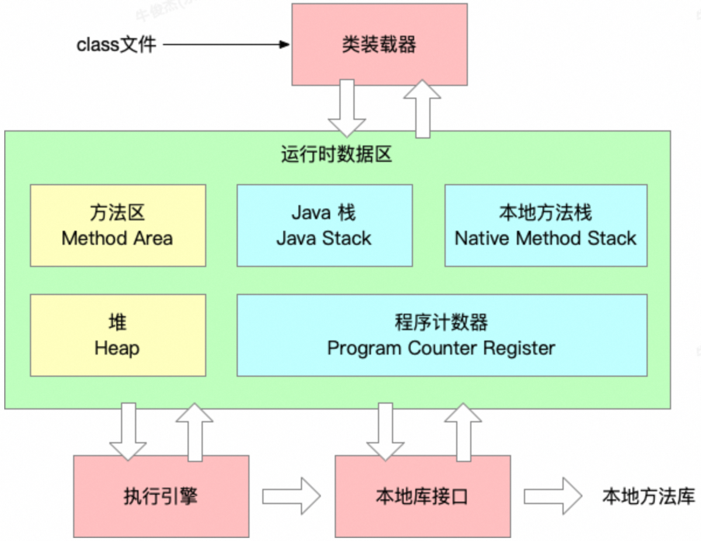

## 2、字节码文件概述
### 2.1、Class 对象
> 以下类型有 Class 对象：
> - 类、接口
> - 数组
> - 枚举
> - 注解
> - 基本数据类型
> - void

```java
@Test
public void test(){
    Class c1 = Object.class;
    Class c2 = Comparable.class;
    Class c3 = String[].class;		// 只要数组的元素类型和维度相同，就是同一个 Class
    Class c4 = int[][].class;
    Class c5 = ElementType.class;
    Class c6 = Override.class;
    Class c7 = int.class;
    Class c8 = void.class;
    Class c9 = Class.class;
}
```

### 2.2、字节码指令
> IDEA 安装插件：jclasslib bytecode viewer，可查看字节码。
>
> 每个字节码指令只有 8bit，包含操作码和操作数。
>
> 以下面试题，若不会，查看字节码指令就能明白。

```java
@Test
public void test1() {
    int i = 10;
    i = i++;                // 原因同 test2
    System.out.println(i);  // 10
}

@Test
public void test2() {
    int i = 2;
    // 操作数栈里 i * i 为 4，然后局部变量表里 i++ 后变为 3，
    // 但最后 i 是被操作数栈里的值赋为 4，和局部变量表里的 3 没关系
    i = i * i++;			
    System.out.println(i);	// 4
}

@Test
public void test3() {
    /*
    	https://www.bilibili.com/video/BV1yE411Z7AP?p=112
        i++：先把局部变量表的 i load 进操作数栈，再让局部变量表里的 i 执行 incr
        ++i：先让局部变量表的 i 执行 incr，再把该变量 load 进操作数栈
        int b = (a++) + (++a) + (a--)：
        1. a++：把局部变量表里的 a = 10 load 进操作数栈，局部变量表里的 a 自增 1，变为 11
        2. ++a：把局部变量表里 a 自增 1，变为 12，再把 12 load 进操作数栈
        3. 此时操作数栈有两个操作数 10、12，取出来相加变为 22，再放入操作数栈
        4. a--：把局部变量表里的 a = 12 load 进操作数栈，局部变量表里的 a 自减 1，变为 11
        5. 此时操作数栈有两个操作数 22、12，取出来相加变为 34
     */
    int a = 10;
    int b = (a++) + (++a) + (a--);
    System.out.println(b);
}

@Test
public void test4() {
    Integer a = 10;
    Integer b = 10;
    System.out.println(a == b);		// true，因为包装类有缓存
    Integer c = 128;
    Integer d = 128;
    System.out.println(c == d);		// false
}
```

| 包装类 | 缓存 |
| :---: | :---: |
| Byte | [-128, 127] |
| Short | [-128, 127] |
| Integer | [-128, 127] |
| Long | [-128, 127] |
| Float | 无 |
| Double | 无 |
| Character | [0, 127] |
| Boolean | true, false |


### 2.3、Class 文件结构
> <font style="color:rgb(119, 119, 119);">直接看下面的二进制字节码文件太麻烦，可以用 javap -v xxx.class 查看反编译后的字节码文件 (不是二进制的)</font>

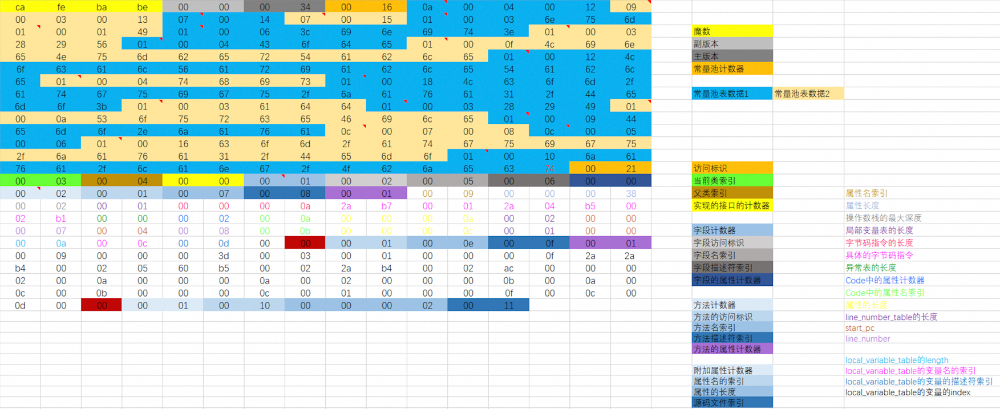

1.  魔数 
> 字节码文件的前 4 个字节，标识该文件是否为合法的字节码文件。
2.  Class 文件版本 
> 包括副版本和主版本，各占 2 个字节，表示该字节码文件是被什么版本的 JDK 编译出来的，如：副版本 = 0H，主版本 = 34H，则该字节码文件是被 jdk8 编译的。高版本的 jdk 能执行低版本的 jdk 编译的字节码文件，反之不能。
3.  常量池 
> 常量池计数器：常量池当前有多少个常量，注意：从 1 开始计数，如上图：16H = 22，表示常量池有 21 个常量 (要 -1)。
4.  访问标识 
> 当前 Class 是被什么关键字修饰的，如：Class、Interface、public、private、abstract、final 等。
5.  类索引、父类索引、接口索引集合 
6.  字段表集合：类的字段 
7.  方法表集合：类的方法 
8.  属性表集合 

### 2.4、字节码指令
> 字节码指令：https://blog.csdn.net/github_35983163/article/details/52945845
>
> 面试 (百度)：字节码指令有哪些？答：如上链接。
>
> 面试 (圆通)：int a = 1，JVM 如何取得 a 的值？答：直接从局部变量表取。
>
> 面试 (百度)：Integer x = 5; int y = 5; 比较 x == y 经历了哪些步骤？(Java 中能拆箱一般不装箱，因为拆箱代价小)

```java
0 iconst_5
1 invokestatic #2 <java/lang/Integer.valueOf : (I)Ljava/lang/Integer;>
4 astore_1
5 iconst_5
6 istore_2
7 getstatic #3 <java/lang/System.out : Ljava/io/PrintStream;>
10 aload_1
11 invokevirtual #4 <java/lang/Integer.intValue : ()I>
14 iload_2
15 if_icmpne 22 (+7)
18 iconst_1
19 goto 23 (+4)
22 iconst_0
23 invokevirtual #5 <java/io/PrintStream.println : (Z)V>
26 return
```

> 面试 (阿里)：JVM 中，数据类型分为哪几类？
> 1. 基本数据类型：byte、short、int、long、float、double、char、boolean、returnAddress；引用数据类型：类、接口、数组。
> 2. 编译器把 Java 源码编译成字节码时，会用 int 或 byte 代替 boolean。在 JVM 中，false 用 0 表示，true 用非零整数表示，涉及到 boolean 值的操作会用 int 代替，boolean[] 被当做 byte[] 来访问。
> 3. returnAddress 是 JVM 内部的基本数据类型，程序员不能使用，用来实现 finally 子句；值是 JVM 指令的操作码的指针，不能被运行中的程序修改。
>
> 面试 (阿里)：Java 的参数传递是值传递还是引用传递？
>
> 答：值传递。基本数据类型是值传递，引用数据类型传递的是地址的副本。

### 2.5、finally 原理
> finally 为什么一定执行？看字节码，finally 块的代码被复制了 3 份，分别放在：
> - try 块的末尾；
> - catch 块的末尾；
> - catch 不住或 catch 中发生异常，也会 goto finally 代码块；
```java
// 该方法返回 20
public int func() {
    try {
        return 10;
    } finally {
        return 20;
    }
}

// 该方法返回 10，因为操作数栈里的 i = 10，局部变量表里的 i = 20
public int func() {
    int i = 10;
    try {
        return i;
    } finally {
        i = 20;
    }
}
```

# 二、类的加载篇
## 1、类的加载过程 (生命周期)
> 面试 (百度、京东、滴滴、蚂蚁、苏宁、美团、国美)：JVM 的类加载过程？
>
> 面试 (百度、京东)：类加载的时机？(即：什么情况下 "加载 + 链接 + 初始化" 都完成？)
>
> 面试 (百度)：Class 类的 forName("Java.lang.String") 和 ClassLoader 类的 loadClass("Java.lang.String") 的区别？
>
> 答：前者会完成类的 "加载 + 链接 + 初始化"，后者只会完成 "加载"。

### 1.1、加载 Loading
> - **ClassLoader 采用双亲委派机制，将字节码文件加载到方法区中，并在堆中创建该类的 java.lang.Class 实例；**
> - 一个类只能被一个 ClassLoader 加载一次；
> - 注意：ClassLoader 只在 Loading 阶段起作用！！！

### 1.2、链接 Linking
> - 验证 Verification：检查字节码文件是否合法； 
> - 准备 Preparation
>     - **为类的静态变量分配内存，并初始化为默认值；** 
>     - 如果类的静态常量 (static final) 是字面量，则初始化；如果是引用类型 (包装类) 或涉及方法调用，则在初始化阶段初始化； 
> - 解析 Resolution：**将常量池中的符号引用解析为直接引用**，可理解为将逻辑地址转为物理地址； 

### 1.3、初始化 Initialization
> **执行类的初始化方法 <clinit>() 方法 (由编译器生成，由 JVM 调用，无法自定义)**
> - 为静态变量显式初始化；
> - 为静态常量 (非字面量) 显式初始化；
> - 执行 static 代码块；
>
> 注意：
> - <init>()：类的构造方法；
> - 普通成员变量：在对象创建后才初始化，见 "[四、2、对象的实例化](#6b1fd4f4)"； todo

```java
public class Test {
    public static int num1;                              // 链接的准备阶段初始化为默认值
    public static int num2 = 1;                          // 初始化阶段显式初始化
    public static int num3 = num2;                       // 初始化阶段显式初始化，因为 nums2 在初始化阶段显式初始化
    public static final int num4 = 1;                    // 链接的准备阶段初始化
    public static final int num5 = Integer.intValue(1);  // 初始化阶段显式初始化
}

// 最终 i = 30，会按顺序进行初始化
public class Test {
    static int i = 10;
    static {
        i = 20;
    }
    static {
        i = 30;
    }
}

// 静态内部类实现单例模式
// 当调用 Singleton#getInstance 时，内部类才会被初始化！所以节省内存
public class Singleton {

    private Singleton() {}

    private static class SingletonHandler {
        private static Singleton instance = new Singleton();
    }

    public static SingletonHandler getInstance() {
        return SingletonHandler.instance;
    }
}
```

> 类的初始化是懒加载的，只有用到时才初始化：
> - 有 main() 方法的类会被初始化；
> - 创建对象、读写静态字段 (读 static final 字面量时，类不会被初始化，因为该字段在链接阶段已经初始化过了)、调用静态方法时，类要初始化；
> - 用 java.lang.reflect 反射操作类的时候，类要初始化；
> - 初始化子类前，必须先初始化父类；
>
> 不需要执行初始化：
> - 定义对象数组，不会导致该类的初始化，因为并没有对该对象赋值；
> - 调用 ClassLoader#loadClass 加载类时，不会导致类的初始化；
> - ......

**1.4、使用 Using**

**1.5、卸载 Unloading**
> ClassLoader 和 Class 的关系是双向关联：ClassLoader 会维护一个集合，保存自己加载的所有类；Class 可调用 getClassLoader() 获取加载它的 ClassLoader。所以类加载后一般不会卸载，因为一旦卸载类，就要卸载其类加载器，继而就要把该类加载器加载的所有类都要卸载掉。

## 2、ClassLoader
### 2.1、类的唯一性
> 在 JVM 中，判断两个 Class 对象是否为同一个类，有两个必要条件：
> 1. 类的全限定名必须相同；
> 2. 加载这个类的 ClassLoader 实例必须相同；
>
> 即：每个 ClassLoader 实例都有自己的名称空间，即使两个 Class 实例来源同一个 class 文件，但只要加载它们的 ClassLoader 实例不同，那么这两个 Class 实例也是不相等的；在大型应用中，往往借助这一特性，来运行同一个类的不同版本。

### 2.2、ClassLoader 分类
> 面试 (字节、百度、腾讯、拼多多、苏宁)：类加载器有哪些？
> 1. 引导类加载器 BootStrap ClassLoader：C++ 编写；
> 2. 自定义加载器，Java 编写，都继承于抽象类 ClassLoader，包括： 
>     - Extension ClassLoader；
>     - Application ClassLoader；
>     - 程序员自定义的 ClassLoader。

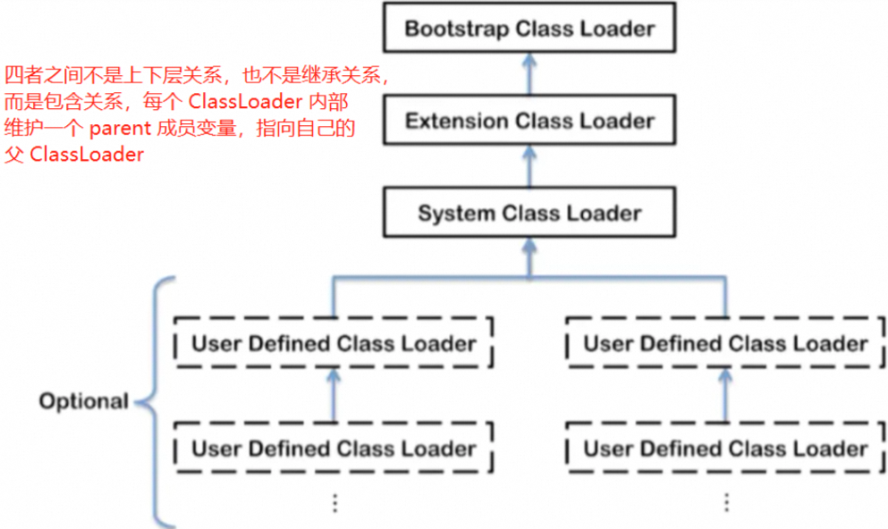

- BootStrap ClassLoader 
    - **C++ 编写**，嵌套在 JVM 内部，程序员用程序获取不到 (获取结果为 null)；
    - **加载 Java 的核心库 (JAVA_HOME/jre/lib/rt.jar、JAVA_HOME/jre/lib/resources.jar 或 sun.boot.class.path 路径下的内容)**，用于提供 JVM 自身需要的类；
    - 并不继承自 java.lang.ClassLoader，没有父 ClassLoader；
    - 加载 Extension ClassLoader 和 Application ClassLoader，是它们的父加载器；
- Extension ClassLoader 
    - Java 编写 ，由 sun.misc.Launcher$ExtClassLoader 实现；
    - 实现了 ClassLoader 抽象类；
    - 父 ClassLoader 为 BootStrap ClassLoader；
    - **加载 JAVA_HOME/jre/lib/ext 下的类库**，如果用户创建的 JAR 放在此目录下，也会由拓展类加载器自动加载。
-  Application ClassLoader 
    - Java 编写， 由 sun.misc.Launcher$AppClassLoader 实现；
    - 派生于 ClassLoader 类；
    - 父 ClassLoader 为 Extension ClassLoader；
    - **加载 classpath下的类库；**
    - **Application ClassLoader 是程序中默认的类加载器，程序员自定义的类由其加载，**也是程序员自定义的 ClassLoader 的父 ClassLoader；
-  获取 ClassLoader： 

| 方法名称 | 描述 |
| :---: | :---: |
| Class.getClassLoader() | 获取当前类的 ClassLoader |
| Thread.currentThread().getContextClassLoader() | 获取当前线程上下文的 ClassLoader |
| ClassLoader.getSystemClassLoader() | 获取 Application ClassLoader |

```java
public class ClassLoaderTest {
    public static void main(String[] args) {
        // 获取系统类加载器
        ClassLoader systemClassLoader = ClassLoader.getSystemClassLoader();
        System.out.println(systemClassLoader);     // sun.misc.Launcher$AppClassLoader@18b4aac2

        // 获取其上层：扩展类加载器
        ClassLoader extClassLoader = systemClassLoader.getParent();
        System.out.println(extClassLoader);        // sun.misc.Launcher$ExtClassLoader@610455d6

        // 获取其上层：获取不到引导类加载器
        ClassLoader bootStrapClassLoader = extClassLoader.getParent();
        System.out.println(bootStrapClassLoader);  // null

        // 自定义的类采用系统类加载器 AppClassLoader 进行加载
        ClassLoader classLoader1 = ClassLoaderTest.class.getClassLoader();
        System.out.println(classLoader1);          // sun.misc.Launcher$AppClassLoader@18b4aac2

        // Java 核心类库采用引导类加载器 BootStrapClassLoader 加载
        ClassLoader classLoader2 = String.class.getClassLoader();
        System.out.println(classLoader2);          // null
    }
}
```

### 2.3、双亲委派机制
> ClassLoader 基本特征：

1. **双亲委派机制 (并不是所有的类加载都遵守这个机制)**
> 面试 (蚂蚁、腾讯、京东、小米、滴滴、苏宁)：什么是双亲委派机制？
>
> **双亲委派机制的工作原理**：
> - 当一个 ClassLoader 收到了加载类的请求时，它并不会自己先去加载，而是将加载任务委托给它的父 ClassLoader 去执行；
> - 如果父 ClassLoader 还存在父 ClassLoader，则进一步自底向上委托，请求最终到达 BootStrap ClassLoader；
> - 如果父 ClassLoader 能完成类的加载，则成功返回，否则自顶向下委托，直到某个子 ClassLoader 能完成类的加载。

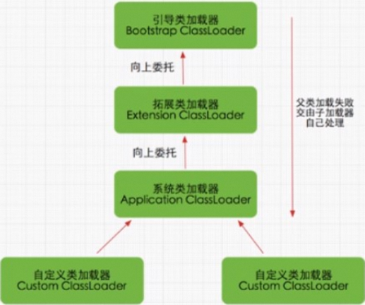

> 案例：在自己的代码中创建 java.lang.String，则和 Java 核心类库中的 java.lang.String 冲突了，但 new String() 时并没报错，new 的结果也是 Java 核心类库的 String，而不是自己自定义的 java.lang.String，为什么？
>
> 答：自定义的 java.lang.String 将由 AppClassLoader 加载，Java 核心类库的 String 将由 BootStrap ClassLoader 加载。由于双亲委派机制，先自底向上委托，而 BootStrap ClassLoader 可以完成 String 类的加载，因此成功返回，就轮不到 AppClassLoader 去加载自定义的 String 类了。
>
> 亲委派机制的优势：
> - 避免类的重复加载，确保一个类全局唯一；
> - 保护程序安全，防止 Java 核心类库被随意篡改。
>
> 双亲委派机制的劣势：
> - 由可见性可知：Java 核心类库不能调用程序员的创建的类。
>
> 面试 (阿里、猎聘)：Tomcat 的类加载机制？
>
> 面试 (京东、拼多多)：怎么打破双亲委派机制？
> - 方法1：自定义类加载器，重写 **ClassLoader#loadClass**；
> - 方法2：使用线程上下文类加载器 Thread Context ClassLoader。

> - 案例一：Thread Context ClassLoader  
	Java 核心类库提供了 JDBC 接口，供各种数据库厂商去实现，如 MySQL。但 jbdc.jar 是由 BootStrap ClassLoader 加载的，而 MySQL 对 JDBC 的实现是由下层的 ClassLoader 加载的。由双亲委派机制的劣势可知：jbdc.jar 如何调用 MySQL 对 JDBC 的实现？Java 设计团队引入了 Thread Context ClassLoader（默认就是 Application ClassLoader），BootStrap ClassLoader 反向委托给 Thread Context ClassLoader 去加载  jbdc.jar，这样就可以了！ 
> - 案例二：Tomcat 类加载机制  
	对于一些类库，直接由各个 WebAppClassLoader 去加载，加载不了时，再双亲委派，所以 Tomcat 部分违背了双亲委派机制，但并没有完全违背。(如下图：每个 Web 应用都有一个 WebAppClassLoader，多个 Web 应用所使用的类库是相互隔离的。) 

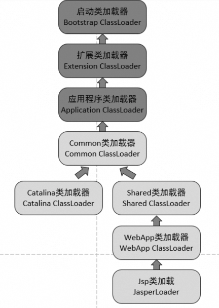

**<font style="color:rgb(51, 51, 51);">2、可见性：子 ClassLoader 加载的类型可以访问父 ClassLoader 加载的类型，反之不可。</font>**

**<font style="color:rgb(51, 51, 51);">3、单一性：由于可见性，父 ClassLoader 加载过的类型，子 ClassLoader 不会再重复加载。但同级的 ClassLoader 可以重复加载。</font>**

### **<font style="color:rgb(51, 51, 51);">2.4、ClassLoader 源码分析</font>**
```java
public Class<?> loadClass(String name) throws ClassNotFoundException {
    return loadClass(name, false);	// 默认情况下，resolve=false，ClassLoader 只负责 loading，不负责 resolve
}

// 体现了双亲委派机制！
protected Class<?> loadClass(String name, boolean resolve) throws ClassNotFoundException {
    synchronized (getClassLoadingLock(name)) {	  // 类的加载要上锁
        Class<?> c = findLoadedClass(name);       // 判断 name 类是否已经加载
        if (c == null) {                          // name 类还没加载
            long t0 = System.nanoTime();
            try {
                // 子 -> 父
                // ApplicationClassLoader -> ExtensionClassLoader -> BootStrapClassLoader -> null
                if (parent != null) {             // 向上委托
                    c = parent.loadClass(name, false);
                } else {                          // BootStrap ClassLoader 没有 parent，只能自己加载
                    c = findBootstrapClassOrNull(name);
                }
            } catch (ClassNotFoundException e) {
            }

            if (c == null) {	// 向下委托：父 ClassLoader 都没加载，只能自己加载了
                long t1 = System.nanoTime();
                c = findClass(name);
                sun.misc.PerfCounter.getParentDelegationTime().addTime(t1 - t0);
                sun.misc.PerfCounter.getFindClassTime().addElapsedTimeFrom(t1);
                sun.misc.PerfCounter.getFindClasses().increment();
            }
        }
        if (resolve) {
            resolveClass(c);
        }
        return c;
    }
}

// 没有方法体，当我们自定义 ClassLoader 时，要重写这个方法！不要重写 loadClass()，会破坏双亲委派机制
protected Class<?> findClass(String name) throws ClassNotFoundException {
    throw new ClassNotFoundException(name);
}
```

### 2.5、自定义 ClassLoader
> 自定义 ClassLoader 的作用：
> - 隔离加载类：如 Tomcat 能部署多个应用，因为每个应用对应了一个 WebAppClassLoader，在不同应用之间实现了类的隔离；
> - 修改类的加载机制：打破双亲委派机制；
> - 拓展加载源：自定义类加载器可以从数据库、网络加载字节码文件；
> - 防止源码泄漏：字节码文件反编译后就会造成源码泄露，可先对字节码文件加密，在运行时使用自定义的类加载器对字节码文件解密后再运行。
>
> 面试 (阿里)：自定义 ClassLoader 可以破坏双亲委派机制，能否自定义一个恶意的 HashMap 破坏 Java 核心类库？
>
> 答：不会，**defineClass()** 内部会调用 preDefineClass()，**preDefineClass()** 提供了对 JDK 核心类库的保护，所以 JDK 核心类库一定会被 BootStrap ClassLoader 加载；
>
> 面试 (百度)：手写自定义 ClassLoader。</font>

```java
public class UserDefineClassLoader extends ClassLoader {

    @Override
    protected Class<?> findClass(String name) {
        // 字节码文件转二进制流
        byte[] binaryData = getBytesFromFilePath(name);
        // 调用抽象类 ClassLoader 的方法 defineClass()，将二进制流转为 Class 实例
        return defineClass(name, binaryData, 0, binaryData.length);
    }

    private byte[] getBytesFromFilePath(String filePath) {
        FileInputStream fis = null;
        ByteArrayOutputStream baos = null;
        try {
            fis = new FileInputStream(filePath);
            baos = new ByteArrayOutputStream();
            byte[] buffer = new byte[1024];
            int len;
            while ((len = fis.read(buffer)) != -1)
                baos.write(buffer, 0, len);
            return baos.toByteArray();
        } catch (IOException e) {
            e.printStackTrace();
        } finally {
            try {
                if (baos != null) baos.close();
            } catch (IOException e) {
                e.printStackTrace();
            }
            try {
                if (fis != null) fis.close();
            } catch (IOException e) {
                e.printStackTrace();
            }
        }
        return null;
    }

    public static void main(String[] args) {
        String classFilePath = "D:\\Development\\algorithm\\src\\main\\java\\com\\njj\\User.class";
        UserDefineClassLoader userDefineClassLoader1 = new UserDefineClassLoader();
        UserDefineClassLoader userDefineClassLoader2 = new UserDefineClassLoader();
        Class<?> userClass1 = userDefineClassLoader1.findClass(classFilePath);
        Class<?> userClass2 = userDefineClassLoader2.findClass(classFilePath);
        System.out.println(userClass1);                                 // class com.njj.User
        System.out.println(userClass1 == userClass2);                   // false
        // com.njj.userDefineClassLoader@6d6f6e28
        System.out.println(userClass1.getClassLoader());
        // sun.misc.Launcher$AppClassLoader@18b4aaac2
        System.out.println(userClass1.getClassLoader().getParent());	
    }
}
```

# 三、运行时内存篇
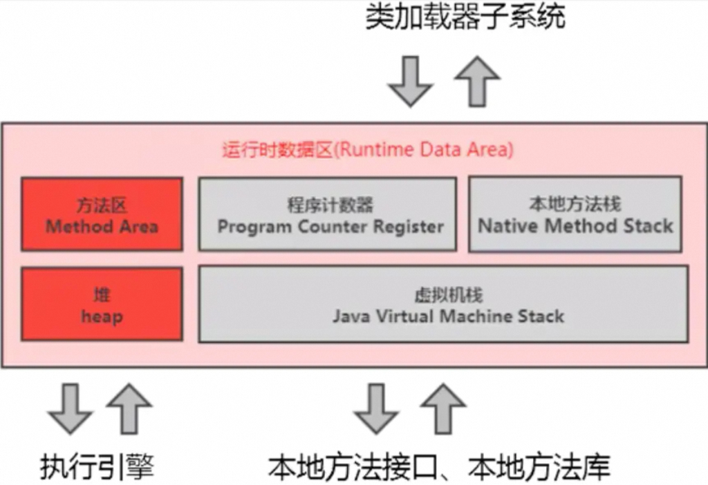

## 1、程序计数器
> 记录当前线程的下一条指令的地址。
>
> 内存最小、速度最快、**唯一不存在 OOM 的区域**。
>
> 面试题：使用 PC 寄存器存储字节码指令地址的作用？为什么使用 PC 寄存器记录当前线程的执行地址？PC 寄存器为什么**线程私有**？
>
> 答：当多线程并发执行时，CPU 需要不停的切换各个线程，对于一个线程，CPU 切换回来以后，必须要知道从什么地方继续执行，而 PC 寄存器存储的就是下一条指令的地址。PC 寄存器线程私有，可以保证多个线程间的执行互不干扰。

## <font style="color:#DF2A3F;">2、虚拟机栈</font>
> 面试 (阿里、蚂蚁、国美、艾绒)：堆和栈的区别？为什么基本数据类型放在栈中，引用数据类型放在堆中？
>
> 答：栈管运行，堆管存储；栈容量小，运算速度快；堆容量大，运算速度比栈慢。基本数据类型占的内存小，放在栈中能提高效率；引用数据类型在创建时无法确定大小，放在栈中可能导致栈溢出，通常都是放在堆中，并将其引用放在栈中，通过引用找到堆中的数据。堆和栈都可能 OOM，但栈不需要 GC。
>
> 面试 (京东、滴滴、360)：栈什么情况下会溢出？
>
> 问题：为什么值传递修改不了变量值，引用传递可以？
>
> 答：值传递的实参保存在栈，方法结束后就会出栈，实参也就没了；引用传递的实参保存在堆，方法结束后，实参还在！

> - 栈：线程运行时需要的内存，**<font style="color:red">线程私有</font>**，**不需要 GC**；
> - 栈帧：方法运行时需要的内存；
> - 虚拟机栈的访问速度仅次于 PC 寄存器；
> - 在栈上也可以分配对象，JVM 会对所有对象进行逃逸分析 (在方法内创建的对象只在方法内使用：没有逃逸)，若对象没有逃逸，就不会分配在堆中，而是在栈上分配，因为栈不需要 GC，只要出栈即可，速度比堆快！但并不是以对象的形式保存在栈上，而是将对象拆分成基本属性保存在栈上 (标量替换)，逃逸分析默认是开启的：-XX:-DoEscapeAnalysis；
> - 可能出现的异常：
>     - 若虚拟机栈大小固定，栈溢出时报 StackOverFlowError（如：死递归）；
>     - 若虚拟机栈大小可动态扩展，栈溢出时报 OutOfMemoryError。
> - 设置栈内存大小：**<font style="color:#DF2A3F;">-Xss1024k</font>**。（建议设置为 512 ~ 1024k，Linux 默认为1024 KB）

### 2.1、栈帧 (Stack Frame)
> 虚拟机栈的基本单位：栈帧，保存一个方法内的所有变量。一个方法对应一个栈帧，执行方法时，栈帧入栈，方法返回时 (return / throw 异常)，栈帧出栈。栈顶的栈帧称为当前栈帧，对应的方法称为当前方法。

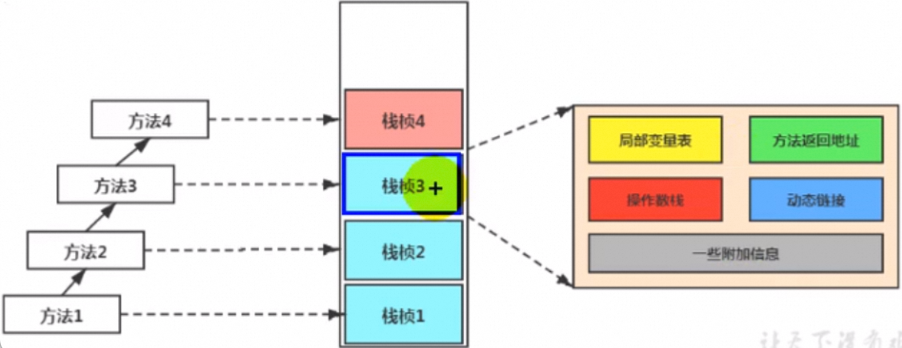

### 2.2、局部变量表
1、概述
> - 局部变量表存储方法的参数和局部变量，包括基本数据类型、引用数据类型、returnAddress 类型；
> - 局部变量表的容量在编译期就已经确定，保存在方法的 Code 属性的 maximum local variables 数据项中；
> - 栈越大，则方法嵌套调用的最大次数就越多。但函数的参数和局部变量越多，局部变量表就会越大，栈帧就会越大，函数嵌套调用次数就会减少；
> - 局部变量表可作为 GC Roots，**只要被局部变量表直接或间接引用的对象都不会被回收**。

2、Slot (变量槽)
> - 局部变量表的存储单元是 slot (变量槽)；
> - 32 位以内的类型占一个 slot (包括 returnAddress 类型，byte、short、char、boolean、float 在存储前被转换为 int)；64 位的类型 (long、double) 占两个 slot；**<font style="color:#DF2A3F;">注意：引用类型的位数跟随 OS！</font>**
> - 当栈帧入栈时，方法的参数和局部变量将会**按顺序被复制到局部变量表中的每一个 slot 上**；如果当前栈帧对应的是非静态方法，那么**该对象的引用 (this 指针) 将会存放在 index = 0 的 slot 处**，其余的参数按照顺序排列；而静态方法没有 this 指针。

| 字段 | 初始化时机 |
| --- | --- |
| 类的静态字段 | 类加载阶段 |
| 类的非静态字段 | 对象实例化阶段 |
| 局部变量 | 使用前必须显式初始化 |

### 2.3、操作数栈
> - **临时保存计算过程的中间结果；**
> - 操作数栈的容量在编译期就确定了，保存在方法的 code 属性中的 max_stack；
> - 32 位以内的类型占一个栈深，64 位的类型占两个栈深；
> - **若被调用的方法有返回值，其返回值将会被压入当前栈帧的操作数栈中；**
>
> 案例：

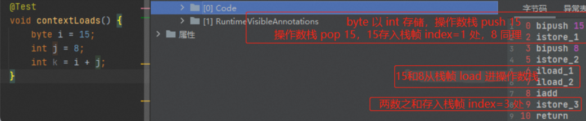

### 2.4、动态链接 (了解)
1、方法的调用
> methodA() 调用 methodB()，编译完成时，在字节码文件中，两个方法之间的联系可以是：
> - methodA() 以符号引用 (逻辑地址) 去调用 methodB() ； 
> - methodA() 以直接引用 (物理地址) 去调用 methodB() ； 

- **静态链接** (早期绑定)：若被调用的目标方法 methodB() 在编译期可知，且运行期保持不变，这种情况下 methodA() 直接引用 methodB() 的物理地址。
- **动态链接** (晚期绑定)：如果被调用的方法 methodB() 在编译期无法被确定下来，只有在运行时才能确定，则编译完成时，methodA() 引用的只是 methodB() 的符号，而非物理地址，例如：多态！

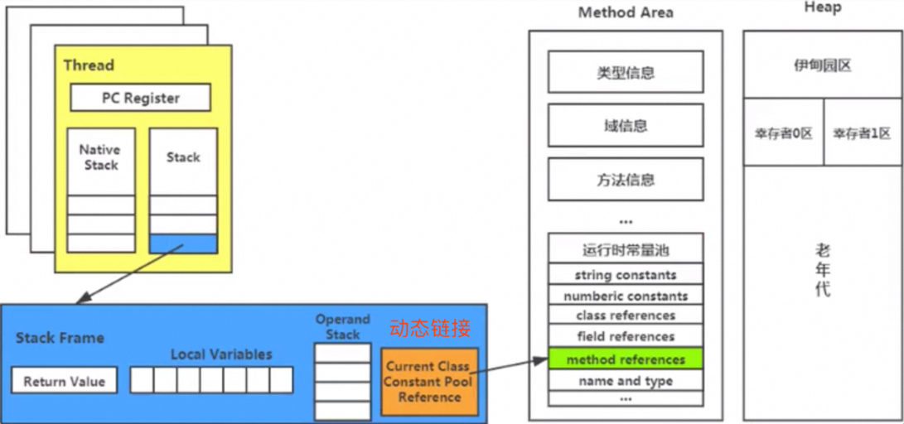

- 每一个栈帧内部都包含一个指向**运行时常量池**中该栈帧所属方法的引用，包含这个引用的目的就是为了支持当前方法的代码能够实现**动态链接**，即：动态链接就是指向运行时常量池的方法引用； 
- 在 Java 源文件被编译成字节码文件时，所有的变量和方法都以符号引用 (symbolic Refenrence) 的形式保存在 class 文件的常量池里，而并不是直接就保存真实的物理地址。例如：methodA() 调用 methodB()，编译完成时，methodA() 只是引用了 methodB() 的符号，只有到运行时才将 methodB() 的符号引用转换为真正的物理地址再去调用，即：**动态链接的作用就是为了将这些符号引用转换为直接引用 (物理地址)。** 
- 常量池的作用：提供一些常量和符号供虚拟机栈引用。 

2、虚方法和非虚方法

- 如果方法在编译期就确定了具体的调用版本，这个版本在运行时是不可变的。这样的方法称为非虚方法，如：**静态方法、私有方法、final方法、实例构造器、父类方法 ( super.func() )**；
- 其他方法称为虚方法 (有可能能实现多态)！
- JVM 的调用方法的字节码指令： 
    - invokestatic：调用静态方法（非虚方法）；
    - invokespecial：调用 <init> 方法（构造器）、私有方法、父类方法（非虚方法）；
    - invokevirtual：调用实例方法，即对象中的普通方法（虚方法）；
    - invokeinterface：调用接口方法（虚方法）；
    - invokedynamic：动态调用指令，动态解析出需要调用的方法（虚方法），然后执行，如 Lambda 表达式中的参数 o，编译时并不知道其类型，运行时通过类型推断自动得出。

3、方法重写的本质
> 如下代码：当调用 Son.toString() 时，要先判断 Son 有没有重写其父类的 toString()；若没有，还要再继续判断其父类 Father 有没有重写 Object 的 toString()，这样自底向上一层一层的判断，执行效率很低！

```java
public class Father {

    public void say() {
        ...
    }

    public String toString() {	// 重写其父类 Object 的 toString()
        ...
    }
}

public class Son extends Father {
    public void say() {			// 重写其父类 Father 的 say()，但没有重写  toString()
        ...
    }
}
```

4、虚方法表
- JVM 采用在类的方法区建立了一个虚方法表，使用索引表来代替上述的自底向上的查找，来提高效率；
- 虚方法表会在类加载的链接阶段被创建并开始初始化，类的变量初始化完成后，JVM 会把该类的虚方法表也初始化完毕；
- 每个类中都有一个虚方法表，表中存放着各个方法的实际入口；如上述代码，在 Son 的虚方法表中，toString() 方法直接保存着其父类的 toString()，调用 Son.toString() 时不用再判断 Son 是否重写了其父类的 toString()，直接调用 Father 的 toString() 即可。

### 2.5、Return Address (了解)
> Return Address：方法返回地址：
> - 方法正常 return 时，调用者的 PC 计数器的值作为返回地址，即调用该方法的指令的下一条指令的地址； 
> - 方法异常退出时，返回地址要通过异常表来确定； 
> - 方法正常退出和异常退出的唯一区别：异常退出不会给调用者产生任何返回值。 
>
> 字节码的返回指令：
> - ireturn：当返回值是 boolena、byte、char、short、int 时；
> - lreturn：long；
> - freturn：float；
> - dreturn：double；
> - areturn：引用类型；
> - return：void。

### 2.6、一些附加信息 (了解)
> 栈帧中还允许携带与 JVM 实现相关的一些附加信息。例如：对程序调试提供支持的信息。

### 2.7、面试题
1. 举例栈溢出 (StackOverflowError) 的情况？  
答：死递归等，通过 -Xss 设置栈的大小。 
2. 调整栈的大小，就能保证不出现溢出么？  
答：不能，死递归一定会溢出，调整栈大小只能保证溢出时间的早晚。 
3. 分配的栈内存越大越好么？  
答：不是，栈是线程私有的，栈内存分配过大会挤占其他线程的空间（导致可用线程减少）。 
4. 栈会 GC 吗？  
答：不会 

| 内存区块 | Error | GC |
| :---: | :---: | :---: |
| 程序计数器 | ❌ | ❌ |
| 本地方法栈 | ✅ | ❌ |
| JVM 虚拟机栈 | ✅ | ❌ |
| 堆 | ✅ | ✅ |
| 方法区 | ✅ | ✅ |

5. 方法中定义的局部变量是否线程安全？ 
```java
public class Test {

    // sb 线程安全，因为同一时刻只有一个线程能操作 sb
    public static void method1() {
        StringBuilder sb = new StringBuilder();
        sb.append("a");
    }

    // sb 线程不安全，因为 method2() 可被多个线程调用，sb 可能会被多个线程同时操作
    public static void method2(StringBuilder sb) {
        sb.append("a");
    }

    // sb 线程不安全，因为 method3() 的返回值可被多个线程共享
    public static StringBuilder method3() {
        StringBuilder sb = new StringBuilder();
        sb.append("a");
        return sb;
    }

    // sb 线程安全，sb.toString() 创建了一个新的 String，而 sb 在 method4() 内部消亡了
    public static String method4() {
        StringBuilder sb = new StringBuilder();
        sb.append("a");
        return sb.toString();
    }
}
```

## 3、本地方法栈 (了解)
> - Native 方法是用 C/C++ 实现的，引入的目的是为了与 OS 或底层硬件交互，或为了提高运行效率（C/C++ 比 Java 快）；
> - **JVM 虚拟机栈用于管理 Java 方法的调用，而本地方法栈用于管理 native 方法的调用；**
> - 和虚拟机栈类似，当调用本地方法时，本地方法会被压入本地方法栈，在 Execution Engine 执行时加载本地方法库；
> - **当某个线程调用本地方法时，本地方法就进入了一个全新的且不再受 JVM 限制的世界，本地方法和虚拟机拥有同样的权限**；
> - 本地方法可以通过本地方法接口来 **访问虚拟机内部的运行时数据区；**
> - 在 HotSpot JVM 中，直接将本地方法栈和虚拟机栈**合二为一**了。

## <font style="color:#DF2A3F;">4、堆</font>
> 面试 (阿里、亚信)：怎么设置堆大小？-Xmx 大小有没有限制？-Xms = -Xmx 有什么好处？
>
> 答：理论上，32 位机器最大内存 2^32 = 4G，64 位机器最大内存 2^64 = 128G，建议设置堆大小为 2000MB；

### 4.1、堆的分区
> - Heap = Young Gen + Old Gen 
>     - Young Gen = Eden + Survivor1 + Survivor2；
> - Survivor 的作用：作为缓冲，若没有 s 区，Minor GC 频率很快，存活的对象直接放入老年代，导致老年代很快就被填满，触发 Major GC / Full GC，效率低！ 
> - **堆是 JVM 管理的最大一块内存空间，是 GC 的重点区域！** 
> - **面试题：堆空间一定是线程共享的吗？**  
答：堆中的线程私有缓冲区 (TLAB : Thread Local Allocation Buffer) 是线程私有的；TLAB ∈ Eden 区，为防止并发问题，创建对象时是在 TLAB 创建的，TLAB 很小。 
> - 在方法结束后，堆中的对象不会马上被移除，而是在 GC 时才会被移除； 
> - 年轻代越小，Minor GC 越频繁；年轻代越大，但挤占老年代空间，容易导致 Major GC、Full GC；Oracle 官方建议 1/4 堆内存 <= 年轻代 <= 1/2 堆内存； 

### 4.2、设置堆的大小
> - **<font style="color:red">-Xms20m -Xmx30m</font>**：设置 "年轻代 + 老年代" 初始大小 20m，最大 30m； 
>     - 默认情况下：初始大小为 "物理内存 / 64"，最大内存为 "物理内存 / 4"；
>     - 当堆空间不够用或空余时，JVM 会动态的在 [-Xms, -Xmx] 之间扩容缩容，但消耗性能，因此一般 -Xms、-Xmx 设置相同。
> - **-Xmn**：设置年轻代大小，堆中剩余空间归老年代所有，一般不改；
> - **-XX:NewRatio** = 2：设置老年代和年轻代的大小比例为 2 : 1，一般不改；
> - **-XX:SurvivorRatio** = 8：设置堆中 Eden : Survivor，即 8 : 1 : 1；为什么？因为年轻代 80% 对象朝生夕死！
> - **-XX:MaxTenuringThreshold** = 15：设置 S 区对象最大年龄。

### 4.3、对象内存分配
> 面试 (字节、顺丰)：对象什么时候进入老年代？
>
> **面试 (BAT)：JVM 一次完整的 GC 流程？**

> **对象分配 (一次完整的 GC 过程)**
>
> new 的对象分配在 Eden 区；
> 1. 若 Eden 区放不下，JVM 会对整个年轻代进行 Minor GC (小 GC，速度快)，然后将 Eden 区中存活的对象移动到 S 区；若 S 区放不下，则认为是大对象，直接分配到老年代；若 Minor GC 后 Eden 区还是存不下对象，则认为是大对象，直接分配到老年代；
> 2. S 区采用复制算法，有两个区 from、to，每次 Minor GC，存活的对象都会移动到 S 区，而 from 区的对象复制到 to 区，然后对象年龄 +1，from、to 交换身份；
> 3. from、to 区反复来回复制，每复制一次，对象年龄 +1，当对象年龄达到 -XX:MaxTenuringThreshold=15 时，转移到老年代；
> 4. 当老年代放不下时，JVM 会对老年代进行 Major GC / Full GC，如果 GC 还是放不下，则 OOM；
>
> 此外：在 S 区中，若相同年龄的所有对象占 S 区内存的一半，则年龄 ≥ 该年龄的对象直接进入老年代；

> 面试 (腾讯、百度、顺丰)：什么是空间分配担保？
>
> 空间分配担保：在 Minor GC 之前，JVM 会先检查 "老年代剩余的可用内存" 是否大于 "年轻代中所有对象大小总和"；
> - 如果大于，则 Minor GC 是安全的；
> - 如果小于，则 JVM 会检查 **<font style="color:#DF2A3F;">-XX:HandlePromotionFailure (默认为 true)</font>** 是否允许担保失败。若为 true，JVM 会检查 "老年代剩余的可用内存" 是否 > 历次 "进入到老年代的所有对象大小总和" 的平均值。若大于，则尝试 Minor GC (有风险)；若小于，或  -XX:HandlePromotionFailure = false，则空间担保失败，改为对整个堆的 Full GC。

### 4.4、Minor GC、Major GC、Full GC
> 面试 (BAT)：Minor GC、Major GC、Full GC 的区别？触发时机？

1. Minor GC 
> - 当 Eden 区满时，对整个**年轻代**进行 GC，S 区满不会主动触发 (会直接转移到老年代)；
> - Minor GC 非常频繁，且速度快，因为绝大部分对象都是朝生夕死。

2. Major GC 
> - 老年代空间不足时，触发 Major GC，对**老年代**进行 GC；
> - Major GC 后空间还不足，则 OOM；

3. Full GC：对整个堆 (**年轻代 + 老年代 + 方法区**) 进行 GC 
> 触发时机：
> - 调用 System.gc() 时，通知 JVM 执行 Full GC，但不是必然执行；
> - 老年代空间不足时；
> - 方法区空间不足时；
> - 空间担保失败时；

4. Major GC 和 Full GC： 
> - 只有 CMS 支持 Major GC，其他垃圾回收器替换为 Full GC；
> - Full GC、Major GC 的速度比 Minor GC 慢 10 倍以上，应尽量避免！
> - Full GC、Major GC 后还是内存不足，则 OOM！

## 5、方法区
> **永久代使用 JVM 内存，而元空间使用本地内存；**
>
> 面试常考：JDK6、JDK7、JDK8 内存结构的变化？
> - JDK6：**类的信息、常量池、静态变量**存放在永久代；
> - JDK7：**类的信息**放在永久代，**字符串常量池、静态变量**存放在堆中；因为类的信息 GC 效果很差，但字符串常量池和静态变量可以 GC；
> - JDK8：用元空间取代了永久代！因为永久代存储类的信息，**<font style="color:#DF2A3F;">GC 效果很差</font>**，所以随着加载的类越来越多，永久代容易 OOM，而元空间使用本地内存，理论上元空间的大小 -XX:MaxMetaspaceSize 只受本地内存限制。
>
> 面试 (腾讯、美团)：JVM 的永久代会发生 GC 吗？
>
> 答：这个题有点老，会回收常量池中废弃的常量和不再使用的类。

### 5.1、方法区概述
> 方法区是 JVM 规范，永久代和元空间是具体实现；
>
> Java 虚拟机规范规定方法区不属于堆，方法区用于保存类的信息：

```java
// 方法区  栈         堆
Person person = new Person();
```

> - 设置元空间大小： 
>     - JDK7：-XX:PermSize=100m、-XX:MaxPermSize=100m (默认 20.75MB、82MB)
>     - JDK8：-XX:MetaspaceSize=100m、-XX:MaxMetaspaceSize=100m (默认 21MB、无限制)
> - 加载的类太多，方法区也会 OOM；如 Spring 的 CGlib 动态代理、MyBatis 自动生成 Mapper 的实现类等，都会产生大量类！

> 方法区存储字节码文件的信息，包括类的信息、常量池：
>
> 1、类的信息
> - 类型信息：Class、Interface、Enum、Annotation
> - 域信息：成员变量
> - 方法信息：成员方法
>
> 2、常量池：存储各种**字面量**、类型、域、方法的**符号引用**；
>
> 运行时常量池：字节码文件被加载时，就会在内存中创建运行时常量池，常量池的内容会被放在运行时常量池中；运行时常量池保存的不是符号引用，而是**直接引用**。

### 5.2、String 的内存分配
> StringTable 是常量池的一部分！
>
> String 的存储方式：
```java
private final char[] value;		// JDK8 及以前
private final byte[] value;		// JDK9，char 占 2 字节，byte 只占 1 字节，byte 对于英文更节省内存
```

> - JDK8 中 基本类型包装类 和 String 都有常量池，常量池是 Java 系统级别的缓存；
> - 字符串常量池 StringTable 底层是 Hashtable (数组 + 链表)；
>
> StringTable 不可扩容，可通过 -XX:StringTableSize 设置数组的长度：
> -  JDK7 默认长度：60013； 
> -  JDK8 及以后：长度最小 1009； 

### 5.3、String 的不可变性
> String 是字符串常量，具有不可变性。当对 String 重新赋值、连接操作、修改操作时，都是 new 一个新 String；
>
> 通过字面量的方式 (区别于 new) 给字符串赋值，则字符串的值存在常量池中；

```java
String s1 = "hello";
String s2 = "hello";
System.out.println(s1 == s2);   // true，字面量方式赋值，"hello" 在编译时就已经存储到常量池中了，
								// 因此 s1、s2 都指向常量池中的 "hello"

// 经典面试题：String 和 包装类 作为形参时，只是值传递！！！！
```

### 5.4、String 的拼接操作
> - String 常量的拼接结果保存在常量池中，原理是编译期优化；
> - String 变量的拼接 (只要有一个是变量)，结果就保存在堆中，而不是保存在常量池中！因为底层会使用 new String()，并用 StringBuilder 拼接；
> - StringBuilder.append() 的效率远高于 String 拼接。

```java
@Test
public void test1() {
    String s1 = "a" + "b" + "c";        // 编译期优化，将 "abc" 放入常量池
    String s2 = "abc";                  // 将常量池中的 "abc" 的地址赋给 s2
    System.out.println(s1 == s2);       // true
}

@Test
public void test2() {
    String s1 = "javaEE";
    String s2 = "hadoop";

    String s3 = "javaEEhadoop";
    String s4 = "javaEE" + "hadoop";    // 编译期优化，s3 = "javaEEhadoop" 保存在常量池中
    String s5 = s1 + "hadoop";          // s1 是变量，s5 = "javaEEhadoop" 保存在堆中
    String s6 = "javaEE" + s2;          // s2 是变量，s6 = "javaEEhadoop" 保存在堆中
    String s7 = s1 + s2;                // s1、s2 是变量，s7 = "javaEEhadoop" 保存在堆中

    System.out.println(s3 == s4);       // true
    System.out.println(s3 == s5);       // false
    System.out.println(s3 == s6);       // false
    System.out.println(s3 == s7);       // false

    System.out.println(s5 == s6);       // false
    System.out.println(s5 == s7);       // false
    System.out.println(s6 == s7);       // false

    String s8 = s7.intern();
    System.out.println(s3 == s8);       // true
}

@Test
public void test3() {
    final String s1 = "a";
    final String s2 = "b";
    String s3 = "ab";		
    String s4 = s1 + s2;                // s1、s2 是常量
    System.out.println(s3 == s4);       // true
}
```
### 5.5、String.intern() (基于 JDK8)
```java
String str = new String("ab");    // str 指向堆空间
str.intern();    // 尝试将 str 放入 StringTable<stringValue, heapAddress>，并返回 str 的 heapAddress
```
> - 若常量池中没有和 str 内容相同的字符串，则 str 入池成功，**StringTable 中保存的是 str 的堆空间地址**，返回该地址；
> - 若常量池中有和 str 内容相同的字符串，则入池失败，此时 intern 返回的是常量池中字符串的地址；

```java
// "a"、"b" 在常量池中(常量池保存 "a"、"b" 在堆中的地址！)，"ab" 在堆中，s1 指向堆空间
String s1 = new String("a") + new String("b");
// 将 "ab" 放入常量池，返回 "ab" 在堆中的地址
String s2 = s1.intern();
System.out.println(s1 == s2);    // true

String s1 = new String("a") + new String("b");
String s2 = "ab";
s1.intern();    	 // 入池失败，因为池中已有 "ab"
System.out.println(s1 == s2);    // false，s1 指向堆中 "ab" 的地址，s2 指向常量池中 "ab" 的地址

String s1 = new String("a") + new String("b");
s1.intern();    	 // 入池成功，常量池保存 "ab" 在堆中的地址
String s2 = "ab";        // 常量池已有 "ab"，则 s2 指向常量池中 "ab" 的地址，其实就是 "ab" 在堆中的地址
System.out.println(s1 == s2);    // true，s1、s2 都指向 "ab" 在堆中的地址

String s1 = "ab";        // s1 指向 "ab" 在常量池中的地址
String s2 = new String("a") + new String("b");    // s2 指向 "ab" 在堆中的地址
String s3 = s2.intern();         // 入池失败，s3 指向 "ab" 在常量池中的地址
System.out.println(s2 == s1);	 // false
System.out.println(s3 == s1);	 // true
System.out.println(s2 == s3);    // false
```

> 面试题：

1. new String("ab") 会创建几个对象？
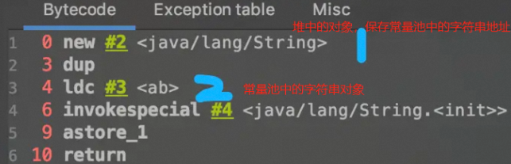

2. new String("a") + new String("b") 会创建几个对象？
> 常量池只有 "a"、"b"，没有 "ab" ！！！

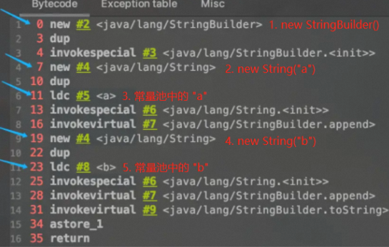

3. StringBuilder.toString() 不会在常量池中创建字符串： 
```java
@Test
public void test() {
    StringBuilder sb = new StringBuilder();
    sb.append("a");
    sb.append("b");
    String s = sb.toString();	// 常量池只有 "a"、"b"，没有 "ab"
}
```

4. 如何保证变量 str 指向的是常量池中的 String？ 
    - 方式一：String str = "hello";	// 字面量赋值
    - 方式二：调用 intern();
5. intern() 的作用：大的网站平台，需要在内存中存储大量的字符串，比如很多人都存储：北京市、海淀区等信息。此时如果字符串都调用 intern() 方法，就会明显降低内存的使用。 

# 四、对象内存布局篇
## 1、JMM
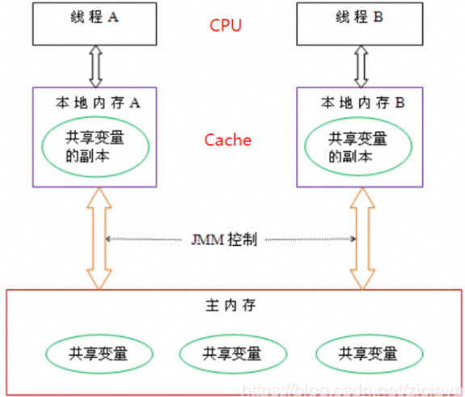

## 2、对象的创建
> 面试 (360、龙湖地产)：创建对象的过程
1. 判断类是否加载、链接、初始化 
2. 为对象分配内存 
    - 法1：碰撞指针，适用于堆内存规整的情况下 (已分配和未分配的空间都是连续的，是一整块的)；  
过程：指针指向已分配空间和未分配空间的分界点，对象占用内存多大，指针就向未分配空间移动多大； 
    - 法2：空闲列表，适用于堆内存不规整的情况下；  
过程：JVM 维护一个空闲列表，记录堆中未分配的内存块，为对象分配内存时就从空闲列表中找； 
    - 具体使用哪种方法取决于垃圾回收器；如果使用复制、标记整理算法，就用碰撞指针；如果使用标记清除算法，就用空闲列表； 

线程安全处理： 
    - 法1：TLAB (-XX:+UseTLAB，默认开启)，堆中的 TLAB 区是线程私有的，在 TLAB 区 new 对象不会导致线程安全问题；
    - 法2：若没开启 TLAB，则用 CAS (Compare And Swap) 尝试在堆中 new 对象。
3. 初始化零值：内存分配结束后，JVM 将分配到的空间都初始化为默认值。 
4. 设置对象头：Mark Word & 类型指针； 
5. 执行 \<init> 方法：成员变量的显式初始化、执行非静态代码块、调用构造器初始化成员变量、把堆中对象的首地址赋给引用变量。 

## 3、对象的内存布局
> 面试 (蚂蚁、美团)：Java 对象头存储哪些信息？长度是多少位？
>
> 面试 (58 同城)：为什么幸存者区 15 次后才进入老年代？(2^4 - 1 = 15)

> 对象头包括：
> 1. 对象标记 (Mark Word，占 8 字节)，包括以下字段 (若是数组，则对象标记还包含数组的长度)：

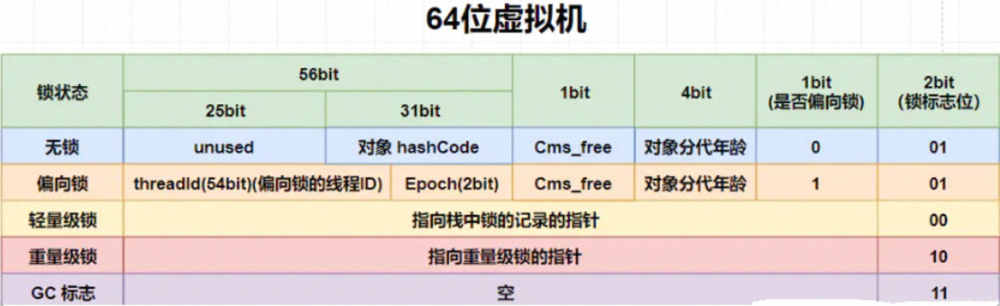

> 2. 类型指针 (占 8 字节)，指向方法区的类元信息；
```java
Object obj = new Object();	  // 所以空对象 obj 占用 8 + 8 = 16 字节
```

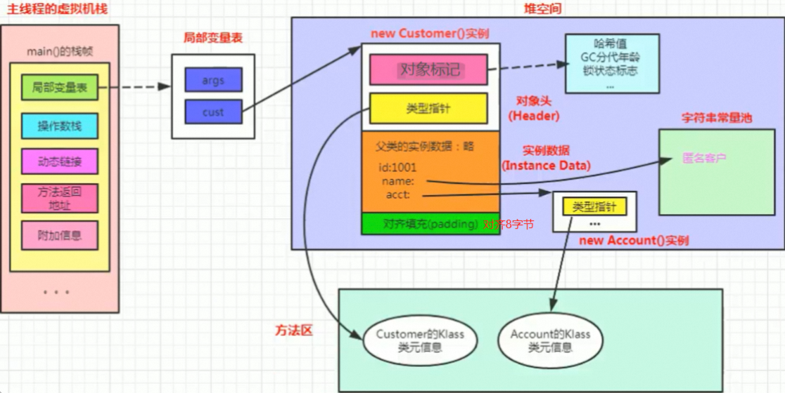

## 4、对象的定位
> 怎么找到对象？主要有两种方式：
> - 直接定位：变量直接指向对象 (HotSpot 采用)；
> - 间接定位：句柄访问，变量指向句柄 (包括对象数据的指针、对象类型的指针)，通过对象数据的指针找到对象；

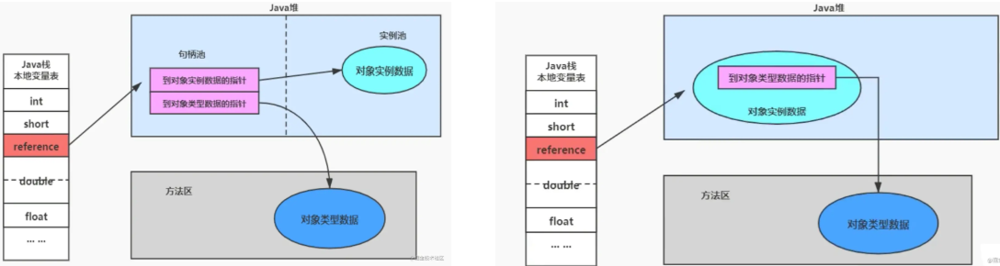

# 五、执行引擎篇
> Java 是半编译半解释的，JIT 对于只执行少次的代码，使用解释器执行，对于执行多次的热点代码，会编译成机器码执行；
>
> 面试 (字节)：怎么指定 JVM 的启动模式？
>
> 答：-Xint：解释器模式
>
> -Xcomp：JIT 编译模式
>
> -Xmixed：混合模式 (默认)，JVM 刚启动时用解释器执行，当代码执行此处超过阈值 (热点代码)，就会被编译成机器码存入 CodeCache，此后热点代码不再解释执行！所以 JVM 刚启动时性能并不好，必须经过一定时间的预热，把热点代码都编译成机器码之后，执行效率才上来。此外，JIT 还会对代码做优化，所以代码跑的时间越长，JIT 的执行性能越高！

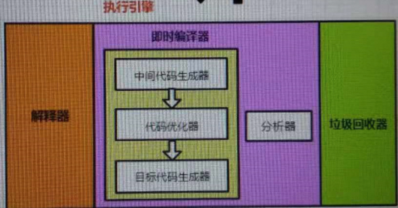

# 六、垃圾回收篇
> GC 存在的必要性：没有 GC，内存迟早耗尽，只有堆和方法区有 GC；
>
> **重点：4 种垃圾回收算法 + 7 个垃圾回收器！**

> -XX:+PrintGCDetails，开启控制台打印 GC 信息；
>
> -XX:-PrintGCDetails，关闭。

## 1、GC 算法
> 面试 (菜鸟、高德、网易、美团、B 站、百度、腾讯、阿里)：GC 算法有哪些？优缺点？适用场景？垃圾回收器有哪些？
>
> 面试 (网易、美团)：如何确定哪些要被 GC，哪些不被 GC？	不可达的对象就是垃圾，要被 GC
>
> 面试 (字节、腾讯、美团、京东、抖音、拼多多)：GC Roots 有哪些？

### 1.1、垃圾判断算法
1. 引用计数算法 
> 原理：对每个对象保存一个引用计数器属性，被引用时 +1，引用失效时 -1，当引用计数器为 0 时表示该对象可被回收。
>
> 优点：简单、高效；
>
> 缺点：**循环引用**时会造成内存泄漏。

2. 可达性分析算法 (根搜索算法、**Java 采用**) 
> 原理：以根对象集合 (GC Roots) 为起点，从上至下搜索对象是否可达；
>
> 优点：简单、高效、有效解决循环依赖问题。
>
> **GC Roots：**
> - **栈中引用的对象；**
> - **方法区中的静态变量对象；**
> - **方法区中的常量对象；**
> - 所有被 Synchronized 持有的对象；
> - JVM 内部的引用，如：ClassLoader、Error、Exception 等；
> - 除了上述固定的 GC Roots 外，根据用户所选的垃圾收集器和回收区域的不同，还可有其他对象临时加入 GC Roots。

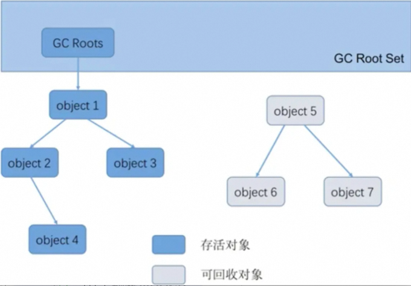

> 可达性分析算法的具体实现：三色标记法！
> - 黑色：已经被标记可达，其引用的所有子节点也都被标记可达；
> - 灰色：已经被标记可达，但其引用的子节点还没被打标；
> - 白色：不可达节点 / 尚未被打标的节点；
>
> 漏标：GC 线程把一些可达节点标记为黑色，切换到用户线程后，若用户线程修改了该节点的引用，让其持有白色节点的引用，此时白色节点就不应该被回收，但 GC 线程并不知道，还会把白色节点回收掉！
>
> 解决办法：
> - G1：原始快照 (Snapshot At The Beginning, SATB)：并发标记前给堆打快照，在之后的过程中，引用关系发生变化的对象都不被当做垃圾，可能会多标（浮动垃圾，下次 GC 回收掉即可）；
> - CMS：增量更新 (Incremental Update)：用户线程修改节点引用时，会将被引用的对象标记为灰色，并加入到一个队列中；GC 线程重新标记时，会遍历这个队列中的节点，重新访问，这样就不会漏标节点！
>
> 效率：SATB >>> 增量更新，因为不用再次扫描标记；
>
> 无论是 SATB 还是 增量更新，当对象引用关系发生变化时，都应该及时修改相关对象的颜色：写屏障（JVM 层面的 AOP，会在引用变化前后执行）；

### 1.2、垃圾清除算法
| | Mark-Sweep | Mark-Compact | Copying |
| --- | :---: | :---: | :---: |
| 速度 | 中等 | 最慢 | 最快 |
| 空间开销 | 少，但会产生内存碎片 | 少，不会产生内存碎片 | 需要两倍的内存空间，不会产生内存碎片 |
| 移动对象 | 否 | 是 | 是 |

1. 标记-清除算法 
> 原理：
> - Collector 从 GC Roots 开始递归遍历，标记所有可达对象；
> - 遍历整个堆，回收没被标记的对象；
> - 回收并不是置空，而是将其地址保存在空闲列表里。
>
> 优点：
> - 简单、高效。
>
> 缺点：
> - 先标记，再清除，要遍历两次；
> - GC 后会产生内存碎片；
> - 需要维护空闲列表。

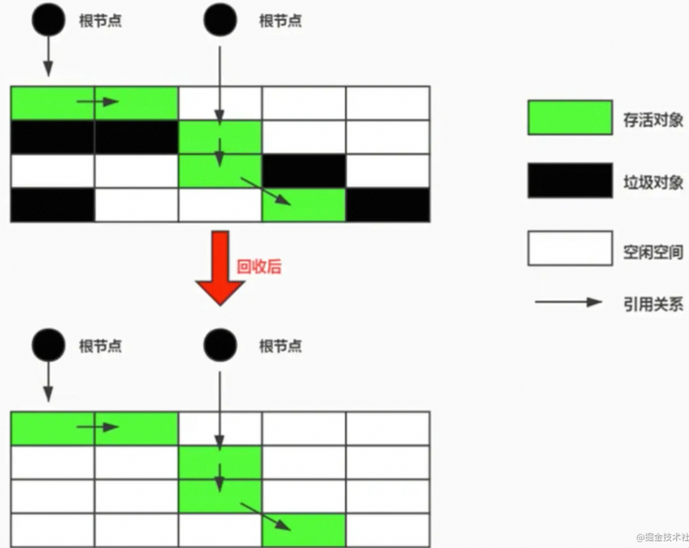

2. 复制算法
> 原理：
> - 将内存空间分为两块：正在使用的内存块、未被使用的内存块，每次只使用其中一块；
> - GC 时将正在使用的内存块中的存活对象复制到未被使用的内存块中，然后清除正在使用的内存块中的所有对象；
> - 交换两个内存块的角色。
>
> 优点：
> - 不会出现内存碎片；
> - 不用维护空闲列表，JVM 只需维护一个碰撞指针。
>
> 缺点：
> - 需要两倍的内存空间；
> - 如果存活的对象很多，垃圾很少，则复制的成本很高。

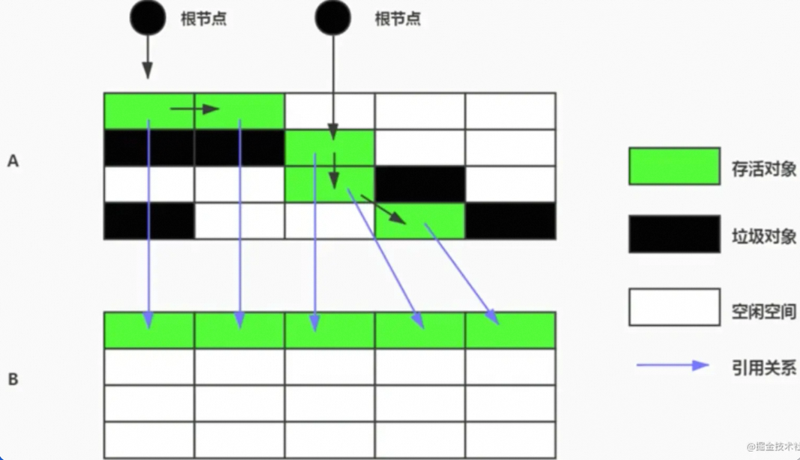

3. 标记-压缩算法
> 原理：
> - 从 GC Roots 开始递归遍历，标记所有可达对象；
> - 将所有的存活对象压缩到内存的一端，按顺序排放；
> - 清理边界外所有空间。
>
> 优点：
> - 消除了前面两个算法的弊端，即：内存规整、且不需要两倍的内存空间;
> - 不用维护空闲列表，JVM 只需维护一个碰撞指针。
>
> 缺点：
> - 标记 + 移动，效率不高；
> - 移动对象的同时，如果对象被其他对象引用，则还需要调整引用的地址。

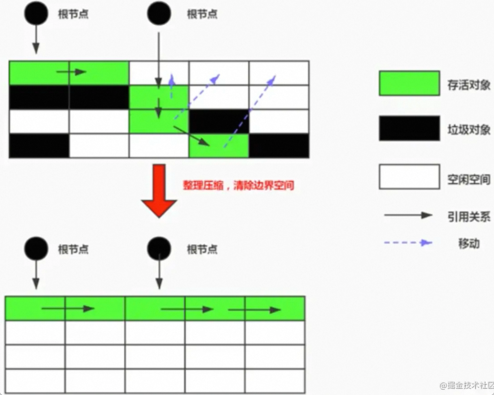

4. **分代收集算法**
> - 年轻代采用 "复制算法"，因为年轻代中 80% 的对象朝生夕死，回收率高，复制成本小；
> - 老年代采用 "标记-整理" 或 "标记清除"，因为老年代区域大，对象生命周期长，回收率低，复制的成本太大。
>
> 面试 (BAT)：堆为什么分区？分代收集算法？好处？
>
> 答：分区是为了分代 GC，不同区域的对象，生命周期不同，分代收集可以提高回收效率，避免 Full GC，上面两行；

## 2、相关概念
### 2.1、System.gc() 和 finalize()
> - 调用 System.gc() 或 Runtime.getRuntim().gc() 会提醒 JVM 执行 Full GC，但不确定是否马上执行；
> - GC 应该是 JVM 自动进行的，我们不应该显式的调用 GC，所以 System.gc() 的使用情况比较特殊，如性能测试时；
>
> 面试：谈谈你对 finalize() 的理解
> - finalize() 是 Object 类的一个方法，如果子类重写了该方法，在子类对象被 GC 之前，要先调用其 finalize()，因此可以在 finalize() 中做一些资源释放的操作；
> - 但 finalize() 非常影响性能，甚至引起 OOM，jdk9 已经 @Deprecated 了；重写了 finalize() 的对象在第一次 GC 时是回收不掉的，因为要先调用 finalize()，回收了就没法调用了，要第二次 GC 才能被回收；而且 finalize() 方法不会抛异常，没法判断资源释放时是否出现异常！ 

```java
public class SystemGCTest {
    
    public static void main(String[] args) {
        new SystemGCTest();
        System.gc();
    }
    
	// finalize() 相当于对象死之前的遗言，在对象被 GC 之前会调用该对象的 finalize()，做必要的清理工作；
    // 当对象变为垃圾时，GC 先判断该对象是否重写了 Object#finalize；
    // 若没重写，则直接回收；若重写了，且该对象未曾执行过 finalize()，则先执行 finalize()；
    // 执行完毕后，GC 再次判断该对象是否为垃圾，若是垃圾则回收，若不是垃圾则该对象复活了；
    @Override
    protected void finalize() throws Throwable {
        super.finalize();
        System.out.println("SystemGCTest 重写了 finalize()");
    }
}
```

### 2.2、内存泄漏和内存溢出
> 面试 (字节、阿里、拼多多、百度、美团)：Java 存在内存泄漏和内存溢出吗？内存泄漏是怎么造成的？如何解决？两者区别？

> 内存溢出的情况：堆内存设置不够，或创建了大量的大对象，且长时间不能被 GC；
>
> 内存泄漏的情况：

1. 静态集合属性
> 静态集合和 JVM 的生命周期相同，当静态集合中存有对象时，则该对象的生命周期也和 JVM 相同。
>
> 即：生命周期长的对象持有生命周期短的对象的引用，尽管生命周期短的对象不再使用，但还是不能被 GC。

```java
public class MemoryLeak {
    public static List list = new ArrayList();
}
```

2. 单例模式 
> 和静态集合类似，单例对象的生命周期和 JVM 相同，若单例对象引用外部对象，则外部对象也不能被 GC。

3. 内部类持有外部类 
> 内部类中使用了外部类的属性，则在内部类对象回收之前，外部类对象不能被回收。

4. 连接不关闭 
> 如：数据库连接、输入输出流等，用完不 close，就会导致内存泄漏。

5. 变量作用域不合理 (能定义局部变量，就不要定义全局变量)
```java
public class Test {
    private String msg;
    // 方法执行完毕后，msg 并不会被回收，除非在方法内 msg = null，或将 msg 声明在方法内
    public void test() {	
        msg = "hello";
    }
}
```

6. 改变哈希值
```java
public void test() {
	Set<Person> set = new HashSet<>();
    Person p1 = new Person(1, "name1");
    Person p2 = new Person(2, "name2");
    set.add(p1);
    set.add(p2);
    p1.name = "name9";	// 如果 name 字段参与了 Person 类的 HashCode 计算
    set.remove(p1);		// 则删不掉，set 中的 p1 就内存泄漏了
}
```

7. 缓存泄漏 
> 本地缓存，过期时间不合理

8. 监听器和回调 
> 如果客户端在你实现的 API 中注册回调，却没有显示取消，那么就会积聚。
>
> 需要确保回调立即被当作垃圾回收的最佳方法是只保存它的弱引用，例如将其保存为 WeakHashMap 中的键。

### 2.3、五种引用
> 面试 (字节)：强引用、软引用、弱引用、虚引用的区别？
>
> 面试 (京东)：开发中使用过 WeakHashMap 吗？

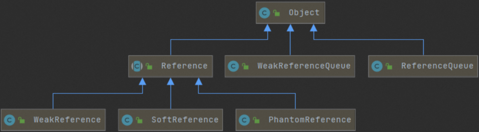

1. 强引用： 
    - 默认的引用类型；
    - 只有当对象不可达时，才会被 GC；
    - 是造成内存泄漏的主要原因之一。
2. 软引用： 
    - 内存充足时，被引用的对象不会被 GC；
    - 内存不足时，被引用的对象才会被 GC；
    - 软引用自身需要配合引用队列来 GC；
    - 适合保存缓存数据。

```java
public void test() {
    Object obj = new object(); 		// 强引用
    SoftReference<Object> sf = new SoftReference<Object>(obj);	 // 软引用
    obj = null; 					// 取消强引用
    System.out.println(sf.get());	// 获取软引用对象
    System.gc();
    System.out.println(sf.get());	// 由于堆空间充足，所以不会回收软引用对象
}
```

3. 弱引用： 
    - 不管内存是否充足，GC 时被引用的对象都会被回收；
    - 弱引用自身需要配合引用队列来 GC； 
    - 适合保存可有可无的缓存数据。

```java
public void test() {
    Object obj = new object(); 		// 强引用
    WeakReference<Object> wf = new WeakReference<Object>(obj);	// 弱引用
    obj = null; 					// 取消强引用
    System.out.println(wf.get());	// 获取弱引用对象
    System.gc();
    System.out.println(wf.get());	// 被回收了
}
```

4. 虚引用 (幽灵引用、JVM 开发者使用) 
    - 形同虚设的引用，和其他几种引用都不同，虚引用并不会决定对象的生命周期；
    - 无法通过虚引用访问引用对象，因此 PhantomReference.get() 总是返回null；
    - 当一个对象被回收时，如果该对象存在虚引用，则会在回收之前先将其存入 ReferenceQueue，用来通知应用程序该对象的回收情况。
    - 注意：**虚引用和终结器引用必须配合引用队列使用！**强软弱不用；
    - 作用：最弱的引用，**用于跟踪对象被垃圾回收的状态**；可以根据引用队列中是否有虚引用，来判断被引用的对象是否被 GC；
5. 终结器引用：**用于实现对象的 finalize() 方法**。

## 3、垃圾回收器
### 3.1、分类
> 面试 (阿里、滴滴、新浪、平安银行)：垃圾回收器有哪些？7 个
>
> 面试 (360)：什么是安全点与安全区域？
> - 安全点 (Safe Point)：程序并非在所有地方都能停下来开始 GC，只有在安全点才可以；
> - 安全区域 (Safe Region)：在一段代码片段中，对象的引用关系不会发生变化，在这个区域中的任何位置开始 GC 都是安全的。
>
> **查看当前使用的垃圾回收器：-XX:PrintCommandLineFlags。**

> 注意：任何 GC 都有 Stop The World！！所以 GC 的并发指 GC 线程和用户线程之间，而 GC 的并行是指 GC 线程之间！！
> - JDK8 采用 Parallel Scavenge + Parallel old；
> - JDK9 及以后采用 G1；
> - JDK14 删除了 CMS；

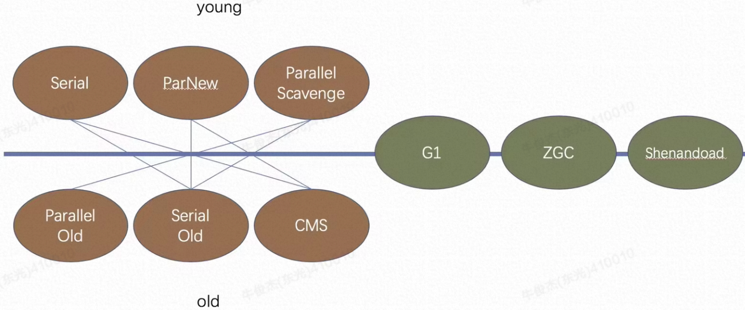

#### 3.1.1、Parallel GC
- -XX:GCTimeRatio 可以设置 GC 时间占比，<font style="color:#DF2A3F;">注重吞吐量</font>
- -XX:+UseParallelGC 开启并行垃圾回收器（JDK8 默认）；
- -XX:ParallelGCThreads，设置年轻代 GC 线程数； 
- -XX:MaxGCPauseMillis，设置 STW 的最大时间。不建议使用，因为设置的小就可以提高响应速度，但影响吞吐量；
- **<font style="color:#DF2A3F;">-XX:GCTimeRatio</font>**，设置 GC 时间占比；取值 (0, 100)，默认为 99，1 / (1+ratio)，即：GC 时间不超过 1%；
- -XX:+UseAdaptiveSizePolicy，设置 Parallel Scavenge GC 具有<font style="color:red">**自适应调节策略**</font>； 
    - Eden 区和 s 区大小默认是 8 : 1 : 1，但实际上是 6 : 1 : 1，这就是自适应调节后的结果。只有显式的设置 -XX:SurvivorRatio = 8 才会是 8 : 1 : 1，但这样会使自适应调节策略失效，因此建议不设置。
    - 在手动调优比较困难的场合，可以直接使用该策略，仅指定虚拟机的最大堆、目标的吞吐量 (GCTimeRatio) 和停顿时间(MaxGCPauseMills)，让虚拟机自己完成调优工作。

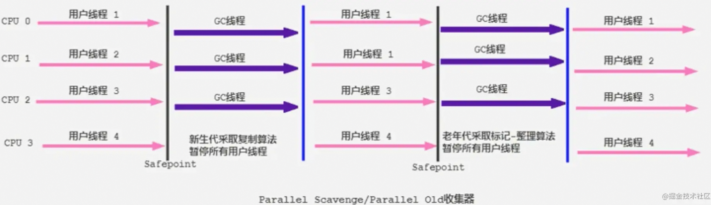

#### 3.1.2、CMS GC
> 第一款并发 GC，GC 线程和用户线程之间并发执行，注重响应时间

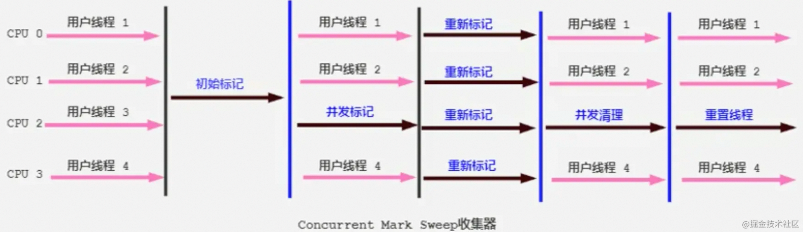

> CMS 的 GC 过程：
> 1. 初始标记 (STW)：仅标记与 GC Roots 直接关联的对象 (姑且称为一级子节点)；
> 2. 并发标记 (用户线程、GC 线程并发)：从一级子节点开始，遍历所有对象图，此过程可以和用户线程并发执行；
> 3. 重新标记 (STW)：解决数据一致性问题，因为并发标记时 GC 线程和用户线程是并发的，用户线程可能会修改某些对象的引用；
> 4. 并发清理 (用户线程、GC 线程并发)：此过程可以和用户线程并发执行。 
>
> 缺点：
> - 响应时间低，但**吞吐量也低**，因为 GC 时把一部分资源让给了用户线程，导致回收时间长，内存空间没有被及时释放；
> - **采用 "标记-清除" 算法，会产生内存碎片**；不能使用 "标记-压缩" 算法，因为 CMS 是并发的，用户线程正在使用对象，GC 线程压缩后对象的位置就会变，用户线程就找不到该对象了！
> - 存在**浮动垃圾** (多标问题)：并发标记时，对象 A 引用 B，GC 线程把 A、B 都标记了；但用户线程把 A -> B 的引用断开了，但 GC 线程并不知道，导致 B 在下次 GC 时才会被回收；

#### 3.1.3、G1 GC (Garbage First)
> 分区、分代 GC；
>
> 分区：每个 Region 是动态变化的，可能是 Eden 区，也可能是 Old 区；
>
> H 区：用于存储大对象（大小 > 0.5 个 Region）；如果对象太大，会使用多个连续的 H 区存储；


- G1 的目标：可以设置 STW 最大时间，老年代只回收价值高的 Region，**<font style="color:red;">兼顾吞吐量和响应时间</font>**，JDK9 默认，用来取代 CMS！
- G1：垃圾优先，会维护一个优先列表，优先回收价值最大的 Region（垃圾占比高）；G1 避免了一次性收集整个堆区，降低了延迟；
- 参数设置： 
    - 在 JDK8 用 -XX:UseG1GC 来启用；
    - -XX:G1HeapRegionSize：设置每个 Rigion 的大小，值为 2<sup>n</sup>，范围：[1MB, 32MB]，默认是堆内存的 1/2000；
    - **<font style="color:#DF2A3F;">-XX:MaxGCPauseMillis</font>**：设置 STW 最大时间，默认为 200ms（不要设置的太低，因为低延迟和高吞吐不可兼得）；
    - -XX:ParallelGCThread：设置 STW 时 GC 线程数，最多为 8；
    - -XX:ConcGCThreads：设置并发标记的线程数，建议设为 XX:ParallelGCThread / 4；
    - **<font style="color:#DF2A3F;">-XX:InitiatingHeapOccupancyPercent</font>**：设置堆占用率阈值，超过此值，就触发老年代并发标记，默认值为 45%。
- 优点：
    - **支持和用户线程之间并发、和其他 GC 线程之间并行；**
    - 解决了 CMS 的**内存碎片**问题，Region 采用 "标记-清除 + 复制" 算法：Rigion 中有部分对象是垃圾时，也会被回收，将多个 Rigion 中不是垃圾的对象整合起来复制到其他 Rigion；整体上可看作是 "标记-压缩" 算法；
    - 可以控制 STW 最大时间。
- 缺点：内存占用比 CMS 高（空间换时间，使用额外的空间存储引用关系，减少标记耗时），适合大内存服务器 (6G 以上)，小内存应用建议用 CMS。也存在**浮动垃圾**问题；

> G1 GC 过程：
> 1. Young GC：
>     - Eden 内存不足时触发，从 GC Roots 开始扫描，只扫描年轻代对象，遇到老年代对象就跳过；
>     - 没被扫描到的年轻代对象一定是垃圾吗？非也，若该年轻代对象被老年代引用就不是垃圾？扫描 RSet，将 RSet 中被跨代引用的年轻代对象标记为可达，防止误回收；
>     - 将存活对象移到 S 区或老年代；会 STW，多个 GC 线程并行；
> 2. Young GC + 老年代并发标记：当堆内存占用超过 -XX:InitiatingHeapOccupancyPercent (默认 45%) 时，开始老年代的并发标记： 
>     - 初始标记 (STW)：标记 GC Roots 直接可达的对象，并触发一次 Young GC（原因：若年轻代对象引用老年代对象，先尝试把年轻代对象干掉，否则老年代对象回收不了）；
>     - 根区域扫描：初始标记后，存活的对象（一级子节点）进 S 区，因此继续从一级子节点继续标记；
>     - 并发标记 (用户线程、GC 线程并发)：整堆标记；
>     - 重新标记 (STW)：根据 SATB 修正并发标记的结果；
>     - 清点垃圾 (STW)：计算每个 Region 的回收优先级并进行排序，该阶段并不会回收；
> 3. 老年代并发标记后触发 Mixed GC（STW）：开始回收整个年轻代、部分老年代（优先级高的 Rigion），将多个 Rigion 中存活的对象整合起来<font style="color:red;background-color:yellow;">复制</font>到其他 Rigion；
> 4. Full GC：G1 的初衷就是要避免 Full GC。若 Mixed GC 之后还是内存不足，则 G1 会使用单线程 Full GC，STW 非常长，性能非常差！但在 jdk 高版本中引入了多线程 Full GC！
>
> 面试题：G1 GC 怎么解决跨代引用的问题？如老年代 Rigion 中的对象引用了年轻代 Rigion 中的对象，Young GC 时怎么办？把老年代也扫描一遍？这不就整堆扫描了吗（效率极低）？
>
> 答：每个 Region 都有一个**记忆集(RememberedSet)**，记录其他区域到本区域的引用关系，Young GC 时只需要扫描年轻代 Region + RSet 即可，就知道哪些年轻代对象被引用，不能被回收，无需扫描老年代。
>
> 问题：若老年代对象也是垃圾，引用了年轻代对象，那么通过 Young GC 是回收不掉的（RSet 认为该年轻对象被引用，不是垃圾），只能 Mixed GC 时才能回收；

#### 3.1.4、ZGC
> G1 的缺点：
> - Mixed GC 的复制算法是 STW 的，也是 G1 耗时最长的部分，而 ZGC 的复制算法是并发的；
> - 空间换时间，使用额外的空间存储引用关系，减少标记耗时，只适合大内存服务器；
>
> ZGC 特点：
> - STW 时间不超过 10ms；
> - STW 时间不会随着堆的大小、活跃对象的大小而增加（只跟 GC Roots 大小有关）；
> - JDK15 转正，支持 16TB 的堆；
>
> ZGC 内存布局：和 G1 类似，内存分区，但不叫 Region，叫 page
> - 小型 page：容量 2M，存放 [0, 256k) 的对象；
> - 中型 page：容量 32M，存放 [256k, 4M) 的对象；
> - 大型 page：容量不固定，但是必须是 2M 的整数倍。存放 [4M, ∞) 的对象，且只能存放一个对象。
>
> 核心思想：
> - 和 G1 一样采用<font style="color:red;background-color:yellow;">复制算法</font>，但 G1 复制时必须 STW，复制后更新用户线程对该对象的引用（否则 NPE），整个复制算法是 STW 的，是 G1 的性能瓶颈；
> - ZGC 使用染色指针和读屏障，使复制算法是<font style="color:red;background-color:yellow;">并发</font>的：对象复制移动后，会记录新老地址的映射，用户线程每次访问对象<font style="color:red;background-color:yellow;">前</font>，根据染色指针判断对象是否移动了，如果移动了，就访问移动后的新地址，并更新对象引用新地址（<font style="color:red;background-color:yellow;">指针自愈</font>）；
> - 用染色指针记录 GC 状态，而不是记录在对象头中，读写 GC 状态效率极高；

1、染色指针
> 之前的垃圾回收器都将 GC 状态保存在对象头中，ZGC 则保存在对象指针中，读写 GC 状态更快！
>
> 对于 64 位 OS，理论上内存最大 2^64 = 16EB，但没人能用那么大内存，所以为了降低硬件成本，CPU 地址总线只支持 48 位，实际最大内存只能为 2^48 = 256TB，目前主流的 OS 都支持 2^44 = 16TB 内存；
>
> ZGC 目前只支持 2^44 = 16TB 内存，如下：
>
> - 16bit：OS 预留的，不使用；
> - 4bit：记录 GC 状态；
>     - Finalizable
>     - Remapped：表示对象被移动到新的内存位置；
>     - Marked1：表示上次 GC 标识过；
>     - Marked0：表示本次 GC 标识过；
> - 44bit：堆内存地址；

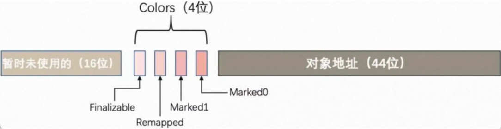

2、读屏障
> 与三色标记法中的写屏障类似，读屏障（JVM 层面的 AOP）会在读取对象地址前执行；

3、内存地址多重映射
> 创建对象时，依旧会在 OS 虚拟内存中分配空间，除此之外，通过染色指针维护了三个虚拟内存空间 Marked0、Marked1、Remapped，是 JVM 层面的虚拟内存；

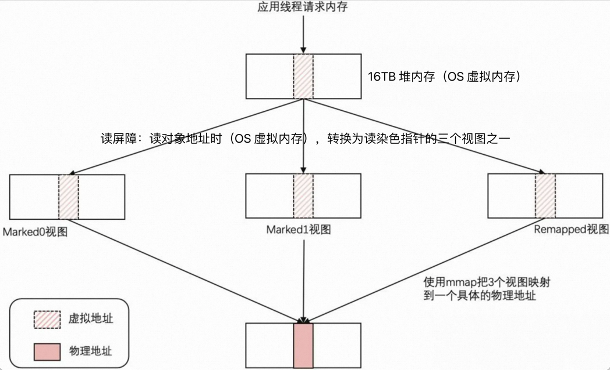

4、GC 过程（标记 + 转移）
> - 初始标记 (STW)：标记 GC Roots 直接可达的对象；
> - 并发标记：整堆标记；
> - 重新标记 (STW)：修正并发标记的错误，即三色标记法漏标问题（最多 STW 1ms，如超过，会再次进入并发标记）；
> - 并发转移准备：收集需要复制的 page；
> - 初始转移（STW）：将 GC Roots 直接可达的对象复制到新的 page 里（不是垃圾）；
> - 并发转移：扫描整堆所有 page 进行复制，并发很快；
>
> 注意：转移阶段会记录下地址变化的对象（用户线程读对象时触发读屏障，自动修复对象地址）；

### 3.2、评估指标
> 面试 (阿里、滴滴)：吞吐量优先、响应时间优先分别选择什么垃圾回收器？
> - **吞吐量**：运行用户代码的时间 /（运行用户代码的时间 + GC 时间）；
> - **暂停时间**：GC 时，用户线程被暂停的时间；
> - 内存占用：堆区所占内存大小；
> - 收集频率：GC 的频率；

> 吞吐量和暂停时间两者矛盾，如下图：
> - 吞吐量优先时，吞吐量 = 5.6 / 6；
> - 响应时间优先时，吞吐量 = 5.5 / 6；
> - 响应时间优先的 GC 频率比吞吐量优先要高，这样每次 GC 的时间就短，响应时间就小；
> - **<font style="color:red">JVM 调优标准：在吞吐量优先的情况下，降低停顿时间。</font>**

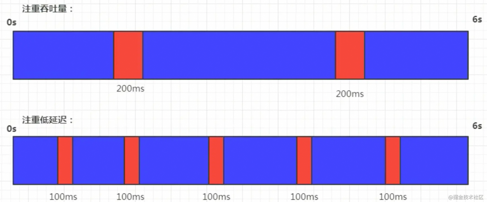

## 4、GC 日志分析
| 参数 | 说明 |
| :---: | :---: |
| -XX:+PrintGC | 等价于：-verbose:gc，输出的日志很简略 |
| **<font style="color:#DF2A3F;">-XX:+PrintGCDetails</font>** | 输出 GC 的详细日志 |
| -XX:+PrintGCTimeStamps | 输出 GC 的时间戳 |
| -XX:+PrintGCDateStamps | 输出 GC 的时间戳 |
| -XX:+PrintHeapAtGC | 在进行 GC 的前后打印出堆的信息 |
| -Xloggc: ./gc. log | 将 GC 日志输出到文件，配合上面几个命令使用 |

> -XX:+PrintGCDetails

```bash
[GC (Allocation Failure) [PSYoungGen: 16301K -> 2028K(18432K)] 16301K -> 14278K(59392K), 0.0038186 secs] [Times: user=0.00 sys=0.00, real=0.00 secs]

[Full GC (Allocation Failure) [PSYoungGen: 2020K -> 0K(18432K)] [ParOldGen: 28552K -> 30230K(40960K)] 30572K -> 30230K(59392K), [Metaspace: 3840K -> 3839K(21504K)], 0.0230671 secs]
```

> 参数解析：
> - GC、Full GC：GC 的类型；
> - (Allocation Failure)：GC 的原因；
> - [PSYoungGen: 16301K -> 2028K(18432K)]：[Parallel Scavenge GC 回收年轻代: 回收前的大小 -> 回收后的大小（总大小）；
> - 16301K -> 14278K(59392K), 0.0038186 secs：堆空间内存变化，GC 花费的时间；

# 七、性能监控篇
看 [https://www.bilibili.com/video/BV1PJ411n7xZ?p=309](https://www.bilibili.com/video/BV1PJ411n7xZ?p=309)

> 面试（蚂蚁、京东、美图、搜狐）：JVM 诊断调优工具用过哪些？怎么打印线程栈、堆的信息？

> 调优的目的：防止 OOM、减少 Full GC 频率

## 1、命令行
> 必须要背！面试会考！

```bash
jps -l                            # 查看所有 Java 进程，还有其它参数，挺复杂的
jstack pid                        # 查看 Java 进程的所有线程信息
jinfo -flags pid                  # 查看当前 Java 进程所有 JVM 参数是否开启，或值是多少
jinfo -flag PrintGCDetails pid    # 查看当前 Java 进程 JVM 参数 PrintGCDetails 是否开启，或值是多少
jmap                              # 查看内存，如 jamp -heap <pid>
jstat                             # 查看统计信息、如 gc 信息、内存使用信息等
```

## 2、GUI
> - jvisualvm 官方自带；
> - eclipse MAT；
> - Arthas 阿里；

## 3、JVM 运行时参数
> JVM 参数有两种：
> 1. X 参数（了解），详见 "[五、执行引擎篇](#5f608b9e)"
> 2. XX 参数 
> - Boolean 型参数： 
>     - -XX:+PrintGCDetails、-XX:-PrintGCDetails 等；
>     - + 表示开启，- 表示关闭。
> - K - V 型参数： 
>     - -XX:MetaspaceSize=128m、-XX:MaxTenuringThreshold=15 等；
>     - -Xms 是 -XX:InitialHeapSize 的缩写，-Xmx 是 -XX:MaxHeapSize 的缩写、-Xss 是 -XX:ThreadStackSize 的缩写。

# 八、调优案例篇
## 1、概述
> JVM 调优，实际上就是让 Major GC 和 Full GC 少发生！因为 FullGC STW 很长，程序响应慢！
>
> 调优步骤：
>
> 1、性能监控，发现问题：
> - GC 频繁；
> - CPU 、内存负载过高；
> - OOM；
> - 程序响应时间长； 
>
> 2、性能分析，排查问题：
> - 使用命令行：jstack、jamap、jinfo、jps、jstat 等查看当前时刻信息；
> - 使用 GUI 工具、Visual VM、Arthas 等查看实时信息；
> - 打印 GC 日志，通过 https://blog.gceasy.io/ 等工具分析 GC 日志；
>
> 3、性能调优，解决问题：
> - 适当增大堆内存，根据业务背景选择垃圾回收器；
> - 优化代码、合理使用中间件、合理设置线程数等；
> - 增加机器，分散压力；

## 2、OOM 案例
### 2.1、堆 OOM
> 原因：
> - 代码中可能存在大对象的分配；
> - 可能存在内存泄漏，导致多次 GC 后还是无法找到一块足够大的内存存放当前对象。
>
> 解决办法：
> - 检查是否有大对象分配，最有可能的是大数组分配；
> - 分析 dump 文件，检查是否存在内存泄漏；
> - 若没有明显的内存泄漏，使用 -Xmx 加大堆内存；
> - 还有一点容易被忽略：检查是否有大量自定义的 Finalizable 对象（不可达但还在队列中，目前还没回收），也有可能是框架内部提供的，考虑其存在的必要性。

1. 程序 

```java
@RestController
public class TestController {

    @GetMapping("/add")
    public void test() {
        List<User> list = new ArrayList<>();
        while (true) {
            list.add(new User("admin", "admin"));
        }
    }
}
```

2. 设置参数 

| 参数 | 说明 |
| :---: | :---: |
| -Xms50m | 堆的初始大小 |
| -Xmx50m | 堆的最大大小 |
| -XX:+PrintGCDetails | 打印 GC 日志 |
| -XX:+PrintGCDateStamps | 打印 GC 时间戳 |
| -Xloggc:log/gc.log | 生成 GC 日志：gc.log |
| -XX:MetaspaceSize=64m | 元空间大小 |
| -XX:+HeapDumpOnOutOfMemoryError | 生成 dump 文件：保存程序运行过程中堆栈的信息 |
| -XX:HeapDumpPath=heap/dump.hprof | dump 文件的路径 |


3. 访问程序，报错：java.lang.OutOfMemoryError: Java heap space 
4. 使用 https://blog.gceasy.io/ 分析 gc.log，过程比较慢，等着 
5. 使用 `D:\jdk1.8\jdk1.8.0_101\bin\jvisualvm.exe` 分析 dump.hprof：文件 → 装入 → 选择 dump.hprof 文件 

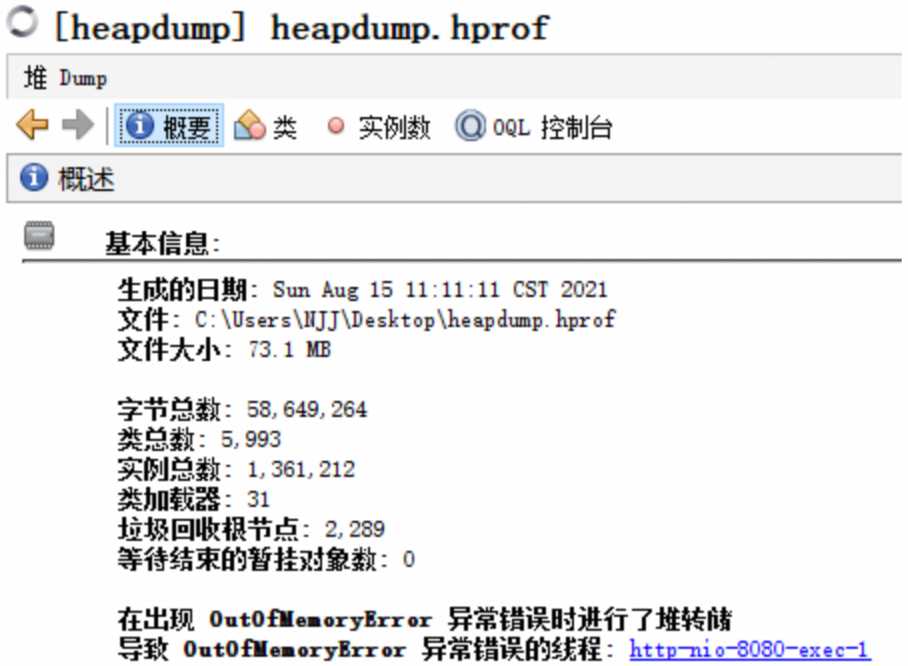
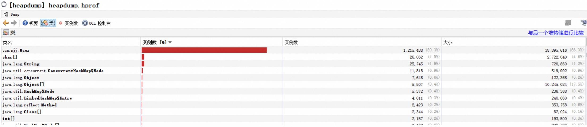

6. 注意：若 dump.hprof 文件已存在，再次生成则不会覆盖，还是原来的 dump 文件，但 gc.log 会覆盖。

### 2.2、元空间 OOM
> 即：方法区 OOM，方法区的 GC 主要是回收常量池和一些类型的卸载；
>
> 案例：用 CGlib 动态代理生成大量代理类，撑爆元空间！
>
> 原因、解决办法：
> - 程序运行期间生成了大量的代理类，导致元空间被撑爆；
> - 程序长时间运行，没有重启；
> - 元空间内存设置太小；

### 2.3、overhead limit exceeded
> 是堆 OOM 的前置检查：当超过 98% 的时间用来做 GC，且回收的堆内存不到 2% 时，会抛出 java.lang.OutOfMemoryError: GC overhead limit exceeded，此时还没发生堆 OOM！
>
> 原因、解决办法：
> - 一般都是因为堆太小，加大堆内存；
> - 检查是否有大量的死循环、或使用大内存的代码，优化！
> - -XX:-UseGCOverheadLimit 禁用这个检查，但解决不了问题，后面还会出现 java.lang.OutOfMemoryError: Java heap space；

## 3、性能优化案例
### 3.1、调整堆内存
**1、增大堆内存可以提高吞吐量**
> 增大堆内存可以降低 GC 频率，提高吞吐量；

**2、增大堆内存可能导致卡顿更严重**
> 堆内存太大，GC 频率越低，但一旦触发 GC，尤其是 FullGC，此时积累的垃圾很多，GC 时间会很长！所以堆内存并不是越大越好！
>
> 当出现**增大堆内存反而卡顿更严重**时，可以考虑使用 G1，并指定 STW 最大时间；分析 GC log、dump 文件，优化内存空间比例； 
>
> 常用组合：
> - ParNew + CMS；
> - Parallel；
> - G1； 
>
> 可以先统计出每次 FullGC 后老年代存活对象的内存占用平均值 x，建议：
>
> 堆内存设置为 x 的 3~4 倍，
>
> 方法区设置为 x 的 1.2~1.5 倍，
>
> 年轻代设置为 x 的 1~1.5 倍，
>
> 老年代设置为 x 的 2~3 倍；
>
> 问题：想要观察老年代剩余内存大小，如何触发 FullGC？ 
> 1. 程序启动时添加输出 GC 日志的参数，经过长时间的运行，多次观察 GC 日志，找 FullGC 记录；
> 2. 若程序从来没发生过 FullGC ，没有日志怎么办？只能强制手动 FullGC，但会影响线上服务 (STW)，慎用！建议先将一个服务节点摘除，专门做 FullGC，测完了再将服务节点挂回去，继续对外提供服务；可以执行 jamp -histo:live ，打印存活对象的信息，该命令会触发 FullGC！
> 3. 在测试环境，看能否使用 jvisualvm，jvisualvm 有个主动触发 FullGC 的按钮；
> 4. 主动调用 System.gc()；

### 3.2、CPU 占用过高 (面试常问)
> - 用 top 命令，定位 CPU 占用过高的进程 id；
> - 用 top 或 ps H -eo pid,tid,%cpu | grep 定位该进程中 CPU 占用过高的线程 id，将线程 id 转为 16 进制；
> - 用 jstack 查看所有 Java 线程，根据 16 进制 tid 定位到出问题的代码行数！或用 jstack grep | 16 进制 tid；
> - jstack 还会打印线程死锁情况！
> - 内存占用过高也可以使用该方法！