# 一、Spring 概述
## 1、简介
> 面试：说说 Spring？
>
> 1、Spring 是开源的 JavaEE 框架
>
> 2、Spring 可以解决企业应用开发的复杂性
>
> 3、Spring 核心：
> - IOC：控制反转，把创建对象过程交给 Spring 进行管理
> - AOP：面向切面，不修改源代码进行功能增强；
> - TX：声明式事务，方便实务操作； 
>
> 4、Spring 特点：
> - 方便和其他框架进行整合，简化开发；
> - 方便解耦；
> - 方便进行事务操作；

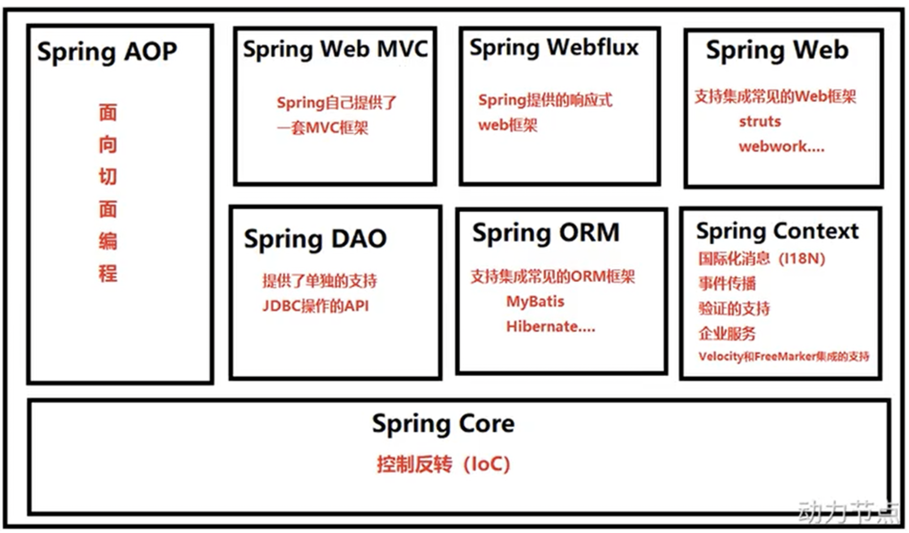

## 2、解耦演变过程
> 在传统的 Java Web 开发中：
> - 问题1：手动 new 对象，意味着要创建具体的对象，而不是面向接口、面向抽象编程，导致对象之间耦合度太高；
> - 问题2：通用的事务功能、日志功能与业务代码耦合；

```java
public interface UserDao {
    void deleteById(Long id);
}

public class UserDaoImplForMysql implements UserDao{
    @Override
    public void deleteById(Long id) {
        System.out.println("MySQL 删除用户");
    }
}
```

```java
public interface UserService {
    void doService1();
    void doService2();
}

public class UserServiceImpl implements UserService {

    private UserDao userDao = new UserDaoImplForMysql();

    @Override
    public void doService1() {
        // ......
        userDao.deleteById(1L);
    }

    @Override
    public void doService2() {
        // ......
        userDao.deleteById(2L);
    }
}
```

> 思考：若此时用 Oracle 把 MySQL 替换掉，代码有什么问题？
>
> 答：要创建 UserDaoImplForOracle，并把代码中所有 UserDaoImplForMysql 都换成 UserDaoImplForOracle；
> 1. 不符合 OCP 开闭原则：对扩展开放，对修改关闭！
> 2. 不符合 DIP 依赖倒置原则：面向接口编程，面向抽象编程，而不是面向具体！
>
> 问题的根本原因在于 UserServiceImpl 依赖了实现类 UserDaoImplForMysql，若将 UserDaoImplForMysql 换成抽象的 UserDao，就不会出现任何问题！如：

```java
public class UserServiceImpl implements UserService {

    // 通过抽象的接口，实现代码耦合！
    // 但这里的 userDao == null，解决办法：控制反转！
    private UserDao userDao;

    @Override
    public void doService1() {
        // ......
        userDao.deleteById(1L);
    }

    @Override
    public void doService2() {
        // ......
        userDao.deleteById(2L);
    }
}
```

> 控制反转：一种新的编程思想，出现的晚，没有被纳入 23 种设计模式！
> - 在程序中不要用硬编码来 new 对象；
> - 在程序中不要用硬编码来维护对象之间的关系；
>
> IOC 是思想，DI 是实现！Spring 使用工厂模式实现 DI，将对象的创建、对象关系的维护交给 IOC 容器！

```java
public class UserServiceImpl implements UserService {

    // userDao == null，Spring 怎么解决？用 setter 注入或构造器注入！
    private UserDao userDao;

    public void setUserDao(UserDao userDao) {
        this.userDao = userDao;
    }

    public UserServiceImpl(UserDao userDao) {
        this.userDao = userDao;
    }

    @Override
    public void doService1() {
        // ......
        userDao.deleteById(1L);
    }

    @Override
    public void doService2() {
        // ......
        userDao.deleteById(2L);
    }
}
```

> 面试：什么是 IoC、DI？两者关系？什么是 AOP？
> - IOC：Inversion of Control，控制反转，将 Bean 的创建权由原来程序反转给第三方；
> - DI：Dependency Injection，依赖注入，是 IoC 的一种实现，比如 A 的创建依赖于 B，那么就要先 new B()，再 new A()，然后 A.setB(B)，也就是需要程序员自己去维护对象之间的关系；使用 DI，只需要将 A、B 注册到容器，Spring 会自动帮我们维护 Bean 之间的关系；
> - AOP：Aspect Oriented Programming，面向切面编程，采用横向抽取机制，将一些增强的逻辑提取出来放到切面中，在程序编译 / 运行时，再将这些代码织入到需要的地方；(AspectJ 是静态代理，编译期织入)

# 二、IOC 容器
## 1、BeanFactory ⭐
> Spring IoC 容器底层就是 BeanFactory；

```java
// Dao：
public interface UserDao {
}
public class UserDaoImpl implements UserDao {
}

// Service：
public interface UserService {
}

public class UserServiceImpl implements UserService {
    private UserDao userDao;
    public void setUserDao(UserDao userDao) {    // 该方法提供给 BeanFactory 调用！
        this.userDao = userDao;
    }
}
```

```xml
<bean id="userService" class="com.njj.service.impl.UserServiceImpl">
    <property name="userDao" ref="userDao"/>    <!-- 依赖注入，但这里是手动注入 -->
</bean>

<bean id="userDao" class="com.njj.dao.impl.UserDaoImpl"/>
```

```java
// DefaultListableBeanFactory：
public static void main(String[] args) {
    // 1.创建 BeanFactory
    DefaultListableBeanFactory beanFactory = new DefaultListableBeanFactory();
    // 2.创建 XML 读取器，加载 XML 配置文件
    XmlBeanDefinitionReader reader = new XmlBeanDefinitionReader(beanFactory);
    reader.loadBeanDefinitions("beans.xml");
    // 3.通过 BeanFactory 创建 Bean
    UserService userService = (UserService) beanFactory.getBean("userService");
}

// ApplicationContext：
public static void main(String[] args) {
    ApplicationContext applicationContext = new ClassPathxmlApplicationContext("beans.xml");
    UserService userService = (UserService) applicationContext.getBean("userService");
}
```

> IoC 容器的两种实现方式：
> - BeanFactory (DefaultListableBeanFactory)：Spring 早期的 IoC 接口，加载 XML 配置文件时不会创建 Bean，在 getBean() 时才创建 Bean，即懒加载；
> - ApplicationContext：继承了 BeanFactory 接口，且内部组合了 DefaultListableBeanFactory 对象，比 BeanFactory 功能更强大，加载 XML 配置文件时就会创建配置文件中的所有 Bean，将这些 Bean 放入单例池中。

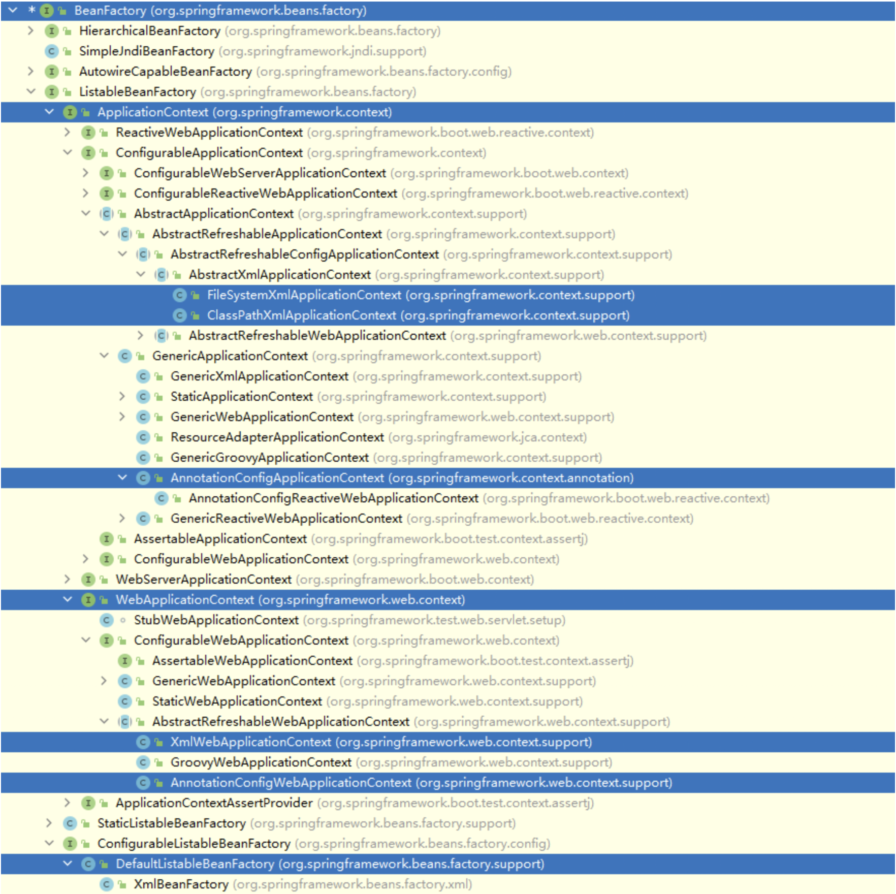

> Spring 环境下常用的 ApplicationContext：
> - FileSystemXmlApplicationContext：加载磁盘中的 XML 配置文件；
> - ClassPathXmlApplicationContext：加载类路径下的 XML 配置文件；
> - AnnotationConfigApplicationContext：加载注解配置类；
>
> Spring Web 环境下常用的 WebApplicationContext：
> - XmlWebApplicationContext：加载 XML 配置文件；
> - AnnotationConfigWebApplicationContext：加载注解配置类；

## 2、配置 Bean (基于 XML)
> 常用配置项：

| 配置项 | 说明 |
| --- | --- |
| <bean id="" class=""> | Bean 的 id、全限定名 |
| <bean name=""> | Bean 的别名，getBean(别名) 也可以获取 Bean |
| <bean scope=""> | Bean 的作用域 |
| <bean lazy-init=""> | Bean 的实例化时机，是否懒加载，true / false |
| <bean init-method=""> | Bean 实例化后自动执行的初始化方法 |
| <bean destroy-method=""> | Bean 销毁前自动执行的方法 |
| <bean autowire="byType"> | 自动注入，可选 byType、byName |


### 2.1、创建 Bean
```xml
<!-- 默认使用反射调用无参构造创建对象，若没有无参构造，则报错 -->
<bean id="user" class="com.njj.User"/>
```

### 2.2、注入属性
```xml
<!-- username、password 必须有 setter、User 必须有无参构造 -->
<bean id="user" class="com.njj.User">
	<property name="username" value="张三"/>
    <property name="password" value="123465"/>
</bean>
```
```xml
<!-- 必须有两个参数的有参构造 -->
<bean id="user" class="com.njj.User">
    <constructor-arg name="username" value="张三"/>
 	<constructor-arg name="password" value="123465"/>
</bean>
```

### 2.3、注入特殊类型属性
#### 2.3.1、字面量
> 字面量：基本数据类型及其包装类、String类型。
```xml
<!-- 1、注入 null 值 -->
<bean id="user" class="com.njj.User">
	<property name="username">
    	<null/>
    </property>
</bean>

<!-- 2、注入特殊符号 -->
<!-- 如：username = <<张三>> 
		法一：把<>分别转义为&lt; &gt;
		法二：把特殊符号写到 CDATA 中	-->
<bean id="user" class="com.njj.User">
	<property name="username">
        <value> <![CDATA[<<张三>>]]> </value>
    </property>
</bean>
```

#### 2.3.2、内部 bean
```java
@Setter
public class Student {
    private String sname;
    private Teacher teacher;		// 教师和学生：一对多关系
}
```
```xml
<bean id="student" class="com.njj.bean.Student">
    <property name="sname" value="小明"/>
    <property name="teacher">
        <bean id="teacher" class="com.njj.bean.Teacher">	    <!-- 内部 bean，也可用 ref 外部 bean 实现 -->
            <property name="tname" value="王老师"/>
        </bean>
    </property>
</bean>
```

#### 2.3.3、外部 bean
```xml
<bean id="student" class="com.njj.bean.Student">
    <property name="sname" value="小明"/>
    <property name="teacher" ref="teacher"/>
</bean>
 
<bean id="teacher" class="com.njj.bean.Teacher"> 	 <!-- 外部 bean -->
    <property name="tname" value="王老师"/>
</bean>
```

#### 2.3.4、级联赋值
> 如上 3.3.2、3.3.3 已经实现了级联赋值，下面是级联赋值的另一种实现。
>
> 注意：Student 类中的 teacher 属性必须有 get() 方法！

```xml
<bean id="student" class="com.njj.bean.Student">
    <property name="sname" value="小明"/>
    <property name="teacher" ref="teacher"/>
    <property name="teacher.tname" value="王老师"/> 	<!-- 外部 bean + 级联赋值 -->
</bean>
<bean id="teacher" class="com.njj.bean.Teacher"/>
```

#### 2.3.5、数组 / 集合注入
```java
@Setter
public class Student {
    private String[] myArray;			// Array
    private List<String> myList; 		// List
    private Map<String,String> myMap; 	// Map
    private Set<String> mySet; 			// Set
    private List<Course> myCourse; 		// 对象列表
}
```
```xml
<bean id="student" class="com.njj.bean.Student">	<!-- 创建 student 对象 -->
    
    <!-- 注入 Array -->
    <property name="myArray">
        <array>
            <value>元素1</value>
            <value>元素2</value>
        </array>
    </property>
    
    <!-- 注入 List -->
    <property name="myList">
        <list>
            <value>元素1</value>
            <value>元素2</value>
        </list>
    </property>
    
    <!-- 注入 Map -->
    <property name="myMap">
        <map>
            <entry key="k1" value="v1"/>
            <entry key="k2" value="v2"/>
        </map>
    </property>
    
    <!-- 注入 set -->
    <property name="mySet">
        <set>
            <value>元素1</value>
            <value>元素2</value>
        </set>
    </property>
    
    <!-- 注入对象列表 -->
    <property name="myCourse">
        <list>
            <ref bean="course1"/>
            <ref bean="course2"/>
        </list>
    </property>
    
    <bean id="course1" class="com.njj.bean.Course">
        <property name = "cname" value = "Spring"/>
    </bean>
    <bean id="course2" class="com.njj.bean.Course">
        <property name="cname" value="MyBatis"/>
    </bean>

</bean>
```

#### 2.3.6、集合注入之抽取
```xml
<!-- 引入 util 名称空间 -->
<?xml version="1.0" encoding="UTF-8"?>
<beans xmlns="http://www.springframework.org/schema/beans"
       xmlns:xsi="http://www.w3.org/2001/XMLSchema-instance"
       xmlns:p="http://www.springframework.org/schema/p"
       xmlns:util="http://www.springframework.org/schema/util"
       xsi:schemaLocation="http://www.springframework.org/schema/beans
                           http://www.springframework.org/schema/beans/spring-beans.xsd
                           http://www.springframework.org/schema/util
                           http://www.springframework.org/schema/util/spring-util.xsd">
    
    <!-- 使用 util 标签抽取 list 集合，可被多个 bean 标签 ref 引用，map、set同理 -->
    <util:list id="bookList">
        <value>易筋经</value>
        <value>九阴真经</value>
        <value>九阳神功</value>
    </util:list>
    
    <!-- 提取 list 集合类型属性注入使用 -->
    <bean id="student" class="com.njj.bean.Student">
        <property name="myList" ref="bookList"/>
    </bean>

</beans>
```

#### 2.3.7、引用 properties 文件
> XML 中配置的 Bean 逐渐增多时，查找和修改会很困难。这时可将一部分配置信息提取出来，以 properties 文件保存起来。在 Bean 的配置文件中引用 properties 文件即可。
```properties
jdbc.driver = com.mysql.jdbc.Driver
jdbc.url = jdbc:mysql://localhost:3306/db
jdbc.username = root
jdbc.password = 123456
```
```xml
<!-- 引入 context 命名空间 -->
<beans xmlns="http://www.springframework.org/schema/beans" 
       xmlns:xsi="http://www.w3.org/2001/XMLSchema-instance"
       xmlns:p="http://www.springframework.org/schema/p"
       xmlns:util="http://www.springframework.org/schema/util"
       xmlns:context="http://www.springframework.org/schema/context"
       xsi:schemaLocation="http://www.springframework.org/schema/beans
                           http://www.springframework.org/schema/beans/spring-beans.xsd
                           http://www.springframework.org/schema/util
                           http://www.springframework.org/schema/util/spring-util.xsd
                           http://www.springframework.org/schema/context
                           http://www.springframework.org/schema/context/spring-context.xsd">

    <!-- 指定外部属性文件的位置 -->
    <context:property-placeholder location="classpath:jdbc.properties"/>
    <!-- 引用外部属性文件 -->
    <bean id="dataSource" class="com.alibaba.druid.pool.DruidDataSource">
        <property name="driverClassName" value="${jdbc.driverClass}"/>
        <property name="url" value="${jdbc.url}"/>
        <property name="username" value="${jdbc.userName}"/>
        <property name="password" value="${jdbc.password}"/>
    </bean>
</beans>
```

### 2.4、FactoryBean ⭐
> Spring 有两种 Bean：
> - 普通 Bean：自己在 XML 中配置的 Bean；
> - FactoryBean：BeanFactory 是 Spring 容器，FactoryBean 是工厂 Bean，**是 Spring 对外开放的一种创建 Bean 的方式**。FactoryBean 会作为一个 Bean 注册进容器，也可以生产一些 Bean 并注册进容器。当使用 ApplicationContext#getBean(FactoryBean) 时，其实调用的是 FactoryBean#getObject！
>
> FactoryBean 常用于 Spring 整合第三方框架，工作中不用，但面试可能会问：BeanFactory 和 FactoryBean 的区别？

```java
public interface FactoryBean<T> {
    String OBJECT_TYPE_ATTRIBUTE = "factoryBeanObjectType";

    @Nullable
    T getObject() throws Exception;

    @Nullable
    Class<?> getObjectType();

    // FactoryBean 造出来的 Bean，不管是否单例，都是懒加载的，getObject() 时才创建
    default boolean isSingleton() {
        return true;
    }
}
```
```java
// 必须实现 FactoryBean 接口
public class UserDaoFactoryBean implements FactoryBean<UserDao> {

    @Override
    public UserDao getObject() throws Exception {
        return new UserDaoImpl();    // 将创建好的 Bean 返回给 IOC 容器，懒加载，调用 getObject 时才创建 Bean
    }

    @Override
    public Class<?> getObjectType() {
        return UserDao.class;        // 返回 Bean 的类型
    }
}
```
```xml
<bean id="userDao" class="com.njj.dao.UserDaoFactoryBean"/>
```

> 注意： 
> - getBean("userDaoFactoryBean") 返回的类型是 UserDaoImpl，而非 UserDaoFactoryBean！因为 Application#getBean 会调用 UserDaoFactoryBean#getObject！若想获取 UserDaoFactoryBean 本身，需要用 & 符号：getBean("&userDaoFactoryBean")
> - Spring 加载完 XML 配置文件后，FactoryBean 也会被实例化，并存储到单例池 ApplicationContext.singletonObjects 中，首次使用 UserDaoImpl 时，UserDaoImpl 才会被实例化 (懒加载)，且 UserDaoImpl 会被放在 ApplicationContext.factoryBeanObjectCache 缓存池中，而非单例池！
>
> FactoryBean 的两个用途：
> - 批量注册 Bean：在 XML 配置 Bean 或使用 @Bean 都能注册 Bean，但只能一个个注册，FactoryBean 可以批量注册；  
> - Spring 整合第三方框架：在 Spring 中，自定义类可以用 XML 或注解将其注册成 Bean，但第三方的类可能没法创建，怎么将其注册成 Bean？ 
>
> 如 Spring 整合 MyBatis，整合包实现了 SqlSessionFactoryBean、MapperFactoryBean，会自动将 SqlSessionFactory、Mapper 接口的代理对象注册到容器中！

> 案例：Spring 整合 MyBatis (mybatis-spring 的源码)：
>
> MyBatis 每次都要写一大堆：

```java
InputStream inputStream = Resources.getResourceAsStream("mybatis-config.xml");
SqlSessionFactoryBuilder sqlSessionFactoryBuilder = new SqlSessionFactoryBuilder();
SqlSessionFactory sqlSessionFactory = sqlSessionFactoryBuilder.build(inputStream);
SqlSession sqlSession = sqlSessionFactory.openSession();
UserMapper mapper = sqlSession.getMapper(UserMapper.class);
List<User> list = mapper.selectList();
```

> Spring 整合 MyBatis： 
> - 只要把 XxxMapper 注册到容器就好了！MyBatis 本来就可以根据 Mapper 接口通过 jdk 动态代理生成实现类，我们只需要把这些实现类拿过来注册到容器！
> - 但生成 XxxMapper 必须要用到 SqlSessionFactory，所以也要把 SqlSessionFactory 注册到容器！

```java
public class SqlSessionFactoryBean implements FactoryBean<SqlSessionFactory>, InitializingBean, ... {

    // 1.通过 InitializingBean 创建 SqlSessionFactory
    @Override
    public void afterPropertiesSet() throws Exception {
        // ......
        this.sqlSessionFactory = buildSqlSessionFactory();
    }

    protected SqlSessionFactory buildSqlSessionFactory() throws Exception {
        // ......
        return this.sqlSessionFactoryBuilder.build(......);
    }

    // 2.通过 FactoryBean 将 SqlSessionFactory 注册到容器
    @Override
    public SqlSessionFactory getObject() throws Exception {
        return this.sqlSessionFactory;
    }

}
```

```java
public class MapperScannerConfigurer implements BeanDefinitionRegistryPostProcessor ... {

    @Override
    public void postProcessBeanDefinitionRegistry(BeanDefinitionRegistry registry) {
        // ......
        scanner.scan(this.basePackage);    // mapper 包
    }

    public int scan(String... basePackages) {
        // ......
        // BeanDefinitionHolder 是对 BeanDefinition 又包了一层
        // 用 registry 把 beanDefinitions 都注册到 BeanDefinitionMap
        Set<BeanDefinitionHolder> beanDefinitions = doScan(basePackages);
        // ......
        processBeanDefinitions(beanDefinitions);
        // ......
    }

    private Class<? extends MapperFactoryBean> mapperFactoryBeanClass = MapperFactoryBean.class;

    private void processBeanDefinitions(Set<BeanDefinitionHolder> beanDefinitions) {
        for (BeanDefinitionHolder holder : beanDefinitions) {
            definition =  holder.getBeanDefinition();
            // ......
            
            // 这里不能设置为 Mapper 接口的 class，因为是接口，不能生成实现类！！！
            // 我们要把 MyBatis 自己生成的接口实现类拿过来放到这！
            // mapperFactoryBeanClass 是 FactoryBean，通过 FactoryBean 把 MyBatis 自己生成的接口实现类拿过来
            definition.setBeanClass(this.mapperFactoryBeanClass);
            // ......
        }
    }
}

public class MapperFactoryBean<T> extends SqlSessionDaoSupport implements FactoryBean<T> {
    @Override
    public T getObject() throws Exception {
        // MyBatis 自己通过 Mapper 接口生成实现类！！！
        return getSqlSession().getMapper(this.mapperInterface);
    }
}
```

### 2.5、Bean 的作用域 ⭐
> request、session、global session 只能在 Web 环境下才能配置，仅适用于 WebApplicationContext！

| 作用域 | 说明 |
| :---: | :---: |
| singleton | 单例 (默认)，加载配置文件时立刻创建单例 Bean，放入单例池 (singletonObjects，是个 ConcurrentHashMap) |
| prototype | 原型，加载 XML 配置文件时不创建 Bean，调用 getBean() 时才创建新的 Bean (多例、懒加载)，   Bean 会被放入 beanDefinitionMap 中 (是个 ConcurrentHashMap) |
| request | 发起 Http Request 时才创建 Bean，并把 Bean 放到 Request.attribute 中，   该 Bean 仅在当前 Request 内有效，该 Request 共享这个 Bean (Request 内单例) |
| session | 同一个 Http Session 中共享一个 Bean，该 Bean 仅在当前 Session 内有效，即：Session 内单例 |
| global session | 仅在 portlet 的 Web 应用中才能配置 |

```xml
<bean id="student" class="com.njj.bean.Student" scope="singleton"/>
```

### 2.6、Bean 的自动装配
```java
public class UserServiceImpl implements UserService {

    private UserDao userDao;

    public void setUserDao(UserDao userDao) {
        this.userDao=userDao;
    }
}
```
```xml
<bean id="userService" class="com.njj.service.impl.UserServiceImpl">
    <property name="userDao" ref="userDao"/>    <!-- 依赖注入，但这里是手动注入 -->
</bean>

<bean id="userDao" class="com.njj.dao.impl.UserDaoImpl"> </bean>
```

> 自动装配：只适用于非字面量属性 
> - byName：如下，userDao 的 bean.id = "userDao"，和 UserServiceImpl#setUserDao 的方法名相同，可以 byName；

```xml
<bean id="userService" class="com.njj.service.impl.UserServiceImpl" autowire="byName"/>
<bean id="userDao" class="com.njj.dao.impl.UserDaoImpl"> </bean>
```

> - byType：具有兼容性，如下，UserServiceImpl.userDao 的类型是 UserDao，但可以注入 UserDaoImpl 类型！当容器中有个 UserDao 类型的 Bean 时，byType 报错！

```xml
<bean id="student" class="com.njj.bean.Student" autowire="byType"/>
<bean id="userDao" class="com.njj.dao.impl.UserDaoImpl"> </bean>
```

### 2.7、Bean 的生命周期 ⭐
> Bean 的生命周期包括：
> - Bean 的定义和实例化
> - Bean 的初始化
> - Bean 就绪

#### 2.7.1、Bean 的定义和实例化
```java
// BeanFactory
public class DefaultListableBeanFactory extends ... implements ... {
    // k = BeanName, v = BeanDefinition
    private final Map<String, BeanDefinition> beanDefinitionMap;
}
```
```java
// 存储 Bean 的单例池
public class DefaultSingletonBeanRegistry extends ... implements ... {
    // k = BeanName, v = Bean
    private final Map<String, Object> singletonObjects = new ConcurrentHashMap(256);
}
```
> Bean 的生命周期大致流程 (其中前 3 步属于 Bean 的定义和实例化)：
> 1. 加载 XML 配置文件或配置类，将每个 Bean 都封装为 BeanDefinition 对象；
> 2. 把所有 BeanDefinition 存储在 ApplicationContext.beanDefinitionMap 中；
> 3. 遍历 beanDefinitionMap，通过反射实例化所有普通的单例 Bean (还要判断 Bean 的作用域、是否懒加载、是否为 FactoryBean 等)，此时的 Bean 只是半成品；
> 4. 将所有 Bean 存储在 ApplicationContext.singletonObjects 单例池中；
> 5. Bean 就绪，执行 ApplicationContext#getBean 时，会从 singletonObjects 获取 Bean；

#### 2.7.2、Bean 的初始化、销毁
```java
public class UserDaoImpl implements UserDao {
    public UserDaoImpl() { 
        System.out.println("UserDaoImpl 的构造器");
    }

    public void init() { 
        System.out.println("UserDaoImpl#init");
    }

    public void destroy() {
        System.out.println("UserDaoImpl#destroy"); 
    }
}
```

```xml
<!-- init-method、destroy-method 指定方法名 -->
<bean id="userDao" class="com.njj.dao.impl.UserDaoImpl" init-method="init" destroy-method="destroy"/>
```

> 除此之外，还可以通过实现 InitializingBean 接口，完成 Bean 的初始化、销毁：
```java
public interface InitializingBean {
    // 初始化方法，可以和 Bean 的 init-method 共存，执行时机早于 init-method！
    void afterPropertiesSet() throws Exception;
}

public interface DisposableBean {
    // 销毁方法，等价于 Bean 的 destroy-method
    void destroy() throws Exception;
}
```

```java
public class UserDaoImpl implements UserDao, InitializingBean {
    public UserDaoImpl() { 
        System.out.println("UserDaoImpl 的构造器");
    }

    @Override
    public void afterPropertiesSet() throws Exception {
        System.out.println("UserDaoImpl#afterPropertiesSet"); 
    }

    @Override
    public void destroy() throws Exception {
        System.out.println("UserDaoImpl#destroy");
    }
}
```

#### 2.7.3、Bean 的后置处理器
> 要结合【[2.7.1、Bean 的实例化](#22753a85)】一起看！
>
> Bean 的后置处理器是 Spring 对外开放的重要扩展点，允许我们介入到 Bean 的实例化流程中，以达到动态注册、修改 BeanDefinition、动态修改 Bean。
>
> Spring 自己的很多功能、Spring 整合其他框架，基本都用到了 Bean 的后置处理器！
>
> Spring 的两种后处理器：
> - BeanFactoryPostProcessor：在 BeanDefinitionMap 填充完毕，Bean 实例化之前执行；
> - BeanPostProcessor：在 Bean 实例化之后，填充到单例池 singletonObjects 之前执行。

##### 2.7.3.1、BeanFactoryPostProcessor
> 常用于动态修改和注册 BeanDefinition，实现了该接口的类只要交由 Spring 容器管理，那么 Spring 就会回调该接口的方法；

```java
@FunctionalInterface
public interface BeanFactoryPostProcessor {
    void postProcessBeanFactory(ConfigurableListableBeanFactory var1) throws BeansException;
}
```

**案例1：动态修改 BeanDefinition**
> 在 XML 中配置好 Bean 时，该 Bean 的 BeanDefinition 就已经定死了，但可以用 BeanFactoryPostProcessor 动态修改 BeanDefinition！
```java
public class MyBeanFactoryPostProcessor implements BeanFactoryPostProcessor {
    public void postProcessBeanFactory(ConfigurableListableBeanFactory beanFactory) 
        throws BeansException {
        // 获得 UserDao 的 BeanDefinition
        BeanDefinition beanDefinition = beanFactory.getBeanDefinition("userDao");
        // userDao 的全限定名本来是 com.njj.dao.impl.UserDaoImpl，现在改为 service 的
        beanDefinition.setBeanClassName("com.njj.service.impl.UserServiceImpl");
        // beanDefinition.setInitMethodName(methodName);    // 修改初始化方法
        // beanDefinition.setLazyInit(true);                // 修改是否懒加载
        // ......
    }
}
```

```xml
<bean class="com.njj.processor.MyBeanFactoryPostProcessor"/>
<bean id="userDao" class="com.njj.dao.impl.UserDaoImpl"> </bean>
```

> 测试：发现打印的不是 UserDao，而是 UserServiceImpl！因为 beanDefinitionMap 里的 UserDao 的全限定名被改为 UserServiceImpl 的，所以 Spring 创建 Bean 时就创建成了 UserServiceImpl！

```java
public static void main(String[] args) {
    ApplicationContext applicationContext = new ClassPathxmlApplicationContext("beans.xml");
    Object userDao = applicationContext.getBean("userDao");
    system.out.println(userDao);
}
```

**案例2：动态注册 BeanDefinition**
> 如：XML 并没有配置类型为 PersonService 的 Bean，现在要动态的创建出它；
>
> 其实，@ComponentScan 的底层原理就是把所有标了 @Component 的类扫描出来，然后用 BeanFactoryPostProcessor 动态注册这些类的 BeanDefinition，然后 Spring 再把这些 Bean 创建出来，这也是为什么 @Component 能把类注册进容器！ 

```java
public class MyBeanFactoryPostProcessor implements BeanFactoryPostProcessor {
    @Override
    public void postProcessBeanFactory(ConfigurableListableBeanFactory configurableListableBeanFactory) 
        throws BeansException {
        // 这里的参数 configurableListableBeanFactory，其实就是 DefaultListableBeanFactory，
        DefaultListableBeanFactory beanFactory = 
            (DefaultListableBeanFactory) configurableListableBeanFactory;    // 强转成子类

        // 自己定义出 PersonServiceImpl 的 BeanDefinition
        BeanDefinition beanDefinition = new RootBeanDefinition();      
        beanDefinition.setBeanClassName("com.njj.service.impl.PersonServiceImpl");
        
        // 将 BeanDefinition 注册进 beanDefinitionMap
        beanFactory.registerBeanDefinition("personService", beanDefinition);
    }
}
```

```xml
<bean class="com.njj.processor.MyBeanFactoryPostProcessor"/>
```

```java
public static void main(String[] args) {
    ApplicationContext applicationContext = new ClassPathxmlApplicationContext("beans.xml");
    PersonService personService = applicationContext.getBean(PersonService.class);
    system.out.println(personService);
}
```

> 上述代码可以动态注册 BeanDefinition，但却需要将 ConfigurableListableBeanFactory 强转为子类 DefaultListableBeanFactory
>
> Spring 提供了 BeanFactoryPostProcessor 的子接口 BeanDefinitionRegistryPostProcessor，专门用于动态注册 BeanDefinition：

```java
public interface BeanDefinitionRegistryPostProcessor extends BeanFactoryPostProcessor {
    void postProcessBeanDefinitionRegistry(BeanDefinitionRegistry var1) throws BeansException;
}
```

```xml
<bean class="com.njj.processor.MyBeanDefinitionRegistryPostProcessor"/>
```

```java
public class MyBeanDefinitionRegistryPostProcessor implements BeanDefinitionRegistryPostProcessor {
    
    // 父接口的方法，不实现了，用第二个方法注册 BeanDefinition
    @Override
    public void postProcessBeanFactory(ConfigurableListableBeanFactory configurableListableBeanFactory) throws BeansException {}

    @Override
    public void postProcessBeanDefinitionRegistry(BeanDefinitionRegistry beanDefinitionRegistry) throws BeansException {
        BeanDefinition beanDefinition = new RootBeanDefinition();      
        beanDefinition.setBeanClassName("com.njj.service.impl.PersonServiceImpl");
        beanDefinitionRegistry.registerBeanDefinition("personService", beanDefinition);
    }
}
```

> 注意：BeanDefinitionRegistryPostProcessor 和 BeanFactoryPostProcessor 同时存在时，执行顺序？
> - 先执行 BeanDefinitionRegistryPostProcessor#postProcessBeanDefinitionRegistry；
> - 再执行 BeanDefinitionRegistryPostProcessor#postProcessBeanFactory；
> - 最后执行 BeanFactoryPostProcessor#postProcessBeanFactory；

##### 2.7.3.2、BeanPostProcessor
> 常用于对 Bean 做增强 (AOP)，实现了该接口的类只要交由 Spring 容器管理，那么 Spring 就会回调该接口的方法；
```java
public interface BeanPostProcessor {
    
    // 在属性注入完毕，init 方法执行之前被回调
    @Nullable
    default Object postProcessBeforeInitialization(Object bean, String beanName) throws BeansException {
        return bean;
    }

    // 在 init 方法执行之后，Bean 被添加到单例池 singletonObjects 之前被回调
    @Nullable
    default Object postProcessAfterInitialization(Object bean, String beanName) throws BeansException {
        return bean;
    }
}
```

**案例：对所有 Bean 做日志增强**
```java
public class LogBeanPostProcessor implements BeanPostProcessor {

    @Override
    public Object postProcessBeforeInitialization(Object bean, String beanName) throws BeansException {
        return bean;    // 将原 Bean 放回容器
    }

    @Override
    public Object postProcessAfterInitialization(Object bean, String beanName) throws BeansException {
        // 对 Bean 进行动态代理，将代理对象放回容器，而不是 return bean
        return Proxy.newProxyInstance(bean.getClass().getClassLoader(),
                                      bean.getClass().getInterfaces(),
                                      (Object proxy, Method method, Object[] args) -> {
                                          System.out.println("开始时间：" + LocalDateTime.now());
                                          Object result = method.invoke(bean, args);//执行目标方法
                                          System.out.println("结束时间：" + LocalDateTime.now());
                                          return result;
                                      });
    }
}
```
```xml
<bean class="com.njj.processor.LogBeanPostProcessor"/>
```

#### 2.7.4、生命周期总结
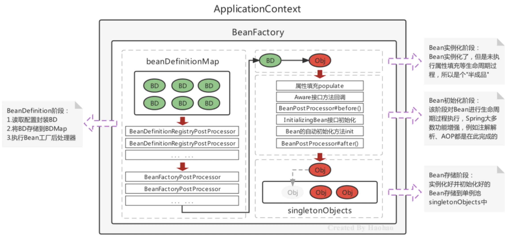

**1、Bean 的定义和实例化**
> 1. 加载 XML 配置文件 / 配置类，将每个 Bean 都封装为 BeanDefinition 对象；
> 2. 把所有 BeanDefinition 存储在 ApplicationContext.beanDefinitionMap 中；
> 3. 动态修改、注册 BeanDefinition： 
>     - 先执行 BeanDefinitionRegistryPostProcessor#postProcessBeanDefinitionRegistry；
>     - 再执行 BeanDefinitionRegistryPostProcessor#postProcessBeanFactory；
>     - 最后执行 BeanFactoryPostProcessor#postProcessBeanFactory；
> 4. 遍历 ApplicationContext.beanDefinitionMap，通过反射调用无参构造实例化所有普通的单例 Bean (原型 Bean、懒加载的 Bean、FactoryBean 在这一步并不会实例化)，此时的 Bean 只是半成品，没有初始化；

**2、Bean 的初始化**
> 1. 执行 populate 对 Bean 进行属性填充；
> 2. 如果 Bean 实现了 XxxAware 接口，则 Spring 会回调该接口方法，如 ApplicationContextAware，可以把 ApplicationContext 注入到 Bean 的属性；
> 3. 执行 BeanPostProcessor#postProcessBeforeInitialization；
> 4. Bean 初始化，执行 InitializingBean#afterPropertiesSet、Bean#init；
> 5. 执行 BeanPostProcessor#postProcessAfterInitialization；

**3、Bean 就绪**
> 1. 将所有 Bean 存储在 ApplicationContext.singletonObjects 单例池中；
> 2. Bean 就绪，执行 ApplicationContext#getBean 时，会从 singletonObjects 获取 Bean；
> 3. 当容器关闭时，调用 Bean#destroy；

#### 2.7.5、循环依赖
> [https://www.bilibili.com/video/BV1CP4y1c7pH?p=184&vd_source=04eaf9981148eb876b6cadd9b021971d](https://www.bilibili.com/video/BV1CP4y1c7pH?p=184&vd_source=04eaf9981148eb876b6cadd9b021971d)
>
> 面试：Spring 三级缓存分别是什么？什么是循环依赖？
>
> 注意：SpringBoot2.6 已经不支持解决循环依赖了，程序员自己不要写出循环依赖！

##### 2.7.5.1、单例 + setter 注入解决循环依赖
```java
public class DefaultSingletonBeanRegistry extends SimpleAliasRegistry implements SingletonBeanRegistry {
    // 一级缓存：单例池，存放【完整 Bean】
    private final Map<String, Object> singletonObjects = new ConcurrentHashMap(256);

    // 二级缓存：早期单例池
    private final Map<String, Object> earlySingletonObjects = new ConcurrentHashMap(16);

    // 三级缓存：单例工厂池
    private final Map<String, ObjectFactory<?>> singletonFactories = new HashMap(16);
}
```

**1、循环依赖**

```java
@Component
public class A {
    @Autowired
    private B b;
}

@Component
public class B {
    @Autowired
    private A a;
}
```

> 如下图：单例池为空；
> - a 初始化时，执行 a.setB()，要从单例池获取 b；
> - b 初始化时，执行 b.setA()，要从单例池获取 a；死锁！

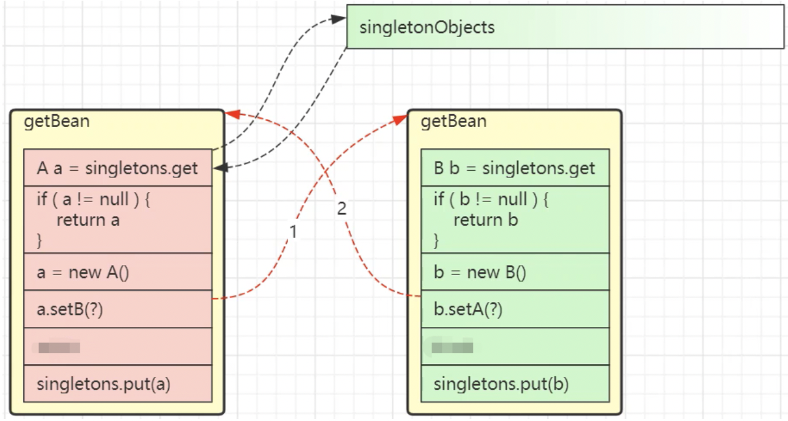

**2、两级缓存解决普通 Bean 的循环依赖**
> 如下图：单例池为空； 
> - a 实例化后，就把 a 放到 singletonFactories；a 初始化时，执行 a.setB()，从单例池获取 b 失败，从 singletonFactories 获取 b 也失败，暂停！
> - b 实例化后，就把 b 放到 singletonFactories；b 初始化时，执行 b.setA()，从单例池获取 a 失败，从 singletonFactories 获取 a 成功，b 初始化完成，将 b 从 singletonFactories 转移到单例池；
> - 继续初始化 a，从单例池获取 b 成功，a 初始化完成！

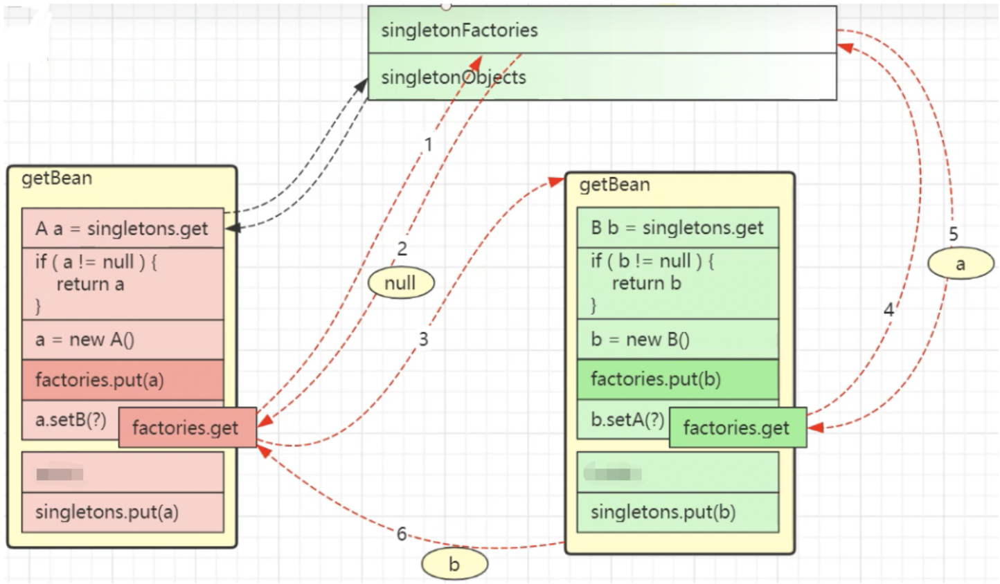

> 但是两级缓存解决不了 ProxyBean 的循环依赖：
> - b 初始化时，执行 b.setA()，从单例池获取 a 失败，从 singletonFactories 获取 a 成功；
> - 但是，此时获取的 a 是原对象，不是 a 的 ProxyBean！！！
>
> 问题原因：a 的代理对象创建的太晚了！于是引入三级缓存，对象实例化后，如果对象没有被 AOP 增强，就把对象放入 singletonFactories；如果被 AOP 增强，就提前创建 ProxyBean 并放入 singletonFactories！

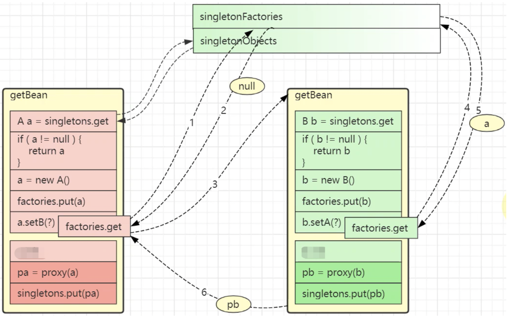

**3、三级缓存解决 ProxyBean 的循环依赖**
> 别看源码了，放弃吧，总结：
>
> 核心思想：将对象的实例化和初始化分开！提前暴露实例化但没初始化的对象！

```java
A、B 循环依赖，创建过程：
	1.实例化 A，把 A 放入三级缓存；
	2.初始化 A，发现需要 B；
	3.实例化 B，把 B 放入三级缓存；
	4.初始化 B，发现需要 A，
		- 到一级缓存找 A，没找到；
		- 到二级缓存找 A，没找到；
		- 到三级缓存找 A，找到了，把 A 从三级缓存移到二级缓存，B 初始化完成；
	5.B 初始化完毕，将自己放到一级缓存，此时 B 里面的 A 还是创建中状态；
	6.接着初始化 A，到一级缓存找 B，找到了，A 初始化完成，把自己从二级缓存移到一级缓存。
    
A、B 循环依赖，且 A 被 AOP 增强，创建过程：
	1.实例化 A，把 A 放入三级缓存；
	2.初始化 A，发现需要 B；
	3.实例化 B，把 B 放入三级缓存；
	4.初始化 B，发现需要 A，
		- 到一级缓存找 A，没找到；
		- 到二级缓存找 A，没找到；
		- 到三级缓存找 A，找到了，【把 A 从三级缓存删除，创建 A 的 ProxyBean 放到二级缓存】，B 初始化完成；
	5.B 初始化完毕，将自己放到一级缓存，此时 B 里面的 A 还是创建中状态；
	6.接着初始化 A，到一级缓存找 B，找到了，A 初始化完成，把自己从二级缓存移到一级缓存。
```

##### 2.7.5.2、单例 + 构造器注入解决循环依赖
```java
// 启动报错，循环依赖无法解决！
@Component
class A {
    private B b;

    public A(B b) {
        this.b = b;
    }
}

@Component
class B {
    private A a;

    public B(A a) {
        this.a = a;
    }
}
```

> 解决办法1：@Lazy  延迟 Bean 的实例化 
```java
@Component
public class A {
    private B b;

    // @Lazy 会生成 b 的 ProxyBean，所以实例化 a 时，注入的属性是 b 的 ProxyBean，而不是 b 本身
    // 只有当用到 a.b 时，才会把 b 本身替换回来，所以 a.b 不是 ProxyBean，而是 b 本身
    public A(@Lazy B b) {
        this.b = b;
    }
}

@Component
public class B {
    private A a;
    public B(A a) {
        this.a = a;
    }
}

@Test
void test() {
    A a = (A) applicationContext.getBean("a");
    B b = (B) applicationContext.getBean("b");
    System.out.println(a.getB());	// a.b 和 b 都是 b 的 ProxyBean
    System.out.println(b);
}
```

> 解决办法2：@Scope 生成 Bean 的代理对象 
```java
@Data
@Component
public class A {
    private B b;

    public A(B b) {
        this.b = b;
    }
}

@Scope(proxyMode = ScopedProxyMode.TARGET_CLASS)	// 用 Cglib 生成 B 的代理
@Component
public class B {
    private A a;

    public B(A a) {
        this.a = a;
    }
}

@Test
void test() {
    A a = (A) applicationContext.getBean("a");
    B b = (B) applicationContext.getBean("b");
    System.out.println(a.getB());	// a.b 和 b 都是 b 的 ProxyBean
    System.out.println(b);
}
```

> 解决办法3：用 ObjectFactory，通过工厂方式延迟 Bean 的实例化
>
> 推荐这种方法，因为不用创建 ProxyBean，性能高！

```java
@Data
@Component
public class A {
    private ObjectFactory<B> b;		// 用 ObjectFactory 的子接口 ObjectProvider 也可以

    public A(ObjectFactory<B> b) {
        this.b = b;
    }
}

@Component
public class B {
    private A a;
    public B(A a) {
        this.a = a;
    }
}

@Test
void test() {
    A a = (A) applicationContext.getBean("a");
    B b = (B) applicationContext.getBean("b");
    System.out.println(a.getB().getObject());	// com.njj.algorithm.entity.B@2a02e34b
    System.out.println(b);						// com.njj.algorithm.entity.B@2a02e34b
}
```

##### 2.7.5.3、原型模式
> - 一个原型 Bean + 一个单例 Bean，和 "单例 + 构造器注入解决循环依赖" 一样，可以解决！
> - 两个原型 Bean 相互依赖，无法解决，因为构造器注入会导致对象的实例化和初始化没有分离开！

### 2.8、容器刷新的 12 步 ⭐
```java
public class AnnotationConfigApplicationContext extends ... {

    public AnnotationConfigApplicationContext(Class<?>... componentClasses) {
        this();
        register(componentClasses);
        refresh();    // 调用父类的 refresh
    }
}
```

```java
public abstract class AbstractApplicationContext extends ... {

    private ConfigurableEnvironment environment;

    @Override
    public void refresh() throws BeansException, IllegalStateException {
        synchronized (this.startupShutdownMonitor) {
            StartupStep contextRefresh = this.applicationStartup.start("spring.context.refresh");

            // 1.准备刷新
            // 创建 Environment 对象：读取系统属性、系统环境变量、自定义属性(properties 文件)
            prepareRefresh();

            // 2.创建 beanFactory
            ConfigurableListableBeanFactory beanFactory = obtainFreshBeanFactory();

            // 3.准备 beanFactory，给 beanFactory 初始化一些属性：
            //   StandardBeanExpressionResolver：SpEL 解析器；
            //	 ResourceEditorRegistrar：注册类型转换器，解析 ${}；
            //	 通过 beanFactory.registerResolvableDependency 注册一些特殊的 Bean，如 BeanFactory、ApplicationContext 等；；
            // 	 注册一些 Bean 的后置处理器，如 ApplicationContextAwareProcessor 等；
            prepareBeanFactory(beanFactory);

            try {
                // 模板设计模式
                // 4.beanFactory 的后置处理，实现为空，留给子类实现，子类扩展 beanFactory
                //   比如 Web 环境下要给 beanFactory 添加 request、session scope 等；
                postProcessBeanFactory(beanFactory);
                
                StartupStep beanPostProcess = this.applicationStartup.start("spring.context.beans.post-process");
                
                // 5.执行所有 BeanFactoryPostProcessor (可以添加、修改 BeanDefinition)
                invokeBeanFactoryPostProcessors(beanFactory);

                /*
                	6.注册 BeanPostProcessor，如：
                		AutowiredAnnotationBeanPostProcessor：解析 @Autowired、@Value
                		CommonAnnotationBeanPostProcessor：解析 @Resource、@PostConstruct、@PreDestory 
                    	AnnotationAwareAspectJAutoProxyCreator：解析切面注解，创建代理对象注册到容器
                */
                registerBeanPostProcessors(beanFactory);
                beanPostProcess.end();

                // 7.初始化国际化组件：如果容器中有，就不注册；如果没有，就注册一个默认的
                initMessageSource();

                // 8.初始化事件广播器：如果容器中有，就不注册；如果没有，就注册一个默认的
                //   发布事件：Application.publishEvent(事件对象)
                initApplicationEventMulticaster();

                // 9.初始化一些特殊的 Bean
                //   模板设计模式，实现为空，留给子类实现，如 SpringBoot 在这里初始化了 Web 容器 (Tomcat)
                onRefresh();

                // 10.注册事件监听器
                //    接收事件：ApplicationListener.onApplicationEvent(事件对象)
                registerListeners();

                // 11.实例化所有非懒加载的单例 Bean (会执行所有 BeanPostProcessor)
                finishBeanFactoryInitialization(beanFactory);

                // 12.发送容器创建完成的事件
                finishRefresh();
            }
            // ......
        }
    }
}
```

## 4、配置 Bean (基于注解)
### 4.1、注册 Bean
```xml
<bean id="" name="" class="" scope="" lazy-init="" init-method="" destroy-method="" autowire=""/>
```

| XML 配置                    | 注解配置 |
|---------------------------| --- |
| \<bean id="" class="">    | @Component = @Controller = @Service = @Repository |
| \<bean scope="">          | @Scope |
| \<bean lazy-init="">      | @Lazy |
| \<bean init-method="">    | @PostConstruct，构造器执行并对属性赋值之后执行 |
| \<bean destroy-method=""> | @PreDestroy |

#### 4.1.1、@ComponentScan + @Component
```java
@Target({ElementType.TYPE})
@Retention(RetentionPolicy.RUNTIME)
@Documented
@Indexed
public @interface Component {
    String value() default "";    // Bean 的 id，默认为类名首字母小写
}
```

```java
// basePackages：配置要扫描的包名，若不配置：扫描当前 @componentScan 注解配置类所在包及其子包下的所有类
@ComponentScan(basePackages = {"com.njj.service", "com.njj.dao"})
public class MyConfig {
}

// excludeFilters：排除规则，如排除标了 @Controller、@Service 的类
@ComponentScan(basePackages = "com.njj",
        excludeFilters = {@ComponentScan.Filter(type = FilterType.ANNOTATION,
                                                       classes = {Controller.class, Service.class})}
)

// includeFilters 包含规则，如只扫描标了 @Controller、@Service 的类
// 若使用 includeFilters，必须配 useDefaultFilters = false，因为默认扫描全部，把它关掉，只扫描自己配的！
@ComponentScan(basePackages = "com.njj", useDefaultFilters = false,
        includeFilters = {@ComponentScan.Filter(type = FilterType.ANNOTATION,
                                                classes = {Controller.class, Service.class})}
)
```

```java
@SpringBootApplication(scanBasePackages = {"com.njj.service", "com.njj.dao"}, 
                       exclude = {com.njj.config.MyConfig.class, MongoAutoConfiguration.class})
public class DemoApplication {
    public static void main(String[] args) {
        SpringApplication.run(Demo1Application.class, args);
    }
}
```

#### 4.1.2、@Configuration  + @Bean
> 用于将第三方类注册成 Bean！
>
> 但第三方 jar 包提供的类，我们没法给其加上 @Component，可以用 @Bean 将其加入容器！ 

```java
@Configuration    // 表示当前类是一个配置类，代替 XML 文件
public class MyConfig {

    @Bean
    public Object object1() {    // 向容器注册 Bean，类型为 Object、id 为 object1
        return new Object();
    }

    @Bean("Object22")
    public Object object2() {    // 向容器注册 Bean，类型为 Object、id 为 object22
        return new Object();
    }

    // 当需要提供参数时，还可以结合注入注解：

    @Bean
    @Autowired    				 // 将会从容器中找 UserDao 赋给参数，@Autowired 可以省略不写！
    public Object object3(UserDao userDao) {
        System.out.println(userDao);
        return new Object();
    }

    @Bean						 // @Autowired 可以省略，还可以用 @Qualifier、@Value
    public Object object4(@Qualifier("userDao") UserDao userDao, 
                          @Value("${jdbc.username}") String username){
        System.out.println(userDao);
        System.out.println(username);
        return new Object();
    }

    // 注意：
    @Bean
    public Object object5() {
        Object o1 = object1();    // 虽然调的是方法，但 o1 是从容器中拿的，而不是重新创建 (单例)！！！
        return new Object();
    }
}
```

```java
// ApplicationContext：
public static void main(String[] args) {
    // 用配置类代替 XML 配置文件，
    // 就不要用 ClassPathxmlApplicationContext，用 AnnotationConfigApplicationContext
    // ApplicationContext applicationContext = new ClassPathxmlApplicationContext("beans.xml");
    ApplicationContext applicationContext = new AnnotationConfigApplicationContext(MyConfig.class);
    UserService userService = (UserService) applicationContext.getBean("userService");
}
```

#### 4.1.3、@Import
```java
@Target(ElementType.TYPE)
@Retention(RetentionPolicy.RUNTIME)
@Documented
public @interface Import {

	/**
	 * {@link Configuration @Configuration}, regular component classes to import,
	 * {@link ImportSelector} or {@link ImportBeanDefinitionRegistrar}
	 * value 可以配配置类、直接配一个要注册的类、ImportSelector 或 ImportBeanDefinitionRegistrar
	 */
	Class<?>[] value();
}
```

**1、导入配置类、直接写要注册的类**
```java
@Configuration
@Import(OtherConfig.class)    // 将其他配置类的组件注册到当前配置类
public class MyConfig {
    @Bean
    public Object object1() {
        return new Object();
    }
}

public class OtherConfig {
    @Bean
    public Object object2() {
        return new Object();
    }
}
```
```java
@Configuration
// 向容器中注册 UserServiceImpl、UserDaoImpl (使用无参构造)，Bean.id 默认为类的全限定名
@Import(value = {UserServiceImpl.class, UserDaoImpl.class})
public class MyConfig {
}
```

**2、ImportSelector**
```java
@Configuration
@Import(value = {MyImportSelector.class})
public class MyConfig {
}
```
```java
public class MyImportSelector implements ImportSelector {

    // importingClassMetadata：@Import 所在类的所有注解信息
    @Override
    public String[] selectImports(AnnotationMetadata importingClassMetadata) {
        // 向容器中批量注册组件，Bean.id 默认为类的全限定名
        return new String[]{"com.njj.service.impl.UserServiceImpl", "com.njj.dao.impl.UserDaoImpl"};
    }
}
```

**3、ImportBeanDefinitionRegistrar**
```java
public class MyImportBeanDefinitionRegistrar implements ImportBeanDefinitionRegistrar {
    
    // AnnotationMetadata：@Import 所在类的所有注解信息
    // BeanDefinitionRegistry：BeanDefinition 注册器 
    @Override
    public void registerBeanDefinitions(AnnotationMetadata importingClassMetadata, 
                                        BeanDefinitionRegistry registry) {
        // 如果容器中有 UserDaoImpl，就向容器中注册 UserServiceImpl
        if (registry.containsBeanDefinition("com.njj.dao.impl.UserDaoImpl")) {
            RootBeanDefinition beanDefinition = new RootBeanDefinition(UserServiceImpl.class);
            registry.registerBeanDefinition("com.njj.service.impl.UserServiceImpl", beanDefinition);
        }
    }
}
```

#### 4.1.4、@Bean + FactoryBean 
```java
@Configuration
public class MyConfig {
    @Bean
    public UserDaoFactoryBean userDaoFactoryBean() { // UserDaoFactoryBean 和 UserDaoImpl 都会被注册到容器中
        return new UserDaoFactoryBean();
    }
}
```
```java
public class UserDaoFactoryBean implements FactoryBean<UserDao> {

    @Override
    public UserDao getObject() throws Exception {
        return new UserDaoImpl();
    }

    @Override
    public Class<?> getObjectType() {
        return UserDao.class;
    }

    @Override
    public boolean isSingleton() {
        return true;
    }
}
```
```java
@Test
void test() {
    AnnotationConfigApplicationContext context = new AnnotationConfigApplicationContext(MyConfig.class);
    System.out.println(context.getBean("userDaoFactoryBean").getClass());     // UserDaoImpl
    System.out.println(context.getBean("&userDaoFactoryBean").getClass());    // UserDaoFactoryBean
}
```

### 4.2、条件注册 @Conditional
```java
@Configuration
public class MyConfig {
    
    @Bean
    @Conditional(value = {MyCondition.class})
    public Object object1() {
        return new Object();
    }
}
```
```java
public class MyCondition implements Condition {

    /*
        返回 true 则注册，返回 false 则不注册
        ConditionContext：上下文信息
        AnnotatedTypeMetadata：注解信息
        ConditionContext 和 AnnotatedTypeMetadata 提供了一系列 getter 供我们使用，
        我们可以用这些 getter 来判断，如：
     */
    public boolean matches(ConditionContext context, AnnotatedTypeMetadata metadata) {
        ConfigurableListableBeanFactory beanFactory = context.getBeanFactory();
        return beanFactory.containsBean("userService");
    }
}
```

### 4.3、自动装配 ⭐
> 若要自动装配 static 变量，字段注入不起效果，要用构造器注入或 set 注入 (setter 不能是 static 的)！
>
> 依赖注入的三种方式：属性注入、setter 注入、构造器注入；

#### 4.3.1、@Value()
> - 只能注入字面量属性；
> - 可以配基本数值，如 @Value("张三")；
> - 可以写 SpEL，如 @Value("#{5-2}")；
> - 可以取配置文件的属性，如 @Value("${jdbc.username}")；
> - 可以配置默认值，如 @Value("${jdbc.username:root}")；

#### 4.3.2、@Autowired、@Qualifier
> - @Autowired(required = true)：byType 装配；  
> - 若容器中有多个类型相同的 Bean，可用 @Qualifier(value=" ") byName 装配； 

```java
public @interface Autowired {
    boolean required() default true;    // true：容器中找不到 Bean，则装配失败，报错；false 则不报错，赋为 null
}

public @interface Qualifier {
    String value() default "";
}
```

```java
@Service
public class UserServiceImpl implements UserService {
    @Autowired
    private UserDao userDao;
}
```

```java
@Service
public class UserServiceImpl implements UserService {

    private UserDao userDao;

    // 会自动从容器中找 UserDao，赋给参数
    // 等价于 public void setUserDao(@Autowired UserDao userDao)
    @Autowired
    public void setUserDao(UserDao userDao) {
        this.userDao = userDao;
    }
}
```

```java
@Service
public class UserServiceImpl implements UserService {

    private UserDao userDao;

    // Spring 默认用无参构造器创建 Bean，再用 setter 赋值
    // 若用有参构造器创建 Bean，则会自动从容器中找 UserDao，赋给参数
    // 等价于 public UserServiceImpl(@Autowired UserDao userDao)
    // 注意：若只有一个有参构造，则 @Autowired 可以省略！
    @Autowired
    public UserServiceImpl(UserDao userDao) {
        this.userDao = userDao;
    }
}
```

#### 4.3.3、@Primary
> @Primary：与 @Component 和 @Bean 一起使用，提高 Bean 的优先级； 
>
> 如下：若不标 @Primary，则启动报错，因为 @Autowired 找到两个同类型的 UserDao； 
>
>          标上后不报错，优先使用 UserDaoImpl1；

```java
@Repository
@Primary
public class UserDaoImpl1 implements UserDao {
}

@Repository
public class UserDaoImpl2 implements UserDao {
}

@Service
public class UserServiceImpl {
    @Autowired
    private UserDao userDao;
}
```

#### 4.3.4、@Resource
> 面试：@Autowire 和 @Resource 的区别？
> - @Autowire 是 Spring 注解，只能用在 Spring 框架中，@Resource 是 JSR250 规范，可以用在任何框架中； 
> - @Autowire byType 装配，可用配合 @Qualifier byName 装配；@Resource 默认 byName，找不到再 byType，而且可以通过 name、type 属性指定装配方式； 
> - @Autowire 支持 required 属性，@Resource 不支持； 

```java
@Service
public class UserServiceImpl implements UserService {

    @Resource(name = "userDaoImpl")      // 指定 byName
    private UserDao userDao;

    @Resource(type = PersonDao.class)    // 指定 byType
    private PersonDao personDao;
}
```

> @Resource：JSR-250 规范，属于 JDK 扩展包，不在 JDK 中，jdk8 可直接使用，若版本低于 jdk8 或高于 jdk11，必须引入依赖：
```xml
<dependency>
    <groupId>jakarta.annotation</groupId>
    <artifactId>jakarta.annotation-api</artifactId>
    <version>2.1.1</version>
</dependency>
```

#### 4.3.5、@Inject
> JSR330 规范，需要导包：javax.inject，功能和 @Autowire 一样 

```java
public @interface Inject {
}
```

#### 4.3.6、Aware 接口
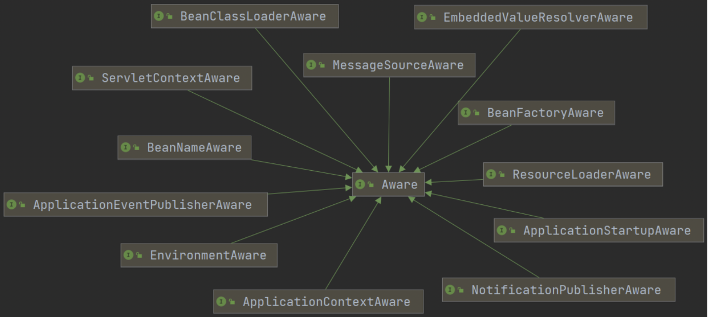

```java
public interface Aware {    // Aware 是一个接口，有很多子接口，如：
}

public interface ApplicationContextAware extends Aware {
	void setApplicationContext(ApplicationContext applicationContext) throws BeansException;
}
```

> 自定义组件若想使用 Spring 容器底层的一些组件 (如 ApplicationContext、BeanFactory 等)，则可以实现 XxxAware 接口！
>
> XxxAware 的功能是通过 XxxAwareProcesser 实现的，XxxAwareProcesser 继承了 BeanPostProcesser！

```java
@Service
public class UserServiceImpl implements UserService, ApplicationContextAware {

    @Autowired
    private UserDao userDao;

    private ApplicationContext applicationContext;

    // UserServiceImpl 注册成 Bean 时，Spring 会自动回调 ApplicationContextAware#setApplicationContext
    // 这样在 UserServiceImpl 内部就可以使用 Spring 容器 ApplicationContext 了
    // 其实直接 @Autowired ApplicationContext 也可以拿到 IOC 容器
    @Override
    public void setApplicationContext(ApplicationContext applicationContext) throws BeansException {
        this.applicationContext = applicationContext;
    }
}
```

### 4.4、读取外部配置文件
#### 4.4.1、@PropertySource
> @PropertySource 读取外部配置文件，将其以 k-v 形式保存到容器中！ 
```properties
jdbc.username=root
jdbc.password=123456
```
```java
@Data
@Component
public class MyDataSource {
    
    @Value("${jdbc.username}")
    private String username;
    
    @Value("${jdbc.password}")
    private String password;
}
```
```java
@ComponentScan(basePackages = "com.njj")
// 若不加该注解，jdbc.properties 就不会保存到容器中，@Value("${}") 就取不到 properties 文件的值！
@PropertySource(value = {"classpath:/jdbc.properties"})  
@Configuration
public class MyConfig {
}
```
```java
@Test
void test() {
    AnnotationConfigApplicationContext context = new AnnotationConfigApplicationContext(MyConfig.class);
    ConfigurableEnvironment environment = context.getEnvironment();
    System.out.println(environment.getProperty("jdbc.username"));   // root
    System.out.println(context.getBean(MyDataSource.class));        // MyDataSource(username=root, password=123456)
}
```

#### 4.4.2、@ImportResource({"classpath:beans.xml"})
```java
@SpringBootApplication
@ImportResource({"classpath:beans.xml"})
public class DemoApplication {
    public static void main(String[] args) {
        ConfigurableApplicationContext context = SpringApplication.run(DemoApplication.class);
    }
}
```

### 4.5、多环境 @Profile
```java
@Profile({"pre", "prd"})
@Service
public class UserServiceImpl {
}
```

# 三、AOP
> 概念：使用动态代理，在运行期间对目标对象的方法进行增强；

## 1、AOP 原理 - 动态代理
> - 编译器织入：静态代理；
> - 运行期织入：动态代理；
>
> Spring、SpringBoot 默认使用 JDK 动态代理，当目标类没有实现接口时，则使用 CGlib 动态代理；
>
> 问题：代理类怎么知道目标类有哪些方法？通过接口或父类实现：
> - JDK 动态代理：目标类必须实现一个接口，JDK 动态代理会根据这个接口创建代理类，即：目标类和代理类都实现同一个接口！
> - CGlib 动态代理：以目标类为父类创建代理类，即：代理类是目标类的子类！
>
> 代码示例：详见 "设计模式.md"
>
> 原理：默认情况下 Spring 容器内的 Bean 都是原对象，当这个 Bean 被配了 **AOP 增强**后，容器内放的不是原 Bean，而是 ProxyBean！动态代理是通过 AbstractAutoProxyCreator 实现的，重写了 BeanPostProcessor#after，在 after 方法中会用动态代理生成 ProxyBean，并将 ProxyBean 注入到容器！

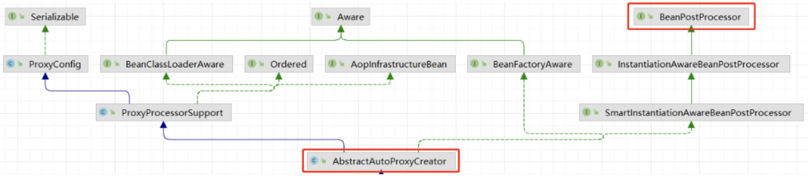

```java
public abstract class AbstractAutoProxyCreator extends ProxyProcessorSupport implements 
    SmartInstantiationAwareBeanPostProcessor, BeanFactoryAware {

    public Object postProcessAfterInitialization(@Nullable Object bean, String beanName) {
        if (bean != null) {
            Object cacheKey = this.getCacheKey(bean.getClass(), beanName);
            if (this.earlyProxyReferences.remove(cacheKey) != bean) {
                return this.wrapIfNecessary(bean, beanName, cacheKey);    // 为 bean 创建代理类并注册到容器
            }
        }
        return bean;
    }

    protected Object wrapIfNecessary(Object bean, String beanName, Object cacheKey) {
        // ......
        // 如果 bean 配了通知，调用 JDK / Cglib 动态代理
        Object proxy = this.createProxy(bean.getClass(), beanName, specificInterceptors, new SingletonTargetSource(bean));
        return proxy;
    }
}
```

## 2、AOP 术语
| 概念 | 单词 | 描述 |
| --- | --- | --- |
| 连接点 | JoinPoint | 目标对象可以被增强的方法 |
| 切入点 | PointCut | 目标对象实际被增强的方法 |
| 通知 | Advice | 增强逻辑：前置通知、返回通知、后置通知、finally 环绕通知、异常通知 |
| 切面 | Aspect | 通知和切入点的组合 |


## 3、AOP 使用
### 3.1、AspectJ
> AOP 是思想，AspectJ 是 AOP 的一种实现方式；
>
> AspectJ 不属于 Spring，是一个独立的 AOP 框架，但后来 Spring 把 AspectJ 整合进来了，使用 AspectJ 做 AOP；

### 3.2、切入点表达式
> 切入点表达式：指定要被增强的方法；
>
> 语法：execution ( [权限修饰符] [返回类型] [类全路径] [方法名称]（[参数列表]) )；
> - 权限修饰符可以省略不写；
> - .. 表示当前包及其子包；
> - 参数列表可用 .. 表示任意参数；

```java
execution(* com.njj.dao.BookDao.add(..)) 
execution(* com.njj.dao.BookDao.* (..)) 
execution(* com.njj.dao.*.* (..))
```

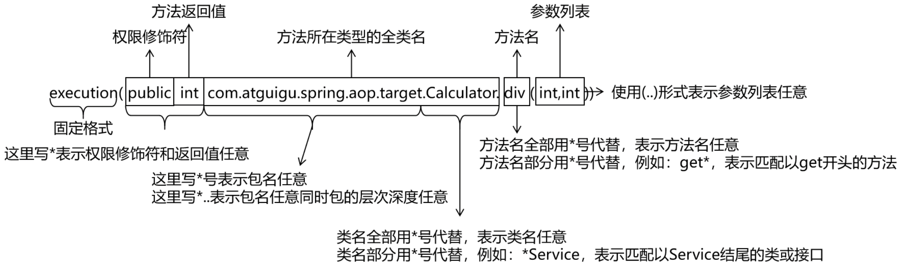

### 3.3、AOP 操作 (基于注解)
```xml
<dependency>
    <groupId>org.springframework.boot</groupId>
    <artifactId>spring-boot-starter-aop</artifactId>
</dependency>
```

```java
@Component	// 必须注册进容器
public class User {
    public void add() {
        System.out.println("add()方法");
    }
}
```

```java
// 若非 SpringBoot 项目，需要加：
// @ComponentScan(basePackages = {"com.njj"})	    // 扫描增强类
// @EnableAspectJAutoProxy(proxyTargetClass = true)	// 开启 aspectJ，不然 @Aspect 不生效
// @Aspect	                                        // 标注为切面，供 Spring 扫描
// @Component	                                    // 必须注册进容器

// 若是 SpringBoot 项目，已经自动开启了 @EnableAspectJAutoProxy(proxyTargetClass = true)，用以下两个注解即可：
@Aspect
@Component
public class UserAspect { 

    // 1.前置通知
    @Before(value = "execution(* com.njj.aop.User.add(..))")
    public void before() {
        System.out.println("========前置通知========"); 
    } 

    // 2.返回通知
    @AfterReturning(value = "execution(* com.njj.aop.User.add(..))", returning = "result")
    public void afterReturning(Object result) {    // result：目标方法返回结果
        System.out.println("========返回通知========"); 
    }

    // 3.后置通知
    @After(value = "execution(* com.njj.aop.User.add(..))")
    public void after() {
        System.out.println("========后置通知========"); 
    }

    // 4.环绕通知
    @Around(value = "execution(* com.njj.aop.User.add(..))")
    public Object around(ProceedingJoinPoint joinPoint) throws Throwable {
        System.out.println("========环绕之前========"); 
        Object result = joinPoint.proceed();	// 执行被增强的方法
        Object[] args = joinPoint.getArgs();	// 获取被增强方法的实参列表
        System.out.println("========环绕之后========"); 
        return result;	  						// 若环绕通知的方法为 void，则被增强方法的返回值丢失
    }

    // 5.异常通知
    @AfterThrowing(value = "execution(* com.njj.aop.User.add(..))", throwing = "e")
    public void afterThrowing(Throwable e) {
        System.out.println("========异常通知========"); 
    }
}
/**
    AOP 面试：
    Spring5：后置通知相当于 finally 块

        1.程序正常执行：
            1.环绕通知之前
            2.前置通知
            3.目标方法执行
            4.返回通知
            5.后置通知
            6.环绕通知之后

        2.程序异常执行：
            1.环绕通知之前
            2.前置通知
            3.目标方法执行
            4.异常通知
            5.后置通知
*/
```

> 通知方法可加参数：

| 参数 | 作用 |
| --- | --- |
| JoinPoint | 连接点对象，5 个通知都可使用，包含目标对象、目标方法参数等信息，一定要放在第一个参数位置！ |
| ProceedingJoinPoint | JoinPoint 的子类，只能用在环绕通知 |
| Throwable | 异常对象，只能用在异常通知，需要在注解上配置异常对象名称 |
| Object | 目标方法的返回值 |


```java
@Pointcut(value = "execution(* com.njj.aop.User.add(..))")
public void myPointcut() {}

// 使用公共切入点表达式
@Before(value = "myPointcut()")
public void before() {
    System.out.println("========前置通知========"); 
}
```

```java
@Aspect
@Component
@Order(1)	// 值越小优先级越高，默认 Integer.MAX_VALUE
public class UserProxy {}
```

# 四、本地事务
> 面试：Spring 事务的原理？
>
> 答：Spring 支持两种事务，编程式 + 声明式；编程式事务需要我们手动的开启、提交、回滚事务，声明式事务只需要标 @Transactional 注解！该注解的原理是 AOP，Spring 会将创建类的代理对象，调用事务方法时，Spring 会自动开启、提交、回滚事务！ 

## 1、编程式 VS 声明式
```java
try {
    // 1.开启事务
    // 2.进行业务操作
    // 3.没有发生异常，提交事务
} catch(Exception e) {
    // 4.出现异常，事务回滚
}
```

## 2、Spring 事务管理介绍
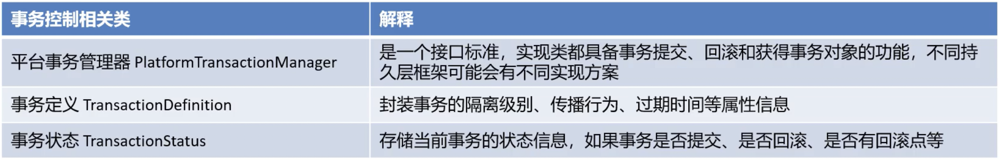

## 3、声明式事务配置 (基于注解)
```java
@Transactional    // 可添加在类上或方法上
```

**1、propagation：事务传播行为** (当方法 funcA 调用 funcB 时，funcA 的事务就传播给了 funcB)

```java
@Service
public class AServiceImpl implements AService {
    
    @Autowrie
    private BService bService;
    
    @Transactional
    public void funcA() {
        bService.funcB();
    }
}

@Service
public class BServiceImpl implements BService {
    @Transactional
    public void funcB() {}
}
```

| 传播行为 | 解释 |
| --- | --- |
| REQUIRED (默认) | funcA 有事务时，funcB 用 funcA 的事务；funcA 没有事务时，funcB 新建事务 (有就加入，没有就新建) |
| SUPPORTS | funcA 有事务时，funcB 用 funcA 的事务；funcA 没有事务时，funcB 以非事务方式执行 (有就加入，没有就不管了) |
| MANDATORY | funcA 有事务时，funcB 用 funcA 的事务；funcA 没有事务时，funcB 抛异常 (有就加入，没有就抛异常) |
| REQUIRES_NEW | 不管 funcA 有没有事务，funcB 都新建一个事务，且 funcB 的事务和 funcA 的事务互不影响！ |
| NOT_SUPPORTED | funcB 以非事务方式执行 |
| NEVER | funcB 以非事务方式执行，如果 funcA 有事务，funcB 抛异常 |
| NESTED | funcA 没有事务时，和 REQUIRED 一样；funcA 有事务时，funcB 新建一个子事务，形成嵌套事务：子事务不影响主事务，但主事务回滚会导致子事务回滚！ |


**2、ioslation：事务隔离级别**
> 例：@Transactional(ioslation= Ioslation.REPEATABLE_READ) 	**// Mysql 默认的隔离级别：可重复读 REPEATABLE READ**
>
> 注意：开发时常使用 "读已提交"、"可重复读"。

**3、timeout：事务超时时间**
> - 事务需要在一定的时间内提交，超时则回滚。
> - 默认值为 -1 ，单位为秒。例：@Transactional(timeout = 5) 

**4、readOnly：是否只读**
> - 默认值为 false，表示增删改查操作都可以进行；
> - 设置为 true 时，只能进行查询操作，否则报错；
>
> 只读事务的作用：
> - 当方法中多次查库时，建议用只读事务，可以保证多条查询语句的可重复读！
> - MySQL 对只读事务做了优化，效率会高一些；

**5、rollbackFor：出现哪些异常时回滚**

**6、noRollbackFor：出现哪些异常时不回滚**

```java
// Spring 项目需要配置以下，但 SpringBoot 不用配
@Configuration
@ComponentScan(basePackages = "com.njj")
@EnableTransactionManagement    // 开启事务
public class TxConfig {

    // 创建数据库连接池
    @Bean
    public DataSource dataSource() {
        DataSource dataSource = new DataSource();
        dataSource.setDriverClassName("com.mysql.jdbc.Driver");
        dataSource.setUrl("jdbc:mysql:///user_db");
        dataSource.setUsername("root");
        dataSource.setPassword("root");
        return dataSource;
    }

    // 创建 SqlSessionFactoryBean
    @Bean
    public SqlSessionFactoryBean sqlSessionFactoryBean(DataSource dataSource) {
        SqlSessionFactoryBean sqlSessionFactoryBean = new SqlSessionFactoryBean();
        sqlSessionFactoryBean.setDataSource(dataSource);
        return sqlSessionFactoryBean;
    }

    // 创建事务管理器
    @Bean
    public DataSourceTransactionManager transactionManager(DataSource dataSource) {
        DataSourceTransactionManager transactionManager = new DataSourceTransactionManager();
        transactionManager.setDataSource(dataSource);
        return transactionManager;
    }
}
```

## 4、事务失效的场景
**1、回滚异常不匹配**
```java
// 默认只回滚 RuntimeException 及其子类 (Error 也会回滚)，检查异常就不会回滚，建议配成 Exception
@Transactional(rollbackFor = RuntimeException.class)
```

**2、自己用 try-catch 把异常吞了**
```java
@Transactional
public void update() {
    try {

    } catch (Exception e) {
        log.error(e);
        // throw new RuntimeException();	// 解决办法1：手动抛异常 
        // rollbackTransactionInterceptor.currentTransactionStatus()
        // 		     .setRollbackOnly();    // 解决办法2：手动 rollback
    }
}
```

```java
// 注意：先执行事务切面，再执行自定义切面；在自定义切面内把异常吞了，事务就捕捉不到异常了！

@Aspect
// 解决办法3：事务切面和自定义切面的优先级一样，都是最低的 Integer.MAX_VALUE，
// 只需要让自定义切面的优先级比事务切面高即可
@Order(Integer.MAX_VALUE - 1)	
class MyAspect {

    @Around("execution(* update(..))")
    public Object around(ProceedingJoinPoint joinPoint) {
        log.info("我是切面");
        Object result = null;
        try {
            result = joinPoint.proceed();
        } catch (Throwable e) {
            log.error(e);
            // throw new RuntimeException();	// 解决办法1：手动抛异常 
            // rollbackTransactionInterceptor.currentTransactionStatus()
            // 		     .setRollbackOnly();    // 解决办法2：手动 rollback
        }
        return result;
    }
}
```

**3、方法非 public**
> Spring 只对 public 方法 AOP 增强！！！

**4、本类事务方法互调导致传播失效**
```java
@Service
public class AServiceImpl implements AService {

    @Transactional
    public void a() {
        b();   // 此时 a() 的事务存在，但 b() 的事务失效！因为此处是 this.b()，调的是原对象的方法，而不是代理对象的
    }

    @Transactional(propagation = Propagation.REQUIRES_NEW)
    public void b() {}
}
```
```java
@Service
public class AServiceImpl implements AService {

    @Autowired
    private AService aService;    // 解决办法1：自己注入自己 (不会发生循环依赖)

    @Transactional
    public void a() {
        aService.b();    		  // 用代理对象调
    }

    @Transactional(propagation = Propagation.REQUIRES_NEW)
    public void b() {
    }
}
```
```java
@Service
public class AServiceImpl implements AService {

    @Transactional
    public void a() {
        ((AServiceImpl) AopContext.currentProxy()).b();    // 解决办法2：用 AopContext 获取代理对象
    }													   // 解决办法3：两个事务方法写在不同的类中

    @Transactional(propagation = Propagation.REQUIRES_NEW)
    public void b() {
    }
}
```

**5、多线程导致事务失效**
> 子线程抛异常，主线程的事务并不会回滚！

**6、事务注解导致锁失效**
```java
@Service
public class AServiceImpl implements AService {

    // 注意：这里锁的是目标对象的方法，而不是 ProxyBean 的方法！！！
    // 		先执行事务切面的 try，再执行 a()，最后再执行事务切面的 finally 并 commit
    // 		因此这里的锁会在事务提交前就释放掉！！！
    @Transactional
    public synchronized void a() {
    }
}
```

# 五、Spring5 新功能
> Spring5 基于 Java8，运行时兼容 JDK9，许多不建议使用的类和方法在代码库中已经删除。

## 1、整合日志框架
> - Spring5 自带了通用的日志封装。
> - Spring5 已经移除 Log4jConfigListener，不能使用 Log4j，官方建议使用 Log4j2。

1. 引入 jar 包
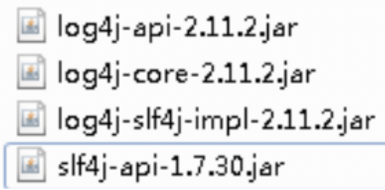

2. 创建 log4j2.xml（文件名和内容都固定） 

```xml
<?xml version="1.0" encoding="UTF-8"?>
<!--status：日志级别，优先级: OFF > FATAL > ERROR > WARN > INFO > DEBUG > TRACE > ALL（ALL显示内容最多）-->
<configuration status="INFO">
    <!--先定义所有的 appender-->
    <appenders>
        <!--输出日志信息到控制台-->
        <console name="Console" target="SYSTEM_OUT">
            <!--控制日志输出的格式-->
            <PatternLayout pattern="%d{yyyy-MM-dd HH:mm:ss.SSS} [%t] %-5level %logger{36} - %msg%n"/>
        </console>
    </appenders>
    <!--然后定义 logger，只有定义 logger 并引入的 appender，appender 才会生效-->
    <!--root：用于指定项目的根日志，如果没有单独指定 Logger，则会使用 root 作为默认的日志输出-->
    <loggers>
        <root level="info">
            <appender-ref ref="Console"/>
        </root>
    </loggers>
</configuration>
```

3. 打印日志： 

```java
public class User{
    
    private static final Logger logger = LoggerFactory.getLogger(User.class);
    
    public static void main(String [] args){
        logger.info("666");
        logger.warn("777");
    }
}
```

## 2、@Nullable 注解 
> @Nullable 可用在方法上、属性上、参数上，表示方法返回可以为空，属性值可以为空，参数值可以为空。 

## 3、函数式注册对象
> 支持函数式风格 GenericApplicationContext

```java
@Test
public void testGenericApplicationContext() {
    // 1.创建 GenericApplicationContext 对象
    GenericApplicationContext context = new GenericApplicationContext();
    // 2.调用 context 的方法注册对象
    context.refresh();
    context.registerBean("user1", User.class, () -> new User());
    // 3.获取注册的对象
    User user = (User)context.getBean("user1");
    System.out.println(user);
}
```

## 4、整合 JUnit5
> Spring 测试时每个 @Test 方法都要 new 容器然后 getBean()，太麻烦；而且在测试类中不能注入 UserService 等。 

**1、整合 JUnit4**
> 引入依赖：

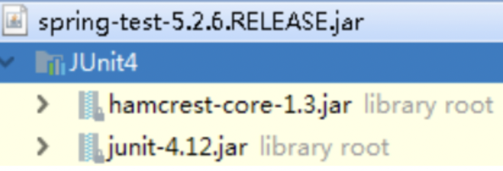

> 创建测试类，使用注解方式完成： 

```java
@RunWith(SpringJUnit4ClassRunner.class) 	  // 单元测试框架 
@ContextConfiguration("classpath:bean1.xml")  // 加载配置文件
public class JTest4 {
    
    @Autowired
    private UserService userService;
    
    @Test
    public void test1() {
        userService.accountMoney();
    }
}
```

**2、整合 JUnit5 **
> + 引入 JUnit5 依赖 
> + 创建测试类，使用注解方式完成： 

```java
// @ExtendWith(SpringExtension.class)
// @ContextConfiguration("classpath:bean1.xml")
@SpringJUnitConfig(locations = "classpath:bean1.xml")	// 等于以上两个注解
public class JTest5 {
    
    @Autowired
    private UserService userService;
    
    @Test
    public void test1() {
        userService.accountMoney();
    }
}
```

## 5、SpringWebflux


# 六、Spring6 新特性
## 1、AOT
> Graalvm AOT 替换掉 HotSpot JIT，可直接将 Java 源码编译成 Native Image (可执行文件)

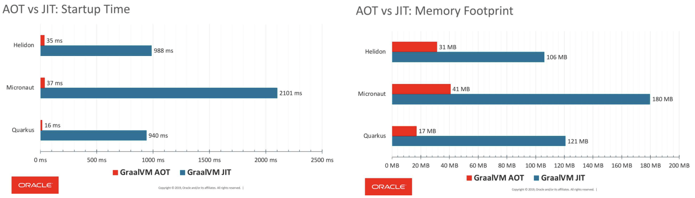
