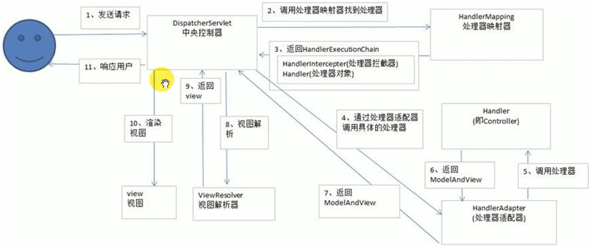

# 一、Spring MVC 概述
## <font style="color:red">4、Spring MVC 执行流程</font>



**DispatcherServlet** 封装了所有的 Servlet 程序，会拦截所有请求，然后将请求派发到各个 Servlet。

1.  以下：Handler = Controller 
2.  客户端将请求提交到 **<font style="color:#DF2A3F;">DispatcherServlet</font>**，调用 doDispatch() ； 
3.  DispatcherServlet 接收到请求后调用 **HandlerMapping**； 
4.  HandlerMapping 向 DispatcherServlet 返回 **HandlerExecutionChain**，包含所有的 HandlerIntercepter 和 Handler； 
5.  DispatcherServlet 通过 **HandlerAdapter** 调用具体的 Handler； 
6.  执行拦截器的 preHandle()； 
7.  执行目标方法； 
8.  目标方法执行后给 HandlerAdapter 返回 **ModelAndView**； 
9.  HandlerAdapter 将 ModelAndView 返回给 DispatcherServlet； 
10. 执行拦截器的 postHandle()； 
11. DispatcherServlet 将 ModelAndView 交给 **ViewResolver** 去解析； 
12. ViewResolver 向 DispatcherServlet 返回 View； 
13. DispatcherServlet 将模型数据填充到 View 中；（在 Controller 方法中 model.addAttribute()） 
14. DispatcherServlet 将视图响应给用户；（在Controller方法中 return "success"） 

我们只需知道：

1. 客户端将请求提交到 **<font style="color:#DF2A3F;">DispatcherServlet</font>**，调用 doDispatch() ； 
2. DispatcherServlet 遍历所有**处理器映射器 (HandlerMapping)**，根据请求 url 找到处理当前请求的 HandlerMethod 以及 HandlerInterceptor，并封装成**处理器执行链 HandlerExecutionChain**； 
3. 遍历所有**处理器适配器 (HandlerAdapter)**，看哪个 HandlerAdapter 能 support 这个 HandlerMethod； 
4. 执行拦截器的 preHandle()； 
5. HandlerAdapter 执行目标方法，并将 **ModelAndView** 返回给 DispatcherServlet；  
   5.1 如果有异常，则调用**异常解析器 (HandlerExceptionResolver)** 处理异常；  
   5.2 如果没有异常，执行拦截器的 postHandle()； 
6. DispatcherServlet 将 ModelAndView 交给 **ViewResolver** 去解析，得到 view；DispatcherServlet 将数据渲染到 view 中； 
7. 执行拦截器的 afterCompletion()； 


# 二、@RequestMapping  
## 1、作用
1. Spring MVC 使用 @RequestMapping 注解为控制器指定可以处理哪些 URL 请求。 
2. DispatcherServlet 拦截请求后，通过控制器上 @RequestMapping 提供的映射信息确定请求所对应的处理方法。 
3. @RequestMapping 可以标记在方法上，也可以标记在在类上。 

## 2、@RequestMapping 参数 
```java
语法：@RequestMapping(value={}, method={}, params={}, headers={})
```

| 参数 | 说明 |
| :---: | :---: |
| value | 请求 URL |
| method | 请求方式 |
| params | 请求参数 |
| headers | 请求头 |


```java
/**
 * 1.参数 value：可接受一个字符串数组
 */

/**
 * 2.参数 method：可接受一个 RequestMethod 数组
 */

/**
 * 3.参数 param：可接受一个字符串数组
 * "param"：请求必须携带 param 参数
 * "!param"：请求不能携带 param 参数
 * "param = value"：请求必须携带 param 参数，且 param = value
 * "param != value"：请求必须携带 param 参数，且 param != value
 * 若请求 url 不满足 param 参数，则报 400
 */

/**
 * 4.参数 headers：可接受一个字符串数组
 * "header"：请求头必须携带 header 信息
 * "!header"：请求头不能携带 header 信息
 * "header = value"：请求头必须携带 header 信息，且 header = value
 * "header != value"：请求头必须携带 header 信息，且 header != value
 * 若请求 url 不满足 headers 参数，则报 404
 */

// 如：请求参数中必须包含 "username" 和 "age"，且 age! = 10；请求头必须是 "Accept-Language=en-US,zh;q=0.8"。
@RequestMapping(value = {"/login", "/login.html"},
                method = {RequestMethod.GET, RequestMethod.POST},
                params = {"username", "age!=10"}, 
                headers = {"Accept-Language=en-US,zh;q=0.8"})

// @RequestMapping 可简写为：
@GetMapping
@PostMapping
@PutMapping
@DeleteMapping
```

## 3、Ant 路径风格
| 占位符 | 说明 |
| :---: | :---: |
| ? | 匹配文件名中的一个字符 |
| * | 匹配文件名中的任意字符 |
| ** | 匹配多层路径，** 不能放在路径末尾 |


```xml
Spring MVC 支持 Ant 风格的 URL：
1./user/*/createUser： 可匹配 /user/aaa/createUser、/user/bbb/createUser 等 URL；
2./user/**/createUser：可匹配 /user/createUser、/user/aaa/bbb/createUser 等 URL；
3./user/createUser??： 可匹配 /user/createUseraa、/user/createUserbb 等 URL。
```

## 4、REST风格
> +  传统传参方式：?param1 = value1 & param2 = value2； 
> +  REST 风格传参方式：用 / 分割，允许 URL 相同，通过请求方式来区分。 
>

| 请求方式 | 说明 | 举例 |
| :---: | :---: | :---: |
| GET | 获取资源 | /user/1 |
| POST | 新建资源 | /user |
| PUT | 更新资源 | /user/1 |
| DELETE | 删除资源 | /user |


## 5、HiddenHttpMethodFilter
> 浏览器只支持 GET、POST 请求，但 SpringMVC 提供的 **HiddenHttpMethodFilter** 可将 POST 请求转换为 DELETE 或 PUT 请求；
>
> 要求： 
>
> + 前端请求方式必须为 POST；
> + 请求参数必须有 _method；
>

```html
<form action="/test" method="POST">
    <input type="hidden" name="_method" value="PUT/DELETE">
    <input type="submit" value="提交">
</form>
```


# 三、获取请求参数
## 1、Handler 形参获取请求参数
> 要求：
>
> +  前端以 URL 拼接的方式传递请求参数； 
> +  前端传送的参数名和 Handler 形参名必须相同； 
> +  若前端传了多个同名的参数，则 Handler 可用 String[] 或 String 接收；若用 String 接收，则结果为多个数据用逗号拼接。 
>

```java
@PostMapping("/login")
public String login(String username, String password){}
```

## 2、@RequestParam
> 要求：前端以 URL 拼接的方式传递请求参数；
>
> 用于请求参数映射到 Handler 的形参。
>

```java
/**
 * value: 参数名；
 * required: 参数是否必须存在，默认为true；
 * defaultValue: 设置默认值，不传参或传参为 "" 时使用该值。
 */
@PostMapping("/login")
public String login(@RequestParam(value = "name") String username,
    				@RequestParam(value = "pwd", required = false, defaultValue = "0") String password) {}

// 或直接用Map接收，但必须是Map<String, String>
@PostMapping("/login")
public String login(@RequestParam Map<String, String> map) {
    map.get("");
    ......
}
// @PathVariable、@RequestHeader也可用Map<String, String>接收
```

## 3、@RequestHeader
```java
// 了解，用法同 @RequestParam。只能拿到某一个请求头，不能获取全部
@RequestMapping(value="/test")
public String test(@RequestHeader(value="Accept-Language", required=false, defaultValue="0") String al) {}
```

## 4、@CookieValue
```java
// 了解，用法同 @RequestParam
@RequestMapping("/test")
public String test(@CookieValue(value="JSESSIONID", required=false, defaultValue="0") String sessionId) {}
```

## 5、POJO接收参数
> 只要请求参数名和 POJO 属性名相同，就会自动为 POJO 填充属性值，且支持级联属性。
>

```html
<form action="/test" method="POST">
    username: <input type="text" name="username"/><br>
    password: <input type="password" name="password"/><br>
    city:     <input type="text" name="address.city"/><br>  <!-- 支持级联属性 -->
    <input type="submit" value="提交"/>
</form>
```

```java
@RequestMapping("/test")
public String test(User user) {}
```


# 五、处理 Json
## 1、JS 和 Json
```javascript
var obj = {a: 'Hello', b: 'World'};        // 这是一个对象，注意键名也是可以使用引号包裹的
var json = '{"a": "Hello", "b": "World"}'; // 这是一个 JSON 字符串，本质是一个字符串

var obj = JSON.parse('{"a": "Hello", "b": "World"}'); // Json 转 JS 对象，结果是 {a: 'Hello', b: 'World'}

var json = JSON.stringify({a: 'Hello', b: 'World'});  // JS 对象转 Json，结果是 '{"a": "Hello", "b": "World"}'
```

## 2、FastJson
```xml
<dependency>
    <groupId>com.alibaba</groupId>
    <artifactId>fastjson</artifactId>
    <version>1.2.60</version>
</dependency>
```

```java
public class FastJsonDemo {
    public static void main(String[] args) {
        //创建一个对象
        User user1 = new User("1号", 1);
        User user2 = new User("2号", 2);
        User user3 = new User("3号", 3);
        User user4 = new User("4号", 4);
        List<User> list = new ArrayList<>();
        list.add(user1);
        list.add(user2);
        list.add(user3);
        list.add(user4);

        // Java 对象转 JSON 字符串
        String str1 = JSON.toJSONString(user1);
        String str2 = JSON.toJSONString(list);

        // JSON 字符串转 Java 对象
        User user11 = JSON.parseObject(str1, User.class);

        // Java 对象转 JSON 字符串
        JSONObject jsonObject1 = (JSONObject) JSON.toJSON(user1);
        System.out.println(jsonObject1.getString("name"));

 		// JSON 字符串转 Java 对象
        User user111 = JSON.toJavaObject(jsonObject1, User.class);
    }
}
```

## 3、HttpMessageConverter<T>
> HttpMessageConverter<T>（报文信息转换器）：负责将请求报文转换为 T 类型的 Java 对象，或将 T 类型的 Java 对象转换为响应报文；
>
> HttpMessageConverter<T> 提供了两个注解和两个类型：@RequestBody，@ResponseBody，RequestEntity，ResponseEntity。
>
> 当 Handler 使用 @RequestBody，@ResponseBody，RequestEntity，ResponseEntity 时，就不走视图解析器了，而是由 HttpMessageConverter 专门处理。
>

## 4、@RequestBody
> 注意：@RequestBody 只能和 @PostMapping 配合使用 
>

```html
<form action="test" method="post">
    <input type="text" name="username" value="tomcat">
    <input type="text" name="password" value="123456">
    <input type="submit">
</form>
```

```java
// GET请求没有请求体，不能用该注解。POST、PUT、DELETE请求都有请求体。一个 Handler 只能有一个 @RequestBody
@RequestMapping(value="/test")
public String test(@RequestBody String body){
    // 输出username=tomcat&password=123456
    // 对应于GET请求：http://localhost:8080/test?username=tomcat&password=123456
    System.out.println("body："+ body);	
    return "success";
}
```

## 5、@ResponseBody
> 在 Controller 的类上或方法上标注 @ResponseBody，则不会通过视图解析器，即：方法不进行页面跳转，只返回 Json 数据。
>
> @RestController = @Controller + @ResponseBody。 
>

## 6、RequestEntity<T>
> RequestEntity 封装了请求报文，包含 "请求头 + 请求体"。
>

```java
// 功能比 @RequestHeader 和 @RequestBody 强大，能获得所有请求头 + 请求体
@RequestMapping("/test")
public String test(RequestEntity<String> requestEntity){
    System.out.println(requestEntity.getHeaders());
    System.out.println(requestEntity.getBody());
    return "success";
}
```

## 7、ResponseEntity<T>
```java
// 自定义响应头 + 响应体
@ResponseBody
@RequestMapping("/test")
public ResponseEntity<String> test() {
    MultiValueMap<String, String> headers = new HttpHeaders();
    String body = "<h1>666</h1>";
    headers.add("cookie", "username=tomcat");
    return new ResponseEntity<String> (body, headers, HttpStatus.OK);
}
```


# 六、文件上传和下载
## 1、文件上传
```html
<form method="post" action="/upload" enctype="multipart/form-data">
    <input type="file" name="file"> <br>
    <input type="submit" value="提交">
</form>
```

 

```html
<form method="post" action="/upload" enctype="multipart/form-data">
    <input type="file" name="fileNames" multiple> <br>
    <input type="submit" value="提交">
</form>
```

## 1、文件下载
> ResponseEntity 实现文件下载：
>

```java
@RequestMapping("/download")
public ResponseEntity<byte[]> download(HttpSession session) throws IOException {
    // 创建输入流
    InputStream is = new FileInputStream("/static/img/1.jpg");
    // 创建字节数组
    byte[] bytes = new byte[is.available()];
    // 将流读到字节数组中
    is.read(bytes);
    // 创建HttpHeaders对象设置响应头信息
    MultiValueMap<String, String> headers = new HttpHeaders();
    // 设置要下载方式以及下载文件的名字
    headers.add("Content-Disposition", "attachment;filename=1.jpg");
    // 设置响应状态码
    HttpStatus statusCode = HttpStatus.OK;
    // 创建 ResponseEntity 对象
    ResponseEntity<byte[]> responseEntity = new ResponseEntity<>(bytes, headers, statusCode);
    // 关闭输入流
    is.close();
    return responseEntity;
}
```


# 七、拦截器
> 过滤器：属于 JavaWeb，交由 Tomcat 管理；
>
> 拦截器：属于 Spring MVC，交由 IOC 容器管理，若脱离 Spring MVC，则不能使用拦截器；
>
> 拦截器 是 过滤器 的升级版。
>

```java
public class MyInterceptor implements HandlerInterceptor {

    // 在 Handler 执行之前执行，若返回 true 则放行，若返回 false 则不放行
    public boolean preHandle(HttpServletRequest httpServletRequest, HttpServletResponse httpServletResponse, Object o) throws Exception {
        System.out.println("------------处理前------------");
        return true;
    }

    // 在 Handler 执行之后执行
    public void postHandle(HttpServletRequest httpServletRequest, HttpServletResponse httpServletResponse, Object o, ModelAndView modelAndView) throws Exception {
        System.out.println("------------处理后------------");
    }

    // 在 dispatcherServlet 执行完后执行，做清理工作。即：请求处理完成之后/资源响应后/目标页面渲染后 才执行
    public void afterCompletion(HttpServletRequest httpServletRequest, HttpServletResponse httpServletResponse, Object o, Exception e) throws Exception {
        System.out.println("-------------清理-------------");
    }
}
```

```xml
<mvc:interceptors>
    <!-- 配置拦截器（会拦截所有请求） -->
    <bean id="MyInterceptor" class="com.atguigu.interceptors.MyInterceptor"/>
</mvc:interceptors>
```

```xml
<!-- 配置拦截路径 -->
<mvc:interceptors>
    <mvc:interceptor>
        <!-- /** 包括路径及其子路径 -->
        <!-- /admin/* 只会拦截 /admin/add，不会拦截 /admin/add/user -->
        <!-- /admin/** 拦截的是/admin/下的所有 -->
        <mvc:mapping path="/**"/>
    	<bean id="MyInterceptor" class="com.atguigu.interceptors.MyInterceptor"></bean>
    </mvc:interceptor>
</mvc:interceptors>
```

```xml
单个拦截器的执行流程：
1. preHandle() 
2. 目标方法
3. postHandle()
4. 渲染目标页面
5. afterCompletion()
注：只要 preHandle() 不放行就没有后续流程；只要放行了，不管中途出什么异常，afterCompletion() 都会执行。

多个拦截器的执行流程：
preHandle()：顺序执行
postHandle()：逆序执行
afterCompletion()：逆序执行
多个拦截器的顺序与其在xml中配置的顺序相同
1. Interceptor1::preHandle()
2. Interceptor2::preHandle()
3. 目标方法
4. Interceptor2::postHandle()
5. Interceptor1::postHandle()
6. 渲染目标页面
7. Interceptor2::afterCompletion()
8. Interceptor1::afterCompletion()
注：不管哪个拦截器的 preHandle() 不放行，就没有其后续流程。只要某个拦截器放行了，则其 afterCompletion() 一定会执行。
```


# 八、异常处理器
> Spring MVC 提供了异常处理器 HandlerExceptionResolver，用于处理 Handler 执行过程中所出现的异常； 
>
> HandlerExceptionResolver 是一个接口，其实现类有：DefaultHandlerExceptionResolver、SimpleMappingExceptionResolver；
>

```java
@ControllerAdvice	// 将当前类标识为异常处理组件
public class ExceptionController {

    @ExceptionHandler(ArithmeticException.class)	// 设置该方法要处理的异常
    public String handleArithmeticException(Exception e, Model model){	// e 为 Handler 中出现的异常对象
        model.addAttribute("e", e);
        return "error";
    }
}
```

